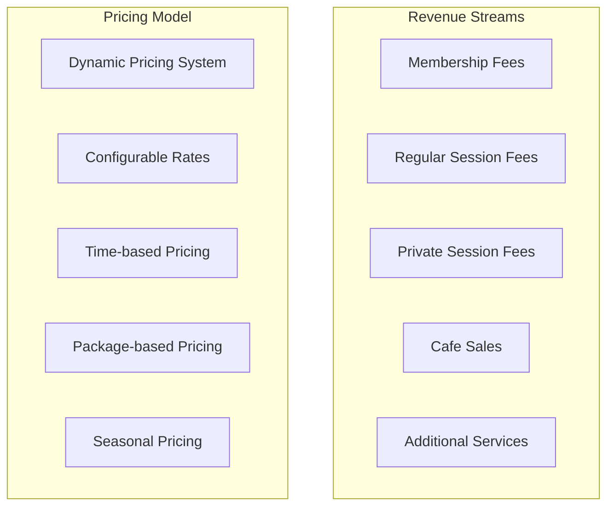
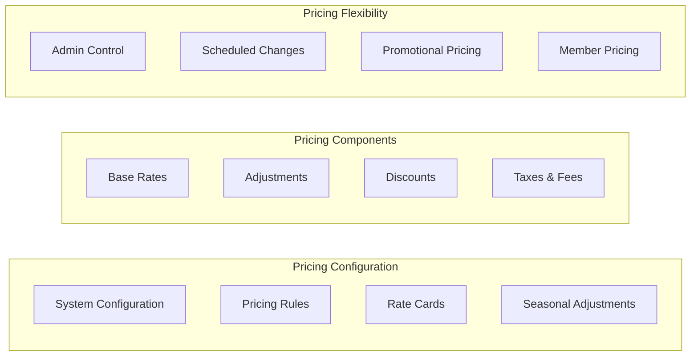
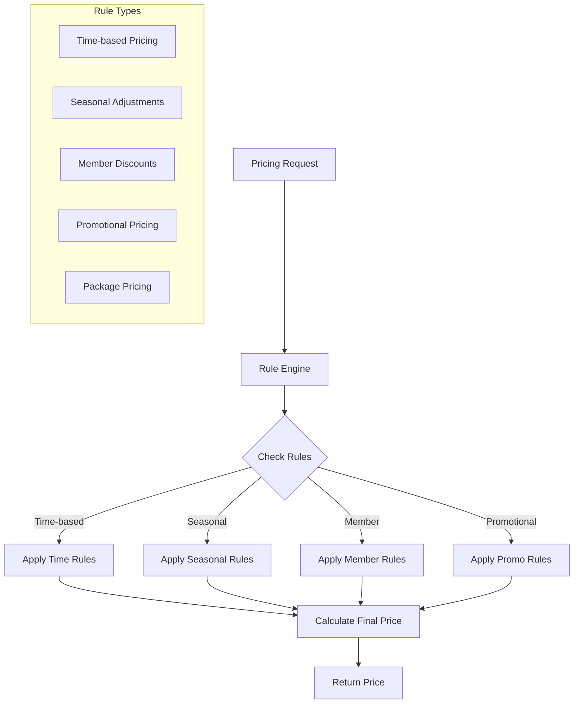
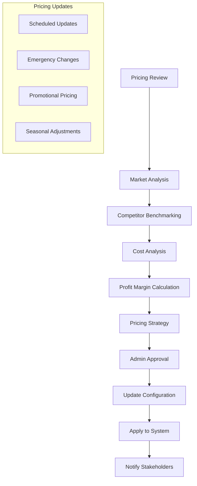
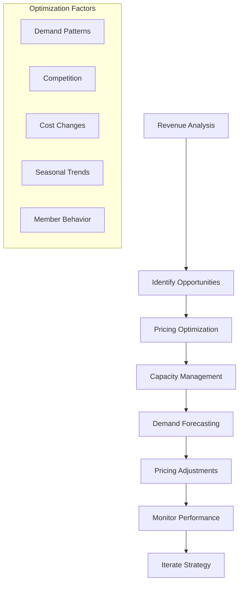
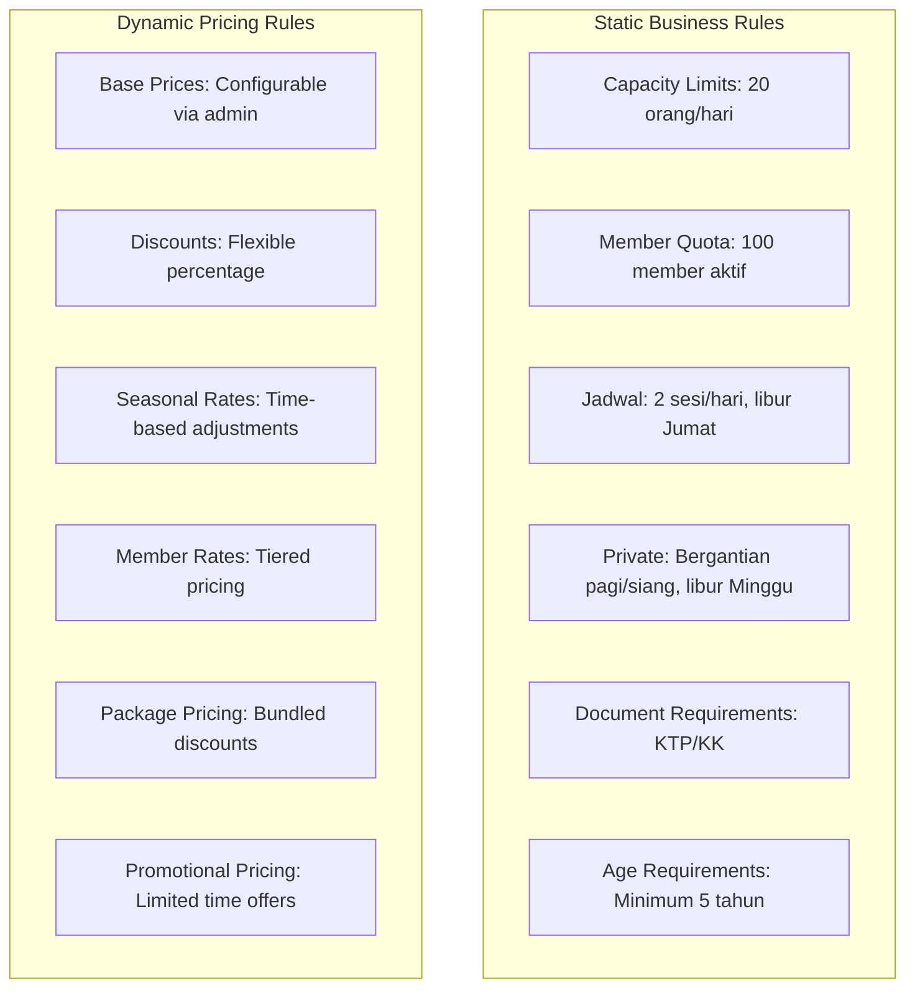
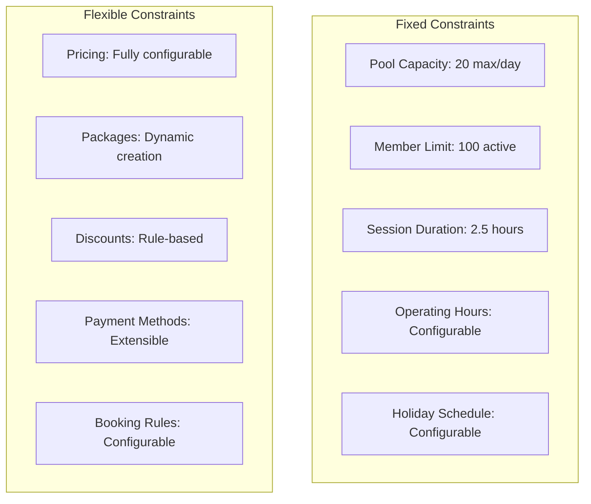
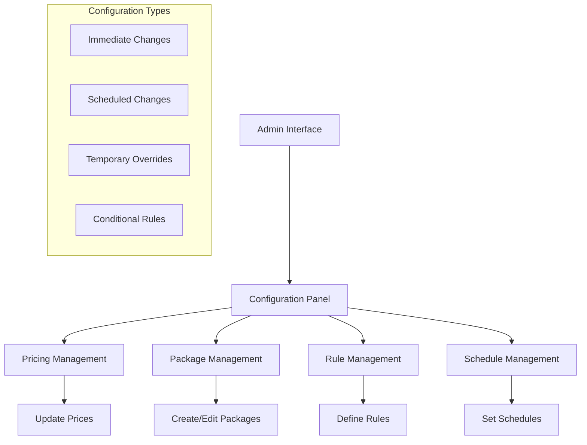
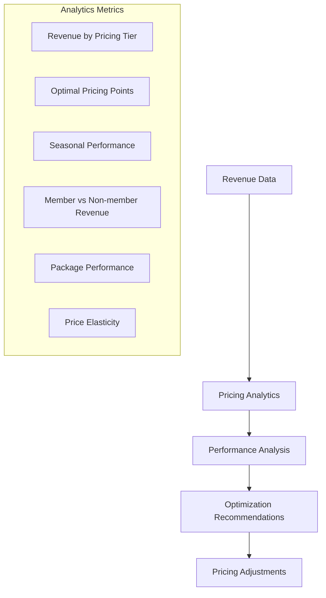
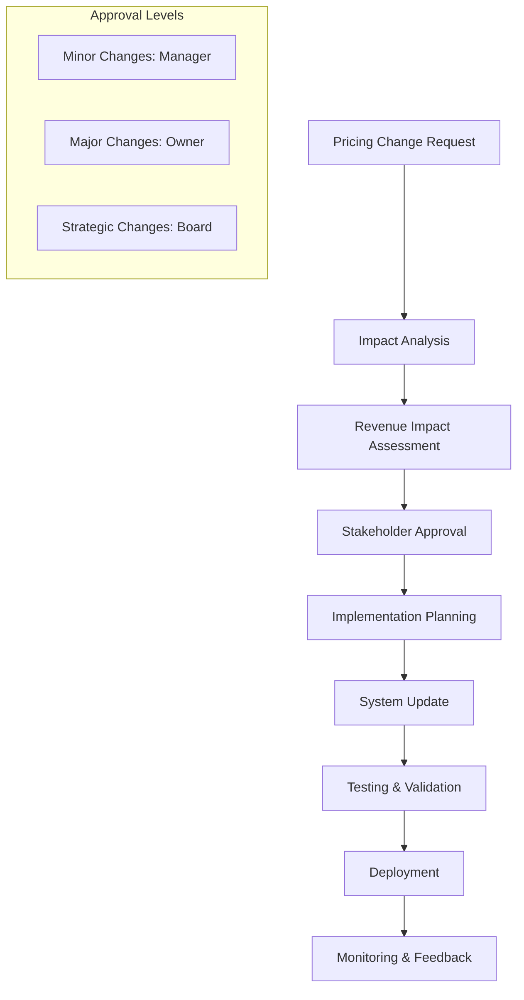

# Analisa Domain dan Bisnis - Sistem Kolam Renang Syariah

## 1. Model Bisnis

### 1.1 Revenue Streams



### 1.2 Dynamic Pricing Configuration



## 2. Dynamic Pricing Structure

### 2.1 Configurable Pricing Categories

```json
{
  "pricing_configuration": {
    "membership_packages": {
      "monthly": {
        "base_price": "configurable",
        "duration_days": 30,
        "max_adults": 3,
        "max_children": 2,
        "description": "Monthly membership package"
      },
      "quarterly": {
        "base_price": "configurable",
        "duration_days": 90,
        "max_adults": 3,
        "max_children": 2,
        "discount_percentage": "configurable",
        "description": "Quarterly membership package with discount"
      }
    },
    "session_types": {
      "regular_weekday": {
        "adult_price": "configurable",
        "child_price": "configurable",
        "description": "Regular session on weekdays"
      },
      "regular_weekend": {
        "adult_price": "configurable",
        "child_price": "configurable",
        "description": "Regular session on weekends"
      }
    },
    "private_packages": {
      "silver": {
        "base_price": "configurable",
        "duration_hours": 1.5,
        "max_adults": 5,
        "max_children": 5,
        "description": "Private session silver package"
      },
      "gold": {
        "base_price": "configurable",
        "duration_hours": 3,
        "max_adults": 10,
        "max_children": 10,
        "description": "Private session gold package"
      }
    }
  }
}
```

### 2.2 Pricing Rules Engine



## 3. Business Processes

### 3.1 Dynamic Pricing Management Process



### 3.2 Revenue Optimization Process



## 4. Business Rules and Constraints

### 4.1 Pricing Business Rules



### 4.2 Configuration Management Rules

| Rule Category        | Description             | Change Frequency   | Approval Required |
| -------------------- | ----------------------- | ------------------ | ----------------- |
| Base Pricing         | Core rates for services | Quarterly/Annually | Owner/Manager     |
| Seasonal Adjustments | Peak/off-peak pricing   | Monthly            | Manager           |
| Promotional Pricing  | Special offers          | As needed          | Manager           |
| Package Pricing      | Membership bundles      | Quarterly          | Owner             |
| Discount Rules       | Percentage discounts    | Monthly            | Manager           |
| Tax Configuration    | Tax rates and rules     | As per regulation  | Legal             |

### 4.3 Operational Constraints



## 5. Dynamic Configuration System

### 5.1 Configuration Management



### 5.2 Pricing Configuration Interface

```json
{
  "pricing_interface": {
    "base_pricing": {
      "regular_sessions": {
        "weekday_adult": "configurable_field",
        "weekday_child": "configurable_field",
        "weekend_adult": "configurable_field",
        "weekend_child": "configurable_field"
      },
      "private_sessions": {
        "silver_base": "configurable_field",
        "gold_base": "configurable_field"
      },
      "membership_packages": {
        "monthly_base": "configurable_field",
        "quarterly_base": "configurable_field",
        "quarterly_discount": "configurable_field"
      }
    },
    "adjustments": {
      "seasonal_rates": "configurable_percentage",
      "member_discounts": "configurable_percentage",
      "promotional_rates": "configurable_percentage"
    },
    "rules": {
      "minimum_booking": "configurable_value",
      "cancellation_policy": "configurable_hours",
      "payment_terms": "configurable_days"
    }
  }
}
```

## 6. Revenue Tracking and Analytics

### 6.1 Dynamic Revenue Metrics



### 6.2 Pricing Performance Dashboard

| Metric                      | Description                        | Update Frequency | Action Trigger        |
| --------------------------- | ---------------------------------- | ---------------- | --------------------- |
| Average Revenue per Session | Total revenue / Number of sessions | Daily            | < Target threshold    |
| Member Utilization Rate     | Active members / Total capacity    | Weekly           | < 80% utilization     |
| Price Elasticity            | Revenue change / Price change      | Monthly          | Elastic > -1          |
| Competitive Position        | Price vs competitors               | Quarterly        | Higher than market    |
| Seasonal Trends             | Revenue patterns by season         | Monthly          | Significant deviation |

## 7. Implementation Guidelines

### 7.1 Configuration Database Design

```sql
-- Pricing configuration tables
CREATE TABLE pricing_config (
    config_id INT PRIMARY KEY AUTO_INCREMENT,
    config_name VARCHAR(100) NOT NULL,
    config_value DECIMAL(10,2) NOT NULL,
    config_type ENUM('base_price', 'discount', 'adjustment', 'rule') NOT NULL,
    category VARCHAR(50) NOT NULL,
    effective_date DATE NOT NULL,
    expiry_date DATE NULL,
    created_by INT NOT NULL,
    created_at TIMESTAMP DEFAULT CURRENT_TIMESTAMP,
    updated_at TIMESTAMP DEFAULT CURRENT_TIMESTAMP ON UPDATE CURRENT_TIMESTAMP
);

CREATE TABLE pricing_rules (
    rule_id INT PRIMARY KEY AUTO_INCREMENT,
    rule_name VARCHAR(100) NOT NULL,
    rule_type ENUM('time_based', 'seasonal', 'member', 'promotional') NOT NULL,
    rule_condition JSON NOT NULL,
    rule_action JSON NOT NULL,
    is_active BOOLEAN DEFAULT TRUE,
    priority INT DEFAULT 0,
    created_at TIMESTAMP DEFAULT CURRENT_TIMESTAMP
);
```

### 7.2 Pricing API Endpoints

```javascript
// Pricing configuration endpoints
GET /api/pricing/config - Get current pricing configuration
PUT /api/pricing/config - Update pricing configuration
POST /api/pricing/calculate - Calculate price for booking
GET /api/pricing/history - Get pricing change history

// Example pricing calculation
POST /api/pricing/calculate
{
  "session_type": "regular",
  "date": "2025-09-30",
  "time": "morning",
  "adult_count": 2,
  "child_count": 1,
  "member_id": "M001"
}

Response:
{
  "base_price": 65000,
  "member_discount": 5000,
  "seasonal_adjustment": 0,
  "final_price": 60000,
  "breakdown": {...}
}
```

## 8. Change Management Process

### 8.1 Pricing Change Workflow



### 8.2 Communication Plan

| Change Type          | Communication Channel       | Audience            | Timeline       |
| -------------------- | --------------------------- | ------------------- | -------------- |
| Base Price Changes   | Email + SMS                 | All members         | 2 weeks notice |
| Promotional Pricing  | Social media + App          | Potential customers | 1 week notice  |
| Package Changes      | Email + In-app notification | Active members      | 1 month notice |
| Seasonal Adjustments | Website + App               | All users           | 2 weeks notice |

---

**Versi**: 1.3  
**Tanggal**: 26 Agustus 2025  
**Status**: Complete dengan Dynamic Pricing, Guest Booking, Google SSO, Mobile-First Web App, Core Booking Flow, Manual Payment, Dynamic Member Quota & Member Daily Swimming Limit  
**Berdasarkan**: PDF Raujan Pool Syariah
