# Analisa Fitur dan Modul - Sistem Kolam Renang Syariah

## 1. Modul Manajemen Member

### 1.1 Fitur Pendaftaran Member

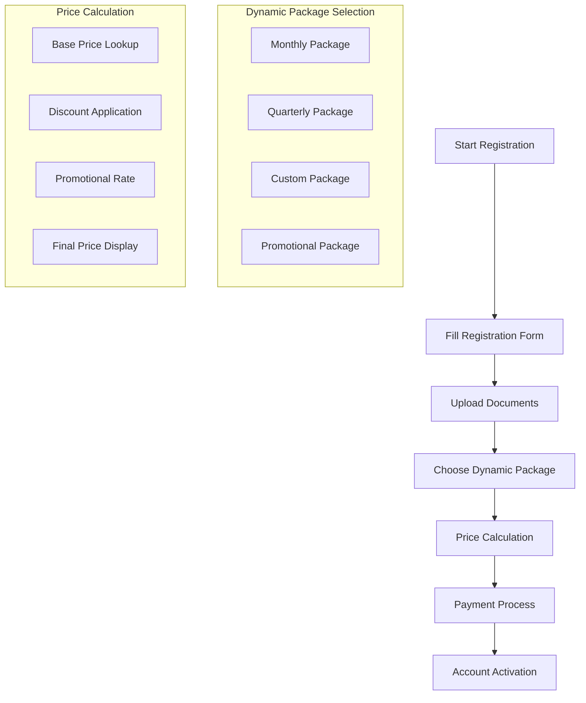
```mermaid
graph TD
    A[Start Registration] --> B[Fill Registration Form]
    B --> C[Upload Documents]
    C --> D[Choose Dynamic Package]
    D --> E[Price Calculation]
    E --> F[Payment Process]
    F --> G[Account Activation]

    subgraph "Dynamic Package Selection"
        P1[Monthly Package]
        P2[Quarterly Package]
        P3[Custom Package]
        P4[Promotional Package]
    end

    subgraph "Price Calculation"
        C1[Base Price Lookup]
        C2[Discount Application]
        C3[Promotional Rate]
        C4[Final Price Display]
    end
```

#### 1.1.1 Dynamic Registration Features

- **Flexible Package Selection**: Member dapat memilih dari berbagai paket yang dapat dikonfigurasi
- **Real-time Price Calculation**: Harga dihitung secara real-time berdasarkan konfigurasi terbaru
- **Promotional Pricing**: Sistem mendukung harga promosi yang dapat diatur
- **Package Customization**: Admin dapat membuat paket khusus sesuai kebutuhan
- **Dynamic Discounts**: Diskon dapat diterapkan berdasarkan berbagai kriteria

### 1.2 Fitur Manajemen Profile

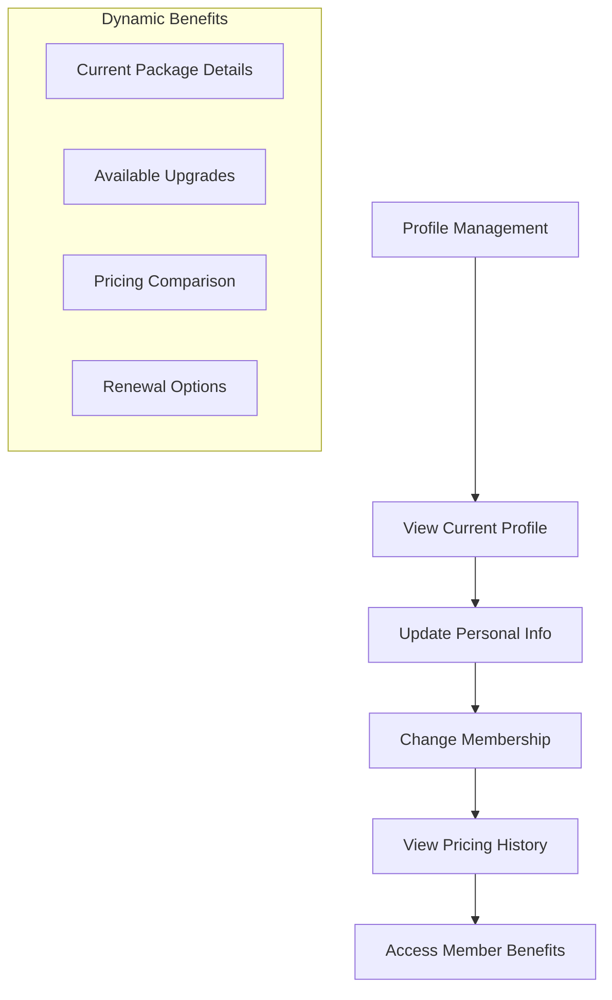
```mermaid
graph TD
    A[Profile Management] --> B[View Current Profile]
    B --> C[Update Personal Info]
    C --> D[Change Membership]
    D --> E[View Pricing History]
    E --> F[Access Member Benefits]

    subgraph "Dynamic Benefits"
        B1[Current Package Details]
        B2[Available Upgrades]
        B3[Pricing Comparison]
        B4[Renewal Options]
    end
```

## 2. Modul Reservasi dan Booking

### 2.1 Core Booking Flow System

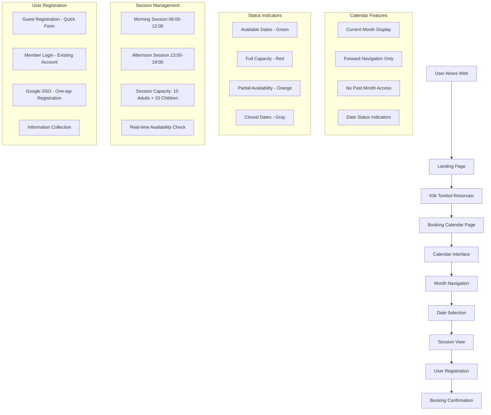
```mermaid
graph TD
    A[User Akses Web] --> B[Landing Page]
    B --> C[Klik Tombol Reservasi]
    C --> D[Booking Calendar Page]

    D --> E[Calendar Interface]
    E --> F[Month Navigation]
    F --> G[Date Selection]
    G --> H[Session View]
    H --> I[User Registration]
    I --> J[Booking Confirmation]

    subgraph "Calendar Features"
        CF1[Current Month Display]
        CF2[Forward Navigation Only]
        CF3[No Past Month Access]
        CF4[Date Status Indicators]
    end

    subgraph "Status Indicators"
        SI1[Available Dates - Green]
        SI2[Full Capacity - Red]
        SI3[Partial Availability - Orange]
        SI4[Closed Dates - Gray]
    end

    subgraph "Session Management"
        SM1[Morning Session 06:00-12:00]
        SM2[Afternoon Session 13:00-19:00]
        SM3[Session Capacity: 10 Adults + 10 Children]
        SM4[Real-time Availability Check]
    end

    subgraph "User Registration"
        UR1[Guest Registration - Quick Form]
        UR2[Member Login - Existing Account]
        UR3[Google SSO - One-tap Registration]
        UR4[Information Collection]
    end
```

### 2.2 Detailed Calendar Interface

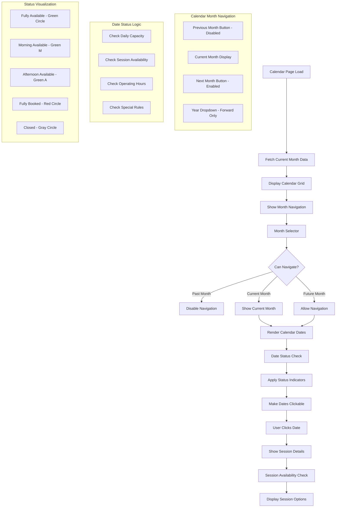
```mermaid
graph TD
    A[Calendar Page Load] --> B[Fetch Current Month Data]
    B --> C[Display Calendar Grid]
    C --> D[Show Month Navigation]

    D --> E[Month Selector]
    E --> F{Can Navigate?}
    F -->|Past Month| G[Disable Navigation]
    F -->|Current Month| H[Show Current Month]
    F -->|Future Month| I[Allow Navigation]

    H --> J[Render Calendar Dates]
    I --> J

    J --> K[Date Status Check]
    K --> L[Apply Status Indicators]
    L --> M[Make Dates Clickable]

    M --> N[User Clicks Date]
    N --> O[Show Session Details]
    O --> P[Session Availability Check]
    P --> Q[Display Session Options]

    subgraph "Calendar Month Navigation"
        CMN1[Previous Month Button - Disabled]
        CMN2[Current Month Display]
        CMN3[Next Month Button - Enabled]
        CMN4[Year Dropdown - Forward Only]
    end

    subgraph "Date Status Logic"
        DSL1[Check Daily Capacity]
        DSL2[Check Session Availability]
        DSL3[Check Operating Hours]
        DSL4[Check Special Rules]
    end

    subgraph "Status Visualization"
        SV1[Fully Available - Green Circle]
        SV2[Morning Available - Green M]
        SV3[Afternoon Available - Green A]
        SV4[Fully Booked - Red Circle]
        SV5[Closed - Gray Circle]
    end
```

### 2.3 Session Selection Flow

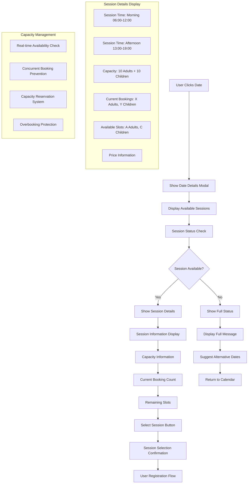
```mermaid
graph TD
    A[User Clicks Date] --> B[Show Date Details Modal]
    B --> C[Display Available Sessions]
    C --> D[Session Status Check]
    D --> E{Session Available?}

    E -->|Yes| F[Show Session Details]
    E -->|No| G[Show Full Status]

    F --> H[Session Information Display]
    H --> I[Capacity Information]
    I --> J[Current Booking Count]
    J --> K[Remaining Slots]
    K --> L[Select Session Button]

    G --> M[Display Full Message]
    M --> N[Suggest Alternative Dates]
    N --> O[Return to Calendar]

    L --> P[Session Selection Confirmation]
    P --> Q[User Registration Flow]

    subgraph "Session Details Display"
        SDD1[Session Time: Morning 06:00-12:00]
        SDD2[Session Time: Afternoon 13:00-19:00]
        SDD3[Capacity: 10 Adults + 10 Children]
        SDD4[Current Bookings: X Adults, Y Children]
        SDD5[Available Slots: A Adults, C Children]
        SDD6[Price Information]
    end

    subgraph "Capacity Management"
        CM1[Real-time Availability Check]
        CM2[Concurrent Booking Prevention]
        CM3[Capacity Reservation System]
        CM4[Overbooking Protection]
    end
```

### 2.4 User Registration Flow

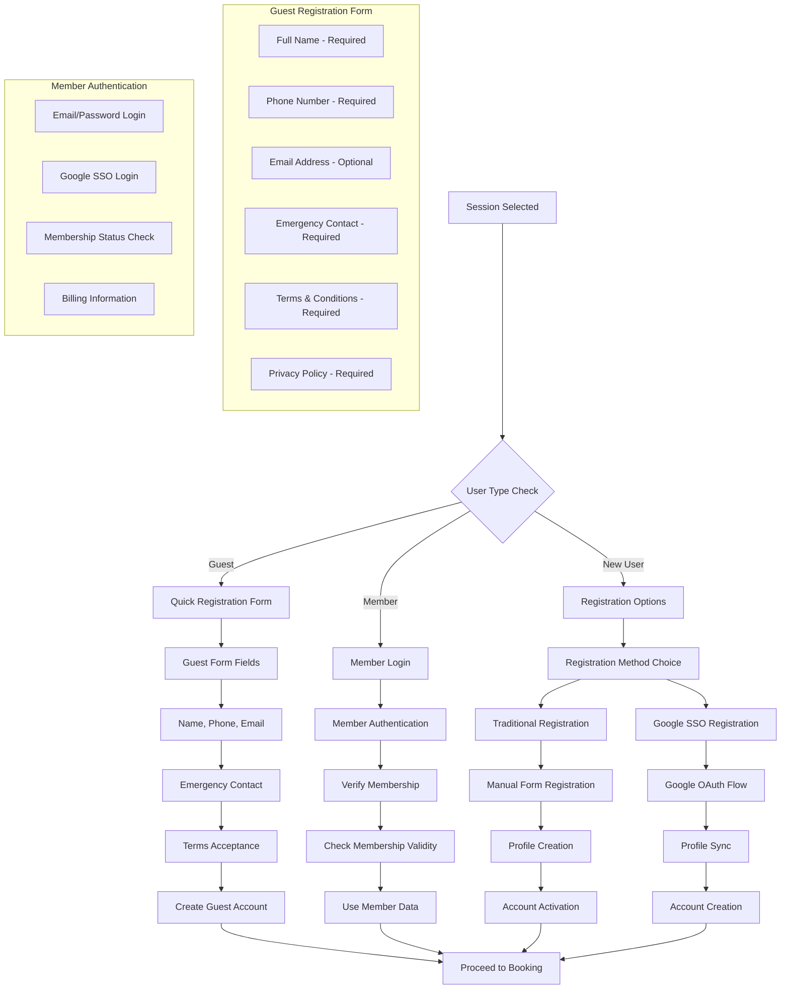
```mermaid
graph TD
    A[Session Selected] --> B{User Type Check}
    B -->|Guest| C[Quick Registration Form]
    B -->|Member| D[Member Login]
    B -->|New User| E[Registration Options]

    C --> F[Guest Form Fields]
    F --> G[Name, Phone, Email]
    G --> H[Emergency Contact]
    H --> I[Terms Acceptance]
    I --> J[Create Guest Account]

    D --> K[Member Authentication]
    K --> L[Verify Membership]
    L --> M[Check Membership Validity]
    M --> N[Use Member Data]

    E --> O[Registration Method Choice]
    O --> P[Traditional Registration]
    O --> Q[Google SSO Registration]

    P --> R[Manual Form Registration]
    R --> S[Profile Creation]
    S --> T[Account Activation]

    Q --> U[Google OAuth Flow]
    U --> V[Profile Sync]
    V --> W[Account Creation]

    J --> X[Proceed to Booking]
    N --> X
    T --> X
    W --> X

    subgraph "Guest Registration Form"
        GRF1[Full Name - Required]
        GRF2[Phone Number - Required]
        GRF3[Email Address - Optional]
        GRF4[Emergency Contact - Required]
        GRF5[Terms & Conditions - Required]
        GRF6[Privacy Policy - Required]
    end

    subgraph "Member Authentication"
        MA1[Email/Password Login]
        MA2[Google SSO Login]
        MA3[Membership Status Check]
        MA4[Billing Information]
    end
```

### 2.5 Booking Confirmation System

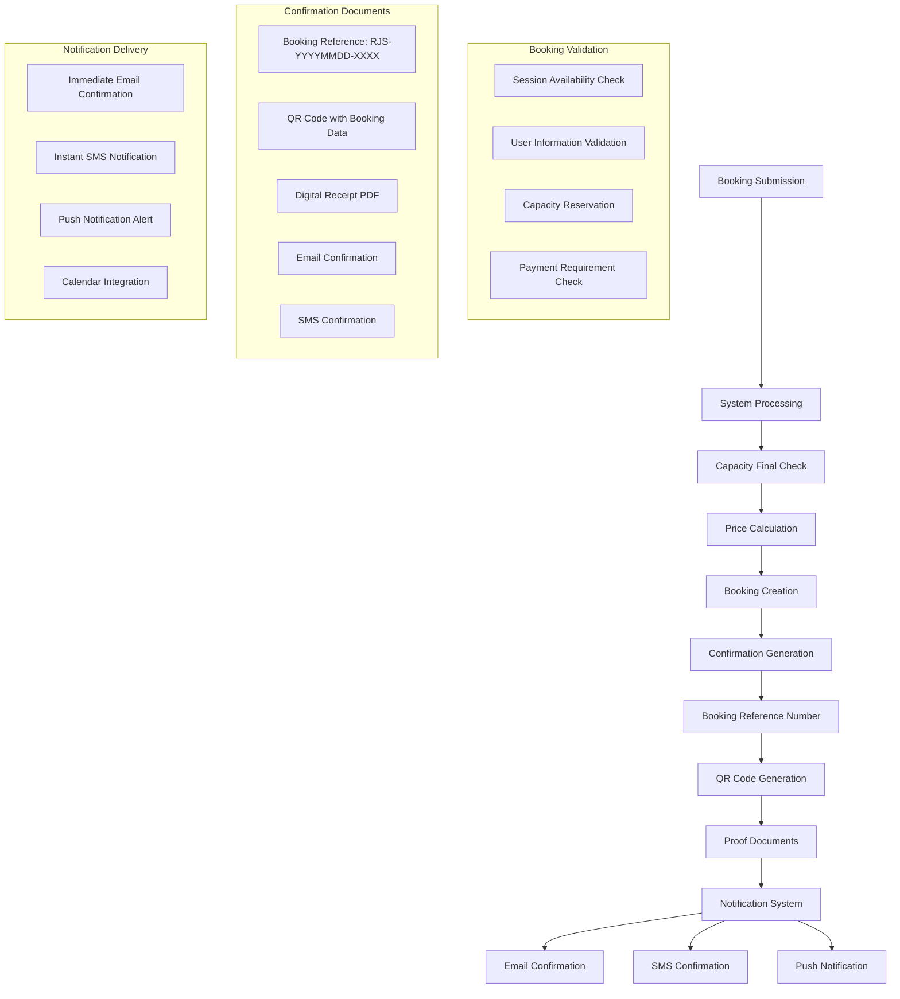
```mermaid
graph TD
    A[Booking Submission] --> B[System Processing]
    B --> C[Capacity Final Check]
    C --> D[Price Calculation]
    D --> E[Booking Creation]
    E --> F[Confirmation Generation]

    F --> G[Booking Reference Number]
    G --> H[QR Code Generation]
    H --> I[Proof Documents]
    I --> J[Notification System]

    J --> K[Email Confirmation]
    J --> L[SMS Confirmation]
    J --> M[Push Notification]

    subgraph "Booking Validation"
        BV1[Session Availability Check]
        BV2[User Information Validation]
        BV3[Capacity Reservation]
        BV4[Payment Requirement Check]
    end

    subgraph "Confirmation Documents"
        CD1[Booking Reference: RJS-YYYYMMDD-XXXX]
        CD2[QR Code with Booking Data]
        CD3[Digital Receipt PDF]
        CD4[Email Confirmation]
        CD5[SMS Confirmation]
    end

    subgraph "Notification Delivery"
        ND1[Immediate Email Confirmation]
        ND2[Instant SMS Notification]
        ND3[Push Notification Alert]
        ND4[Calendar Integration]
    end
```

### 2.6 Real-time Availability System

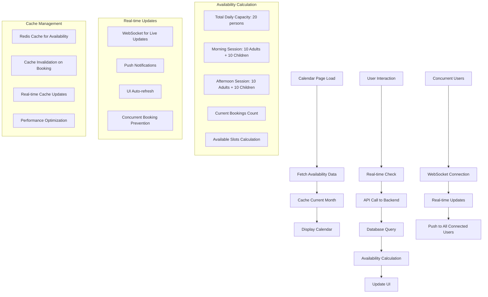
```mermaid
graph TD
    A[Calendar Page Load] --> B[Fetch Availability Data]
    B --> C[Cache Current Month]
    C --> D[Display Calendar]

    E[User Interaction] --> F[Real-time Check]
    F --> G[API Call to Backend]
    G --> H[Database Query]
    H --> I[Availability Calculation]
    I --> J[Update UI]

    K[Concurrent Users] --> L[WebSocket Connection]
    L --> M[Real-time Updates]
    M --> N[Push to All Connected Users]

    subgraph "Availability Calculation"
        AC1[Total Daily Capacity: 20 persons]
        AC2[Morning Session: 10 Adults + 10 Children]
        AC3[Afternoon Session: 10 Adults + 10 Children]
        AC4[Current Bookings Count]
        AC5[Available Slots Calculation]
    end

    subgraph "Real-time Updates"
        RTU1[WebSocket for Live Updates]
        RTU2[Push Notifications]
        RTU3[UI Auto-refresh]
        RTU4[Concurrent Booking Prevention]
    end

    subgraph "Cache Management"
        CM1[Redis Cache for Availability]
        CM2[Cache Invalidation on Booking]
        CM3[Real-time Cache Updates]
        CM4[Performance Optimization]
    end
```

### 2.7 Capacity Management Features

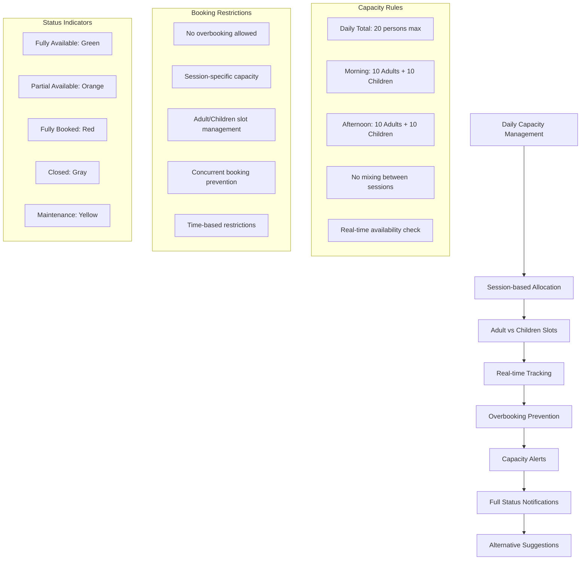
```mermaid
graph TD
    A[Daily Capacity Management] --> B[Session-based Allocation]
    B --> C[Adult vs Children Slots]
    C --> D[Real-time Tracking]
    D --> E[Overbooking Prevention]

    E --> F[Capacity Alerts]
    F --> G[Full Status Notifications]
    G --> H[Alternative Suggestions]

    subgraph "Capacity Rules"
        CR1[Daily Total: 20 persons max]
        CR2[Morning: 10 Adults + 10 Children]
        CR3[Afternoon: 10 Adults + 10 Children]
        CR4[No mixing between sessions]
        CR5[Real-time availability check]
    end

    subgraph "Booking Restrictions"
        BR1[No overbooking allowed]
        BR2[Session-specific capacity]
        BR3[Adult/Children slot management]
        BR4[Concurrent booking prevention]
        BR5[Time-based restrictions]
    end

    subgraph "Status Indicators"
        SI1[Fully Available: Green]
        SI2[Partial Available: Orange]
        SI3[Fully Booked: Red]
        SI4[Closed: Gray]
        SI5[Maintenance: Yellow]
    end
```

#### 2.7.1 Calendar Navigation Features

- **Forward-only Navigation**: User hanya bisa melihat bulan saat ini dan bulan-bulan ke depan
- **No Past Access**: Tidak bisa mengakses bulan-bulan yang sudah lewat
- **Current Month Default**: Default menampilkan bulan saat ini
- **Year Selection**: Dropdown untuk memilih tahun (hanya tahun sekarang dan ke depan)

#### 2.7.2 Date Status Features

- **Available Dates**: Tanggal dengan slot tersedia (hijau)
- **Full Capacity Dates**: Tanggal yang sudah penuh (merah)
- **Partial Availability**: Tanggal dengan slot terbatas (orange)
- **Closed Dates**: Tanggal tutup (abu-abu)
- **Real-time Updates**: Status update secara real-time

#### 2.7.3 Session Management Features

- **Morning Session**: 06:00-12:00 (10 dewasa + 10 anak)
- **Afternoon Session**: 13:00-19:00 (10 dewasa + 10 anak)
- **Session Status**: Tampil full/available per sesi
- **Capacity Display**: Tampilkan jumlah slot tersisa
- **Booking Count**: Tampilkan berapa yang sudah booking

#### 2.7.4 User Registration Features

- **Guest Registration**: Quick form untuk user baru
- **Member Login**: Login untuk member yang sudah ada
- **Google SSO**: One-tap registration dengan Google
- **Information Collection**: Nama, telepon, email, emergency contact
- **Terms Acceptance**: Wajib setuju terms & conditions

### 2.2 Booking Proof System

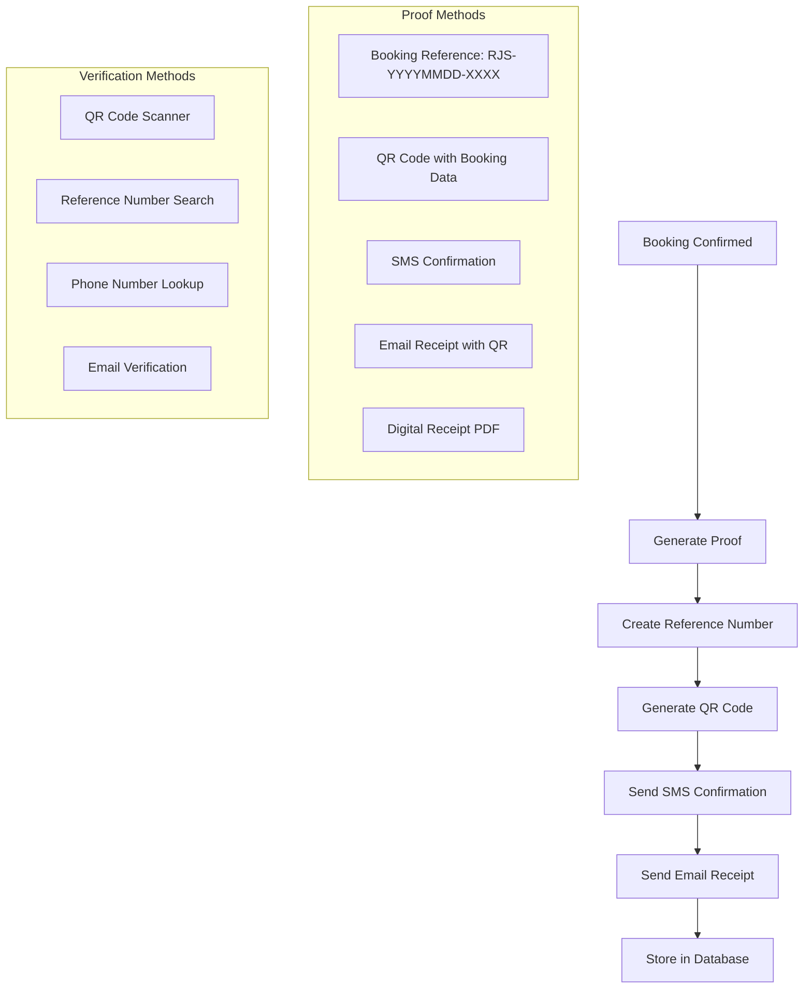
```mermaid
graph TD
    A[Booking Confirmed] --> B[Generate Proof]
    B --> C[Create Reference Number]
    C --> D[Generate QR Code]
    D --> E[Send SMS Confirmation]
    E --> F[Send Email Receipt]
    F --> G[Store in Database]

    subgraph "Proof Methods"
        P1[Booking Reference: RJS-YYYYMMDD-XXXX]
        P2[QR Code with Booking Data]
        P3[SMS Confirmation]
        P4[Email Receipt with QR]
        P5[Digital Receipt PDF]
    end

    subgraph "Verification Methods"
        V1[QR Code Scanner]
        V2[Reference Number Search]
        V3[Phone Number Lookup]
        V4[Email Verification]
    end
```

#### 2.3.1 Guest Proof Features

- **Unique Reference Number**: Format RJS-YYYYMMDD-XXXX
- **QR Code Generation**: Contains booking data untuk verification
- **SMS Confirmation**: Immediate proof via phone
- **Email Receipt**: Detailed confirmation dengan QR code
- **Digital Receipt**: PDF format untuk professional look
- **Multiple Verification**: Staff bisa verify dengan berbagai cara

#### 2.3.2 Staff Verification Interface

- **QR Code Scanner**: Fast verification dengan scan
- **Reference Search**: Lookup booking by reference number
- **Phone Search**: Search booking by phone number
- **Real-time Validation**: Instant verification results
- **Check-in Confirmation**: Update booking status

### 2.4 Private Session Management

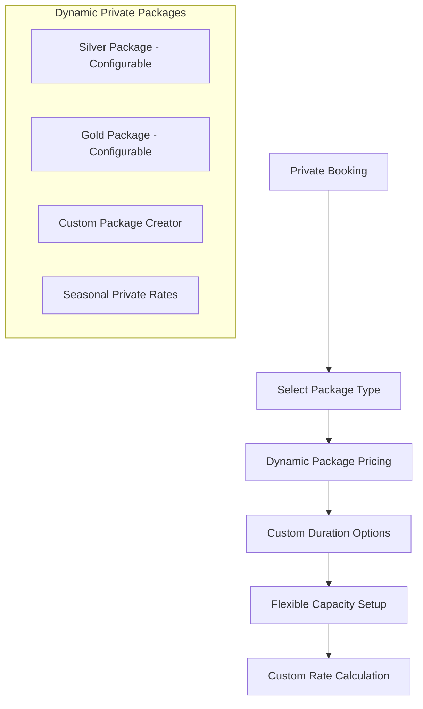
```mermaid
graph TD
    A[Private Booking] --> B[Select Package Type]
    B --> C[Dynamic Package Pricing]
    C --> D[Custom Duration Options]
    D --> E[Flexible Capacity Setup]
    E --> F[Custom Rate Calculation]

    subgraph "Dynamic Private Packages"
        P1[Silver Package - Configurable]
        P2[Gold Package - Configurable]
        P3[Custom Package Creator]
        P4[Seasonal Private Rates]
    end
```

## 3. Modul Mini Cafe

### 3.1 Dynamic Menu Management

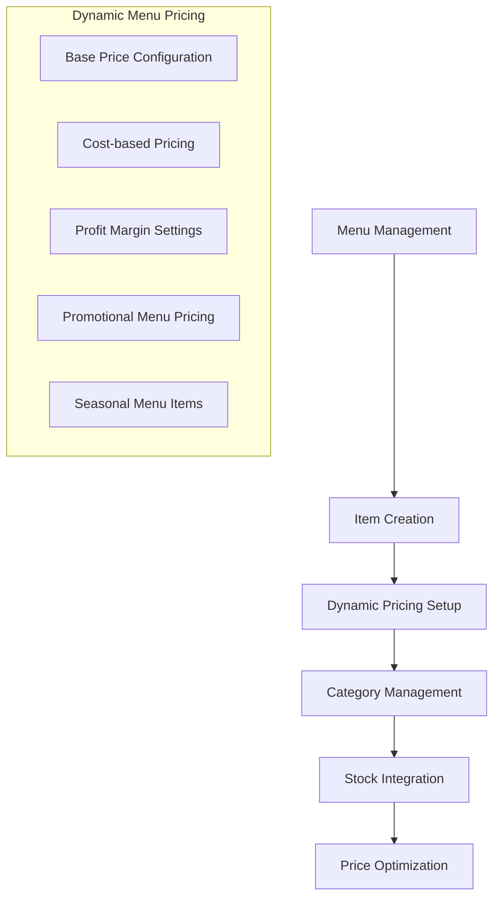
```mermaid
graph TD
    A[Menu Management] --> B[Item Creation]
    B --> C[Dynamic Pricing Setup]
    C --> D[Category Management]
    D --> E[Stock Integration]
    E --> F[Price Optimization]

    subgraph "Dynamic Menu Pricing"
        M1[Base Price Configuration]
        M2[Cost-based Pricing]
        M3[Profit Margin Settings]
        M4[Promotional Menu Pricing]
        M5[Seasonal Menu Items]
    end
```

#### 3.1.1 Configurable Cafe Features

- **Flexible Menu Pricing**: Harga menu dapat diubah secara real-time
- **Cost-based Pricing**: Harga otomatis berdasarkan cost + margin
- **Promotional Menu**: Menu khusus dengan harga promosi
- **Seasonal Menus**: Menu yang berubah sesuai musim
- **Dynamic Inventory Pricing**: Harga dapat disesuaikan berdasarkan stock

### 3.2 Order Processing System

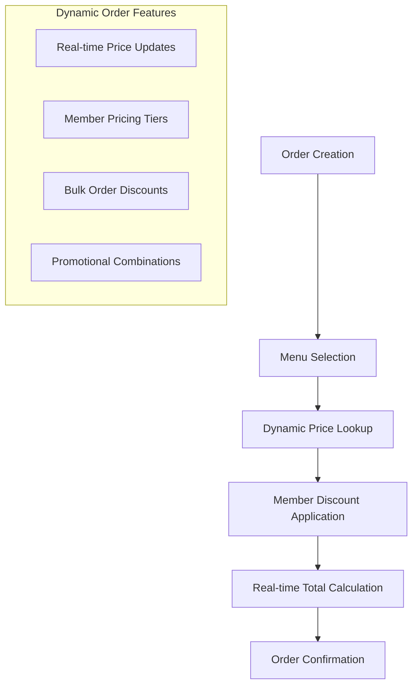
```mermaid
graph TD
    A[Order Creation] --> B[Menu Selection]
    B --> C[Dynamic Price Lookup]
    C --> D[Member Discount Application]
    D --> E[Real-time Total Calculation]
    E --> F[Order Confirmation]

    subgraph "Dynamic Order Features"
        O1[Real-time Price Updates]
        O2[Member Pricing Tiers]
        O3[Bulk Order Discounts]
        O4[Promotional Combinations]
    end
```

## 4. Modul Dynamic Pricing Management

### 4.1 Pricing Configuration System

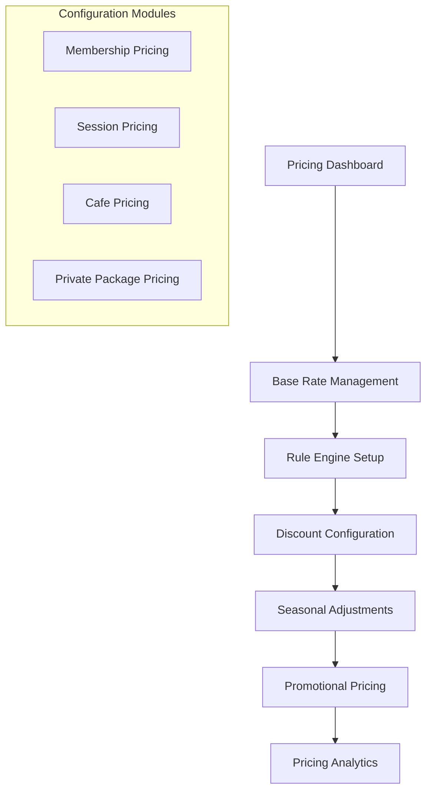
```mermaid
graph TD
    A[Pricing Dashboard] --> B[Base Rate Management]
    B --> C[Rule Engine Setup]
    C --> D[Discount Configuration]
    D --> E[Seasonal Adjustments]
    E --> F[Promotional Pricing]
    F --> G[Pricing Analytics]

    subgraph "Configuration Modules"
        C1[Membership Pricing]
        C2[Session Pricing]
        C3[Cafe Pricing]
        C4[Private Package Pricing]
    end
```

#### 4.1.1 Dynamic Pricing Features

- **Real-time Price Updates**: Perubahan harga langsung aktif
- **Scheduled Price Changes**: Harga dapat dijadwalkan untuk perubahan di masa depan
- **Conditional Pricing Rules**: Harga berdasarkan kondisi tertentu
- **Bulk Price Updates**: Update harga untuk multiple items sekaligus
- **Price History Tracking**: Riwayat perubahan harga yang lengkap

### 4.2 Pricing Rule Engine

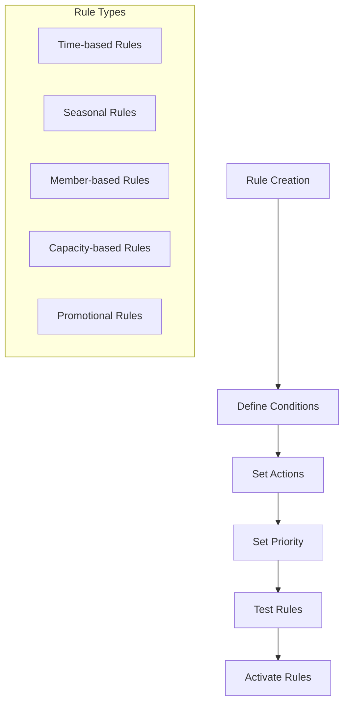
```mermaid
graph TD
    A[Rule Creation] --> B[Define Conditions]
    B --> C[Set Actions]
    C --> D[Set Priority]
    D --> E[Test Rules]
    E --> F[Activate Rules]

    subgraph "Rule Types"
        R1[Time-based Rules]
        R2[Seasonal Rules]
        R3[Member-based Rules]
        R4[Capacity-based Rules]
        R5[Promotional Rules]
    end
```

#### 4.2.1 Rule Engine Features

- **Flexible Rule Creation**: Admin dapat membuat aturan pricing yang kompleks
- **Rule Priority Management**: Aturan dengan prioritas tertinggi diterapkan terlebih dahulu
- **Rule Testing**: Sistem memungkinkan testing aturan sebelum diaktifkan
- **Rule Analytics**: Analisis performa aturan pricing
- **Rule Templates**: Template aturan yang dapat digunakan ulang

## 5. Modul Pembayaran

### 5.1 Flexible Payment Processing

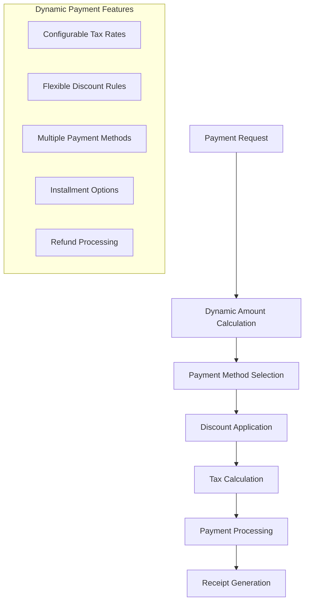
```mermaid
graph TD
    A[Payment Request] --> B[Dynamic Amount Calculation]
    B --> C[Payment Method Selection]
    C --> D[Discount Application]
    D --> E[Tax Calculation]
    E --> F[Payment Processing]
    F --> G[Receipt Generation]

    subgraph "Dynamic Payment Features"
        P1[Configurable Tax Rates]
        P2[Flexible Discount Rules]
        P3[Multiple Payment Methods]
        P4[Installment Options]
        P5[Refund Processing]
    end
```

#### 5.1.1 Configurable Payment Features

- **Dynamic Tax Configuration**: Pajak dapat diatur berdasarkan lokasi/regulasi
- **Flexible Discount System**: Sistem diskon yang dapat dikonfigurasi
- **Multiple Payment Gateways**: Integrasi dengan berbagai payment gateway
- **Installment Plans**: Opsi cicilan dengan konfigurasi yang fleksibel
- **Promotional Payment Terms**: Syarat pembayaran khusus untuk promosi

### 5.2 Receipt and Proof System

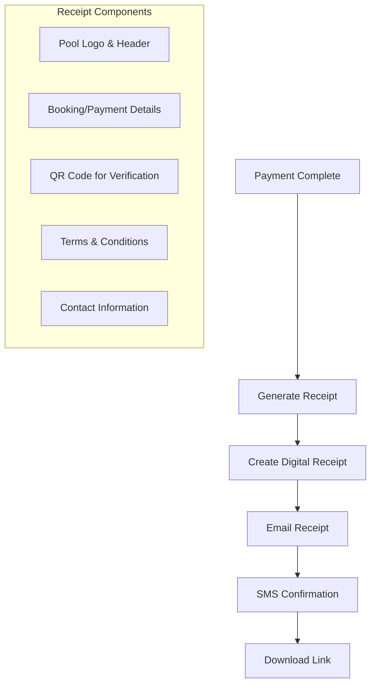
```mermaid
graph TD
    A[Payment Complete] --> B[Generate Receipt]
    B --> C[Create Digital Receipt]
    C --> D[Email Receipt]
    D --> E[SMS Confirmation]
    E --> F[Download Link]

    subgraph "Receipt Components"
        R1[Pool Logo & Header]
        R2[Booking/Payment Details]
        R3[QR Code for Verification]
        R4[Terms & Conditions]
        R5[Contact Information]
    end
```

#### 5.2.1 Receipt Features

- **Digital Receipt PDF**: Professional receipt format
- **QR Code Integration**: QR code untuk easy verification
- **Multiple Formats**: PDF, email, SMS formats
- **Branded Design**: Consistent dengan brand identity
- **Download Options**: Easy download dan sharing

## 6. Modul Laporan dan Analytics

### 6.1 Dynamic Revenue Analytics

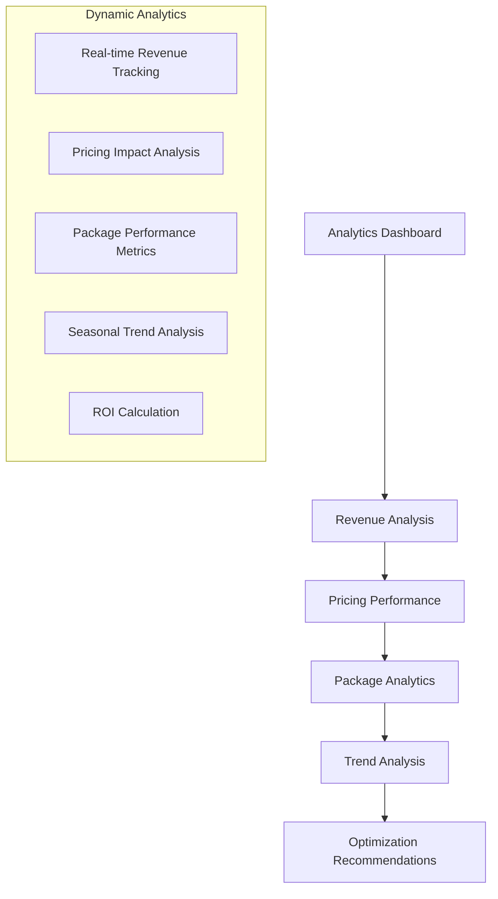
```mermaid
graph TD
    A[Analytics Dashboard] --> B[Revenue Analysis]
    B --> C[Pricing Performance]
    C --> D[Package Analytics]
    D --> E[Trend Analysis]
    E --> F[Optimization Recommendations]

    subgraph "Dynamic Analytics"
        A1[Real-time Revenue Tracking]
        A2[Pricing Impact Analysis]
        A3[Package Performance Metrics]
        A4[Seasonal Trend Analysis]
        A5[ROI Calculation]
    end
```

#### 6.1.1 Configurable Reporting Features

- **Custom Report Builder**: Admin dapat membuat laporan custom
- **Dynamic KPIs**: KPI yang dapat dikonfigurasi sesuai kebutuhan
- **Automated Insights**: Sistem memberikan insight otomatis
- **Export Flexibility**: Export data dalam berbagai format
- **Real-time Dashboards**: Dashboard yang update secara real-time

### 6.2 Pricing Analytics

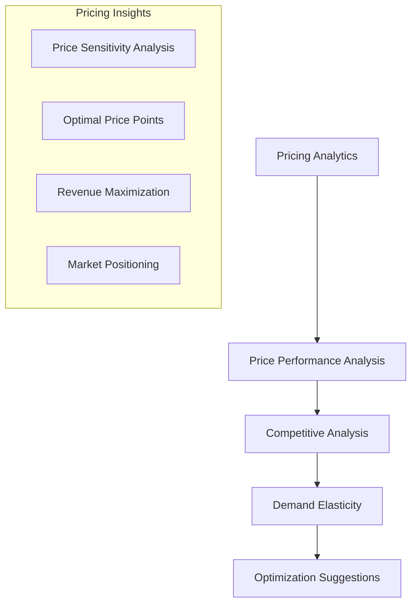
```mermaid
graph TD
    A[Pricing Analytics] --> B[Price Performance Analysis]
    B --> C[Competitive Analysis]
    C --> D[Demand Elasticity]
    D --> E[Optimization Suggestions]

    subgraph "Pricing Insights"
        I1[Price Sensitivity Analysis]
        I2[Optimal Price Points]
        I3[Revenue Maximization]
        I4[Market Positioning]
    end
```

## 7. Modul Notifikasi

### 7.1 Dynamic Notification System

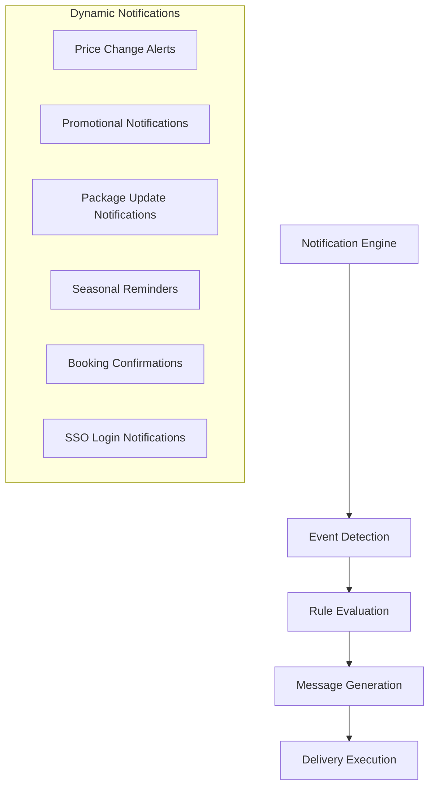
```mermaid
graph TD
    A[Notification Engine] --> B[Event Detection]
    B --> C[Rule Evaluation]
    C --> D[Message Generation]
    D --> E[Delivery Execution]

    subgraph "Dynamic Notifications"
        N1[Price Change Alerts]
        N2[Promotional Notifications]
        N3[Package Update Notifications]
        N4[Seasonal Reminders]
        N5[Booking Confirmations]
        N6[SSO Login Notifications]
    end
```

#### 7.1.1 Configurable Notification Features

- **Customizable Templates**: Template notifikasi yang dapat disesuaikan
- **Conditional Notifications**: Notifikasi berdasarkan kondisi tertentu
- **Scheduled Notifications**: Notifikasi yang dijadwalkan
- **Multi-channel Delivery**: Kirim ke email, SMS, push notification
- **Notification Analytics**: Analisis efektivitas notifikasi

### 7.2 Booking Confirmation System

```mermaid
graph TD
    A[Booking Confirmed] --> B[Generate Notifications]
    B --> C[SMS Confirmation]
    B --> D[Email Receipt]
    B --> E[QR Code Generation]
    E --> F[Add to Receipts]

    subgraph "Confirmation Content"
        C1[Booking Reference Number]
        C2[Session Details]
        C3[Payment Information]
        C4[QR Code for Check-in]
        C5[Pool Rules & Guidelines]
    end
```

#### 7.2.1 Confirmation Features

- **Immediate SMS**: Instant confirmation dengan reference number
- **Detailed Email**: Complete booking details dengan receipt
- **QR Code**: Easy verification untuk check-in
- **Multiple Formats**: SMS, email, PDF receipt
- **Customizable Content**: Template yang dapat disesuaikan

## 8. Modul Tata Tertib dan Compliance

### 8.1 Dynamic Policy Management

```mermaid
graph TD
    A[Policy Management] --> B[Rule Creation]
    B --> C[Policy Distribution]
    C --> D[Compliance Monitoring]
    D --> E[Policy Updates]

    subgraph "Dynamic Policies"
        P1[Configurable Rules]
        P2[Flexible Enforcement]
        P3[Policy Versioning]
        P4[Compliance Tracking]
    end
```

#### 8.1.1 Configurable Compliance Features

- **Flexible Rule Configuration**: Aturan yang dapat disesuaikan
- **Dynamic Policy Updates**: Update kebijakan secara real-time
- **Compliance Monitoring**: Monitoring kepatuhan secara otomatis
- **Audit Trail**: Jejak audit yang lengkap untuk semua perubahan
- **Regulatory Updates**: Update otomatis untuk perubahan regulasi

## 9. Admin Configuration Panel

### 9.1 Dynamic System Configuration

```mermaid
graph TD
    A[Admin Panel] --> B[System Configuration]
    B --> C[Pricing Management]
    C --> D[Rule Engine Management]
    D --> E[User Management]
    E --> F[Analytics Dashboard]

    subgraph "Configuration Modules"
        C1[Global Settings]
        C2[Pricing Configuration]
        C3[Business Rules]
        C4[Notification Settings]
        C5[Security Settings]
        C6[SSO Configuration]
        C7[Proof System Settings]
    end
```

#### 9.1.1 Admin Features

- **Centralized Configuration**: Semua konfigurasi di satu tempat
- **Role-based Access**: Akses berdasarkan role dan permission
- **Configuration Templates**: Template konfigurasi yang dapat digunakan ulang
- **Configuration History**: Riwayat perubahan konfigurasi
- **Backup and Restore**: Backup dan restore konfigurasi

### 9.2 SSO Configuration Management

```mermaid
graph TD
    A[SSO Management] --> B[Google OAuth Setup]
    B --> C[Client ID Configuration]
    C --> D[Redirect URI Setup]
    D --> E[Scopes Configuration]
    E --> F[Token Management]

    subgraph "SSO Features"
        S1[Google OAuth 2.0]
        S2[Profile Sync Settings]
        S3[Token Refresh Logic]
        S4[Security Policies]
        S5[User Mapping Rules]
    end
```

#### 9.2.1 SSO Management Features

- **Google OAuth 2.0 Integration**: Setup dan konfigurasi OAuth
- **Profile Synchronization**: Sync Google profile dengan local data
- **Token Management**: Handle token refresh dan validation
- **Security Configuration**: Configure security policies untuk SSO
- **User Mapping**: Map Google users dengan local accounts

### 9.3 Guest User Management

```mermaid
graph TD
    A[Guest Management] --> B[Guest Registration Tracking]
    B --> C[Conversion Analytics]
    C --> D[Proof System Management]
    D --> E[Verification Settings]

    subgraph "Guest Features"
        G1[Guest Booking Analytics]
        G2[Conversion Rate Tracking]
        G3[Proof Generation Settings]
        G4[Verification Method Configuration]
        G5[Security Settings]
        G6[SSO Conversion Tracking]
    end
```

#### 9.3.1 Guest Management Features

- **Guest Analytics**: Track guest booking patterns
- **Conversion Tracking**: Monitor guest to member conversion
- **SSO Conversion Analytics**: Track Google SSO conversion rates
- **Proof System Configuration**: Configure proof generation settings
- **Verification Management**: Manage verification methods
- **Security Configuration**: Configure security measures

### 9.4 Pricing Management Interface

```json
{
  "pricing_management": {
    "membership_pricing": {
      "monthly_base": "configurable_field",
      "quarterly_base": "configurable_field",
      "quarterly_discount": "configurable_field"
    },
    "session_pricing": {
      "regular_weekday": "configurable_field",
      "regular_weekend": "configurable_field",
      "private_silver": "configurable_field",
      "private_gold": "configurable_field"
    },
    "cafe_pricing": {
      "cost_margin": "configurable_field",
      "promotional_discount": "configurable_field"
    },
    "pricing_rules": {
      "member_discount": "configurable_field",
      "seasonal_adjustment": "configurable_field",
      "promotional_rate": "configurable_field",
      "google_user_benefits": "configurable_field"
    },
    "sso_configuration": {
      "google_oauth_enabled": "configurable_field",
      "auto_sync_profile": "configurable_field",
      "google_user_benefits": "configurable_field"
    },
    "proof_system": {
      "reference_format": "configurable_field",
      "qr_code_enabled": "configurable_field",
      "sms_confirmation": "configurable_field",
      "email_receipt": "configurable_field"
    }
  }
}
```

---

**Versi**: 1.4  
**Tanggal**: 26 Agustus 2025  
**Status**: Updated dengan Google SSO Integration  
**Berdasarkan**: PDF Raujan Pool Syariah
