# Analisa Fitur dan Modul - Sistem Kolam Renang Syariah

## 1. Modul Manajemen Member

### 1.1 Fitur Pendaftaran Member

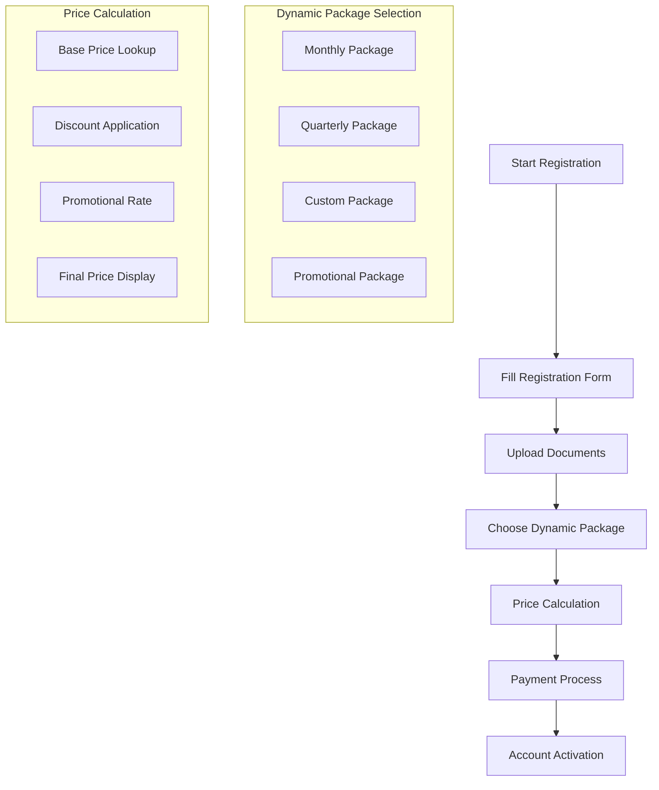
```mermaid
graph TD
    A[Start Registration] --> B[Fill Registration Form]
    B --> C[Upload Documents]
    C --> D[Choose Dynamic Package]
    D --> E[Price Calculation]
    E --> F[Payment Process]
    F --> G[Account Activation]

    subgraph "Dynamic Package Selection"
        P1[Monthly Package]
        P2[Quarterly Package]
        P3[Custom Package]
        P4[Promotional Package]
    end

    subgraph "Price Calculation"
        C1[Base Price Lookup]
        C2[Discount Application]
        C3[Promotional Rate]
        C4[Final Price Display]
    end
```

#### 1.1.1 Dynamic Registration Features

- **Flexible Package Selection**: Member dapat memilih dari berbagai paket yang dapat dikonfigurasi
- **Real-time Price Calculation**: Harga dihitung secara real-time berdasarkan konfigurasi terbaru
- **Promotional Pricing**: Sistem mendukung harga promosi yang dapat diatur
- **Package Customization**: Admin dapat membuat paket khusus sesuai kebutuhan
- **Dynamic Discounts**: Diskon dapat diterapkan berdasarkan berbagai kriteria

### 1.2 Fitur Manajemen Profile

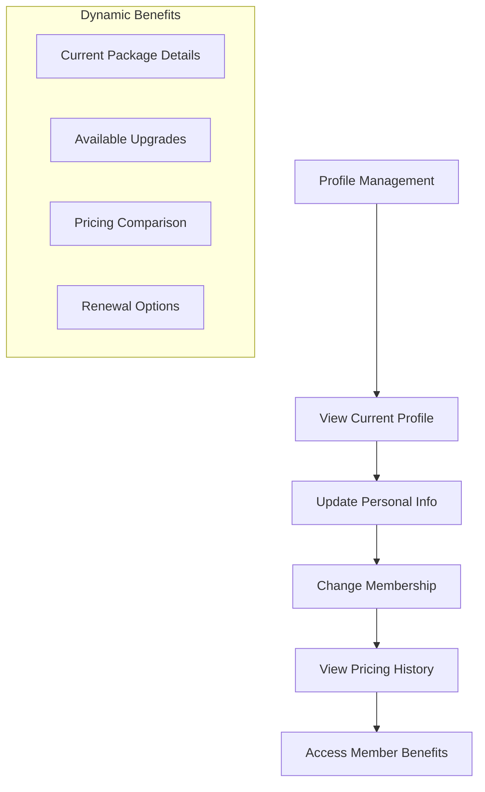
```mermaid
graph TD
    A[Profile Management] --> B[View Current Profile]
    B --> C[Update Personal Info]
    C --> D[Change Membership]
    D --> E[View Pricing History]
    E --> F[Access Member Benefits]

    subgraph "Dynamic Benefits"
        B1[Current Package Details]
        B2[Available Upgrades]
        B3[Pricing Comparison]
        B4[Renewal Options]
    end
```

## 2. Modul Reservasi dan Booking

### 2.1 Core Booking Flow System

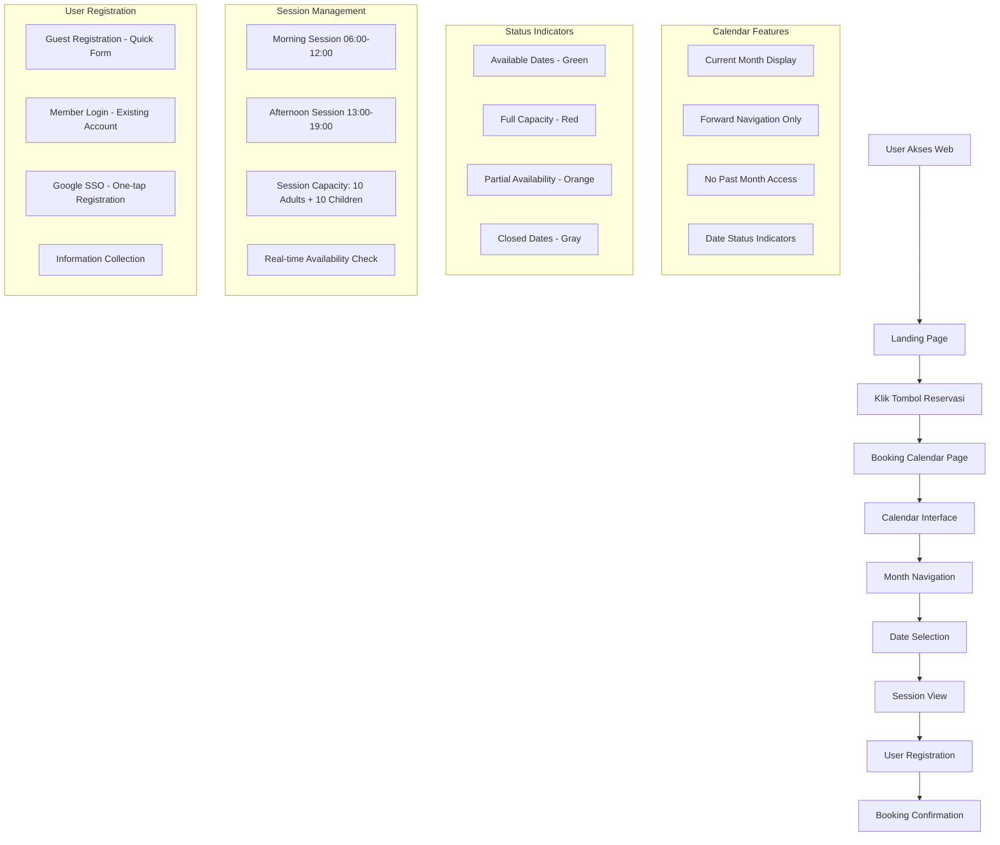
```mermaid
graph TD
    A[User Akses Web] --> B[Landing Page]
    B --> C[Klik Tombol Reservasi]
    C --> D[Booking Calendar Page]

    D --> E[Calendar Interface]
    E --> F[Month Navigation]
    F --> G[Date Selection]
    G --> H[Session View]
    H --> I[User Registration]
    I --> J[Booking Confirmation]

    subgraph "Calendar Features"
        CF1[Current Month Display]
        CF2[Forward Navigation Only]
        CF3[No Past Month Access]
        CF4[Date Status Indicators]
    end

    subgraph "Status Indicators"
        SI1[Available Dates - Green]
        SI2[Full Capacity - Red]
        SI3[Partial Availability - Orange]
        SI4[Closed Dates - Gray]
    end

    subgraph "Session Management"
        SM1[Morning Session 06:00-12:00]
        SM2[Afternoon Session 13:00-19:00]
        SM3[Session Capacity: 10 Adults + 10 Children]
        SM4[Real-time Availability Check]
    end

    subgraph "User Registration"
        UR1[Guest Registration - Quick Form]
        UR2[Member Login - Existing Account]
        UR3[Google SSO - One-tap Registration]
        UR4[Information Collection]
    end
```

### 2.2 Detailed Calendar Interface

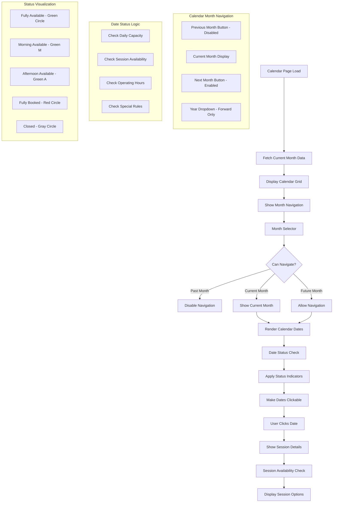
```mermaid
graph TD
    A[Calendar Page Load] --> B[Fetch Current Month Data]
    B --> C[Display Calendar Grid]
    C --> D[Show Month Navigation]

    D --> E[Month Selector]
    E --> F{Can Navigate?}
    F -->|Past Month| G[Disable Navigation]
    F -->|Current Month| H[Show Current Month]
    F -->|Future Month| I[Allow Navigation]

    H --> J[Render Calendar Dates]
    I --> J

    J --> K[Date Status Check]
    K --> L[Apply Status Indicators]
    L --> M[Make Dates Clickable]

    M --> N[User Clicks Date]
    N --> O[Show Session Details]
    O --> P[Session Availability Check]
    P --> Q[Display Session Options]

    subgraph "Calendar Month Navigation"
        CMN1[Previous Month Button - Disabled]
        CMN2[Current Month Display]
        CMN3[Next Month Button - Enabled]
        CMN4[Year Dropdown - Forward Only]
    end

    subgraph "Date Status Logic"
        DSL1[Check Daily Capacity]
        DSL2[Check Session Availability]
        DSL3[Check Operating Hours]
        DSL4[Check Special Rules]
    end

    subgraph "Status Visualization"
        SV1[Fully Available - Green Circle]
        SV2[Morning Available - Green M]
        SV3[Afternoon Available - Green A]
        SV4[Fully Booked - Red Circle]
        SV5[Closed - Gray Circle]
    end
```

### 2.3 Session Selection Flow

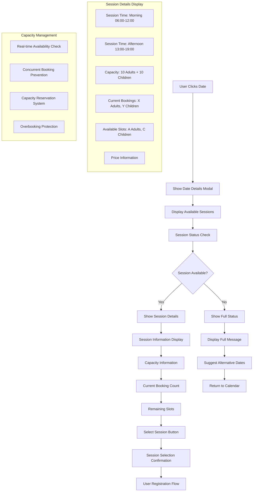
```mermaid
graph TD
    A[User Clicks Date] --> B[Show Date Details Modal]
    B --> C[Display Available Sessions]
    C --> D[Session Status Check]
    D --> E{Session Available?}

    E -->|Yes| F[Show Session Details]
    E -->|No| G[Show Full Status]

    F --> H[Session Information Display]
    H --> I[Capacity Information]
    I --> J[Current Booking Count]
    J --> K[Remaining Slots]
    K --> L[Select Session Button]

    G --> M[Display Full Message]
    M --> N[Suggest Alternative Dates]
    N --> O[Return to Calendar]

    L --> P[Session Selection Confirmation]
    P --> Q[User Registration Flow]

    subgraph "Session Details Display"
        SDD1[Session Time: Morning 06:00-12:00]
        SDD2[Session Time: Afternoon 13:00-19:00]
        SDD3[Capacity: 10 Adults + 10 Children]
        SDD4[Current Bookings: X Adults, Y Children]
        SDD5[Available Slots: A Adults, C Children]
        SDD6[Price Information]
    end

    subgraph "Capacity Management"
        CM1[Real-time Availability Check]
        CM2[Concurrent Booking Prevention]
        CM3[Capacity Reservation System]
        CM4[Overbooking Protection]
    end
```

### 2.4 User Registration Flow

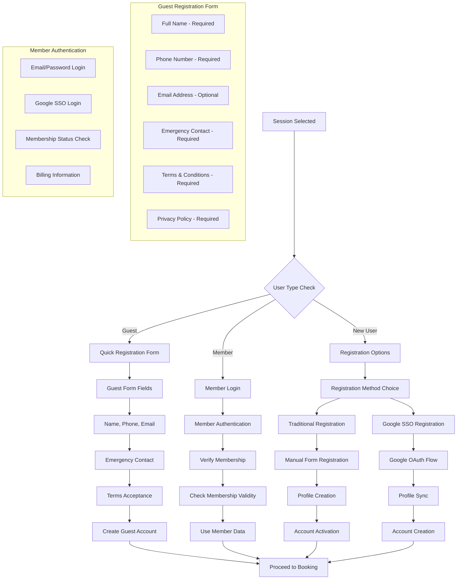
```mermaid
graph TD
    A[Session Selected] --> B{User Type Check}
    B -->|Guest| C[Quick Registration Form]
    B -->|Member| D[Member Login]
    B -->|New User| E[Registration Options]

    C --> F[Guest Form Fields]
    F --> G[Name, Phone, Email]
    G --> H[Emergency Contact]
    H --> I[Terms Acceptance]
    I --> J[Create Guest Account]

    D --> K[Member Authentication]
    K --> L[Verify Membership]
    L --> M[Check Membership Validity]
    M --> N[Use Member Data]

    E --> O[Registration Method Choice]
    O --> P[Traditional Registration]
    O --> Q[Google SSO Registration]

    P --> R[Manual Form Registration]
    R --> S[Profile Creation]
    S --> T[Account Activation]

    Q --> U[Google OAuth Flow]
    U --> V[Profile Sync]
    V --> W[Account Creation]

    J --> X[Proceed to Booking]
    N --> X
    T --> X
    W --> X

    subgraph "Guest Registration Form"
        GRF1[Full Name - Required]
        GRF2[Phone Number - Required]
        GRF3[Email Address - Optional]
        GRF4[Emergency Contact - Required]
        GRF5[Terms & Conditions - Required]
        GRF6[Privacy Policy - Required]
    end

    subgraph "Member Authentication"
        MA1[Email/Password Login]
        MA2[Google SSO Login]
        MA3[Membership Status Check]
        MA4[Billing Information]
    end
```

### 2.5 Booking Confirmation System

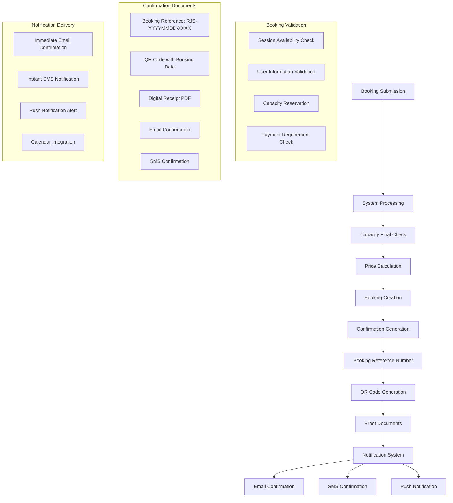
```mermaid
graph TD
    A[Booking Submission] --> B[System Processing]
    B --> C[Capacity Final Check]
    C --> D[Price Calculation]
    D --> E[Booking Creation]
    E --> F[Confirmation Generation]

    F --> G[Booking Reference Number]
    G --> H[QR Code Generation]
    H --> I[Proof Documents]
    I --> J[Notification System]

    J --> K[Email Confirmation]
    J --> L[SMS Confirmation]
    J --> M[Push Notification]

    subgraph "Booking Validation"
        BV1[Session Availability Check]
        BV2[User Information Validation]
        BV3[Capacity Reservation]
        BV4[Payment Requirement Check]
    end

    subgraph "Confirmation Documents"
        CD1[Booking Reference: RJS-YYYYMMDD-XXXX]
        CD2[QR Code with Booking Data]
        CD3[Digital Receipt PDF]
        CD4[Email Confirmation]
        CD5[SMS Confirmation]
    end

    subgraph "Notification Delivery"
        ND1[Immediate Email Confirmation]
        ND2[Instant SMS Notification]
        ND3[Push Notification Alert]
        ND4[Calendar Integration]
    end
```

### 2.6 Real-time Availability System

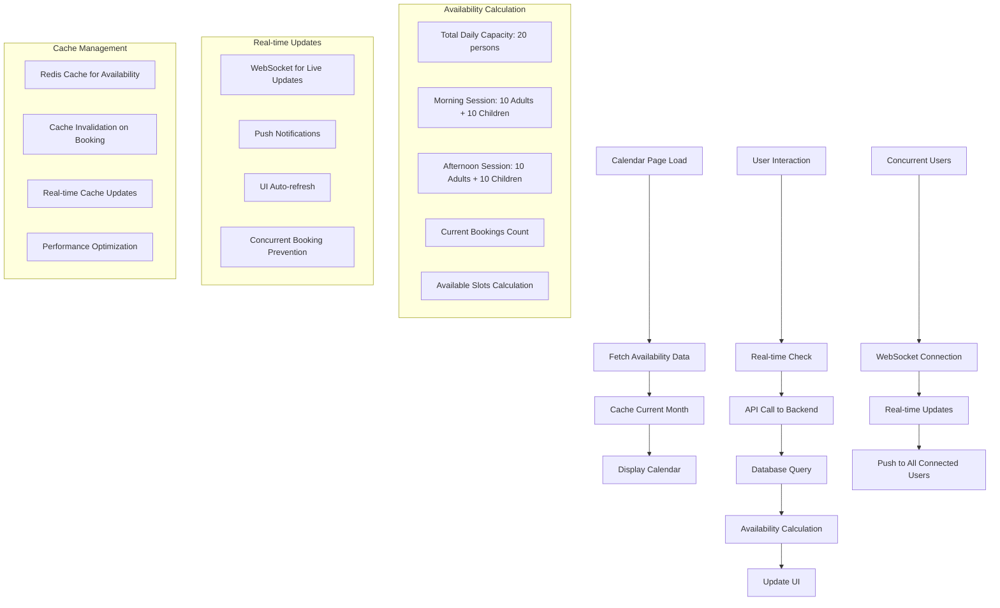
```mermaid
graph TD
    A[Calendar Page Load] --> B[Fetch Availability Data]
    B --> C[Cache Current Month]
    C --> D[Display Calendar]

    E[User Interaction] --> F[Real-time Check]
    F --> G[API Call to Backend]
    G --> H[Database Query]
    H --> I[Availability Calculation]
    I --> J[Update UI]

    K[Concurrent Users] --> L[WebSocket Connection]
    L --> M[Real-time Updates]
    M --> N[Push to All Connected Users]

    subgraph "Availability Calculation"
        AC1[Total Daily Capacity: 20 persons]
        AC2[Morning Session: 10 Adults + 10 Children]
        AC3[Afternoon Session: 10 Adults + 10 Children]
        AC4[Current Bookings Count]
        AC5[Available Slots Calculation]
    end

    subgraph "Real-time Updates"
        RTU1[WebSocket for Live Updates]
        RTU2[Push Notifications]
        RTU3[UI Auto-refresh]
        RTU4[Concurrent Booking Prevention]
    end

    subgraph "Cache Management"
        CM1[Redis Cache for Availability]
        CM2[Cache Invalidation on Booking]
        CM3[Real-time Cache Updates]
        CM4[Performance Optimization]
    end
```

### 2.7 Capacity Management Features

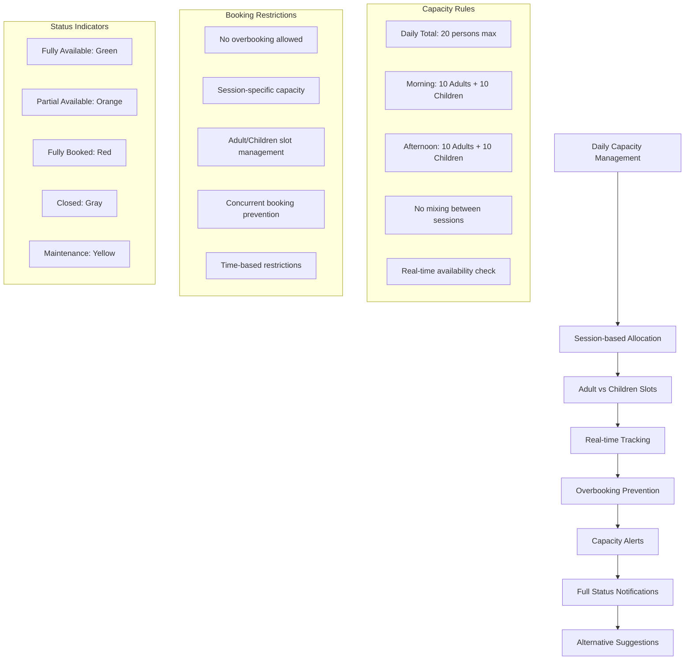
```mermaid
graph TD
    A[Daily Capacity Management] --> B[Session-based Allocation]
    B --> C[Adult vs Children Slots]
    C --> D[Real-time Tracking]
    D --> E[Overbooking Prevention]

    E --> F[Capacity Alerts]
    F --> G[Full Status Notifications]
    G --> H[Alternative Suggestions]

    subgraph "Capacity Rules"
        CR1[Daily Total: 20 persons max]
        CR2[Morning: 10 Adults + 10 Children]
        CR3[Afternoon: 10 Adults + 10 Children]
        CR4[No mixing between sessions]
        CR5[Real-time availability check]
    end

    subgraph "Booking Restrictions"
        BR1[No overbooking allowed]
        BR2[Session-specific capacity]
        BR3[Adult/Children slot management]
        BR4[Concurrent booking prevention]
        BR5[Time-based restrictions]
    end

    subgraph "Status Indicators"
        SI1[Fully Available: Green]
        SI2[Partial Available: Orange]
        SI3[Fully Booked: Red]
        SI4[Closed: Gray]
        SI5[Maintenance: Yellow]
    end
```

#### 2.7.1 Calendar Navigation Features

- **Forward-only Navigation**: User hanya bisa melihat bulan saat ini dan bulan-bulan ke depan
- **No Past Access**: Tidak bisa mengakses bulan-bulan yang sudah lewat
- **Current Month Default**: Default menampilkan bulan saat ini
- **Year Selection**: Dropdown untuk memilih tahun (hanya tahun sekarang dan ke depan)

#### 2.7.2 Date Status Features

- **Available Dates**: Tanggal dengan slot tersedia (hijau)
- **Full Capacity Dates**: Tanggal yang sudah penuh (merah)
- **Partial Availability**: Tanggal dengan slot terbatas (orange)
- **Closed Dates**: Tanggal tutup (abu-abu)
- **Real-time Updates**: Status update secara real-time

#### 2.7.3 Session Management Features

- **Morning Session**: 06:00-12:00 (10 dewasa + 10 anak)
- **Afternoon Session**: 13:00-19:00 (10 dewasa + 10 anak)
- **Session Status**: Tampil full/available per sesi
- **Capacity Display**: Tampilkan jumlah slot tersisa
- **Booking Count**: Tampilkan berapa yang sudah booking

#### 2.7.4 User Registration Features

- **Guest Registration**: Quick form untuk user baru
- **Member Login**: Login untuk member yang sudah ada
- **Google SSO**: One-tap registration dengan Google
- **Information Collection**: Nama, telepon, email, emergency contact
- **Terms Acceptance**: Wajib setuju terms & conditions

### 2.2 Booking Proof System

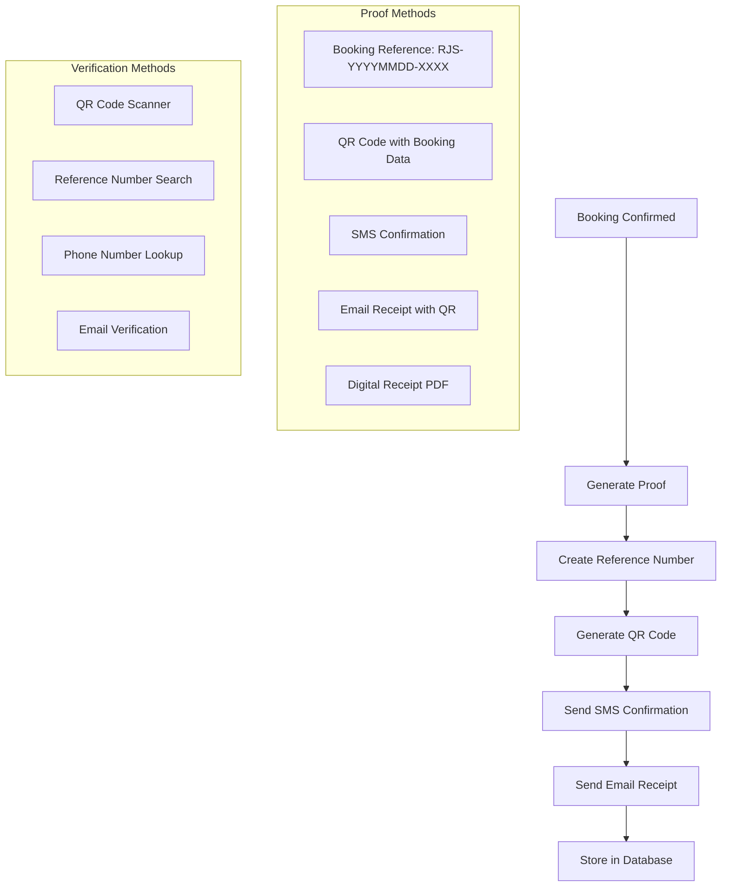
```mermaid
graph TD
    A[Booking Confirmed] --> B[Generate Proof]
    B --> C[Create Reference Number]
    C --> D[Generate QR Code]
    D --> E[Send SMS Confirmation]
    E --> F[Send Email Receipt]
    F --> G[Store in Database]

    subgraph "Proof Methods"
        P1[Booking Reference: RJS-YYYYMMDD-XXXX]
        P2[QR Code with Booking Data]
        P3[SMS Confirmation]
        P4[Email Receipt with QR]
        P5[Digital Receipt PDF]
    end

    subgraph "Verification Methods"
        V1[QR Code Scanner]
        V2[Reference Number Search]
        V3[Phone Number Lookup]
        V4[Email Verification]
    end
```

#### 2.3.1 Guest Proof Features

- **Unique Reference Number**: Format RJS-YYYYMMDD-XXXX
- **QR Code Generation**: Contains booking data untuk verification
- **SMS Confirmation**: Immediate proof via phone
- **Email Receipt**: Detailed confirmation dengan QR code
- **Digital Receipt**: PDF format untuk professional look
- **Multiple Verification**: Staff bisa verify dengan berbagai cara

#### 2.3.2 Staff Verification Interface

- **QR Code Scanner**: Fast verification dengan scan
- **Reference Search**: Lookup booking by reference number
- **Phone Search**: Search booking by phone number
- **Real-time Validation**: Instant verification results
- **Check-in Confirmation**: Update booking status

### 2.4 Private Session Management

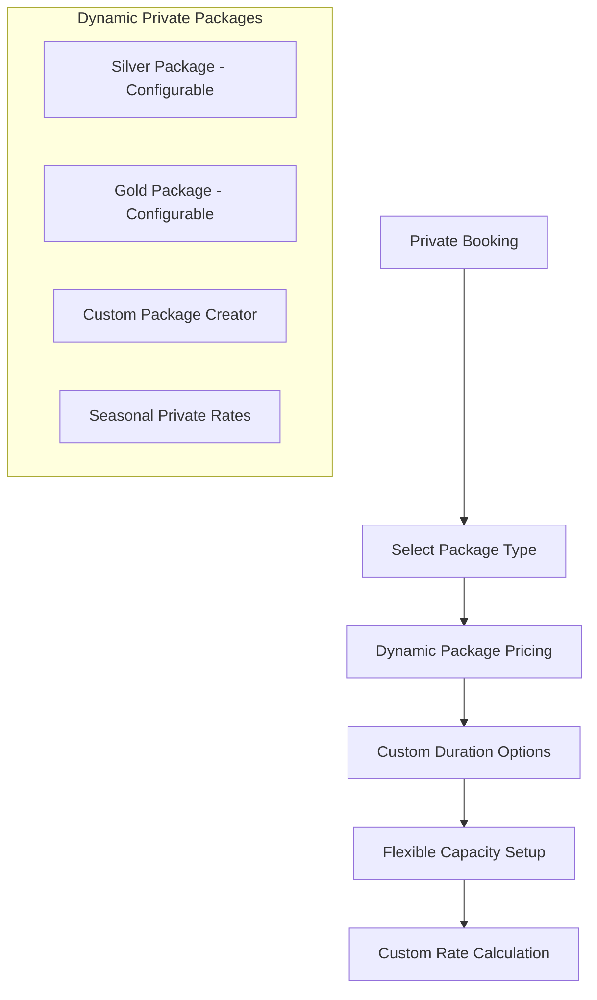
```mermaid
graph TD
    A[Private Booking] --> B[Select Package Type]
    B --> C[Dynamic Package Pricing]
    C --> D[Custom Duration Options]
    D --> E[Flexible Capacity Setup]
    E --> F[Custom Rate Calculation]

    subgraph "Dynamic Private Packages"
        P1[Silver Package - Configurable]
        P2[Gold Package - Configurable]
        P3[Custom Package Creator]
        P4[Seasonal Private Rates]
    end
```

## 3. Modul Mini Cafe

### 3.1 Dynamic Menu Management

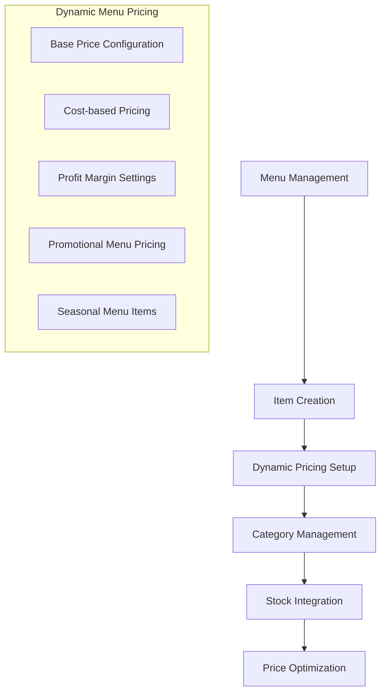
```mermaid
graph TD
    A[Menu Management] --> B[Item Creation]
    B --> C[Dynamic Pricing Setup]
    C --> D[Category Management]
    D --> E[Stock Integration]
    E --> F[Price Optimization]

    subgraph "Dynamic Menu Pricing"
        M1[Base Price Configuration]
        M2[Cost-based Pricing]
        M3[Profit Margin Settings]
        M4[Promotional Menu Pricing]
        M5[Seasonal Menu Items]
    end
```

#### 3.1.1 Configurable Cafe Features

- **Flexible Menu Pricing**: Harga menu dapat diubah secara real-time
- **Cost-based Pricing**: Harga otomatis berdasarkan cost + margin
- **Promotional Menu**: Menu khusus dengan harga promosi
- **Seasonal Menus**: Menu yang berubah sesuai musim
- **Dynamic Inventory Pricing**: Harga dapat disesuaikan berdasarkan stock

### 3.2 Order Processing System

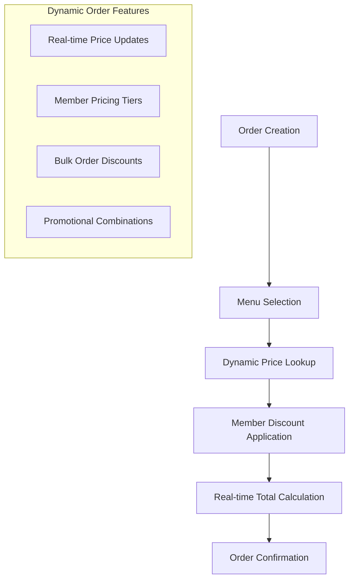
```mermaid
graph TD
    A[Order Creation] --> B[Menu Selection]
    B --> C[Dynamic Price Lookup]
    C --> D[Member Discount Application]
    D --> E[Real-time Total Calculation]
    E --> F[Order Confirmation]

    subgraph "Dynamic Order Features"
        O1[Real-time Price Updates]
        O2[Member Pricing Tiers]
        O3[Bulk Order Discounts]
        O4[Promotional Combinations]
    end
```

## 4. Modul Dynamic Pricing Management

### 4.1 Pricing Configuration System

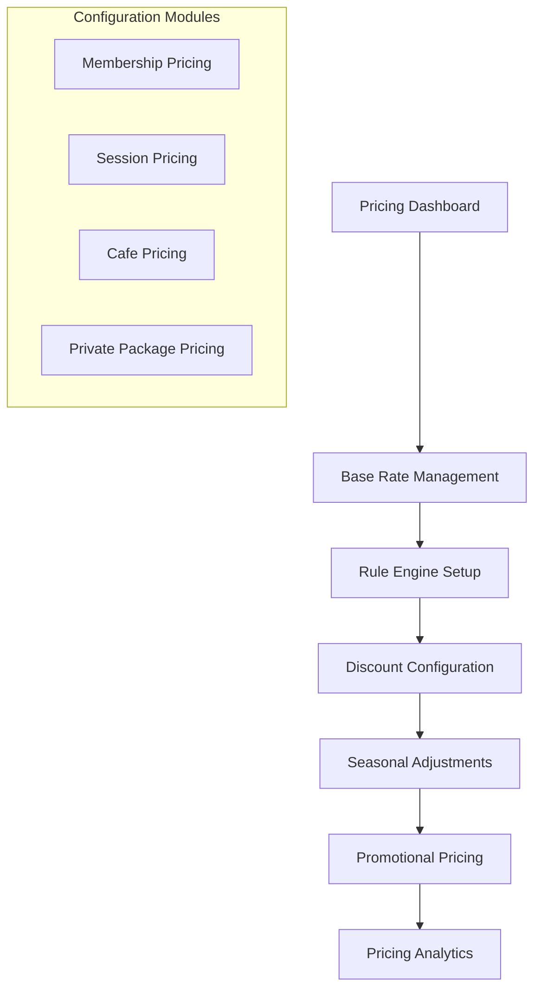
```mermaid
graph TD
    A[Pricing Dashboard] --> B[Base Rate Management]
    B --> C[Rule Engine Setup]
    C --> D[Discount Configuration]
    D --> E[Seasonal Adjustments]
    E --> F[Promotional Pricing]
    F --> G[Pricing Analytics]

    subgraph "Configuration Modules"
        C1[Membership Pricing]
        C2[Session Pricing]
        C3[Cafe Pricing]
        C4[Private Package Pricing]
    end
```

#### 4.1.1 Dynamic Pricing Features

- **Real-time Price Updates**: Perubahan harga langsung aktif
- **Scheduled Price Changes**: Harga dapat dijadwalkan untuk perubahan di masa depan
- **Conditional Pricing Rules**: Harga berdasarkan kondisi tertentu
- **Bulk Price Updates**: Update harga untuk multiple items sekaligus
- **Price History Tracking**: Riwayat perubahan harga yang lengkap

### 4.2 Pricing Rule Engine

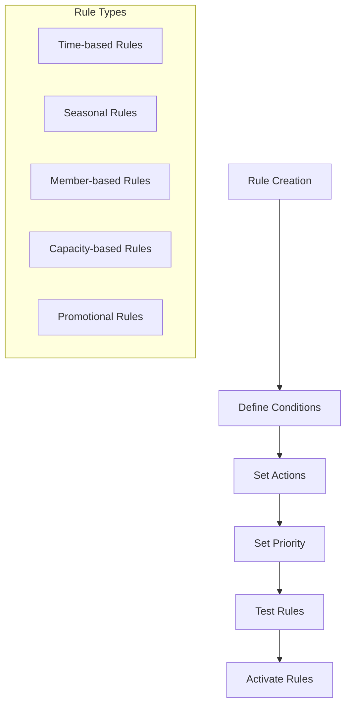
```mermaid
graph TD
    A[Rule Creation] --> B[Define Conditions]
    B --> C[Set Actions]
    C --> D[Set Priority]
    D --> E[Test Rules]
    E --> F[Activate Rules]

    subgraph "Rule Types"
        R1[Time-based Rules]
        R2[Seasonal Rules]
        R3[Member-based Rules]
        R4[Capacity-based Rules]
        R5[Promotional Rules]
    end
```

#### 4.2.1 Rule Engine Features

- **Flexible Rule Creation**: Admin dapat membuat aturan pricing yang kompleks
- **Rule Priority Management**: Aturan dengan prioritas tertinggi diterapkan terlebih dahulu
- **Rule Testing**: Sistem memungkinkan testing aturan sebelum diaktifkan
- **Rule Analytics**: Analisis performa aturan pricing
- **Rule Templates**: Template aturan yang dapat digunakan ulang

## 5. Modul Pembayaran

### 5.1 Flexible Payment Processing

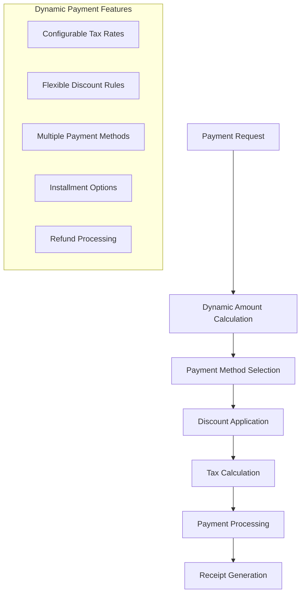
```mermaid
graph TD
    A[Payment Request] --> B[Dynamic Amount Calculation]
    B --> C[Payment Method Selection]
    C --> D[Discount Application]
    D --> E[Tax Calculation]
    E --> F[Payment Processing]
    F --> G[Receipt Generation]

    subgraph "Dynamic Payment Features"
        P1[Configurable Tax Rates]
        P2[Flexible Discount Rules]
        P3[Multiple Payment Methods]
        P4[Installment Options]
        P5[Refund Processing]
    end
```

#### 5.1.1 Configurable Payment Features

- **Dynamic Tax Configuration**: Pajak dapat diatur berdasarkan lokasi/regulasi
- **Flexible Discount System**: Sistem diskon yang dapat dikonfigurasi
- **Multiple Payment Gateways**: Integrasi dengan berbagai payment gateway
- **Installment Plans**: Opsi cicilan dengan konfigurasi yang fleksibel
- **Promotional Payment Terms**: Syarat pembayaran khusus untuk promosi

### 5.2 Receipt and Proof System

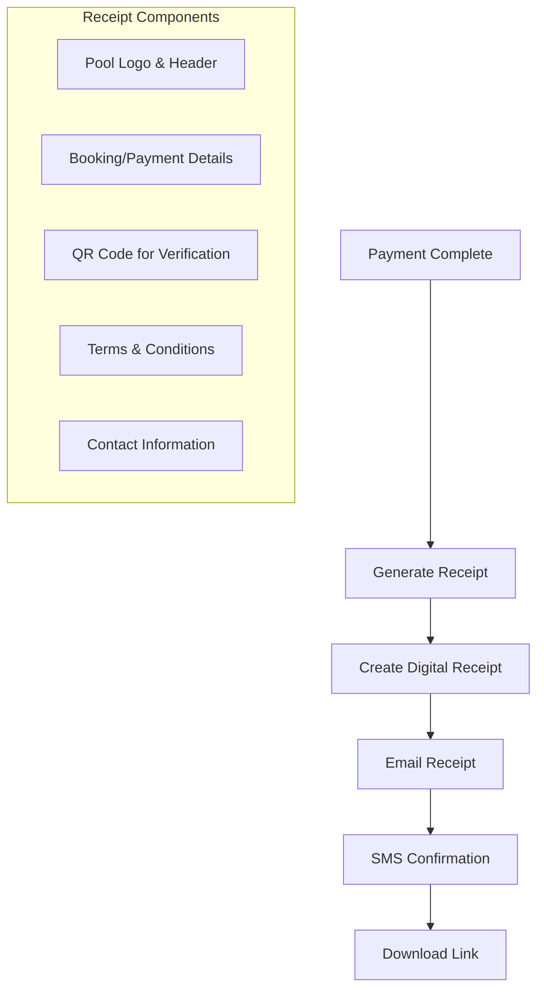
```mermaid
graph TD
    A[Payment Complete] --> B[Generate Receipt]
    B --> C[Create Digital Receipt]
    C --> D[Email Receipt]
    D --> E[SMS Confirmation]
    E --> F[Download Link]

    subgraph "Receipt Components"
        R1[Pool Logo & Header]
        R2[Booking/Payment Details]
        R3[QR Code for Verification]
        R4[Terms & Conditions]
        R5[Contact Information]
    end
```

#### 5.2.1 Receipt Features

- **Digital Receipt PDF**: Professional receipt format
- **QR Code Integration**: QR code untuk easy verification
- **Multiple Formats**: PDF, email, SMS formats
- **Branded Design**: Consistent dengan brand identity
- **Download Options**: Easy download dan sharing

## 6. Modul Laporan dan Analytics

### 6.1 Dynamic Revenue Analytics

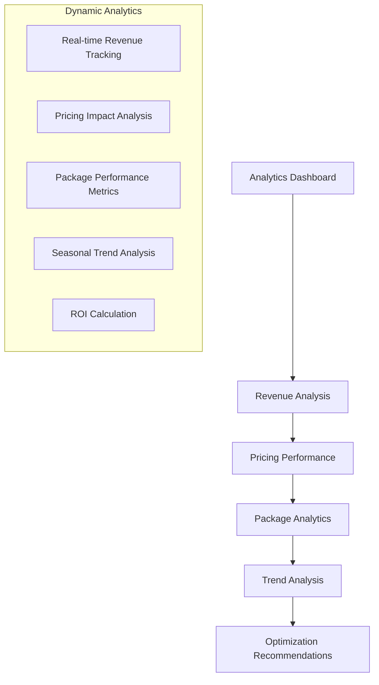
```mermaid
graph TD
    A[Analytics Dashboard] --> B[Revenue Analysis]
    B --> C[Pricing Performance]
    C --> D[Package Analytics]
    D --> E[Trend Analysis]
    E --> F[Optimization Recommendations]

    subgraph "Dynamic Analytics"
        A1[Real-time Revenue Tracking]
        A2[Pricing Impact Analysis]
        A3[Package Performance Metrics]
        A4[Seasonal Trend Analysis]
        A5[ROI Calculation]
    end
```

#### 6.1.1 Configurable Reporting Features

- **Custom Report Builder**: Admin dapat membuat laporan custom
- **Dynamic KPIs**: KPI yang dapat dikonfigurasi sesuai kebutuhan
- **Automated Insights**: Sistem memberikan insight otomatis
- **Export Flexibility**: Export data dalam berbagai format
- **Real-time Dashboards**: Dashboard yang update secara real-time

### 6.2 Pricing Analytics

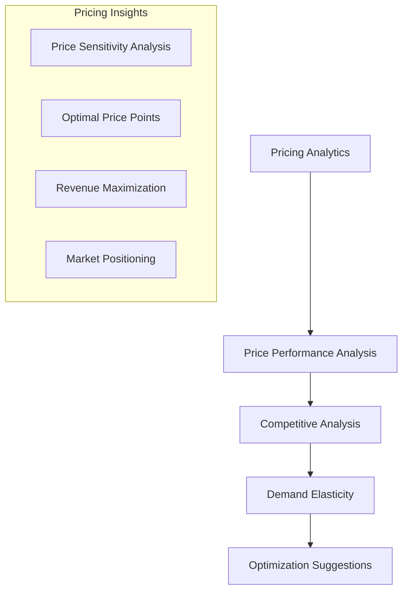
```mermaid
graph TD
    A[Pricing Analytics] --> B[Price Performance Analysis]
    B --> C[Competitive Analysis]
    C --> D[Demand Elasticity]
    D --> E[Optimization Suggestions]

    subgraph "Pricing Insights"
        I1[Price Sensitivity Analysis]
        I2[Optimal Price Points]
        I3[Revenue Maximization]
        I4[Market Positioning]
    end
```

## 7. Modul Notifikasi

### 7.1 Dynamic Notification System

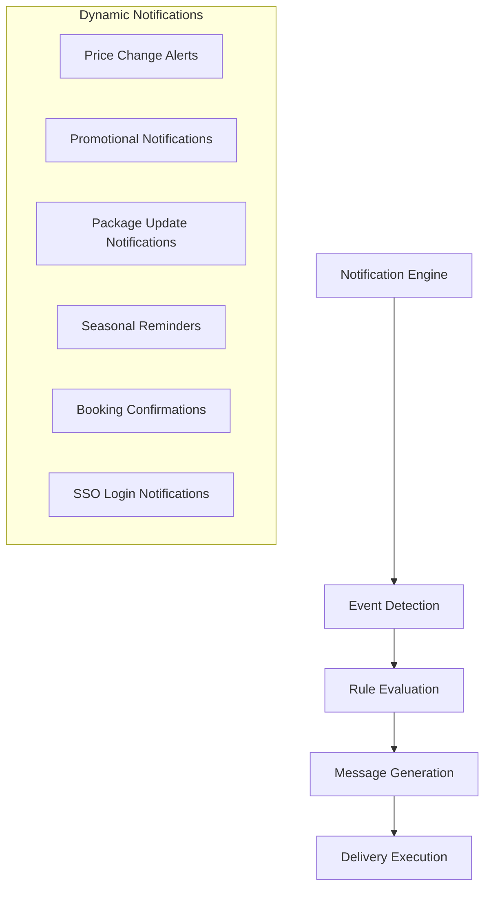
```mermaid
graph TD
    A[Notification Engine] --> B[Event Detection]
    B --> C[Rule Evaluation]
    C --> D[Message Generation]
    D --> E[Delivery Execution]

    subgraph "Dynamic Notifications"
        N1[Price Change Alerts]
        N2[Promotional Notifications]
        N3[Package Update Notifications]
        N4[Seasonal Reminders]
        N5[Booking Confirmations]
        N6[SSO Login Notifications]
    end
```

#### 7.1.1 Configurable Notification Features

- **Customizable Templates**: Template notifikasi yang dapat disesuaikan
- **Conditional Notifications**: Notifikasi berdasarkan kondisi tertentu
- **Scheduled Notifications**: Notifikasi yang dijadwalkan
- **Multi-channel Delivery**: Kirim ke email, SMS, push notification
- **Notification Analytics**: Analisis efektivitas notifikasi

### 7.2 Booking Confirmation System

```mermaid
graph TD
    A[Booking Confirmed] --> B[Generate Notifications]
    B --> C[SMS Confirmation]
    B --> D[Email Receipt]
    B --> E[QR Code Generation]
    E --> F[Add to Receipts]

    subgraph "Confirmation Content"
        C1[Booking Reference Number]
        C2[Session Details]
        C3[Payment Information]
        C4[QR Code for Check-in]
        C5[Pool Rules & Guidelines]
    end
```

#### 7.2.1 Confirmation Features

- **Immediate SMS**: Instant confirmation dengan reference number
- **Detailed Email**: Complete booking details dengan receipt
- **QR Code**: Easy verification untuk check-in
- **Multiple Formats**: SMS, email, PDF receipt
- **Customizable Content**: Template yang dapat disesuaikan

## 8. Modul Notifikasi dan Komunikasi

### 8.1 Push Notification System

```mermaid
graph TD
    A[Notification Trigger] --> B[Message Preparation]
    B --> C[Channel Selection]
    C --> D[Delivery Process]
    D --> E[Delivery Status]
    E --> F[Analytics Tracking]

    subgraph "Notification Types"
        NT1[Booking Reminders]
        NT2[Payment Confirmations]
        NT3[Session Updates]
        NT4[Promotional Offers]
        NT5[System Alerts]
    end

    subgraph "Delivery Channels"
        DC1[Push Notification]
        DC2[SMS]
        DC3[Email]
        DC4[In-App Message]
    end
```

## 9. Rating & Review System

### 9.1 Rating System Overview

```mermaid
graph TD
    A[User Experience Service] --> B[Rate Booking Experience]
    A --> C[Rate Cafe Service]
    A --> D[Rate Staff Service]
    A --> E[Rate Facility Quality]
    A --> F[Rate Overall Experience]

    B --> G[Booking Rating Components]
    G --> H[Ease of Booking Process - 1-5 Stars]
    G --> I[Calendar Interface - 1-5 Stars]
    G --> J[Session Availability - 1-5 Stars]
    G --> K[Payment Process - 1-5 Stars]

    C --> L[Cafe Rating Components]
    L --> M[Food Quality - 1-5 Stars]
    L --> N[Service Speed - 1-5 Stars]
    L --> O[Menu Variety - 1-5 Stars]
    L --> P[Price Value - 1-5 Stars]

    D --> Q[Staff Rating Components]
    Q --> R[Staff Friendliness - 1-5 Stars]
    Q --> S[Check-in Process - 1-5 Stars]
    Q --> T[Problem Resolution - 1-5 Stars]
    Q --> U[Communication - 1-5 Stars]

    E --> V[Facility Rating Components]
    V --> W[Water Quality - 1-5 Stars]
    V --> X[Pool Cleanliness - 1-5 Stars]
    V --> Y[Locker Room - 1-5 Stars]
    V --> Z[Safety Equipment - 1-5 Stars]

    F --> AA[Overall Satisfaction - 1-5 Stars]
    AA --> BB[Would Recommend - Yes/No]
    AA --> CC[Will Return - Yes/No]
    AA --> DD[Additional Comments]

    subgraph "Rating Collection"
        RC1[Post-Booking Rating]
        RC2[Post-Cafe Order Rating]
        RC3[Post-Session Rating]
        RC4[Periodic Feedback Survey]
        RC5[Staff Performance Rating]
    end

    subgraph "Rating Analytics"
        RA1[Average Ratings per Service]
        RA2[Rating Trends Over Time]
        RA3[Low Rating Alerts]
        RA4[Improvement Suggestions]
        RA5[Staff Performance Reports]
    end
```

### 9.2 Rating Collection Flow

```mermaid
graph TD
    A[Service Completed] --> B[Trigger Rating Request]
    B --> C[User Receives Rating Invitation]
    C --> D[Rate Different Aspects]
    D --> E[Submit Rating]
    E --> F[Store Rating Data]
    F --> G[Generate Analytics]
    G --> H[Send Improvement Alerts]

    subgraph "Rating Triggers"
        RT1[After Booking Completion]
        RT2[After Cafe Order Delivery]
        RT3[After Swimming Session]
        RT4[After Staff Interaction]
        RT5[Periodic Feedback Request]
    end

    subgraph "Rating Categories"
        RC1[Booking Experience - 5 Components]
        RC2[Cafe Service - 4 Components]
        RC3[Staff Service - 4 Components]
        RC4[Facility Quality - 4 Components]
        RC5[Overall Satisfaction - 3 Components]
    end

    subgraph "Rating Scale"
        RS1[⭐ Very Poor - 1 Star]
        RS2[⭐⭐ Poor - 2 Stars]
        RS3[⭐⭐⭐ Fair - 3 Stars]
        RS4[⭐⭐⭐⭐ Good - 4 Stars]
        RS5[⭐⭐⭐⭐⭐ Excellent - 5 Stars]
    end
```

### 9.3 Rating Analytics Dashboard

```mermaid
graph TD
    A[Rating Analytics Dashboard] --> B[Service Performance Overview]
    A --> C[Rating Trends Analysis]
    A --> D[Staff Performance Metrics]
    A --> E[Improvement Opportunities]
    A --> F[Customer Satisfaction Reports]

    B --> G[Average Ratings Display]
    G --> H[Booking: 4.2/5 ⭐]
    G --> I[Cafe: 4.1/5 ⭐]
    G --> J[Staff: 4.5/5 ⭐]
    G --> K[Facility: 4.3/5 ⭐]
    G --> L[Overall: 4.3/5 ⭐]

    C --> M[Daily/Monthly Trends]
    C --> N[Rating Distribution]
    C --> O[Seasonal Patterns]

    D --> P[Staff Rating Rankings]
    D --> Q[Individual Performance]
    D --> R[Training Needs]

    E --> S[Low Rating Analysis]
    E --> T[Improvement Suggestions]
    E --> U[Action Item Tracking]

    F --> V[Customer Feedback Summary]
    F --> W[Negative Review Analysis]
    F --> X[Positive Review Highlights]
```

#### 9.1.1 Rating Components Detail

**Booking Experience Rating:**

- **Ease of Booking Process**: Seberapa mudah proses booking
- **Calendar Interface**: User-friendly interface calendar
- **Session Availability**: Ketersediaan sesi yang diinginkan
- **Payment Process**: Kemudahan proses pembayaran
- **Confirmation System**: Kejelasan konfirmasi booking

**Cafe Service Rating:**

- **Food Quality**: Kualitas makanan dan minuman
- **Service Speed**: Kecepatan pelayanan
- **Menu Variety**: Variasi menu yang tersedia
- **Price Value**: Nilai harga yang sesuai

**Staff Service Rating:**

- **Staff Friendliness**: Keramahan staff
- **Check-in Process**: Kemudahan proses check-in
- **Problem Resolution**: Penyelesaian masalah
- **Communication**: Komunikasi yang jelas

**Facility Quality Rating:**

- **Water Quality**: Kualitas air kolam
- **Pool Cleanliness**: Kebersihan kolam
- **Locker Room**: Kondisi ruang ganti
- **Safety Equipment**: Peralatan keselamatan

**Overall Satisfaction:**

- **Overall Rating**: Rating keseluruhan 1-5 bintang
- **Would Recommend**: Apakah mau merekomendasikan ke orang lain
- **Will Return**: Apakah akan kembali lagi
- **Additional Comments**: Komentar tambahan (opsional)

#### 9.1.2 Rating Collection Features

- **Automatic Rating Prompts**: Rating request otomatis setelah service selesai
- **In-App Rating**: Rating langsung di aplikasi
- **SMS/Email Rating**: Rating via SMS atau email
- **Anonymous Rating Option**: Opsi rating anonim
- **Multi-language Rating**: Rating dalam berbagai bahasa
- **Rating Reminder**: Pengingat rating jika belum diisi

#### 9.1.3 Rating Analytics Features

- **Real-time Dashboard**: Dashboard rating real-time
- **Trend Analysis**: Analisis trend rating over time
- **Service Comparison**: Perbandingan rating antar service
- **Staff Performance**: Tracking performa staff individual
- **Alert System**: Alert untuk rating rendah
- **Improvement Suggestions**: Saran improvement berdasarkan rating
- **Customer Insights**: Insight customer behavior
- **Report Generation**: Generate laporan rating berkala

## 10. Check-in & Attendance System

### 10.1 Check-in Process Overview

```mermaid
graph TD
    A[Guest/Member Arrives] --> B[Staff Check-in Process]
    B --> C[Verify Identification]
    C --> D[Scan QR Code/Reference]
    D --> E[Confirm Booking Details]
    E --> F[Record Attendance]
    F --> G[Issue Locker/Equipment]
    G --> H[Guided to Pool Area]

    subgraph "Identification Methods"
        IM1[QR Code Scan from Booking]
        IM2[Booking Reference Number]
        IM3[Member Card/ID]
        IM4[Phone Number Search]
        IM5[Email Search]
        IM6[Guest ID Card]
    end

    subgraph "Check-in Validation"
        CV1[Booking Date Matches Today]
        CV2[Session Time is Valid]
        CV3[Payment Status is Confirmed]
        CV4[Guest/Member is Authorized]
        CV5[No Duplicate Check-in]
    end

    subgraph "Attendance Tracking"
        AT1[Check-in Time Stamp]
        AT2[Check-out Time Stamp]
        AT3[Duration of Stay]
        AT4[Staff who Processed]
        AT5[Equipment Issued]
        AT6[Special Notes]
    end

    subgraph "No-Show Handling"
        NS1[Mark as No-Show]
        NS2[Send No-Show Notification]
        NS3[Update Booking Status]
        NS4[Handle Refund Policy]
        NS5[Track No-Show Patterns]
    end
```

### 10.2 Attendance Management Flow

```mermaid
graph TD
    A[Daily Operation Start] --> B[Staff Login to System]
    B --> C[View Today's Bookings]
    C --> D[Prepare Check-in Station]
    D --> E[Wait for Guests/Members]

    E --> F[Guest/Member Arrives]
    F --> G[Staff Greets & Identifies]
    G --> H{Verification Method}

    H -->|QR Code| I[Scan QR Code]
    H -->|Reference| J[Enter Reference Number]
    H -->|Phone/Email| K[Search by Contact]
    H -->|Member Card| L[Scan Member Card]

    I --> M[System Validates Booking]
    J --> M
    K --> M
    L --> M

    M --> N{Booking Valid?}
    N -->|No| O[Show Error Message]
    N -->|Yes| P[Confirm Check-in]

    O --> Q[Handle Exception]
    Q --> R[Manual Override/Admin]

    P --> S[Record Check-in Time]
    S --> T[Issue Pool Pass]
    T --> U[Guide to Facilities]
    U --> V[Monitor Pool Usage]

    V --> W[Guest/Member Finishes]
    W --> X[Check-out Process]
    X --> Y[Return Equipment]
    Y --> Z[Record Duration]
    Z --> AA[Send Feedback Request]

    subgraph "Check-in Staff Interface"
        CSI1[Today's Bookings List]
        CSI2[Quick Search Function]
        CSI3[QR Scanner Integration]
        CSI4[Manual Entry Form]
        CSI5[Real-time Status Updates]
        CSI6[Exception Handling]
    end

    subgraph "Attendance Analytics"
        AA1[Daily Attendance Report]
        AA2[No-Show Rate Analysis]
        AA3[Peak Hours Identification]
        AA4[Guest vs Member Patterns]
        AA5[Staff Performance Metrics]
    end
```

### 10.3 No-Show Management System

```mermaid
graph TD
    A[Session Start Time] --> B[Check Unchecked Bookings]
    B --> C[Identify No-Shows]
    C --> D[Mark as No-Show]
    D --> E[Update Booking Status]
    E --> F[Send No-Show Notification]
    F --> G[Handle Refund/Reschedule]

    subgraph "No-Show Detection"
        NSD1[15 Minutes After Session Start]
        NSD2[Automatic Status Update]
        NSD3[Email/SMS Notification]
        NSD4[Member Account Update]
        NSD5[Guest Contact Notification]
    end

    subgraph "No-Show Consequences"
        NSC1[Full Refund - First Time]
        NSC2[Partial Refund - Repeat]
        NSC3[No Refund - Habitual]
        NSC4[Account Suspension - Severe]
        NSC5[Premium Booking Required]
    end

    subgraph "No-Show Prevention"
        NSP1[Reminder Notifications]
        NSP2[Easy Cancellation Policy]
        NSP3[Flexible Rescheduling]
        NSP4[Weather Alerts]
        NSP5[Health Status Updates]
    end
```

#### 10.1.1 Check-in Process Detail

**Staff Check-in Interface:**

- **Today's Bookings**: List semua booking hari ini dengan status
- **Quick Search**: Search berdasarkan nama, phone, email, reference
- **QR Scanner**: Scan QR code dari booking confirmation
- **Manual Entry**: Input manual untuk kasus khusus
- **Real-time Updates**: Update status real-time
- **Exception Handling**: Override untuk kasus khusus

**Verification Process:**

- **Booking Validation**: Validasi booking date, session, payment
- **Duplicate Check**: Mencegah double check-in
- **Authorization Check**: Memastikan guest/member yang benar
- **Session Validation**: Memastikan waktu sesi masih valid
- **Payment Confirmation**: Memastikan pembayaran sudah confirmed

**Attendance Recording:**

- **Check-in Time**: Timestamp kedatangan
- **Check-out Time**: Timestamp pulang (opsional)
- **Duration**: Lama waktu di kolam
- **Staff ID**: Petugas yang melakukan check-in
- **Equipment Issued**: Peralatan yang dipinjamkan
- **Special Notes**: Catatan khusus jika ada

#### 10.1.2 No-Show Management Features

**Automatic Detection:**

- **Time-based**: 15 menit setelah session start
- **Status Update**: Otomatis update ke "No-Show"
- **Notification**: Kirim notifikasi ke customer
- **Analytics**: Track pattern no-show
- **Policy Enforcement**: Terapkan kebijakan no-show

**No-Show Policies:**

- **First Time**: Full refund atau reschedule gratis
- **Second Time**: Partial refund (50%)
- **Third Time**: No refund, butuh booking premium
- **Habitual**: Temporary suspension dari sistem
- **Special Cases**: Exception untuk alasan kesehatan/emergency

**Prevention Strategies:**

- **Reminder System**: SMS/Email reminder 1 jam sebelum
- **Easy Cancellation**: Kemudahan untuk cancel/reschedule
- **Weather Alerts**: Notifikasi jika cuaca tidak mendukung
- **Health Status**: Update status kesehatan member
- **Incentive System**: Reward untuk yang selalu datang

#### 10.1.3 Attendance Analytics Features

**Daily Reports:**

- **Attendance Rate**: Persentase kehadiran vs booking
- **No-Show Rate**: Rate no-show per kategori
- **Peak Hours**: Jam-jam ramai
- **Staff Performance**: Metrik performa staff check-in
- **Equipment Usage**: Tracking penggunaan peralatan

**Trend Analysis:**

- **Weekly Patterns**: Pattern kehadiran mingguan
- **Monthly Trends**: Trend bulanan
- **Seasonal Analysis**: Analisis musiman
- **Member vs Guest**: Perbandingan member vs guest
- **Session Comparison**: Perbandingan antar sesi

**Business Intelligence:**

- **Capacity Optimization**: Optimalisasi kapasitas berdasarkan attendance
- **Revenue Impact**: Dampak no-show terhadap revenue
- **Customer Behavior**: Analisis behavior customer
- **Marketing Insights**: Insight untuk marketing strategy
- **Operational Efficiency**: Efisiensi operasional

## 12. Promotional Pricing System

### 12.1 Promotional Campaign Management

```mermaid
graph TD
    A[Promotional Campaign] --> B[Campaign Configuration]
    A --> C[Pricing Rules Engine]
    A --> D[Date & Time Management]
    A --> E[Target Audience]
    A --> F[Promotion Types]

    B --> G[Campaign Details]
    G --> H[Campaign Name]
    G --> I[Campaign Description]
    G --> J[Campaign Status]
    G --> K[Priority Level]

    C --> L[Pricing Rules]
    L --> M[Discount Percentage]
    L --> N[Fixed Discount Amount]
    L --> O[Buy One Get One]
    L --> P[Free Additional Person]
    L --> Q[Package Deals]
    L --> R[Member Exclusive]

    D --> S[Date Management]
    S --> T[Start Date]
    S --> U[End Date]
    S --> V[Specific Days]
    S --> W[Time Slots]
    S --> X[Seasonal Promotions]

    E --> Y[Target Audience]
    Y --> Z[All Users]
    Y --> AA[Members Only]
    Y --> BB[New Users]
    Y --> CC[Returning Users]
    Y --> DD[Guest Users Only]

    F --> EE[Promotion Types]
    EE --> FF[Price Discount]
    EE --> GG[Free Additional Person]
    EE --> HH[Package Bundles]
    EE --> II[Combo Deals]
    EE --> JJ[Loyalty Rewards]
    EE --> KK[Referral Bonuses]
```

### 12.2 Promotional Pricing Rules Engine

```mermaid
graph TD
    A[Booking Request] --> B[Check Active Promotions]
    B --> C{Match Promotion Criteria?}

    C -->|No| D[Apply Regular Pricing]
    C -->|Yes| E[Evaluate Promotions]

    E --> F[Calculate All Eligible Promotions]
    F --> G[Select Best Promotion]
    G --> H[Apply Promotion Rules]

    H --> I[Price Discount Promotions]
    H --> J[Additional Person Promotions]
    H --> K[Package Deal Promotions]
    H --> L[Combo Promotions]
    H --> M[Loyalty Promotions]

    I --> N[Calculate Discounted Price]
    J --> O[Add Free Additional Person]
    K --> P[Apply Package Pricing]
    L --> Q[Apply Combo Discount]
    M --> R[Apply Loyalty Benefits]

    N --> S[Final Price Calculation]
    O --> S
    P --> S
    Q --> S
    R --> S

    S --> T[Display Promotional Price]
    T --> U[User Confirmation]
    U --> V[Booking Completion]

    subgraph "Promotion Criteria"
        PC1[Date Range Check]
        PC2[Time Slot Check]
        PC3[User Type Check]
        PC4[Service Type Check]
        PC5[Capacity Check]
        PC6[Priority Check]
    end

    subgraph "Promotion Types"
        PT1[Percentage Discount - 10%, 20%, 30%]
        PT2[Fixed Amount Discount - Rp 50k, 100k]
        PT3[Buy 1 Get 1 Free]
        PT4[Free Additional Person - Bring 2 for Price of 1]
        PT5[Package Deals - Pool + Cafe]
        PT6[Seasonal Promotions - Rainy Day Discount]
        PT7[Hourly Promotions - Off-Peak Discount]
        PT8[Holiday Specials - Independence Day, New Year]
    end
```

### 12.3 Campaign Management Interface

```mermaid
graph TD
    A[Admin Dashboard] --> B[Promotion Management]
    B --> C[Create New Campaign]
    B --> D[Manage Active Campaigns]
    B --> E[View Campaign Analytics]
    B --> F[Promotion Templates]

    C --> G[Campaign Wizard]
    G --> H[Step 1: Basic Info]
    G --> I[Step 2: Promotion Type]
    G --> J[Step 3: Date & Time]
    G --> K[Step 4: Target Audience]
    G --> L[Step 5: Pricing Rules]
    G --> M[Step 6: Review & Activate]

    H --> N[Campaign Name]
    H --> O[Campaign Description]
    H --> P[Campaign Category]

    I --> Q{Promotion Type}
    Q -->|Discount| R[Percentage/Fixed Amount]
    Q -->|Additional Person| S[Free Additional Person]
    Q -->|Package| T[Service Combination]
    Q -->|Combo| U[Multiple Service Discount]

    J --> V[Date Selection]
    V --> W[Specific Dates]
    V --> X[Date Range]
    V --> Y[Recurring Days]
    V --> Z[Seasonal Period]

    K --> AA[Audience Targeting]
    AA --> BB[All Users]
    AA --> CC[Members Only]
    AA --> DD[Guest Only]
    AA --> EE[New Users]

    L --> FF[Pricing Configuration]
    FF --> GG[Discount Amount/Percentage]
    FF --> HH[Minimum Booking Value]
    FF --> II[Maximum Discount]
    FF --> JJ[Usage Limits]

    subgraph "Campaign Templates"
        CT1[Holiday Season Promotion]
        CT2[New User Welcome Discount]
        CT3[Member Loyalty Program]
        CT4[Off-Peak Hour Discount]
        CT5[Rainy Day Special]
        CT6[Weekend Family Package]
        CT7[Birthday Month Special]
        CT8[Referral Program Bonus]
    end

    subgraph "Analytics Dashboard"
        AD1[Campaign Performance]
        AD2[Revenue Impact]
        AD3[User Engagement]
        AD4[Conversion Rates]
        AD5[ROI Analysis]
        AD6[Popular Promotions]
    end
```

### 12.4 Dynamic Pricing Examples

```mermaid
graph TD
    A[Promotional Scenarios] --> B[Price Discount Promotions]
    A --> C[Additional Person Promotions]
    A --> D[Package Deals]
    A --> E[Seasonal Promotions]
    A --> F[Time-Based Promotions]

    B --> G[Reguler: Rp 100k → Promo: Rp 80k (20% off)]
    B --> H[Private Silver: Rp 200k → Promo: Rp 150k (25% off)]
    B --> I[Member: Rp 90k → Extra: Rp 70k (22% off)]

    C --> J[Bring 2 People for Price of 1]
    C --> K[Free Child with Adult Booking]
    C --> L[Group of 3 = Pay for 2 Only]

    D --> M[Pool + Cafe Combo: 15% off total]
    D --> N[Weekend Family Package: 4 people = 3 people price]
    D --> O[Member + Equipment Bundle: 20% off]

    E --> P[Rainy Day: 30% off all bookings]
    E --> Q[Holiday Season: Special rates]
    E --> R[Back to School: Student discounts]

    F --> G1[Off-Peak Hours: 10-12 AM = 25% off]
    F --> H1[Happy Hours: 2-4 PM = 15% off]
    F --> I1[Early Bird: 6-8 AM = 20% off]

    subgraph "Real Examples"
        RE1[Rainy Day Promo: "Hujan-hujan berenang lebih seru! 30% OFF"]
        RE2[Weekend Family: "Quality time bersama keluarga! Bawa 2 bayar 1"]
        RE3[Holiday Special: "Liburan seru di Raujan Pool! Special Rate"]
        RE4[Member Exclusive: "Member setia dapat harga spesial!"]
        RE5[New User Welcome: "Selamat datang! Discount 50% untuk pertama kali"]
        RE6[Birthday Month: "Ulang tahun spesial! Free additional person"]
    end
```

#### 12.1.1 Promotion Types Detail

**Price Discount Promotions:**

- **Percentage Discount**: 10%, 20%, 30% off regular price
- **Fixed Amount Discount**: Rp 50,000, Rp 100,000 off
- **Tiered Discount**: Different discount levels based on booking value
- **Member Exclusive Discount**: Extra discount for members only
- **First-time User Discount**: Special pricing for new users

**Additional Person Promotions:**

- **Buy 1 Get 1**: Pay for 1 person, get 1 free
- **Bring 2 for Price of 1**: Bring additional person at no extra cost
- **Free Child with Adult**: Free child entry with adult booking
- **Group Discounts**: Special pricing for groups (3+ people)
- **Family Package**: Special rates for family bookings

**Package Deal Promotions:**

- **Pool + Cafe Combo**: Discount when booking pool and cafe together
- **Equipment Bundle**: Pool + equipment rental at special rate
- **Multi-session Package**: Discount for booking multiple sessions
- **Weekend Package**: Special weekend rates for families
- **Luxury Package**: Pool + private amenities at bundled price

**Seasonal & Time-Based Promotions:**

- **Rainy Day Special**: Discounts during rainy weather
- **Off-Peak Hours**: Lower prices during less busy hours
- **Holiday Specials**: Special rates during holidays
- **Weekday vs Weekend**: Different pricing for different days
- **Seasonal Campaigns**: Special promotions for seasons

**Loyalty & Referral Promotions:**

- **Member Points**: Earn points for future discounts
- **Referral Bonus**: Discount for bringing friends
- **Birthday Special**: Free additional person on birthday month
- **Anniversary Discount**: Special rate on membership anniversary
- **Returning Customer**: Special pricing for repeat customers

#### 12.1.2 Campaign Management Features

**Campaign Creation:**

- **Campaign Wizard**: Step-by-step campaign creation
- **Template Library**: Pre-built promotion templates
- **Quick Setup**: One-click promotion activation
- **Bulk Campaign**: Create multiple campaigns at once
- **Campaign Scheduling**: Schedule campaigns for future dates

**Campaign Configuration:**

- **Flexible Date Range**: Specific dates, date ranges, recurring days
- **Time-based Rules**: Specific hours, time slots, peak/off-peak
- **User Targeting**: All users, members only, guests only, new users
- **Service Targeting**: Specific services, packages, combinations
- **Capacity Rules**: Minimum/maximum booking requirements

**Pricing Rules Engine:**

- **Multiple Rule Types**: Percentage, fixed amount, free additional
- **Priority System**: Higher priority promotions applied first
- **Stacking Rules**: How promotions can be combined
- **Exclusion Rules**: What promotions cannot be combined
- **Minimum/Maximum Limits**: Discount caps and minimums

**Analytics & Reporting:**

- **Campaign Performance**: Success metrics for each promotion
- **Revenue Impact**: How promotions affect revenue
- **User Engagement**: Which promotions are most popular
- **ROI Analysis**: Return on investment for promotional spend
- **A/B Testing**: Test different promotion strategies

#### 12.1.3 User Experience Features

**Promotion Discovery:**

- **Promotional Banner**: Highlight active promotions on website
- **Email Notifications**: Alert users about relevant promotions
- **Push Notifications**: Real-time promotion alerts
- **Social Media Integration**: Share promotions on social platforms
- **Referral Links**: Track promotion sharing and conversions

**Booking Integration:**

- **Automatic Application**: Apply best promotion automatically
- **Promotion Selection**: Let users choose from multiple promotions
- **Preview Pricing**: Show price before and after promotion
- **Promotion Summary**: Clear breakdown of applied discounts
- **Terms & Conditions**: Transparent promotion terms

**Member Benefits:**

- **Exclusive Promotions**: Promotions only for members
- **Early Access**: Members get first access to promotions
- **Higher Discounts**: Better rates for loyal members
- **Personalized Offers**: Custom promotions based on usage
- **VIP Treatment**: Special services for high-tier members

## 13. Modul Integrasi SSO dan Manajemen

```

```
