# Analisa Fitur dan Modul - Sistem Kolam Renang Syariah

## 1. Modul Manajemen Member

### 1.1 Fitur Pendaftaran Member

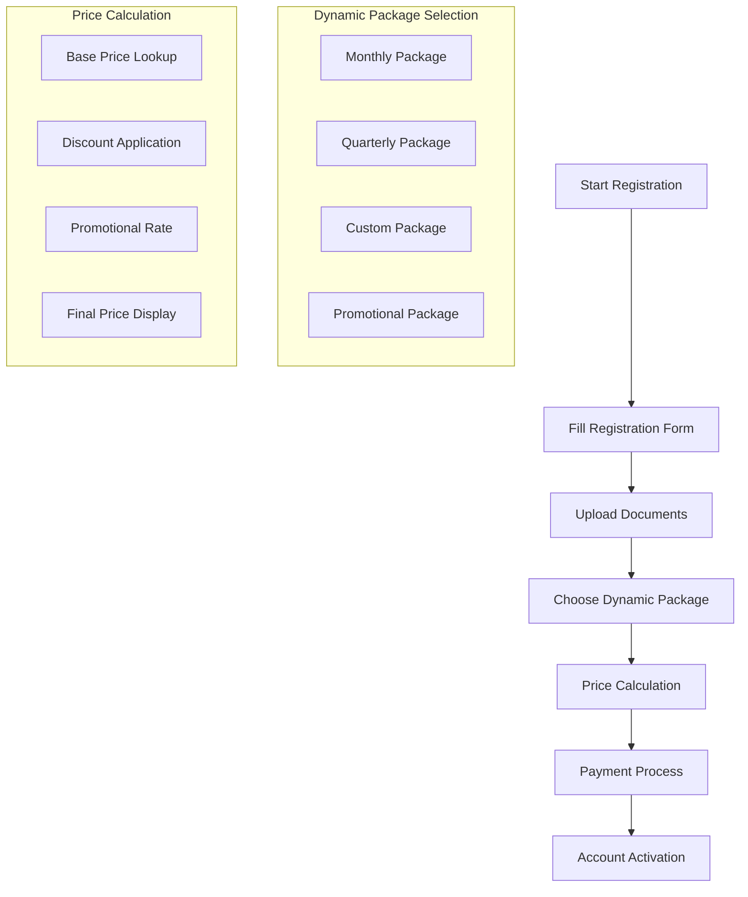

#### 1.1.1 Dynamic Registration Features

- **Flexible Package Selection**: Member dapat memilih dari berbagai paket yang dapat dikonfigurasi
- **Real-time Price Calculation**: Harga dihitung secara real-time berdasarkan konfigurasi terbaru
- **Promotional Pricing**: Sistem mendukung harga promosi yang dapat diatur
- **Package Customization**: Admin dapat membuat paket khusus sesuai kebutuhan
- **Dynamic Discounts**: Diskon dapat diterapkan berdasarkan berbagai kriteria

### 1.2 Fitur Manajemen Profile

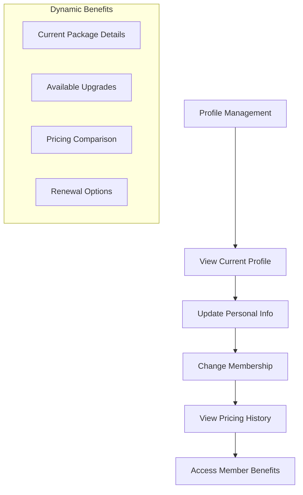

## 2. Modul Reservasi dan Booking

### 2.1 Dynamic Booking System

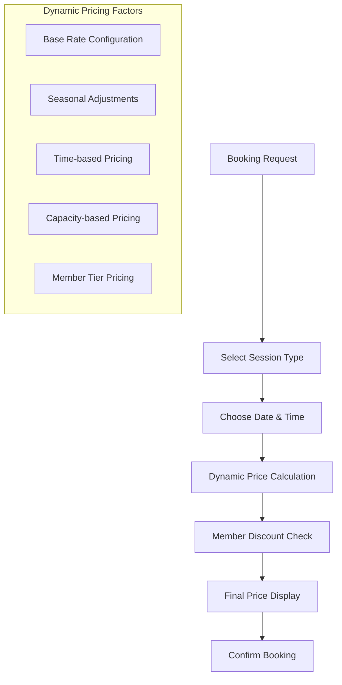

#### 2.1.1 Configurable Booking Features

- **Flexible Session Pricing**: Harga sesi dapat diatur berbeda untuk weekday/weekend
- **Seasonal Rate Adjustments**: Harga dapat disesuaikan berdasarkan musim
- **Capacity-based Pricing**: Harga dapat berubah berdasarkan kapasitas tersedia
- **Member Tier Pricing**: Harga berbeda untuk member vs non-member
- **Promotional Booking Rates**: Harga khusus untuk periode tertentu

### 2.2 Private Session Management

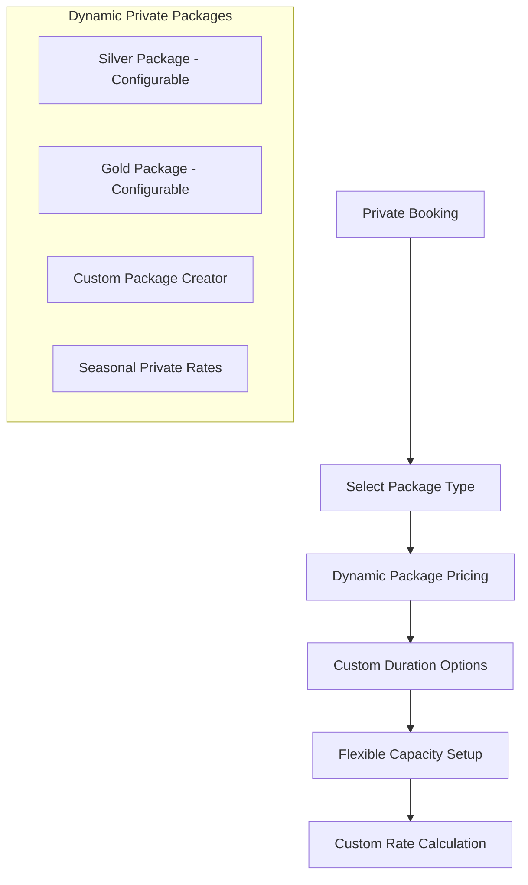

## 3. Modul Mini Cafe

### 3.1 Dynamic Menu Management

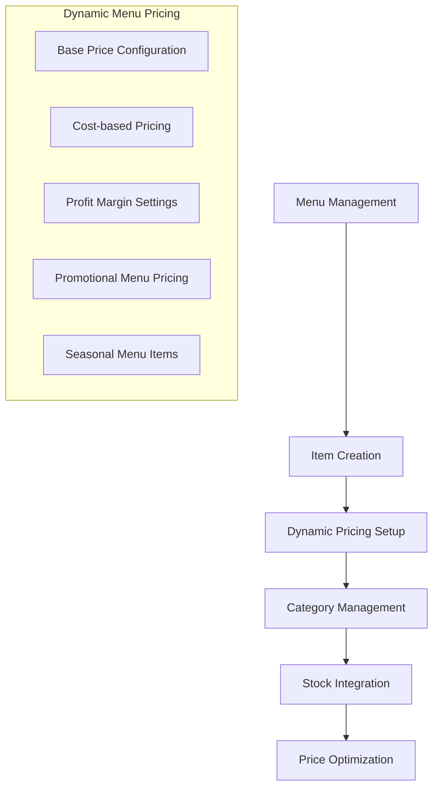

#### 3.1.1 Configurable Cafe Features

- **Flexible Menu Pricing**: Harga menu dapat diubah secara real-time
- **Cost-based Pricing**: Harga otomatis berdasarkan cost + margin
- **Promotional Menu**: Menu khusus dengan harga promosi
- **Seasonal Menus**: Menu yang berubah sesuai musim
- **Dynamic Inventory Pricing**: Harga dapat disesuaikan berdasarkan stock

### 3.2 Order Processing System

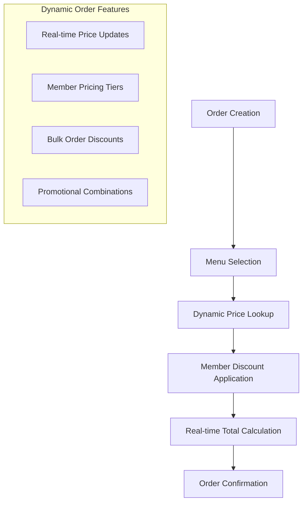

## 4. Modul Dynamic Pricing Management

### 4.1 Pricing Configuration System

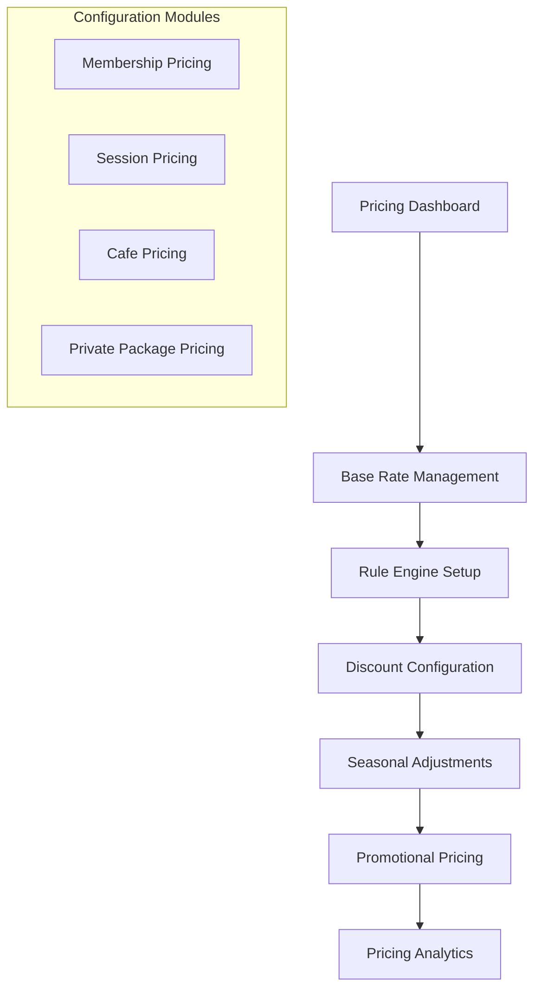

#### 4.1.1 Dynamic Pricing Features

- **Real-time Price Updates**: Perubahan harga langsung aktif
- **Scheduled Price Changes**: Harga dapat dijadwalkan untuk perubahan di masa depan
- **Conditional Pricing Rules**: Harga berdasarkan kondisi tertentu
- **Bulk Price Updates**: Update harga untuk multiple items sekaligus
- **Price History Tracking**: Riwayat perubahan harga yang lengkap

### 4.2 Pricing Rule Engine

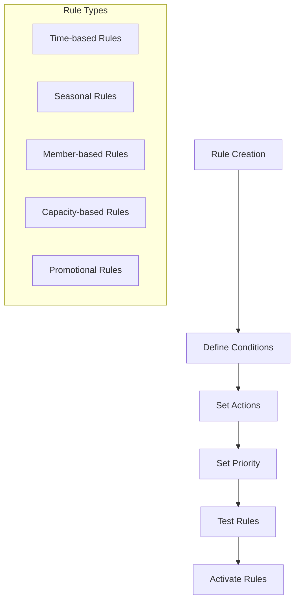

#### 4.2.1 Rule Engine Features

- **Flexible Rule Creation**: Admin dapat membuat aturan pricing yang kompleks
- **Rule Priority Management**: Aturan dengan prioritas tertinggi diterapkan terlebih dahulu
- **Rule Testing**: Sistem memungkinkan testing aturan sebelum diaktifkan
- **Rule Analytics**: Analisis performa aturan pricing
- **Rule Templates**: Template aturan yang dapat digunakan ulang

## 5. Modul Pembayaran

### 5.1 Flexible Payment Processing

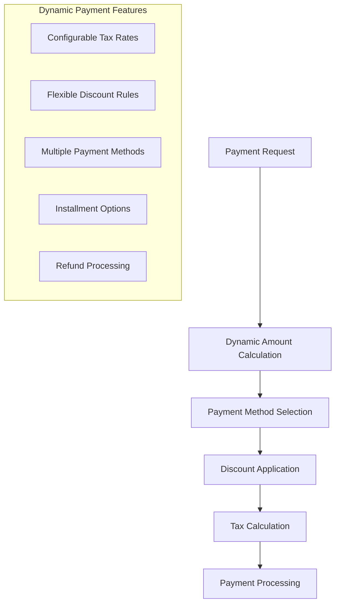

#### 5.1.1 Configurable Payment Features

- **Dynamic Tax Configuration**: Pajak dapat diatur berdasarkan lokasi/regulasi
- **Flexible Discount System**: Sistem diskon yang dapat dikonfigurasi
- **Multiple Payment Gateways**: Integrasi dengan berbagai payment gateway
- **Installment Plans**: Opsi cicilan dengan konfigurasi yang fleksibel
- **Promotional Payment Terms**: Syarat pembayaran khusus untuk promosi

## 6. Modul Laporan dan Analytics

### 6.1 Dynamic Revenue Analytics

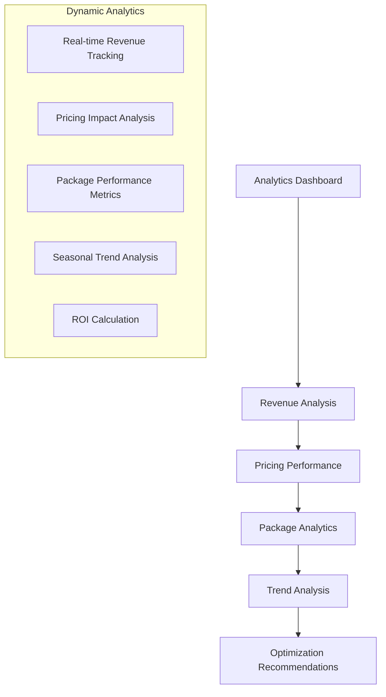

#### 6.1.1 Configurable Reporting Features

- **Custom Report Builder**: Admin dapat membuat laporan custom
- **Dynamic KPIs**: KPI yang dapat dikonfigurasi sesuai kebutuhan
- **Automated Insights**: Sistem memberikan insight otomatis
- **Export Flexibility**: Export data dalam berbagai format
- **Real-time Dashboards**: Dashboard yang update secara real-time

### 6.2 Pricing Analytics

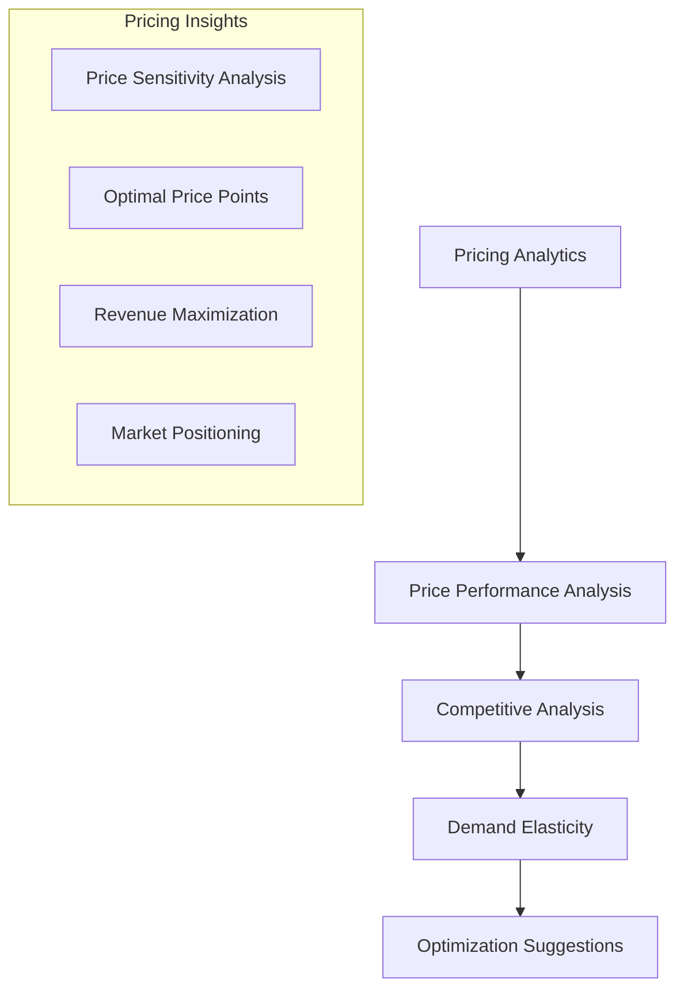

## 7. Modul Notifikasi

### 7.1 Dynamic Notification System

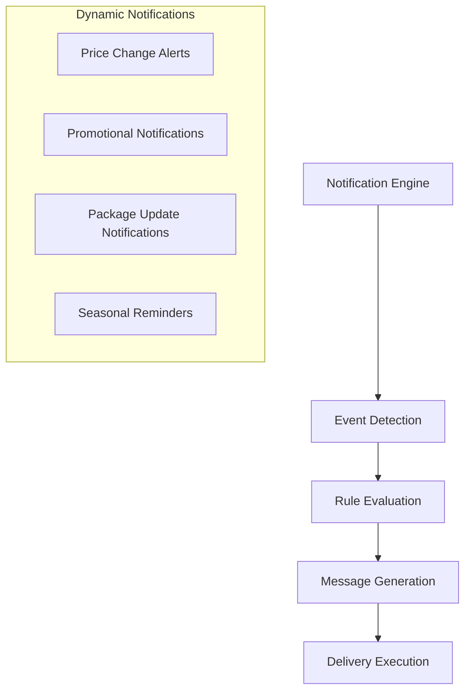

#### 7.1.1 Configurable Notification Features

- **Customizable Templates**: Template notifikasi yang dapat disesuaikan
- **Conditional Notifications**: Notifikasi berdasarkan kondisi tertentu
- **Scheduled Notifications**: Notifikasi yang dijadwalkan
- **Multi-channel Delivery**: Kirim ke email, SMS, push notification
- **Notification Analytics**: Analisis efektivitas notifikasi

## 8. Modul Tata Tertib dan Compliance

### 8.1 Dynamic Policy Management

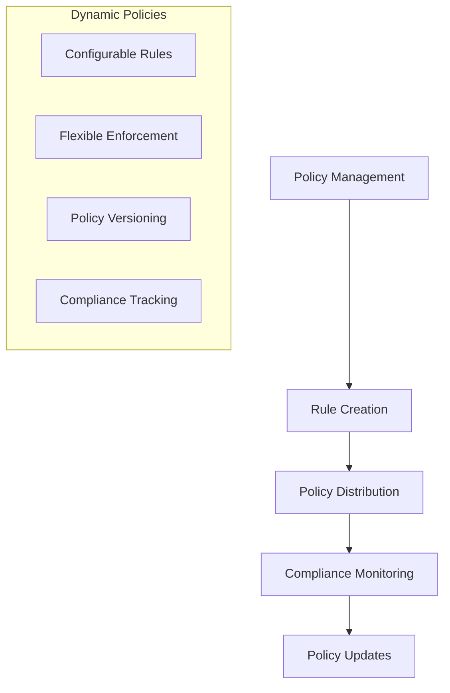

#### 8.1.1 Configurable Compliance Features

- **Flexible Rule Configuration**: Aturan yang dapat disesuaikan
- **Dynamic Policy Updates**: Update kebijakan secara real-time
- **Compliance Monitoring**: Monitoring kepatuhan secara otomatis
- **Audit Trail**: Jejak audit yang lengkap untuk semua perubahan
- **Regulatory Updates**: Update otomatis untuk perubahan regulasi

## 9. Admin Configuration Panel

### 9.1 Dynamic System Configuration

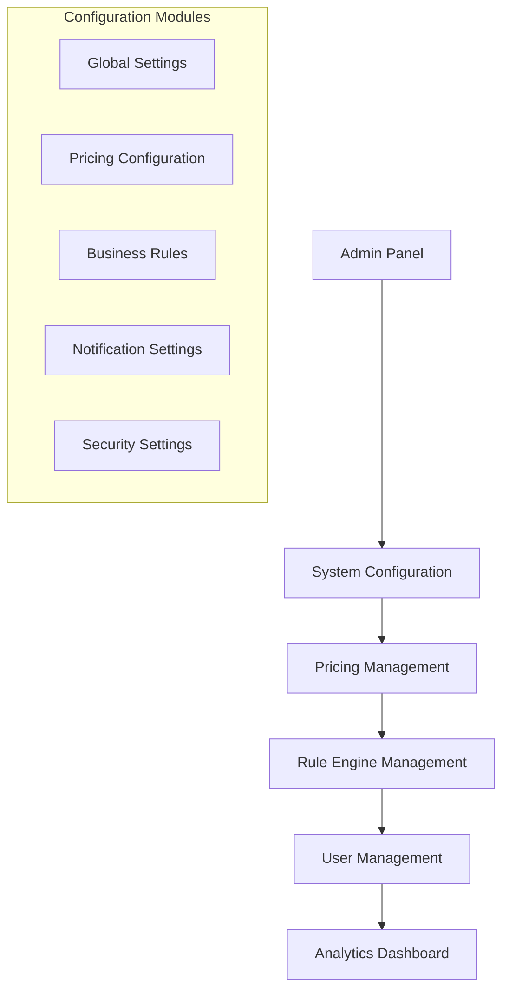

#### 9.1.1 Admin Features

- **Centralized Configuration**: Semua konfigurasi di satu tempat
- **Role-based Access**: Akses berdasarkan role dan permission
- **Configuration Templates**: Template konfigurasi yang dapat digunakan ulang
- **Configuration History**: Riwayat perubahan konfigurasi
- **Backup and Restore**: Backup dan restore konfigurasi

### 9.2 Pricing Management Interface

```json
{
  "pricing_management": {
    "membership_pricing": {
      "monthly_base": "configurable_field",
      "quarterly_base": "configurable_field",
      "quarterly_discount": "configurable_field"
    },
    "session_pricing": {
      "regular_weekday": "configurable_field",
      "regular_weekend": "configurable_field",
      "private_silver": "configurable_field",
      "private_gold": "configurable_field"
    },
    "cafe_pricing": {
      "cost_margin": "configurable_field",
      "promotional_discount": "configurable_field"
    },
    "pricing_rules": {
      "member_discount": "configurable_field",
      "seasonal_adjustment": "configurable_field",
      "promotional_rate": "configurable_field"
    }
  }
}
```

---

**Versi**: 1.2  
**Tanggal**: 26 Agustus 2025  
**Status**: Updated dengan dynamic pricing features  
**Berdasarkan**: PDF Raujan Pool Syariah
