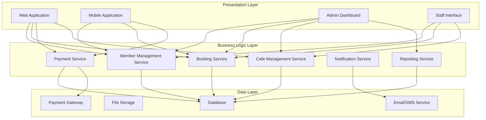
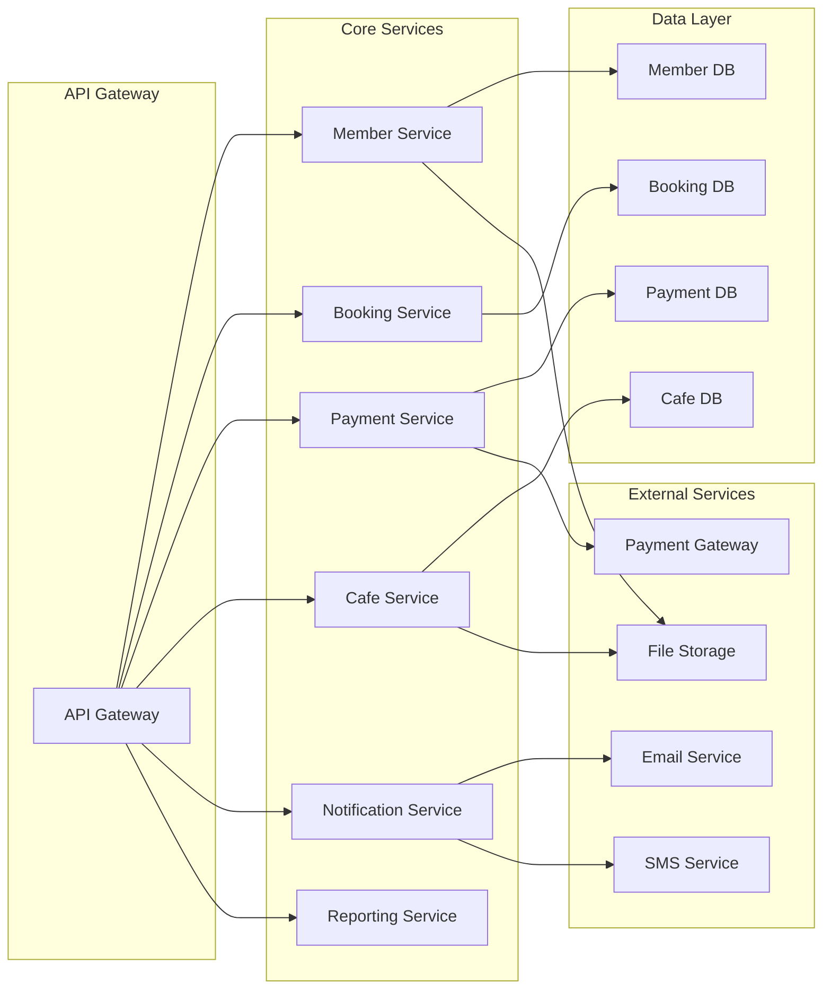
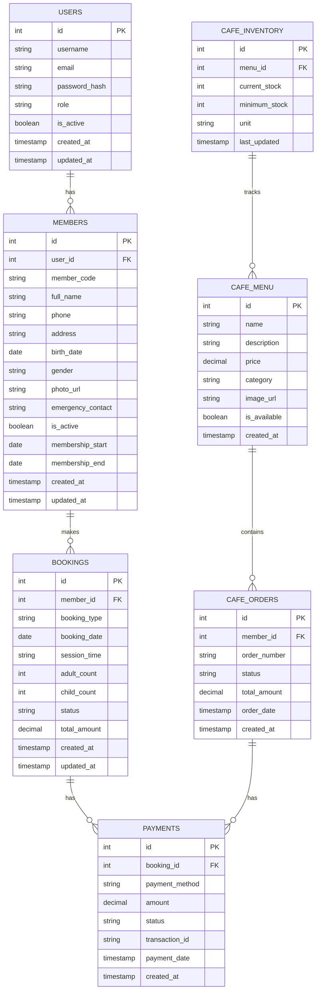
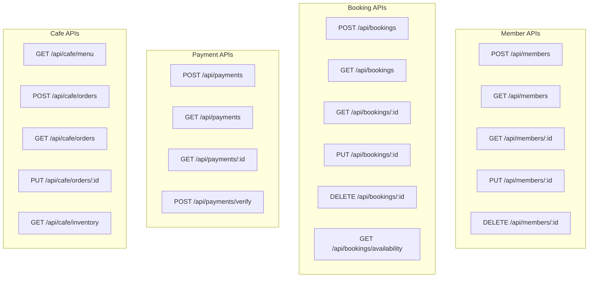
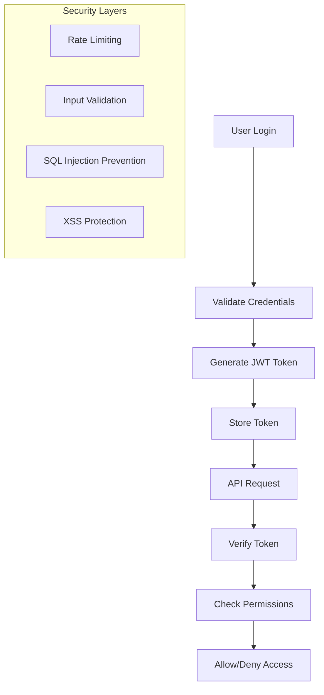
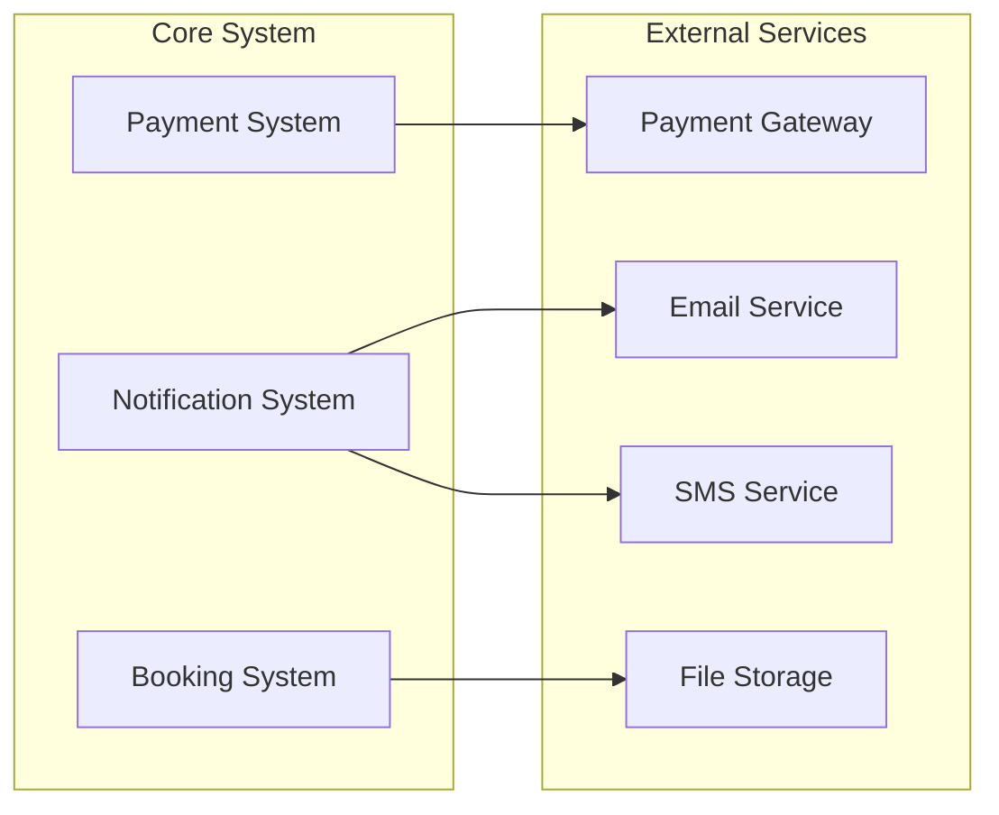
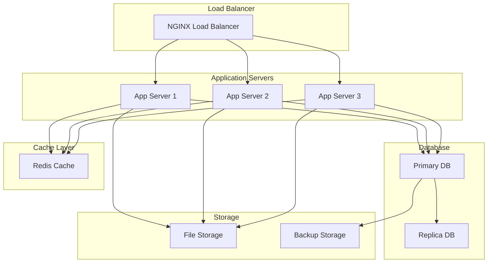
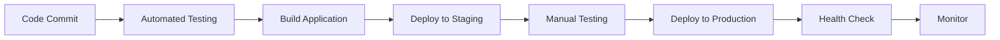

# Arsitektur Sistem - Kolam Renang Syariah

## 1. Arsitektur Umum

### 1.1 Arsitektur 3-Tier



### 1.2 Arsitektur Microservices



## 2. Teknologi Stack

### 2.1 Frontend Technologies

- **Web Application**

  - React.js atau Vue.js
  - Responsive design
  - Progressive Web App (PWA)
  - Real-time updates

- **Mobile Application**

  - React Native atau Flutter
  - Cross-platform compatibility
  - Offline capability
  - Push notifications

- **Admin Dashboard**
  - React.js dengan Material-UI
  - Real-time dashboard
  - Advanced analytics
  - Export functionality

### 2.2 Backend Technologies

- **API Framework**

  - Node.js dengan Express.js
  - RESTful API design
  - GraphQL (optional)
  - API documentation

- **Database**

  - MySQL atau PostgreSQL
  - Redis untuk caching
  - Database migration
  - Backup automation

- **Authentication**
  - JWT tokens
  - Role-based access control
  - Multi-factor authentication
  - Session management

### 2.3 Infrastructure

- **Hosting**

  - Cloud hosting (AWS/Azure/GCP)
  - Load balancing
  - Auto-scaling
  - CDN for static assets

- **Monitoring**
  - Application performance monitoring
  - Error tracking
  - Uptime monitoring
  - Log management

## 3. Database Design

### 3.1 Database Schema Overview



## 4. API Design

### 4.1 RESTful API Endpoints



### 4.2 API Response Format

```json
{
  "success": true,
  "data": {
    "id": 1,
    "member_code": "M001",
    "full_name": "Ahmad Rahman",
    "phone": "081234567890",
    "membership_status": "active",
    "membership_end": "2025-09-26"
  },
  "message": "Member retrieved successfully",
  "timestamp": "2025-08-26T10:30:00Z"
}
```

## 5. Security Architecture

### 5.1 Authentication & Authorization



### 5.2 Data Protection

- **Encryption**

  - Data at rest encryption
  - Data in transit encryption (HTTPS)
  - Password hashing (bcrypt)
  - Sensitive data masking

- **Access Control**
  - Role-based access control (RBAC)
  - API key management
  - Session management
  - Audit logging

## 6. Integration Architecture

### 6.1 External Integrations



### 6.2 Payment Integration

- **Payment Gateways**

  - Midtrans
  - Xendit
  - Doku
  - Manual payment tracking

- **Payment Methods**
  - Bank transfer
  - E-wallet
  - Credit/debit card
  - Cash payment

## 7. Deployment Architecture

### 7.1 Production Environment



### 7.2 CI/CD Pipeline



## 8. Performance & Scalability

### 8.1 Performance Optimization

- **Caching Strategy**

  - Redis for session data
  - CDN for static assets
  - Database query caching
  - API response caching

- **Database Optimization**
  - Indexing strategy
  - Query optimization
  - Connection pooling
  - Read replicas

### 8.2 Scalability Considerations

- **Horizontal Scaling**

  - Load balancing
  - Auto-scaling groups
  - Database sharding
  - Microservices architecture

- **Monitoring & Alerting**
  - Application performance monitoring
  - Infrastructure monitoring
  - Business metrics tracking
  - Automated alerting

---

**Versi**: 1.1  
**Tanggal**: 26 Agustus 2025  
**Status**: Updated berdasarkan PDF Raujan Pool Syariah
