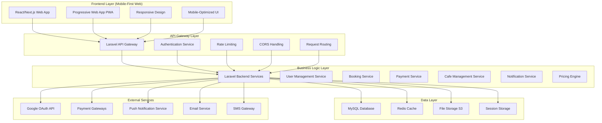
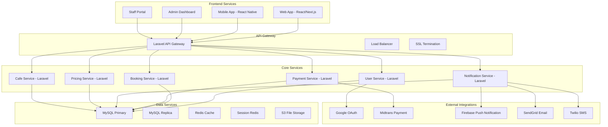
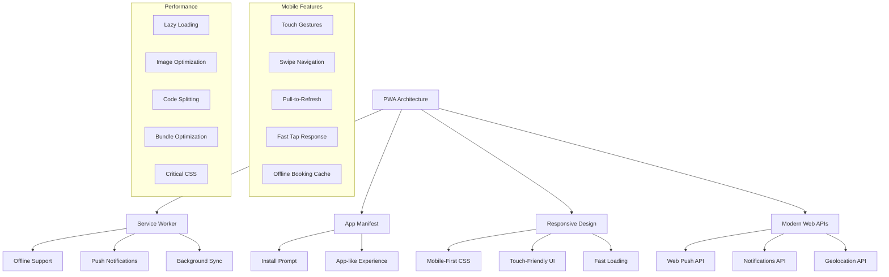
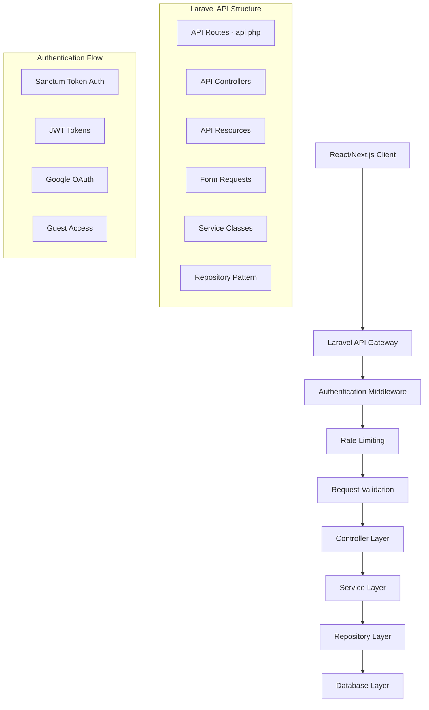
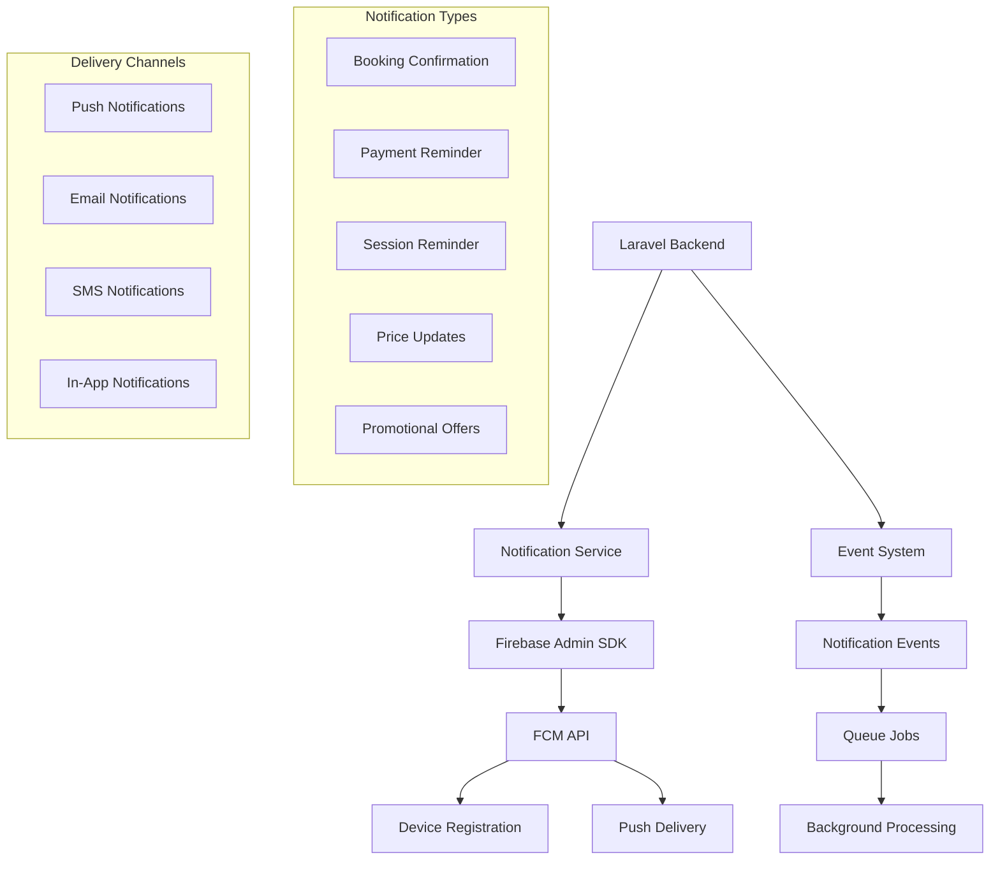
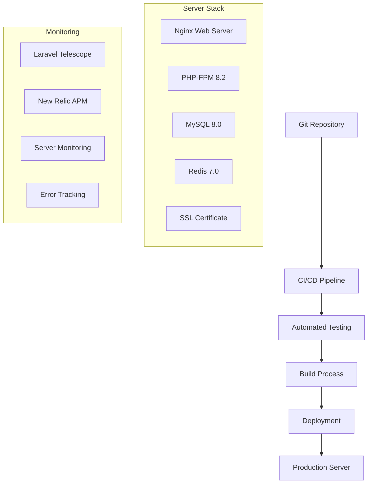

# Arsitektur Sistem - Sistem Kolam Renang Syariah

## 1. Arsitektur Umum

### 1.1 3-Tier Architecture (Mobile-First Web Application)



### 1.2 Microservices Architecture (Future Scalability)



## 2. Technology Stack

### 2.1 Frontend Stack

```json
{
  "frontend": {
    "framework": "React.js / Next.js",
    "styling": "Tailwind CSS",
    "state_management": "Redux Toolkit / Zustand",
    "routing": "React Router v6",
    "ui_components": "Headless UI / Radix UI",
    "mobile_friendly": "Progressive Web App (PWA)",
    "responsive_design": "Mobile-first approach",
    "charts": "Chart.js / Recharts",
    "forms": "React Hook Form",
    "validation": "Yup / Zod",
    "http_client": "Axios / React Query",
    "notifications": "React-Toastify / Hot Toast"
  }
}
```

### 2.2 Backend Stack

```json
{
  "backend": {
    "framework": "Laravel 11",
    "language": "PHP 8.2+",
    "database": "MySQL 8.0",
    "cache": "Redis 7.0",
    "queue": "Laravel Queue + Redis",
    "authentication": "Laravel Sanctum + JWT",
    "file_upload": "Laravel Storage + AWS S3",
    "validation": "Laravel Form Requests",
    "api": "Laravel API Resources",
    "testing": "Laravel Pest / PHPUnit",
    "deployment": "Laravel Forge / Vapor"
  }
}
```

### 2.3 Infrastructure Stack

```json
{
  "infrastructure": {
    "hosting": "AWS EC2 / DigitalOcean",
    "database": "AWS RDS MySQL",
    "cache": "AWS ElastiCache Redis",
    "storage": "AWS S3 + CloudFront",
    "cdn": "CloudFlare",
    "ssl": "Let's Encrypt / AWS Certificate Manager",
    "monitoring": "Laravel Telescope + New Relic",
    "logging": "Laravel Log + CloudWatch"
  }
}
```

### 2.4 External Services Integration

```json
{
  "integrations": {
    "authentication": {
      "google_oauth": "Google OAuth 2.0 API",
      "local_auth": "Laravel Sanctum"
    },
    "payment": {
      "midtrans": "Midtrans Payment Gateway",
      "manual_payment": "Custom Payment Tracker"
    },
    "notifications": {
      "push": "Firebase Cloud Messaging (FCM)",
      "email": "SendGrid / Laravel Mail",
      "sms": "Twilio SMS API"
    },
    "file_storage": {
      "aws_s3": "AWS S3 Bucket",
      "cloudfront": "AWS CloudFront Distribution"
    }
  }
}
```

## 3. Mobile-First Web Application Architecture

### 3.1 Progressive Web App (PWA) Features



### 3.2 Responsive Design Strategy

```json
{
  "responsive_breakpoints": {
    "mobile": "320px - 767px",
    "tablet": "768px - 1023px",
    "desktop": "1024px+",
    "large_desktop": "1440px+"
  },
  "design_principles": {
    "mobile_first": "Design for mobile first, then enhance for larger screens",
    "touch_friendly": "Minimum 44px touch targets",
    "fast_loading": "Optimize for slow mobile connections",
    "accessible": "WCAG 2.1 AA compliance",
    "offline_capable": "Core functionality works offline"
  }
}
```

## 4. API Design

### 4.1 Laravel API Architecture



### 4.2 API Endpoints Structure

```json
{
  "api_versioning": "v1",
  "authentication": {
    "login": "POST /api/v1/auth/login",
    "register": "POST /api/v1/auth/register",
    "google_login": "POST /api/v1/auth/google",
    "logout": "POST /api/v1/auth/logout",
    "refresh": "POST /api/v1/auth/refresh"
  },
  "booking": {
    "create": "POST /api/v1/bookings",
    "list": "GET /api/v1/bookings",
    "show": "GET /api/v1/bookings/{id}",
    "update": "PUT /api/v1/bookings/{id}",
    "cancel": "DELETE /api/v1/bookings/{id}"
  },
  "pricing": {
    "config": "GET /api/v1/pricing/config",
    "calculate": "POST /api/v1/pricing/calculate",
    "admin_update": "PUT /api/v1/pricing/config"
  },
  "notifications": {
    "subscribe": "POST /api/v1/notifications/subscribe",
    "unsubscribe": "POST /api/v1/notifications/unsubscribe"
  }
}
```

## 5. Push Notification Architecture

### 5.1 Firebase Cloud Messaging (FCM) Integration



### 5.2 Web Push Implementation

```javascript
// Service Worker for Push Notifications
self.addEventListener("push", function (event) {
  const options = {
    body: event.data.text(),
    icon: "/icon-192x192.png",
    badge: "/badge-72x72.png",
    vibrate: [100, 50, 100],
    data: {
      dateOfArrival: Date.now(),
      primaryKey: 1,
    },
    actions: [
      {
        action: "explore",
        title: "View Booking",
        icon: "/checkmark.png",
      },
      {
        action: "close",
        title: "Close",
        icon: "/xmark.png",
      },
    ],
  };

  event.waitUntil(self.registration.showNotification("Raujan Pool", options));
});
```

## 6. Security Architecture

### 6.1 Laravel Security Features

```json
{
  "security_layers": {
    "authentication": {
      "sanctum": "Laravel Sanctum for API tokens",
      "oauth": "Google OAuth 2.0 integration",
      "jwt": "JWT tokens for mobile apps",
      "session": "Secure session management"
    },
    "authorization": {
      "gates": "Laravel Gates for authorization",
      "policies": "Resource-based policies",
      "middleware": "Role-based access control"
    },
    "validation": {
      "form_requests": "Laravel Form Request validation",
      "sanitization": "Input sanitization",
      "sql_injection": "Eloquent ORM protection",
      "xss": "Blade template protection"
    },
    "encryption": {
      "hashing": "bcrypt password hashing",
      "encryption": "Laravel encryption API",
      "ssl": "HTTPS enforcement",
      "cors": "Cross-origin resource sharing"
    }
  }
}
```

## 7. Performance Optimization

### 7.1 Frontend Optimizations

```json
{
  "performance_strategies": {
    "code_splitting": "React.lazy() for route-based splitting",
    "lazy_loading": "Intersection Observer for images",
    "caching": "Service worker cache strategies",
    "bundling": "Webpack optimization",
    "preloading": "Critical resource preloading"
  },
  "mobile_optimizations": {
    "touch_optimized": "Large touch targets",
    "fast_rendering": "Optimized CSS and JS",
    "offline_support": "Service worker caching",
    "responsive_images": "WebP format with fallbacks"
  }
}
```

### 7.2 Backend Optimizations

```json
{
  "laravel_optimizations": {
    "caching": "Redis caching for queries and sessions",
    "database": "Query optimization and indexing",
    "queue": "Background job processing",
    "compression": "Gzip compression",
    "cdn": "Static asset delivery via CDN"
  },
  "api_optimizations": {
    "pagination": "API resource pagination",
    "filtering": "Optional field filtering",
    "rate_limiting": "API rate limiting",
    "compression": "Response compression"
  }
}
```

## 8. Deployment Architecture

### 8.1 Laravel Deployment



---

**Versi**: 1.2  
**Tanggal**: 26 Agustus 2025  
**Status**: Updated dengan Laravel + React/Next.js Stack  
**Berdasarkan**: PDF Raujan Pool Syariah  
**Key Features**:

- 🖥️ **Laravel Backend** dengan API-first approach
- 📱 **Mobile-First Web App** dengan PWA support
- 🔔 **Push Notifications** via Firebase FCM
- ⚡ **Performance Optimized** untuk mobile users
