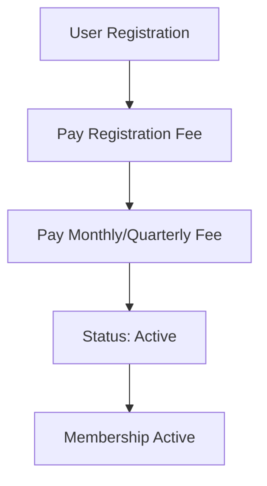
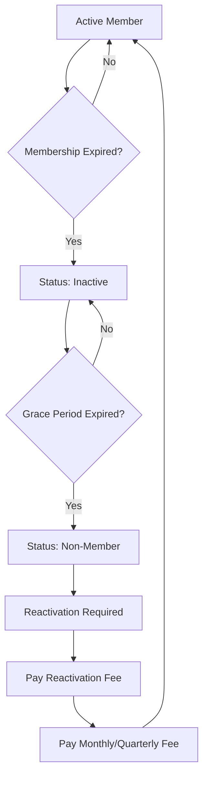
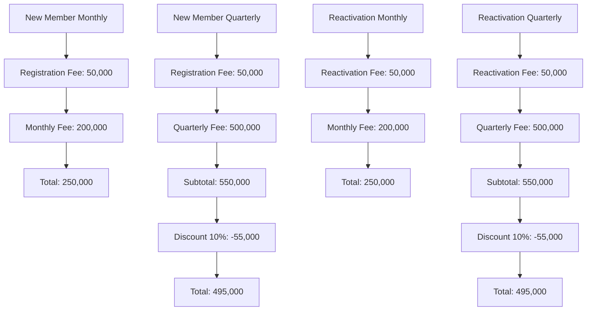

# Desain Database v2 - Member Schema Revision

## 📋 Overview

Dokumen ini merupakan revisi dari desain database untuk mengakomodasi perubahan skema member yang meliputi:

1. **Biaya registrasi dinamis** yang dapat dikonfigurasi admin
2. **Status member** yang berubah dari Active → Inactive → Non-Member
3. **Grace period** yang dapat dikonfigurasi admin (default 3 bulan)
4. **Biaya pendaftaran ulang** untuk reaktivasi member

## 🔄 Perubahan dari Versi Sebelumnya

### **Perubahan Utama:**

1. **Registration Fee System**: Biaya registrasi yang dapat dikonfigurasi
2. **Member Status Management**: Status member dengan lifecycle yang jelas
3. **Grace Period Configuration**: Periode tenggang yang dapat disesuaikan
4. **Reactivation Fee**: Biaya untuk mengaktifkan kembali member non-aktif

## 🗄️ Database Schema Changes

### 1. **System Configuration Table (New)**

```sql
CREATE TABLE system_configurations (
    id INT PRIMARY KEY AUTO_INCREMENT,
    config_key VARCHAR(100) UNIQUE NOT NULL,
    config_value TEXT NOT NULL,
    config_type ENUM('string', 'integer', 'decimal', 'boolean', 'json') NOT NULL,
    description TEXT NULL,
    is_active BOOLEAN DEFAULT TRUE,
    created_by INT NOT NULL,
    created_at TIMESTAMP DEFAULT CURRENT_TIMESTAMP,
    updated_at TIMESTAMP DEFAULT CURRENT_TIMESTAMP ON UPDATE CURRENT_TIMESTAMP,

    FOREIGN KEY (created_by) REFERENCES users(id) ON DELETE CASCADE,
    INDEX idx_config_key (config_key),
    INDEX idx_config_type (config_type),
    INDEX idx_is_active (is_active)
);
```

### 2. **Members Table (Updated)**

```sql
-- Drop existing members table and recreate with new schema
DROP TABLE IF EXISTS members;

CREATE TABLE members (
    id INT PRIMARY KEY AUTO_INCREMENT,
    user_id INT NOT NULL,
    user_profile_id INT NOT NULL,
    member_code VARCHAR(10) UNIQUE NOT NULL,

    -- Status Management
    status ENUM('active', 'inactive', 'non_member') DEFAULT 'active',
    is_active BOOLEAN GENERATED ALWAYS AS (status = 'active') STORED,

    -- Membership Period
    membership_start DATE NOT NULL,
    membership_end DATE NOT NULL,
    membership_type ENUM('monthly', 'quarterly') NOT NULL,

    -- Registration Information
    registration_method ENUM('manual', 'google_sso', 'guest_conversion') DEFAULT 'manual',
    converted_from_guest_id INT NULL,

    -- Payment Information
    pricing_package_id INT NULL,
    registration_fee_paid DECIMAL(10,2) DEFAULT 0.00,
    monthly_fee_paid DECIMAL(10,2) DEFAULT 0.00,
    total_paid DECIMAL(10,2) DEFAULT 0.00,

    -- Status Change Tracking
    status_changed_at TIMESTAMP NULL,
    status_changed_by INT NULL,
    status_change_reason TEXT NULL,

    -- Grace Period Tracking
    grace_period_start DATE NULL,
    grace_period_end DATE NULL,
    grace_period_days INT DEFAULT 90, -- 3 months default

    -- Reactivation Information
    reactivation_count INT DEFAULT 0,
    last_reactivation_date TIMESTAMP NULL,
    last_reactivation_fee DECIMAL(10,2) DEFAULT 0.00,

    -- Audit Fields
    created_at TIMESTAMP DEFAULT CURRENT_TIMESTAMP,
    updated_at TIMESTAMP DEFAULT CURRENT_TIMESTAMP ON UPDATE CURRENT_TIMESTAMP,

    FOREIGN KEY (user_id) REFERENCES users(id) ON DELETE CASCADE,
    FOREIGN KEY (user_profile_id) REFERENCES user_profiles(id) ON DELETE CASCADE,
    FOREIGN KEY (pricing_package_id) REFERENCES pricing_config(id),
    FOREIGN KEY (converted_from_guest_id) REFERENCES guest_users(id) ON DELETE SET NULL,
    FOREIGN KEY (status_changed_by) REFERENCES users(id) ON DELETE SET NULL,

    INDEX idx_member_code (member_code),
    INDEX idx_status (status),
    INDEX idx_is_active (is_active),
    INDEX idx_membership_end (membership_end),
    INDEX idx_grace_period_end (grace_period_end),
    INDEX idx_status_changed_at (status_changed_at),
    INDEX idx_registration_method (registration_method)
);
```

### 3. **Member Status History Table (New)**

```sql
CREATE TABLE member_status_history (
    id INT PRIMARY KEY AUTO_INCREMENT,
    member_id INT NOT NULL,
    previous_status ENUM('active', 'inactive', 'non_member') NULL,
    new_status ENUM('active', 'inactive', 'non_member') NOT NULL,
    change_reason TEXT NULL,
    change_type ENUM('automatic', 'manual', 'payment', 'reactivation') NOT NULL,
    changed_by INT NULL,
    changed_at TIMESTAMP DEFAULT CURRENT_TIMESTAMP,

    -- Additional context
    membership_end_date DATE NULL,
    grace_period_end_date DATE NULL,
    payment_amount DECIMAL(10,2) DEFAULT 0.00,
    payment_reference VARCHAR(100) NULL,

    FOREIGN KEY (member_id) REFERENCES members(id) ON DELETE CASCADE,
    FOREIGN KEY (changed_by) REFERENCES users(id) ON DELETE SET NULL,

    INDEX idx_member_id (member_id),
    INDEX idx_new_status (new_status),
    INDEX idx_change_type (change_type),
    INDEX idx_changed_at (changed_at)
);
```

### 4. **Member Payments Table (New)**

```sql
CREATE TABLE member_payments (
    id INT PRIMARY KEY AUTO_INCREMENT,
    member_id INT NOT NULL,
    payment_type ENUM('registration', 'monthly', 'quarterly', 'reactivation', 'penalty') NOT NULL,
    amount DECIMAL(10,2) NOT NULL,
    payment_method ENUM('cash', 'transfer', 'credit_card', 'debit_card') NOT NULL,
    payment_reference VARCHAR(100) NULL,
    payment_date TIMESTAMP DEFAULT CURRENT_TIMESTAMP,
    payment_status ENUM('pending', 'paid', 'failed', 'refunded') DEFAULT 'pending',

    -- Payment details
    description TEXT NULL,
    notes TEXT NULL,
    processed_by INT NULL,

    -- Audit fields
    created_at TIMESTAMP DEFAULT CURRENT_TIMESTAMP,
    updated_at TIMESTAMP DEFAULT CURRENT_TIMESTAMP ON UPDATE CURRENT_TIMESTAMP,

    FOREIGN KEY (member_id) REFERENCES members(id) ON DELETE CASCADE,
    FOREIGN KEY (processed_by) REFERENCES users(id) ON DELETE SET NULL,

    INDEX idx_member_id (member_id),
    INDEX idx_payment_type (payment_type),
    INDEX idx_payment_status (payment_status),
    INDEX idx_payment_date (payment_date)
);
```

## ⚙️ System Configuration Defaults

### **Initial Configuration Data**

```sql
-- Insert default system configurations
INSERT INTO system_configurations (config_key, config_value, config_type, description, created_by) VALUES
('member_registration_fee', '50000', 'decimal', 'Biaya registrasi member baru (dapat diubah admin)', 1),
('member_grace_period_days', '90', 'integer', 'Periode tenggang sebelum status berubah ke non_member (dalam hari)', 1),
('member_monthly_fee', '200000', 'decimal', 'Biaya bulanan membership (dapat diubah admin)', 1),
('member_quarterly_fee', '500000', 'decimal', 'Biaya triwulan membership (dapat diubah admin)', 1),
('member_quarterly_discount', '10', 'decimal', 'Diskon untuk pembayaran triwulan (dalam persen)', 1),
('member_reactivation_fee', '50000', 'decimal', 'Biaya reaktivasi member non-aktif (dapat diubah admin)', 1),
('member_auto_status_change', 'true', 'boolean', 'Otomatis ubah status member berdasarkan grace period', 1),
('member_notification_days_before_expiry', '7', 'integer', 'Notifikasi berapa hari sebelum membership berakhir', 1),
('member_notification_days_after_expiry', '3', 'integer', 'Notifikasi berapa hari setelah membership berakhir', 1);
```

## 🔄 Member Lifecycle Flow

### **1. Registration Process**



### **2. Status Change Flow**



### **3. Payment Flow**



## 📊 Business Rules

### **1. Registration Rules**

- **Registration Fee**: Dinamis, dapat diubah admin
- **Monthly Fee**: Dinamis, dapat diubah admin
- **Quarterly Fee**: Dinamis, dapat diubah admin
- **Quarterly Discount**: Persentase diskon dinamis (default 10%)
- **Total First Payment**:
  - Monthly: Registration Fee + Monthly Fee
  - Quarterly: (Registration Fee + Quarterly Fee) - (Quarterly Discount %)
- **Status**: Setelah pembayaran lengkap → `active`

### **2. Status Change Rules**

- **Active → Inactive**: Otomatis saat membership berakhir
- **Inactive → Non-Member**: Setelah grace period (default 3 bulan)
- **Grace Period**: Dapat dikonfigurasi admin (default 90 hari)
- **Status Change**: Dicatat di `member_status_history`

### **3. Reactivation Rules**

- **Non-Member → Active**: Membutuhkan pembayaran reactivation fee
- **Reactivation Fee**: Dinamis, dapat diubah admin
- **Payment Required**:
  - Monthly: Reactivation Fee + Monthly Fee
  - Quarterly: (Reactivation Fee + Quarterly Fee) - (Quarterly Discount %)
- **Reactivation Count**: Dicatat untuk tracking

### **4. Payment Rules**

- **Registration Payment**: Wajib untuk member baru
- **Monthly Payment**: Wajib untuk perpanjangan
- **Quarterly Payment**: Wajib untuk perpanjangan dengan diskon
- **Reactivation Payment**: Wajib untuk reaktivasi
- **Discount Application**: Otomatis untuk quarterly membership
- **Payment History**: Dicatat di `member_payments`

## 🔧 API Endpoints yang Perlu Diupdate

### **1. Member Registration**

```http
POST /api/v1/members/register
{
    "user_id": 1,
    "membership_type": "quarterly",
    "payment_method": "transfer"
}

Response:
{
    "success": true,
    "data": {
        "member": {...},
        "total_amount": 495000,
        "breakdown": {
            "registration_fee": 50000,
            "quarterly_fee": 500000,
            "subtotal": 550000,
            "discount_percentage": 10,
            "discount_amount": 55000,
            "final_amount": 495000
        }
    }
}
```

### **2. Member Status Management**

```http
PUT /api/v1/admin/members/{id}/status
{
    "status": "inactive",
    "reason": "Membership expired",
    "grace_period_days": 90
}
```

### **3. Member Reactivation**

```http
POST /api/v1/members/{id}/reactivate
{
    "payment_method": "transfer"
}

Response (Quarterly):
{
    "success": true,
    "data": {
        "member": {...},
        "total_amount": 495000,
        "breakdown": {
            "reactivation_fee": 50000,
            "quarterly_fee": 500000,
            "subtotal": 550000,
            "discount_percentage": 10,
            "discount_amount": 55000,
            "final_amount": 495000
        }
    }
}
```

### **4. System Configuration**

```http
GET /api/v1/admin/config/member
PUT /api/v1/admin/config/member
{
    "registration_fee": 75000,
    "grace_period_days": 120,
    "reactivation_fee": 75000,
    "quarterly_discount": 15
}

Response:
{
    "success": true,
    "data": {
        "registration_fee": 75000,
        "grace_period_days": 120,
        "reactivation_fee": 75000,
        "quarterly_discount": 15
    }
}
```

## 🧪 Testing Scenarios

### **1. Registration Testing**

- ✅ New member registration with registration fee
- ✅ Payment validation for registration + monthly fee
- ✅ Payment validation for registration + quarterly fee with discount
- ✅ Discount calculation for quarterly membership
- ✅ Status change to active after payment
- ✅ Member code generation

### **2. Status Change Testing**

- ✅ Automatic status change to inactive on expiry
- ✅ Automatic status change to non_member after grace period
- ✅ Manual status change by admin
- ✅ Status history tracking

### **3. Reactivation Testing**

- ✅ Non-member reactivation with fees
- ✅ Payment validation for reactivation (monthly)
- ✅ Payment validation for reactivation (quarterly with discount)
- ✅ Discount calculation for quarterly reactivation
- ✅ Reactivation count tracking
- ✅ Status change to active after reactivation

### **4. Configuration Testing**

- ✅ Dynamic configuration updates
- ✅ Configuration validation
- ✅ Configuration history tracking
- ✅ Admin permission validation
- ✅ Quarterly discount percentage updates
- ✅ Discount impact on pricing calculations

## 📈 Migration Strategy

### **1. Database Migration**

```sql
-- Step 1: Create new tables
-- Step 2: Migrate existing data
-- Step 3: Update existing members status
-- Step 4: Drop old columns (if any)
-- Step 5: Update indexes
```

### **2. Data Migration**

```sql
-- Migrate existing members
INSERT INTO members (
    user_id, user_profile_id, member_code, status,
    membership_start, membership_end, membership_type,
    registration_method, created_at, updated_at
)
SELECT
    user_id, user_profile_id, member_code,
    CASE
        WHEN is_active = 1 AND membership_end >= CURDATE() THEN 'active'
        WHEN is_active = 1 AND membership_end < CURDATE() THEN 'inactive'
        ELSE 'non_member'
    END as status,
    membership_start, membership_end, membership_type,
    registration_method, created_at, updated_at
FROM members_old;
```

## 🚀 Implementation Priority

### **Phase 1: Core Schema (Week 1)**

1. Create new database tables
2. Migrate existing data
3. Update member models
4. Basic API endpoints

### **Phase 2: Business Logic (Week 2)**

1. Member registration flow
2. Status change automation
3. Payment processing
4. Reactivation flow

### **Phase 3: Admin Features (Week 3)**

1. Configuration management
2. Status management
3. Payment tracking
4. Reporting

### **Phase 4: Testing & Documentation (Week 4)**

1. Comprehensive testing
2. API documentation
3. User guides
4. Deployment

## 📚 Related Documents

- [Member Management API Documentation](../backend/docs/api/member-management.md)
- [Payment System Documentation](../backend/docs/api/payment-system.md)
- [System Configuration Documentation](../backend/docs/api/system-configuration.md)
- [Member Status Lifecycle Documentation](../backend/docs/development/member-lifecycle.md)

---

**Version**: 2.0  
**Date**: January 15, 2025  
**Status**: Planning  
**Author**: Development Team  
**Reviewer**: Product Owner
