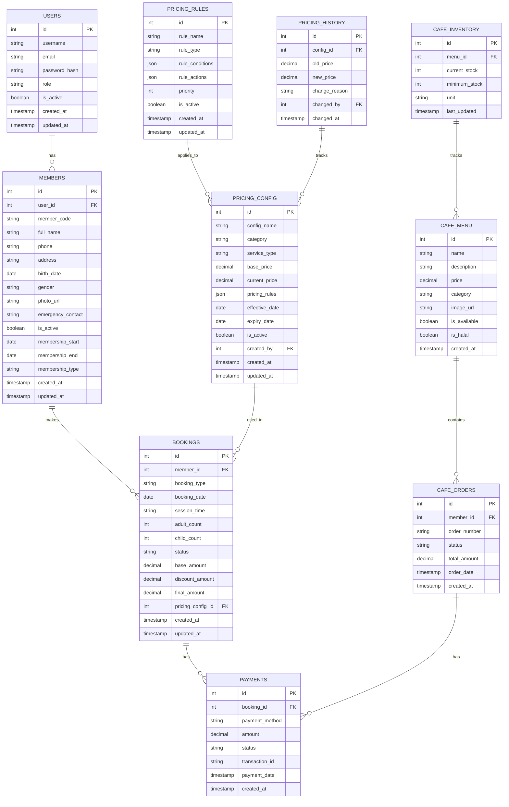
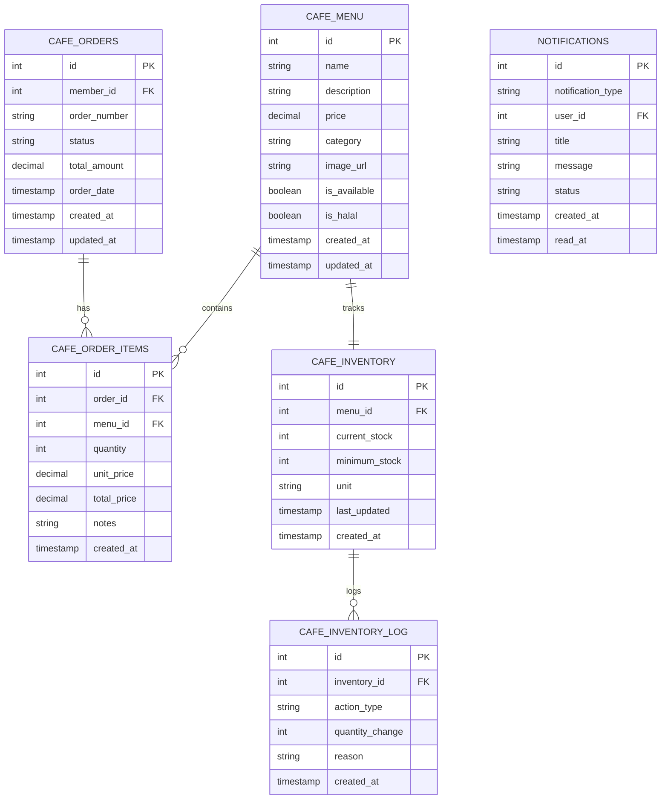

# Desain Database (ERD) - Sistem Kolam Renang Syariah

## 1. Entity Relationship Diagram (ERD)

### 1.1 ERD Utama dengan Dynamic Pricing



### 1.2 Cafe System ERD



## 2. Database Schema Detail

### 2.1 Dynamic Pricing Tables

#### 2.1.1 PRICING_CONFIG Table

```sql
CREATE TABLE pricing_config (
    id INT PRIMARY KEY AUTO_INCREMENT,
    config_name VARCHAR(100) NOT NULL,
    category ENUM('membership', 'regular_session', 'private_session', 'cafe', 'additional') NOT NULL,
    service_type VARCHAR(50) NOT NULL,
    base_price DECIMAL(10,2) NOT NULL DEFAULT 0.00,
    current_price DECIMAL(10,2) NOT NULL DEFAULT 0.00,
    pricing_rules JSON NULL,
    effective_date DATE NOT NULL,
    expiry_date DATE NULL,
    is_active BOOLEAN DEFAULT TRUE,
    created_by INT NOT NULL,
    created_at TIMESTAMP DEFAULT CURRENT_TIMESTAMP,
    updated_at TIMESTAMP DEFAULT CURRENT_TIMESTAMP ON UPDATE CURRENT_TIMESTAMP,

    INDEX idx_category (category),
    INDEX idx_service_type (service_type),
    INDEX idx_effective_date (effective_date),
    INDEX idx_is_active (is_active)
);
```

#### 2.1.2 PRICING_RULES Table

```sql
CREATE TABLE pricing_rules (
    id INT PRIMARY KEY AUTO_INCREMENT,
    rule_name VARCHAR(100) NOT NULL,
    rule_type ENUM('time_based', 'seasonal', 'member_discount', 'promotional', 'package', 'capacity') NOT NULL,
    rule_conditions JSON NOT NULL,
    rule_actions JSON NOT NULL,
    priority INT DEFAULT 0,
    is_active BOOLEAN DEFAULT TRUE,
    created_at TIMESTAMP DEFAULT CURRENT_TIMESTAMP,
    updated_at TIMESTAMP DEFAULT CURRENT_TIMESTAMP ON UPDATE CURRENT_TIMESTAMP,

    INDEX idx_rule_type (rule_type),
    INDEX idx_priority (priority),
    INDEX idx_is_active (is_active)
);
```

#### 2.1.3 PRICING_HISTORY Table

```sql
CREATE TABLE pricing_history (
    id INT PRIMARY KEY AUTO_INCREMENT,
    config_id INT NOT NULL,
    old_price DECIMAL(10,2),
    new_price DECIMAL(10,2) NOT NULL,
    change_reason VARCHAR(255),
    changed_by INT NOT NULL,
    changed_at TIMESTAMP DEFAULT CURRENT_TIMESTAMP,

    FOREIGN KEY (config_id) REFERENCES pricing_config(id) ON DELETE CASCADE,
    FOREIGN KEY (changed_by) REFERENCES users(id),
    INDEX idx_config_id (config_id),
    INDEX idx_changed_at (changed_at)
);
```

### 2.2 Updated Core Tables

#### 2.2.1 BOOKINGS Table (Updated)

```sql
CREATE TABLE bookings (
    id INT PRIMARY KEY AUTO_INCREMENT,
    member_id INT NOT NULL,
    booking_type ENUM('regular', 'private_silver', 'private_gold') NOT NULL,
    booking_date DATE NOT NULL,
    session_time ENUM('morning', 'afternoon') NOT NULL,
    adult_count INT NOT NULL DEFAULT 0,
    child_count INT NOT NULL DEFAULT 0,
    status ENUM('pending', 'confirmed', 'checked_in', 'completed', 'cancelled') DEFAULT 'pending',
    base_amount DECIMAL(10,2) NOT NULL,
    discount_amount DECIMAL(10,2) DEFAULT 0.00,
    final_amount DECIMAL(10,2) NOT NULL,
    pricing_config_id INT NULL,
    notes TEXT NULL,
    created_at TIMESTAMP DEFAULT CURRENT_TIMESTAMP,
    updated_at TIMESTAMP DEFAULT CURRENT_TIMESTAMP ON UPDATE CURRENT_TIMESTAMP,

    FOREIGN KEY (member_id) REFERENCES members(id) ON DELETE CASCADE,
    FOREIGN KEY (pricing_config_id) REFERENCES pricing_config(id),
    INDEX idx_member_id (member_id),
    INDEX idx_booking_date (booking_date),
    INDEX idx_status (status),
    INDEX idx_booking_type (booking_type)
);
```

#### 2.2.2 MEMBERS Table (Updated)

```sql
CREATE TABLE members (
    id INT PRIMARY KEY AUTO_INCREMENT,
    user_id INT NOT NULL,
    member_code VARCHAR(10) UNIQUE NOT NULL,
    full_name VARCHAR(100) NOT NULL,
    phone VARCHAR(15) UNIQUE NOT NULL,
    address TEXT NOT NULL,
    birth_date DATE NOT NULL,
    gender ENUM('male', 'female') NOT NULL,
    photo_url VARCHAR(255) NULL,
    emergency_contact VARCHAR(15) NULL,
    is_active BOOLEAN DEFAULT TRUE,
    membership_start DATE NOT NULL,
    membership_end DATE NOT NULL,
    membership_type ENUM('monthly', 'quarterly') NOT NULL,
    pricing_package_id INT NULL,
    created_at TIMESTAMP DEFAULT CURRENT_TIMESTAMP,
    updated_at TIMESTAMP DEFAULT CURRENT_TIMESTAMP ON UPDATE CURRENT_TIMESTAMP,

    FOREIGN KEY (user_id) REFERENCES users(id) ON DELETE CASCADE,
    FOREIGN KEY (pricing_package_id) REFERENCES pricing_config(id),
    INDEX idx_member_code (member_code),
    INDEX idx_phone (phone),
    INDEX idx_is_active (is_active),
    INDEX idx_membership_end (membership_end)
);
```

## 3. Data Seeding untuk Dynamic Pricing

### 3.1 Initial Pricing Configuration

```sql
-- Membership Packages
INSERT INTO pricing_config (config_name, category, service_type, base_price, current_price, effective_date, created_by) VALUES
('Monthly Membership', 'membership', 'monthly', 200000.00, 200000.00, '2025-01-01', 1),
('Quarterly Membership', 'membership', 'quarterly', 500000.00, 500000.00, '2025-01-01', 1),
('Quarterly Discount Rate', 'membership', 'quarterly_discount', 10.00, 10.00, '2025-01-01', 1);

-- Regular Sessions
INSERT INTO pricing_config (config_name, category, service_type, base_price, current_price, effective_date, created_by) VALUES
('Regular Weekday Adult', 'regular_session', 'weekday_adult', 25000.00, 25000.00, '2025-01-01', 1),
('Regular Weekday Child', 'regular_session', 'weekday_child', 20000.00, 20000.00, '2025-01-01', 1),
('Regular Weekend Adult', 'regular_session', 'weekend_adult', 30000.00, 30000.00, '2025-01-01', 1),
('Regular Weekend Child', 'regular_session', 'weekend_child', 25000.00, 25000.00, '2025-01-01', 1);

-- Private Sessions
INSERT INTO pricing_config (config_name, category, service_type, base_price, current_price, effective_date, created_by) VALUES
('Private Silver Package', 'private_session', 'silver', 200000.00, 200000.00, '2025-01-01', 1),
('Private Gold Package', 'private_session', 'gold', 400000.00, 400000.00, '2025-01-01', 1);
```

### 3.2 Pricing Rules

```sql
-- Member Discount Rule
INSERT INTO pricing_rules (rule_name, rule_type, rule_conditions, rule_actions, priority) VALUES
('Member Discount', 'member_discount',
 '{"member_status": "active", "membership_end": {"$gte": "current_date"}}',
 '{"discount_type": "percentage", "discount_value": 10}', 1);

-- Seasonal Pricing Rule (High Season)
INSERT INTO pricing_rules (rule_name, rule_type, rule_conditions, rule_actions, priority) VALUES
('High Season Pricing', 'seasonal',
 '{"date_range": {"start": "2025-06-01", "end": "2025-08-31"}, "day_type": ["saturday", "sunday"]}',
 '{"adjustment_type": "percentage", "adjustment_value": 15}', 2);

-- Promotional Pricing Rule
INSERT INTO pricing_rules (rule_name, rule_type, rule_conditions, rule_actions, priority) VALUES
('New Member Promotion', 'promotional',
 '{"member_status": "new", "days_since_registration": {"$lte": 7}}',
 '{"discount_type": "percentage", "discount_value": 20}', 3);
```

## 4. Views untuk Reporting

### 4.1 Pricing Analytics View

```sql
CREATE VIEW pricing_analytics AS
SELECT
    pc.config_name,
    pc.category,
    pc.current_price,
    pc.base_price,
    ((pc.current_price - pc.base_price) / pc.base_price * 100) as price_change_percentage,
    COUNT(pc.id) as times_used,
    SUM(b.final_amount) as total_revenue,
    AVG(b.final_amount) as avg_revenue_per_booking
FROM pricing_config pc
LEFT JOIN bookings b ON pc.id = b.pricing_config_id
WHERE pc.is_active = TRUE
GROUP BY pc.id, pc.config_name, pc.category;
```

### 4.2 Revenue by Pricing Category View

```sql
CREATE VIEW revenue_by_pricing_category AS
SELECT
    pc.category,
    pc.service_type,
    COUNT(b.id) as total_bookings,
    SUM(b.final_amount) as total_revenue,
    AVG(b.final_amount) as avg_revenue,
    MIN(b.final_amount) as min_revenue,
    MAX(b.final_amount) as max_revenue,
    DATE_FORMAT(b.created_at, '%Y-%m') as month
FROM pricing_config pc
JOIN bookings b ON pc.id = b.pricing_config_id
WHERE b.status IN ('confirmed', 'completed')
GROUP BY pc.category, pc.service_type, DATE_FORMAT(b.created_at, '%Y-%m');
```

## 5. Stored Procedures

### 5.1 Calculate Dynamic Price Procedure

```sql
DELIMITER //
CREATE PROCEDURE CalculateBookingPrice(
    IN p_booking_type VARCHAR(50),
    IN p_adult_count INT,
    IN p_child_count INT,
    IN p_booking_date DATE,
    IN p_session_time VARCHAR(20),
    IN p_member_id INT,
    OUT p_base_amount DECIMAL(10,2),
    OUT p_discount_amount DECIMAL(10,2),
    OUT p_final_amount DECIMAL(10,2),
    OUT p_pricing_config_id INT
)
BEGIN
    DECLARE v_base_price DECIMAL(10,2) DEFAULT 0;
    DECLARE v_child_price DECIMAL(10,2) DEFAULT 0;
    DECLARE v_discount_percentage DECIMAL(5,2) DEFAULT 0;
    DECLARE v_is_member BOOLEAN DEFAULT FALSE;
    DECLARE v_is_weekend BOOLEAN DEFAULT FALSE;

    -- Check if date is weekend
    SET v_is_weekend = DAYOFWEEK(p_booking_date) IN (1, 7);

    -- Check if member is active
    SELECT EXISTS(SELECT 1 FROM members WHERE id = p_member_id AND is_active = TRUE AND membership_end >= CURDATE()) INTO v_is_member;

    -- Get base pricing
    IF p_booking_type = 'regular' THEN
        IF v_is_weekend THEN
            SELECT current_price INTO v_base_price FROM pricing_config
            WHERE service_type = 'weekend_adult' AND is_active = TRUE LIMIT 1;
            SELECT current_price INTO v_child_price FROM pricing_config
            WHERE service_type = 'weekend_child' AND is_active = TRUE LIMIT 1;
        ELSE
            SELECT current_price INTO v_base_price FROM pricing_config
            WHERE service_type = 'weekday_adult' AND is_active = TRUE LIMIT 1;
            SELECT current_price INTO v_child_price FROM pricing_config
            WHERE service_type = 'weekday_child' AND is_active = TRUE LIMIT 1;
        END IF;

        SET p_base_amount = (v_base_price * p_adult_count) + (v_child_price * p_child_count);

    ELSEIF p_booking_type IN ('private_silver', 'private_gold') THEN
        SELECT current_price INTO v_base_price FROM pricing_config
        WHERE service_type = p_booking_type AND is_active = TRUE LIMIT 1;
        SET p_base_amount = v_base_price;
    END IF;

    -- Apply member discount
    IF v_is_member THEN
        SET v_discount_percentage = 10; -- 10% member discount
        SET p_discount_amount = p_base_amount * (v_discount_percentage / 100);
    ELSE
        SET p_discount_amount = 0;
    END IF;

    SET p_final_amount = p_base_amount - p_discount_amount;

    -- Get pricing config ID
    SELECT id INTO p_pricing_config_id FROM pricing_config
    WHERE service_type = CASE
        WHEN p_booking_type = 'regular' AND v_is_weekend THEN 'weekend_adult'
        WHEN p_booking_type = 'regular' AND NOT v_is_weekend THEN 'weekday_adult'
        ELSE p_booking_type
    END AND is_active = TRUE LIMIT 1;

END //
DELIMITER ;
```

### 5.2 Update Pricing Configuration Procedure

```sql
DELIMITER //
CREATE PROCEDURE UpdatePricingConfig(
    IN p_config_id INT,
    IN p_new_price DECIMAL(10,2),
    IN p_change_reason VARCHAR(255),
    IN p_updated_by INT
)
BEGIN
    DECLARE v_old_price DECIMAL(10,2);
    DECLARE EXIT HANDLER FOR SQLEXCEPTION
    BEGIN
        ROLLBACK;
        RESIGNAL;
    END;

    START TRANSACTION;

    -- Get current price
    SELECT current_price INTO v_old_price FROM pricing_config WHERE id = p_config_id;

    -- Update pricing config
    UPDATE pricing_config
    SET current_price = p_new_price, updated_at = CURRENT_TIMESTAMP
    WHERE id = p_config_id;

    -- Log price change
    INSERT INTO pricing_history (config_id, old_price, new_price, change_reason, changed_by)
    VALUES (p_config_id, v_old_price, p_new_price, p_change_reason, p_updated_by);

    COMMIT;
END //
DELIMITER ;
```

## 6. Triggers

### 6.1 Booking Price Calculation Trigger

```sql
DELIMITER //
CREATE TRIGGER before_booking_insert
BEFORE INSERT ON bookings
FOR EACH ROW
BEGIN
    DECLARE v_base_amount DECIMAL(10,2);
    DECLARE v_discount_amount DECIMAL(10,2);
    DECLARE v_final_amount DECIMAL(10,2);
    DECLARE v_pricing_config_id INT;

    -- Calculate pricing
    CALL CalculateBookingPrice(
        NEW.booking_type,
        NEW.adult_count,
        NEW.child_count,
        NEW.booking_date,
        NEW.session_time,
        NEW.member_id,
        v_base_amount,
        v_discount_amount,
        v_final_amount,
        v_pricing_config_id
    );

    -- Set calculated values
    SET NEW.base_amount = v_base_amount;
    SET NEW.discount_amount = v_discount_amount;
    SET NEW.final_amount = v_final_amount;
    SET NEW.pricing_config_id = v_pricing_config_id;
END //
DELIMITER ;
```

---

**Versi**: 1.2  
**Tanggal**: 26 Agustus 2025  
**Status**: Updated dengan dynamic pricing system  
**Berdasarkan**: PDF Raujan Pool Syariah
