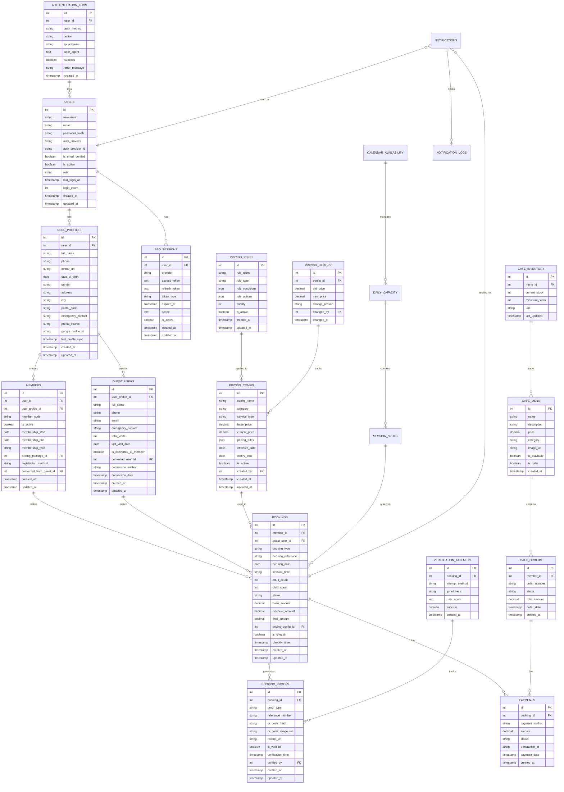
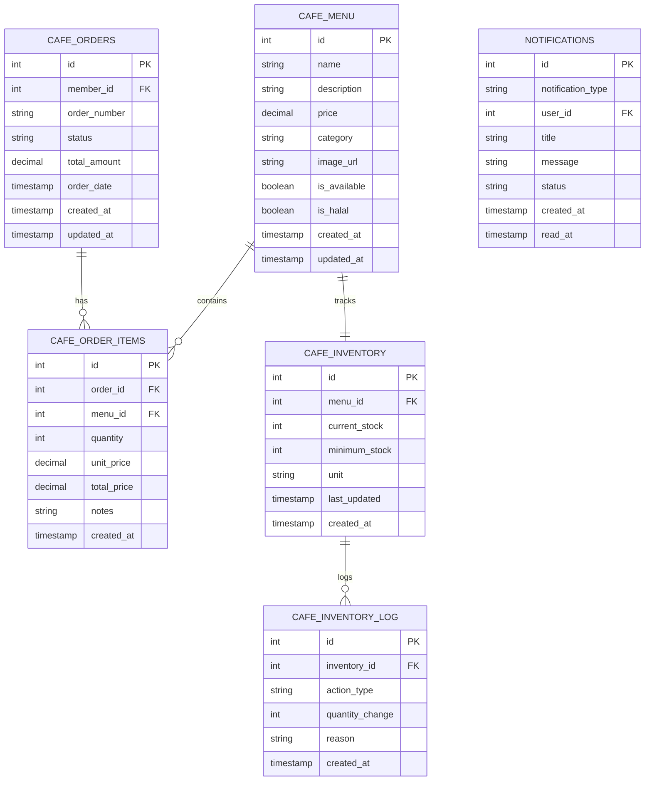

# Desain Database (ERD) - Sistem Kolam Renang Syariah

## 1. Entity Relationship Diagram (ERD)

### 1.1 ERD Utama dengan Dynamic Pricing, Guest Users, dan SSO



### 1.2 Cafe System ERD



## 2. Database Schema Detail

### 2.1 Dynamic Pricing Tables

#### 2.1.1 Calendar Availability Table

```sql
CREATE TABLE calendar_availability (
    id INT PRIMARY KEY AUTO_INCREMENT,
    date DATE NOT NULL,
    is_operational BOOLEAN DEFAULT TRUE,
    max_daily_capacity INT DEFAULT 20,
    morning_session_capacity INT DEFAULT 10,
    afternoon_session_capacity INT DEFAULT 10,
    special_rules TEXT NULL,
    created_at TIMESTAMP DEFAULT CURRENT_TIMESTAMP,
    updated_at TIMESTAMP DEFAULT CURRENT_TIMESTAMP ON UPDATE CURRENT_TIMESTAMP,

    UNIQUE KEY unique_date (date),
    INDEX idx_date (date),
    INDEX idx_operational (is_operational)
);
```

#### 2.1.2 Daily Capacity Table

```sql
CREATE TABLE daily_capacity (
    id INT PRIMARY KEY AUTO_INCREMENT,
    calendar_availability_id INT NOT NULL,
    date DATE NOT NULL,
    morning_adults_booked INT DEFAULT 0,
    morning_children_booked INT DEFAULT 0,
    afternoon_adults_booked INT DEFAULT 0,
    afternoon_children_booked INT DEFAULT 0,
    total_bookings INT DEFAULT 0,
    last_updated TIMESTAMP DEFAULT CURRENT_TIMESTAMP ON UPDATE CURRENT_TIMESTAMP,

    FOREIGN KEY (calendar_availability_id) REFERENCES calendar_availability(id) ON DELETE CASCADE,
    UNIQUE KEY unique_date_capacity (date),
    INDEX idx_date (date),
    INDEX idx_calendar_availability (calendar_availability_id)
);
```

#### 2.1.3 Session Slots Table

```sql
CREATE TABLE session_slots (
    id INT PRIMARY KEY AUTO_INCREMENT,
    daily_capacity_id INT NOT NULL,
    session_type ENUM('morning', 'afternoon') NOT NULL,
    max_adults INT DEFAULT 10,
    max_children INT DEFAULT 10,
    current_adults INT DEFAULT 0,
    current_children INT DEFAULT 0,
    is_available BOOLEAN DEFAULT TRUE,
    created_at TIMESTAMP DEFAULT CURRENT_TIMESTAMP,
    updated_at TIMESTAMP DEFAULT CURRENT_TIMESTAMP ON UPDATE CURRENT_TIMESTAMP,

    FOREIGN KEY (daily_capacity_id) REFERENCES daily_capacity(id) ON DELETE CASCADE,
    UNIQUE KEY unique_daily_session (daily_capacity_id, session_type),
    INDEX idx_daily_capacity (daily_capacity_id),
    INDEX idx_session_type (session_type),
    INDEX idx_availability (is_available)
);
```

#### 2.1.4 Notifications Table

```sql
CREATE TABLE notifications (
    id INT PRIMARY KEY AUTO_INCREMENT,
    user_id INT NULL,
    booking_id INT NULL,
    notification_type ENUM('booking_confirmation', 'booking_reminder', 'booking_cancelled', 'session_full', 'promotional') NOT NULL,
    title VARCHAR(255) NOT NULL,
    message TEXT NOT NULL,
    channel ENUM('email', 'sms', 'push', 'in_app') NOT NULL,
    status ENUM('pending', 'sent', 'delivered', 'failed') DEFAULT 'pending',
    scheduled_at TIMESTAMP NULL,
    sent_at TIMESTAMP NULL,
    delivery_attempts INT DEFAULT 0,
    created_at TIMESTAMP DEFAULT CURRENT_TIMESTAMP,
    updated_at TIMESTAMP DEFAULT CURRENT_TIMESTAMP ON UPDATE CURRENT_TIMESTAMP,

    FOREIGN KEY (user_id) REFERENCES users(id) ON DELETE CASCADE,
    FOREIGN KEY (booking_id) REFERENCES bookings(id) ON DELETE CASCADE,
    INDEX idx_user_id (user_id),
    INDEX idx_booking_id (booking_id),
    INDEX idx_notification_type (notification_type),
    INDEX idx_status (status),
    INDEX idx_scheduled_at (scheduled_at)
);
```

#### 2.1.5 Notification Logs Table

```sql
CREATE TABLE notification_logs (
    id INT PRIMARY KEY AUTO_INCREMENT,
    notification_id INT NOT NULL,
    channel ENUM('email', 'sms', 'push', 'in_app') NOT NULL,
    status ENUM('sent', 'delivered', 'failed', 'bounced') NOT NULL,
    response_data JSON NULL,
    error_message TEXT NULL,
    sent_at TIMESTAMP DEFAULT CURRENT_TIMESTAMP,

    FOREIGN KEY (notification_id) REFERENCES notifications(id) ON DELETE CASCADE,
    INDEX idx_notification_id (notification_id),
    INDEX idx_status (status),
    INDEX idx_sent_at (sent_at)
);
```

#### 2.1.6 PRICING_CONFIG Table

```sql
CREATE TABLE pricing_config (
    id INT PRIMARY KEY AUTO_INCREMENT,
    config_name VARCHAR(100) NOT NULL,
    category ENUM('membership', 'regular_session', 'private_session', 'cafe', 'additional') NOT NULL,
    service_type VARCHAR(50) NOT NULL,
    base_price DECIMAL(10,2) NOT NULL DEFAULT 0.00,
    current_price DECIMAL(10,2) NOT NULL DEFAULT 0.00,
    pricing_rules JSON NULL,
    effective_date DATE NOT NULL,
    expiry_date DATE NULL,
    is_active BOOLEAN DEFAULT TRUE,
    created_by INT NOT NULL,
    created_at TIMESTAMP DEFAULT CURRENT_TIMESTAMP,
    updated_at TIMESTAMP DEFAULT CURRENT_TIMESTAMP ON UPDATE CURRENT_TIMESTAMP,

    INDEX idx_category (category),
    INDEX idx_service_type (service_type),
    INDEX idx_effective_date (effective_date),
    INDEX idx_is_active (is_active)
);
```

#### 2.1.2 PRICING_RULES Table

```sql
CREATE TABLE pricing_rules (
    id INT PRIMARY KEY AUTO_INCREMENT,
    rule_name VARCHAR(100) NOT NULL,
    rule_type ENUM('time_based', 'seasonal', 'member_discount', 'promotional', 'package', 'capacity') NOT NULL,
    rule_conditions JSON NOT NULL,
    rule_actions JSON NOT NULL,
    priority INT DEFAULT 0,
    is_active BOOLEAN DEFAULT TRUE,
    created_at TIMESTAMP DEFAULT CURRENT_TIMESTAMP,
    updated_at TIMESTAMP DEFAULT CURRENT_TIMESTAMP ON UPDATE CURRENT_TIMESTAMP,

    INDEX idx_rule_type (rule_type),
    INDEX idx_priority (priority),
    INDEX idx_is_active (is_active)
);
```

#### 2.1.3 PRICING_HISTORY Table

````sql

#### 2.1.4 Member Daily Usage Tracking Table

```sql
CREATE TABLE member_daily_usage_tracking (
    id INT PRIMARY KEY AUTO_INCREMENT,
    member_id INT NOT NULL,
    usage_date DATE NOT NULL,
    sessions_used INT DEFAULT 0,
    free_sessions_used INT DEFAULT 0,
    paid_sessions_used INT DEFAULT 0,
    total_revenue DECIMAL(10,2) DEFAULT 0.00,

    -- Override Information
    override_applied BOOLEAN DEFAULT FALSE,
    override_reason TEXT NULL,
    override_type ENUM('extend_limit', 'reset_limit', 'custom_limit') NULL,
    override_limit INT DEFAULT 1,

    -- Session Information
    last_session_time TIMESTAMP NULL,
    last_session_type ENUM('free_member', 'paid_additional') NULL,

    created_at TIMESTAMP DEFAULT CURRENT_TIMESTAMP,
    updated_at TIMESTAMP DEFAULT CURRENT_TIMESTAMP ON UPDATE CURRENT_TIMESTAMP,

    FOREIGN KEY (member_id) REFERENCES members(id) ON DELETE CASCADE,
    UNIQUE KEY unique_member_date (member_id, usage_date),
    INDEX idx_member_id (member_id),
    INDEX idx_usage_date (usage_date),
    INDEX idx_override_applied (override_applied),
    INDEX idx_last_session_time (last_session_time)
);
````

#### 2.1.5 Member Limit Override Table

```sql
CREATE TABLE member_limit_overrides (
    id INT PRIMARY KEY AUTO_INCREMENT,
    member_id INT NOT NULL,
    override_date DATE NOT NULL,
    override_type ENUM('extend_limit', 'reset_limit', 'custom_limit') NOT NULL,
    original_limit INT NOT NULL,
    new_limit INT NOT NULL,
    override_reason TEXT NOT NULL,
    overridden_by INT NOT NULL,
    applied_at TIMESTAMP DEFAULT CURRENT_TIMESTAMP,
    valid_until TIMESTAMP NULL,
    is_active BOOLEAN DEFAULT TRUE,

    FOREIGN KEY (member_id) REFERENCES members(id) ON DELETE CASCADE,
    FOREIGN KEY (overridden_by) REFERENCES users(id) ON DELETE CASCADE,
    INDEX idx_member_id (member_id),
    INDEX idx_override_date (override_date),
    INDEX idx_override_type (override_type),
    INDEX idx_overridden_by (overridden_by),
    INDEX idx_applied_at (applied_at)
);
```

#### 2.1.6 Member Session History Table

```sql
CREATE TABLE member_session_history (
    id INT PRIMARY KEY AUTO_INCREMENT,
    member_id INT NOT NULL,
    session_date DATE NOT NULL,
    session_time TIME NOT NULL,
    session_type ENUM('free_member', 'paid_additional') NOT NULL,
    booking_id INT NOT NULL,
    amount_paid DECIMAL(10,2) DEFAULT 0.00,

    -- Override Information
    override_applied BOOLEAN DEFAULT FALSE,
    override_id INT NULL,

    -- Session Details
    session_duration INT DEFAULT 120, -- minutes
    check_in_time TIMESTAMP NULL,
    check_out_time TIMESTAMP NULL,

    created_at TIMESTAMP DEFAULT CURRENT_TIMESTAMP,

    FOREIGN KEY (member_id) REFERENCES members(id) ON DELETE CASCADE,
    FOREIGN KEY (booking_id) REFERENCES bookings(id) ON DELETE CASCADE,
    FOREIGN KEY (override_id) REFERENCES member_limit_overrides(id) ON DELETE SET NULL,
    INDEX idx_member_id (member_id),
    INDEX idx_session_date (session_date),
    INDEX idx_session_type (session_type),
    INDEX idx_booking_id (booking_id),
    INDEX idx_check_in_time (check_in_time)
);
```

#### 2.1.7 PRICING_HISTORY Table

CREATE TABLE pricing_history (
id INT PRIMARY KEY AUTO_INCREMENT,
config_id INT NOT NULL,
old_price DECIMAL(10,2),
new_price DECIMAL(10,2) NOT NULL,
change_reason VARCHAR(255),
changed_by INT NOT NULL,
changed_at TIMESTAMP DEFAULT CURRENT_TIMESTAMP,

    FOREIGN KEY (config_id) REFERENCES pricing_config(id) ON DELETE CASCADE,
    FOREIGN KEY (changed_by) REFERENCES users(id),
    INDEX idx_config_id (config_id),
    INDEX idx_changed_at (changed_at)

);

#### 2.1.8 Private Pool Bookings Table

```sql
CREATE TABLE private_pool_bookings (
    id INT PRIMARY KEY AUTO_INCREMENT,
    customer_id INT NULL,
    guest_customer_id INT NULL,

    -- Booking Details
    booking_date DATE NOT NULL,
    start_time TIME NOT NULL,
    end_time TIME NOT NULL,
    duration_minutes INT NOT NULL,
    bonus_minutes INT DEFAULT 0,

    -- Customer Classification
    is_new_customer BOOLEAN DEFAULT FALSE,
    visit_number INT DEFAULT 1,
    customer_type ENUM('new', 'returning') NOT NULL,

    -- Pricing
    base_price DECIMAL(10,2) NOT NULL,
    additional_charge DECIMAL(10,2) DEFAULT 0.00,
    bonus_discount DECIMAL(10,2) DEFAULT 0.00,
    total_amount DECIMAL(10,2) NOT NULL,

    -- Status
    booking_status ENUM('pending', 'confirmed', 'in_progress', 'completed', 'cancelled') DEFAULT 'pending',
    payment_status ENUM('pending', 'paid', 'refunded') DEFAULT 'pending',

    -- Timestamps
    created_at TIMESTAMP DEFAULT CURRENT_TIMESTAMP,
    updated_at TIMESTAMP DEFAULT CURRENT_TIMESTAMP ON UPDATE CURRENT_TIMESTAMP,

    FOREIGN KEY (customer_id) REFERENCES users(id) ON DELETE SET NULL,
    FOREIGN KEY (guest_customer_id) REFERENCES guest_users(id) ON DELETE SET NULL,

    INDEX idx_booking_date (booking_date),
    INDEX idx_customer_id (customer_id),
    INDEX idx_guest_customer_id (guest_customer_id),
    INDEX idx_booking_status (booking_status)
);
```

#### 2.1.9 Private Pool Pricing Configuration Table

```sql
CREATE TABLE private_pool_pricing_config (
    id INT PRIMARY KEY AUTO_INCREMENT,
    config_name VARCHAR(100) NOT NULL,

          -- Duration Settings (Updated: 1 hour 30 minutes standard)
standard_duration_minutes INT DEFAULT 90, -- 1 hour 30 minutes
bonus_duration_minutes INT DEFAULT 30,

    -- Pricing Rules
    base_price DECIMAL(10,2) NOT NULL,
    additional_charge_percentage DECIMAL(5,2) DEFAULT 0.00,
    additional_charge_fixed DECIMAL(10,2) DEFAULT 0.00,

    -- Visit Thresholds
    additional_charge_from_visit INT DEFAULT 2,
    max_bonus_visits INT DEFAULT 1,

    -- Bonus Rules
    bonus_discount_percentage DECIMAL(5,2) DEFAULT 0.00,
    bonus_discount_fixed DECIMAL(10,2) DEFAULT 0.00,

    -- Configuration
    is_active BOOLEAN DEFAULT TRUE,
    effective_date DATE NOT NULL,
    expiry_date DATE NULL,
    created_by INT NULL,
    updated_by INT NULL,

    created_at TIMESTAMP DEFAULT CURRENT_TIMESTAMP,
    updated_at TIMESTAMP DEFAULT CURRENT_TIMESTAMP ON UPDATE CURRENT_TIMESTAMP,

    FOREIGN KEY (created_by) REFERENCES users(id) ON DELETE SET NULL,
    FOREIGN KEY (updated_by) REFERENCES users(id) ON DELETE SET NULL,

    INDEX idx_config_name (config_name),
    INDEX idx_effective_date (effective_date),
    INDEX idx_is_active (is_active)
);
```

#### 2.1.10 Customer Visit History Table

```sql
CREATE TABLE customer_visit_history (
    id INT PRIMARY KEY AUTO_INCREMENT,
    customer_id INT NULL,
    guest_customer_id INT NULL,
    phone_number VARCHAR(20) NOT NULL,

    -- Visit Information
    total_visits INT DEFAULT 1,
    first_visit_date DATE NOT NULL,
    last_visit_date DATE NOT NULL,

    -- Private Pool History
    private_pool_visits INT DEFAULT 0,
    total_private_pool_spent DECIMAL(10,2) DEFAULT 0.00,

    -- Customer Classification
    customer_status ENUM('new', 'returning', 'regular') DEFAULT 'new',
    loyalty_points INT DEFAULT 0,

    created_at TIMESTAMP DEFAULT CURRENT_TIMESTAMP,
    updated_at TIMESTAMP DEFAULT CURRENT_TIMESTAMP ON UPDATE CURRENT_TIMESTAMP,

    FOREIGN KEY (customer_id) REFERENCES users(id) ON DELETE SET NULL,
    FOREIGN KEY (guest_customer_id) REFERENCES guest_users(id) ON DELETE SET NULL,

    UNIQUE KEY unique_customer_phone (phone_number),
    INDEX idx_customer_id (customer_id),
    INDEX idx_guest_customer_id (guest_customer_id),
    INDEX idx_phone_number (phone_number),
    INDEX idx_total_visits (total_visits),
    INDEX idx_customer_status (customer_status)
);
```

### 2.2 Authentication dan SSO Tables

#### 2.2.1 USERS Table (Updated with SSO Support)

```sql
CREATE TABLE users (
    id INT PRIMARY KEY AUTO_INCREMENT,
    username VARCHAR(50) UNIQUE,
    email VARCHAR(100) UNIQUE NOT NULL,
    password_hash VARCHAR(255) NULL,
    auth_provider ENUM('local', 'google', 'facebook') DEFAULT 'local',
    auth_provider_id VARCHAR(255) NULL,
    is_email_verified BOOLEAN DEFAULT FALSE,
    is_active BOOLEAN DEFAULT TRUE,
    role ENUM('admin', 'staff', 'member', 'guest') DEFAULT 'guest',
    last_login_at TIMESTAMP NULL,
    login_count INT DEFAULT 0,
    created_at TIMESTAMP DEFAULT CURRENT_TIMESTAMP,
    updated_at TIMESTAMP DEFAULT CURRENT_TIMESTAMP ON UPDATE CURRENT_TIMESTAMP,

    INDEX idx_email (email),
    INDEX idx_auth_provider (auth_provider),
    INDEX idx_auth_provider_id (auth_provider_id),
    INDEX idx_is_active (is_active)
);
```

#### 2.2.2 USER_PROFILES Table (Enhanced for SSO)

```sql
CREATE TABLE user_profiles (
    id INT PRIMARY KEY AUTO_INCREMENT,
    user_id INT NOT NULL,
    full_name VARCHAR(100) NOT NULL,
    phone VARCHAR(15),
    avatar_url VARCHAR(255),
    date_of_birth DATE NULL,
    gender ENUM('male', 'female', 'other') NULL,
    address TEXT,
    city VARCHAR(50),
    postal_code VARCHAR(10),
    emergency_contact VARCHAR(15),
    profile_source ENUM('manual', 'google_sync', 'merged') DEFAULT 'manual',
    google_profile_id VARCHAR(255) NULL,
    last_profile_sync TIMESTAMP NULL,
    created_at TIMESTAMP DEFAULT CURRENT_TIMESTAMP,
    updated_at TIMESTAMP DEFAULT CURRENT_TIMESTAMP ON UPDATE CURRENT_TIMESTAMP,

    FOREIGN KEY (user_id) REFERENCES users(id) ON DELETE CASCADE,
    INDEX idx_user_id (user_id),
    INDEX idx_google_profile_id (google_profile_id),
    INDEX idx_profile_source (profile_source)
);
```

#### 2.2.3 SSO_SESSIONS Table

```sql
CREATE TABLE sso_sessions (
    id INT PRIMARY KEY AUTO_INCREMENT,
    user_id INT NOT NULL,
    provider ENUM('google', 'facebook') NOT NULL,
    access_token TEXT NOT NULL,
    refresh_token TEXT,
    token_type VARCHAR(50) DEFAULT 'Bearer',
    expires_at TIMESTAMP NOT NULL,
    scope TEXT,
    is_active BOOLEAN DEFAULT TRUE,
    created_at TIMESTAMP DEFAULT CURRENT_TIMESTAMP,
    updated_at TIMESTAMP DEFAULT CURRENT_TIMESTAMP ON UPDATE CURRENT_TIMESTAMP,

    FOREIGN KEY (user_id) REFERENCES users(id) ON DELETE CASCADE,
    INDEX idx_user_id (user_id),
    INDEX idx_provider (provider),
    INDEX idx_expires_at (expires_at),
    INDEX idx_is_active (is_active)
);
```

#### 2.2.4 AUTHENTICATION_LOGS Table

```sql
CREATE TABLE authentication_logs (
    id INT PRIMARY KEY AUTO_INCREMENT,
    user_id INT NULL,
    auth_method ENUM('email_password', 'google_oauth', 'guest_access') NOT NULL,
    action ENUM('login', 'logout', 'failed_login', 'password_reset', 'sso_login') NOT NULL,
    ip_address VARCHAR(45),
    user_agent TEXT,
    success BOOLEAN DEFAULT TRUE,
    error_message VARCHAR(255) NULL,
    created_at TIMESTAMP DEFAULT CURRENT_TIMESTAMP,

    FOREIGN KEY (user_id) REFERENCES users(id) ON DELETE SET NULL,
    INDEX idx_user_id (user_id),
    INDEX idx_auth_method (auth_method),
    INDEX idx_action (action),
    INDEX idx_created_at (created_at)
);
```

### 2.3 Guest User Management Tables

#### 2.3.1 GUEST_USERS Table (Updated for SSO Conversion)

```sql
CREATE TABLE guest_users (
    id INT PRIMARY KEY AUTO_INCREMENT,
    user_profile_id INT NULL,
    full_name VARCHAR(100) NOT NULL,
    phone VARCHAR(15) NOT NULL,
    email VARCHAR(100),
    emergency_contact VARCHAR(15),
    total_visits INT DEFAULT 0,
    last_visit_date DATE,
    is_converted_to_member BOOLEAN DEFAULT FALSE,
    converted_user_id INT NULL,
    conversion_method ENUM('manual', 'google_sso') NULL,
    conversion_date TIMESTAMP NULL,
    created_at TIMESTAMP DEFAULT CURRENT_TIMESTAMP,
    updated_at TIMESTAMP DEFAULT CURRENT_TIMESTAMP ON UPDATE CURRENT_TIMESTAMP,

    FOREIGN KEY (user_profile_id) REFERENCES user_profiles(id) ON DELETE SET NULL,
    FOREIGN KEY (converted_user_id) REFERENCES users(id) ON DELETE SET NULL,
    INDEX idx_phone (phone),
    INDEX idx_email (email),
    INDEX idx_is_converted (is_converted_to_member),
    INDEX idx_conversion_method (conversion_method)
);
```

#### 2.3.2 BOOKING_PROOFS Table

```sql
CREATE TABLE booking_proofs (
    id INT PRIMARY KEY AUTO_INCREMENT,
    booking_id INT NOT NULL,
    proof_type ENUM('qr_code', 'reference', 'receipt', 'sms', 'email') NOT NULL,
    reference_number VARCHAR(20) UNIQUE NOT NULL,
    qr_code_hash VARCHAR(255),
    qr_code_image_url VARCHAR(255),
    receipt_url VARCHAR(255),
    is_verified BOOLEAN DEFAULT FALSE,
    verification_time TIMESTAMP NULL,
    verified_by INT NULL,
    created_at TIMESTAMP DEFAULT CURRENT_TIMESTAMP,
    updated_at TIMESTAMP DEFAULT CURRENT_TIMESTAMP ON UPDATE CURRENT_TIMESTAMP,

    FOREIGN KEY (booking_id) REFERENCES bookings(id) ON DELETE CASCADE,
    FOREIGN KEY (verified_by) REFERENCES users(id),
    INDEX idx_booking_id (booking_id),
    INDEX idx_reference_number (reference_number),
    INDEX idx_qr_code_hash (qr_code_hash),
    INDEX idx_is_verified (is_verified)
);
```

#### 2.3.3 VERIFICATION_ATTEMPTS Table

```sql
CREATE TABLE verification_attempts (
    id INT PRIMARY KEY AUTO_INCREMENT,
    booking_id INT NULL,
    attempt_method ENUM('qr', 'reference', 'phone', 'email') NOT NULL,
    ip_address VARCHAR(45),
    user_agent TEXT,
    success BOOLEAN,
    created_at TIMESTAMP DEFAULT CURRENT_TIMESTAMP,

    FOREIGN KEY (booking_id) REFERENCES bookings(id) ON DELETE SET NULL,
    INDEX idx_booking_id (booking_id),
    INDEX idx_created_at (created_at),
    INDEX idx_success (success)
);
```

### 2.4 Updated Core Tables untuk SSO Support

#### 2.4.1 MEMBERS Table (Updated with Profile Reference)

```sql
CREATE TABLE members (
    id INT PRIMARY KEY AUTO_INCREMENT,
    user_id INT NOT NULL,
    user_profile_id INT NOT NULL,
    member_code VARCHAR(10) UNIQUE NOT NULL,
    is_active BOOLEAN DEFAULT TRUE,
    membership_start DATE NOT NULL,
    membership_end DATE NOT NULL,
    membership_type ENUM('monthly', 'quarterly') NOT NULL,
    pricing_package_id INT NULL,
    registration_method ENUM('manual', 'google_sso', 'guest_conversion') DEFAULT 'manual',
    converted_from_guest_id INT NULL,
    created_at TIMESTAMP DEFAULT CURRENT_TIMESTAMP,
    updated_at TIMESTAMP DEFAULT CURRENT_TIMESTAMP ON UPDATE CURRENT_TIMESTAMP,

    FOREIGN KEY (user_id) REFERENCES users(id) ON DELETE CASCADE,
    FOREIGN KEY (user_profile_id) REFERENCES user_profiles(id) ON DELETE CASCADE,
    FOREIGN KEY (pricing_package_id) REFERENCES pricing_config(id),
    FOREIGN KEY (converted_from_guest_id) REFERENCES guest_users(id) ON DELETE SET NULL,
    INDEX idx_member_code (member_code),
    INDEX idx_is_active (is_active),
    INDEX idx_membership_end (membership_end),
    INDEX idx_registration_method (registration_method)
);
```

#### 2.4.2 BOOKINGS Table (Updated with Guest Support)

```sql
CREATE TABLE bookings (
    id INT PRIMARY KEY AUTO_INCREMENT,
    member_id INT NULL,
    guest_user_id INT NULL,
    booking_type ENUM('regular', 'private_silver', 'private_gold') NOT NULL,
    booking_reference VARCHAR(20) UNIQUE NOT NULL,
    booking_date DATE NOT NULL,
    session_time ENUM('morning', 'afternoon') NOT NULL,
    adult_count INT NOT NULL DEFAULT 0,
    child_count INT NOT NULL DEFAULT 0,
    status ENUM('pending', 'confirmed', 'checked_in', 'completed', 'cancelled') DEFAULT 'pending',
    base_amount DECIMAL(10,2) NOT NULL,
    discount_amount DECIMAL(10,2) DEFAULT 0.00,
    final_amount DECIMAL(10,2) NOT NULL,
    pricing_config_id INT NULL,
    is_checkin BOOLEAN DEFAULT FALSE,
    checkin_time TIMESTAMP NULL,
    notes TEXT NULL,
    created_at TIMESTAMP DEFAULT CURRENT_TIMESTAMP,
    updated_at TIMESTAMP DEFAULT CURRENT_TIMESTAMP ON UPDATE CURRENT_TIMESTAMP,

    FOREIGN KEY (member_id) REFERENCES members(id) ON DELETE CASCADE,
    FOREIGN KEY (guest_user_id) REFERENCES guest_users(id) ON DELETE CASCADE,
    FOREIGN KEY (pricing_config_id) REFERENCES pricing_config(id),
    INDEX idx_member_id (member_id),
    INDEX idx_guest_user_id (guest_user_id),
    INDEX idx_booking_reference (booking_reference),
    INDEX idx_booking_date (booking_date),
    INDEX idx_status (status),
    INDEX idx_booking_type (booking_type)
);
```

## 3. Data Seeding untuk Dynamic Pricing

### 3.1 Initial Pricing Configuration

```sql
-- Membership Packages
INSERT INTO pricing_config (config_name, category, service_type, base_price, current_price, effective_date, created_by) VALUES
('Monthly Membership', 'membership', 'monthly', 200000.00, 200000.00, '2025-01-01', 1),
('Quarterly Membership', 'membership', 'quarterly', 500000.00, 500000.00, '2025-01-01', 1),
('Quarterly Discount Rate', 'membership', 'quarterly_discount', 10.00, 10.00, '2025-01-01', 1);

-- Regular Sessions
INSERT INTO pricing_config (config_name, category, service_type, base_price, current_price, effective_date, created_by) VALUES
('Regular Weekday Adult', 'regular_session', 'weekday_adult', 25000.00, 25000.00, '2025-01-01', 1),
('Regular Weekday Child', 'regular_session', 'weekday_child', 20000.00, 20000.00, '2025-01-01', 1),
('Regular Weekend Adult', 'regular_session', 'weekend_adult', 30000.00, 30000.00, '2025-01-01', 1),
('Regular Weekend Child', 'regular_session', 'weekend_child', 25000.00, 25000.00, '2025-01-01', 1);

-- Private Sessions
INSERT INTO pricing_config (config_name, category, service_type, base_price, current_price, effective_date, created_by) VALUES
('Private Silver Package', 'private_session', 'silver', 200000.00, 200000.00, '2025-01-01', 1),
('Private Gold Package', 'private_session', 'gold', 400000.00, 400000.00, '2025-01-01', 1);
```

### 3.2 Pricing Rules

```sql
-- Member Discount Rule
INSERT INTO pricing_rules (rule_name, rule_type, rule_conditions, rule_actions, priority) VALUES
('Member Discount', 'member_discount',
 '{"member_status": "active", "membership_end": {"$gte": "current_date"}}',
 '{"discount_type": "percentage", "discount_value": 10}', 1);

-- Seasonal Pricing Rule (High Season)
INSERT INTO pricing_rules (rule_name, rule_type, rule_conditions, rule_actions, priority) VALUES
('High Season Pricing', 'seasonal',
 '{"date_range": {"start": "2025-06-01", "end": "2025-08-31"}, "day_type": ["saturday", "sunday"]}',
 '{"adjustment_type": "percentage", "adjustment_value": 15}', 2);

-- Promotional Pricing Rule
INSERT INTO pricing_rules (rule_name, rule_type, rule_conditions, rule_actions, priority) VALUES
('New Member Promotion', 'promotional',
 '{"member_status": "new", "days_since_registration": {"$lte": 7}}',
 '{"discount_type": "percentage", "discount_value": 20}', 3);
```

## 4. Views untuk Reporting

### 4.1 Pricing Analytics View

```sql
CREATE VIEW pricing_analytics AS
SELECT
    pc.config_name,
    pc.category,
    pc.current_price,
    pc.base_price,
    ((pc.current_price - pc.base_price) / pc.base_price * 100) as price_change_percentage,
    COUNT(pc.id) as times_used,
    SUM(b.final_amount) as total_revenue,
    AVG(b.final_amount) as avg_revenue_per_booking
FROM pricing_config pc
LEFT JOIN bookings b ON pc.id = b.pricing_config_id
WHERE pc.is_active = TRUE
GROUP BY pc.id, pc.config_name, pc.category;
```

### 4.2 Revenue by Pricing Category View

```sql
CREATE VIEW revenue_by_pricing_category AS
SELECT
    pc.category,
    pc.service_type,
    COUNT(b.id) as total_bookings,
    SUM(b.final_amount) as total_revenue,
    AVG(b.final_amount) as avg_revenue,
    MIN(b.final_amount) as min_revenue,
    MAX(b.final_amount) as max_revenue,
    DATE_FORMAT(b.created_at, '%Y-%m') as month
FROM pricing_config pc
JOIN bookings b ON pc.id = b.pricing_config_id
WHERE b.status IN ('confirmed', 'completed')
GROUP BY pc.category, pc.service_type, DATE_FORMAT(b.created_at, '%Y-%m');
```

## 5. Stored Procedures

### 5.1 Get Calendar Availability

```sql
DELIMITER //
CREATE PROCEDURE GetCalendarAvailability(
    IN start_date DATE,
    IN end_date DATE
)
BEGIN
    SELECT
        ca.date,
        ca.is_operational,
        ca.max_daily_capacity,
        ca.morning_session_capacity,
        ca.afternoon_session_capacity,
        dc.morning_adults_booked,
        dc.morning_children_booked,
        dc.afternoon_adults_booked,
        dc.afternoon_children_booked,
        (ca.morning_session_capacity - dc.morning_adults_booked - dc.morning_children_booked) as morning_available,
        (ca.afternoon_session_capacity - dc.afternoon_adults_booked - dc.afternoon_children_booked) as afternoon_available,
        CASE
            WHEN ca.is_operational = FALSE THEN 'closed'
            WHEN (dc.morning_adults_booked + dc.morning_children_booked) >= ca.morning_session_capacity
                 AND (dc.afternoon_adults_booked + dc.afternoon_children_booked) >= ca.afternoon_session_capacity THEN 'full'
            WHEN (dc.morning_adults_booked + dc.morning_children_booked) >= ca.morning_session_capacity
                 OR (dc.afternoon_adults_booked + dc.afternoon_children_booked) >= ca.afternoon_session_capacity THEN 'partial'
            ELSE 'available'
        END as status
    FROM calendar_availability ca
    LEFT JOIN daily_capacity dc ON ca.date = dc.date
    WHERE ca.date BETWEEN start_date AND end_date
    ORDER BY ca.date;
END //
DELIMITER ;
```

### 5.2 Check Session Availability

```sql
DELIMITER //
CREATE PROCEDURE CheckSessionAvailability(
    IN booking_date DATE,
    IN session_type ENUM('morning', 'afternoon'),
    IN adult_count INT,
    IN child_count INT,
    OUT is_available BOOLEAN,
    OUT available_adults INT,
    OUT available_children INT
)
BEGIN
    DECLARE max_adults INT DEFAULT 10;
    DECLARE max_children INT DEFAULT 10;
    DECLARE current_adults INT DEFAULT 0;
    DECLARE current_children INT DEFAULT 0;

    -- Get session capacity
    SELECT
        CASE
            WHEN session_type = 'morning' THEN ca.morning_session_capacity / 2
            ELSE ca.afternoon_session_capacity / 2
        END,
        CASE
            WHEN session_type = 'morning' THEN ca.morning_session_capacity / 2
            ELSE ca.afternoon_session_capacity / 2
        END
    INTO max_adults, max_children
    FROM calendar_availability ca
    WHERE ca.date = booking_date AND ca.is_operational = TRUE;

    -- Get current bookings
    SELECT
        CASE
            WHEN session_type = 'morning' THEN dc.morning_adults_booked
            ELSE dc.afternoon_adults_booked
        END,
        CASE
            WHEN session_type = 'morning' THEN dc.morning_children_booked
            ELSE dc.afternoon_children_booked
        END
    INTO current_adults, current_children
    FROM daily_capacity dc
    WHERE dc.date = booking_date;

    -- Calculate available slots
    SET available_adults = max_adults - current_adults;
    SET available_children = max_children - current_children;

    -- Check if booking is possible
    SET is_available = (available_adults >= adult_count AND available_children >= child_count);
END //
DELIMITER ;
```

### 5.3 Update Session Capacity

```sql
DELIMITER //
CREATE PROCEDURE UpdateSessionCapacity(
    IN booking_date DATE,
    IN session_type ENUM('morning', 'afternoon'),
    IN adult_count INT,
    IN child_count INT,
    IN operation ENUM('add', 'remove')
)
BEGIN
    DECLARE capacity_id INT;

    -- Get or create daily capacity record
    SELECT id INTO capacity_id FROM daily_capacity WHERE date = booking_date;

    IF capacity_id IS NULL THEN
        INSERT INTO daily_capacity (calendar_availability_id, date)
        VALUES ((SELECT id FROM calendar_availability WHERE date = booking_date), booking_date);
        SET capacity_id = LAST_INSERT_ID();
    END IF;

    -- Update capacity based on operation
    IF operation = 'add' THEN
        IF session_type = 'morning' THEN
            UPDATE daily_capacity
            SET morning_adults_booked = morning_adults_booked + adult_count,
                morning_children_booked = morning_children_booked + child_count,
                total_bookings = total_bookings + adult_count + child_count
            WHERE id = capacity_id;
        ELSE
            UPDATE daily_capacity
            SET afternoon_adults_booked = afternoon_adults_booked + adult_count,
                afternoon_children_booked = afternoon_children_booked + child_count,
                total_bookings = total_bookings + adult_count + child_count
            WHERE id = capacity_id;
        END IF;
    ELSE
        IF session_type = 'morning' THEN
            UPDATE daily_capacity
            SET morning_adults_booked = GREATEST(0, morning_adults_booked - adult_count),
                morning_children_booked = GREATEST(0, morning_children_booked - child_count),
                total_bookings = GREATEST(0, total_bookings - adult_count - child_count)
            WHERE id = capacity_id;
        ELSE
            UPDATE daily_capacity
            SET afternoon_adults_booked = GREATEST(0, afternoon_adults_booked - adult_count),
                afternoon_children_booked = GREATEST(0, afternoon_children_booked - child_count),
                total_bookings = GREATEST(0, total_bookings - adult_count - child_count)
            WHERE id = capacity_id;
        END IF;
    END IF;
END //
DELIMITER ;
```

### 5.4 Calculate Dynamic Price Procedure

```sql
DELIMITER //
CREATE PROCEDURE CalculateBookingPrice(
    IN p_booking_type VARCHAR(50),
    IN p_adult_count INT,
    IN p_child_count INT,
    IN p_booking_date DATE,
    IN p_session_time VARCHAR(20),
    IN p_member_id INT,
    OUT p_base_amount DECIMAL(10,2),
    OUT p_discount_amount DECIMAL(10,2),
    OUT p_final_amount DECIMAL(10,2),
    OUT p_pricing_config_id INT
)
BEGIN
    DECLARE v_base_price DECIMAL(10,2) DEFAULT 0;
    DECLARE v_child_price DECIMAL(10,2) DEFAULT 0;
    DECLARE v_discount_percentage DECIMAL(5,2) DEFAULT 0;
    DECLARE v_is_member BOOLEAN DEFAULT FALSE;
    DECLARE v_is_weekend BOOLEAN DEFAULT FALSE;

    -- Check if date is weekend
    SET v_is_weekend = DAYOFWEEK(p_booking_date) IN (1, 7);

    -- Check if member is active
    SELECT EXISTS(SELECT 1 FROM members WHERE id = p_member_id AND is_active = TRUE AND membership_end >= CURDATE()) INTO v_is_member;

    -- Get base pricing
    IF p_booking_type = 'regular' THEN
        IF v_is_weekend THEN
            SELECT current_price INTO v_base_price FROM pricing_config
            WHERE service_type = 'weekend_adult' AND is_active = TRUE LIMIT 1;
            SELECT current_price INTO v_child_price FROM pricing_config
            WHERE service_type = 'weekend_child' AND is_active = TRUE LIMIT 1;
        ELSE
            SELECT current_price INTO v_base_price FROM pricing_config
            WHERE service_type = 'weekday_adult' AND is_active = TRUE LIMIT 1;
            SELECT current_price INTO v_child_price FROM pricing_config
            WHERE service_type = 'weekday_child' AND is_active = TRUE LIMIT 1;
        END IF;

        SET p_base_amount = (v_base_price * p_adult_count) + (v_child_price * p_child_count);

    ELSEIF p_booking_type IN ('private_silver', 'private_gold') THEN
        SELECT current_price INTO v_base_price FROM pricing_config
        WHERE service_type = p_booking_type AND is_active = TRUE LIMIT 1;
        SET p_base_amount = v_base_price;
    END IF;

    -- Apply member discount
    IF v_is_member THEN
        SET v_discount_percentage = 10; -- 10% member discount
        SET p_discount_amount = p_base_amount * (v_discount_percentage / 100);
    ELSE
        SET p_discount_amount = 0;
    END IF;

    SET p_final_amount = p_base_amount - p_discount_amount;

    -- Get pricing config ID
    SELECT id INTO p_pricing_config_id FROM pricing_config
    WHERE service_type = CASE
        WHEN p_booking_type = 'regular' AND v_is_weekend THEN 'weekend_adult'
        WHEN p_booking_type = 'regular' AND NOT v_is_weekend THEN 'weekday_adult'
        ELSE p_booking_type
    END AND is_active = TRUE LIMIT 1;

END //
DELIMITER ;
```

### 5.14 Process Manual Payment Procedure

```sql
DELIMITER //
CREATE PROCEDURE ProcessManualPayment(
    IN p_booking_id INT,
    IN p_user_id INT,
    IN p_payment_amount DECIMAL(10,2),
    IN p_transfer_proof_file VARCHAR(255),
    IN p_original_filename VARCHAR(255),
    IN p_file_size INT,
    IN p_file_type VARCHAR(50),
    IN p_transfer_amount DECIMAL(10,2),
    IN p_transfer_date DATE,
    IN p_transfer_time TIME,
    IN p_sender_name VARCHAR(200),
    IN p_sender_account VARCHAR(50),
    OUT p_payment_record_id INT,
    OUT p_reference_code VARCHAR(50),
    OUT p_status_message VARCHAR(255)
)
BEGIN
    DECLARE v_booking_exists BOOLEAN DEFAULT FALSE;
    DECLARE v_reference_code VARCHAR(50);
    DECLARE v_bank_account VARCHAR(50);
    DECLARE v_bank_name VARCHAR(100);
    DECLARE v_account_holder VARCHAR(200);

    -- Check if booking exists and is unpaid
    SELECT EXISTS(
        SELECT 1 FROM bookings
        WHERE id = p_booking_id
        AND payment_status IN ('pending', 'failed')
    ) INTO v_booking_exists;

    IF NOT v_booking_exists THEN
        SET p_status_message = 'Booking not found or already paid';
        SIGNAL SQLSTATE '45000' SET MESSAGE_TEXT = 'Booking not found or already paid';
    END IF;

    -- Get primary bank account
    SELECT account_number, bank_name, account_holder_name
    INTO v_bank_account, v_bank_name, v_account_holder
    FROM bank_account_config
    WHERE is_primary = TRUE AND is_active = TRUE
    LIMIT 1;

    IF v_bank_account IS NULL THEN
        SET p_status_message = 'No active bank account configured';
        SIGNAL SQLSTATE '45000' SET MESSAGE_TEXT = 'No active bank account configured';
    END IF;

    -- Generate reference code
    SET v_reference_code = CONCAT(
        (SELECT reference_prefix FROM bank_account_config WHERE is_primary = TRUE LIMIT 1),
        DATE_FORMAT(NOW(), '%Y%m%d'),
        LPAD(p_booking_id, 6, '0')
    );

    -- Insert payment record
    INSERT INTO manual_payment_records (
        booking_id, user_id, payment_amount, reference_code,
        bank_account_number, bank_name, account_holder_name,
        transfer_proof_file, original_filename, file_size, file_type,
        transfer_amount, transfer_date, transfer_time,
        sender_name, sender_account
    ) VALUES (
        p_booking_id, p_user_id, p_payment_amount, v_reference_code,
        v_bank_account, v_bank_name, v_account_holder,
        p_transfer_proof_file, p_original_filename, p_file_size, p_file_type,
        p_transfer_amount, p_transfer_date, p_transfer_time,
        p_sender_name, p_sender_account
    );

    SET p_payment_record_id = LAST_INSERT_ID();
    SET p_reference_code = v_reference_code;
    SET p_status_message = 'Manual payment submitted successfully';

    -- Update booking status
    UPDATE bookings
    SET payment_status = 'pending_confirmation',
        payment_method = 'manual_transfer',
        updated_at = NOW()
    WHERE id = p_booking_id;
END //
DELIMITER ;
```

### 5.15 Join Member Queue Procedure

```sql
DELIMITER //
CREATE PROCEDURE JoinMemberQueue(
    IN p_user_id INT,
    OUT p_queue_id INT,
    OUT p_queue_position INT,
    OUT p_estimated_wait_days INT,
    OUT p_status_message VARCHAR(255)
)
BEGIN
    DECLARE v_quota_config_id INT;
    DECLARE v_max_members INT;
    DECLARE v_current_members INT;
    DECLARE v_queue_enabled BOOLEAN;
    DECLARE v_max_queue_length INT;
    DECLARE v_current_queue_length INT;
    DECLARE v_avg_member_lifespan_days INT DEFAULT 365;
    DECLARE v_next_position INT;

    -- Get quota configuration
    SELECT id, max_members, current_members, queue_enabled, max_queue_length
    INTO v_quota_config_id, v_max_members, v_current_members, v_queue_enabled, v_max_queue_length
    FROM member_quota_config
    ORDER BY id DESC LIMIT 1;

    IF v_quota_config_id IS NULL THEN
        SET p_status_message = 'Quota configuration not found';
        SIGNAL SQLSTATE '45000' SET MESSAGE_TEXT = 'Quota configuration not found';
    END IF;

    -- Check if queue is enabled
    IF NOT v_queue_enabled THEN
        SET p_status_message = 'Member queue is currently disabled';
        SIGNAL SQLSTATE '45000' SET MESSAGE_TEXT = 'Member queue is currently disabled';
    END IF;

    -- Check if user is already in queue
    IF EXISTS(SELECT 1 FROM member_queue WHERE user_id = p_user_id AND queue_status = 'waiting') THEN
        SET p_status_message = 'User is already in queue';
        SIGNAL SQLSTATE '45000' SET MESSAGE_TEXT = 'User is already in queue';
    END IF;

    -- Check if user is already a member
    IF EXISTS(SELECT 1 FROM members WHERE user_id = p_user_id AND is_active = TRUE) THEN
        SET p_status_message = 'User is already an active member';
        SIGNAL SQLSTATE '45000' SET MESSAGE_TEXT = 'User is already an active member';
    END IF;

    -- Get current queue length
    SELECT COUNT(*) INTO v_current_queue_length
    FROM member_queue
    WHERE queue_status = 'waiting';

    -- Check if queue is full
    IF v_current_queue_length >= v_max_queue_length THEN
        SET p_status_message = 'Member queue is full';
        SIGNAL SQLSTATE '45000' SET MESSAGE_TEXT = 'Member queue is full';
    END IF;

    -- Get next position
    SELECT COALESCE(MAX(queue_position), 0) + 1 INTO v_next_position
    FROM member_queue;

    -- Calculate estimated wait time
    SET p_estimated_wait_days = CEILING(v_current_queue_length * (v_avg_member_lifespan_days / v_max_members));

    -- Insert into queue
    INSERT INTO member_queue (
        user_id, queue_position, estimated_wait_days
    ) VALUES (
        p_user_id, v_next_position, p_estimated_wait_days
    );

    SET p_queue_id = LAST_INSERT_ID();
    SET p_queue_position = v_next_position;
    SET p_status_message = 'Successfully joined member queue';

    -- Log quota history
    INSERT INTO quota_history (
        quota_limit, active_members, queue_length, available_slots,
        change_type, change_reason, affected_user_id
    ) VALUES (
        v_max_members, v_current_members, v_current_queue_length + 1,
        v_max_members - v_current_members,
        'queue_join', 'User joined member queue', p_user_id
    );
END //
DELIMITER ;
```

### 5.16 Process Member Expiry Procedure

```sql
DELIMITER //
CREATE PROCEDURE ProcessMemberExpiry()
BEGIN
    DECLARE done INT DEFAULT FALSE;
    DECLARE v_member_id INT;
    DECLARE v_expiry_date DATE;
    DECLARE v_warning_days INT;
    DECLARE v_grace_period_days INT;

    -- Get configuration
    SELECT warning_days, grace_period_days
    INTO v_warning_days, v_grace_period_days
    FROM member_quota_config
    ORDER BY id DESC LIMIT 1;

    -- Process members that need warning (3 days before expiry)
    UPDATE member_expiry_tracking met
    JOIN members m ON met.member_id = m.id
    SET met.warning_sent = TRUE,
        met.warning_sent_date = NOW(),
        met.warning_sent_count = met.warning_sent_count + 1,
        met.updated_at = NOW()
    WHERE met.warning_sent = FALSE
    AND met.expiry_date = DATE_ADD(CURDATE(), INTERVAL v_warning_days DAY)
    AND m.is_active = TRUE;

    -- Process members entering grace period (expired today)
    UPDATE member_expiry_tracking met
    JOIN members m ON met.member_id = m.id
    SET met.grace_period_status = 'grace',
        met.grace_period_start_date = CURDATE(),
        met.updated_at = NOW()
    WHERE met.expiry_date = CURDATE()
    AND met.grace_period_status = 'active'
    AND m.is_active = TRUE;

    -- Process members that should be deactivated (grace period ended)
    UPDATE member_expiry_tracking met
    JOIN members m ON met.member_id = m.id
    SET met.grace_period_status = 'expired',
        met.deactivation_date = CURDATE(),
        met.updated_at = NOW()
    WHERE met.grace_period_status = 'grace'
    AND met.grace_period_start_date = DATE_SUB(CURDATE(), INTERVAL v_grace_period_days DAY)
    AND m.is_active = TRUE;

    -- Deactivate members and trigger queue promotion
    UPDATE members m
    JOIN member_expiry_tracking met ON m.id = met.member_id
    SET m.is_active = FALSE,
        m.updated_at = NOW()
    WHERE met.grace_period_status = 'expired'
    AND met.deactivation_date = CURDATE()
    AND m.is_active = TRUE;

    -- Update current member count
    UPDATE member_quota_config mqc
    SET mqc.current_members = (
        SELECT COUNT(*) FROM members WHERE is_active = TRUE
    ),
    mqc.updated_at = NOW();

    -- Trigger queue promotion for each deactivated member
    CALL PromoteQueueToMembers();
END //
DELIMITER ;
```

### 5.17 Promote Queue To Members Procedure

```sql
DELIMITER //
CREATE PROCEDURE PromoteQueueToMembers()
BEGIN
    DECLARE done INT DEFAULT FALSE;
    DECLARE v_queue_id INT;
    DECLARE v_user_id INT;
    DECLARE v_queue_position INT;
    DECLARE v_max_members INT;
    DECLARE v_current_members INT;
    DECLARE v_available_slots INT;

    -- Get quota configuration
    SELECT max_members, current_members
    INTO v_max_members, v_current_members
    FROM member_quota_config
    ORDER BY id DESC LIMIT 1;

    SET v_available_slots = v_max_members - v_current_members;

    -- If no slots available, exit
    IF v_available_slots <= 0 THEN
        SIGNAL SQLSTATE '01000' SET MESSAGE_TEXT = 'No member slots available';
    END IF;

    -- Get queue members to promote (limit by available slots)
    DECLARE promotion_cursor CURSOR FOR
        SELECT id, user_id, queue_position
        FROM member_queue
        WHERE queue_status = 'waiting'
        AND promotion_offer_sent = FALSE
        ORDER BY queue_position
        LIMIT v_available_slots;

    DECLARE CONTINUE HANDLER FOR NOT FOUND SET done = TRUE;

    OPEN promotion_cursor;

    promotion_loop: LOOP
        FETCH promotion_cursor INTO v_queue_id, v_user_id, v_queue_position;

        IF done THEN
            LEAVE promotion_loop;
        END IF;

        -- Send promotion offer
        UPDATE member_queue
        SET promotion_offer_sent = TRUE,
            promotion_offer_date = NOW(),
            promotion_timeout_date = DATE_ADD(NOW(), INTERVAL 24 HOUR),
            updated_at = NOW()
        WHERE id = v_queue_id;

        -- Insert notification (implement notification logic here)
        -- INSERT INTO notifications (...)

    END LOOP;

    CLOSE promotion_cursor;
END //
DELIMITER ;
```

### 5.18 Confirm Queue Promotion Procedure

```sql
DELIMITER //
CREATE PROCEDURE ConfirmQueuePromotion(
    IN p_queue_id INT,
    IN p_user_id INT,
    IN p_confirmed BOOLEAN,
    OUT p_status_message VARCHAR(255)
)
BEGIN
    DECLARE v_queue_exists BOOLEAN DEFAULT FALSE;
    DECLARE v_queue_status VARCHAR(20);
    DECLARE v_promotion_timeout_date TIMESTAMP;
    DECLARE v_max_members INT;
    DECLARE v_current_members INT;

    -- Check if queue record exists and is valid
    SELECT EXISTS(
        SELECT 1 FROM member_queue
        WHERE id = p_queue_id
        AND user_id = p_user_id
        AND queue_status = 'waiting'
    ) INTO v_queue_exists;

    IF NOT v_queue_exists THEN
        SET p_status_message = 'Queue record not found or invalid';
        SIGNAL SQLSTATE '45000' SET MESSAGE_TEXT = 'Queue record not found or invalid';
    END IF;

    -- Get queue details
    SELECT queue_status, promotion_timeout_date
    INTO v_queue_status, v_promotion_timeout_date
    FROM member_queue
    WHERE id = p_queue_id;

    -- Check if promotion has timed out
    IF v_promotion_timeout_date < NOW() THEN
        UPDATE member_queue
        SET queue_status = 'timeout',
            updated_at = NOW()
        WHERE id = p_queue_id;

        SET p_status_message = 'Promotion offer has timed out';
        SIGNAL SQLSTATE '45000' SET MESSAGE_TEXT = 'Promotion offer has timed out';
    END IF;

    -- Get quota configuration
    SELECT max_members, current_members
    INTO v_max_members, v_current_members
    FROM member_quota_config
    ORDER BY id DESC LIMIT 1;

    IF p_confirmed THEN
        -- Check if slot is still available
        IF v_current_members >= v_max_members THEN
            UPDATE member_queue
            SET queue_status = 'cancelled',
                notes = 'No member slots available',
                updated_at = NOW()
            WHERE id = p_queue_id;

            SET p_status_message = 'No member slots available';
            SIGNAL SQLSTATE '45000' SET MESSAGE_TEXT = 'No member slots available';
        END IF;

        -- Activate member
        INSERT INTO members (
            user_id, membership_start_date, membership_end_date,
            membership_type, is_active, created_at
        ) VALUES (
            p_user_id, CURDATE(), DATE_ADD(CURDATE(), INTERVAL 1 YEAR),
            'standard', TRUE, NOW()
        );

        -- Insert expiry tracking
        INSERT INTO member_expiry_tracking (
            member_id, expiry_date
        ) VALUES (
            LAST_INSERT_ID(), DATE_ADD(CURDATE(), INTERVAL 1 YEAR)
        );

        -- Update queue status
        UPDATE member_queue
        SET queue_status = 'promoted',
            promotion_confirmed = TRUE,
            promotion_confirmed_date = NOW(),
            updated_at = NOW()
        WHERE id = p_queue_id;

        -- Update member count
        UPDATE member_quota_config
        SET current_members = current_members + 1,
            updated_at = NOW();

        SET p_status_message = 'Member activation successful';

    ELSE
        -- User declined promotion
        UPDATE member_queue
        SET queue_status = 'cancelled',
            notes = 'User declined promotion offer',
            updated_at = NOW()
        WHERE id = p_queue_id;

        SET p_status_message = 'Promotion declined';

        -- Promote next in queue
        CALL PromoteQueueToMembers();
    END IF;

    -- Log quota history
    INSERT INTO quota_history (
        quota_limit, active_members, queue_length, available_slots,
        change_type, change_reason, affected_user_id
    ) VALUES (
        v_max_members,
        CASE WHEN p_confirmed THEN v_current_members + 1 ELSE v_current_members END,
        (SELECT COUNT(*) FROM member_queue WHERE queue_status = 'waiting'),
        CASE WHEN p_confirmed THEN v_max_members - (v_current_members + 1) ELSE v_max_members - v_current_members END,
        CASE WHEN p_confirmed THEN 'promotion' ELSE 'queue_leave' END,
        CASE WHEN p_confirmed THEN 'User accepted promotion' ELSE 'User declined promotion' END,
        p_user_id
    );
END //
DELIMITER ;
```

### 5.19 Update Member Quota Procedure

```sql
DELIMITER //
CREATE PROCEDURE UpdateMemberQuota(
    IN p_max_members INT,
    IN p_admin_id INT,
    IN p_reason TEXT,
    OUT p_status_message VARCHAR(255)
)
BEGIN
    DECLARE v_previous_max_members INT;
    DECLARE v_current_members INT;
    DECLARE v_queue_length INT;

    -- Get current configuration
    SELECT max_members, current_members
    INTO v_previous_max_members, v_current_members
    FROM member_quota_config
    ORDER BY id DESC LIMIT 1;

    -- Get current queue length
    SELECT COUNT(*) INTO v_queue_length
    FROM member_queue
    WHERE queue_status = 'waiting';

    -- Validate new quota
    IF p_max_members < v_current_members THEN
        SET p_status_message = 'New quota cannot be less than current active members';
        SIGNAL SQLSTATE '45000' SET MESSAGE_TEXT = 'New quota cannot be less than current active members';
    END IF;

    IF p_max_members < 1 THEN
        SET p_status_message = 'Quota must be at least 1';
        SIGNAL SQLSTATE '45000' SET MESSAGE_TEXT = 'Quota must be at least 1';
    END IF;

    -- Update quota configuration
    INSERT INTO member_quota_config (
        max_members, current_members, queue_enabled,
        grace_period_days, warning_days, promotion_timeout_hours,
        max_queue_length, allow_manual_override, auto_promotion_enabled,
        notification_enabled, quota_name, quota_description, benefits_description,
        updated_by
    ) VALUES (
        p_max_members, v_current_members, TRUE, 3, 3, 24, 50, TRUE, TRUE, TRUE,
        'Standard Membership', 'Standard swimming pool membership',
        'Access to all swimming sessions and member benefits',
        p_admin_id
    );

    -- Log quota history
    INSERT INTO quota_history (
        quota_limit, active_members, queue_length, available_slots,
        change_type, change_reason, previous_quota_limit,
        previous_active_members, changed_by
    ) VALUES (
        p_max_members, v_current_members, v_queue_length,
        p_max_members - v_current_members,
        CASE
            WHEN p_max_members > v_previous_max_members THEN 'quota_increase'
            ELSE 'quota_decrease'
        END,
        p_reason, v_previous_max_members, v_current_members, p_admin_id
    );

    -- Check if new slots are available for queue promotion
    IF p_max_members > v_previous_max_members AND v_queue_length > 0 THEN
        CALL PromoteQueueToMembers();
    END IF;

    SET p_status_message = CONCAT('Quota updated successfully from ', v_previous_max_members, ' to ', p_max_members);
END //
DELIMITER ;
```

### 5.20 Get Member Quota Dashboard Data Procedure

```sql
DELIMITER //
CREATE PROCEDURE GetMemberQuotaDashboardData()
BEGIN
    -- Current quota status
    SELECT
        mqc.max_members,
        mqc.current_members,
        (mqc.max_members - mqc.current_members) as available_slots,
        ROUND((mqc.current_members / mqc.max_members) * 100, 2) as utilization_percentage,
        mqc.queue_enabled,
        mqc.auto_promotion_enabled
    FROM member_quota_config mqc
    ORDER BY mqc.id DESC LIMIT 1;

    -- Queue statistics
    SELECT
        COUNT(*) as queue_length,
        AVG(estimated_wait_days) as avg_wait_days,
        MIN(join_date) as oldest_queue_entry,
        COUNT(CASE WHEN promotion_offer_sent = TRUE THEN 1 END) as pending_confirmations
    FROM member_queue
    WHERE queue_status = 'waiting';

    -- Recent queue activity
    SELECT
        mq.queue_position,
        u.full_name,
        u.email,
        u.phone,
        mq.join_date,
        mq.estimated_wait_days,
        mq.promotion_offer_sent,
        mq.promotion_offer_date
    FROM member_queue mq
    JOIN users u ON mq.user_id = u.id
    WHERE mq.queue_status = 'waiting'
    ORDER BY mq.queue_position
    LIMIT 20;

    -- Expiring members (next 7 days)
    SELECT
        m.id as member_id,
        u.full_name,
        u.email,
        u.phone,
        met.expiry_date,
        met.warning_sent,
        met.grace_period_status,
        DATEDIFF(met.expiry_date, CURDATE()) as days_until_expiry
    FROM member_expiry_tracking met
    JOIN members m ON met.member_id = m.id
    JOIN users u ON m.user_id = u.id
    WHERE met.expiry_date BETWEEN CURDATE() AND DATE_ADD(CURDATE(), INTERVAL 7 DAY)
    AND met.grace_period_status = 'active'
    ORDER BY met.expiry_date;

    -- Recent quota changes
    SELECT
        qh.change_type,
        qh.quota_limit,
        qh.active_members,
        qh.queue_length,
        qh.change_reason,
        qh.changed_at,
        COALESCE(admin.full_name, 'System') as changed_by
    FROM quota_history qh
    LEFT JOIN users admin ON qh.changed_by = admin.id
    ORDER BY qh.changed_at DESC
    LIMIT 10;
END //
DELIMITER ;
```

### 5.21 Member Daily Limit Check Procedure

```sql
DELIMITER //
CREATE PROCEDURE CheckMemberDailyLimit(
    IN p_member_id INT,
    IN p_session_date DATE,
    OUT p_can_book_free BOOLEAN,
    OUT p_sessions_used INT,
    OUT p_daily_usage_id INT,
    OUT p_status_message VARCHAR(255)
)
BEGIN
    DECLARE v_daily_usage_exists BOOLEAN DEFAULT FALSE;
    DECLARE v_free_sessions_used INT DEFAULT 0;
    DECLARE v_override_applied BOOLEAN DEFAULT FALSE;
    DECLARE v_override_limit INT DEFAULT 1;

    -- Check if daily usage record exists
    SELECT EXISTS(SELECT 1 FROM member_daily_usage WHERE member_id = p_member_id AND usage_date = p_session_date)
    INTO v_daily_usage_exists;

    IF v_daily_usage_exists THEN
        -- Get existing daily usage
        SELECT id, free_sessions_used, override_applied, override_limit
        INTO p_daily_usage_id, v_free_sessions_used, v_override_applied, v_override_limit
        FROM member_daily_usage
        WHERE member_id = p_member_id AND usage_date = p_session_date;

        -- Check override
        IF v_override_applied THEN
            SET p_can_book_free = v_free_sessions_used < v_override_limit;
        ELSE
            SET p_can_book_free = v_free_sessions_used < 1;
        END IF;

        SET p_sessions_used = v_free_sessions_used;
        SET p_status_message = CASE
            WHEN p_can_book_free THEN 'Can book free session'
            ELSE 'Daily limit reached, additional session requires payment'
        END;
    ELSE
        -- Create new daily usage record
        INSERT INTO member_daily_usage (member_id, usage_date, free_sessions_used)
        VALUES (p_member_id, p_session_date, 0);

        SET p_daily_usage_id = LAST_INSERT_ID();
        SET p_can_book_free = TRUE;
        SET p_sessions_used = 0;
        SET p_status_message = 'First session of the day, free booking available';
    END IF;
END //
DELIMITER ;
```

### 5.22 Update Member Daily Usage Procedure

```sql
DELIMITER //
CREATE PROCEDURE UpdateMemberDailyUsage(
    IN p_member_id INT,
    IN p_session_date DATE,
    IN p_session_type ENUM('free_member', 'paid_additional'),
    IN p_amount_paid DECIMAL(10,2),
    OUT p_status_message VARCHAR(255)
)
BEGIN
    DECLARE v_daily_usage_exists BOOLEAN DEFAULT FALSE;

    -- Check if daily usage record exists
    SELECT EXISTS(SELECT 1 FROM member_daily_usage WHERE member_id = p_member_id AND usage_date = p_session_date)
    INTO v_daily_usage_exists;

    IF v_daily_usage_exists THEN
        -- Update existing record
        UPDATE member_daily_usage
        SET
            sessions_used = sessions_used + 1,
            free_sessions_used = CASE
                WHEN p_session_type = 'free_member' THEN free_sessions_used + 1
                ELSE free_sessions_used
            END,
            paid_sessions_used = CASE
                WHEN p_session_type = 'paid_additional' THEN paid_sessions_used + 1
                ELSE paid_sessions_used
            END,
            total_revenue = total_revenue + p_amount_paid,
            last_session_time = NOW(),
            last_session_type = p_session_type,
            updated_at = NOW()
        WHERE member_id = p_member_id AND usage_date = p_session_date;
    ELSE
        -- Create new record
        INSERT INTO member_daily_usage (
            member_id, usage_date, sessions_used, free_sessions_used,
            paid_sessions_used, total_revenue, last_session_time, last_session_type
        ) VALUES (
            p_member_id, p_session_date, 1,
            CASE WHEN p_session_type = 'free_member' THEN 1 ELSE 0 END,
            CASE WHEN p_session_type = 'paid_additional' THEN 1 ELSE 0 END,
            p_amount_paid, NOW(), p_session_type
        );
    END IF;

    SET p_status_message = 'Daily usage updated successfully';
END //
DELIMITER ;
```

### 5.23 Apply Member Limit Override Procedure

```sql
DELIMITER //
CREATE PROCEDURE ApplyMemberLimitOverride(
    IN p_member_id INT,
    IN p_override_date DATE,
    IN p_override_type ENUM('extend_limit', 'reset_limit', 'custom_limit'),
    IN p_new_limit INT,
    IN p_override_reason TEXT,
    IN p_admin_id INT,
    IN p_valid_until TIMESTAMP NULL,
    OUT p_status_message VARCHAR(255)
)
BEGIN
    DECLARE v_original_limit INT DEFAULT 1;
    DECLARE v_daily_usage_exists BOOLEAN DEFAULT FALSE;

    -- Check if member exists
    IF NOT EXISTS(SELECT 1 FROM members WHERE id = p_member_id) THEN
        SET p_status_message = 'Member not found';
        SIGNAL SQLSTATE '45000' SET MESSAGE_TEXT = 'Member not found';
    END IF;

    -- Get current daily usage
    SELECT EXISTS(SELECT 1 FROM member_daily_usage WHERE member_id = p_member_id AND usage_date = p_override_date)
    INTO v_daily_usage_exists;

    IF v_daily_usage_exists THEN
        SELECT free_sessions_used INTO v_original_limit
        FROM member_daily_usage
        WHERE member_id = p_member_id AND usage_date = p_override_date;
    END IF;

    -- Insert override record
    INSERT INTO member_limit_overrides (
        member_id, override_date, override_type, original_limit, new_limit,
        override_reason, overridden_by, valid_until
    ) VALUES (
        p_member_id, p_override_date, p_override_type, v_original_limit, p_new_limit,
        p_override_reason, p_admin_id, p_valid_until
    );

    -- Update daily usage with override
    IF v_daily_usage_exists THEN
        UPDATE member_daily_usage
        SET
            override_applied = TRUE,
            override_reason = p_override_reason,
            override_type = p_override_type,
            override_limit = p_new_limit,
            updated_at = NOW()
        WHERE member_id = p_member_id AND usage_date = p_override_date;
    ELSE
        -- Create daily usage record with override
        INSERT INTO member_daily_usage (
            member_id, usage_date, override_applied, override_reason,
            override_type, override_limit
        ) VALUES (
            p_member_id, p_override_date, TRUE, p_override_reason,
            p_override_type, p_new_limit
        );
    END IF;

    SET p_status_message = 'Member limit override applied successfully';
END //
DELIMITER ;
```

### 5.24 Get Member Daily Limit Dashboard Data Procedure

```sql
DELIMITER //
CREATE PROCEDURE GetMemberDailyLimitDashboardData(
    IN p_date DATE
)
BEGIN
    -- Daily limit usage summary
    SELECT
        COUNT(*) as total_members,
        SUM(CASE WHEN sessions_used > 0 THEN 1 ELSE 0 END) as active_members,
        SUM(free_sessions_used) as total_free_sessions,
        SUM(paid_sessions_used) as total_paid_sessions,
        SUM(total_revenue) as total_additional_revenue,
        SUM(CASE WHEN override_applied THEN 1 ELSE 0 END) as overrides_applied
    FROM member_daily_usage
    WHERE usage_date = p_date;

    -- Member usage breakdown
    SELECT
        m.member_code,
        u.full_name,
        mdu.sessions_used,
        mdu.free_sessions_used,
        mdu.paid_sessions_used,
        mdu.total_revenue,
        mdu.override_applied,
        mdu.last_session_time
    FROM member_daily_usage mdu
    JOIN members m ON mdu.member_id = m.id
    JOIN users u ON m.user_id = u.id
    WHERE mdu.usage_date = p_date
    ORDER BY mdu.sessions_used DESC;

    -- Override history for the date
    SELECT
        m.member_code,
        u.full_name,
        mlo.override_type,
        mlo.original_limit,
        mlo.new_limit,
        mlo.override_reason,
        admin.full_name as overridden_by_admin,
        mlo.applied_at
    FROM member_limit_overrides mlo
    JOIN members m ON mlo.member_id = m.id
    JOIN users u ON m.user_id = u.id
    JOIN users admin ON mlo.overridden_by = admin.id
    WHERE mlo.override_date = p_date
    ORDER BY mlo.applied_at DESC;

    -- Revenue analysis
    SELECT
        COUNT(*) as members_with_additional_sessions,
        SUM(paid_sessions_used) as total_additional_sessions,
        SUM(total_revenue) as total_additional_revenue,
        AVG(total_revenue) as avg_additional_revenue_per_member
    FROM member_daily_usage
    WHERE usage_date = p_date AND paid_sessions_used > 0;
END //
DELIMITER ;
```

### 5.25 Calculate Dynamic Price Procedure

```sql
DELIMITER //
CREATE PROCEDURE CalculateBookingPrice(
    IN p_booking_type VARCHAR(50),
    IN p_adult_count INT,
    IN p_child_count INT,
    IN p_booking_date DATE,
    IN p_session_time VARCHAR(20),
    IN p_member_id INT,
    OUT p_base_amount DECIMAL(10,2),
    OUT p_discount_amount DECIMAL(10,2),
    OUT p_final_amount DECIMAL(10,2),
    OUT p_pricing_config_id INT
)
BEGIN
    DECLARE v_base_price DECIMAL(10,2) DEFAULT 0;
    DECLARE v_child_price DECIMAL(10,2) DEFAULT 0;
    DECLARE v_discount_percentage DECIMAL(5,2) DEFAULT 0;
    DECLARE v_is_member BOOLEAN DEFAULT FALSE;
    DECLARE v_is_weekend BOOLEAN DEFAULT FALSE;

    -- Check if date is weekend
    SET v_is_weekend = DAYOFWEEK(p_booking_date) IN (1, 7);

    -- Check if member is active
    SELECT EXISTS(SELECT 1 FROM members WHERE id = p_member_id AND is_active = TRUE AND membership_end >= CURDATE()) INTO v_is_member;

    -- Get base pricing
    IF p_booking_type = 'regular' THEN
        IF v_is_weekend THEN
            SELECT current_price INTO v_base_price FROM pricing_config
            WHERE service_type = 'weekend_adult' AND is_active = TRUE LIMIT 1;
            SELECT current_price INTO v_child_price FROM pricing_config
            WHERE service_type = 'weekend_child' AND is_active = TRUE LIMIT 1;
        ELSE
            SELECT current_price INTO v_base_price FROM pricing_config
            WHERE service_type = 'weekday_adult' AND is_active = TRUE LIMIT 1;
            SELECT current_price INTO v_child_price FROM pricing_config
            WHERE service_type = 'weekday_child' AND is_active = TRUE LIMIT 1;
        END IF;

        SET p_base_amount = (v_base_price * p_adult_count) + (v_child_price * p_child_count);

    ELSEIF p_booking_type IN ('private_silver', 'private_gold') THEN
        SELECT current_price INTO v_base_price FROM pricing_config
        WHERE service_type = p_booking_type AND is_active = TRUE LIMIT 1;
        SET p_base_amount = v_base_price;
    END IF;

    -- Apply member discount
    IF v_is_member THEN
        SET v_discount_percentage = 10; -- 10% member discount
        SET p_discount_amount = p_base_amount * (v_discount_percentage / 100);
    ELSE
        SET p_discount_amount = 0;
    END IF;

    SET p_final_amount = p_base_amount - p_discount_amount;

    -- Get pricing config ID
    SELECT id INTO p_pricing_config_id FROM pricing_config
    WHERE service_type = CASE
        WHEN p_booking_type = 'regular' AND v_is_weekend THEN 'weekend_adult'
        WHEN p_booking_type = 'regular' AND NOT v_is_weekend THEN 'weekday_adult'
        ELSE p_booking_type
    END AND is_active = TRUE LIMIT 1;

END //
DELIMITER ;
```

### 5.2 Update Pricing Configuration Procedure

```sql
DELIMITER //
CREATE PROCEDURE UpdatePricingConfig(
    IN p_config_id INT,
    IN p_new_price DECIMAL(10,2),
    IN p_change_reason VARCHAR(255),
    IN p_updated_by INT
)
BEGIN
    DECLARE v_old_price DECIMAL(10,2);
    DECLARE EXIT HANDLER FOR SQLEXCEPTION
    BEGIN
        ROLLBACK;
        RESIGNAL;
    END;

    START TRANSACTION;

    -- Get current price
    SELECT current_price INTO v_old_price FROM pricing_config WHERE id = p_config_id;

    -- Update pricing config
    UPDATE pricing_config
    SET current_price = p_new_price, updated_at = CURRENT_TIMESTAMP
    WHERE id = p_config_id;

    -- Log price change
    INSERT INTO pricing_history (config_id, old_price, new_price, change_reason, changed_by)
    VALUES (p_config_id, v_old_price, p_new_price, p_change_reason, p_updated_by);

    COMMIT;
END //
DELIMITER ;
```

### 5.27 Private Pool Booking Procedure

```sql
DELIMITER //
CREATE PROCEDURE CreatePrivatePoolBooking(
    IN p_customer_id INT NULL,
    IN p_guest_customer_id INT NULL,
    IN p_phone_number VARCHAR(20),
    IN p_booking_date DATE,
    IN p_start_time TIME,
    IN p_base_price DECIMAL(10,2),
    OUT p_booking_id INT,
    OUT p_total_amount DECIMAL(10,2),
    OUT p_duration_minutes INT,
    OUT p_bonus_minutes INT,
    OUT p_is_new_customer BOOLEAN,
    OUT p_visit_number INT,
    OUT p_status_message VARCHAR(255)
)
BEGIN
    DECLARE v_customer_exists BOOLEAN DEFAULT FALSE;
    DECLARE v_visit_count INT DEFAULT 0;
    DECLARE v_config_id INT;
    DECLARE v_standard_duration INT;
    DECLARE v_bonus_duration INT;
    DECLARE v_additional_charge DECIMAL(10,2) DEFAULT 0.00;
    DECLARE v_end_time TIME;

          -- Get active pricing configuration (1h 30min standard + 30min bonus)
      SELECT id, standard_duration_minutes, bonus_duration_minutes
      INTO v_config_id, v_standard_duration, v_bonus_duration
      FROM private_pool_pricing_config
      WHERE is_active = TRUE AND effective_date <= p_booking_date
      AND (expiry_date IS NULL OR expiry_date >= p_booking_date)
      ORDER BY effective_date DESC LIMIT 1;

    -- Check if customer exists
    SELECT EXISTS(SELECT 1 FROM customer_visit_history WHERE phone_number = p_phone_number)
    INTO v_customer_exists;

    IF v_customer_exists THEN
        -- Get customer visit count
        SELECT private_pool_visits + 1 INTO v_visit_count
        FROM customer_visit_history
        WHERE phone_number = p_phone_number;

        SET p_is_new_customer = FALSE;
        SET p_visit_number = v_visit_count;

        -- Calculate additional charge for returning customers
        IF v_visit_count >= 2 THEN
            SET v_additional_charge = (p_base_price * 0.15); -- 15% additional charge example
        END IF;
    ELSE
        -- New customer
        SET p_is_new_customer = TRUE;
        SET p_visit_number = 1;
        SET v_bonus_duration = v_bonus_duration; -- Apply bonus for new customers
    END IF;

    -- Calculate duration and end time
    SET p_duration_minutes = v_standard_duration + v_bonus_duration;
    SET p_bonus_minutes = CASE WHEN p_is_new_customer THEN v_bonus_duration ELSE 0 END;
    SET v_end_time = ADDTIME(p_start_time, SEC_TO_TIME(p_duration_minutes * 60));
    SET p_total_amount = p_base_price + v_additional_charge;

    -- Insert booking
    INSERT INTO private_pool_bookings (
        customer_id, guest_customer_id, booking_date, start_time, end_time,
        duration_minutes, bonus_minutes, is_new_customer, visit_number,
        customer_type, base_price, additional_charge, total_amount
    ) VALUES (
        p_customer_id, p_guest_customer_id, p_booking_date, p_start_time, v_end_time,
        p_duration_minutes, p_bonus_minutes, p_is_new_customer, p_visit_number,
        CASE WHEN p_is_new_customer THEN 'new' ELSE 'returning' END,
        p_base_price, v_additional_charge, p_total_amount
    );

    SET p_booking_id = LAST_INSERT_ID();

    -- Update or create customer visit history
    IF v_customer_exists THEN
        UPDATE customer_visit_history
        SET
            private_pool_visits = private_pool_visits + 1,
            total_private_pool_spent = total_private_pool_spent + p_total_amount,
            last_visit_date = p_booking_date,
            customer_status = CASE
                WHEN private_pool_visits + 1 >= 5 THEN 'regular'
                ELSE 'returning'
            END,
            updated_at = NOW()
        WHERE phone_number = p_phone_number;
    ELSE
        -- Create new customer history
        INSERT INTO customer_visit_history (
            customer_id, guest_customer_id, phone_number, first_visit_date, last_visit_date,
            private_pool_visits, total_private_pool_spent
        ) VALUES (
            p_customer_id, p_guest_customer_id, p_phone_number, p_booking_date, p_booking_date,
            1, p_total_amount
        );
    END IF;

                SET p_status_message = CASE
                WHEN p_is_new_customer THEN 'New customer booking created with bonus time (2 hours total)'
                ELSE 'Returning customer booking created (1h 30min)'
            END;
END //
DELIMITER ;
```

### 5.28 Private Pool Pricing Configuration Procedure

```sql
DELIMITER //
CREATE PROCEDURE UpdatePrivatePoolPricing(
    IN p_config_name VARCHAR(100),
    IN p_base_price DECIMAL(10,2),
    IN p_additional_charge_percentage DECIMAL(5,2),
    IN p_additional_charge_fixed DECIMAL(10,2),
    IN p_additional_charge_from_visit INT,
    IN p_standard_duration_minutes INT,
    IN p_bonus_duration_minutes INT,
    IN p_max_bonus_visits INT,
    IN p_admin_id INT,
    OUT p_status_message VARCHAR(255)
)
BEGIN
    DECLARE v_config_id INT;

    -- Get current active configuration
    SELECT id INTO v_config_id
    FROM private_pool_pricing_config
    WHERE is_active = TRUE
    ORDER BY effective_date DESC LIMIT 1;

    -- Deactivate current configuration
    UPDATE private_pool_pricing_config
    SET is_active = FALSE, updated_at = NOW()
    WHERE id = v_config_id;

    -- Create new configuration
    INSERT INTO private_pool_pricing_config (
        config_name, base_price, additional_charge_percentage, additional_charge_fixed,
        additional_charge_from_visit, standard_duration_minutes, bonus_duration_minutes,
        max_bonus_visits, effective_date, created_by
    ) VALUES (
        p_config_name, p_base_price, p_additional_charge_percentage, p_additional_charge_fixed,
        p_additional_charge_from_visit, p_standard_duration_minutes, p_bonus_duration_minutes,
        p_max_bonus_visits, CURDATE(), p_admin_id
    );

    SET p_status_message = 'Private pool pricing configuration updated successfully';
END //
DELIMITER ;
```

### 5.29 Get Private Pool Customer History Procedure

```sql
DELIMITER //
CREATE PROCEDURE GetPrivatePoolCustomerHistory(
    IN p_phone_number VARCHAR(20)
)
BEGIN
    -- Customer information
    SELECT
        cvh.phone_number,
        cvh.total_visits,
        cvh.private_pool_visits,
        cvh.total_private_pool_spent,
        cvh.customer_status,
        cvh.first_visit_date,
        cvh.last_visit_date,
        CASE
            WHEN cvh.customer_status = 'new' THEN 'New Customer (Bonus Available)'
            WHEN cvh.customer_status = 'returning' THEN 'Returning Customer'
            ELSE 'Regular Customer'
        END as customer_type_description
    FROM customer_visit_history cvh
    WHERE cvh.phone_number = p_phone_number;

    -- Recent bookings
    SELECT
        ppb.booking_date,
        ppb.start_time,
        ppb.end_time,
        ppb.duration_minutes,
        ppb.bonus_minutes,
        ppb.total_amount,
        ppb.booking_status,
        ppb.payment_status,
        CASE
            WHEN ppb.is_new_customer THEN 'New Customer (Bonus Applied)'
            ELSE CONCAT('Visit #', ppb.visit_number)
        END as booking_description
    FROM private_pool_bookings ppb
    WHERE ppb.customer_id = (SELECT customer_id FROM customer_visit_history WHERE phone_number = p_phone_number)
       OR ppb.guest_customer_id = (SELECT guest_customer_id FROM customer_visit_history WHERE phone_number = p_phone_number)
    ORDER BY ppb.booking_date DESC, ppb.start_time DESC
    LIMIT 10;

    -- Revenue summary
    SELECT
        COUNT(*) as total_bookings,
        SUM(total_amount) as total_spent,
        AVG(total_amount) as average_booking_value,
        SUM(bonus_minutes) as total_bonus_time_used,
        COUNT(CASE WHEN is_new_customer THEN 1 END) as bookings_with_bonus
    FROM private_pool_bookings ppb
    WHERE ppb.customer_id = (SELECT customer_id FROM customer_visit_history WHERE phone_number = p_phone_number)
       OR ppb.guest_customer_id = (SELECT guest_customer_id FROM customer_visit_history WHERE phone_number = p_phone_number);
END //
DELIMITER ;
```

### 5.30 Get Private Pool Analytics Dashboard Procedure

```sql
DELIMITER //
CREATE PROCEDURE GetPrivatePoolAnalyticsDashboard(
    IN p_start_date DATE,
    IN p_end_date DATE
)
BEGIN
    -- Summary statistics
    SELECT
        COUNT(*) as total_bookings,
        SUM(total_amount) as total_revenue,
        AVG(total_amount) as average_booking_value,
        COUNT(CASE WHEN is_new_customer THEN 1 END) as new_customer_bookings,
        COUNT(CASE WHEN NOT is_new_customer THEN 1 END) as returning_customer_bookings,
        SUM(bonus_minutes) as total_bonus_time_given
    FROM private_pool_bookings
    WHERE booking_date BETWEEN p_start_date AND p_end_date;

    -- Revenue by customer type
    SELECT
        customer_type,
        COUNT(*) as booking_count,
        SUM(total_amount) as total_revenue,
        AVG(total_amount) as average_revenue,
        SUM(bonus_minutes) as bonus_time_given
    FROM private_pool_bookings
    WHERE booking_date BETWEEN p_start_date AND p_end_date
    GROUP BY customer_type;

    -- Visit frequency analysis
    SELECT
        visit_number,
        COUNT(*) as customer_count,
        AVG(total_amount) as average_spending
    FROM private_pool_bookings
    WHERE booking_date BETWEEN p_start_date AND p_end_date
    GROUP BY visit_number
    ORDER BY visit_number;

    -- Peak hours analysis
    SELECT
        HOUR(start_time) as hour_of_day,
        COUNT(*) as booking_count,
        SUM(total_amount) as total_revenue
    FROM private_pool_bookings
    WHERE booking_date BETWEEN p_start_date AND p_end_date
    GROUP BY HOUR(start_time)
    ORDER BY hour_of_day;
END //
DELIMITER ;
```

## 6. Triggers

### 6.1 Booking Price Calculation Trigger

```sql
DELIMITER //
CREATE TRIGGER before_booking_insert
BEFORE INSERT ON bookings
FOR EACH ROW
BEGIN
    DECLARE v_base_amount DECIMAL(10,2);
    DECLARE v_discount_amount DECIMAL(10,2);
    DECLARE v_final_amount DECIMAL(10,2);
    DECLARE v_pricing_config_id INT;

    -- Calculate pricing
    CALL CalculateBookingPrice(
        NEW.booking_type,
        NEW.adult_count,
        NEW.child_count,
        NEW.booking_date,
        NEW.session_time,
        NEW.member_id,
        v_base_amount,
        v_discount_amount,
        v_final_amount,
        v_pricing_config_id
    );

    -- Set calculated values
    SET NEW.base_amount = v_base_amount;
    SET NEW.discount_amount = v_discount_amount;
    SET NEW.final_amount = v_final_amount;
    SET NEW.pricing_config_id = v_pricing_config_id;
END //
DELIMITER ;
```

---

**Versi**: 1.6  
**Tanggal**: 26 Agustus 2025  
**Status**: Complete dengan Dynamic Pricing, Guest Booking, Google SSO, Mobile-First Web App, Core Booking Flow, Manual Payment, Dynamic Member Quota & Member Daily Swimming Limit  
**Berdasarkan**: PDF Raujan Pool Syariah
