# UML Diagrams - Sistem Kolam Renang Syariah

## 1. Use Case Diagram

### 1.1 Use Case Diagram Utama

```mermaid
graph TB
    subgraph "Sistem Kolam Renang Syariah"
        subgraph "Actors"
            A1[Admin]
            A2[Staff Front Desk]
            A3[Staff Cafe]
            A4[Member]
            A5[Non-Member]
        end

        subgraph "Member Management"
            UC1[Register Member]
            UC2[Update Profile]
            UC3[Manage Packages]
            UC4[View History]
            UC5[Renew Membership]
        end

        subgraph "Booking System"
            UC6[Access Calendar Interface]
            UC7[Navigate Calendar Forward]
            UC8[Select Available Date]
            UC9[View Session Details]
            UC10[Select Session]
            UC11[Register as Guest/Member]
            UC12[Complete Booking]
            UC13[Receive Confirmation]
            UC14[Cancel Booking]
            UC15[Check-in/Check-out]
            UC16[View Schedule]
            UC17[Check Real-time Availability]
            UC18[Book Regular Session]
            UC19[Book Private Session]
        end

        subgraph "Payment System"
            UC20[Pay Membership]
            UC21[Pay Regular Session]
            UC22[Pay Private Session]
            UC23[Process Refund]
        end

        subgraph "Cafe Management"
            UC24[Browse Menu]
            UC25[Place Order]
            UC26[Manage Inventory]
            UC27[Update Stock]
            UC28[Track Sales]
        end

        subgraph "Rating & Review System"
            UC29[Rate Services]
            UC30[Submit Reviews]
            UC31[Manage Rating System]
            UC32[View Rating Analytics]
            UC33[Configure Rating Components]
        end

        subgraph "Promotional System"
            UC34[Create Promotional Campaigns]
            UC35[Manage Campaign Templates]
            UC36[View Campaign Analytics]
            UC37[Configure Dynamic Pricing]
            UC38[Apply Promotional Pricing]
        end

        subgraph "Staff Management"
            UC39[Process Check-in]
            UC40[Manage Equipment]
            UC41[Track Attendance]
            UC42[Handle No-Shows]
            UC43[Manage Staff]
            UC44[Generate Reports]
        end

        subgraph "Dynamic Pricing System"
            UC45[Configure Dynamic Pricing]
            UC46[Update Pricing Configuration]
            UC47[View Pricing History]
            UC48[Manage Pricing Rules]
            UC49[Set Seasonal Pricing]
            UC50[Configure Member Discounts]
        end

        subgraph "Guest User Management"
            UC51[Register as Guest]
            UC52[Convert Guest to Member]
            UC53[Manage Guest Users]
            UC54[Guest User Analytics]
            UC55[Guest Conversion Tracking]
        end

        subgraph "Google SSO Integration"
            UC56[Login via Google SSO]
            UC57[Sign up via Google SSO]
            UC58[Sync Google Profile]
            UC59[Configure SSO Settings]
            UC60[Manage SSO Sessions]
        end

        subgraph "Booking Proof System"
            UC61[Generate QR Code]
            UC62[Generate Booking Reference]
            UC63[Send Email Confirmation]
            UC64[Send SMS Confirmation]
            UC65[Verify Booking Proof]
            UC66[Generate Digital Receipt]
            UC67[Manage Proof Templates]
        end

        subgraph "Notification System"
            UC68[Send Push Notifications]
            UC69[Configure Notifications]
            UC70[Manage Notification Templates]
            UC71[Schedule Notifications]
            UC72[Track Notification Delivery]
        end

        subgraph "Mobile Features"
            UC73[PWA Installation]
            UC74[Offline Support]
            UC75[Mobile-Optimized Interface]
            UC76[Touch Gestures]
            UC77[Mobile Payment Integration]
        end

        subgraph "Advanced Calendar"
            UC78[Forward-Only Navigation]
            UC79[Real-time Availability Display]
            UC80[Date Status Indicators]
            UC81[Capacity Management]
            UC82[Session Slot Management]
        end

        subgraph "Manual Payment System"
            UC83[Select Manual Payment]
            UC84[Upload Transfer Proof]
            UC85[Submit Payment Proof]
            UC86[View Payment Status]
            UC87[Verify Payment Proof]
            UC88[Confirm Payment]
            UC89[Reject Payment]
            UC90[Request Payment Correction]
            UC91[Generate Payment Instructions]
            UC92[Track Payment History]
        end

                        subgraph "Dynamic Member Quota Management"
                    UC93[Configure Member Quota]
                    UC94[Join Member Queue]
                    UC95[Monitor Queue Position]
                    UC96[Process Member Expiry]
                    UC97[Send Expiry Warnings]
                    UC98[Auto-Promote Queue]
                    UC99[Confirm Promotion Offer]
                    UC100[Update Quota Settings]
                    UC101[Track Quota History]
                    UC102[View Quota Dashboard]
                end

                subgraph "Member Daily Swimming Limit"
                    UC103[Check Daily Limit]
                    UC104[Book Free Session]
                    UC105[Book Additional Paid Session]
                    UC106[Apply Limit Override]
                    UC107[Track Daily Usage]
                    UC108[View Usage History]
                    UC109[Generate Usage Reports]
                    UC110[Monitor Limit Compliance]
                end

                subgraph "Private Pool Rental System"
                    UC111[Book Private Pool]
                    UC112[Check New Customer Status]
                    UC113[Apply Time Bonus]
                    UC114[Calculate Dynamic Pricing]
                    UC115[Manage Customer History]
                    UC116[Configure Pricing Rules]
                    UC117[Track Visit Counter]
                    UC118[Generate Analytics]
                    UC119[Process Payment]
                    UC120[Send Notifications]
                end

                subgraph "Cafe System with Barcode"
                    UC121[Scan Barcode/QR Code]
                    UC122[Browse Menu]
                    UC123[Add Item to Cart]
                    UC124[Add Special Notes]
                    UC125[Manage Cart]
                    UC126[Process Payment]
                    UC127[Verify Payment]
                    UC128[Prepare Food]
                    UC129[Deliver Order]
                    UC130[Confirm Reception]
                    UC131[Create Menu]
                    UC132[Update Menu]
                    UC133[Manage Stock]
                    UC134[View Menu Analytics]
                    UC135[Generate Menu Barcode]
                    UC136[Download Barcode]
                    UC137[Generate Financial Reports]
                    UC138[View Analytics Dashboard]
                end

                subgraph "Comprehensive Reporting System"
                    UC139[Generate Revenue Reports]
                    UC140[Generate Expense Reports]
                    UC141[Generate Profit & Loss Reports]
                    UC142[Generate Cash Flow Reports]
                    UC143[Generate Tax Reports]
                    UC144[Generate Budget Analysis]
                    UC145[Generate Booking Analytics]
                    UC146[Generate Member Reports]
                    UC147[Generate Session Reports]
                    UC148[Generate Staff Reports]
                    UC149[Generate Facility Reports]
                    UC150[Generate Customer Analytics]
                    UC151[Generate Inventory Reports]
                    UC152[Generate Promotional Reports]
                    UC153[Export Reports]
                    UC154[Schedule Reports]
                    UC155[Configure Report Templates]
                    UC156[View Real-time Dashboard]
                end

                subgraph "System Administration"
                    UC157[Manage System Configuration]
                    UC158[Manage User Roles]
                    UC159[Manage Permissions]
                    UC160[System Backup]
                    UC161[System Restore]
                    UC162[View System Logs]
                    UC163[Manage API Keys]
                    UC164[Configure Integrations]
                    UC165[System Monitoring]
                    UC166[Performance Optimization]
                end

                subgraph "Data Management"
                    UC167[Data Import]
                    UC168[Data Export]
                    UC169[Data Validation]
                    UC170[Data Cleanup]
                    UC171[Data Migration]
                    UC172[Data Archival]
                    UC173[Data Recovery]
                    UC174[Data Backup]
                    UC175[Manage Data Retention]
                    UC176[Data Compliance]
                end
    end

    A1 -.-> UC1
    A1 -.-> UC2
    A1 -.-> UC3
    A1 -.-> UC4
    A1 -.-> UC5
    A1 -.-> UC21
    A1 -.-> UC22
    A1 -.-> UC23
    A1 -.-> UC24
    A1 -.-> UC25
    A1 -.-> UC26
    A1 -.-> UC27
    A1 -.-> UC31
    A1 -.-> UC32
    A1 -.-> UC33
    A1 -.-> UC34
    A1 -.-> UC35
    A1 -.-> UC36
    A1 -.-> UC37
    A1 -.-> UC38
    A1 -.-> UC39
    A1 -.-> UC40
    A1 -.-> UC41
    A1 -.-> UC42
    A1 -.-> UC43
    A1 -.-> UC44
    A1 -.-> UC45
    A1 -.-> UC46
    A1 -.-> UC47
    A1 -.-> UC48
    A1 -.-> UC49
    A1 -.-> UC50
    A1 -.-> UC51
    A1 -.-> UC52
    A1 -.-> UC53
    A1 -.-> UC54
    A1 -.-> UC55
    A1 -.-> UC56
    A1 -.-> UC57
    A1 -.-> UC58
    A1 -.-> UC59
    A1 -.-> UC60
    A1 -.-> UC61
    A1 -.-> UC62
    A1 -.-> UC63
    A1 -.-> UC64
    A1 -.-> UC65
    A1 -.-> UC66
    A1 -.-> UC67
    A1 -.-> UC68
    A1 -.-> UC69
    A1 -.-> UC70
    A1 -.-> UC71
    A1 -.-> UC72
    A1 -.-> UC73
    A1 -.-> UC74
    A1 -.-> UC75
    A1 -.-> UC76
    A1 -.-> UC77
    A1 -.-> UC78
    A1 -.-> UC79
    A1 -.-> UC80
    A1 -.-> UC81
    A1 -.-> UC82
    A1 -.-> UC83
    A1 -.-> UC84
    A1 -.-> UC85
    A1 -.-> UC86
    A1 -.-> UC87
    A1 -.-> UC88
    A1 -.-> UC89
    A1 -.-> UC90
    A1 -.-> UC91
    A1 -.-> UC92
    A1 -.-> UC93
    A1 -.-> UC96
    A1 -.-> UC97
    A1 -.-> UC98
                A1 -.-> UC100
            A1 -.> UC101
            A1 -.-> UC102
            A1 -.-> UC106
            A1 -.-> UC107
            A1 -.-> UC109
            A1 -.-> UC110
            A1 -.-> UC116
            A1 -.-> UC118
            A1 -.-> UC115

            A2 -.-> UC1
    A2 -.-> UC2
    A2 -.-> UC9
    A2 -.-> UC11
    A2 -.-> UC12
    A2 -.-> UC13
    A2 -.-> UC14
    A2 -.-> UC15
    A2 -.-> UC39
    A2 -.-> UC40
    A2 -.-> UC41
    A2 -.-> UC42
    A2 -.-> UC87
    A2 -.-> UC88
    A2 -.-> UC89
                A2 -.-> UC90
            A2 -.-> UC93
            A2 -.-> UC96
            A2 -.-> UC97
            A2 -.> UC98
            A2 -.-> UC100
            A2 -.-> UC101
            A2 -.-> UC102
            A2 -.-> UC106
            A2 -.-> UC107
            A2 -.-> UC110
            A2 -.-> UC111
            A2 -.-> UC112
            A2 -.-> UC115
            A2 -.-> UC119

            A3 -.-> UC26
    A3 -.-> UC27
    A3 -.-> UC28
    A3 -.-> UC40

    A4 -.-> UC2
    A4 -.-> UC4
    A4 -.-> UC6
    A4 -.-> UC7
    A4 -.-> UC8
    A4 -.-> UC10
    A4 -.-> UC11
    A4 -.-> UC12
    A4 -.-> UC13
    A4 -.-> UC14
    A4 -.-> UC18
    A4 -.-> UC19
    A4 -.-> UC24
    A4 -.-> UC25
    A4 -.-> UC29
    A4 -.-> UC30
    A4 -.-> UC38
    A4 -.-> UC5
    A4 -.-> UC94
    A4 -.-> UC95
                A4 -.-> UC99
            A4 -.-> UC103
            A4 -.-> UC104
            A4 -.-> UC105
            A4 -.-> UC108
            A4 -.> UC111
            A4 -.-> UC112
            A4 -.-> UC113
            A4 -.-> UC114
            A4 -.-> UC115
            A4 -.-> UC117
            A4 -.-> UC119

            A5 -.-> UC6
    A5 -.-> UC8
    A5 -.-> UC10
    A5 -.-> UC11
    A5 -.-> UC13
    A5 -.-> UC14
    A5 -.-> UC18
    A5 -.-> UC19
    A5 -.-> UC24
    A5 -.-> UC25
    A5 -.-> UC29
    A5 -.-> UC30
    A5 -.-> UC38
    A5 -.-> UC83
    A5 -.-> UC84
    A5 -.-> UC85
    A5 -.-> UC86
    A5 -.-> UC94
                A5 -.-> UC95
            A5 -.-> UC99
            A5 -.-> UC111
            A5 -.-> UC112
            A5 -.-> UC113
            A5 -.-> UC114
            A5 -.-> UC119

            A1 -.-> UC127
            A1 -.-> UC128
            A1 -.-> UC129
            A1 -.-> UC130

            A3 -.-> UC127
            A3 -.-> UC128
            A3 -.-> UC129
            A3 -.-> UC130

            A4 -.-> UC121
            A4 -.-> UC122
            A4 -.-> UC123
            A4 -.-> UC124
            A4 -.-> UC125
            A4 -.-> UC126
            A4 -.-> UC130

            A5 -.-> UC121
            A5 -.-> UC122
            A5 -.-> UC123
            A5 -.-> UC124
            A5 -.-> UC125
            A5 -.-> UC126
            A5 -.-> UC130

            A1 -.-> UC131
            A1 -.-> UC132
            A1 -.-> UC133
            A1 -.-> UC134
            A1 -.-> UC135
            A1 -.-> UC136
            A1 -.-> UC137
            A1 -.-> UC138

            A1 -.-> UC139
            A1 -.-> UC140
            A1 -.-> UC141
            A1 -.-> UC142
            A1 -.-> UC143
            A1 -.-> UC144
            A1 -.-> UC145
            A1 -.-> UC146
            A1 -.-> UC147
            A1 -.-> UC148
            A1 -.-> UC149
            A1 -.-> UC150
            A1 -.-> UC151
            A1 -.-> UC152
            A1 -.-> UC153
            A1 -.-> UC154
            A1 -.-> UC155
            A1 -.-> UC156

            A1 -.-> UC157
            A1 -.-> UC158
            A1 -.-> UC159
            A1 -.-> UC160
            A1 -.-> UC161
            A1 -.-> UC162
            A1 -.-> UC163
            A1 -.-> UC164
            A1 -.-> UC165
            A1 -.-> UC166

            A1 -.-> UC167
            A1 -.-> UC168
            A1 -.-> UC169
            A1 -.-> UC170
            A1 -.-> UC171
            A1 -.-> UC172
            A1 -.-> UC173
            A1 -.-> UC174
            A1 -.-> UC175
            A1 -.-> UC176

            A2 -.-> UC145
            A2 -.-> UC146
            A2 -.-> UC147
            A2 -.-> UC148
            A2 -.-> UC149

            A3 -.-> UC145
            A3 -.-> UC151
            A3 -.-> UC153


```

### 1.2 Use Case Diagram Detail Member

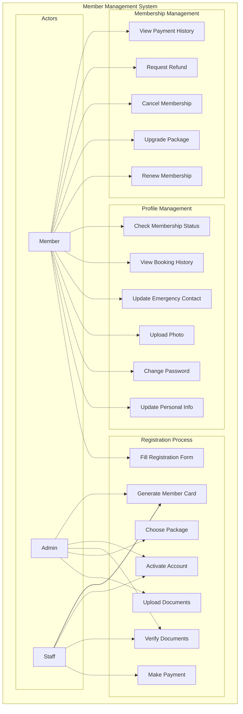

## 2. Class Diagram

### 2.1 Class Diagram Utama

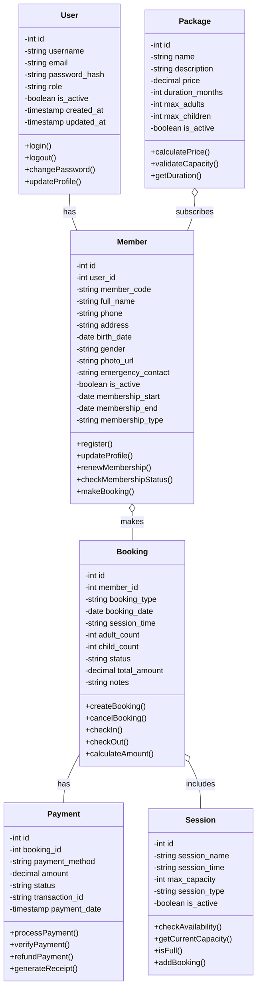

### 2.2 Class Diagram Cafe System

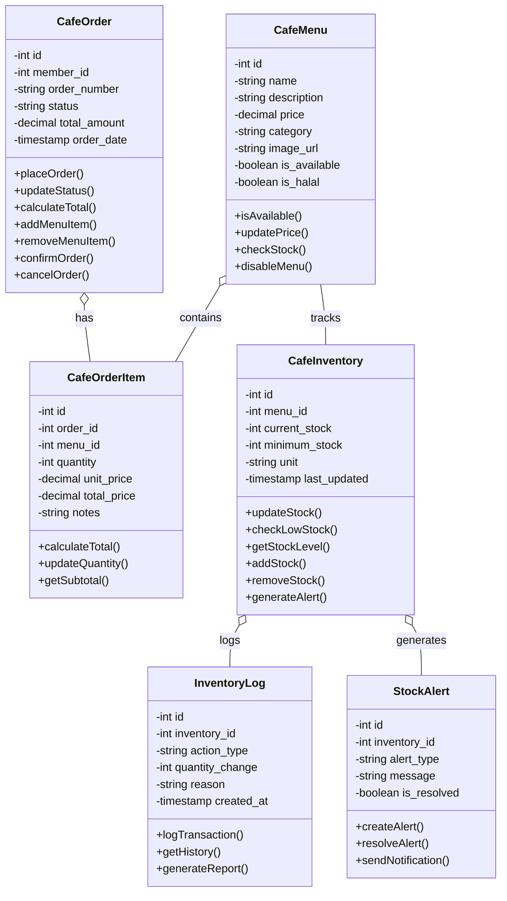

### 2.3 Class Diagram Rating & Review System

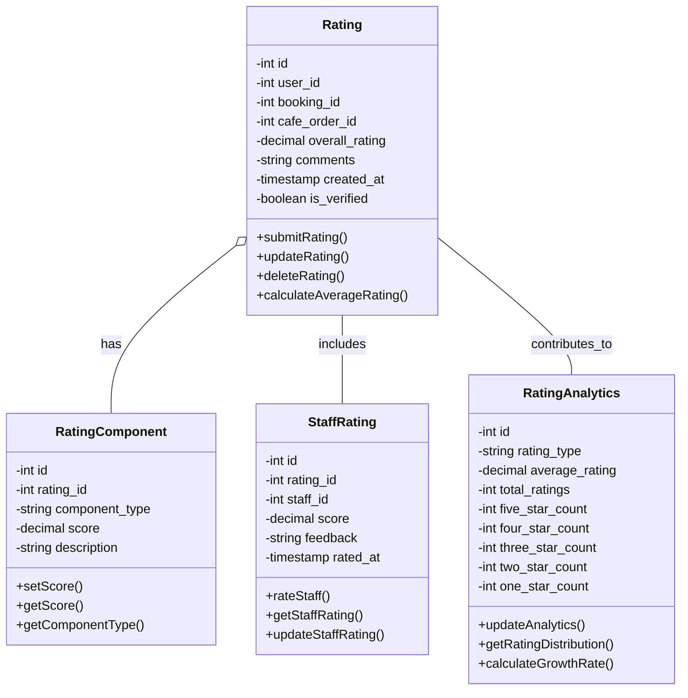

### 2.4 Class Diagram Promotional System

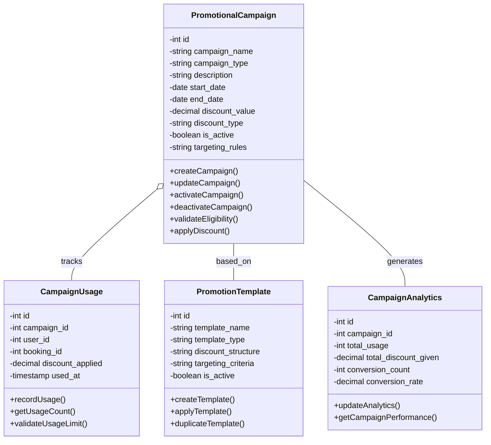

### 2.5 Class Diagram Manual Payment System

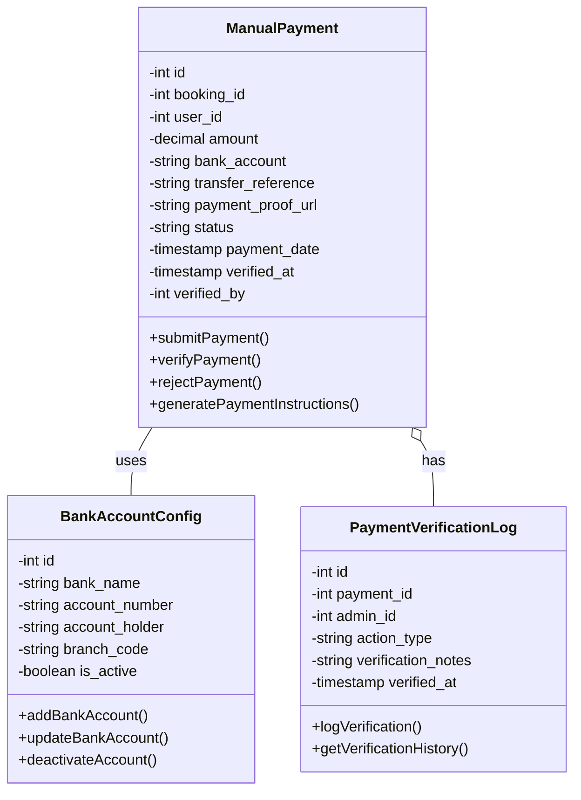

### 2.6 Class Diagram Dynamic Member Quota Management

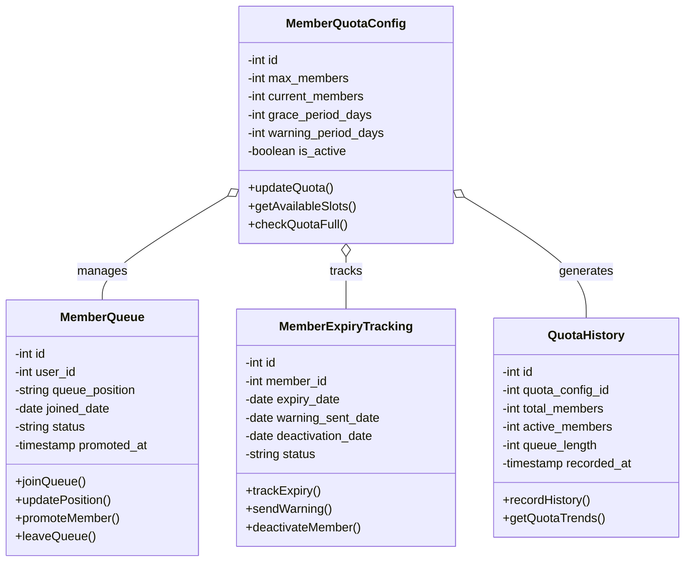

### 2.7 Class Diagram Member Daily Swimming Limit

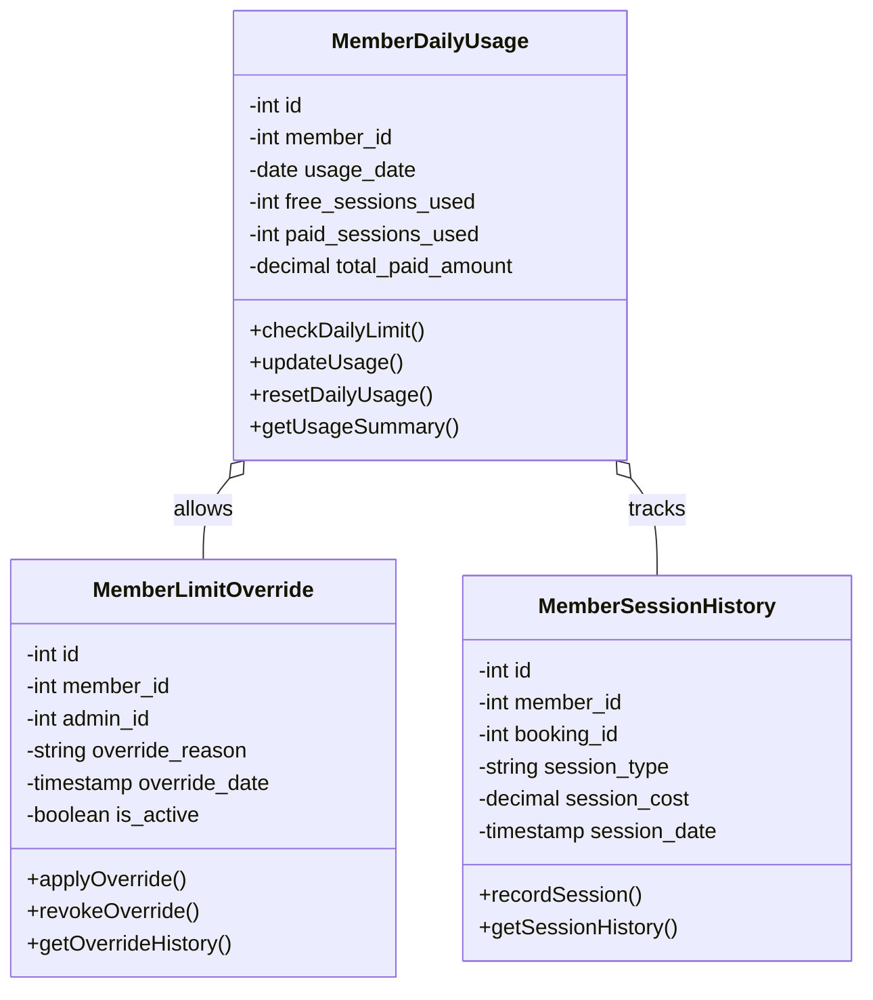

### 2.8 Class Diagram Private Pool Rental System

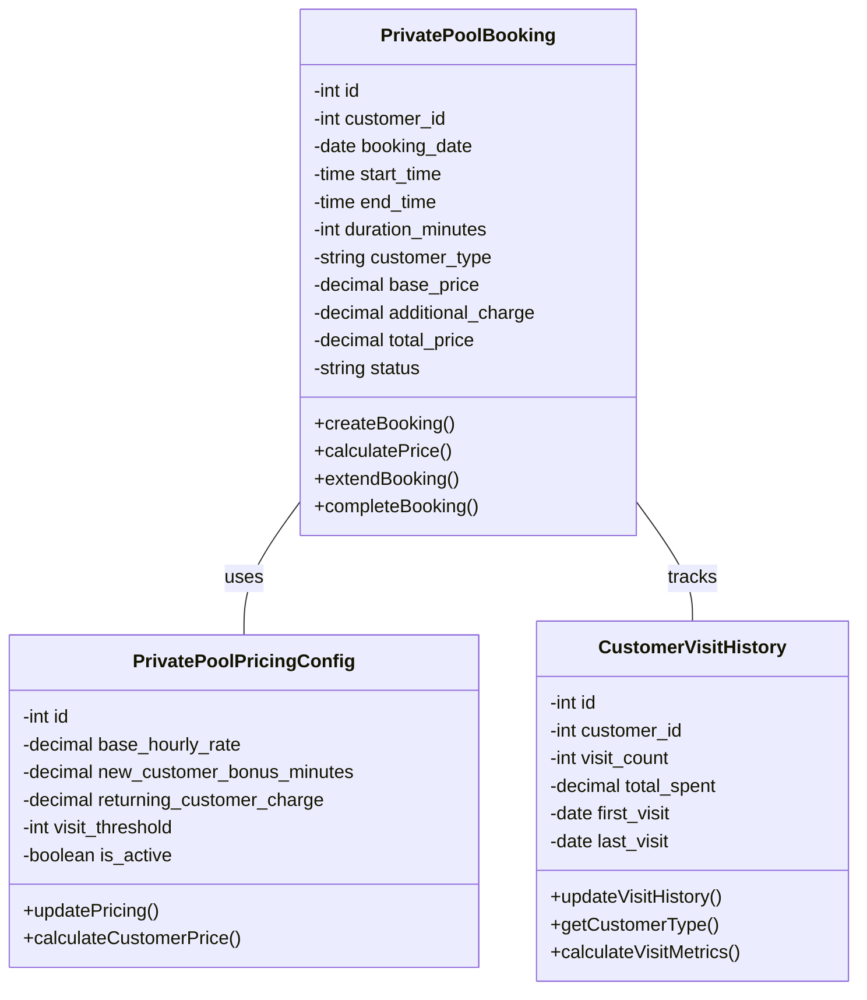

### 2.9 Class Diagram Barcode System

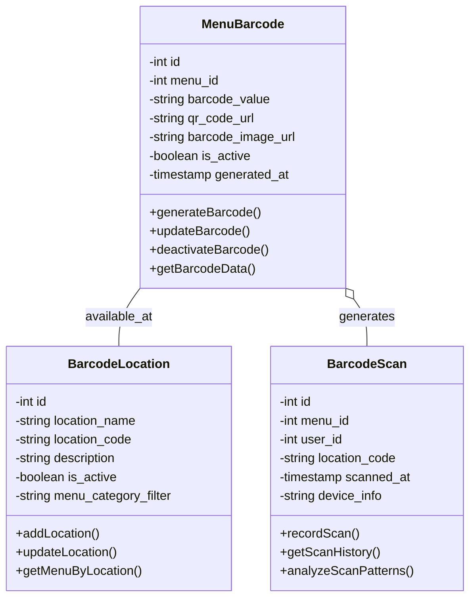

### 2.10 Class Diagram Comprehensive Reporting System

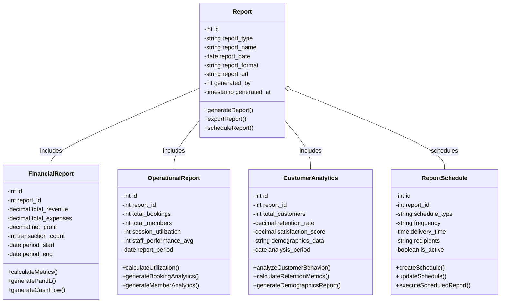

### 2.11 Class Diagram System Integration

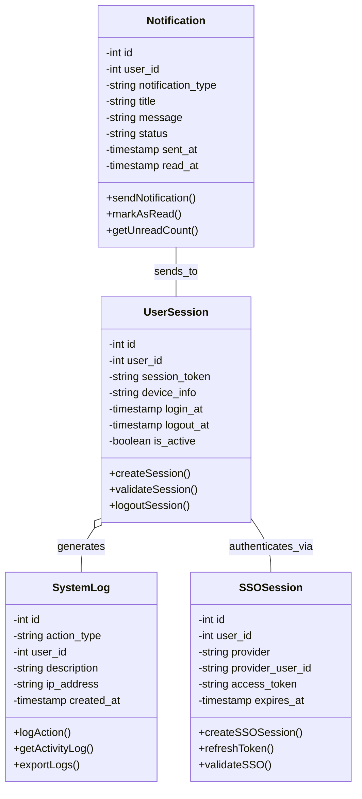

## 3. Activity Diagram

### 3.1 Activity Diagram Member Registration

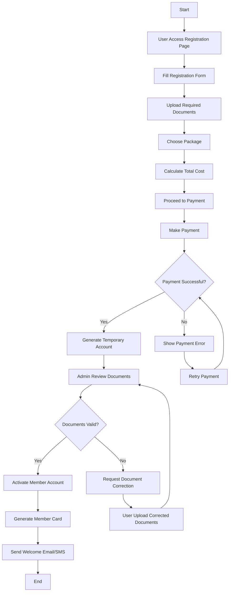

### 3.2 Activity Diagram Booking Process

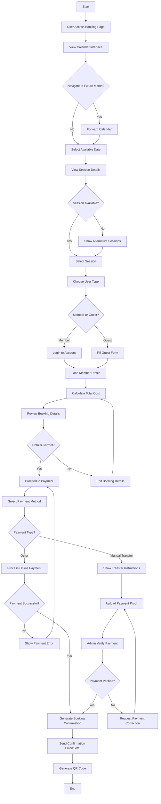

### 3.3 Activity Diagram Cafe Order Process

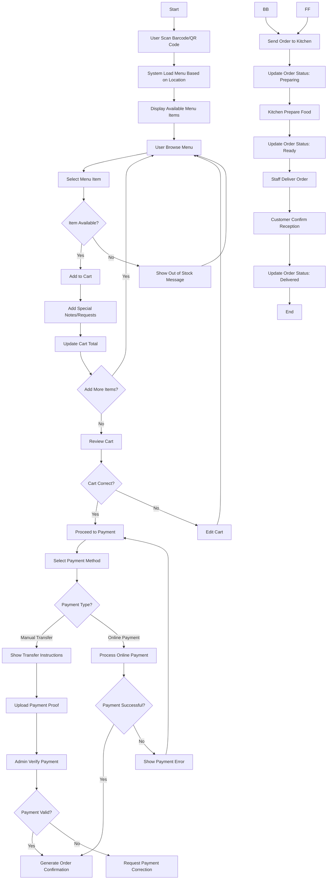

### 3.4 Activity Diagram Rating System

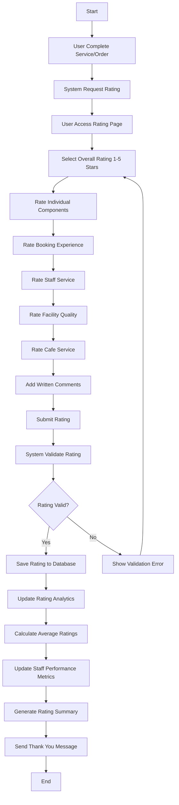

### 3.5 Activity Diagram Check-in Process

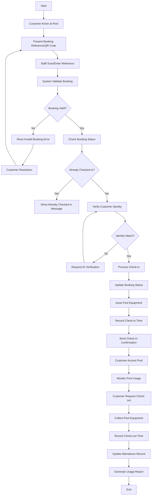

### 3.6 Activity Diagram Promotional Pricing

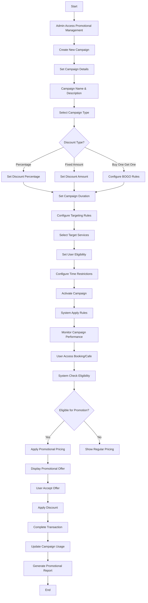

### 3.7 Activity Diagram Manual Payment

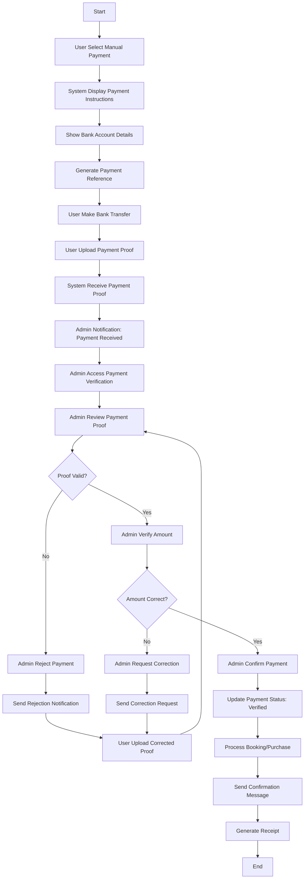

### 3.8 Activity Diagram Dynamic Member Quota

```mermaid
flowchart TD
    A[Start] --> B[Admin Configure Member Quota]
    B --> C[Set Maximum Member Limit]
    C --> D[Configure Warning Period]
    D --> E[Set Grace Period]
    E --> F[Activate Quota System]
    F --> G[User Request Membership]
    G --> H{Current Members < Max Limit?}
    H -->|Yes| I[Process Membership Registration]
    H -->|No| J[Add User to Queue]
    I --> K[Update Member Count]
    K --> L[End]
    J --> M[Assign Queue Position]
    M --> N[Send Queue Confirmation]
    N --> O[Monitor Member Expiry]
    O --> P{Member Near Expiry?}
    P -->|Yes| Q[Send Warning Notification]
    Q --> R{Member Renew?}
    R -->|Yes| S[Process Renewal]
    R -->|No| T[Wait for Grace Period]
    S --> U[Update Member Status]
    U --> V[End]
    T --> W{Grace Period Expired?}
    W -->|Yes| X[Deactivate Membership]
    W -->|No| T
    X --> Y{Queue Has Waiting Users?}
    Y -->|Yes| Z[Promote First in Queue]
    Y -->|No| AA[Update Quota Statistics]
    Z --> BB[Send Promotion Offer]
    BB --> CC{User Accept?}
    CC -->|Yes| DD[Process Membership]
    CC -->|No| EE[Remove from Queue]
    DD --> FF[Update Member Count]
    EE --> GG[Update Queue Position]
    FF --> HH[End]
    GG --> AA
```

### 3.9 Activity Diagram Member Daily Swimming Limit

```mermaid
flowchart TD
    A[Start] --> B[Member Access Booking]
    B --> C[Select Session Date]
    C --> D[System Check Daily Limit]
    D --> E{Already Used Free Session Today?}
    E -->|No| F[Book Free Session]
    E -->|Yes| G[Check Additional Session Limit]
    F --> H[Confirm Booking]
    H --> I[Update Daily Usage]
    I --> J[End]
    G --> K{Want Additional Session?}
    K -->|No| L[Show Limit Message]
    K -->|Yes| M[Calculate Additional Cost]
    L --> N[End]
    M --> O[Display Cost Information]
    O --> P{Member Accept Cost?}
    P -->|Yes| Q[Process Additional Booking]
    P -->|No| R[Cancel Booking]
    Q --> S[Charge Normal Rate]
    S --> T[Update Daily Usage]
    T --> U[Add to Payment Record]
    U --> V[End]
    R --> W[End]
```

### 3.10 Activity Diagram Private Pool Rental

```mermaid
flowchart TD
    A[Start] --> B[Customer Access Private Pool Booking]
    B --> C[Select Rental Date & Time]
    C --> D[System Check Customer History]
    D --> E{New Customer?}
    E -->|Yes| F[Apply New Customer Bonus]
    E -->|No| G[Calculate Returning Customer Rate]
    F --> H[Standard 1h 30min + 30min Bonus]
    G --> I[Standard 1h 30min + Additional Charges]
    H --> J[Calculate Total Price]
    I --> J
    J --> K[Display Price Breakdown]
    K --> L{Customer Accept Price?}
    L -->|Yes| M[Process Payment]
    L -->|No| N[Cancel Booking]
    M --> O{Payment Successful?}
    O -->|Yes| P[Confirm Booking]
    O -->|No| Q[Show Payment Error]
    P --> R[Update Customer Visit History]
    R --> S[Send Booking Confirmation]
    S --> T[Rental Day Arrives]
    T --> U[Customer Check-in]
    U --> V[Start Rental Timer]
    V --> W[Monitor Usage Time]
    W --> X{Time Expiring Soon?}
    X -->|Yes| Y[Send Time Warning]
    X -->|No| Z{Time Expired?}
    Y --> Z
    Z -->|Yes| AA[End Rental Session]
    Z -->|No| W
    AA --> BB[Customer Check-out]
    BB --> CC[Calculate Actual Usage]
    CC --> DD[Generate Usage Report]
    DD --> EE[Update Customer History]
    EE --> FF[End]
    Q --> GG[Retry Payment]
    GG --> M
    N --> HH[End]
```

### 3.11 Activity Diagram Cafe System with Barcode

```mermaid
flowchart TD
    A[Start] --> B[Customer Arrive at Pool Area]
    B --> C[Locate Menu Barcode/QR Code]
    C --> D[Scan Barcode with Mobile Device]
    D --> E[System Identify Location]
    E --> F[Load Location-Specific Menu]
    F --> G[Display Available Menu Items]
    G --> H[Customer Browse Menu]
    H --> I{Menu Items Available?}
    I -->|Yes| J[Select Menu Item]
    I -->|No| K[Show Out of Stock Items]
    J --> L[Add Item to Cart]
    K --> H
    L --> M[Set Quantity]
    M --> N[Add Special Notes/Requests]
    N --> O[Update Cart Total]
    O --> P{Add More Items?}
    P -->|Yes| H
    P -->|No| Q[Review Cart]
    Q --> R{Cart Correct?}
    R -->|Yes| S[Proceed to Checkout]
    R -->|No| T[Edit Cart Items]
    S --> U[Display Order Summary]
    T --> H
    U --> V[Select Payment Method]
    V --> W{Payment Type?}
    W -->|Manual Transfer| X[Show Transfer Instructions]
    W -->|Online Payment| Y[Process Online Payment]
    X --> Z[Customer Upload Proof]
    Y --> AA{Payment Successful?}
    AA -->|Yes| BB[Generate Order Confirmation]
    AA -->|No| CC[Show Payment Error]
    CC --> V
    Z --> DD[Admin Verify Payment]
    DD --> EE{Payment Valid?}
    EE -->|Yes| BB
    EE -->|No| FF[Request Payment Correction]
    BB --> GG[Send Order to Kitchen]
    FF --> Z
    GG --> HH[Update Order Status: Preparing]
    HH --> II[Kitchen Prepare Food]
    II --> JJ[Update Order Status: Ready]
    JJ --> KK[Staff Deliver Order]
    KK --> LL[Customer Confirm Reception]
    LL --> MM[Update Order Status: Delivered]
    MM --> NN[End]
```

### 3.12 Activity Diagram Dynamic Menu Management

```mermaid
flowchart TD
    A[Start] --> B[Admin Access Menu Management]
    B --> C[Select Menu Action]
    C --> D{Action Type?}
    D -->|Create| E[Create New Menu Item]
    D -->|Update| F[Select Existing Menu]
    D -->|Delete| G[Select Menu to Delete]
    E --> H[Fill Menu Details]
    H --> I[Menu Name & Description]
    I --> J[Upload Menu Image]
    J --> K[Set Base Cost]
    K --> L[Set Selling Price]
    L --> M[Calculate Margin]
    M --> N[Select Menu Category]
    N --> O[Set Dietary Information]
    O --> P[Add Cooking Instructions]
    P --> Q[Set Stock Information]
    Q --> R[Configure Menu Status]
    R --> S[Save Menu Item]
    F --> T[Load Menu Details]
    T --> U[Update Menu Information]
    U --> H
    G --> V[Confirm Deletion]
    V --> W{Confirm Deletion?}
    W -->|Yes| X[Delete Menu Item]
    W -->|No| Y[Cancel Deletion]
    S --> Z[Update Inventory System]
    X --> AA[Remove from Inventory]
    Y --> B
    Z --> BB[Generate Menu Analytics]
    AA --> CC[Update Related Orders]
    BB --> DD[End]
    CC --> DD
```

### 3.13 Activity Diagram Barcode Generation & Download

```mermaid
flowchart TD
    A[Start] --> B[Admin Access Barcode Management]
    B --> C[Select Menu Item]
    C --> D[Choose Barcode Action]
    D --> E{Action Type?}
    E -->|Generate| F[Generate New Barcode]
    E -->|Download| G[Download Existing Barcode]
    E -->|Regenerate| H[Regenerate Barcode]
    F --> I[System Generate Barcode Value]
    I --> J[Create QR Code]
    J --> K[Generate Barcode Image]
    K --> L[Save Barcode Data]
    L --> M[Update Menu Record]
    M --> N[Display Barcode Preview]
    G --> O[Load Barcode Information]
    O --> P[Select Download Format]
    P --> Q{Format Type?}
    Q -->|PNG| R[Generate PNG Barcode]
    Q -->|PDF| S[Generate PDF Barcode]
    Q -->|Bulk Export| T[Select Multiple Menus]
    R --> U[Download PNG File]
    S --> V[Download PDF File]
    T --> W[Generate Bulk Barcode Package]
    V --> X[End]
    U --> X
    W --> Y[Download ZIP Package]
    Y --> X
    H --> Z[Regenerate Barcode Value]
    Z --> I
    N --> AA[Barcode Ready for Use]
    AA --> X
```

### 3.14 Activity Diagram Comprehensive Reporting

```mermaid
flowchart TD
    A[Start] --> B[Admin Access Reporting System]
    B --> C[Select Report Category]
    C --> D{Report Category?}
    D -->|Financial| E[Financial Reports]
    D -->|Operational| F[Operational Reports]
    D -->|Customer| G[Customer Analytics]
    D -->|Inventory| H[Inventory Reports]
    E --> I[Choose Financial Report Type]
    I --> J{Financial Report Type?}
    J -->|Revenue| K[Generate Revenue Report]
    J -->|Expenses| L[Generate Expense Report]
    J -->|Profit & Loss| M[Generate P&L Report]
    J -->|Cash Flow| N[Generate Cash Flow Report]
    J -->|Tax| O[Generate Tax Report]
    F --> P[Choose Operational Report Type]
    P --> Q{Operational Report Type?}
    Q -->|Bookings| R[Generate Booking Analytics]
    Q -->|Sessions| S[Generate Session Reports]
    Q -->|Staff| T[Generate Staff Reports]
    Q -->|Facilities| U[Generate Facility Reports]
    G --> V[Choose Customer Report Type]
    V --> W{Customer Report Type?}
    W -->|Demographics| X[Generate Demographics Report]
    W -->|Behavior| Y[Generate Behavior Analysis]
    W -->|Satisfaction| Z[Generate Satisfaction Report]
    H --> AA[Choose Inventory Report Type]
    AA --> BB{Inventory Report Type?}
    BB -->|Stock Levels| CC[Generate Stock Level Report]
    BB -->|Movement| DD[Generate Stock Movement Report]
    BB -->|Predictions| EE[Generate Stock Prediction Report]
    K --> FF[Configure Report Parameters]
    L --> FF
    M --> FF
    N --> FF
    O --> FF
    R --> FF
    S --> FF
    T --> FF
    U --> FF
    X --> FF
    Y --> FF
    Z --> FF
    CC --> FF
    DD --> FF
    EE --> FF
    FF --> GG[Set Date Range]
    GG --> HH[Select Export Format]
    HH --> II{Export Format?}
    II -->|PDF| JJ[Generate PDF Report]
    II -->|Excel| KK[Generate Excel Report]
    II -->|CSV| LL[Generate CSV Report]
    JJ --> MM[Download Report]
    KK --> MM
    LL --> MM
    MM --> NN[Save Report History]
    NN --> OO[Schedule Future Report]
    OO --> PP[End]
```

## 4. Sequence Diagram

### 4.1 Sequence Diagram Member Registration

```mermaid
sequenceDiagram
    participant U as User
    participant S as System
    participant A as Admin
    participant DB as Database
    participant E as Email/SMS

    U->>S: Access Registration Page
    S->>U: Display Registration Form

    U->>S: Fill Registration Form
    S->>DB: Validate User Data
    DB->>S: Validation Results

    U->>S: Upload Documents
    S->>DB: Save Documents
    DB->>S: Document URLs

    U->>S: Choose Package
    S->>DB: Get Package Details
    DB->>S: Package Information

    U->>S: Submit Registration
    S->>DB: Create Temporary Account
    DB->>S: Account Created

    S->>A: Notify Admin: New Registration
    A->>S: Access Admin Panel

    A->>S: Review Documents
    S->>DB: Get User Documents
    DB->>S: Document Data

    A->>S: Approve/Reject Registration
    alt Registration Approved
        S->>DB: Activate User Account
        DB->>S: Account Activated
        S->>DB: Generate Member Card
        DB->>S: Member Card Data
        S->>E: Send Welcome Email/SMS
        E->>U: Welcome Message
    else Registration Rejected
        S->>E: Send Rejection Notice
        E->>U: Rejection Details
    end
```

### 4.2 Sequence Diagram Booking Process

```mermaid
sequenceDiagram
    participant U as User
    participant S as System
    participant C as Calendar
    participant P as Payment
    participant DB as Database
    participant E as Email/SMS

    U->>S: Access Booking Page
    S->>C: Load Calendar Interface
    C->>S: Current Month Data

    U->>C: Navigate to Future Month
    C->>S: Future Month Data
    S->>U: Display Calendar

    U->>S: Select Available Date
    S->>DB: Get Session Availability
    DB->>S: Session Data

    S->>U: Display Session Options
    U->>S: Select Session
    S->>DB: Check Session Capacity
    DB->>S: Capacity Status

    U->>S: Choose User Type (Member/Guest)
    alt Member User
        U->>S: Login to Account
        S->>DB: Validate Credentials
        DB->>S: User Profile
    else Guest User
        U->>S: Fill Guest Form
        S->>DB: Create Guest Record
        DB->>S: Guest ID
    end

    S->>DB: Calculate Total Cost
    DB->>S: Pricing Information
    S->>U: Display Booking Summary

    U->>S: Confirm Booking
    S->>P: Initiate Payment Process

    alt Manual Payment
        P->>S: Show Transfer Instructions
        S->>U: Payment Instructions
        U->>S: Upload Payment Proof
        S->>DB: Save Payment Proof
        DB->>S: Proof Saved

        S->>A: Notify Admin: Payment Pending

        A->>S: Verify Payment
        S->>DB: Update Payment Status
        DB->>S: Status Updated
    else Online Payment
        P->>S: Process Online Payment
        S->>DB: Save Payment Record
        DB->>S: Payment Confirmed
    end

    S->>DB: Create Booking Record
    DB->>S: Booking Confirmed
    S->>DB: Generate QR Code
    DB->>S: QR Code Data

    S->>E: Send Confirmation
    E->>U: Booking Confirmation
    S->>U: Display Booking Details
```

### 4.3 Sequence Diagram Cafe Order Process

```mermaid
sequenceDiagram
    participant C as Customer
    participant B as Barcode Scanner
    participant S as System
    participant M as Menu
    participant P as Payment
    participant K as Kitchen
    participant DB as Database

    C->>B: Scan Menu Barcode
    B->>S: Barcode Data
    S->>DB: Get Menu by Location
    DB->>S: Menu Items
    S->>M: Load Menu Interface

    C->>M: Browse Menu Items
    M->>S: Get Available Items
    S->>DB: Check Stock Levels
    DB->>S: Availability Data
    S->>M: Display Available Items

    C->>M: Select Menu Item
    M->>S: Add Item to Cart
    S->>DB: Update Cart
    DB->>S: Cart Updated

    C->>M: Add Special Notes
    M->>S: Save Notes
    S->>DB: Store Notes
    DB->>S: Notes Saved

    C->>M: Complete Order
    M->>S: Submit Order
    S->>P: Process Payment

    P->>S: Payment Success
    S->>DB: Create Order Record
    DB->>S: Order Created

    S->>K: Send Order to Kitchen
    K->>S: Order Received

    K->>S: Update Status: Preparing
    S->>DB: Update Order Status
    DB->>S: Status Updated

    K->>S: Update Status: Ready
    S->>C: Notify Customer: Order Ready

    C->>S: Confirm Order Reception
    S->>DB: Update Status: Delivered
    DB->>S: Order Completed
```

### 4.4 Sequence Diagram Rating System

```mermaid
sequenceDiagram
    participant U as User
    participant S as System
    participant R as Rating Module
    participant A as Analytics
    participant DB as Database

    U->>S: Complete Service/Order
    S->>U: Request Rating

    U->>S: Access Rating Page
    S->>R: Load Rating Interface
    R->>U: Display Rating Form

    U->>R: Submit Overall Rating
    U->>R: Rate Individual Components
    U->>R: Add Comments
    R->>S: Submit Rating Data

    S->>DB: Validate Rating Data
    DB->>S: Validation Results

    S->>DB: Save Rating
    DB->>S: Rating Saved

    S->>A: Update Analytics
    A->>DB: Calculate Average Ratings
    DB->>A: Rating Calculations
    A->>DB: Update Analytics Tables

    S->>U: Send Thank You Message
    S->>DB: Generate Rating Summary
    DB->>S: Summary Data
```

### 4.5 Sequence Diagram Check-in Process

```mermaid
sequenceDiagram
    participant C as Customer
    participant S as Staff
    participant SYS as System
    participant DB as Database
    participant E as Equipment

    C->>S: Present Booking Reference
    S->>SYS: Enter/Scan Reference
    SYS->>DB: Validate Booking
    DB->>SYS: Booking Data

    SYS->>S: Display Booking Details
    S->>C: Verify Identity

    S->>SYS: Process Check-in
    SYS->>DB: Update Booking Status
    DB->>SYS: Status Updated

    SYS->>E: Request Equipment
    E->>S: Issue Equipment
    S->>DB: Record Check-in Time
    DB->>SYS: Time Recorded

    SYS->>C: Confirm Check-in
    SYS->>C: Provide Equipment

    Note over C,SYS: Pool Usage Time

    C->>S: Request Check-out
    S->>E: Collect Equipment
    S->>SYS: Process Check-out
    SYS->>DB: Record Check-out Time
    DB->>SYS: Time Recorded

    SYS->>DB: Generate Usage Report
    DB->>SYS: Report Data
    SYS->>C: Confirm Check-out
```

### 4.6 Sequence Diagram Manual Payment System

```mermaid
sequenceDiagram
    participant U as User
    participant S as System
    participant A as Admin
    participant B as Bank System
    participant DB as Database

    U->>S: Select Manual Payment
    S->>U: Display Payment Instructions
    S->>B: Get Bank Account Details
    B->>S: Account Information
    S->>U: Show Transfer Details

    U->>B: Make Bank Transfer
    B->>U: Transfer Confirmation
    U->>S: Upload Payment Proof
    S->>DB: Save Payment Proof
    DB->>S: Proof Saved

    S->>A: Notify Admin: Payment Received
    A->>S: Access Payment Verification

    A->>S: Review Payment Proof
    S->>DB: Get Payment Data
    DB->>S: Payment Information

    A->>S: Verify Payment Details
    S->>DB: Update Payment Status
    DB->>S: Status Updated

    alt Payment Verified
        S->>DB: Process Booking/Purchase
        DB->>S: Transaction Completed
        S->>U: Send Confirmation
    else Payment Rejected
        S->>U: Send Rejection Notice
        S->>DB: Mark for Correction
        DB->>S: Correction Required
    end
```

### 4.7 Sequence Diagram Dynamic Menu Management

```mermaid
sequenceDiagram
    participant A as Admin
    participant S as System
    participant M as Menu Manager
    participant I as Inventory
    participant DB as Database

    A->>S: Access Menu Management
    S->>M: Load Menu Interface
    M->>DB: Get Existing Menus
    DB->>M: Menu Data
    M->>A: Display Menu List

    A->>M: Create New Menu Item
    M->>A: Display Menu Form

    A->>M: Fill Menu Details
    M->>S: Validate Menu Data
    S->>M: Validation Results

    A->>M: Set Pricing Information
    M->>S: Calculate Margin
    S->>M: Margin Calculations

    A->>M: Upload Menu Image
    M->>S: Process Image
    S->>DB: Save Image
    DB->>S: Image URL

    A->>M: Save Menu Item
    M->>DB: Create Menu Record
    DB->>M: Menu Created

    M->>I: Update Inventory System
    I->>DB: Create Inventory Record
    DB->>I: Inventory Created

    M->>S: Generate Menu Analytics
    S->>DB: Update Analytics
    DB->>S: Analytics Updated

    M->>A: Confirm Menu Created
```

### 4.8 Sequence Diagram Barcode Generation & Download

```mermaid
sequenceDiagram
    participant A as Admin
    participant S as System
    participant B as Barcode Generator
    participant DB as Database
    participant F as File System

    A->>S: Access Barcode Management
    S->>DB: Get Menu Items
    DB->>S: Menu Data
    S->>A: Display Menu List

    A->>S: Select Menu for Barcode
    S->>B: Generate Barcode Value
    B->>S: Barcode Value

    S->>B: Create QR Code
    B->>S: QR Code Data

    S->>B: Generate Barcode Image
    B->>F: Save Barcode Image
    F->>B: Image URL

    S->>DB: Update Menu with Barcode
    DB->>S: Menu Updated

    S->>A: Display Barcode Preview

    A->>S: Download Barcode
    S->>F: Get Barcode Files
    F->>S: File Data
    S->>A: Provide Download Link

    A->>S: Bulk Export Request
    S->>DB: Get Multiple Menus
    DB->>S: Menu List

    S->>B: Generate Bulk Barcodes
    B->>F: Create ZIP Package
    F->>S: Package URL
    S->>A: Provide Bulk Download
```

### 4.9 Sequence Diagram Comprehensive Reporting System

```mermaid
sequenceDiagram
    participant A as Admin
    participant S as System
    participant R as Report Generator
    participant DB as Database
    participant F as File Exporter

    A->>S: Access Reporting System
    S->>A: Display Report Categories

    A->>S: Select Report Type
    S->>R: Initialize Report Generation
    R->>DB: Query Report Data

    alt Financial Reports
        R->>DB: Get Financial Data
        DB->>R: Revenue, Expenses, Profit Data
    else Operational Reports
        R->>DB: Get Operational Data
        DB->>R: Bookings, Sessions, Staff Data
    else Customer Reports
        R->>DB: Get Customer Data
        DB->>R: Demographics, Behavior Data
    end

    R->>S: Process Report Data
    S->>R: Format Report

    A->>S: Request Export
    S->>F: Export Report

    F->>S: Generate Export File
    S->>A: Provide Download Link

    A->>S: Schedule Report
    S->>DB: Save Schedule
    DB->>S: Schedule Saved

    S->>A: Confirm Report Actions
```
