# UML Diagrams - Sistem Kolam Renang Syariah

## 1. Use Case Diagram

### 1.1 Use Case Diagram - Admin

```mermaid
graph TB
    subgraph "Admin Use Cases"
        A1[Admin]

        subgraph "System Management"
            UC1[Register Member]
            UC2[Update Profile]
            UC3[Manage Packages]
            UC4[View History]
            UC5[Renew Membership]
            UC6[Manage System Configuration]
            UC7[Manage User Roles]
            UC8[Manage Permissions]
            UC9[System Backup]
            UC10[System Restore]
            UC11[View System Logs]
            UC12[Manage API Keys]
            UC13[Configure Integrations]
            UC14[System Monitoring]
            UC15[Performance Optimization]
        end

        subgraph "Dynamic Pricing System"
            UC16[Configure Dynamic Pricing]
            UC17[Update Pricing Configuration]
            UC18[View Pricing History]
            UC19[Manage Pricing Rules]
            UC20[Set Seasonal Pricing]
            UC21[Configure Member Discounts]
        end

        subgraph "Promotional System"
            UC22[Create Promotional Campaigns]
            UC23[Manage Campaign Templates]
            UC24[View Campaign Analytics]
            UC25[Configure Dynamic Pricing]
            UC26[Apply Promotional Pricing]
        end

        subgraph "Guest User Management"
            UC27[Register as Guest]
            UC28[Convert Guest to Member]
            UC29[Manage Guest Users]
            UC30[Guest User Analytics]
            UC31[Guest Conversion Tracking]
        end

        subgraph "Google SSO Integration"
            UC32[Login via Google SSO]
            UC33[Sign up via Google SSO]
            UC34[Sync Google Profile]
            UC35[Configure SSO Settings]
            UC36[Manage SSO Sessions]
        end

        subgraph "Notification System"
            UC37[Send Push Notifications]
            UC38[Configure Notifications]
            UC39[Manage Notification Templates]
            UC40[Schedule Notifications]
            UC41[Track Notification Delivery]
        end

        subgraph "Manual Payment System"
            UC42[Verify Payment Proof]
            UC43[Confirm Payment]
            UC44[Reject Payment]
            UC45[Request Payment Correction]
            UC46[Generate Payment Instructions]
            UC47[Track Payment History]
        end

        subgraph "Dynamic Member Quota Management"
            UC48[Configure Member Quota]
            UC49[Monitor Queue Position]
            UC50[Process Member Expiry]
            UC51[Send Expiry Warnings]
            UC52[Auto-Promote Queue]
            UC53[Confirm Promotion Offer]
            UC54[Update Quota Settings]
            UC55[Track Quota History]
            UC56[View Quota Dashboard]
        end

        subgraph "Cafe System Management"
            UC57[Create Menu]
            UC58[Update Menu]
            UC59[Manage Stock]
            UC60[View Menu Analytics]
            UC61[Generate Menu Barcode]
            UC62[Download Barcode]
            UC63[Generate Financial Reports]
            UC64[View Analytics Dashboard]
        end

        subgraph "Comprehensive Reporting System"
            UC65[Generate Revenue Reports]
            UC66[Generate Expense Reports]
            UC67[Generate Profit & Loss Reports]
            UC68[Generate Cash Flow Reports]
            UC69[Generate Tax Reports]
            UC70[Generate Budget Analysis]
            UC71[Generate Booking Analytics]
            UC72[Generate Member Reports]
            UC73[Generate Session Reports]
            UC74[Generate Staff Reports]
            UC75[Generate Facility Reports]
            UC76[Generate Customer Analytics]
            UC77[Generate Inventory Reports]
            UC78[Generate Promotional Reports]
            UC79[Export Reports]
            UC80[Schedule Reports]
            UC81[Configure Report Templates]
            UC82[View Real-time Dashboard]
        end

        subgraph "Data Management"
            UC83[Data Import]
            UC84[Data Export]
            UC85[Data Validation]
            UC86[Data Cleanup]
            UC87[Data Migration]
            UC88[Data Archival]
            UC89[Data Recovery]
            UC90[Data Backup]
            UC91[Manage Data Retention]
            UC92[Data Compliance]
        end

        subgraph "Multicabang Management"
            UC93[Manage Branches]
            UC94[Assign Branch Staff]
            UC95[Configure Branch Settings]
            UC96[Manage Branch Pools]
            UC97[Manage Branch Menus]
            UC98[View Branch Analytics]
            UC99[Cross-Branch Reporting]
            UC100[Branch Performance Comparison]
            UC101[Branch Inventory Management]
            UC102[Branch Notification Management]
        end
    end

    linkStyle 0 stroke:#ff6b6b,stroke-width:2px
    A1 -.-> UC1
    A1 -.-> UC2
    A1 -.-> UC3
    A1 -.-> UC4
    A1 -.-> UC5
    A1 -.-> UC6
    A1 -.-> UC7
    A1 -.-> UC8
    A1 -.-> UC9
    A1 -.-> UC10
    A1 -.-> UC11
    A1 -.-> UC12
    A1 -.-> UC13
    A1 -.-> UC14
    A1 -.-> UC15
    A1 -.-> UC16
    A1 -.-> UC17
    A1 -.-> UC18
    A1 -.-> UC19
    A1 -.-> UC20
    A1 -.-> UC21
    A1 -.-> UC22
    A1 -.-> UC23
    A1 -.-> UC24
    A1 -.-> UC25
    A1 -.> UC26
    A1 -.> UC27
    A1 -.> UC28
    A1 -.> UC29
    A1 -.> UC30
    A1 -.> UC31
    A1 -.> UC32
    A1 -.> UC33
    A1 -.> UC34
    A1 -.> UC35
    A1 -.> UC36
    A1 -.> UC37
    A1 -.> UC38
    A1 -.> UC39
    A1 -.> UC40
    A1 -.> UC41
    A1 -.> UC42
    A1 -.> UC43
    A1 -.> UC44
    A1 -.> UC45
    A1 -.> UC46
    A1 -.> UC47
    A1 -.> UC48
    A1 -.> UC49
    A1 -.> UC50
    A1 -.> UC51
    A1 -.> UC52
    A1 -.> UC53
    A1 -.> UC54
    A1 -.> UC55
    A1 -.> UC56
    A1 -.> UC57
    A1 -.> UC58
    A1 -.> UC59
    A1 -.> UC60
    A1 -.> UC61
    A1 -.> UC62
    A1 -.> UC63
    A1 -.> UC64
    A1 -.> UC65
    A1 -.> UC66
    A1 -.> UC67
    A1 -.> UC68
    A1 -.> UC69
    A1 -.> UC70
    A1 -.> UC71
    A1 -.> UC72
    A1 -.> UC73
    A1 -.> UC74
    A1 -.> UC75
    A1 -.> UC76
    A1 -.> UC77
    A1 -.> UC78
    A1 -.> UC79
    A1 -.> UC80
    A1 -.> UC81
    A1 -.> UC82
    A1 -.> UC83
    A1 -.> UC84
    A1 -.> UC85
    A1 -.> UC86
    A1 -.> UC87
    A1 -.> UC88
    A1 -.> UC89
    A1 -.> UC90
    A1 -.> UC91
    A1 -.> UC92
    A1 -.> UC93
    A1 -.> UC94
    A1 -.> UC95
    A1 -.> UC96
    A1 -.> UC97
    A1 -.> UC98
    A1 -.> UC99
    A1 -.> UC100
    A1 -.> UC101
    A1 -.> UC102
```

### 1.2 Use Case Diagram - Staff Front Desk

```mermaid
graph TB
    subgraph "Staff Front Desk Use Cases"
        A2[Staff Front Desk]

        subgraph "Booking Management"
            UC1[Process Check-in]
            UC2[Process Check-out]
            UC3[Handle No-Shows]
            UC4[View Schedule]
            UC5[Check Real-time Availability]
            UC6[Generate Reports]
        end

        subgraph "Member Management"
            UC7[Register Member]
            UC8[Update Member Profile]
            UC9[Manage Member Packages]
            UC10[Process Membership Renewal]
        end

        subgraph "Payment Processing"
            UC11[Process Regular Session Payment]
            UC12[Process Private Session Payment]
            UC13[Process Refund]
            UC14[Verify Manual Payment]
            UC15[Confirm Payment]
            UC16[Reject Payment]
            UC17[View Payment Status]
        end

        subgraph "Equipment Management"
            UC18[Manage Equipment]
            UC19[Track Attendance]
            UC20[Issue Equipment]
            UC21[Collect Equipment]
            UC22[Equipment Maintenance Log]
        end

        subgraph "Guest Services"
            UC23[Register Guest Users]
            UC24[Convert Guest to Member]
            UC25[Assist with Booking]
            UC26[Provide Customer Support]
        end

        subgraph "Daily Operations"
            UC27[Monitor Daily Capacity]
            UC28[Manage Session Slots]
            UC29[Handle Customer Complaints]
            UC30[Process Cancellations]
        end
    end

    linkStyle 0 stroke:#4ecdc4,stroke-width:2px
    A2 -.-> UC1
    A2 -.-> UC2
    A2 -.-> UC3
    A2 -.-> UC4
    A2 -.-> UC5
    A2 -.-> UC6
    A2 -.-> UC7
    A2 -.-> UC8
    A2 -.-> UC9
    A2 -.-> UC10
    A2 -.-> UC11
    A2 -.-> UC12
    A2 -.-> UC13
    A2 -.-> UC14
    A2 -.-> UC15
    A2 -.-> UC16
    A2 -.-> UC17
    A2 -.> UC18
    A2 -.> UC19
    A2 -.> UC20
    A2 -.> UC21
    A2 -.> UC22
    A2 -.> UC23
    A2 -.> UC24
    A2 -.> UC25
    A2 -.> UC26
    A2 -.> UC27
    A2 -.> UC28
    A2 -.> UC29
    A2 -.> UC30
```

### 1.3 Use Case Diagram - Staff Cafe

```mermaid
graph TB
    subgraph "Staff Cafe Use Cases"
        A3[Staff Cafe]

        subgraph "Menu Management"
            UC1[Create Menu Items]
            UC2[Update Menu Items]
            UC3[Manage Stock]
            UC4[Update Stock Levels]
            UC5[Generate Menu Barcode]
            UC6[Download Barcode]
        end

        subgraph "Order Processing"
            UC7[Receive Orders]
            UC8[Prepare Food]
            UC9[Update Order Status]
            UC10[Deliver Order]
            UC11[Confirm Order Reception]
            UC12[Handle Special Requests]
        end

        subgraph "Inventory Management"
            UC13[Track Sales]
            UC14[Manage Inventory]
            UC15[Check Stock Levels]
            UC16[Place Stock Orders]
            UC17[Update Stock Records]
        end

        subgraph "Customer Service"
            UC18[Assist with Menu Selection]
            UC19[Process Payment]
            UC20[Handle Customer Complaints]
            UC21[Provide Menu Recommendations]
        end

        subgraph "Reporting"
            UC22[Generate Sales Reports]
            UC23[View Menu Analytics]
            UC24[Track Customer Preferences]
            UC25[Monitor Performance Metrics]
        end
    end

    linkStyle 0 stroke:#45b7d1,stroke-width:2px
    A3 -.-> UC1
    A3 -.-> UC2
    A3 -.-> UC3
    A3 -.-> UC4
    A3 -.-> UC5
    A3 -.-> UC6
    A3 -.-> UC7
    A3 -.-> UC8
    A3 -.-> UC9
    A3 -.-> UC10
    A3 -.-> UC11
    A3 -.> UC12
    A3 -.> UC13
    A3 -.> UC14
    A3 -.> UC15
    A3 -.> UC16
    A3 -.> UC17
    A3 -.> UC18
    A3 -.> UC19
    A3 -.> UC20
    A3 -.> UC21
    A3 -.> UC22
    A3 -.> UC23
    A3 -.> UC24
    A3 -.> UC25
```

### 1.4 Use Case Diagram - Member

```mermaid
graph TB
    subgraph "Member Use Cases"
        A4[Member]

        subgraph "Profile Management"
            UC1[Update Profile]
            UC2[View Membership Details]
            UC3[View Booking History]
            UC4[Renew Membership]
            UC5[Pay Membership Fee]
        end

        subgraph "Booking System"
            UC6[Access Calendar Interface]
            UC7[Navigate Calendar Forward]
            UC8[Select Available Date]
            UC9[View Session Details]
            UC10[Select Session]
            UC11[Complete Booking]
            UC12[Receive Confirmation]
            UC13[Cancel Booking]
            UC14[Check-in/Check-out]
            UC15[Book Regular Session]
            UC16[Book Private Session]
            UC17[Check Daily Limit]
            UC18[Book Free Session]
            UC19[Book Additional Paid Session]
        end

        subgraph "Payment System"
            UC20[Pay Regular Session]
            UC21[Pay Private Session]
            UC22[Select Manual Payment]
            UC23[Upload Transfer Proof]
            UC24[Submit Payment Proof]
            UC25[View Payment Status]
            UC26[Generate Payment Instructions]
        end

        subgraph "Member Quota Management"
            UC27[Join Member Queue]
            UC28[Monitor Queue Position]
            UC29[Confirm Promotion Offer]
            UC30[View Quota Dashboard]
        end

        subgraph "Cafe System"
            UC31[Scan Barcode/QR Code]
            UC32[Browse Menu]
            UC33[Add Item to Cart]
            UC34[Add Special Notes]
            UC35[Manage Cart]
            UC36[Process Payment]
            UC37[Confirm Reception]
        end

        subgraph "Rating & Review"
            UC38[Rate Services]
            UC39[Submit Reviews]
            UC40[View Rating Analytics]
        end

        subgraph "Authentication"
            UC41[Login via Google SSO]
            UC42[Sync Google Profile]
        end

        subgraph "Notifications"
            UC43[Receive Push Notifications]
            UC44[Configure Notifications]
            UC45[View Notification History]
        end
    end

    linkStyle 0 stroke:#96ceb4,stroke-width:2px
    A4 -.-> UC1
    A4 -.-> UC2
    A4 -.-> UC3
    A4 -.-> UC4
    A4 -.-> UC5
    A4 -.-> UC6
    A4 -.-> UC7
    A4 -.-> UC8
    A4 -.-> UC9
    A4 -.-> UC10
    A4 -.-> UC11
    A4 -.-> UC12
    A4 -.-> UC13
    A4 -.-> UC14
    A4 -.-> UC15
    A4 -.-> UC16
    A4 -.-> UC17
    A4 -.-> UC18
    A4 -.-> UC19
    A4 -.> UC20
    A4 -.> UC21
    A4 -.> UC22
    A4 -.> UC23
    A4 -.> UC24
    A4 -.> UC25
    A4 -.> UC26
    A4 -.> UC27
    A4 -.> UC28
    A4 -.> UC29
    A4 -.> UC30
    A4 -.> UC31
    A4 -.> UC32
    A4 -.> UC33
    A4 -.> UC34
    A4 -.> UC35
    A4 -.> UC36
    A4 -.> UC37
    A4 -.> UC38
    A4 -.> UC39
    A4 -.> UC40
    A4 -.> UC41
    A4 -.> UC42
    A4 -.> UC43
    A4 -.> UC44
    A4 -.> UC45
```

### 1.5 Use Case Diagram - Non-Member

```mermaid
graph TB
    subgraph "Non-Member Use Cases"
        A5[Non-Member]

        subgraph "Registration & Authentication"
            UC1[Register as Guest]
            UC2[Login via Google SSO]
            UC3[Sign up via Google SSO]
            UC4[Sync Google Profile]
        end

        subgraph "Booking System"
            UC5[Access Calendar Interface]
            UC6[Navigate Calendar Forward]
            UC7[Select Available Date]
            UC8[View Session Details]
            UC9[Select Session]
            UC10[Complete Booking]
            UC11[Receive Confirmation]
            UC12[Cancel Booking]
            UC13[Book Regular Session]
            UC14[Book Private Session]
            UC15[Check Real-time Availability]
        end

        subgraph "Payment System"
            UC16[Pay Regular Session]
            UC17[Pay Private Session]
            UC18[Select Manual Payment]
            UC19[Upload Transfer Proof]
            UC20[Submit Payment Proof]
            UC21[View Payment Status]
            UC22[Generate Payment Instructions]
        end

        subgraph "Cafe System"
            UC23[Scan Barcode/QR Code]
            UC24[Browse Menu]
            UC25[Add Item to Cart]
            UC26[Add Special Notes]
            UC27[Manage Cart]
            UC28[Process Payment]
            UC29[Confirm Reception]
        end

        subgraph "Member Conversion"
            UC30[Convert to Member]
            UC31[View Membership Benefits]
            UC32[Compare Packages]
        end

        subgraph "Services"
            UC33[Rate Services]
            UC34[Submit Reviews]
            UC35[Receive Push Notifications]
            UC36[Configure Notifications]
        end

        subgraph "Private Pool Rental"
            UC37[Book Private Pool]
            UC38[Check New Customer Status]
            UC39[Apply Time Bonus]
            UC40[Process Payment]
        end
    end

    linkStyle 0 stroke:#feca57,stroke-width:2px
    A5 -.-> UC1
    A5 -.-> UC2
    A5 -.-> UC3
    A5 -.-> UC4
    A5 -.-> UC5
    A5 -.-> UC6
    A5 -.-> UC7
    A5 -.-> UC8
    A5 -.-> UC9
    A5 -.-> UC10
    A5 -.-> UC11
    A5 -.-> UC12
    A5 -.> UC13
    A5 -.> UC14
    A5 -.> UC15
    A5 -.> UC16
    A5 -.> UC17
    A5 -.> UC18
    A5 -.> UC19
    A5 -.> UC20
    A5 -.> UC21
    A5 -.> UC22
    A5 -.> UC23
    A5 -.> UC24
    A5 -.> UC25
    A5 -.> UC26
    A5 -.> UC27
    A5 -.> UC28
    A5 -.> UC29
    A5 -.> UC30
    A5 -.> UC31
    A5 -.> UC32
    A5 -.> UC33
    A5 -.> UC34
    A5 -.> UC35
    A5 -.> UC36
    A5 -.> UC37
    A5 -.> UC38
    A5 -.> UC39
    A5 -.> UC40
```

## 2. Class Diagram

### 2.1 Class Diagram Utama

```mermaid
classDiagram
    class User {
        -int id
        -string username
        -string email
        -string password_hash
        -string role
        -boolean is_active
        -timestamp created_at
        -timestamp updated_at
        +login()
        +logout()
        +changePassword()
        +updateProfile()
    }

    class Member {
        -int id
        -int user_id
        -int user_profile_id
        -string member_code
        -enum status
        -boolean is_active
        -date membership_start
        -date membership_end
        -enum membership_type
        -enum registration_method
        -int pricing_package_id
        -decimal registration_fee_paid
        -decimal monthly_fee_paid
        -decimal total_paid
        -timestamp status_changed_at
        -int status_changed_by
        -text status_change_reason
        -date grace_period_start
        -date grace_period_end
        -int grace_period_days
        -int reactivation_count
        -timestamp last_reactivation_date
        -decimal last_reactivation_fee
        -timestamp created_at
        -timestamp updated_at
        +generateMemberCode()
        +changeStatus()
        +startGracePeriod()
        +reactivate()
        +renewMembership()
        +getTotalRegistrationAmount()
        +getTotalReactivationAmount()
        +getRegistrationBreakdown()
        +getReactivationBreakdown()
    }

    class Package {
        -int id
        -string name
        -string description
        -decimal price
        -int duration_months
        -int max_adults
        -int max_children
        -boolean is_active
        +calculatePrice()
        +validateCapacity()
        +getDuration()
    }

    class Booking {
        -int id
        -int member_id
        -string booking_type
        -date booking_date
        -string session_time
        -int adult_count
        -int child_count
        -string status
        -decimal total_amount
        -string notes
        +createBooking()
        +cancelBooking()
        +checkIn()
        +checkOut()
        +calculateAmount()
    }

    class Session {
        -int id
        -string session_name
        -string session_time
        -int max_capacity
        -string session_type
        -boolean is_active
        +checkAvailability()
        +getCurrentCapacity()
        +isFull()
        +addBooking()
    }

    class Payment {
        -int id
        -int booking_id
        -string payment_method
        -decimal amount
        -string status
        -string transaction_id
        -timestamp payment_date
        +processPayment()
        +verifyPayment()
        +refundPayment()
        +generateReceipt()
    }

    User -- Member : has
    Member o-- Booking : makes
    Package o-- Member : subscribes
    Booking -- Payment : has
    Booking o-- Session : includes
```

### 2.2 Class Diagram Member Schema Revision v2

```mermaid
classDiagram
    class SystemConfiguration {
        -int id
        -string config_key
        -text config_value
        -enum config_type
        -text description
        -boolean is_active
        -int created_by
        -timestamp created_at
        -timestamp updated_at
        +get(key, default)
        +set(key, value, type, description, createdBy)
        +getMemberConfig()
        +updateMemberConfig(configs, updatedBy)
    }

    class PricingConfig {
        -int id
        -string name
        -enum membership_type
        -decimal registration_fee
        -decimal monthly_fee
        -decimal quarterly_fee
        -decimal quarterly_discount_percentage
        -decimal reactivation_fee
        -boolean is_active
        -text description
        -int created_by
        -timestamp created_at
        -timestamp updated_at
        +calculateTotalPrice(membershipType, includeRegistration)
        +calculateReactivationPrice(membershipType)
        +getPriceBreakdown(membershipType, includeRegistration)
        +getReactivationBreakdown(membershipType)
        +getActiveConfig(membershipType)
        +createDefaultConfigs(createdBy)
    }

    class MemberStatusHistory {
        -int id
        -int member_id
        -enum previous_status
        -enum new_status
        -text change_reason
        -enum change_type
        -int changed_by
        -timestamp changed_at
        -date membership_end_date
        -date grace_period_end_date
        -decimal payment_amount
        -string payment_reference
        +recordStatusChange(memberId, newStatus, previousStatus, changeType, reason, changedBy, paymentAmount, paymentReference)
        +getMemberHistory(memberId, limit)
        +getStatusChangeStats(startDate, endDate)
    }

    class MemberPayment {
        -int id
        -int member_id
        -enum payment_type
        -decimal amount
        -enum payment_method
        -string payment_reference
        -timestamp payment_date
        -enum payment_status
        -text description
        -text notes
        -int processed_by
        -timestamp created_at
        -timestamp updated_at
        +markAsPaid(processedBy)
        +markAsFailed(reason)
        +markAsRefunded(reason, processedBy)
        +createPayment(memberId, paymentType, amount, paymentMethod, description, notes, processedBy)
        +getMemberPayments(memberId, limit)
        +getPaymentStats(startDate, endDate)
        +getTotalRevenue(startDate, endDate)
    }

    class UserProfile {
        -int id
        -int user_id
        -string phone
        -date date_of_birth
        -string gender
        -text address
        -string emergency_contact
        -string photo_url
        -timestamp created_at
        -timestamp updated_at
    }

    SystemConfiguration ||--o{ Member : configures
    PricingConfig ||--o{ Member : defines_pricing
    Member ||--o{ MemberStatusHistory : has_history
    Member ||--o{ MemberPayment : makes_payments
    Member }o--|| UserProfile : has_profile
    User ||--|| UserProfile : has
```

### 2.3 Class Diagram Cafe System

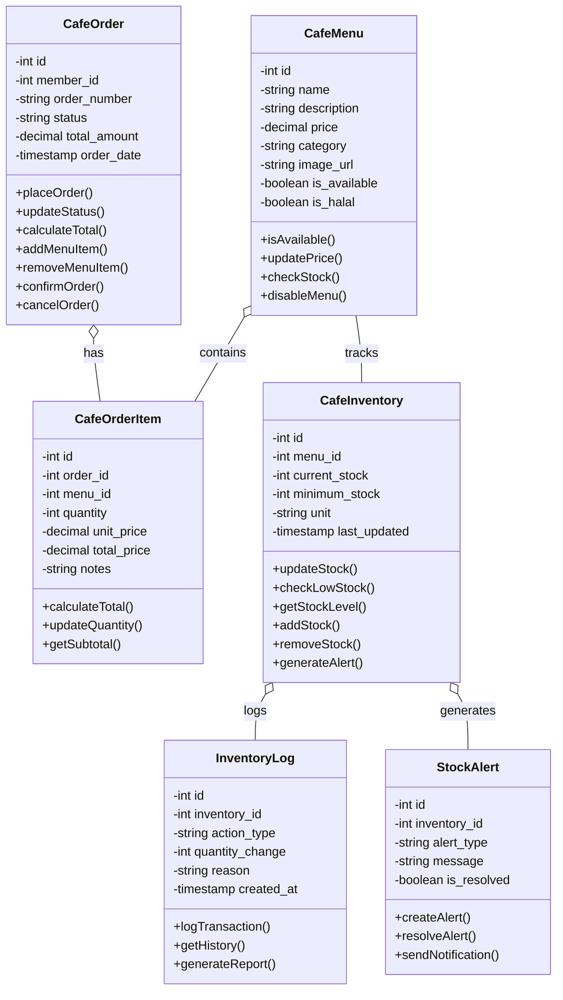

### 2.4 Class Diagram Rating & Review System

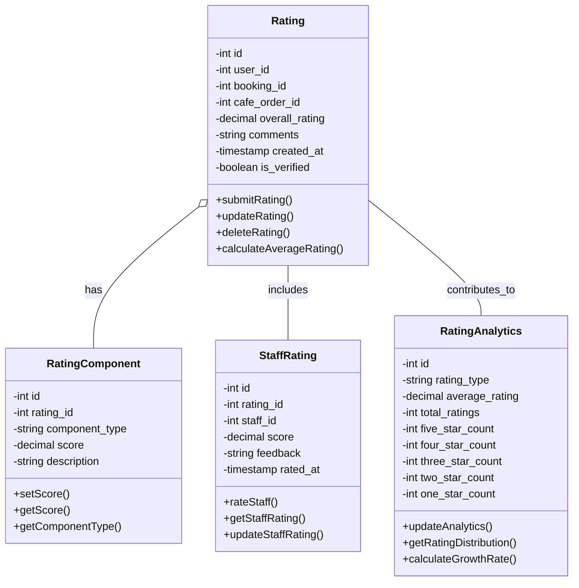

### 2.5 Class Diagram Promotional System

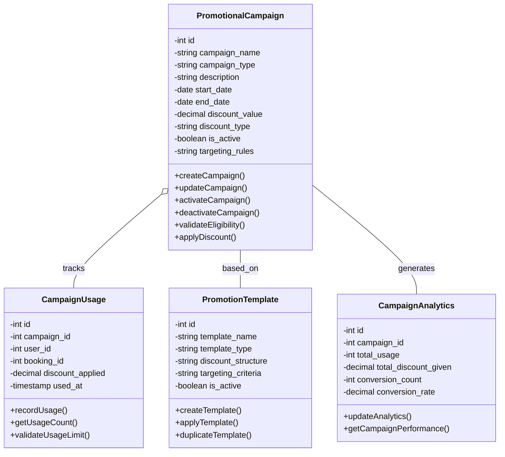

### 2.6 Class Diagram Manual Payment System

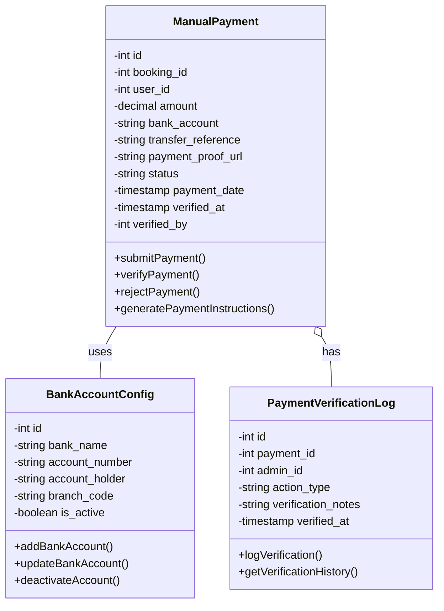

### 2.7 Class Diagram Dynamic Member Quota Management

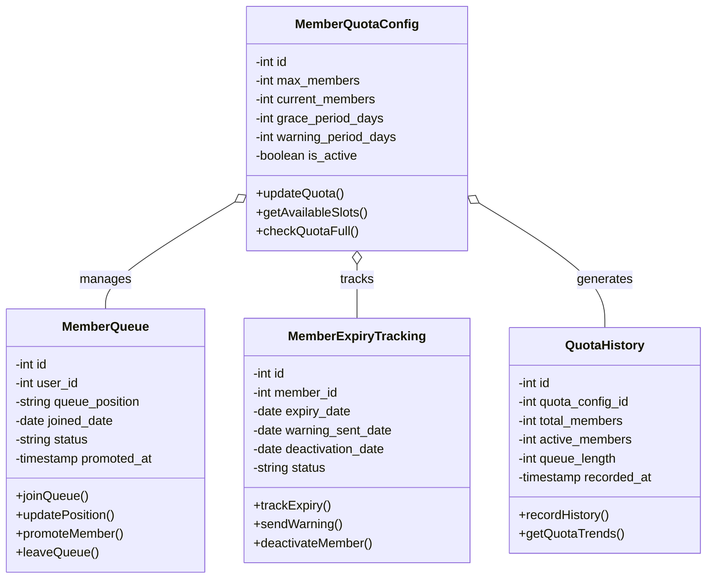

### 2.8 Class Diagram Member Daily Swimming Limit

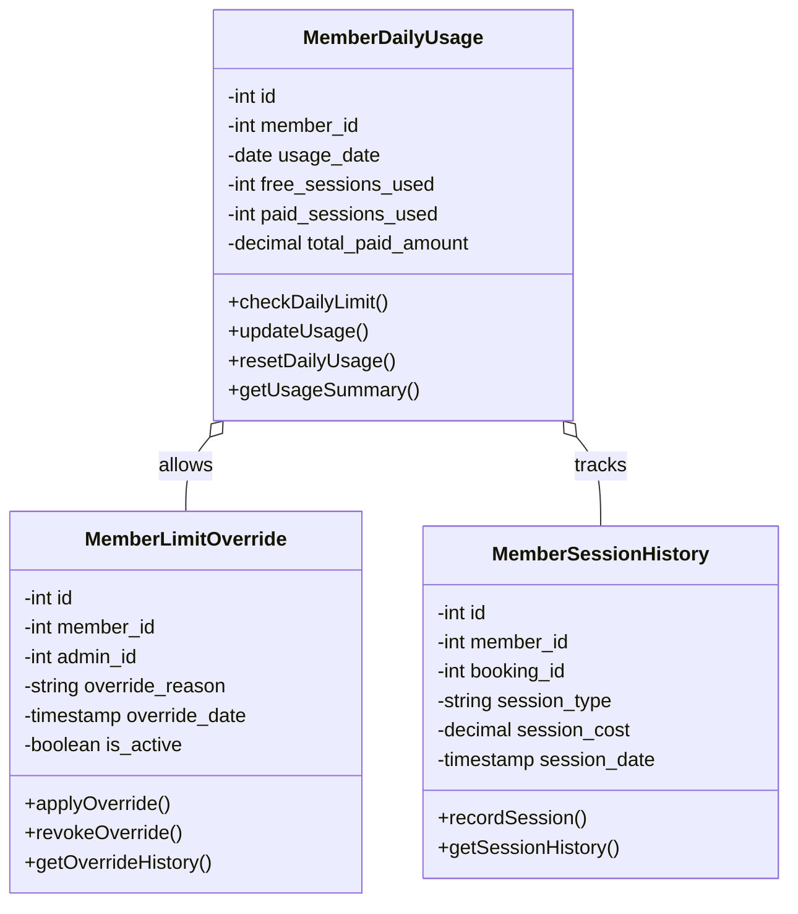

### 2.9 Class Diagram Private Pool Rental System

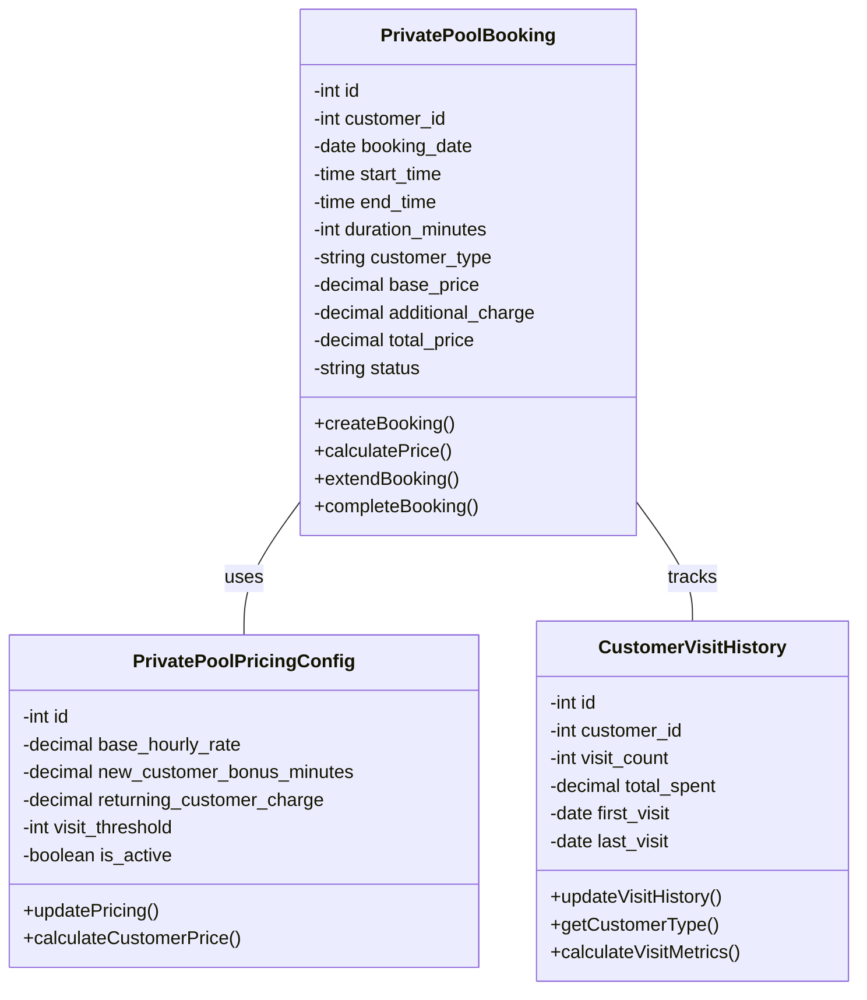

### 2.10 Class Diagram Barcode System

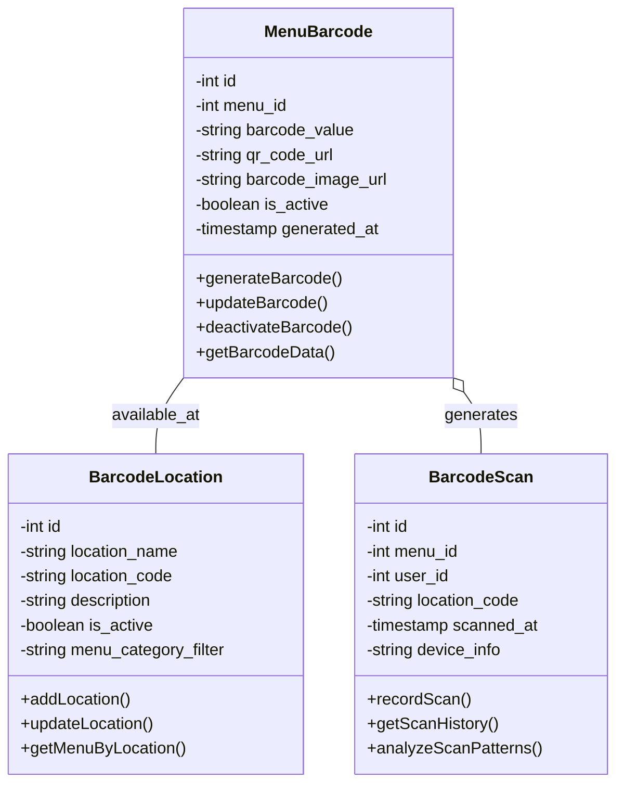

### 2.11 Class Diagram Comprehensive Reporting System

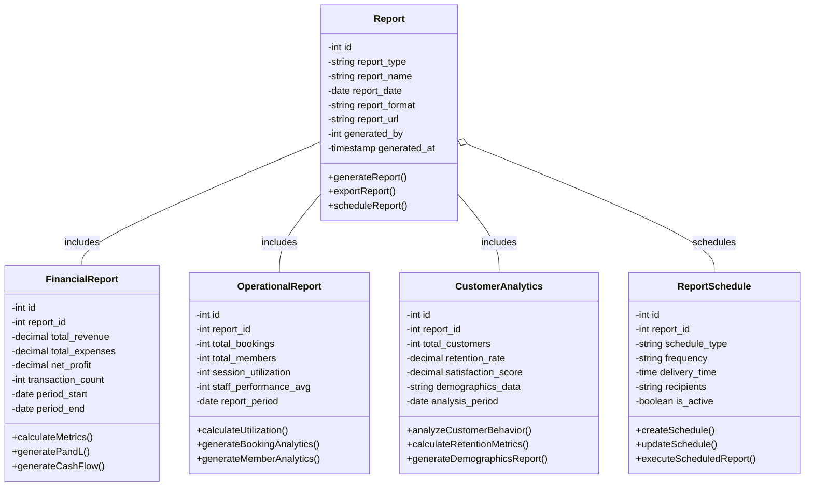

### 2.12 Class Diagram Multicabang System

```mermaid
classDiagram
    class Branch {
        -int id
        -string code
        -string name
        -string address
        -string phone
        -string email
        -decimal latitude
        -decimal longitude
        -json operating_hours
        -int max_capacity
        -boolean is_active
        -timestamp created_at
        -timestamp updated_at
        +createBranch()
        +updateBranch()
        +deactivateBranch()
        +getOperatingHours()
        +checkCapacity()
    }

    class BranchStaff {
        -int id
        -int branch_id
        -int user_id
        -string role
        -json permissions
        -boolean is_active
        -timestamp assigned_at
        -int assigned_by
        +assignStaff()
        +updateRole()
        +deactivateStaff()
        +getPermissions()
    }

    class BranchPool {
        -int id
        -int branch_id
        -int pool_id
        -decimal branch_price
        -int max_capacity
        -boolean is_available
        -json operating_hours
        +updateBranchPrice()
        +checkAvailability()
        +getCapacity()
    }

    class BranchMenu {
        -int id
        -int branch_id
        -int menu_id
        -decimal branch_price
        -int stock_quantity
        -int min_stock_level
        -boolean is_available
        +updateBranchPrice()
        +updateStock()
        +checkLowStock()
        +getAvailability()
    }

    class BranchBooking {
        -int id
        -int branch_id
        -int booking_id
        -string booking_type
        -decimal branch_total
        -string status
        +createBranchBooking()
        +updateStatus()
        +calculateBranchTotal()
    }

    class BranchAnalytics {
        -int id
        -int branch_id
        -date analytics_date
        -decimal revenue
        -int total_bookings
        -int total_orders
        -decimal average_rating
        -int customer_count
        +generateDailyReport()
        +calculateMetrics()
        +getPerformanceData()
    }

    class BranchSettings {
        -int id
        -int branch_id
        -string setting_key
        -text setting_value
        -string setting_type
        -boolean is_active
        +updateSetting()
        +getSetting()
        +getAllSettings()
    }

    class BranchNotification {
        -int id
        -int branch_id
        -string notification_type
        -string title
        -text message
        -string status
        -timestamp sent_at
        +sendNotification()
        +updateStatus()
        +getNotificationHistory()
    }

    Branch ||--o{ BranchStaff : manages
    Branch ||--o{ BranchPool : has_pools
    Branch ||--o{ BranchMenu : has_menus
    Branch ||--o{ BranchBooking : receives_bookings
    Branch ||--o{ BranchAnalytics : generates_analytics
    Branch ||--o{ BranchSettings : has_settings
    Branch ||--o{ BranchNotification : sends_notifications
    BranchStaff }o--|| User : assigned_to
    BranchPool }o--|| Pool : references
    BranchMenu }o--|| MenuItem : references
    BranchBooking }o--|| Booking : references
```

### 2.13 Class Diagram System Integration

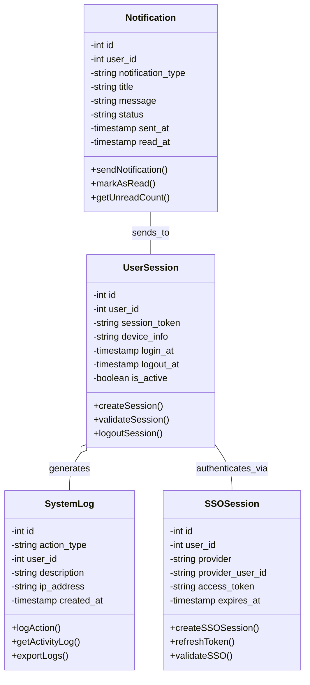

## 3. Activity Diagram

### 3.1 Activity Diagram Member Registration (Schema Revision v2)

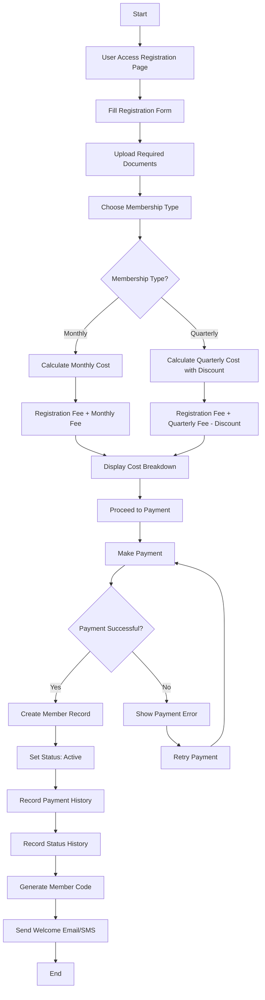

### 3.2 Activity Diagram Booking Process

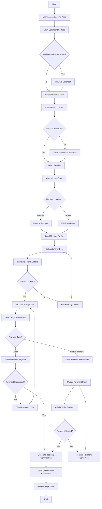

### 3.3 Activity Diagram Cafe Order Process

```mermaid
flowchart TD
    A[Start] --> B[User Scan Barcode/QR Code]
    B --> C[System Load Menu Based on Location]
    C --> D[Display Available Menu Items]
    D --> E[User Browse Menu]
    E --> F[Select Menu Item]
    F --> G{Item Available?}
    G -->|Yes| H[Add to Cart]
    G -->|No| I[Show Out of Stock Message]
    I --> E
    H --> J[Add Special Notes/Requests]
    J --> K[Update Cart Total]
    K --> L{Add More Items?}
    L -->|Yes| E
    L -->|No| M[Review Cart]
    M --> N{Cart Correct?}
    N -->|Yes| O[Proceed to Payment]
    N -->|No| P[Edit Cart]
    P --> E
    O --> Q[Select Payment Method]
    Q --> R{Payment Type?}
    R -->|Manual Transfer| S[Show Transfer Instructions]
    R -->|Online Payment| T[Process Online Payment]
    S --> U[Upload Payment Proof]
    T --> V{Payment Successful?}
    V -->|Yes| W[Generate Order Confirmation]
    V -->|No| X[Show Payment Error]
    X --> O
    U --> Y[Admin Verify Payment]
    Y --> Z{Payment Valid?}
    Z -->|Yes| W
    Z -->|No| AA[Request Payment Correction]
    BB --> GG[Send Order to Kitchen]
    FF --> GG
    GG --> HH[Update Order Status: Preparing]
    HH --> II[Kitchen Prepare Food]
    II --> JJ[Update Order Status: Ready]
    JJ --> KK[Staff Deliver Order]
    KK --> LL[Customer Confirm Reception]
    LL --> MM[Update Order Status: Delivered]
    MM --> NN[End]
```

### 3.4 Activity Diagram Rating System

```mermaid
flowchart TD
    A[Start] --> B[User Complete Service/Order]
    B --> C[System Request Rating]
    C --> D[User Access Rating Page]
    D --> E[Select Overall Rating 1-5 Stars]
    E --> F[Rate Individual Components]
    F --> G[Rate Booking Experience]
    G --> H[Rate Staff Service]
    H --> I[Rate Facility Quality]
    I --> J[Rate Cafe Service]
    J --> K[Add Written Comments]
    K --> L[Submit Rating]
    L --> M[System Validate Rating]
    M --> N{Rating Valid?}
    N -->|Yes| O[Save Rating to Database]
    N -->|No| P[Show Validation Error]
    P --> E
    O --> Q[Update Rating Analytics]
    Q --> R[Calculate Average Ratings]
    R --> S[Update Staff Performance Metrics]
    S --> T[Generate Rating Summary]
    T --> U[Send Thank You Message]
    U --> V[End]
```

### 3.5 Activity Diagram Check-in Process

```mermaid
flowchart TD
    A[Start] --> B[Customer Arrive at Pool]
    B --> C[Present Booking Reference/QR Code]
    C --> D[Staff Scan/Enter Reference]
    D --> E[System Validate Booking]
    E --> F{Booking Valid?}
    F -->|No| G[Show Invalid Booking Error]
    G --> H[Customer Resolution]
    H --> C
    F -->|Yes| I[Check Booking Status]
    I --> J{Already Checked-in?}
    J -->|Yes| K[Show Already Checked-in Message]
    J -->|No| L[Verify Customer Identity]
    L --> M{Identity Match?}
    M -->|No| N[Request ID Verification]
    N --> L
    M -->|Yes| O[Process Check-in]
    O --> P[Update Booking Status]
    P --> Q[Issue Pool Equipment]
    Q --> R[Record Check-in Time]
    R --> S[Send Check-in Confirmation]
    S --> T[Customer Access Pool]
    T --> U[Monitor Pool Usage]
    U --> V[Customer Request Check-out]
    V --> W[Collect Pool Equipment]
    W --> X[Record Check-out Time]
    X --> Y[Update Attendance Record]
    Y --> Z[Generate Usage Report]
    Z --> AA[End]
```

### 3.6 Activity Diagram Promotional Pricing

```mermaid
flowchart TD
    A[Start] --> B[Admin Access Promotional Management]
    B --> C[Create New Campaign]
    C --> D[Set Campaign Details]
    D --> E[Campaign Name & Description]
    E --> F[Select Campaign Type]
    F --> G{Discount Type?}
    G -->|Percentage| H[Set Discount Percentage]
    G -->|Fixed Amount| I[Set Discount Amount]
    G -->|Buy One Get One| J[Configure BOGO Rules]
    H --> K[Set Campaign Duration]
    I --> K
    J --> K
    K --> L[Configure Targeting Rules]
    L --> M[Select Target Services]
    M --> N[Set User Eligibility]
    N --> O[Configure Time Restrictions]
    O --> P[Activate Campaign]
    P --> Q[System Apply Rules]
    Q --> R[Monitor Campaign Performance]
    R --> S[User Access Booking/Cafe]
    S --> T[System Check Eligibility]
    T --> U{Eligible for Promotion?}
    U -->|Yes| V[Apply Promotional Pricing]
    U -->|No| W[Show Regular Pricing]
    V --> X[Display Promotional Offer]
    X --> Y[User Accept Offer]
    Y --> Z[Apply Discount]
    Z --> AA[Complete Transaction]
    AA --> BB[Update Campaign Usage]
    BB --> CC[Generate Promotional Report]
    CC --> DD[End]
```

### 3.7 Activity Diagram Manual Payment

```mermaid
flowchart TD
    A[Start] --> B[User Select Manual Payment]
    B --> C[System Display Payment Instructions]
    C --> D[Show Bank Account Details]
    D --> E[Generate Payment Reference]
    E --> F[User Make Bank Transfer]
    F --> G[User Upload Payment Proof]
    G --> H[System Receive Payment Proof]
    H --> I[Admin Notification: Payment Received]
    I --> J[Admin Access Payment Verification]
    J --> K[Admin Review Payment Proof]
    K --> L{Proof Valid?}
    L -->|No| M[Admin Reject Payment]
    L -->|Yes| N[Admin Verify Amount]
    M --> O[Send Rejection Notification]
    O --> P[User Upload Corrected Proof]
    P --> K
    N --> Q{Amount Correct?}
    Q -->|No| R[Admin Request Correction]
    Q -->|Yes| S[Admin Confirm Payment]
    R --> T[Send Correction Request]
    T --> P
    S --> U[Update Payment Status: Verified]
    U --> V[Process Booking/Purchase]
    V --> W[Send Confirmation Message]
    W --> X[Generate Receipt]
    X --> Y[End]
```

### 3.8 Activity Diagram Dynamic Member Quota

```mermaid
flowchart TD
    A[Start] --> B[Admin Configure Member Quota]
    B --> C[Set Maximum Member Limit]
    C --> D[Configure Warning Period]
    D --> E[Set Grace Period]
    E --> F[Activate Quota System]
    F --> G[User Request Membership]
    G --> H{Current Members < Max Limit?}
    H -->|Yes| I[Process Membership Registration]
    H -->|No| J[Add User to Queue]
    I --> K[Update Member Count]
    K --> L[End]
    J --> M[Assign Queue Position]
    M --> N[Send Queue Confirmation]
    N --> O[Monitor Member Expiry]
    O --> P{Member Near Expiry?}
    P -->|Yes| Q[Send Warning Notification]
    Q --> R{Member Renew?}
    R -->|Yes| S[Process Renewal]
    R -->|No| T[Wait for Grace Period]
    S --> U[Update Member Status]
    U --> V[End]
    T --> W{Grace Period Expired?}
    W -->|Yes| X[Deactivate Membership]
    W -->|No| T
    X --> Y{Queue Has Waiting Users?}
    Y -->|Yes| Z[Promote First in Queue]
    Y -->|No| AA[Update Quota Statistics]
    Z --> BB[Send Promotion Offer]
    BB --> CC{User Accept?}
    CC -->|Yes| DD[Process Membership]
    CC -->|No| EE[Remove from Queue]
    DD --> FF[Update Member Count]
    EE --> GG[Update Queue Position]
    FF --> HH[End]
    GG --> AA
```

### 3.9 Activity Diagram Member Daily Swimming Limit

```mermaid
flowchart TD
    A[Start] --> B[Member Access Booking]
    B --> C[Select Session Date]
    C --> D[System Check Daily Limit]
    D --> E{Already Used Free Session Today?}
    E -->|No| F[Book Free Session]
    E -->|Yes| G[Check Additional Session Limit]
    F --> H[Confirm Booking]
    H --> I[Update Daily Usage]
    I --> J[End]
    G --> K{Want Additional Session?}
    K -->|No| L[Show Limit Message]
    K -->|Yes| M[Calculate Additional Cost]
    L --> N[End]
    M --> O[Display Cost Information]
    O --> P{Member Accept Cost?}
    P -->|Yes| Q[Process Additional Booking]
    P -->|No| R[Cancel Booking]
    Q --> S[Charge Normal Rate]
    S --> T[Update Daily Usage]
    T --> U[Add to Payment Record]
    U --> V[End]
    R --> W[End]
```

### 3.10 Activity Diagram Private Pool Rental

```mermaid
flowchart TD
    A[Start] --> B[Customer Access Private Pool Booking]
    B --> C[Select Rental Date & Time]
    C --> D[System Check Customer History]
    D --> E{New Customer?}
    E -->|Yes| F[Apply New Customer Bonus]
    E -->|No| G[Calculate Returning Customer Rate]
    F --> H[Standard 1h 30min + 30min Bonus]
    G --> I[Standard 1h 30min + Additional Charges]
    H --> J[Calculate Total Price]
    I --> J
    J --> K[Display Price Breakdown]
    K --> L{Customer Accept Price?}
    L -->|Yes| M[Process Payment]
    L -->|No| N[Cancel Booking]
    M --> O{Payment Successful?}
    O -->|Yes| P[Confirm Booking]
    O -->|No| Q[Show Payment Error]
    P --> R[Update Customer Visit History]
    R --> S[Send Booking Confirmation]
    S --> T[Rental Day Arrives]
    T --> U[Customer Check-in]
    U --> V[Start Rental Timer]
    V --> W[Monitor Usage Time]
    W --> X{Time Expiring Soon?}
    X -->|Yes| Y[Send Time Warning]
    X -->|No| Z{Time Expired?}
    Y --> Z
    Z -->|Yes| AA[End Rental Session]
    Z -->|No| W
    AA --> BB[Customer Check-out]
    BB --> CC[Calculate Actual Usage]
    CC --> DD[Generate Usage Report]
    DD --> EE[Update Customer History]
    EE --> FF[End]
    Q --> GG[Retry Payment]
    GG --> M
    N --> HH[End]
```

### 3.11 Activity Diagram Cafe System with Barcode

```mermaid
flowchart TD
    A[Start] --> B[Customer Arrive at Pool Area]
    B --> C[Locate Menu Barcode/QR Code]
    C --> D[Scan Barcode with Mobile Device]
    D --> E[System Identify Location]
    E --> F[Load Location-Specific Menu]
    F --> G[Display Available Menu Items]
    G --> H[Customer Browse Menu]
    H --> I{Menu Items Available?}
    I -->|Yes| J[Select Menu Item]
    I -->|No| K[Show Out of Stock Items]
    J --> L[Add Item to Cart]
    K --> H
    L --> M[Set Quantity]
    M --> N[Add Special Notes/Requests]
    N --> O[Update Cart Total]
    O --> P{Add More Items?}
    P -->|Yes| H
    P -->|No| Q[Review Cart]
    Q --> R{Cart Correct?}
    R -->|Yes| S[Proceed to Checkout]
    R -->|No| T[Edit Cart Items]
    S --> U[Display Order Summary]
    T --> H
    U --> V[Select Payment Method]
    V --> W{Payment Type?}
    W -->|Manual Transfer| X[Show Transfer Instructions]
    W -->|Online Payment| Y[Process Online Payment]
    X --> Z[Customer Upload Proof]
    Y --> AA{Payment Successful?}
    AA -->|Yes| BB[Generate Order Confirmation]
    AA -->|No| CC[Show Payment Error]
    CC --> V
    Z --> DD[Admin Verify Payment]
    DD --> EE{Payment Valid?}
    EE -->|Yes| BB
    EE -->|No| FF[Request Payment Correction]
    BB --> GG[Send Order to Kitchen]
    FF --> Z
    GG --> HH[Update Order Status: Preparing]
    HH --> II[Kitchen Prepare Food]
    II --> JJ[Update Order Status: Ready]
    JJ --> KK[Staff Deliver Order]
    KK --> LL[Customer Confirm Reception]
    LL --> MM[Update Order Status: Delivered]
    MM --> NN[End]
```

### 3.12 Activity Diagram Dynamic Menu Management

```mermaid
flowchart TD
    A[Start] --> B[Admin Access Menu Management]
    B --> C[Select Menu Action]
    C --> D{Action Type?}
    D -->|Create| E[Create New Menu Item]
    D -->|Update| F[Select Existing Menu]
    D -->|Delete| G[Select Menu to Delete]
    E --> H[Fill Menu Details]
    H --> I[Menu Name & Description]
    I --> J[Upload Menu Image]
    J --> K[Set Base Cost]
    K --> L[Set Selling Price]
    L --> M[Calculate Margin]
    M --> N[Select Menu Category]
    N --> O[Set Dietary Information]
    O --> P[Add Cooking Instructions]
    P --> Q[Set Stock Information]
    Q --> R[Configure Menu Status]
    R --> S[Save Menu Item]
    F --> T[Load Menu Details]
    T --> U[Update Menu Information]
    U --> H
    G --> V[Confirm Deletion]
    V --> W{Confirm Deletion?}
    W -->|Yes| X[Delete Menu Item]
    W -->|No| Y[Cancel Deletion]
    S --> Z[Update Inventory System]
    X --> AA[Remove from Inventory]
    Y --> B
    Z --> BB[Generate Menu Analytics]
    AA --> CC[Update Related Orders]
    BB --> DD[End]
    CC --> DD
```

### 3.13 Activity Diagram Barcode Generation & Download

```mermaid
flowchart TD
    A[Start] --> B[Admin Access Barcode Management]
    B --> C[Select Menu Item]
    C --> D[Choose Barcode Action]
    D --> E{Action Type?}
    E -->|Generate| F[Generate New Barcode]
    E -->|Download| G[Download Existing Barcode]
    E -->|Regenerate| H[Regenerate Barcode]
    F --> I[System Generate Barcode Value]
    I --> J[Create QR Code]
    J --> K[Generate Barcode Image]
    K --> L[Save Barcode Data]
    L --> M[Update Menu Record]
    M --> N[Display Barcode Preview]
    G --> O[Load Barcode Information]
    O --> P[Select Download Format]
    P --> Q{Format Type?}
    Q -->|PNG| R[Generate PNG Barcode]
    Q -->|PDF| S[Generate PDF Barcode]
    Q -->|Bulk Export| T[Select Multiple Menus]
    R --> U[Download PNG File]
    S --> V[Download PDF File]
    T --> W[Generate Bulk Barcode Package]
    V --> X[End]
    U --> X
    W --> Y[Download ZIP Package]
    Y --> X
    H --> Z[Regenerate Barcode Value]
    Z --> I
    N --> AA[Barcode Ready for Use]
    AA --> X
```

### 3.14 Activity Diagram Member Status Lifecycle (Schema Revision v2)

```mermaid
flowchart TD
    A[Start] --> B[Member Registration Complete]
    B --> C[Status: Active]
    C --> D[Monitor Membership End Date]
    D --> E{Membership Expired?}
    E -->|No| D
    E -->|Yes| F[Change Status to Inactive]
    F --> G[Start Grace Period]
    G --> H[Send Grace Period Notification]
    H --> I[Monitor Grace Period]
    I --> J{Grace Period Expired?}
    J -->|No| K{Member Renewed?}
    K -->|Yes| L[Process Renewal Payment]
    L --> M[Change Status to Active]
    M --> N[Update Membership End Date]
    N --> D
    K -->|No| I
    J -->|Yes| O[Change Status to Non-Member]
    O --> P[Record Status History]
    P --> Q[Send Non-Member Notification]
    Q --> R[End]
```

### 3.15 Activity Diagram Member Reactivation (Schema Revision v2)

```mermaid
flowchart TD
    A[Start] --> B[Non-Member Request Reactivation]
    B --> C[Admin Access Reactivation System]
    C --> D[Select Member to Reactivate]
    D --> E[Choose Membership Type]
    E --> F{Membership Type?}
    F -->|Monthly| G[Calculate Monthly Reactivation Cost]
    F -->|Quarterly| H[Calculate Quarterly Reactivation Cost with Discount]
    G --> I[Reactivation Fee + Monthly Fee]
    H --> J[Reactivation Fee + Quarterly Fee - Discount]
    I --> K[Display Cost Breakdown]
    J --> K
    K --> L[Process Payment]
    L --> M{Payment Successful?}
    M -->|Yes| N[Update Member Status to Active]
    M -->|No| O[Show Payment Error]
    O --> P[Retry Payment]
    P --> L
    N --> Q[Update Reactivation Count]
    Q --> R[Record Payment History]
    R --> S[Record Status History]
    S --> T[Update Membership End Date]
    T --> U[Send Reactivation Confirmation]
    U --> V[End]
```

### 3.16 Activity Diagram System Configuration Management (Schema Revision v2)

```mermaid
flowchart TD
    A[Start] --> B[Admin Access Configuration Panel]
    B --> C[Select Configuration Type]
    C --> D{Configuration Type?}
    D -->|Member Fees| E[Configure Member Fees]
    D -->|Grace Period| F[Configure Grace Period]
    D -->|Discount Settings| G[Configure Discount Settings]
    E --> H[Set Registration Fee]
    H --> I[Set Monthly Fee]
    I --> J[Set Quarterly Fee]
    J --> K[Set Reactivation Fee]
    K --> L[Save Configuration]
    F --> M[Set Grace Period Days]
    M --> N[Set Notification Periods]
    N --> L
    G --> O[Set Quarterly Discount Percentage]
    O --> P[Configure Other Discounts]
    P --> L
    L --> Q[Validate Configuration]
    Q --> R{Configuration Valid?}
    R -->|Yes| S[Update System Configuration]
    R -->|No| T[Show Validation Error]
    T --> U[Correct Configuration]
    U --> L
    S --> V[Clear Configuration Cache]
    V --> W[Notify System of Changes]
    W --> X[Log Configuration Change]
    X --> Y[End]
```

### 3.17 Activity Diagram Branch Management

```mermaid
flowchart TD
    A[Start] --> B[Admin Access Branch Management]
    B --> C[Select Branch Action]
    C --> D{Action Type?}
    D -->|Create| E[Create New Branch]
    D -->|Update| F[Select Existing Branch]
    D -->|Delete| G[Select Branch to Delete]
    
    E --> H[Fill Branch Details]
    H --> I[Branch Name & Code]
    I --> J[Set Address & Contact]
    J --> K[Set Location Coordinates]
    K --> L[Configure Operating Hours]
    L --> M[Set Max Capacity]
    M --> N[Configure Branch Settings]
    N --> O[Save Branch]
    
    F --> P[Load Branch Details]
    P --> Q[Update Branch Information]
    Q --> H
    
    G --> R[Confirm Deletion]
    R --> S{Confirm Deletion?}
    S -->|Yes| T[Delete Branch]
    S -->|No| U[Cancel Deletion]
    
    O --> V[Assign Branch Staff]
    V --> W[Configure Branch Pools]
    W --> X[Setup Branch Menus]
    X --> Y[End]
    T --> Z[Update Related Records]
    Z --> Y
    U --> B
```

### 3.18 Activity Diagram Cross-Branch Booking

```mermaid
flowchart TD
    A[Start] --> B[Customer Access Booking]
    B --> C[Select Branch Location]
    C --> D[View Available Sessions]
    D --> E{Session Available?}
    E -->|Yes| F[Select Session]
    E -->|No| G[Check Other Branches]
    
    F --> H[Choose User Type]
    H --> I{Member or Guest?}
    I -->|Member| J[Login to Account]
    I -->|Guest| K[Fill Guest Form]
    
    J --> L[Load Member Profile]
    K --> L
    L --> M[Calculate Branch-Specific Pricing]
    M --> N[Display Booking Summary]
    N --> O{Details Correct?}
    O -->|Yes| P[Proceed to Payment]
    O -->|No| Q[Edit Booking Details]
    
    P --> R[Process Payment]
    R --> S{Payment Successful?}
    S -->|Yes| T[Confirm Cross-Branch Booking]
    S -->|No| U[Show Payment Error]
    
    T --> V[Send Branch-Specific Confirmation]
    V --> W[Update Branch Analytics]
    W --> X[End]
    
    G --> Y[Show Alternative Branches]
    Y --> Z[Select Different Branch]
    Z --> D
    Q --> M
    U --> P
```

### 3.19 Activity Diagram Branch Analytics

```mermaid
flowchart TD
    A[Start] --> B[Admin Access Branch Analytics]
    B --> C[Select Analytics Type]
    C --> D{Analytics Type?}
    D -->|Single Branch| E[Select Branch]
    D -->|Cross-Branch| F[Select Multiple Branches]
    D -->|All Branches| G[Generate Overall Report]
    
    E --> H[Choose Report Period]
    F --> H
    G --> H
    
    H --> I[Select Metrics]
    I --> J{Report Type?}
    J -->|Revenue| K[Generate Revenue Analytics]
    J -->|Bookings| L[Generate Booking Analytics]
    J -->|Inventory| M[Generate Inventory Analytics]
    J -->|Staff| N[Generate Staff Analytics]
    J -->|Customer| O[Generate Customer Analytics]
    
    K --> P[Calculate Revenue Metrics]
    L --> Q[Calculate Booking Metrics]
    M --> R[Calculate Inventory Metrics]
    N --> S[Calculate Staff Metrics]
    O --> T[Calculate Customer Metrics]
    
    P --> U[Generate Charts & Graphs]
    Q --> U
    R --> U
    S --> U
    T --> U
    
    U --> V[Export Report]
    V --> W{Export Format?}
    W -->|PDF| X[Generate PDF Report]
    W -->|Excel| Y[Generate Excel Report]
    W -->|Dashboard| Z[Display Interactive Dashboard]
    
    X --> AA[Download Report]
    Y --> AA
    Z --> BB[View Real-time Dashboard]
    AA --> CC[End]
    BB --> CC
```

### 3.20 Activity Diagram Comprehensive Reporting

```mermaid
flowchart TD
    A[Start] --> B[Admin Access Reporting System]
    B --> C[Select Report Category]
    C --> D{Report Category?}
    D -->|Financial| E[Financial Reports]
    D -->|Operational| F[Operational Reports]
    D -->|Customer| G[Customer Analytics]
    D -->|Inventory| H[Inventory Reports]
    E --> I[Choose Financial Report Type]
    I --> J{Financial Report Type?}
    J -->|Revenue| K[Generate Revenue Report]
    J -->|Expenses| L[Generate Expense Report]
    J -->|Profit & Loss| M[Generate P&L Report]
    J -->|Cash Flow| N[Generate Cash Flow Report]
    J -->|Tax| O[Generate Tax Report]
    F --> P[Choose Operational Report Type]
    P --> Q{Operational Report Type?}
    Q -->|Bookings| R[Generate Booking Analytics]
    Q -->|Sessions| S[Generate Session Reports]
    Q -->|Staff| T[Generate Staff Reports]
    Q -->|Facilities| U[Generate Facility Reports]
    G --> V[Choose Customer Report Type]
    V --> W{Customer Report Type?}
    W -->|Demographics| X[Generate Demographics Report]
    W -->|Behavior| Y[Generate Behavior Analysis]
    W -->|Satisfaction| Z[Generate Satisfaction Report]
    H --> AA[Choose Inventory Report Type]
    AA --> BB{Inventory Report Type?}
    BB -->|Stock Levels| CC[Generate Stock Level Report]
    BB -->|Movement| DD[Generate Stock Movement Report]
    BB -->|Predictions| EE[Generate Stock Prediction Report]
    K --> FF[Configure Report Parameters]
    L --> FF
    M --> FF
    N --> FF
    O --> FF
    R --> FF
    S --> FF
    T --> FF
    U --> FF
    X --> FF
    Y --> FF
    Z --> FF
    CC --> FF
    DD --> FF
    EE --> FF
    FF --> GG[Set Date Range]
    GG --> HH[Select Export Format]
    HH --> II{Export Format?}
    II -->|PDF| JJ[Generate PDF Report]
    II -->|Excel| KK[Generate Excel Report]
    II -->|CSV| LL[Generate CSV Report]
    JJ --> MM[Download Report]
    KK --> MM
    LL --> MM
    MM --> NN[Save Report History]
    NN --> OO[Schedule Future Report]
    OO --> PP[End]
```

## 4. Sequence Diagram

### 4.1 Sequence Diagram Member Registration (Schema Revision v2)

```mermaid
sequenceDiagram
    participant U as User
    participant S as System
    participant SC as SystemConfiguration
    participant PC as PricingConfig
    participant DB as Database
    participant E as Email/SMS

    U->>S: Access Registration Page
    S->>U: Display Registration Form

    U->>S: Fill Registration Form
    S->>DB: Validate User Data
    DB->>S: Validation Results

    U->>S: Choose Membership Type
    S->>SC: Get Registration Fee
    SC->>S: Registration Fee (50,000)
    
    alt Monthly Membership
        S->>PC: Get Monthly Fee
        PC->>S: Monthly Fee (200,000)
        S->>S: Calculate Total (250,000)
    else Quarterly Membership
        S->>PC: Get Quarterly Fee
        PC->>S: Quarterly Fee (500,000)
        S->>SC: Get Quarterly Discount
        SC->>S: Discount (10%)
        S->>S: Calculate Total with Discount (495,000)
    end

    S->>U: Display Cost Breakdown
    U->>S: Confirm Registration
    S->>DB: Create Member Record
    DB->>S: Member Created

    S->>DB: Record Payment History
    DB->>S: Payment Recorded
    S->>DB: Record Status History
    DB->>S: Status History Recorded

    S->>DB: Generate Member Code
    DB->>S: Member Code Generated
    S->>E: Send Welcome Email/SMS
    E->>U: Welcome Message with Member Code
```

### 4.2 Sequence Diagram Booking Process

```mermaid
sequenceDiagram
    participant U as User
    participant S as System
    participant C as Calendar
    participant P as Payment
    participant DB as Database
    participant E as Email/SMS

    U->>S: Access Booking Page
    S->>C: Load Calendar Interface
    C->>S: Current Month Data

    U->>C: Navigate to Future Month
    C->>S: Future Month Data
    S->>U: Display Calendar

    U->>S: Select Available Date
    S->>DB: Get Session Availability
    DB->>S: Session Data

    S->>U: Display Session Options
    U->>S: Select Session
    S->>DB: Check Session Capacity
    DB->>S: Capacity Status

    U->>S: Choose User Type (Member/Guest)
    alt Member User
        U->>S: Login to Account
        S->>DB: Validate Credentials
        DB->>S: User Profile
    else Guest User
        U->>S: Fill Guest Form
        S->>DB: Create Guest Record
        DB->>S: Guest ID
    end

    S->>DB: Calculate Total Cost
    DB->>S: Pricing Information
    S->>U: Display Booking Summary

    U->>S: Confirm Booking
    S->>P: Initiate Payment Process

    alt Manual Payment
        P->>S: Show Transfer Instructions
        S->>U: Payment Instructions
        U->>S: Upload Payment Proof
        S->>DB: Save Payment Proof
        DB->>S: Proof Saved

        S->>A: Notify Admin: Payment Pending

        A->>S: Verify Payment
        S->>DB: Update Payment Status
        DB->>S: Status Updated
    else Online Payment
        P->>S: Process Online Payment
        S->>DB: Save Payment Record
        DB->>S: Payment Confirmed
    end

    S->>DB: Create Booking Record
    DB->>S: Booking Confirmed
    S->>DB: Generate QR Code
    DB->>S: QR Code Data

    S->>E: Send Confirmation
    E->>U: Booking Confirmation
    S->>U: Display Booking Details
```

### 4.3 Sequence Diagram Cafe Order Process

```mermaid
sequenceDiagram
    participant C as Customer
    participant B as Barcode Scanner
    participant S as System
    participant M as Menu
    participant P as Payment
    participant K as Kitchen
    participant DB as Database

    C->>B: Scan Menu Barcode
    B->>S: Barcode Data
    S->>DB: Get Menu by Location
    DB->>S: Menu Items
    S->>M: Load Menu Interface

    C->>M: Browse Menu Items
    M->>S: Get Available Items
    S->>DB: Check Stock Levels
    DB->>S: Availability Data
    S->>M: Display Available Items

    C->>M: Select Menu Item
    M->>S: Add Item to Cart
    S->>DB: Update Cart
    DB->>S: Cart Updated

    C->>M: Add Special Notes
    M->>S: Save Notes
    S->>DB: Store Notes
    DB->>S: Notes Saved

    C->>M: Complete Order
    M->>S: Submit Order
    S->>P: Process Payment

    P->>S: Payment Success
    S->>DB: Create Order Record
    DB->>S: Order Created

    S->>K: Send Order to Kitchen
    K->>S: Order Received

    K->>S: Update Status: Preparing
    S->>DB: Update Order Status
    DB->>S: Status Updated

    K->>S: Update Status: Ready
    S->>C: Notify Customer: Order Ready

    C->>S: Confirm Order Reception
    S->>DB: Update Status: Delivered
    DB->>S: Order Completed
```

### 4.4 Sequence Diagram Rating System

```mermaid
sequenceDiagram
    participant U as User
    participant S as System
    participant R as Rating Module
    participant A as Analytics
    participant DB as Database

    U->>S: Complete Service/Order
    S->>U: Request Rating

    U->>S: Access Rating Page
    S->>R: Load Rating Interface
    R->>U: Display Rating Form

    U->>R: Submit Overall Rating
    U->>R: Rate Individual Components
    U->>R: Add Comments
    R->>S: Submit Rating Data

    S->>DB: Validate Rating Data
    DB->>S: Validation Results

    S->>DB: Save Rating
    DB->>S: Rating Saved

    S->>A: Update Analytics
    A->>DB: Calculate Average Ratings
    DB->>A: Rating Calculations
    A->>DB: Update Analytics Tables

    S->>U: Send Thank You Message
    S->>DB: Generate Rating Summary
    DB->>S: Summary Data
```

### 4.5 Sequence Diagram Check-in Process

```mermaid
sequenceDiagram
    participant C as Customer
    participant S as Staff
    participant SYS as System
    participant DB as Database
    participant E as Equipment

    C->>S: Present Booking Reference
    S->>SYS: Enter/Scan Reference
    SYS->>DB: Validate Booking
    DB->>SYS: Booking Data

    SYS->>S: Display Booking Details
    S->>C: Verify Identity

    S->>SYS: Process Check-in
    SYS->>DB: Update Booking Status
    DB->>SYS: Status Updated

    SYS->>E: Request Equipment
    E->>S: Issue Equipment
    S->>DB: Record Check-in Time
    DB->>SYS: Time Recorded

    SYS->>C: Confirm Check-in
    SYS->>C: Provide Equipment

    Note over C,SYS: Pool Usage Time

    C->>S: Request Check-out
    S->>E: Collect Equipment
    S->>SYS: Process Check-out
    SYS->>DB: Record Check-out Time
    DB->>SYS: Time Recorded

    SYS->>DB: Generate Usage Report
    DB->>SYS: Report Data
    SYS->>C: Confirm Check-out
```

### 4.6 Sequence Diagram Manual Payment System

```mermaid
sequenceDiagram
    participant U as User
    participant S as System
    participant A as Admin
    participant B as Bank System
    participant DB as Database

    U->>S: Select Manual Payment
    S->>U: Display Payment Instructions
    S->>B: Get Bank Account Details
    B->>S: Account Information
    S->>U: Show Transfer Details

    U->>B: Make Bank Transfer
    B->>U: Transfer Confirmation
    U->>S: Upload Payment Proof
    S->>DB: Save Payment Proof
    DB->>S: Proof Saved

    S->>A: Notify Admin: Payment Received
    A->>S: Access Payment Verification

    A->>S: Review Payment Proof
    S->>DB: Get Payment Data
    DB->>S: Payment Information

    A->>S: Verify Payment Details
    S->>DB: Update Payment Status
    DB->>S: Status Updated

    alt Payment Verified
        S->>DB: Process Booking/Purchase
        DB->>S: Transaction Completed
        S->>U: Send Confirmation
    else Payment Rejected
        S->>U: Send Rejection Notice
        S->>DB: Mark for Correction
        DB->>S: Correction Required
    end
```

### 4.7 Sequence Diagram Dynamic Menu Management

```mermaid
sequenceDiagram
    participant A as Admin
    participant S as System
    participant M as Menu Manager
    participant I as Inventory
    participant DB as Database

    A->>S: Access Menu Management
    S->>M: Load Menu Interface
    M->>DB: Get Existing Menus
    DB->>M: Menu Data
    M->>A: Display Menu List

    A->>M: Create New Menu Item
    M->>A: Display Menu Form

    A->>M: Fill Menu Details
    M->>S: Validate Menu Data
    S->>M: Validation Results

    A->>M: Set Pricing Information
    M->>S: Calculate Margin
    S->>M: Margin Calculations

    A->>M: Upload Menu Image
    M->>S: Process Image
    S->>DB: Save Image
    DB->>S: Image URL

    A->>M: Save Menu Item
    M->>DB: Create Menu Record
    DB->>M: Menu Created

    M->>I: Update Inventory System
    I->>DB: Create Inventory Record
    DB->>I: Inventory Created

    M->>S: Generate Menu Analytics
    S->>DB: Update Analytics
    DB->>S: Analytics Updated

    M->>A: Confirm Menu Created
```

### 4.8 Sequence Diagram Barcode Generation & Download

```mermaid
sequenceDiagram
    participant A as Admin
    participant S as System
    participant B as Barcode Generator
    participant DB as Database
    participant F as File System

    A->>S: Access Barcode Management
    S->>DB: Get Menu Items
    DB->>S: Menu Data
    S->>A: Display Menu List

    A->>S: Select Menu for Barcode
    S->>B: Generate Barcode Value
    B->>S: Barcode Value

    S->>B: Create QR Code
    B->>S: QR Code Data

    S->>B: Generate Barcode Image
    B->>F: Save Barcode Image
    F->>B: Image URL

    S->>DB: Update Menu with Barcode
    DB->>S: Menu Updated

    S->>A: Display Barcode Preview

    A->>S: Download Barcode
    S->>F: Get Barcode Files
    F->>S: File Data
    S->>A: Provide Download Link

    A->>S: Bulk Export Request
    S->>DB: Get Multiple Menus
    DB->>S: Menu List

    S->>B: Generate Bulk Barcodes
    B->>F: Create ZIP Package
    F->>S: Package URL
    S->>A: Provide Bulk Download
```

### 4.9 Sequence Diagram Member Reactivation (Schema Revision v2)

```mermaid
sequenceDiagram
    participant U as User
    participant A as Admin
    participant S as System
    participant SC as SystemConfiguration
    participant PC as PricingConfig
    participant DB as Database
    participant E as Email/SMS

    U->>A: Request Member Reactivation
    A->>S: Access Reactivation System
    S->>DB: Get Member Details
    DB->>S: Member Data (Status: Non-Member)

    A->>S: Select Membership Type
    S->>SC: Get Reactivation Fee
    SC->>S: Reactivation Fee (50,000)
    
    alt Monthly Reactivation
        S->>PC: Get Monthly Fee
        PC->>S: Monthly Fee (200,000)
        S->>S: Calculate Total (250,000)
    else Quarterly Reactivation
        S->>PC: Get Quarterly Fee
        PC->>S: Quarterly Fee (500,000)
        S->>SC: Get Quarterly Discount
        SC->>S: Discount (10%)
        S->>S: Calculate Total with Discount (495,000)
    end

    S->>A: Display Cost Breakdown
    A->>S: Process Payment
    S->>DB: Update Member Status to Active
    DB->>S: Status Updated

    S->>DB: Update Reactivation Count
    DB->>S: Count Updated
    S->>DB: Record Payment History
    DB->>S: Payment Recorded
    S->>DB: Record Status History
    DB->>S: Status History Recorded

    S->>DB: Update Membership End Date
    DB->>S: End Date Updated
    S->>E: Send Reactivation Confirmation
    E->>U: Reactivation Confirmation
```

### 4.10 Sequence Diagram System Configuration Management (Schema Revision v2)

```mermaid
sequenceDiagram
    participant A as Admin
    participant S as System
    participant SC as SystemConfiguration
    participant PC as PricingConfig
    participant DB as Database
    participant C as Cache

    A->>S: Access Configuration Panel
    S->>SC: Get Current Configuration
    SC->>DB: Query Configuration Data
    DB->>SC: Configuration Values
    SC->>S: Current Settings
    S->>A: Display Configuration Form

    A->>S: Update Configuration
    S->>S: Validate Configuration Data
    
    alt Member Fee Configuration
        S->>SC: Update Registration Fee
        SC->>DB: Save Registration Fee
        S->>SC: Update Monthly Fee
        SC->>DB: Save Monthly Fee
        S->>SC: Update Quarterly Fee
        SC->>DB: Save Quarterly Fee
        S->>SC: Update Reactivation Fee
        SC->>DB: Save Reactivation Fee
    else Grace Period Configuration
        S->>SC: Update Grace Period Days
        SC->>DB: Save Grace Period
        S->>SC: Update Notification Periods
        SC->>DB: Save Notification Settings
    else Discount Configuration
        S->>SC: Update Quarterly Discount
        SC->>DB: Save Discount Percentage
        S->>PC: Update Pricing Config
        PC->>DB: Save Pricing Changes
    end

    DB->>SC: Configuration Saved
    SC->>S: Update Confirmed
    S->>C: Clear Configuration Cache
    C->>S: Cache Cleared
    S->>DB: Log Configuration Change
    DB->>S: Change Logged
    S->>A: Configuration Updated Successfully
```

### 4.11 Sequence Diagram Branch Management

```mermaid
sequenceDiagram
    participant A as Admin
    participant S as System
    participant B as BranchService
    participant DB as Database
    participant N as Notification

    A->>S: Access Branch Management
    S->>B: Load Branch Interface
    B->>DB: Get Existing Branches
    DB->>B: Branch Data
    B->>A: Display Branch List

    A->>B: Create New Branch
    B->>A: Display Branch Form
    A->>B: Fill Branch Details
    B->>S: Validate Branch Data
    S->>B: Validation Results

    A->>B: Save Branch
    B->>DB: Create Branch Record
    DB->>B: Branch Created
    B->>DB: Create Branch Settings
    DB->>B: Settings Created

    B->>N: Send Branch Creation Notification
    N->>A: Notify Branch Created
    B->>A: Confirm Branch Created
```

### 4.12 Sequence Diagram Cross-Branch Booking

```mermaid
sequenceDiagram
    participant U as User
    participant S as System
    participant B as BranchService
    participant P as PoolService
    participant DB as Database
    participant E as Email/SMS

    U->>S: Access Booking Page
    S->>B: Get Available Branches
    B->>DB: Query Active Branches
    DB->>B: Branch List
    B->>S: Branch Data
    S->>U: Display Branch Selection

    U->>S: Select Branch
    S->>P: Get Branch Pools
    P->>DB: Query Branch Pools
    DB->>P: Pool Data
    P->>S: Available Pools
    S->>U: Display Pool Options

    U->>S: Select Pool & Session
    S->>B: Calculate Branch Pricing
    B->>DB: Get Branch Pricing Rules
    DB->>B: Pricing Data
    B->>S: Calculated Price
    S->>U: Display Pricing

    U->>S: Confirm Booking
    S->>DB: Create Branch Booking
    DB->>S: Booking Created
    S->>B: Update Branch Analytics
    B->>DB: Update Analytics
    DB->>B: Analytics Updated

    S->>E: Send Branch-Specific Confirmation
    E->>U: Booking Confirmation
    S->>U: Display Booking Details
```

### 4.13 Sequence Diagram Branch Analytics

```mermaid
sequenceDiagram
    participant A as Admin
    participant S as System
    participant BA as BranchAnalytics
    participant DB as Database
    participant R as ReportGenerator

    A->>S: Access Branch Analytics
    S->>BA: Load Analytics Interface
    BA->>A: Display Analytics Options

    A->>BA: Select Branch & Metrics
    BA->>DB: Query Branch Data
    DB->>BA: Branch Analytics Data

    A->>BA: Choose Report Type
    BA->>R: Generate Report
    R->>DB: Aggregate Data
    DB->>R: Aggregated Data
    R->>BA: Report Data

    A->>BA: Request Export
    BA->>R: Export Report
    R->>S: Generate Export File
    S->>A: Provide Download Link

    A->>BA: Schedule Report
    BA->>DB: Save Schedule
    DB->>BA: Schedule Saved
    BA->>A: Confirm Actions
```

### 4.14 Sequence Diagram Comprehensive Reporting System

```mermaid
sequenceDiagram
    participant A as Admin
    participant S as System
    participant R as Report Generator
    participant DB as Database
    participant F as File Exporter

    A->>S: Access Reporting System
    S->>A: Display Report Categories

    A->>S: Select Report Type
    S->>R: Initialize Report Generation
    R->>DB: Query Report Data

    alt Financial Reports
        R->>DB: Get Financial Data
        DB->>R: Revenue, Expenses, Profit Data
    else Operational Reports
        R->>DB: Get Operational Data
        DB->>R: Bookings, Sessions, Staff Data
    else Customer Reports
        R->>DB: Get Customer Data
        DB->>R: Demographics, Behavior Data
    end

    R->>S: Process Report Data
    S->>R: Format Report

    A->>S: Request Export
    S->>F: Export Report

    F->>S: Generate Export File
    S->>A: Provide Download Link

    A->>S: Schedule Report
    S->>DB: Save Schedule
    DB->>S: Schedule Saved

    S->>A: Confirm Report Actions
```

## 5. Member Schema Revision v2 - Additional Diagrams

### 5.1 Member Status Lifecycle State Diagram

```mermaid
stateDiagram-v2
    [*] --> Active : Member Registration
    Active --> Inactive : Membership Expired
    Inactive --> Active : Payment Renewal
    Inactive --> NonMember : Grace Period Expired
    NonMember --> Active : Reactivation Payment
    Active --> [*] : Member Cancellation
    Inactive --> [*] : Member Cancellation
    NonMember --> [*] : Member Cancellation

    state Active {
        [*] --> Monitoring
        Monitoring --> Monitoring : Check Membership End Date
        Monitoring --> Expired : Membership End Date Reached
    }

    state Inactive {
        [*] --> GracePeriod
        GracePeriod --> GracePeriod : Monitor Grace Period
        GracePeriod --> Renewal : Member Pays Renewal
        GracePeriod --> Expired : Grace Period Expired
    }

    state NonMember {
        [*] --> Waiting
        Waiting --> Reactivation : Admin Processes Reactivation
    }
```

### 5.2 Payment Flow Diagram (Schema Revision v2)

```mermaid
flowchart TD
    A[Payment Request] --> B{Payment Type?}
    B -->|Registration| C[Calculate Registration Fee]
    B -->|Renewal| D[Calculate Renewal Fee]
    B -->|Reactivation| E[Calculate Reactivation Fee]
    
    C --> F{Membership Type?}
    F -->|Monthly| G[Registration Fee + Monthly Fee]
    F -->|Quarterly| H[Registration Fee + Quarterly Fee]
    
    D --> I{Membership Type?}
    I -->|Monthly| J[Monthly Fee Only]
    I -->|Quarterly| K[Quarterly Fee Only]
    
    E --> L{Membership Type?}
    L -->|Monthly| M[Reactivation Fee + Monthly Fee]
    L -->|Quarterly| N[Reactivation Fee + Quarterly Fee]
    
    H --> O[Apply Quarterly Discount]
    K --> O
    N --> O
    
    G --> P[Final Amount]
    J --> P
    M --> P
    O --> P
    
    P --> Q[Process Payment]
    Q --> R{Payment Success?}
    R -->|Yes| S[Update Member Status]
    R -->|No| T[Payment Failed]
    
    S --> U[Record Payment History]
    U --> V[Record Status History]
    V --> W[Send Confirmation]
    
    style O fill:#fff3e0
    style P fill:#e8f5e8
    style S fill:#c8e6c9
    style T fill:#ffcdd2
```

### 5.3 System Configuration Architecture Diagram

```mermaid
graph TB
    subgraph "Configuration Layer"
        A[SystemConfiguration Model]
        B[PricingConfig Model]
        C[Configuration Cache]
    end
    
    subgraph "Business Logic Layer"
        D[MemberService]
        E[PaymentService]
        F[StatusService]
    end
    
    subgraph "Data Layer"
        G[system_configurations Table]
        H[pricing_config Table]
        I[members Table]
        J[member_payments Table]
        K[member_status_history Table]
    end
    
    subgraph "API Layer"
        L[MemberController]
        M[SystemConfigurationController]
        N[PaymentController]
    end
    
    A --> G
    B --> H
    C --> A
    C --> B
    
    D --> A
    D --> B
    E --> A
    E --> B
    F --> A
    
    D --> I
    E --> J
    F --> K
    
    L --> D
    M --> A
    N --> E
    
    style A fill:#e1f5fe
    style B fill:#e1f5fe
    style C fill:#fff3e0
    style D fill:#f3e5f5
    style E fill:#f3e5f5
    style F fill:#f3e5f5
```

### 5.4 Member Schema Revision v2 - Database Relationship Diagram

```mermaid
erDiagram
    users ||--o{ members : has
    users ||--|| user_profiles : has
    members ||--o{ member_payments : makes
    members ||--o{ member_status_history : has_history
    members }o--|| pricing_config : uses_pricing
    system_configurations ||--o{ members : configures
    
    users {
        int id PK
        string username
        string email
        string password_hash
        string role
        boolean is_active
        timestamp created_at
        timestamp updated_at
    }
    
    user_profiles {
        int id PK
        int user_id FK
        string phone
        date date_of_birth
        string gender
        text address
        string emergency_contact
        string photo_url
        timestamp created_at
        timestamp updated_at
    }
    
    members {
        int id PK
        int user_id FK
        int user_profile_id FK
        string member_code
        enum status
        boolean is_active
        date membership_start
        date membership_end
        enum membership_type
        enum registration_method
        int pricing_package_id FK
        decimal registration_fee_paid
        decimal monthly_fee_paid
        decimal total_paid
        timestamp status_changed_at
        int status_changed_by
        text status_change_reason
        date grace_period_start
        date grace_period_end
        int grace_period_days
        int reactivation_count
        timestamp last_reactivation_date
        decimal last_reactivation_fee
        timestamp created_at
        timestamp updated_at
    }
    
    system_configurations {
        int id PK
        string config_key
        text config_value
        enum config_type
        text description
        boolean is_active
        int created_by
        timestamp created_at
        timestamp updated_at
    }
    
    pricing_config {
        int id PK
        string name
        enum membership_type
        decimal registration_fee
        decimal monthly_fee
        decimal quarterly_fee
        decimal quarterly_discount_percentage
        decimal reactivation_fee
        boolean is_active
        text description
        int created_by
        timestamp created_at
        timestamp updated_at
    }
    
    member_payments {
        int id PK
        int member_id FK
        enum payment_type
        decimal amount
        enum payment_method
        string payment_reference
        timestamp payment_date
        enum payment_status
        text description
        text notes
        int processed_by
        timestamp created_at
        timestamp updated_at
    }
    
    member_status_history {
        int id PK
        int member_id FK
        enum previous_status
        enum new_status
        text change_reason
        enum change_type
        int changed_by
        timestamp changed_at
        date membership_end_date
        date grace_period_end_date
        decimal payment_amount
        string payment_reference
    }
```

### 5.5 Multicabang System - Database Relationship Diagram

```mermaid
erDiagram
    branches ||--o{ branch_staff : manages
    branches ||--o{ branch_pools : has_pools
    branches ||--o{ branch_menus : has_menus
    branches ||--o{ branch_bookings : receives_bookings
    branches ||--o{ branch_analytics : generates_analytics
    branches ||--o{ branch_settings : has_settings
    branches ||--o{ branch_notifications : sends_notifications
    
    users ||--o{ branch_staff : assigned_to
    pools ||--o{ branch_pools : referenced_by
    menu_items ||--o{ branch_menus : referenced_by
    bookings ||--o{ branch_bookings : referenced_by
    
    branches {
        bigint id PK
        string code UK
        string name
        text address
        string phone
        string email
        decimal latitude
        decimal longitude
        json operating_hours
        int max_capacity
        boolean is_active
        timestamp created_at
        timestamp updated_at
    }
    
    branch_staff {
        bigint id PK
        bigint branch_id FK
        bigint user_id FK
        string role
        json permissions
        boolean is_active
        timestamp assigned_at
        bigint assigned_by FK
        timestamp created_at
        timestamp updated_at
    }
    
    branch_pools {
        bigint id PK
        bigint branch_id FK
        bigint pool_id FK
        decimal branch_price
        int max_capacity
        boolean is_available
        json operating_hours
        timestamp created_at
        timestamp updated_at
    }
    
    branch_menus {
        bigint id PK
        bigint branch_id FK
        bigint menu_id FK
        decimal branch_price
        int stock_quantity
        int min_stock_level
        boolean is_available
        timestamp created_at
        timestamp updated_at
    }
    
    branch_bookings {
        bigint id PK
        bigint branch_id FK
        bigint booking_id FK
        string booking_type
        decimal branch_total
        string status
        timestamp created_at
        timestamp updated_at
    }
    
    branch_analytics {
        bigint id PK
        bigint branch_id FK
        date analytics_date
        decimal revenue
        int total_bookings
        int total_orders
        decimal average_rating
        int customer_count
        timestamp created_at
        timestamp updated_at
    }
    
    branch_settings {
        bigint id PK
        bigint branch_id FK
        string setting_key
        text setting_value
        string setting_type
        boolean is_active
        timestamp created_at
        timestamp updated_at
    }
    
    branch_notifications {
        bigint id PK
        bigint branch_id FK
        string notification_type
        string title
        text message
        string status
        timestamp sent_at
        timestamp created_at
        timestamp updated_at
    }
```

### 5.6 Member Schema Revision v2 - API Endpoint Flow

```mermaid
flowchart TD
    A[Client Request] --> B{Endpoint Type?}
    
    B -->|Member Registration| C[POST /api/v1/members/register]
    B -->|Member Reactivation| D[POST /api/v1/members/{id}/reactivate]
    B -->|Status Management| E[PUT /api/v1/admin/members/{id}/status]
    B -->|Configuration| F[GET/PUT /api/v1/admin/config/member]
    B -->|Payment History| G[GET /api/v1/members/{id}/payments]
    B -->|Status History| H[GET /api/v1/members/{id}/status-history]
    
    C --> I[Validate Request]
    D --> I
    E --> I
    F --> I
    G --> I
    H --> I
    
    I --> J{Validation Pass?}
    J -->|No| K[Return Validation Error]
    J -->|Yes| L[Process Request]
    
    L --> M{Request Type?}
    M -->|Registration| N[Calculate Fees with Discount]
    M -->|Reactivation| O[Calculate Reactivation Fees]
    M -->|Status Change| P[Update Member Status]
    M -->|Configuration| Q[Update System Config]
    M -->|History| R[Retrieve History Data]
    
    N --> S[Create Member Record]
    O --> T[Update Member Status]
    P --> U[Record Status History]
    Q --> V[Update Configuration]
    R --> W[Return History Data]
    
    S --> X[Record Payment History]
    T --> X
    U --> Y[Return Success Response]
    V --> Y
    W --> Y
    X --> Y
    
    Y --> Z[Send Response to Client]
    K --> Z
    
    style N fill:#fff3e0
    style O fill:#fff3e0
    style S fill:#c8e6c9
    style T fill:#c8e6c9
    style U fill:#c8e6c9
    style V fill:#c8e6c9
    style Y fill:#e8f5e8
    style K fill:#ffcdd2
```

---

**Version**: 2.1  
**Date**: January 15, 2025  
**Status**: Updated with Member Schema Revision v2 and Multicabang System  
**Author**: Development Team
