# UML Diagrams - Sistem Kolam Renang Syariah

## 1. Use Case Diagram

### 1.1 Use Case Diagram Utama

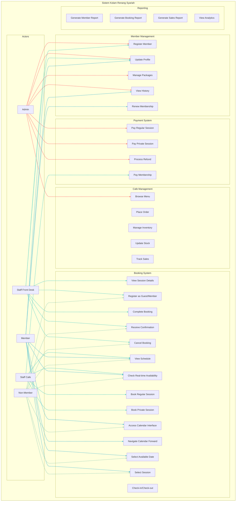

### 1.2 Use Case Diagram Detail Member

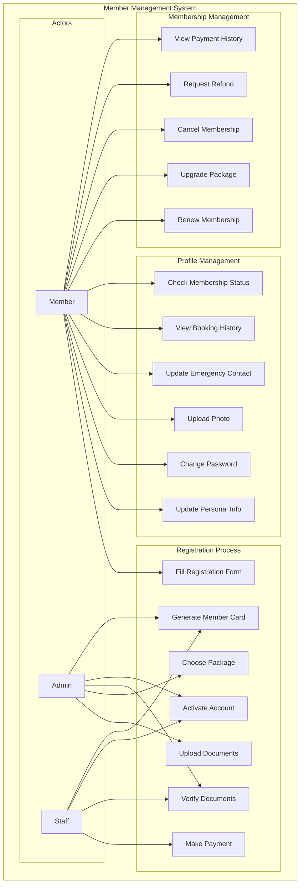

## 2. Class Diagram

### 2.1 Class Diagram Utama

```mermaid
classDiagram
    class User {
        -int id
        -string username
        -string email
        -string password_hash
        -string role
        -boolean is_active
        -timestamp created_at
        -timestamp updated_at
        +login()
        +logout()
        +changePassword()
        +updateProfile()
    }

    class Member {
        -int id
        -int user_id
        -string member_code
        -string full_name
        -string phone
        -string address
        -date birth_date
        -string gender
        -string photo_url
        -string emergency_contact
        -boolean is_active
        -date membership_start
        -date membership_end
        -string membership_type
        +register()
        +updateProfile()
        +renewMembership()
        +checkMembershipStatus()
        +makeBooking()
    }

    classDef user-class fill:#ff6b6b,stroke:#333,stroke-width:2px,color:#fff
    classDef member-class fill:#45b7d1,stroke:#333,stroke-width:2px,color:#fff
    classDef booking-class fill:#4ecdc4,stroke:#333,stroke-width:2px,color:#fff
    classDef session-class fill:#96ceb4,stroke:#333,stroke-width:2px,color:#fff
    classDef package-class fill:#ffeaa7,stroke:#333,stroke-width:2px,color:#000

    User:::user-class
    Member:::member-class

    class Package {
        -int id
        -string name
        -string description
        -decimal price
        -int duration_months
        -int max_adults
        -int max_children
        -boolean is_active
        +calculatePrice()
        +validateCapacity()
        +getDuration()
    }

    class Booking {
        -int id
        -int member_id
        -string booking_type
        -date booking_date
        -string session_time
        -int adult_count
        -int child_count
        -string status
        -decimal total_amount
        -string notes
        +createBooking()
        +cancelBooking()
        +checkIn()
        +checkOut()
        +calculateAmount()
    }

    class Session {
        -int id
        -string session_name
        -string session_time
        -int max_capacity
        -string session_type
        -boolean is_active
        +checkAvailability()
        +getCurrentCapacity()
        +isFull()
        +addBooking()
    }

    class Payment {
        -int id
        -int booking_id
        -string payment_method
        -decimal amount
        -string status
        -string transaction_id
        -timestamp payment_date
        +processPayment()
        +verifyPayment()
        +refundPayment()
        +generateReceipt()
    }

    class CafeMenu {
        -int id
        -string name
        -string description
        -decimal price
        -string category
        -string image_url
        -boolean is_available
        -boolean is_halal
        +isAvailable()
        +updatePrice()
        +checkStock()
        +disableMenu()
    }

    class CafeOrder {
        -int id
        -int member_id
        -string order_number
        -string status
        -decimal total_amount
        -timestamp order_date
        +placeOrder()
        +updateStatus()
        +calculateTotal()
        +addMenuItem()
        +removeMenuItem()
    }

    class CafeInventory {
        -int id
        -int menu_id
        -int current_stock
        -int minimum_stock
        -string unit
        -timestamp last_updated
        +updateStock()
        +checkLowStock()
        +getStockLevel()
        +addStock()
        +removeStock()
    }

    User ||--|| Member : has
    Member ||--o{ Booking : makes
    Member ||--o{ CafeOrder : places
    Package ||--o{ Member : subscribes
    Booking ||--|| Payment : has
    Booking ||--o{ Session : includes
    CafeOrder ||--o{ CafeMenu : contains
    CafeMenu ||--|| CafeInventory : tracks
```

### 2.2 Class Diagram Cafe System

```mermaid
classDiagram
    class CafeMenu {
        -int id
        -string name
        -string description
        -decimal price
        -string category
        -string image_url
        -boolean is_available
        -boolean is_halal
        +isAvailable()
        +updatePrice()
        +checkStock()
        +disableMenu()
    }

    class CafeOrder {
        -int id
        -int member_id
        -string order_number
        -string status
        -decimal total_amount
        -timestamp order_date
        +placeOrder()
        +updateStatus()
        +calculateTotal()
        +addMenuItem()
        +removeMenuItem()
        +confirmOrder()
        +cancelOrder()
    }

    class CafeOrderItem {
        -int id
        -int order_id
        -int menu_id
        -int quantity
        -decimal unit_price
        -decimal total_price
        -string notes
        +calculateTotal()
        +updateQuantity()
        +getSubtotal()
    }

    class CafeInventory {
        -int id
        -int menu_id
        -int current_stock
        -int minimum_stock
        -string unit
        -timestamp last_updated
        +updateStock()
        +checkLowStock()
        +getStockLevel()
        +addStock()
        +removeStock()
        +generateAlert()
    }

    class InventoryLog {
        -int id
        -int inventory_id
        -string action_type
        -int quantity_change
        -string reason
        -timestamp created_at
        +logTransaction()
        +getHistory()
        +generateReport()
    }

    class StockAlert {
        -int id
        -int inventory_id
        -string alert_type
        -string message
        -boolean is_resolved
        +createAlert()
        +resolveAlert()
        +sendNotification()
    }

    CafeMenu ||--o{ CafeOrderItem : contains
    CafeOrder ||--o{ CafeOrderItem : has
    CafeMenu ||--|| CafeInventory : tracks
    CafeInventory ||--o{ InventoryLog : logs
    CafeInventory ||--o{ StockAlert : generates
```

## 3. Sequence Diagram

### 3.1 Core Booking Flow Sequence

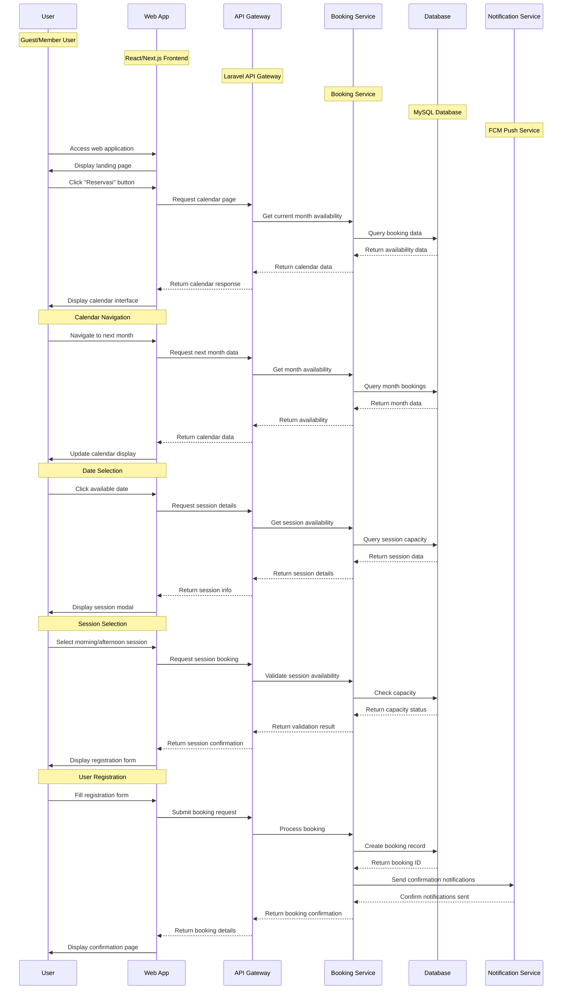

### 3.2 Sequence Diagram Member Registration

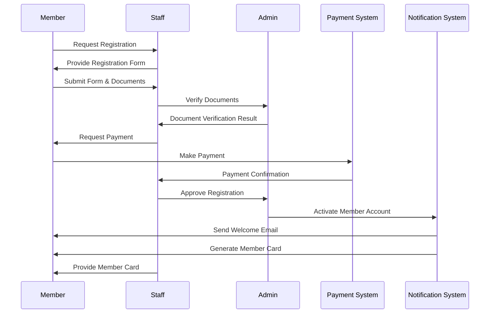

### 3.2 Sequence Diagram Booking Process

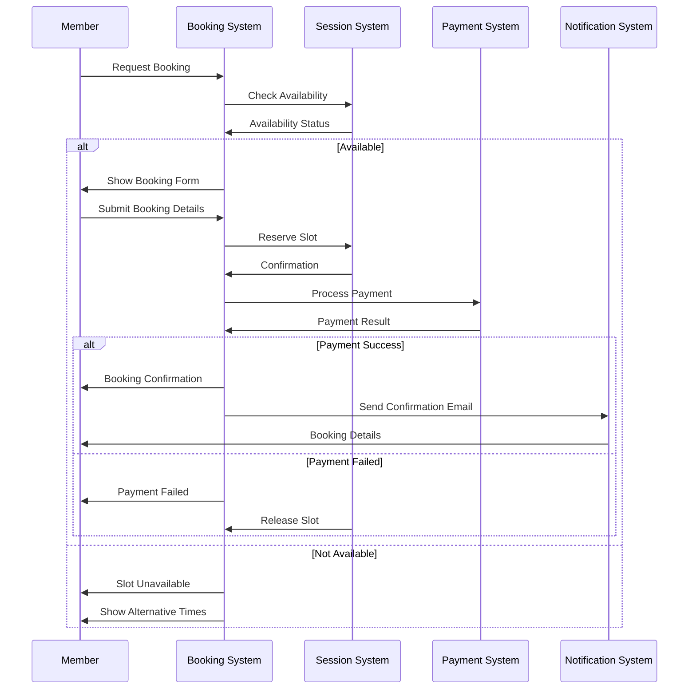

### 3.3 Sequence Diagram Cafe Order

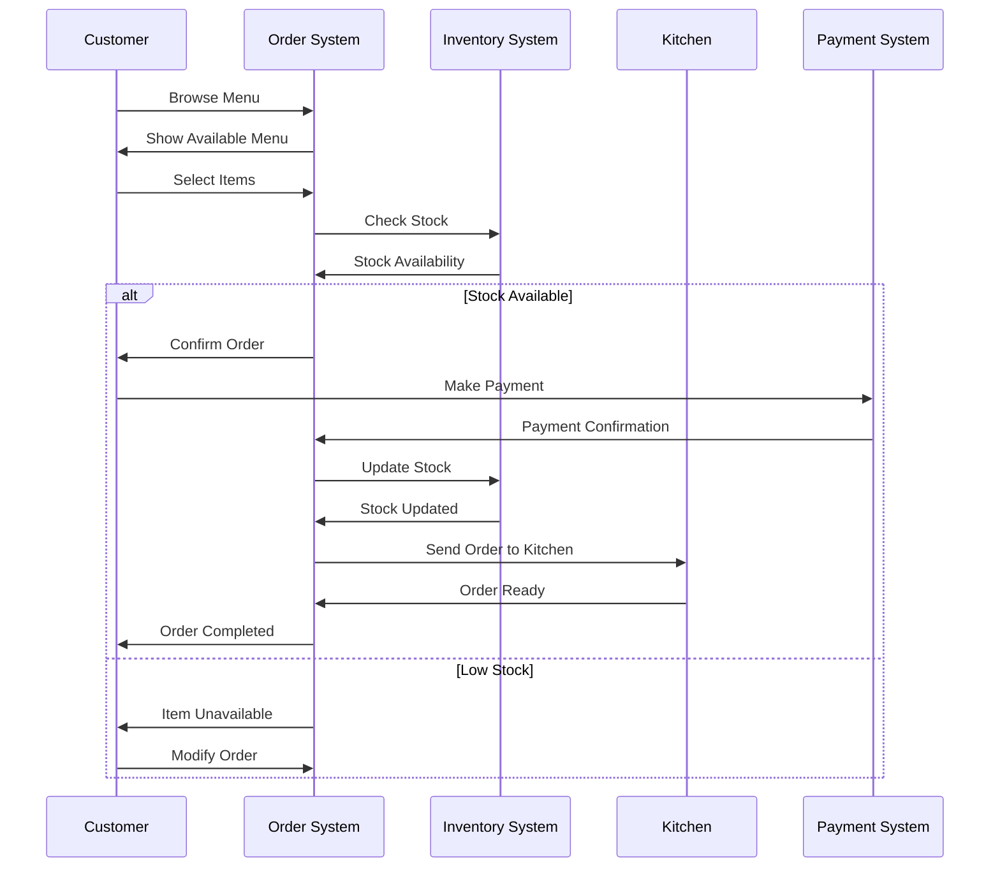

## 4. Activity Diagram

### 4.1 Activity Diagram Member Registration

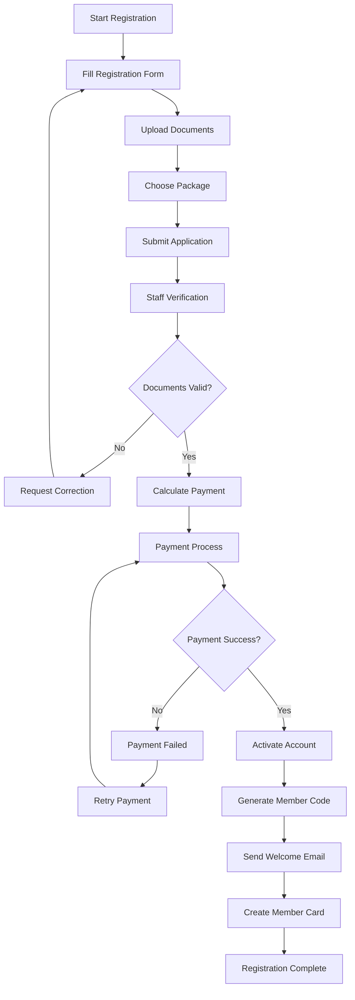

### 4.2 Activity Diagram Booking Process

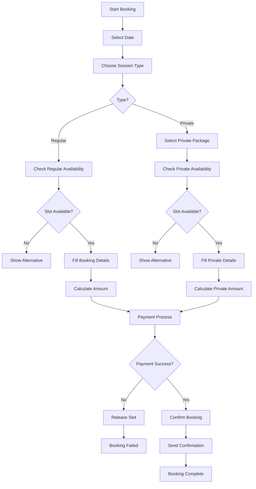

### 4.3 Activity Diagram Cafe Order

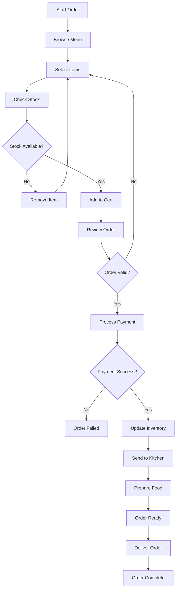

## 5. State Diagram

### 5.1 State Diagram Booking Status

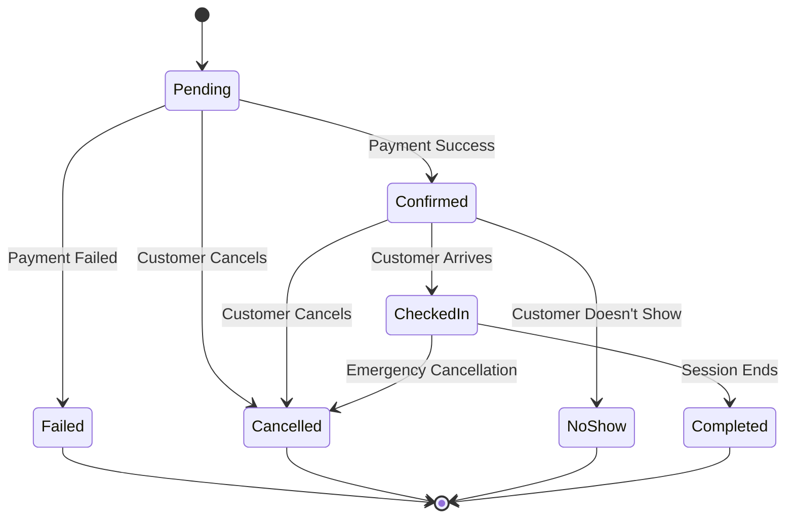

### 5.2 State Diagram Cafe Order

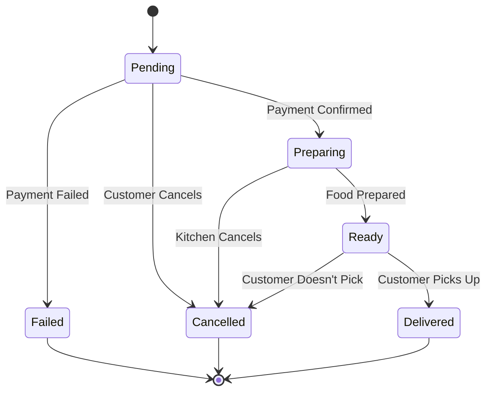

### 5.3 State Diagram Member Status

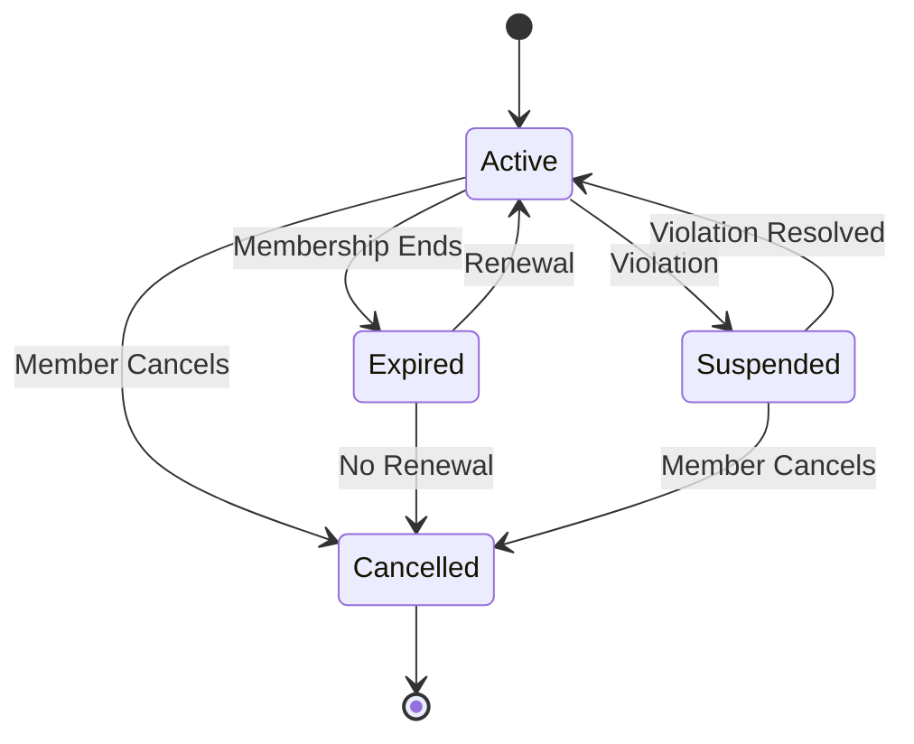

## 6. Component Diagram

### 6.1 Component Diagram System Architecture

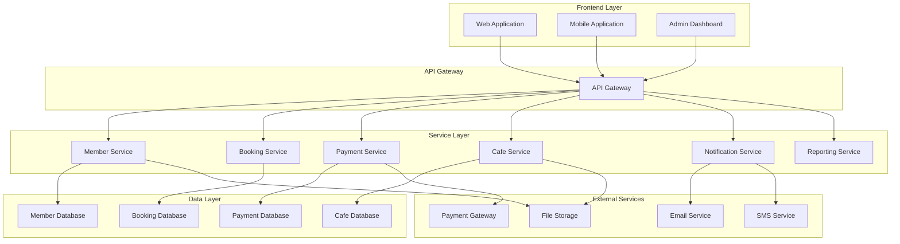

---

**Versi**: 1.1  
**Tanggal**: 26 Agustus 2025  
**Status**: Updated berdasarkan PDF Raujan Pool Syariah
