# UML Diagrams - Sistem Kolam Renang Syariah

## 1. Use Case Diagram

### 1.1 Use Case Diagram Utama

```mermaid
graph TB
    subgraph "Sistem Kolam Renang Syariah"
        subgraph "Actors"
            A1[Admin]:::admin
            A2[Staff Front Desk]:::staff
            A3[Staff Cafe]:::staff
            A4[Member]:::member
            A5[Non-Member]:::guest
        end

        subgraph "Member Management"
            UC1[Register Member]
            UC2[Update Profile]
            UC3[Manage Packages]
            UC4[View History]
            UC5[Renew Membership]
        end

        subgraph "Booking System"
            UC6[Access Calendar Interface]
            UC7[Navigate Calendar Forward]
            UC8[Select Available Date]
            UC9[View Session Details]
            UC10[Select Session]
            UC11[Register as Guest/Member]
            UC12[Complete Booking]
            UC13[Receive Confirmation]
            UC14[Cancel Booking]
            UC15[Check-in/Check-out]
            UC16[View Schedule]
            UC17[Check Real-time Availability]
            UC18[Book Regular Session]
            UC19[Book Private Session]
        end

        subgraph "Payment System"
            UC20[Pay Membership]
            UC21[Pay Regular Session]
            UC22[Pay Private Session]
            UC23[Process Refund]
        end

        subgraph "Cafe Management"
            UC24[Browse Menu]
            UC25[Place Order]
            UC26[Manage Inventory]
            UC27[Update Stock]
            UC28[Track Sales]
        end

        subgraph "Rating & Review System"
            UC29[Rate Services]
            UC30[Submit Reviews]
            UC31[Manage Rating System]
            UC32[View Rating Analytics]
            UC33[Configure Rating Components]
        end

        subgraph "Promotional System"
            UC34[Create Promotional Campaigns]
            UC35[Manage Campaign Templates]
            UC36[View Campaign Analytics]
            UC37[Configure Dynamic Pricing]
            UC38[Apply Promotional Pricing]
        end

        subgraph "Staff Management"
            UC39[Process Check-in]
            UC40[Manage Equipment]
            UC41[Track Attendance]
            UC42[Handle No-Shows]
            UC43[Manage Staff]
            UC44[Generate Reports]
        end

        subgraph "Dynamic Pricing System"
            UC45[Configure Dynamic Pricing]
            UC46[Update Pricing Configuration]
            UC47[View Pricing History]
            UC48[Manage Pricing Rules]
            UC49[Set Seasonal Pricing]
            UC50[Configure Member Discounts]
        end

        subgraph "Guest User Management"
            UC51[Register as Guest]
            UC52[Convert Guest to Member]
            UC53[Manage Guest Users]
            UC54[Guest User Analytics]
            UC55[Guest Conversion Tracking]
        end

        subgraph "Google SSO Integration"
            UC56[Login via Google SSO]
            UC57[Sign up via Google SSO]
            UC58[Sync Google Profile]
            UC59[Configure SSO Settings]
            UC60[Manage SSO Sessions]
        end

        subgraph "Booking Proof System"
            UC61[Generate QR Code]
            UC62[Generate Booking Reference]
            UC63[Send Email Confirmation]
            UC64[Send SMS Confirmation]
            UC65[Verify Booking Proof]
            UC66[Generate Digital Receipt]
            UC67[Manage Proof Templates]
        end

        subgraph "Notification System"
            UC68[Send Push Notifications]
            UC69[Configure Notifications]
            UC70[Manage Notification Templates]
            UC71[Schedule Notifications]
            UC72[Track Notification Delivery]
        end

        subgraph "Mobile Features"
            UC73[PWA Installation]
            UC74[Offline Support]
            UC75[Mobile-Optimized Interface]
            UC76[Touch Gestures]
            UC77[Mobile Payment Integration]
        end

        subgraph "Advanced Calendar"
            UC78[Forward-Only Navigation]
            UC79[Real-time Availability Display]
            UC80[Date Status Indicators]
            UC81[Capacity Management]
            UC82[Session Slot Management]
        end

        subgraph "Manual Payment System"
            UC83[Select Manual Payment]
            UC84[Upload Transfer Proof]
            UC85[Submit Payment Proof]
            UC86[View Payment Status]
            UC87[Verify Payment Proof]
            UC88[Confirm Payment]
            UC89[Reject Payment]
            UC90[Request Payment Correction]
            UC91[Generate Payment Instructions]
            UC92[Track Payment History]
        end

                        subgraph "Dynamic Member Quota Management"
                    UC93[Configure Member Quota]
                    UC94[Join Member Queue]
                    UC95[Monitor Queue Position]
                    UC96[Process Member Expiry]
                    UC97[Send Expiry Warnings]
                    UC98[Auto-Promote Queue]
                    UC99[Confirm Promotion Offer]
                    UC100[Update Quota Settings]
                    UC101[Track Quota History]
                    UC102[View Quota Dashboard]
                end

                subgraph "Member Daily Swimming Limit"
                    UC103[Check Daily Limit]
                    UC104[Book Free Session]
                    UC105[Book Additional Paid Session]
                    UC106[Apply Limit Override]
                    UC107[Track Daily Usage]
                    UC108[View Usage History]
                    UC109[Generate Usage Reports]
                    UC110[Monitor Limit Compliance]
                end

                subgraph "Private Pool Rental System"
                    UC111[Book Private Pool]
                    UC112[Check New Customer Status]
                    UC113[Apply Time Bonus]
                    UC114[Calculate Dynamic Pricing]
                    UC115[Manage Customer History]
                    UC116[Configure Pricing Rules]
                    UC117[Track Visit Counter]
                    UC118[Generate Analytics]
                    UC119[Process Payment]
                    UC120[Send Notifications]
                end

                subgraph "Cafe System with Barcode"
                    UC121[Scan Barcode/QR Code]
                    UC122[Browse Menu]
                    UC123[Add Item to Cart]
                    UC124[Add Special Notes]
                    UC125[Manage Cart]
                    UC126[Process Payment]
                    UC127[Verify Payment]
                    UC128[Prepare Food]
                    UC129[Deliver Order]
                    UC130[Confirm Reception]
                    UC131[Create Menu]
                    UC132[Update Menu]
                    UC133[Manage Stock]
                    UC134[View Menu Analytics]
                    UC135[Generate Menu Barcode]
                    UC136[Download Barcode]
                    UC137[Generate Financial Reports]
                    UC138[View Analytics Dashboard]
                end
    end

    A1 -.-> UC1
    A1 -.-> UC2
    A1 -.-> UC3
    A1 -.-> UC4
    A1 -.-> UC5
    A1 -.-> UC21
    A1 -.-> UC22
    A1 -.-> UC23
    A1 -.-> UC24
    A1 -.-> UC25
    A1 -.-> UC26
    A1 -.-> UC27
    A1 -.-> UC31
    A1 -.-> UC32
    A1 -.-> UC33
    A1 -.-> UC34
    A1 -.-> UC35
    A1 -.-> UC36
    A1 -.-> UC37
    A1 -.-> UC38
    A1 -.-> UC39
    A1 -.-> UC40
    A1 -.-> UC41
    A1 -.-> UC42
    A1 -.-> UC43
    A1 -.-> UC44
    A1 -.-> UC45
    A1 -.-> UC46
    A1 -.-> UC47
    A1 -.-> UC48
    A1 -.-> UC49
    A1 -.-> UC50
    A1 -.-> UC51
    A1 -.-> UC52
    A1 -.-> UC53
    A1 -.-> UC54
    A1 -.-> UC55
    A1 -.-> UC56
    A1 -.-> UC57
    A1 -.-> UC58
    A1 -.-> UC59
    A1 -.-> UC60
    A1 -.-> UC61
    A1 -.-> UC62
    A1 -.-> UC63
    A1 -.-> UC64
    A1 -.-> UC65
    A1 -.-> UC66
    A1 -.-> UC67
    A1 -.-> UC68
    A1 -.-> UC69
    A1 -.-> UC70
    A1 -.-> UC71
    A1 -.-> UC72
    A1 -.-> UC73
    A1 -.-> UC74
    A1 -.-> UC75
    A1 -.-> UC76
    A1 -.-> UC77
    A1 -.-> UC78
    A1 -.-> UC79
    A1 -.-> UC80
    A1 -.-> UC81
    A1 -.-> UC82
    A1 -.-> UC83
    A1 -.-> UC84
    A1 -.-> UC85
    A1 -.-> UC86
    A1 -.-> UC87
    A1 -.-> UC88
    A1 -.-> UC89
    A1 -.-> UC90
    A1 -.-> UC91
    A1 -.-> UC92
    A1 -.-> UC93
    A1 -.-> UC96
    A1 -.-> UC97
    A1 -.-> UC98
                A1 -.-> UC100
            A1 -.> UC101
            A1 -.-> UC102
            A1 -.-> UC106
            A1 -.-> UC107
            A1 -.-> UC109
            A1 -.-> UC110
            A1 -.-> UC116
            A1 -.-> UC118
            A1 -.-> UC115

            A2 -.-> UC1
    A2 -.-> UC2
    A2 -.-> UC9
    A2 -.-> UC11
    A2 -.-> UC12
    A2 -.-> UC13
    A2 -.-> UC14
    A2 -.-> UC15
    A2 -.-> UC39
    A2 -.-> UC40
    A2 -.-> UC41
    A2 -.-> UC42
    A2 -.-> UC87
    A2 -.-> UC88
    A2 -.-> UC89
                A2 -.-> UC90
            A2 -.-> UC93
            A2 -.-> UC96
            A2 -.-> UC97
            A2 -.> UC98
            A2 -.-> UC100
            A2 -.-> UC101
            A2 -.-> UC102
            A2 -.-> UC106
            A2 -.-> UC107
            A2 -.-> UC110
            A2 -.-> UC111
            A2 -.-> UC112
            A2 -.-> UC115
            A2 -.-> UC119

            A3 -.-> UC26
    A3 -.-> UC27
    A3 -.-> UC28
    A3 -.-> UC40

    A4 -.-> UC2
    A4 -.-> UC4
    A4 -.-> UC6
    A4 -.-> UC7
    A4 -.-> UC8
    A4 -.-> UC10
    A4 -.-> UC11
    A4 -.-> UC12
    A4 -.-> UC13
    A4 -.-> UC14
    A4 -.-> UC18
    A4 -.-> UC19
    A4 -.-> UC24
    A4 -.-> UC25
    A4 -.-> UC29
    A4 -.-> UC30
    A4 -.-> UC38
    A4 -.-> UC5
    A4 -.-> UC94
    A4 -.-> UC95
                A4 -.-> UC99
            A4 -.-> UC103
            A4 -.-> UC104
            A4 -.-> UC105
            A4 -.-> UC108
            A4 -.> UC111
            A4 -.-> UC112
            A4 -.-> UC113
            A4 -.-> UC114
            A4 -.-> UC115
            A4 -.-> UC117
            A4 -.-> UC119

            A5 -.-> UC6
    A5 -.-> UC8
    A5 -.-> UC10
    A5 -.-> UC11
    A5 -.-> UC13
    A5 -.-> UC14
    A5 -.-> UC18
    A5 -.-> UC19
    A5 -.-> UC24
    A5 -.-> UC25
    A5 -.-> UC29
    A5 -.-> UC30
    A5 -.-> UC38
    A5 -.-> UC83
    A5 -.-> UC84
    A5 -.-> UC85
    A5 -.-> UC86
    A5 -.-> UC94
                A5 -.-> UC95
            A5 -.-> UC99
            A5 -.-> UC111
            A5 -.-> UC112
            A5 -.-> UC113
            A5 -.-> UC114
            A5 -.-> UC119

            A1 -.-> UC127
            A1 -.-> UC128
            A1 -.-> UC129
            A1 -.-> UC130

            A3 -.-> UC127
            A3 -.-> UC128
            A3 -.-> UC129
            A3 -.-> UC130

            A4 -.-> UC121
            A4 -.-> UC122
            A4 -.-> UC123
            A4 -.-> UC124
            A4 -.-> UC125
            A4 -.-> UC126
            A4 -.-> UC130

            A5 -.-> UC121
            A5 -.-> UC122
            A5 -.-> UC123
            A5 -.-> UC124
            A5 -.-> UC125
            A5 -.-> UC126
            A5 -.-> UC130

            A1 -.-> UC131
            A1 -.-> UC132
            A1 -.-> UC133
            A1 -.-> UC134
            A1 -.-> UC135
            A1 -.-> UC136
            A1 -.-> UC137
            A1 -.-> UC138

    %% Custom styling untuk lines dengan warna berbeda
    linkStyle 0,1,2,3,4,5,6,7 stroke:#ff6b6b,stroke-width:3px
    linkStyle 8,9,10,11,12,13,14 stroke:#4ecdc4,stroke-width:3px
    linkStyle 15,16,17,18,19 stroke:#4ecdc4,stroke-width:3px
    linkStyle 20,21,22,23,24,25,26,27,28 stroke:#45b7d1,stroke-width:3px
    linkStyle 29,30,31,32,33,34,35,36 stroke:#96ceb4,stroke-width:3px
```

### 1.2 Use Case Diagram Detail Member

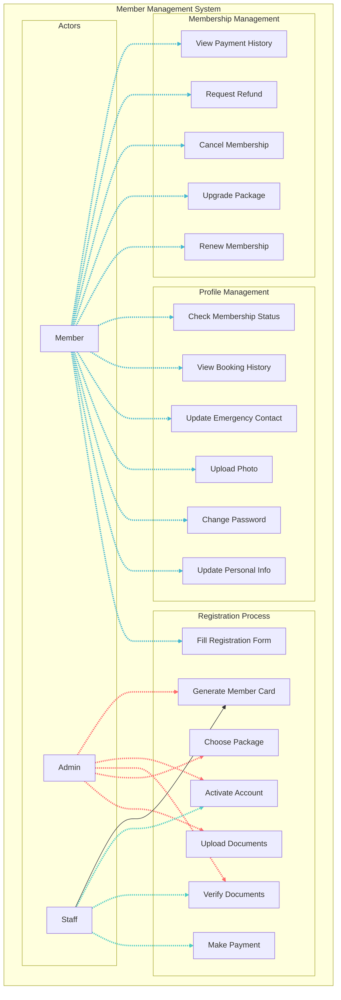

## 2. Class Diagram

### 2.1 Class Diagram Utama

```mermaid
classDiagram
    class User {
        -int id
        -string username
        -string email
        -string password_hash
        -string role
        -boolean is_active
        -timestamp created_at
        -timestamp updated_at
        +login()
        +logout()
        +changePassword()
        +updateProfile()
    }

    class Member {
        -int id
        -int user_id
        -string member_code
        -string full_name
        -string phone
        -string address
        -date birth_date
        -string gender
        -string photo_url
        -string emergency_contact
        -boolean is_active
        -date membership_start
        -date membership_end
        -string membership_type
        +register()
        +updateProfile()
        +renewMembership()
        +checkMembershipStatus()
        +makeBooking()
    }

    classDef user-class fill:#ff6b6b,stroke:#333,stroke-width:2px,color:#fff
    classDef member-class fill:#45b7d1,stroke:#333,stroke-width:2px,color:#fff
    classDef booking-class fill:#4ecdc4,stroke:#333,stroke-width:2px,color:#fff
    classDef session-class fill:#96ceb4,stroke:#333,stroke-width:2px,color:#fff
    classDef package-class fill:#ffeaa7,stroke:#333,stroke-width:2px,color:#000

    User:::user-class
    Member:::member-class

    class Package {
        -int id
        -string name
        -string description
        -decimal price
        -int duration_months
        -int max_adults
        -int max_children
        -boolean is_active
        +calculatePrice()
        +validateCapacity()
        +getDuration()
    }

    class Booking {
        -int id
        -int member_id
        -string booking_type
        -date booking_date
        -string session_time
        -int adult_count
        -int child_count
        -string status
        -decimal total_amount
        -string notes
        +createBooking()
        +cancelBooking()
        +checkIn()
        +checkOut()
        +calculateAmount()
    }

    class Session {
        -int id
        -string session_name
        -string session_time
        -int max_capacity
        -string session_type
        -boolean is_active
        +checkAvailability()
        +getCurrentCapacity()
        +isFull()
        +addBooking()
    }

    class Payment {
        -int id
        -int booking_id
        -string payment_method
        -decimal amount
        -string status
        -string transaction_id
        -timestamp payment_date
        +processPayment()
        +verifyPayment()
        +refundPayment()
        +generateReceipt()
    }

    class CafeMenu {
        -int id
        -string name
        -string description
        -decimal price
        -string category
        -string image_url
        -boolean is_available
        -boolean is_halal
        +isAvailable()
        +updatePrice()
        +checkStock()
        +disableMenu()
    }

    class CafeOrder {
        -int id
        -int member_id
        -string order_number
        -string status
        -decimal total_amount
        -timestamp order_date
        +placeOrder()
        +updateStatus()
        +calculateTotal()
        +addMenuItem()
        +removeMenuItem()
    }

    class CafeInventory {
        -int id
        -int menu_id
        -int current_stock
        -int minimum_stock
        -string unit
        -timestamp last_updated
        +updateStock()
        +checkLowStock()
        +getStockLevel()
        +addStock()
        +removeStock()
    }

    User ||--|| Member : has
    Member ||--o{ Booking : makes
    Member ||--o{ CafeOrder : places
    Package ||--o{ Member : subscribes
    Booking ||--|| Payment : has
    Booking ||--o{ Session : includes
    CafeOrder ||--o{ CafeMenu : contains
    CafeMenu ||--|| CafeInventory : tracks

    %% Custom styling untuk relationship lines
    linkStyle 0,1 stroke:#ff6b6b,stroke-width:2px
    linkStyle 2,3 stroke:#45b7d1,stroke-width:2px
    linkStyle 4 stroke:#ffeaa7,stroke-width:2px
    linkStyle 5,6 stroke:#4ecdc4,stroke-width:2px
    linkStyle 7 stroke:#96ceb4,stroke-width:2px
    linkStyle 8 stroke:#ff7675,stroke-width:2px
```

### 2.2 Class Diagram Cafe System

```mermaid
classDiagram
    class CafeMenu {
        -int id
        -string name
        -string description
        -decimal price
        -string category
        -string image_url
        -boolean is_available
        -boolean is_halal
        +isAvailable()
        +updatePrice()
        +checkStock()
        +disableMenu()
    }

    class CafeOrder {
        -int id
        -int member_id
        -string order_number
        -string status
        -decimal total_amount
        -timestamp order_date
        +placeOrder()
        +updateStatus()
        +calculateTotal()
        +addMenuItem()
        +removeMenuItem()
        +confirmOrder()
        +cancelOrder()
    }

    class CafeOrderItem {
        -int id
        -int order_id
        -int menu_id
        -int quantity
        -decimal unit_price
        -decimal total_price
        -string notes
        +calculateTotal()
        +updateQuantity()
        +getSubtotal()
    }

    class CafeInventory {
        -int id
        -int menu_id
        -int current_stock
        -int minimum_stock
        -string unit
        -timestamp last_updated
        +updateStock()
        +checkLowStock()
        +getStockLevel()
        +addStock()
        +removeStock()
        +generateAlert()
    }

    class InventoryLog {
        -int id
        -int inventory_id
        -string action_type
        -int quantity_change
        -string reason
        -timestamp created_at
        +logTransaction()
        +getHistory()
        +generateReport()
    }

    class StockAlert {
        -int id
        -int inventory_id
        -string alert_type
        -string message
        -boolean is_resolved
        +createAlert()
        +resolveAlert()
        +sendNotification()
    }

    CafeMenu ||--o{ CafeOrderItem : contains
    CafeOrder ||--o{ CafeOrderItem : has
    CafeMenu ||--|| CafeInventory : tracks
    CafeInventory ||--o{ InventoryLog : logs
    CafeInventory ||--o{ StockAlert : generates
```

## 3. Sequence Diagram

### 3.1 Core Booking Flow Sequence

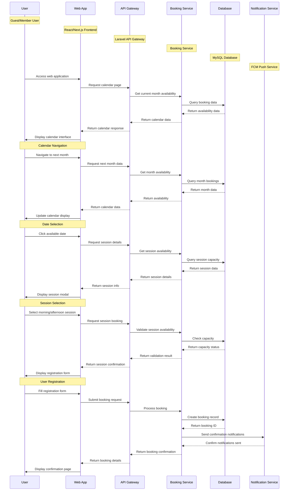

### 3.2 Sequence Diagram Member Registration

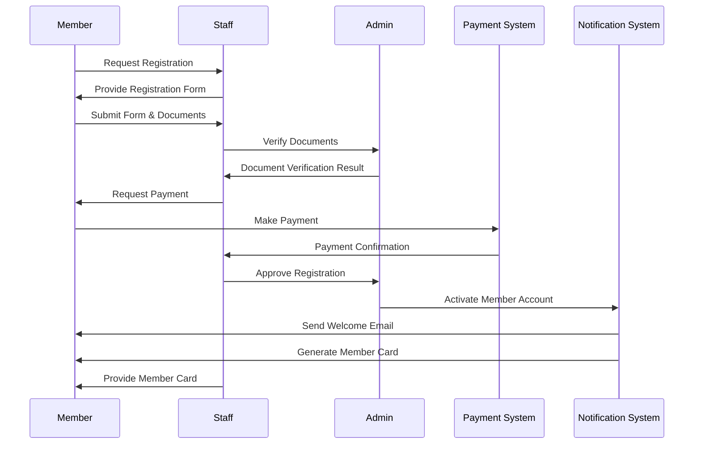

### 3.2 Sequence Diagram Booking Process

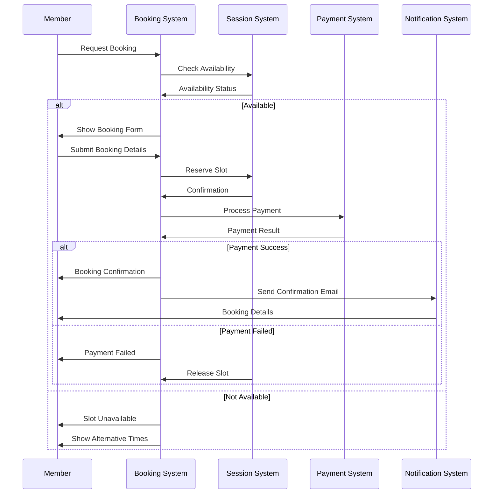

### 3.3 Sequence Diagram Cafe Order

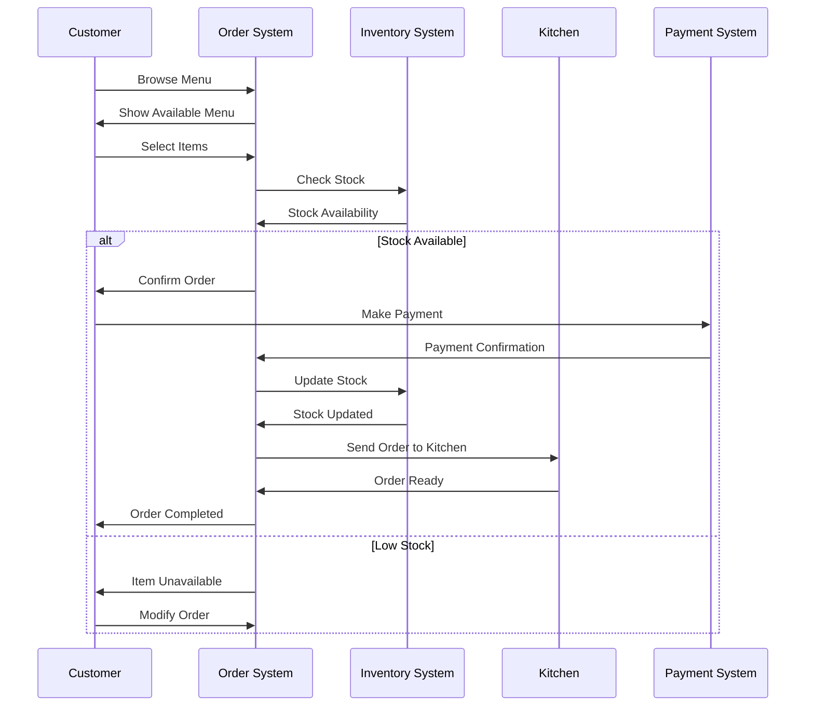

### 2.4 Rating System Sequence Diagram

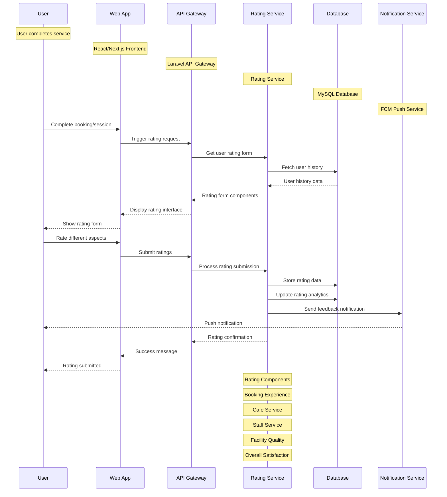

### 2.5 Promotional Pricing Sequence Diagram

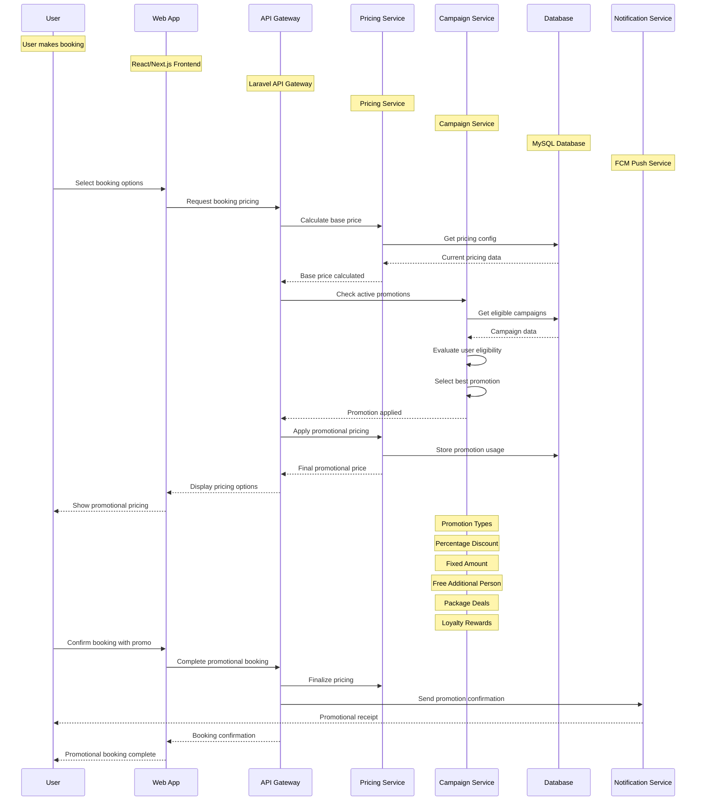

### 2.6 Check-in Process Sequence Diagram

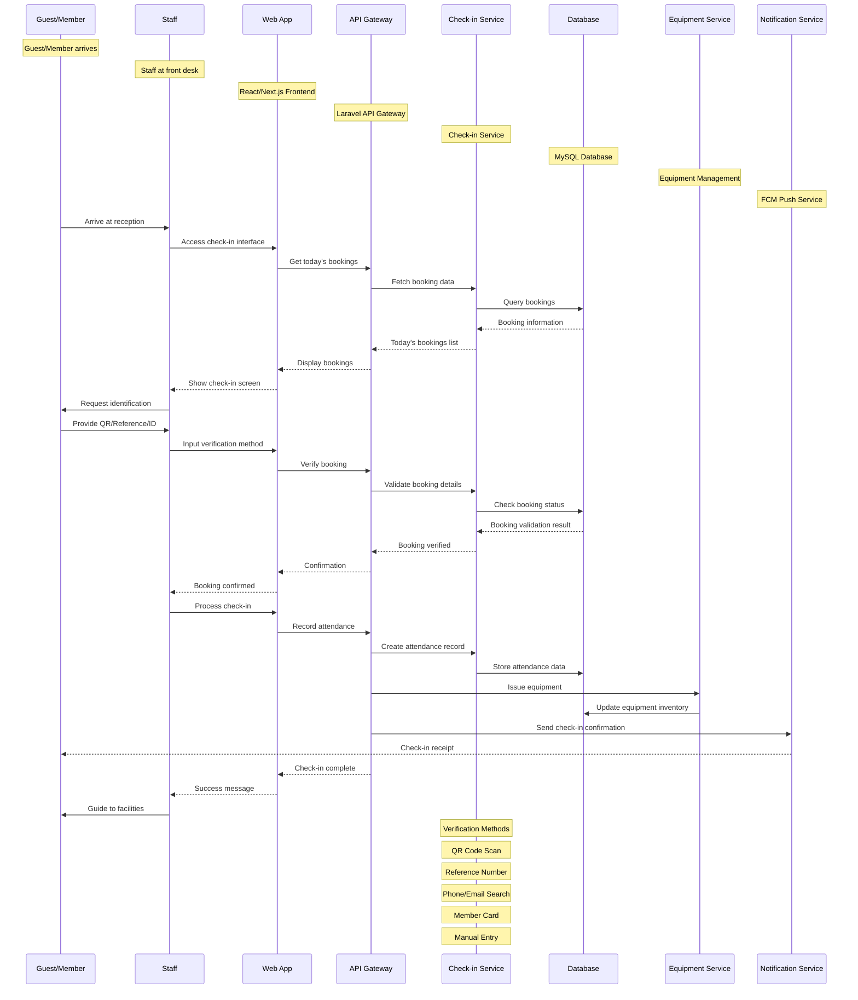

### 2.7 Dynamic Member Quota Management Sequence Diagram

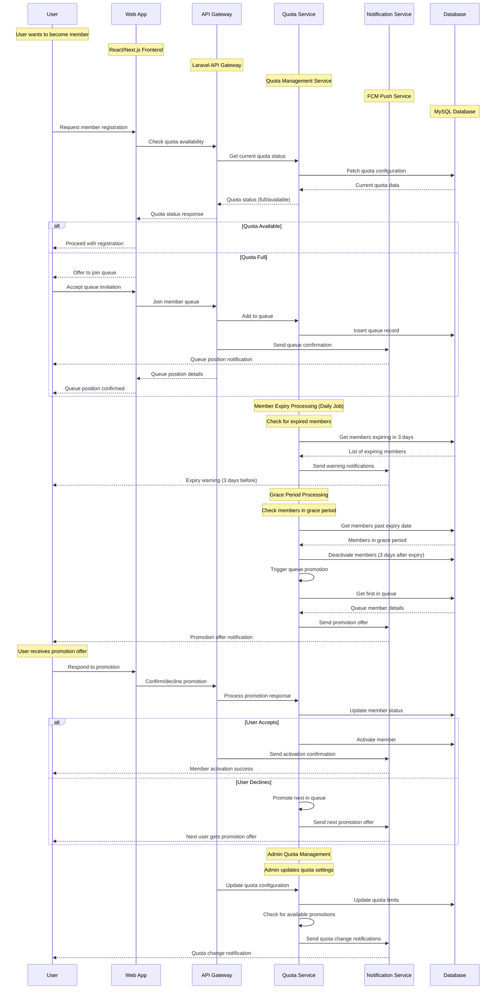

### 2.8 Member Daily Swimming Limit Sequence Diagram

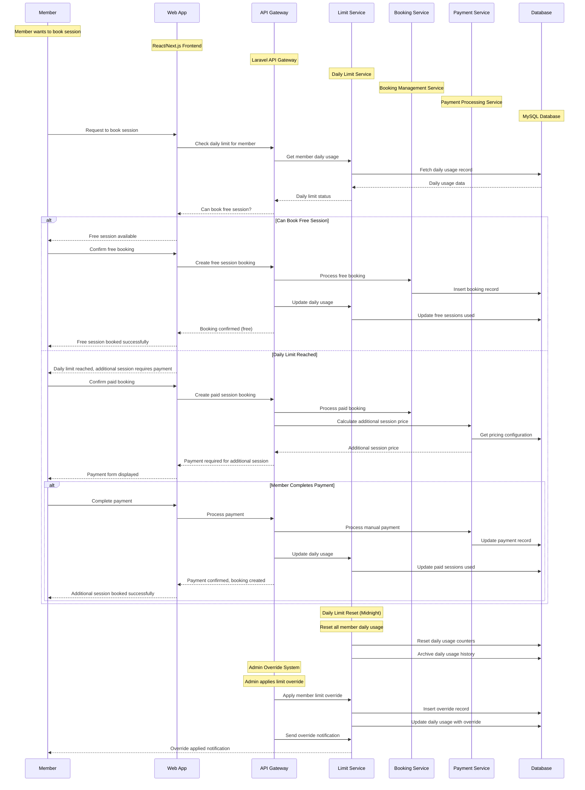

### 2.9 Private Pool Rental System Sequence Diagram

````mermaid
sequenceDiagram
    participant C as Customer
    participant W as Web App
    participant A as API Gateway
    participant P as Private Pool Service
    participant H as Customer History Service
    participant R as Pricing Service
    participant D as Database

    Note over C: Customer wants to book private pool
    Note over W: React/Next.js Frontend
    Note over A: Laravel API Gateway
    Note over P: Private Pool Management Service
    Note over H: Customer History Service
    Note over R: Dynamic Pricing Service
    Note over D: MySQL Database

    C->>W: Access private pool booking
    W->>A: Get pool availability
    A->>P: Check pool availability
    P->>D: Fetch availability calendar
    D-->>P: Available time slots
    P-->>A: Pool availability data
    A-->>W: Available slots displayed
    W-->>C: Select date and time

    C->>W: Enter customer information
    W->>A: Submit customer details
    A->>H: Check customer history
    H->>D: Query customer visit history
    D-->>H: Customer history data
    H-->>A: Customer classification (new/returning)

    alt New Customer
        A->>R: Calculate price with bonus
        R->>D: Get pricing configuration
        D-->>R: Pricing config (1h 30min + 30min bonus)
        R->>A: Price calculation (base price only)
        A-->>W: Price with 30min bonus time
        W-->>C: Display price: Base Price (1h 33min total)
    else Returning Customer
        A->>R: Calculate price with additional charge
        R->>D: Get visit count and pricing
        D-->>R: Visit count and pricing config
        R->>A: Price calculation (base + additional charge)
        A-->>W: Price with additional charge
        W-->>C: Display price: Base Price + Additional Charge
    end

    C->>W: Confirm booking
    W->>A: Process private pool booking
    A->>P: Create booking record
    P->>D: Insert private pool booking
    A->>H: Update customer history
    H->>D: Update visit counter and spending
    A->>R: Generate receipt
    R-->>A: Receipt with price breakdown
    A-->>W: Booking confirmation with receipt
    W-->>C: Booking confirmed

    Note over A: Admin Pricing Management
    Note over A: Admin updates pricing configuration
    A->>R: Update pricing rules
    R->>D: Update pricing configuration
    A->>R: Apply new pricing to future bookings
    R-->>A: New pricing applied
    A->>H: Send pricing update notifications
    H-->>C: Pricing change notification

    Note over P: Timer Management
    Note over P: Track ongoing pool usage
    P->>D: Start timer for booking
    P->>D: Monitor duration (1h 30min or 2 hours)
    P->>H: Update usage statistics
    H->>D: Update analytics data
                P-->>C: Time remaining notification
            P-->>C: Session completion notification
        ```

        ### 2.7 Cafe System with Barcode Sequence Diagram

        ```mermaid
        sequenceDiagram
            participant C as Customer
            participant B as Barcode Scanner
            participant M as Menu System
            participant A as API Gateway
            participant K as Kitchen System
            participant P as Payment System
            participant N as Notification Service

            Note over C: Customer at pool area
            Note over B: QR Code/Barcode Scanner
            Note over M: React/Next.js Menu Interface
            Note over A: Laravel API Gateway
            Note over K: Kitchen Management System
            Note over P: Manual Payment System
            Note over N: FCM Push Service

            C->>B: Scan barcode/QR code
            B->>M: Redirect to menu page
            M->>A: Get menu for location
            A->>M: Return menu with availability
            M-->>C: Display menu with availability

            C->>M: Browse menu items
            M->>A: Check item availability
            A-->>M: Item availability status
            M-->>C: Show available/unavailable items

            C->>M: Add item to cart
            M->>A: Add item to cart session
            C->>M: Add special notes
            M->>A: Store notes with item
            C->>M: Set quantity
            M->>A: Update cart

            C->>M: Continue shopping
            M-->>C: Updated cart display

            C->>M: Review cart
            M-->>C: Cart summary with total
            C->>M: Proceed to payment
            M->>P: Create payment request
            P-->>M: Payment instructions
            M-->>C: Payment upload interface

            C->>M: Upload payment proof
            M->>A: Submit order with payment proof
            A->>K: Create kitchen order
            A->>N: Send order notification
            N-->>C: Order confirmation notification

            Note over A: Admin Payment Verification
            Note over A: Admin reviews payment proof
            A->>P: Verify payment
            P-->>A: Payment verification result
            A->>K: Confirm payment to kitchen
            K-->>A: Order preparation started

            Note over K: Kitchen Preparation
            K->>K: Prepare food items
            K->>A: Update order status: preparing
            A->>N: Send preparation notification
            N-->>C: Food preparation started

            K->>A: Update order status: ready
            A->>N: Send ready notification
            N-->>C: Food ready notification

            Note over A: Delivery Process
            A->>A: Assign delivery staff
            A->>N: Send delivery notification
            N-->>C: Delivery in progress

            Note over C: Customer Receives Food
            C->>M: Confirm food reception
            M->>A: Update order status: delivered
            A->>N: Send delivery confirmation
            N-->>C: Order completed notification

            Note over A: Order Completion
            A->>A: Mark order as completed
            A->>A: Update inventory
            A->>A: Generate receipt
            A->>N: Send completion notification
            N-->>C: Thank you notification
        ```

### 2.3 Core Booking Flow Sequence Diagram

## 4. Activity Diagram

### 4.1 Activity Diagram Member Registration

```mermaid
graph TD
    A[Start Registration] --> B[Fill Registration Form]
    B --> C[Upload Documents]
    C --> D[Choose Package]
    D --> E[Submit Application]
    E --> F[Staff Verification]
    F --> G{Documents Valid?}
    G -->|No| H[Request Correction]
    H --> B
    G -->|Yes| I[Calculate Payment]
    I --> J[Payment Process]
    J --> K{Payment Success?}
    K -->|No| L[Payment Failed]
    L --> M[Retry Payment]
    M --> J
    K -->|Yes| N[Activate Account]
    N --> O[Generate Member Code]
    O --> P[Send Welcome Email]
    P --> Q[Create Member Card]
    Q --> R[Registration Complete]

    %% Custom styling untuk activity nodes
    classDef start-end fill:#ff6b6b,stroke:#333,stroke-width:2px,color:#fff
    classDef process fill:#4ecdc4,stroke:#333,stroke-width:2px,color:#fff
    classDef decision fill:#ffeaa7,stroke:#333,stroke-width:2px,color:#000
    classDef success fill:#96ceb4,stroke:#333,stroke-width:2px,color:#fff
    classDef failure fill:#ff7675,stroke:#333,stroke-width:2px,color:#fff

    A:::start-end
    B:::process
    C:::process
    D:::process
    E:::process
    F:::process
    G:::decision
    H:::failure
    I:::process
    J:::process
    K:::decision
    L:::failure
    M:::process
    N:::success
    O:::success
    P:::success
    Q:::success
    R:::start-end
````

### 4.2 Activity Diagram Booking Process

```mermaid
graph TD
    A[Start Booking] --> B[Select Date]
    B --> C[Choose Session Type]
    C --> D{Type?}
    D -->|Regular| E[Check Regular Availability]
    D -->|Private| F[Select Private Package]
    F --> G[Check Private Availability]
    E --> H{Slot Available?}
    G --> I{Slot Available?}
    H -->|No| J[Show Alternative]
    I -->|No| K[Show Alternative]
    H -->|Yes| L[Fill Booking Details]
    I -->|Yes| M[Fill Private Details]
    L --> N[Calculate Amount]
    M --> O[Calculate Private Amount]
    N --> P[Payment Process]
    O --> P
    P --> Q{Payment Success?}
    Q -->|No| R[Release Slot]
    R --> S[Booking Failed]
    Q -->|Yes| T[Confirm Booking]
    T --> U[Send Confirmation]
    U --> V[Booking Complete]
```

### 4.3 Activity Diagram Cafe Order

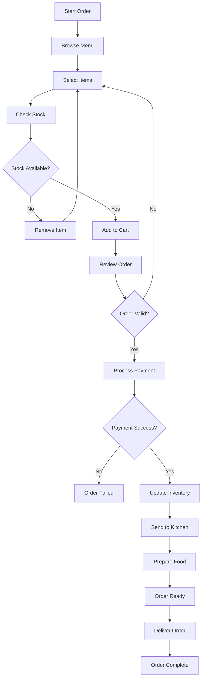

### 4.4 Activity Diagram Rating System

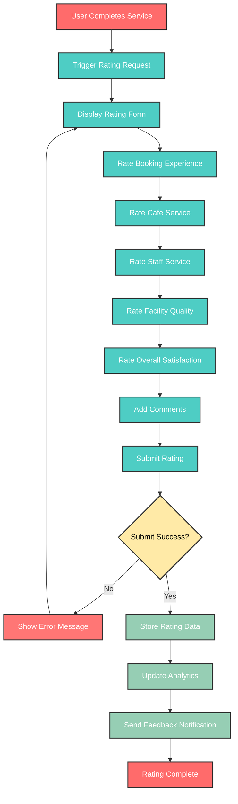

### 4.5 Activity Diagram Check-in Process

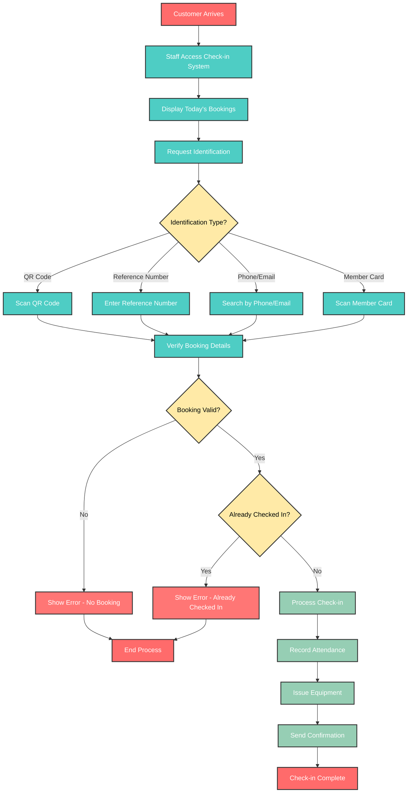

### 4.6 Activity Diagram Promotional Pricing

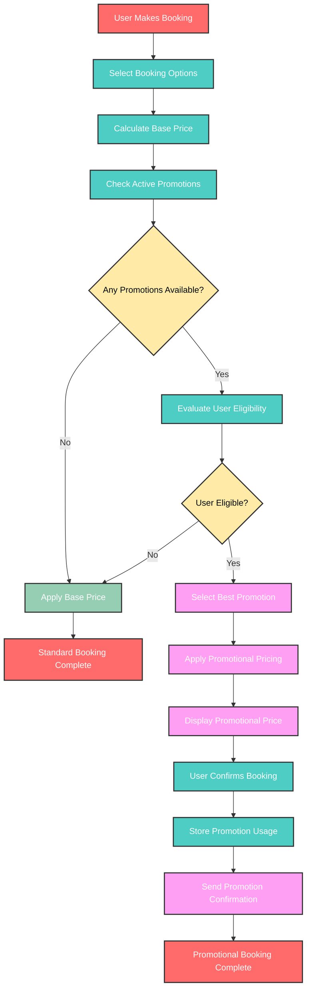

### 4.7 Activity Diagram Manual Payment

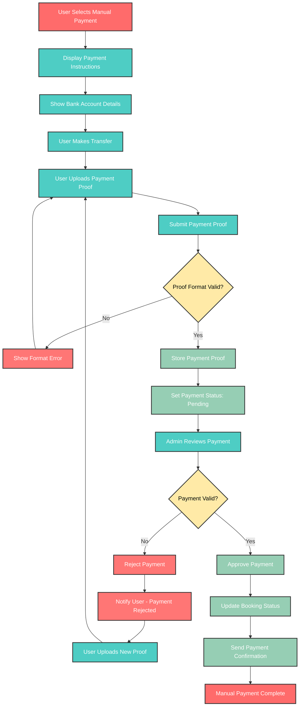

### 4.8 Activity Diagram Dynamic Member Quota

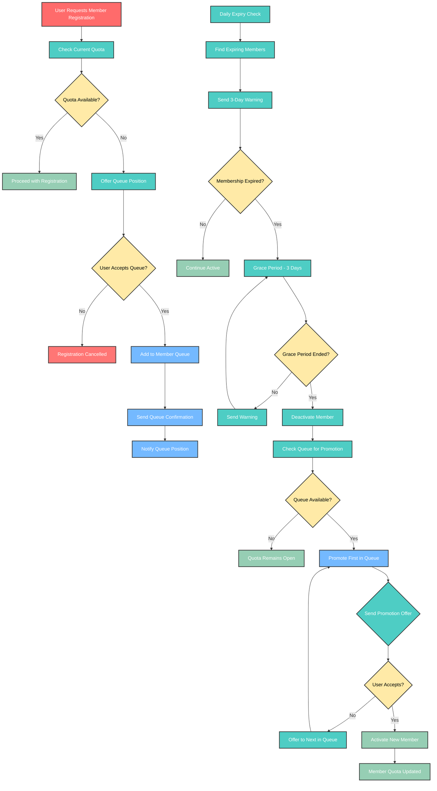

### 4.9 Activity Diagram Member Daily Swimming Limit

```mermaid
graph TD
    A[Member Requests Booking] --> B[Check Daily Usage]
    B --> C{Used Free Session Today?}
    C -->|No| D[Allow Free Session]
    D --> E[Create Free Booking]
    E --> F[Update Daily Usage]
    F --> G[Free Session Booked]
    C -->|Yes| H[Require Additional Payment]
    H --> I[Calculate Additional Price]
    I --> J[Display Payment Required]
    J --> K{Member Completes Payment?}
    K -->|No| L[Booking Cancelled]
    K -->|Yes| M[Process Additional Payment]
    M --> N[Create Paid Booking]
    N --> O[Update Daily Usage]
    O --> P[Additional Session Booked]

    %% Daily Reset Process
    Q[Midnight Reset] --> R[Reset All Member Counters]
    R --> S[Archive Daily Usage]
    S --> T[Daily Reset Complete]

    %% Admin Override
    U[Admin Override Request] --> V[Validate Override]
    V --> W{Override Valid?}
    W -->|No| X[Override Denied]
    W -->|Yes| Y[Apply Override]
    Y --> Z[Update Member Usage]
    Z --> AA[Send Override Notification]
    AA --> BB[Override Complete]

    %% Custom styling
    classDef start-end fill:#ff6b6b,stroke:#333,stroke-width:2px,color:#fff
    classDef process fill:#4ecdc4,stroke:#333,stroke-width:2px,color:#fff
    classDef decision fill:#ffeaa7,stroke:#333,stroke-width:2px,color:#000
    classDef success fill:#96ceb4,stroke:#333,stroke-width:2px,color:#fff
    classDef failure fill:#ff7675,stroke:#333,stroke-width:2px,color:#fff
    classDef paid fill:#fd79a8,stroke:#333,stroke-width:2px,color:#fff

    A:::start-end
    B:::process
    C:::decision
    D:::success
    E:::success
    F:::success
    G:::start-end
    H:::process
    I:::process
    J:::process
    K:::decision
    L:::failure
    M:::paid
    N:::paid
    O:::paid
    P:::start-end
    Q:::process
    R:::process
    S:::process
    T:::start-end
    U:::process
    V:::process
    W:::decision
    X:::failure
    Y:::success
    Z:::success
    AA:::success
    BB:::start-end
```

### 4.10 Activity Diagram Private Pool Rental

```mermaid
graph TD
    A[Customer Requests Private Pool] --> B[Check Pool Availability]
    B --> C[Select Date and Time]
    C --> D[Enter Customer Details]
    D --> E[Check Customer History]
    E --> F{Customer Type?}
    F -->|New Customer| G[Calculate Base Price + 30min Bonus]
    F -->|Returning Customer| H[Calculate Base Price + Additional Charge]
    G --> I[Display Price: Base Price (2 hours total)]
    H --> J[Display Price: Base Price + Additional Charge]
    I --> K[Customer Confirms Booking]
    J --> K
    K --> L[Process Payment]
    L --> M{Payment Success?}
    M -->|No| N[Booking Failed]
    M -->|Yes| O[Create Private Booking]
    O --> P[Start Timer Management]
    P --> Q[Update Customer History]
    Q --> R[Send Booking Confirmation]
    R --> S[Private Pool Booking Complete]
    N --> T[Booking Failed]

    %% Timer Management
    U[Timer Start] --> V[Monitor Duration]
    V --> W{Time Remaining?}
    W -->|Yes| X[Send Time Warning]
    X --> V
    W -->|No| Y[Send Session Complete]
    Y --> Z[Timer Complete]

    %% Custom styling
    classDef start-end fill:#ff6b6b,stroke:#333,stroke-width:2px,color:#fff
    classDef process fill:#4ecdc4,stroke:#333,stroke-width:2px,color:#fff
    classDef decision fill:#ffeaa7,stroke:#333,stroke-width:2px,color:#000
    classDef success fill:#96ceb4,stroke:#333,stroke-width:2px,color:#fff
    classDef failure fill:#ff7675,stroke:#333,stroke-width:2px,color:#fff
    classDef new-customer fill:#00cec9,stroke:#333,stroke-width:2px,color:#fff
    classDef returning-customer fill:#fd79a8,stroke:#333,stroke-width:2px,color:#fff

    A:::start-end
    B:::process
    C:::process
    D:::process
    E:::process
    F:::decision
    G:::new-customer
    H:::returning-customer
    I:::new-customer
    J:::returning-customer
    K:::process
    L:::process
    M:::decision
    N:::failure
    O:::success
    P:::success
    Q:::success
    R:::success
    S:::start-end
    T:::start-end
    U:::process
    V:::process
    W:::decision
    X:::process
    Y:::process
    Z:::start-end
```

### 4.11 Activity Diagram Cafe System with Barcode

```mermaid
graph TD
    A[Customer at Pool Area] --> B[Scan Barcode/QR Code]
    B --> C[Redirect to Menu System]
    C --> D[Display Available Menu]
    D --> E[Browse Menu Items]
    E --> F[Check Item Availability]
    F --> G{Item Available?}
    G -->|No| H[Show Unavailable Status]
    G -->|Yes| I[Add Item to Cart]
    H --> E
    I --> J[Set Quantity]
    J --> K[Add Special Notes]
    K --> L[Continue Shopping]
    L --> E
    L --> M[Review Cart]
    M --> N[Cart Summary with Total]
    N --> O[Proceed to Payment]
    O --> P[Create Payment Request]
    P --> Q[Show Payment Instructions]
    Q --> R[Upload Payment Proof]
    R --> S[Submit Order]
    S --> T[Create Kitchen Order]
    T --> U[Send Order Notification]
    U --> V[Order Confirmation]

    %% Admin Payment Verification
    W[Admin Reviews Payment] --> X{Payment Valid?}
    X -->|No| Y[Reject Payment]
    Y --> Z[Notify Customer - Rejected]
    Z --> AA[Customer Uploads New Proof]
    AA --> S
    X -->|Yes| BB[Confirm Payment]
    BB --> CC[Notify Kitchen]
    CC --> DD[Start Food Preparation]

    %% Kitchen Process
    DD --> EE[Prepare Food Items]
    EE --> FF[Update Status: Preparing]
    FF --> GG[Food Ready]
    GG --> HH[Update Status: Ready]
    HH --> II[Assign Delivery]
    II --> JJ[Deliver to Customer]
    JJ --> KK[Customer Confirms Reception]
    KK --> LL[Update Status: Delivered]
    LL --> MM[Cafe Order Complete]

    %% Custom styling
    classDef start-end fill:#ff6b6b,stroke:#333,stroke-width:2px,color:#fff
    classDef process fill:#4ecdc4,stroke:#333,stroke-width:2px,color:#fff
    classDef decision fill:#ffeaa7,stroke:#333,stroke-width:2px,color:#000
    classDef success fill:#96ceb4,stroke:#333,stroke-width:2px,color:#fff
    classDef failure fill:#ff7675,stroke:#333,stroke-width:2px,color:#fff
    classDef kitchen fill:#a8e6cf,stroke:#333,stroke-width:2px,color:#fff
    classDef delivery fill:#ffd3b6,stroke:#333,stroke-width:2px,color:#fff

    A:::start-end
    B:::process
    C:::process
    D:::process
    E:::process
    F:::process
    G:::decision
    H:::failure
    I:::success
    J:::success
    K:::success
    L:::success
    M:::success
    N:::success
    O:::success
    P:::success
    Q:::success
    R:::success
    S:::success
    T:::kitchen
    U:::success
    V:::success
    W:::process
    X:::decision
    Y:::failure
    Z:::failure
    AA:::process
    BB:::success
    CC:::kitchen
    DD:::kitchen
    EE:::kitchen
    FF:::kitchen
    GG:::kitchen
    HH:::kitchen
    II:::delivery
    JJ:::delivery
    KK:::delivery
    LL:::delivery
    MM:::start-end
```

### 4.12 Activity Diagram Dynamic Menu Management

```mermaid
graph TD
    A[Admin Access Menu Management] --> B[Choose Action]
    B --> C{Action Type?}
    C -->|Create Menu| D[Open Menu Creation Form]
    C -->|Edit Menu| E[Select Existing Menu]
    C -->|Manage Stock| F[Access Stock Management]
    C -->|View Analytics| G[Open Analytics Dashboard]

    %% Menu Creation Flow
    D --> H[Fill Menu Details]
    H --> I[Upload Menu Image]
    I --> J[Set Base Cost]
    J --> K[Set Selling Price]
    K --> L[Calculate Margin]
    L --> M[Configure Stock Settings]
    M --> N[Set Menu Categories]
    N --> O[Add Cooking Instructions]
    O --> P[Set Allergen Info]
    P --> Q[Save Menu]
    Q --> R[Generate Menu Barcode]
    R --> S[Create Inventory Record]
    S --> T[Menu Created Successfully]

    %% Menu Edit Flow
    E --> U[Load Menu Details]
    U --> V[Update Menu Information]
    V --> W[Update Pricing]
    W --> X[Update Stock Settings]
    X --> Y[Save Changes]
    Y --> Z[Menu Updated Successfully]

    %% Stock Management Flow
    F --> AA[View Current Stock]
    AA --> BB[Check Low Stock Alerts]
    BB --> CC{Stock Actions?}
    CC -->|Update Stock| DD[Record Stock Transaction]
    CC -->|Set Alerts| EE[Configure Stock Alerts]
    CC -->|View History| FF[Display Stock History]
    DD --> GG[Update Inventory]
    GG --> HH[Stock Updated Successfully]
    EE --> II[Alerts Configured]
    FF --> JJ[History Displayed]

    %% Analytics Flow
    G --> KK[Load Menu Performance Data]
    KK --> LL[Display Sales Analytics]
    LL --> MM[Show Margin Analysis]
    MM --> NN[Display Top Performers]
    NN --> OO[Show Low Stock Items]
    OO --> PP[Analytics Dashboard Complete]

    %% Custom styling
    classDef start-end fill:#ff6b6b,stroke:#333,stroke-width:2px,color:#fff
    classDef process fill:#4ecdc4,stroke:#333,stroke-width:2px,color:#fff
    classDef decision fill:#ffeaa7,stroke:#333,stroke-width:2px,color:#000
    classDef success fill:#96ceb4,stroke:#333,stroke-width:2px,color:#fff
    classDef failure fill:#ff7675,stroke:#333,stroke-width:2px,color:#fff
    classDef barcode fill:#74b9ff,stroke:#333,stroke-width:2px,color:#fff
    classDef stock fill:#fd79a8,stroke:#333,stroke-width:2px,color:#fff
    classDef analytics fill:#00cec9,stroke:#333,stroke-width:2px,color:#fff

    A:::start-end
    B:::process
    C:::decision
    D:::success
    E:::success
    F:::stock
    G:::analytics
    H:::process
    I:::process
    J:::process
    K:::process
    L:::process
    M:::process
    N:::process
    O:::process
    P:::process
    Q:::success
    R:::barcode
    S:::success
    T:::start-end
    U:::process
    V:::process
    W:::process
    X:::process
    Y:::success
    Z:::start-end
    AA:::stock
    BB:::stock
    CC:::decision
    DD:::stock
    EE:::stock
    FF:::stock
    GG:::success
    HH:::start-end
    II:::start-end
    JJ:::start-end
    KK:::analytics
    LL:::analytics
    MM:::analytics
    NN:::analytics
    OO:::analytics
    PP:::start-end
```

### 4.13 Activity Diagram Barcode Generation & Download

```mermaid
graph TD
    A[Menu Creation/Update] --> B[Trigger Barcode Generation]
    B --> C[Generate Unique Barcode Value]
    C --> D[Generate QR Code]
    D --> E[Generate Barcode Image]
    E --> F[Store Barcode Data]
    F --> G[Barcode Generated Successfully]

    %% Barcode Download Flow
    H[Admin Requests Barcode Download] --> I{Download Type?}
    I -->|Single Menu| J[Select Menu]
    I -->|Bulk Export| K[Select Category/Filter]

    J --> L[Generate Barcode File]
    K --> M[Generate Bulk Barcode File]
    L --> N[Create Download Package]
    M --> N
    N --> O[Include Menu Details]
    O --> P[Format as PDF/PNG]
    P --> Q[Provide Download Link]
    Q --> R[Barcode Downloaded Successfully]

    %% Barcode Management
    S[Admin Manages Barcodes] --> T{Management Action?}
    T -->|Activate| U[Set Barcode Active]
    T -->|Deactivate| V[Set Barcode Inactive]
    T -->|Regenerate| W[Generate New Barcode]
    T -->|Preview| X[Show Barcode Preview]

    U --> Y[Barcode Activated]
    V --> Z[Barcode Deactivated]
    W --> B
    X --> AA[Display Preview]

    %% Custom styling
    classDef start-end fill:#ff6b6b,stroke:#333,stroke-width:2px,color:#fff
    classDef process fill:#4ecdc4,stroke:#333,stroke-width:2px,color:#fff
    classDef decision fill:#ffeaa7,stroke:#333,stroke-width:2px,color:#000
    classDef success fill:#96ceb4,stroke:#333,stroke-width:2px,color:#fff
    classDef barcode fill:#74b9ff,stroke:#333,stroke-width:2px,color:#fff
    classDef download fill:#fd79a8,stroke:#333,stroke-width:2px,color:#fff

    A:::start-end
    B:::barcode
    C:::barcode
    D:::barcode
    E:::barcode
    F:::barcode
    G:::start-end
    H:::process
    I:::decision
    J:::download
    K:::download
    L:::download
    M:::download
    N:::download
    O:::download
    P:::download
    Q:::download
    R:::start-end
    S:::process
    T:::decision
    U:::barcode
    V:::barcode
    W:::barcode
    X:::download
    Y:::success
    Z:::success
    AA:::start-end
```

### 4.14 Activity Diagram Comprehensive Reporting

```mermaid
graph TD
    A[Admin Access Reporting System] --> B[Select Report Type]
    B --> C{Report Category?}
    C -->|Financial| D[Financial Reports Dashboard]
    C -->|Operational| E[Operational Reports Dashboard]
    C -->|Customer| F[Customer Analytics Dashboard]
    C -->|Inventory| G[Inventory Reports Dashboard]
    C -->|Promotional| H[Promotional Reports Dashboard]

    %% Financial Reports Flow
    D --> I[Select Financial Report]
    I --> J{Report Type?}
    J -->|Revenue| K[Generate Revenue Report]
    J -->|Expense| L[Generate Expense Report]
    J -->|Profit Loss| M[Generate P&L Statement]
    J -->|Cash Flow| N[Generate Cash Flow Report]
    J -->|Tax| O[Generate Tax Report]
    J -->|Budget| P[Generate Budget Analysis]

    K --> Q[Apply Date Filters]
    L --> Q
    M --> Q
    N --> Q
    O --> Q
    P --> Q
    Q --> R[Generate Report Data]
    R --> S[Apply Formatting]
    S --> T[Display Report]
    T --> U{Export Required?}
    U -->|Yes| V[Export to PDF/Excel/CSV]
    U -->|No| W[View Online]
    V --> X[Report Exported Successfully]
    W --> Y[Report Viewed Online]

    %% Operational Reports Flow
    E --> Z[Select Operational Report]
    Z --> AA{Report Type?}
    AA -->|Booking| BB[Generate Booking Analytics]
    AA -->|Member| CC[Generate Member Reports]
    AA -->|Session| DD[Generate Session Reports]
    AA -->|Staff| EE[Generate Staff Reports]
    AA -->|Facility| FF[Generate Facility Reports]

    BB --> GG[Apply Filters]
    CC --> GG
    DD --> GG
    EE --> GG
    FF --> GG
    GG --> HH[Generate Report Data]
    HH --> II[Display Operational Report]
    II --> JJ[Operational Report Complete]

    %% Customer Analytics Flow
    F --> KK[Select Customer Analytics]
    KK --> LL{Analytics Type?}
    LL -->|Behavior| MM[Generate Behavior Analysis]
    LL -->|Retention| NN[Generate Retention Report]
    LL -->|Satisfaction| OO[Generate Satisfaction Report]
    LL -->|Demographics| PP[Generate Demographics Report]
    LL -->|Peak Hours| QQ[Generate Peak Hours Analysis]

    MM --> RR[Apply Customer Filters]
    NN --> RR
    OO --> RR
    PP --> RR
    QQ --> RR
    RR --> SS[Generate Analytics Data]
    SS --> TT[Display Customer Analytics]
    TT --> UU[Customer Analytics Complete]

    %% Custom styling
    classDef start-end fill:#ff6b6b,stroke:#333,stroke-width:2px,color:#fff
    classDef process fill:#4ecdc4,stroke:#333,stroke-width:2px,color:#fff
    classDef decision fill:#ffeaa7,stroke:#333,stroke-width:2px,color:#000
    classDef success fill:#96ceb4,stroke:#333,stroke-width:2px,color:#fff
    classDef financial fill:#74b9ff,stroke:#333,stroke-width:2px,color:#fff
    classDef operational fill:#fd79a8,stroke:#333,stroke-width:2px,color:#fff
    classDef customer fill:#00cec9,stroke:#333,stroke-width:2px,color:#fff
    classDef export fill:#a8e6cf,stroke:#333,stroke-width:2px,color:#fff

    A:::start-end
    B:::process
    C:::decision
    D:::financial
    E:::operational
    F:::customer
    G:::process
    H:::process
    I:::financial
    J:::decision
    K:::financial
    L:::financial
    M:::financial
    N:::financial
    O:::financial
    P:::financial
    Q:::process
    R:::process
    S:::process
    T:::financial
    U:::decision
    V:::export
    W:::financial
    X:::start-end
    Y:::start-end
    Z:::operational
    AA:::decision
    BB:::operational
    CC:::operational
    DD:::operational
    EE:::operational
    FF:::operational
    GG:::process
    HH:::process
    II:::operational
    JJ:::start-end
    KK:::customer
    LL:::decision
    MM:::customer
    NN:::customer
    OO:::customer
    PP:::customer
    QQ:::customer
    RR:::process
    SS:::process
    TT:::customer
    UU:::start-end
```

## 5. State Diagram

### 5.1 State Diagram Booking Status

```mermaid
stateDiagram-v2
    [*] --> Pending
    Pending --> Confirmed : Payment Success
    Pending --> Cancelled : Customer Cancels
    Pending --> Failed : Payment Failed
    Confirmed --> CheckedIn : Customer Arrives
    Confirmed --> Cancelled : Customer Cancels
    Confirmed --> NoShow : Customer Doesn't Show
    CheckedIn --> Completed : Session Ends
    CheckedIn --> Cancelled : Emergency Cancellation
    Failed --> [*]
    Cancelled --> [*]
    NoShow --> [*]
    Completed --> [*]
```

### 5.2 State Diagram Cafe Order

```mermaid
stateDiagram-v2
    [*] --> Pending
    Pending --> Preparing : Payment Confirmed
    Pending --> Cancelled : Customer Cancels
    Pending --> Failed : Payment Failed
    Preparing --> Ready : Food Prepared
    Preparing --> Cancelled : Kitchen Cancels
    Ready --> Delivered : Customer Picks Up
    Ready --> Cancelled : Customer Doesn't Pick
    Failed --> [*]
    Cancelled --> [*]
    Delivered --> [*]
```

### 5.3 State Diagram Member Status

```mermaid
stateDiagram-v2
    [*] --> Active
    Active --> Expired : Membership Ends
    Active --> Suspended : Violation
    Active --> Cancelled : Member Cancels
    Expired --> Active : Renewal
    Expired --> Cancelled : No Renewal
    Suspended --> Active : Violation Resolved
    Suspended --> Cancelled : Member Cancels
    Cancelled --> [*]
```

## 6. Component Diagram

### 6.1 Component Diagram System Architecture

```mermaid
graph TB
    subgraph "Frontend Layer"
        A1[Web Application]
        A2[Mobile Application]
        A3[Admin Dashboard]
    end

    subgraph "API Gateway"
        B1[API Gateway]
    end

    subgraph "Service Layer"
        C1[Member Service]
        C2[Booking Service]
        C3[Payment Service]
        C4[Cafe Service]
        C5[Notification Service]
        C6[Reporting Service]
    end

    subgraph "Data Layer"
        D1[Member Database]
        D2[Booking Database]
        D3[Payment Database]
        D4[Cafe Database]
    end

    subgraph "External Services"
        E1[Payment Gateway]
        E2[Email Service]
        E3[SMS Service]
        E4[File Storage]
    end

    A1 --> B1
    A2 --> B1
    A3 --> B1

    B1 --> C1
    B1 --> C2
    B1 --> C3
    B1 --> C4
    B1 --> C5
    B1 --> C6

    C1 --> D1
    C2 --> D2
    C3 --> D3
    C4 --> D4
    C5 --> E2
    C5 --> E3
    C3 --> E1
    C1 --> E4
    C4 --> E4
```

---

**Versi**: 1.3  
**Tanggal**: 26 Agustus 2025  
**Status**: Complete dengan Dynamic Pricing, Guest Booking, Google SSO, Mobile-First Web App, Core Booking Flow, Manual Payment, Dynamic Member Quota & Member Daily Swimming Limit  
**Berdasarkan**: PDF Raujan Pool Syariah

### 2.10 Manual Payment System Sequence Diagram

```mermaid
sequenceDiagram
    participant U as User
    participant W as Web App
    participant A as API Gateway
    participant P as Payment Service
    participant B as Bank Config
    participant D as Database
    participant N as Notification Service

    Note over U: User selects manual payment
    Note over W: React/Next.js Frontend
    Note over A: Laravel API Gateway
    Note over P: Manual Payment Service
    Note over B: Bank Account Configuration
    Note over D: MySQL Database
    Note over N: FCM Push Service

    U->>W: Select manual payment method
    W->>A: Request payment instructions
    A->>P: Get payment instructions
    P->>B: Get bank account details
    B-->>P: Bank account information
    P-->>A: Payment instructions
    A-->>W: Display payment instructions
    W-->>U: Show bank account details

    U->>W: Upload payment proof
    W->>A: Submit payment proof
    A->>P: Process payment proof upload
    P->>D: Store payment proof
    P->>D: Set payment status: pending
    P-->>A: Payment proof stored
    A-->>W: Payment proof uploaded
    W-->>U: Payment proof confirmation

    Note over A: Admin Payment Verification
    Note over A: Admin reviews payment proof
    A->>P: Request payment verification
    P->>D: Get payment proof data
    D-->>P: Payment proof details
    P->>P: Validate payment proof
    P-->>A: Payment verification result

    alt Payment Valid
        A->>P: Approve payment
        P->>D: Update payment status: approved
        A->>N: Send payment confirmation
        N-->>U: Payment approved notification
        A->>D: Update booking status
        A-->>W: Payment approved
        W-->>U: Booking confirmed
    else Payment Invalid
        A->>P: Reject payment
        P->>D: Update payment status: rejected
        A->>N: Send payment rejection
        N-->>U: Payment rejected notification
        A-->>W: Payment rejected
        W-->>U: Re-upload payment proof
    end

    Note over P: Payment History Tracking
    Note over P: Track all payment attempts
    P->>D: Log payment verification
    P->>D: Store verification details
    P->>P: Generate payment report
```

### 2.11 Dynamic Menu Management Sequence Diagram

```mermaid
sequenceDiagram
    participant A as Admin
    participant W as Web App
    participant M as Menu Service
    participant I as Inventory Service
    participant B as Barcode Service
    participant D as Database
    participant N as Notification Service

    Note over A: Admin manages menu
    Note over W: React/Next.js Admin Interface
    Note over M: Menu Management Service
    Note over I: Inventory Management Service
    Note over B: Barcode Generation Service
    Note over D: MySQL Database
    Note over N: FCM Push Service

    A->>W: Access menu management
    W->>M: Get menu list
    M->>D: Fetch menu data
    D-->>M: Menu information
    M-->>W: Menu list
    W-->>A: Display menu management

    A->>W: Create new menu
    W->>M: Submit menu details
    M->>D: Validate menu data
    D-->>M: Validation result
    M->>M: Calculate margin
    M->>D: Store menu data
    M->>I: Initialize inventory record
    I->>D: Create inventory entry
    M->>B: Generate barcode
    B->>D: Store barcode data
    M-->>W: Menu created successfully
    W-->>A: Menu creation complete

    Note over A: Menu Update Process
    A->>W: Edit existing menu
    W->>M: Get menu details
    M->>D: Fetch menu information
    D-->>M: Menu details
    M-->>W: Menu data for editing
    W-->>A: Show edit form

    A->>W: Update menu information
    W->>M: Submit updated data
    M->>D: Update menu record
    M->>M: Recalculate margin
    M->>I: Update inventory settings
    I->>D: Update inventory data
    M-->>W: Menu updated successfully
    W-->>A: Menu update complete

    Note over A: Stock Management
    A->>W: Access stock management
    W->>I: Get current stock levels
    I->>D: Fetch inventory data
    D-->>I: Stock information
    I-->>W: Stock levels
    W-->>A: Display stock management

    A->>W: Update stock levels
    W->>I: Submit stock changes
    I->>D: Update inventory records
    I->>D: Log stock transaction
    I->>M: Update menu availability
    M->>D: Update menu status
    I->>N: Send stock alerts
    N-->>A: Stock update notification
    I-->>W: Stock updated successfully
    W-->>A: Stock management complete

    Note over A: Menu Analytics
    A->>W: Access menu analytics
    W->>M: Get menu performance data
    M->>D: Fetch analytics data
    D-->>M: Analytics information
    M-->>W: Menu analytics
    W-->>A: Display analytics dashboard
```

### 2.12 Barcode Generation & Download Sequence Diagram

```mermaid
sequenceDiagram
    participant A as Admin
    participant W as Web App
    participant M as Menu Service
    participant B as Barcode Service
    participant G as QR Code Service
    participant F as File Service
    participant D as Database

    Note over A: Admin manages barcodes
    Note over W: React/Next.js Admin Interface
    Note over M: Menu Management Service
    Note over B: Barcode Generation Service
    Note over G: QR Code Generation Service
    Note over F: File Storage Service
    Note over D: MySQL Database

    Note over M,B: Auto-Generation Process
    M->>D: Menu created/updated
    D-->>M: Menu data
    M->>B: Trigger barcode generation
    B->>B: Generate unique barcode value
    B->>G: Generate QR code
    G-->>B: QR code data
    B->>F: Store barcode image
    F-->>B: Barcode image URL
    B->>D: Store barcode information
    B-->>M: Barcode generated successfully

    Note over A: Single Barcode Download
    A->>W: Request barcode download
    W->>M: Get menu barcode info
    M->>D: Fetch barcode data
    D-->>M: Barcode information
    M-->>W: Barcode details
    W-->>A: Display barcode preview

    A->>W: Download barcode
    W->>B: Generate download package
    B->>F: Create barcode file
    F-->>B: File created
    B->>B: Package barcode data
    B-->>W: Download link
    W-->>A: Provide download

    Note over A: Bulk Barcode Export
    A->>W: Request bulk export
    W->>M: Get bulk barcode data
    M->>D: Fetch all barcode data
    D-->>M: All barcode information
    M-->>W: Bulk barcode data
    W-->>A: Bulk export options

    A->>W: Select export format
    W->>B: Generate bulk export
    B->>F: Create bulk file
    F-->>B: Bulk file created
    B->>B: Package all barcodes
    B-->>W: Bulk download link
    W-->>A: Provide bulk download

    Note over A: Barcode Management
    A->>W: Manage barcode status
    W->>B: Update barcode status
    B->>D: Update barcode record
    B-->>W: Status updated
    W-->>A: Barcode management complete

    A->>W: Regenerate barcode
    W->>B: Generate new barcode
    B->>B: Create new barcode value
    B->>G: Generate new QR code
    G-->>B: New QR code
    B->>F: Store new barcode image
    F-->>B: New image URL
    B->>D: Update barcode data
    B-->>W: Barcode regenerated
    W-->>A: New barcode ready
```

### 2.13 Comprehensive Reporting System Sequence Diagram

```mermaid
sequenceDiagram
    participant A as Admin
    participant W as Web App
    participant R as Reporting Service
    participant F as Financial Service
    participant O as Operational Service
    participant C as Customer Analytics Service
    participant E as Export Service
    participant D as Database
    participant N as Notification Service

    Note over A: Admin accesses reporting system
    Note over W: React/Next.js Reporting Interface
    Note over R: Reporting Service
    Note over F: Financial Analytics Service
    Note over O: Operational Analytics Service
    Note over C: Customer Analytics Service
    Note over E: Export Service
    Note over D: MySQL Database
    Note over N: Email/Notification Service

    A->>W: Access reporting dashboard
    W->>R: Get dashboard overview
    R->>D: Fetch summary data
    D-->>R: Summary information
    R-->>W: Dashboard data
    W-->>A: Display reporting dashboard

    Note over A: Financial Reports
    A->>W: Request financial report
    W->>F: Get financial data
    F->>D: Query financial records
    D-->>F: Financial data
    F->>F: Process financial analytics
    F->>F: Calculate revenue metrics
    F->>F: Generate expense analysis
    F->>F: Create profit/loss statement
    F-->>W: Financial report data
    W-->>A: Display financial report

    A->>W: Export financial report
    W->>E: Generate export file
    E->>F: Get report data
    F-->>E: Financial report data
    E->>E: Format as PDF/Excel/CSV
    E-->>W: Export file ready
    W-->>A: Provide export download

    Note over A: Operational Reports
    A->>W: Request operational report
    W->>O: Get operational data
    O->>D: Query operational records
    D-->>O: Operational data
    O->>O: Process booking analytics
    O->>O: Generate member reports
    O->>O: Create session utilization
    O->>O: Analyze staff performance
    O-->>W: Operational report data
    W-->>A: Display operational report

    Note over A: Customer Analytics
    A->>W: Request customer analytics
    W->>C: Get customer data
    C->>D: Query customer records
    D-->>C: Customer data
    C->>C: Analyze customer behavior
    C->>C: Process retention metrics
    C->>C: Generate satisfaction reports
    C->>C: Create demographics analysis
    C->>C: Analyze peak hours
    C-->>W: Customer analytics data
    W-->>A: Display customer analytics

    Note over A: Scheduled Reports
    A->>W: Configure scheduled reports
    W->>R: Set report schedule
    R->>D: Store schedule configuration
    R->>N: Set up automated delivery
    N-->>A: Schedule confirmation

    Note over R: Automated Report Generation
    Note over R: Daily/Weekly/Monthly reports
    R->>F: Generate scheduled financial report
    R->>O: Generate scheduled operational report
    R->>C: Generate scheduled customer report
    R->>E: Create scheduled export
    R->>N: Send scheduled reports via email
    N-->>A: Scheduled reports delivered

    Note over A: Real-time Dashboards
    A->>W: Access real-time dashboard
    W->>R: Get live data
    R->>D: Query real-time metrics
    D-->>R: Live data
    R->>R: Process real-time analytics
    R-->>W: Real-time dashboard data
    W-->>A: Display live dashboard

    Note over A: Custom Reports
    A->>W: Create custom report
    W->>R: Configure custom parameters
    R->>D: Query custom data
    D-->>R: Custom data
    R->>R: Process custom analytics
    R->>E: Generate custom export
    E-->>W: Custom report ready
    W-->>A: Display custom report
```
