# User Interface Design - Sistem Kolam Renang Syariah

## 1. Design System

### 1.1 Color Palette

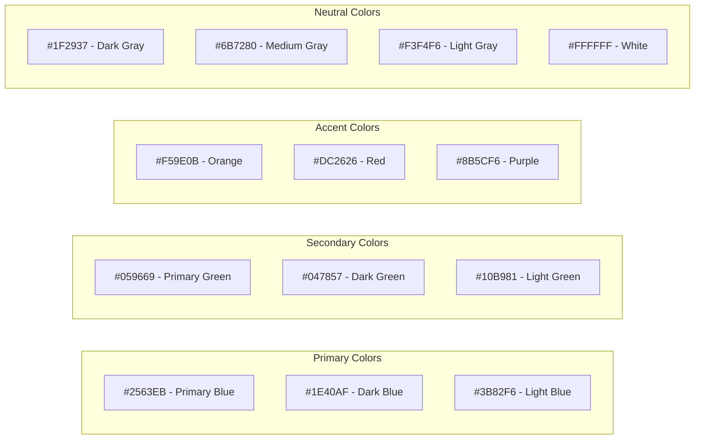

### 1.2 Typography

```css
/* Primary Font - Inter */
font-family: 'Inter', sans-serif;

/* Heading Sizes */
h1: 32px, font-weight: 700
h2: 28px, font-weight: 600
h3: 24px, font-weight: 600
h4: 20px, font-weight: 500
h5: 18px, font-weight: 500
h6: 16px, font-weight: 500

/* Body Text */
body: 16px, font-weight: 400
small: 14px, font-weight: 400
caption: 12px, font-weight: 400
```

### 1.3 Component Library

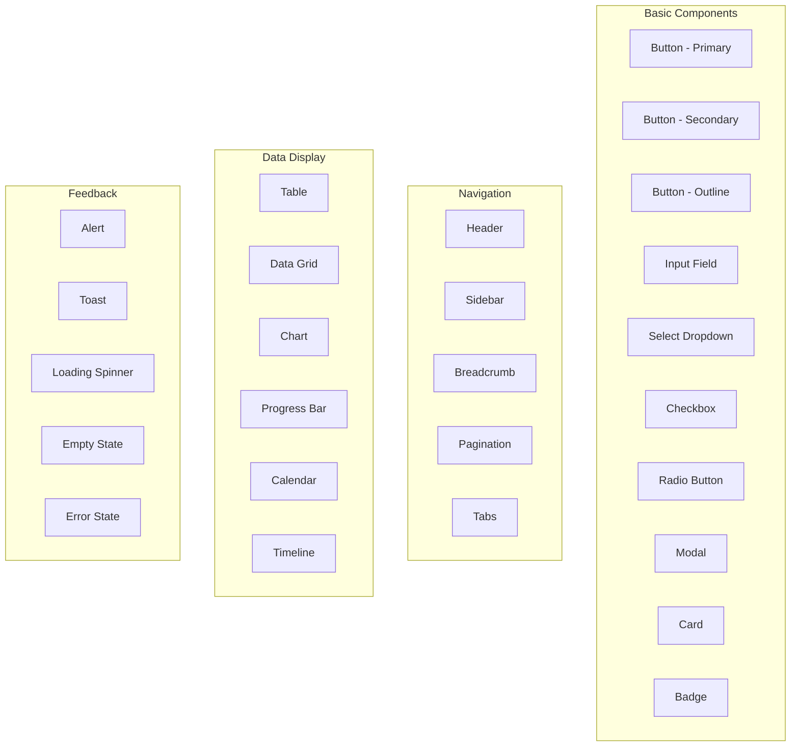

## 2. Calendar Interface Design

### 2.1 Main Calendar Component

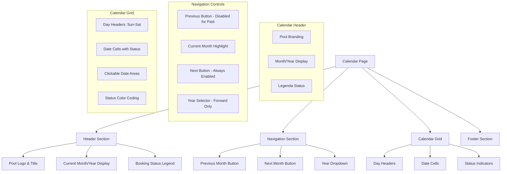

### 2.2 Mobile-First Calendar Design

```json
{
  "calendar_layout": {
    "mobile_breakpoint": "320px - 767px",
    "tablet_breakpoint": "768px - 1023px",
    "desktop_breakpoint": "1024px+",
    "responsive_features": {
      "mobile": {
        "grid_layout": "7 columns, compact spacing",
        "date_cells": "44px x 44px minimum touch target",
        "navigation": "Swipe gestures + button controls",
        "modal_sessions": "Full-screen session selection"
      },
      "tablet": {
        "grid_layout": "7 columns, comfortable spacing",
        "date_cells": "60px x 60px touch targets",
        "navigation": "Button controls + keyboard shortcuts",
        "modal_sessions": "Overlay modal for session selection"
      },
      "desktop": {
        "grid_layout": "7 columns, spacious layout",
        "date_cells": "80px x 80px hover states",
        "navigation": "Button controls + keyboard shortcuts",
        "modal_sessions": "Sidebar or modal for sessions"
      }
    }
  },
  "status_indicators": {
    "available": {
      "color": "#10B981",
      "icon": "circle-check",
      "label": "Available"
    },
    "partial_available": {
      "color": "#F59E0B",
      "icon": "clock",
      "label": "Limited Slots"
    },
    "fully_booked": {
      "color": "#EF4444",
      "icon": "x-circle",
      "label": "Full"
    },
    "closed": {
      "color": "#6B7280",
      "icon": "lock-closed",
      "label": "Closed"
    }
  }
}
```

### 2.3 Session Selection Modal

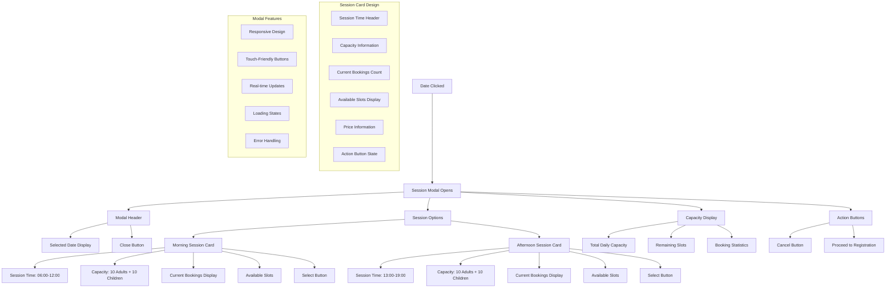

### 2.4 User Registration Form

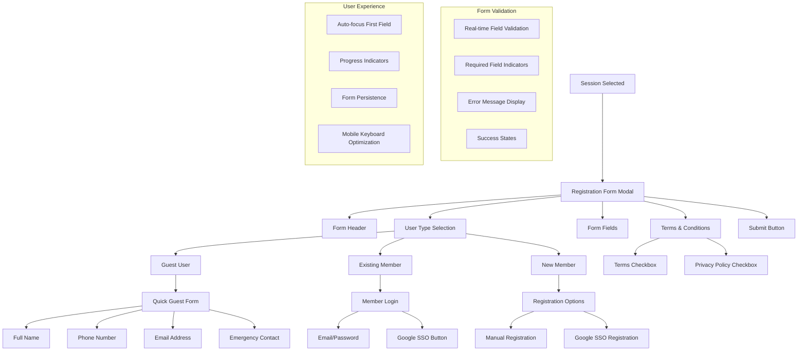

### 2.5 Booking Confirmation Screen

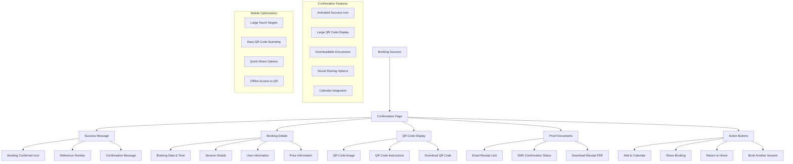

### 2.6 Progressive Web App Features

```json
{
  "pwa_features": {
    "app_manifest": {
      "name": "Raujan Pool Booking",
      "short_name": "Raujan Pool",
      "description": "Book your swimming session at Raujan Pool Syariah",
      "theme_color": "#2563EB",
      "background_color": "#FFFFFF",
      "display": "standalone",
      "orientation": "portrait",
      "icons": [
        {
          "src": "/icons/icon-192x192.png",
          "sizes": "192x192",
          "type": "image/png"
        },
        {
          "src": "/icons/icon-512x512.png",
          "sizes": "512x512",
          "type": "image/png"
        }
      ]
    },
    "service_worker": {
      "caching_strategy": "Cache First for static assets",
      "offline_booking": "Cache booking form for offline use",
      "push_notifications": "Firebase Cloud Messaging integration",
      "background_sync": "Sync offline bookings when online"
    },
    "mobile_features": {
      "touch_gestures": "Swipe navigation for calendar",
      "haptic_feedback": "Vibration on successful booking",
      "fullscreen_mode": "Hide browser UI for app-like experience",
      "install_prompt": "Add to home screen prompt"
    }
  }
}
```

### 2.7 Responsive Design System

```json
{
  "design_system": {
    "color_palette": {
      "primary": {
        "main": "#2563EB",
        "light": "#3B82F6",
        "dark": "#1D4ED8",
        "contrast": "#FFFFFF"
      },
      "success": {
        "main": "#10B981",
        "light": "#34D399",
        "dark": "#059669"
      },
      "warning": {
        "main": "#F59E0B",
        "light": "#FBBF24",
        "dark": "#D97706"
      },
      "error": {
        "main": "#EF4444",
        "light": "#F87171",
        "dark": "#DC2626"
      },
      "neutral": {
        "main": "#6B7280",
        "light": "#9CA3AF",
        "dark": "#374151"
      }
    },
    "typography": {
      "font_family": "'Inter', system-ui, sans-serif",
      "font_sizes": {
        "xs": "0.75rem",
        "sm": "0.875rem",
        "base": "1rem",
        "lg": "1.125rem",
        "xl": "1.25rem",
        "2xl": "1.5rem",
        "3xl": "1.875rem"
      },
      "line_heights": {
        "tight": "1.25",
        "normal": "1.5",
        "relaxed": "1.75"
      }
    },
    "spacing": {
      "xs": "0.25rem",
      "sm": "0.5rem",
      "md": "1rem",
      "lg": "1.5rem",
      "xl": "2rem",
      "2xl": "3rem"
    },
    "border_radius": {
      "sm": "0.25rem",
      "md": "0.375rem",
      "lg": "0.5rem",
      "xl": "0.75rem",
      "full": "9999px"
    }
  }
}
```

### 2.8 Loading States and Animations

```json
{
  "loading_states": {
    "calendar_loading": {
      "skeleton": "Calendar grid skeleton with shimmer",
      "duration": "0.5s",
      "message": "Loading availability..."
    },
    "session_checking": {
      "spinner": "Small loading spinner in session card",
      "duration": "1-2s",
      "message": "Checking availability..."
    },
    "booking_processing": {
      "progress_bar": "Animated progress bar",
      "duration": "3-5s",
      "message": "Processing your booking..."
    }
  },
  "animations": {
    "calendar_transition": {
      "type": "slide",
      "duration": "300ms",
      "easing": "ease-in-out"
    },
    "modal_open": {
      "type": "fade + scale",
      "duration": "250ms",
      "easing": "ease-out"
    },
    "success_feedback": {
      "type": "bounce + fade",
      "duration": "500ms",
      "easing": "cubic-bezier(0.68, -0.55, 0.265, 1.55)"
    }
  }
}
```

### 2.9 Accessibility Features

```json
{
  "accessibility": {
    "keyboard_navigation": {
      "calendar_navigation": "Arrow keys for month navigation",
      "date_selection": "Enter/Space for date selection",
      "modal_interaction": "Tab navigation and Escape to close"
    },
    "screen_reader": {
      "calendar_announcements": "Announce date status changes",
      "session_information": "Read session details and availability",
      "booking_confirmation": "Announce booking success and reference"
    },
    "visual_indicators": {
      "focus_states": "Clear focus indicators for all interactive elements",
      "high_contrast": "High contrast mode support",
      "color_blind_friendly": "Status indicators with both color and shape"
    },
    "mobile_accessibility": {
      "touch_targets": "Minimum 44px touch targets",
      "voice_control": "Voice control compatibility",
      "magnification": "Support for iOS and Android magnification"
    }
  }
}
```

## 3. Web Application Design

### 3.1 Admin Dashboard Layout

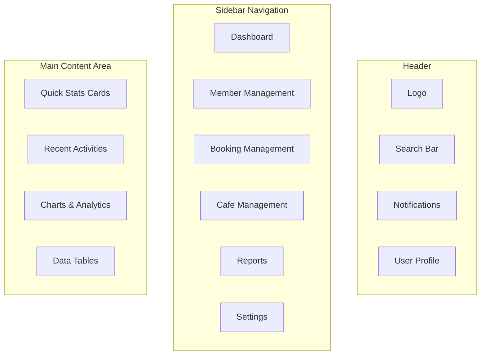

### 3.2 Key Admin Screens

#### 3.2.1 Member Management

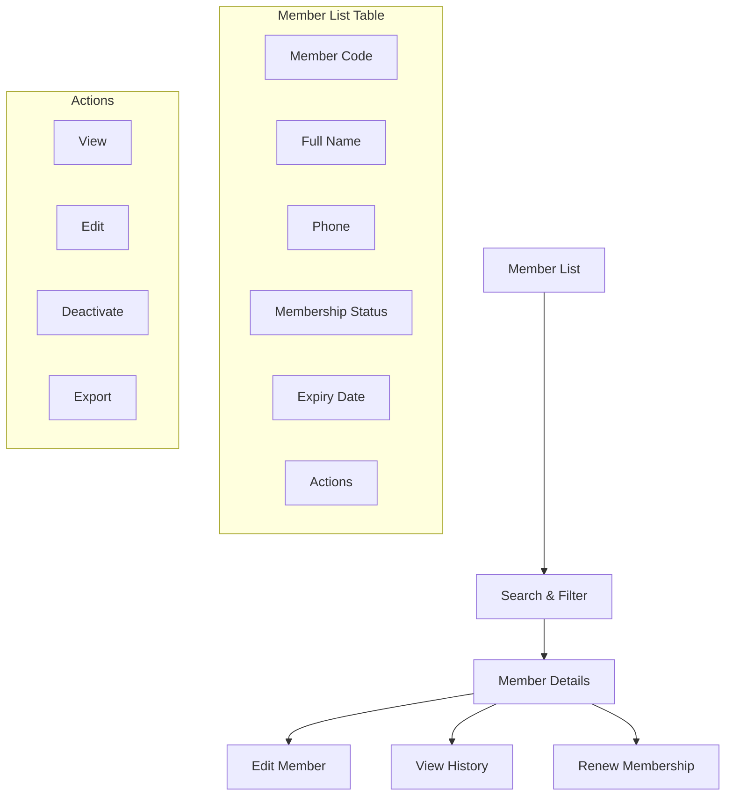

#### 3.2.2 Booking Management

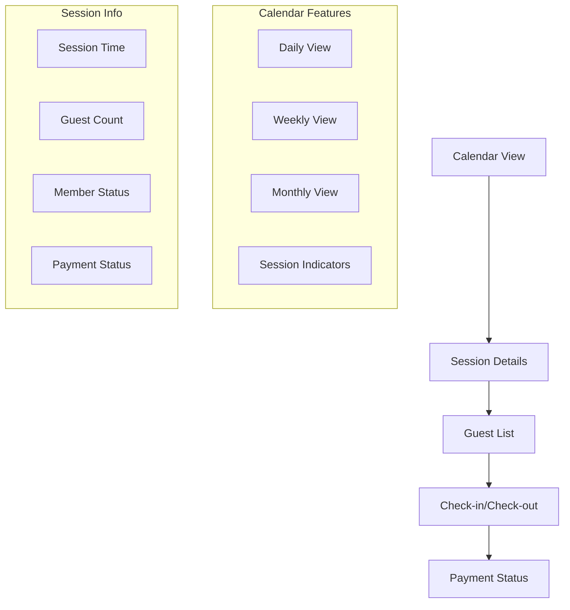

## 4. Responsive Design

### 4.1 Breakpoint Strategy

```css
/* Mobile First Approach */
/* Base: 320px - 767px */
@media (min-width: 768px) {
  /* Tablet: 768px - 1023px */
}
@media (min-width: 1024px) {
  /* Desktop: 1024px+ */
}
@media (min-width: 1440px) {
  /* Large Desktop: 1440px+ */
}
```

### 4.2 Component Responsiveness

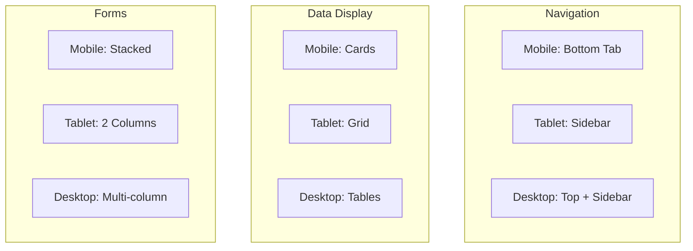

## 5. Accessibility Guidelines

### 5.1 WCAG 2.1 Compliance

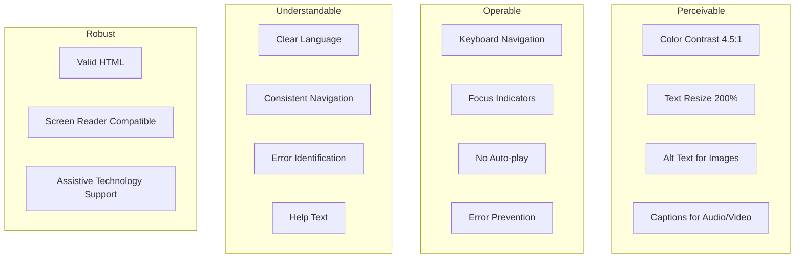

### 5.2 Screen Reader Support

```html
<!-- Semantic HTML Structure -->
<header role="banner">
  <nav role="navigation">
    <main role="main">
      <aside role="complementary">
        <footer role="contentinfo">
          <!-- ARIA Labels -->
          <button aria-label="Book Session">
            <input aria-describedby="email-help" />
            <div role="alert" aria-live="polite"></div>
          </button>
        </footer>
      </aside>
    </main>
  </nav>
</header>
```

## 6. Interactive Elements

### 6.1 Button States

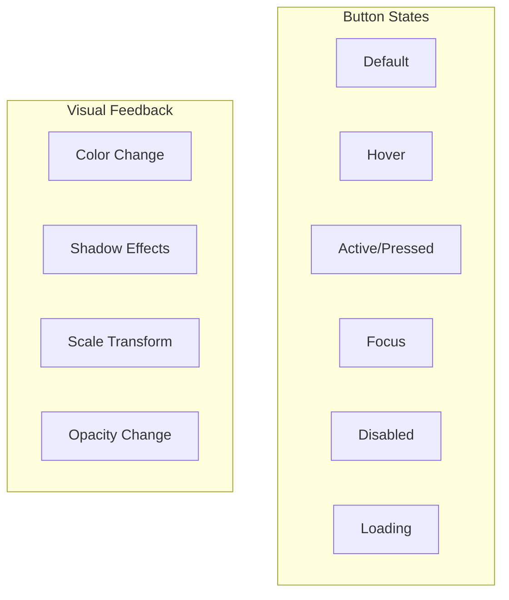

### 6.2 Form Validation

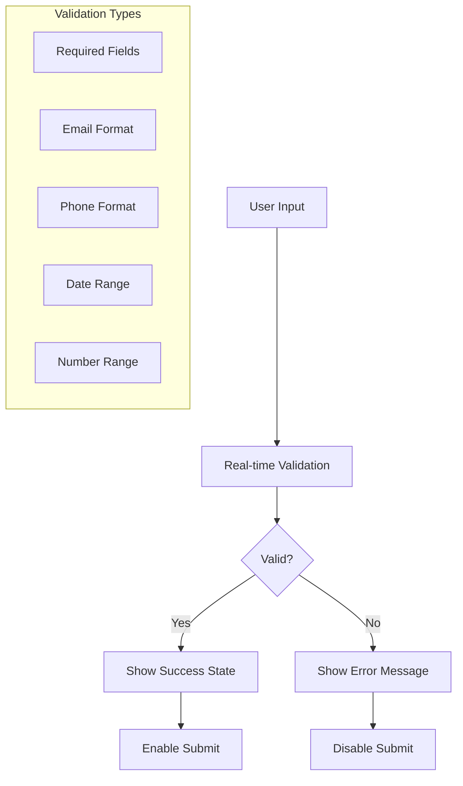

## 7. Loading States

### 7.1 Loading Patterns

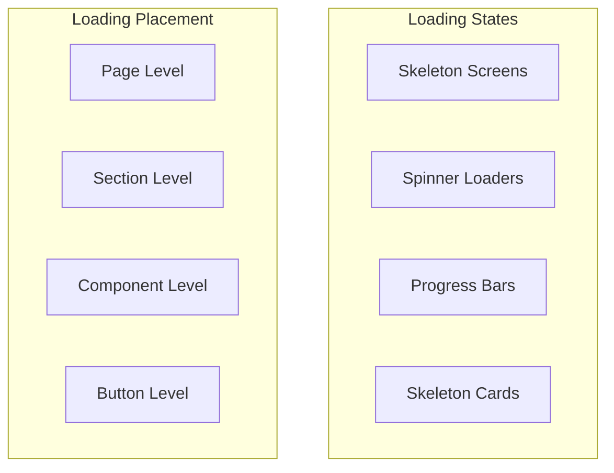

### 7.2 Error States

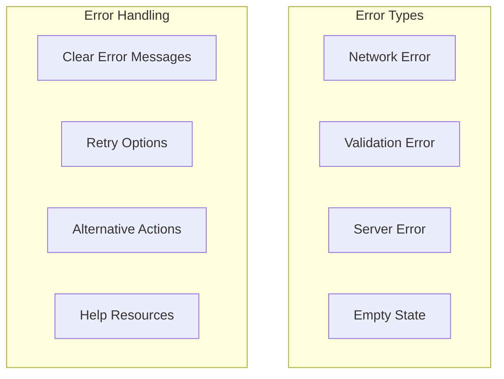

## 8. Animation Guidelines

### 8.1 Animation Principles

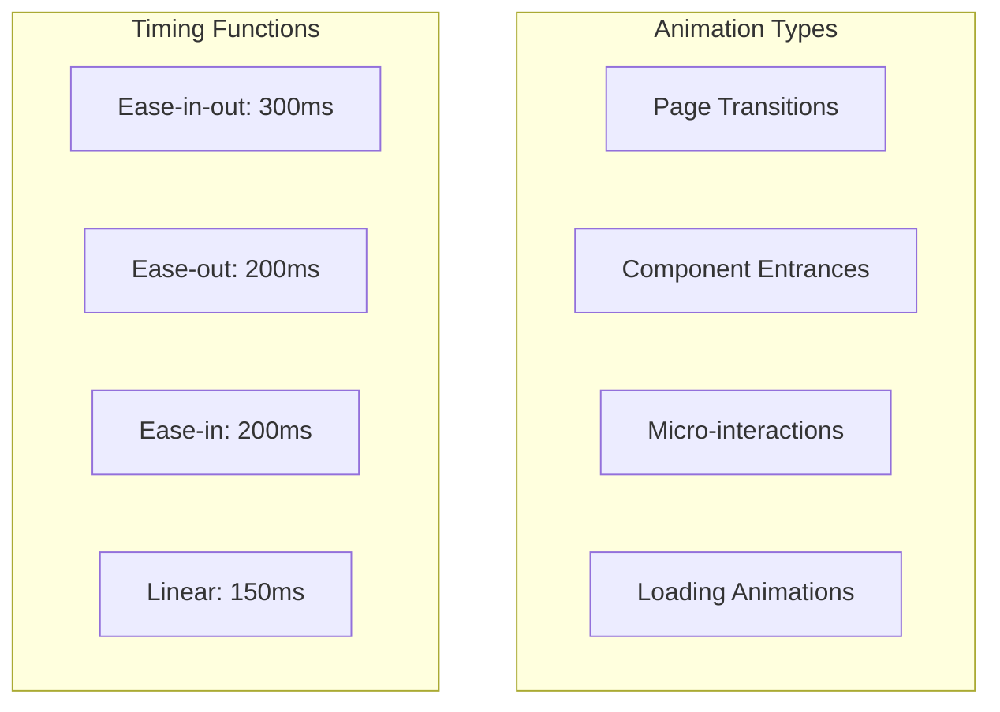

### 8.2 Micro-interactions

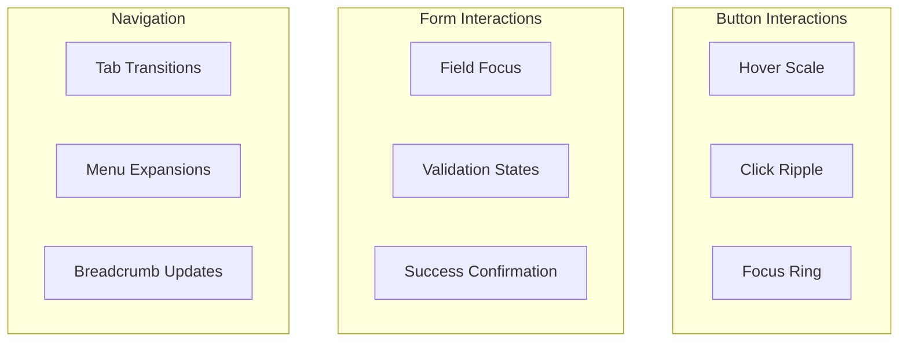

---

**Versi**: 1.3  
**Tanggal**: 26 Agustus 2025  
**Status**: Complete dengan Dynamic Pricing, Guest Booking, Google SSO, Mobile-First Web App, Core Booking Flow, Manual Payment, Dynamic Member Quota & Member Daily Swimming Limit  
**Berdasarkan**: PDF Raujan Pool Syariah
