# User Interface Design - Sistem Kolam Renang Syariah

## 1. Design System

### 1.1 Color Palette

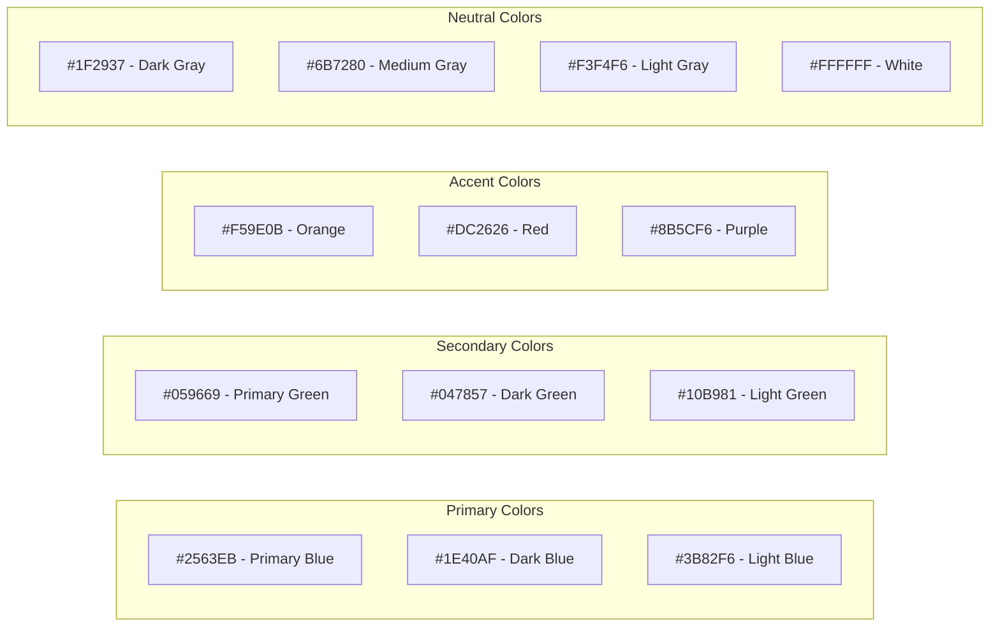
```mermaid
graph LR
    subgraph "Primary Colors"
        C1[#2563EB - Primary Blue]
        C2[#1E40AF - Dark Blue]
        C3[#3B82F6 - Light Blue]
    end

    subgraph "Secondary Colors"
        C4[#059669 - Primary Green]
        C5[#047857 - Dark Green]
        C6[#10B981 - Light Green]
    end

    subgraph "Accent Colors"
        C7[#F59E0B - Orange]
        C8[#DC2626 - Red]
        C9[#8B5CF6 - Purple]
    end

    subgraph "Neutral Colors"
        C10[#1F2937 - Dark Gray]
        C11[#6B7280 - Medium Gray]
        C12[#F3F4F6 - Light Gray]
        C13[#FFFFFF - White]
    end
```

### 1.2 Typography

```css
/* Primary Font - Inter */
font-family: 'Inter', sans-serif;

/* Heading Sizes */
h1: 32px, font-weight: 700
h2: 28px, font-weight: 600
h3: 24px, font-weight: 600
h4: 20px, font-weight: 500
h5: 18px, font-weight: 500
h6: 16px, font-weight: 500

/* Body Text */
body: 16px, font-weight: 400
small: 14px, font-weight: 400
caption: 12px, font-weight: 400
```

### 1.3 Component Library

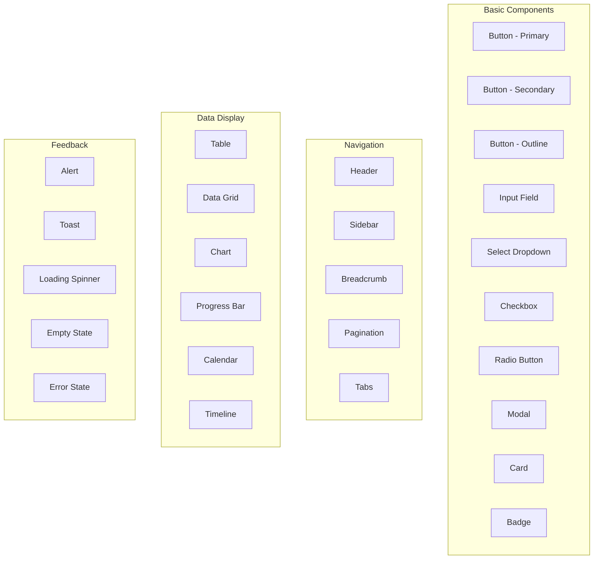
```mermaid
graph TD
    subgraph "Basic Components"
        B1[Button - Primary]
        B2[Button - Secondary]
        B3[Button - Outline]
        B4[Input Field]
        B5[Select Dropdown]
        B6[Checkbox]
        B7[Radio Button]
        B8[Modal]
        B9[Card]
        B10[Badge]
    end

    subgraph "Navigation"
        N1[Header]
        N2[Sidebar]
        N3[Breadcrumb]
        N4[Pagination]
        N5[Tabs]
    end

    subgraph "Data Display"
        D1[Table]
        D2[Data Grid]
        D3[Chart]
        D4[Progress Bar]
        D5[Calendar]
        D6[Timeline]
    end

    subgraph "Feedback"
        F1[Alert]
        F2[Toast]
        F3[Loading Spinner]
        F4[Empty State]
        F5[Error State]
    end
```

## 2. Mobile Application Design

### 2.1 Main Navigation

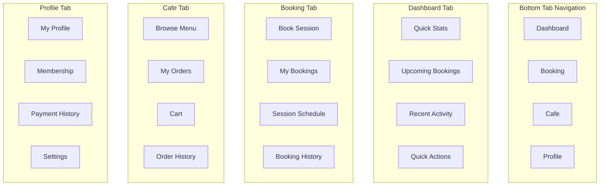
```mermaid
graph TB
    subgraph "Bottom Tab Navigation"
        T1[Dashboard]
        T2[Booking]
        T3[Cafe]
        T4[Profile]
    end

    subgraph "Dashboard Tab"
        D1[Quick Stats]
        D2[Upcoming Bookings]
        D3[Recent Activity]
        D4[Quick Actions]
    end

    subgraph "Booking Tab"
        B1[Book Session]
        B2[My Bookings]
        B3[Session Schedule]
        B4[Booking History]
    end

    subgraph "Cafe Tab"
        C1[Browse Menu]
        C2[My Orders]
        C3[Cart]
        C4[Order History]
    end

    subgraph "Profile Tab"
        P1[My Profile]
        P2[Membership]
        P3[Payment History]
        P4[Settings]
    end
```

### 2.2 Key Screens

#### 2.2.1 Login Screen

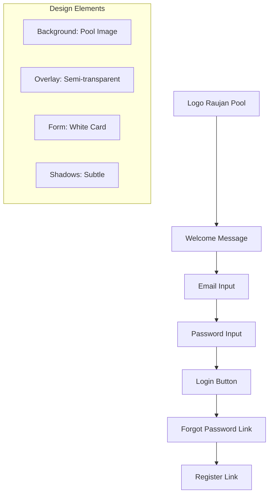
```mermaid
graph TD
    A[Logo Raujan Pool] --> B[Welcome Message]
    B --> C[Email Input]
    C --> D[Password Input]
    D --> E[Login Button]
    E --> F[Forgot Password Link]
    F --> G[Register Link]

    subgraph "Design Elements"
        H[Background: Pool Image]
        I[Overlay: Semi-transparent]
        J[Form: White Card]
        K[Shadows: Subtle]
    end
```

#### 2.2.2 Booking Screen

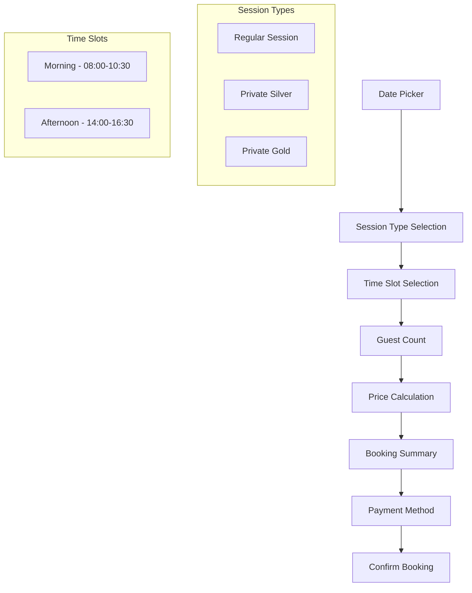
```mermaid
graph TD
    A[Date Picker] --> B[Session Type Selection]
    B --> C[Time Slot Selection]
    C --> D[Guest Count]
    D --> E[Price Calculation]
    E --> F[Booking Summary]
    F --> G[Payment Method]
    G --> H[Confirm Booking]

    subgraph "Session Types"
        S1[Regular Session]
        S2[Private Silver]
        S3[Private Gold]
    end

    subgraph "Time Slots"
        T1[Morning - 08:00-10:30]
        T2[Afternoon - 14:00-16:30]
    end
```

#### 2.2.3 Cafe Menu Screen

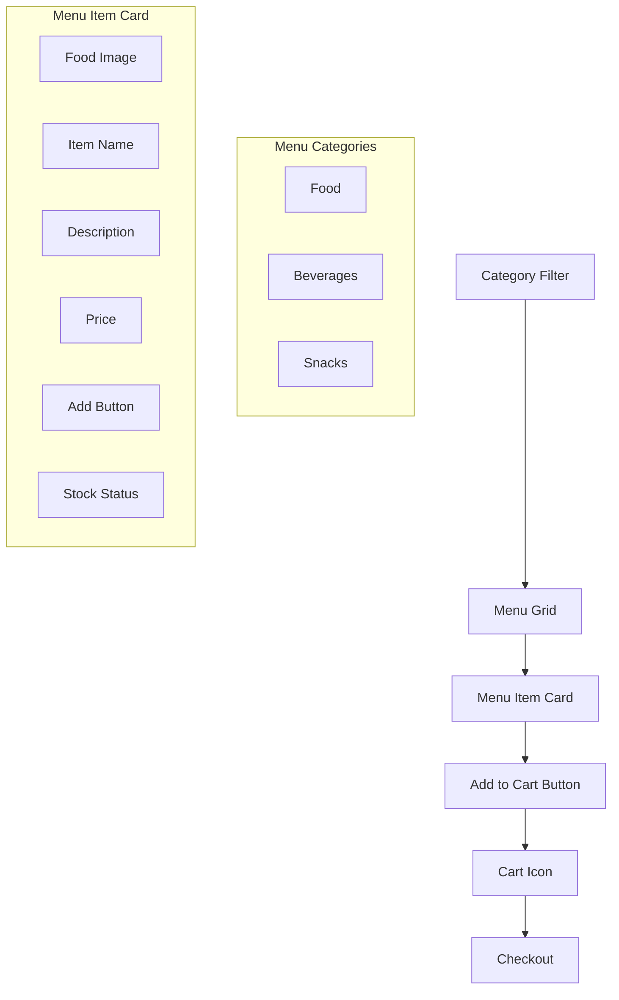
```mermaid
graph TD
    A[Category Filter] --> B[Menu Grid]
    B --> C[Menu Item Card]
    C --> D[Add to Cart Button]
    D --> E[Cart Icon]
    E --> F[Checkout]

    subgraph "Menu Categories"
        M1[Food]
        M2[Beverages]
        M3[Snacks]
    end

    subgraph "Menu Item Card"
        I1[Food Image]
        I2[Item Name]
        I3[Description]
        I4[Price]
        I5[Add Button]
        I6[Stock Status]
    end
```

## 3. Web Application Design

### 3.1 Admin Dashboard Layout

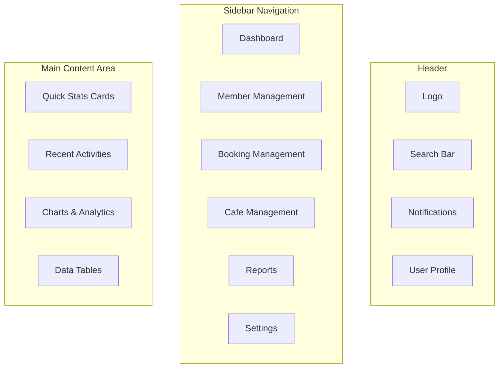
```mermaid
graph TB
    subgraph "Header"
        H1[Logo]
        H2[Search Bar]
        H3[Notifications]
        H4[User Profile]
    end

    subgraph "Sidebar Navigation"
        S1[Dashboard]
        S2[Member Management]
        S3[Booking Management]
        S4[Cafe Management]
        S5[Reports]
        S6[Settings]
    end

    subgraph "Main Content Area"
        M1[Quick Stats Cards]
        M2[Recent Activities]
        M3[Charts & Analytics]
        M4[Data Tables]
    end
```

### 3.2 Key Admin Screens

#### 3.2.1 Member Management

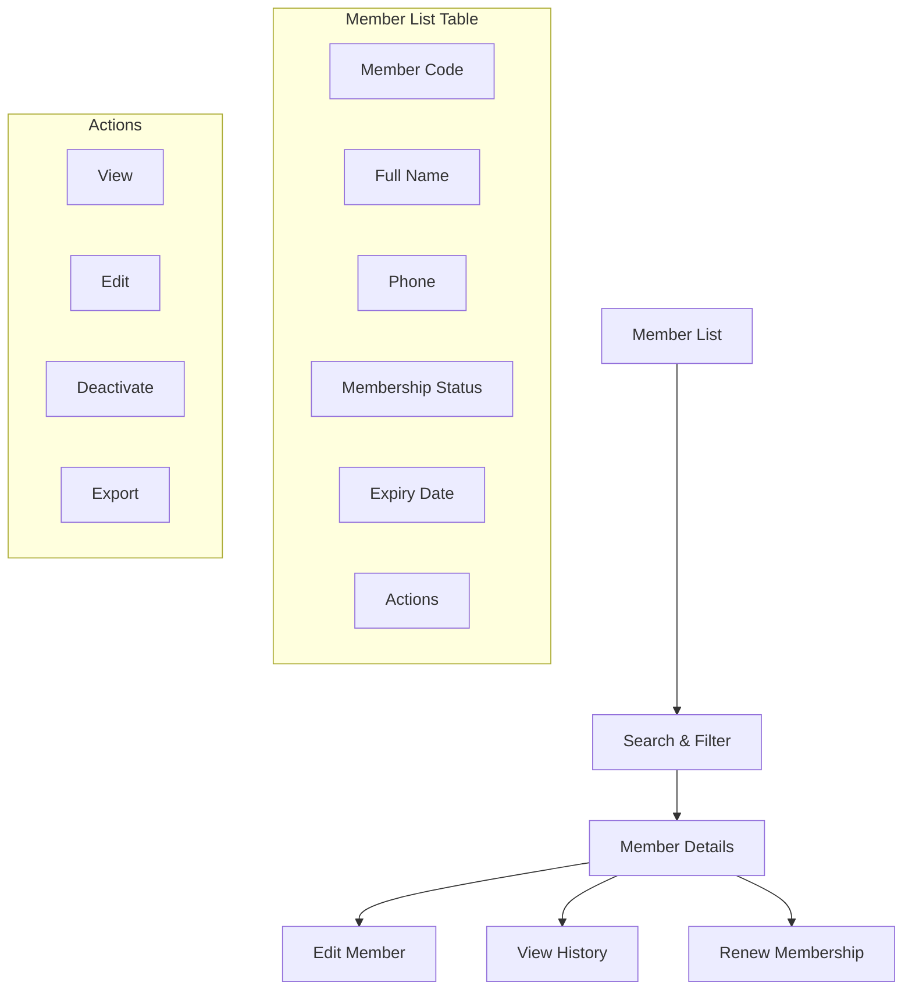
```mermaid
graph TD
    A[Member List] --> B[Search & Filter]
    B --> C[Member Details]
    C --> D[Edit Member]
    C --> E[View History]
    C --> F[Renew Membership]

    subgraph "Member List Table"
        T1[Member Code]
        T2[Full Name]
        T3[Phone]
        T4[Membership Status]
        T5[Expiry Date]
        T6[Actions]
    end

    subgraph "Actions"
        A1[View]
        A2[Edit]
        A3[Deactivate]
        A4[Export]
    end
```

#### 3.2.2 Booking Management

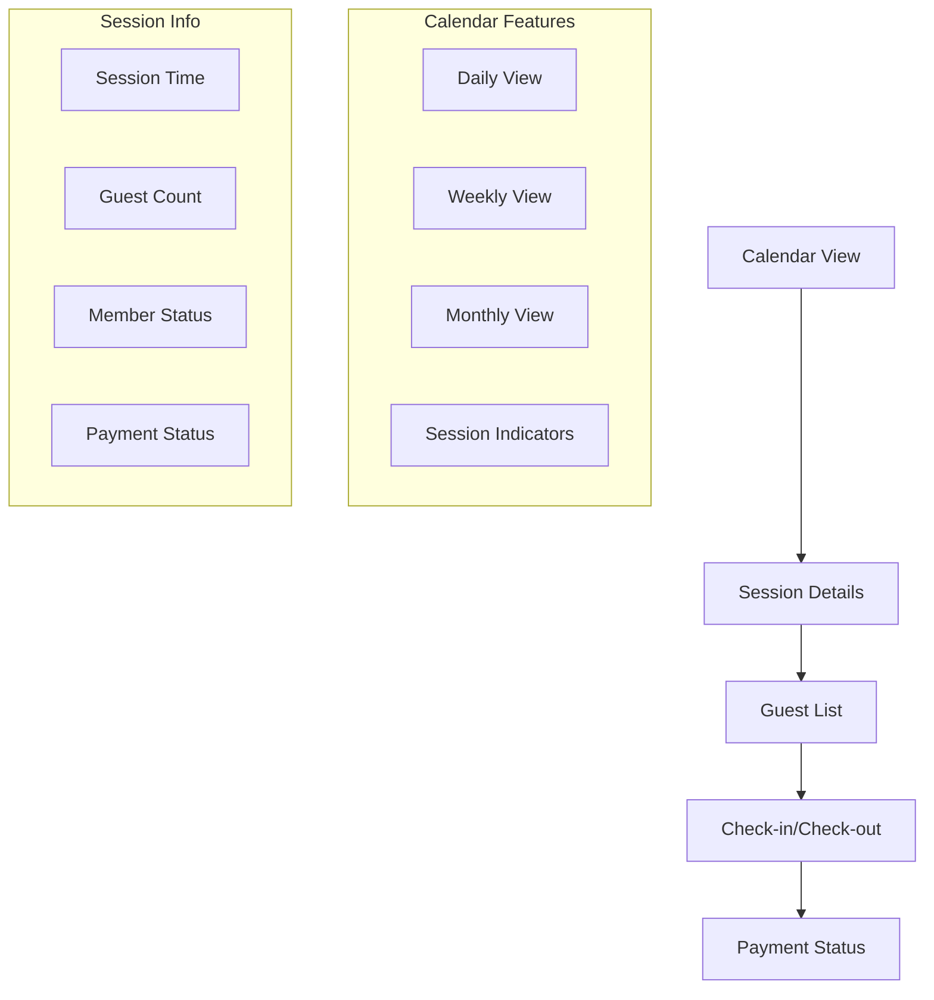
```mermaid
graph TD
    A[Calendar View] --> B[Session Details]
    B --> C[Guest List]
    C --> D[Check-in/Check-out]
    D --> E[Payment Status]

    subgraph "Calendar Features"
        C1[Daily View]
        C2[Weekly View]
        C3[Monthly View]
        C4[Session Indicators]
    end

    subgraph "Session Info"
        S1[Session Time]
        S2[Guest Count]
        S3[Member Status]
        S4[Payment Status]
    end
```

## 4. Responsive Design

### 4.1 Breakpoint Strategy

```css
/* Mobile First Approach */
/* Base: 320px - 767px */
@media (min-width: 768px) {
  /* Tablet: 768px - 1023px */
}
@media (min-width: 1024px) {
  /* Desktop: 1024px+ */
}
@media (min-width: 1440px) {
  /* Large Desktop: 1440px+ */
}
```

### 4.2 Component Responsiveness

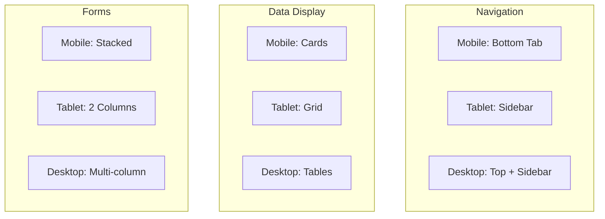
```mermaid
graph TD
    subgraph "Navigation"
        N1[Mobile: Bottom Tab]
        N2[Tablet: Sidebar]
        N3[Desktop: Top + Sidebar]
    end

    subgraph "Data Display"
        D1[Mobile: Cards]
        D2[Tablet: Grid]
        D3[Desktop: Tables]
    end

    subgraph "Forms"
        F1[Mobile: Stacked]
        F2[Tablet: 2 Columns]
        F3[Desktop: Multi-column]
    end
```

## 5. Accessibility Guidelines

### 5.1 WCAG 2.1 Compliance

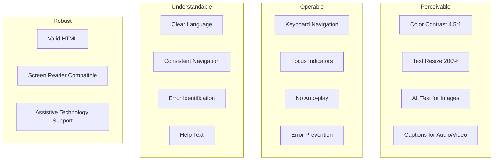
```mermaid
graph TD
    subgraph "Perceivable"
        P1[Color Contrast 4.5:1]
        P2[Text Resize 200%]
        P3[Alt Text for Images]
        P4[Captions for Audio/Video]
    end

    subgraph "Operable"
        O1[Keyboard Navigation]
        O2[Focus Indicators]
        O3[No Auto-play]
        O4[Error Prevention]
    end

    subgraph "Understandable"
        U1[Clear Language]
        U2[Consistent Navigation]
        U3[Error Identification]
        U4[Help Text]
    end

    subgraph "Robust"
        R1[Valid HTML]
        R2[Screen Reader Compatible]
        R3[Assistive Technology Support]
    end
```

### 5.2 Screen Reader Support

```html
<!-- Semantic HTML Structure -->
<header role="banner">
  <nav role="navigation">
    <main role="main">
      <aside role="complementary">
        <footer role="contentinfo">
          <!-- ARIA Labels -->
          <button aria-label="Book Session">
            <input aria-describedby="email-help" />
            <div role="alert" aria-live="polite"></div>
          </button>
        </footer>
      </aside>
    </main>
  </nav>
</header>
```

## 6. Interactive Elements

### 6.1 Button States

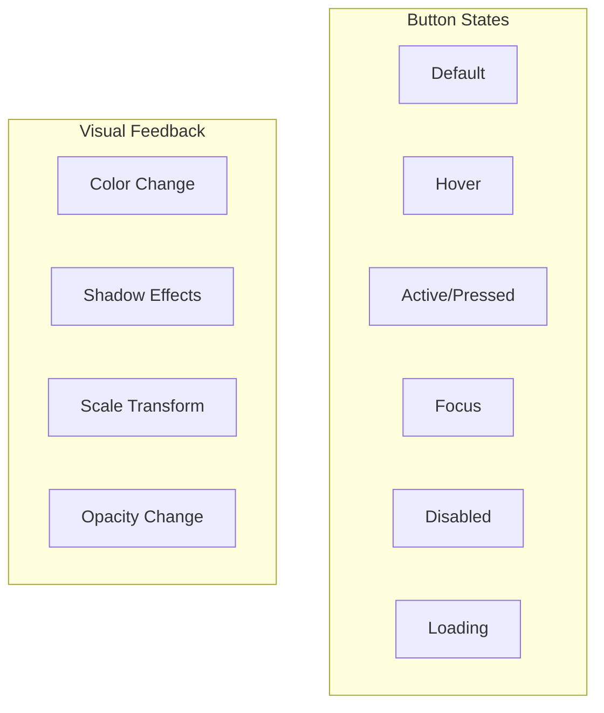
```mermaid
graph TD
    subgraph "Button States"
        B1[Default]
        B2[Hover]
        B3[Active/Pressed]
        B4[Focus]
        B5[Disabled]
        B6[Loading]
    end

    subgraph "Visual Feedback"
        V1[Color Change]
        V2[Shadow Effects]
        V3[Scale Transform]
        V4[Opacity Change]
    end
```

### 6.2 Form Validation

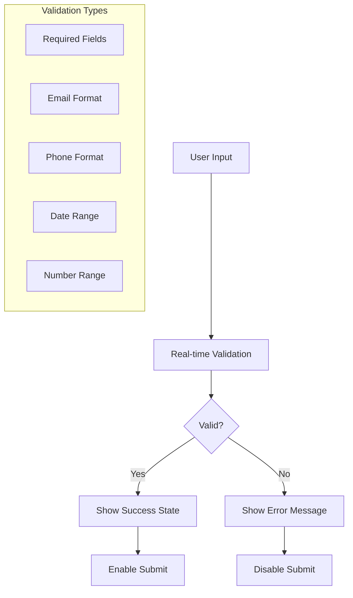
```mermaid
graph TD
    A[User Input] --> B[Real-time Validation]
    B --> C{Valid?}
    C -->|Yes| D[Show Success State]
    C -->|No| E[Show Error Message]
    D --> F[Enable Submit]
    E --> G[Disable Submit]

    subgraph "Validation Types"
        V1[Required Fields]
        V2[Email Format]
        V3[Phone Format]
        V4[Date Range]
        V5[Number Range]
    end
```

## 7. Loading States

### 7.1 Loading Patterns

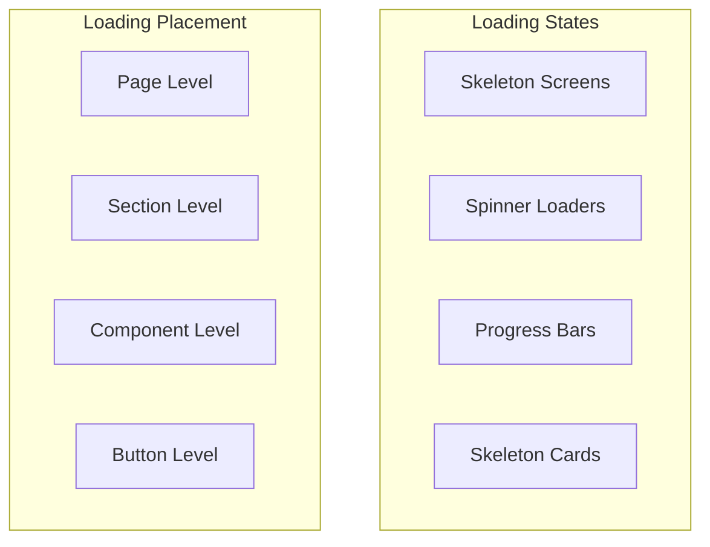
```mermaid
graph TD
    subgraph "Loading States"
        L1[Skeleton Screens]
        L2[Spinner Loaders]
        L3[Progress Bars]
        L4[Skeleton Cards]
    end

    subgraph "Loading Placement"
        P1[Page Level]
        P2[Section Level]
        P3[Component Level]
        P4[Button Level]
    end
```

### 7.2 Error States

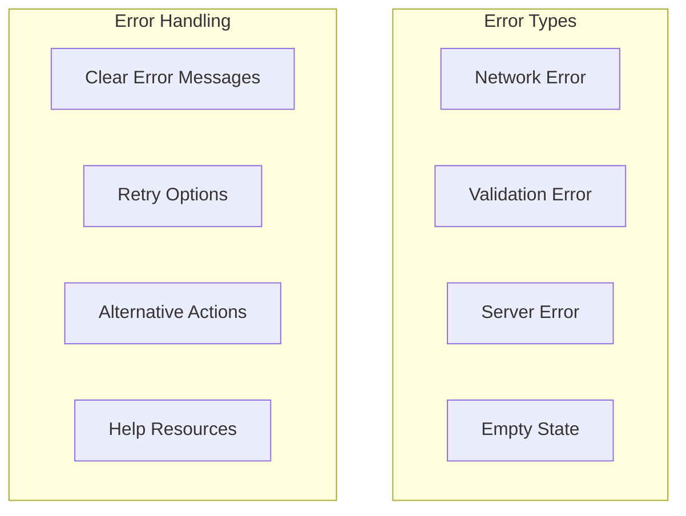
```mermaid
graph TD
    subgraph "Error Types"
        E1[Network Error]
        E2[Validation Error]
        E3[Server Error]
        E4[Empty State]
    end

    subgraph "Error Handling"
        H1[Clear Error Messages]
        H2[Retry Options]
        H3[Alternative Actions]
        H4[Help Resources]
    end
```

## 8. Animation Guidelines

### 8.1 Animation Principles

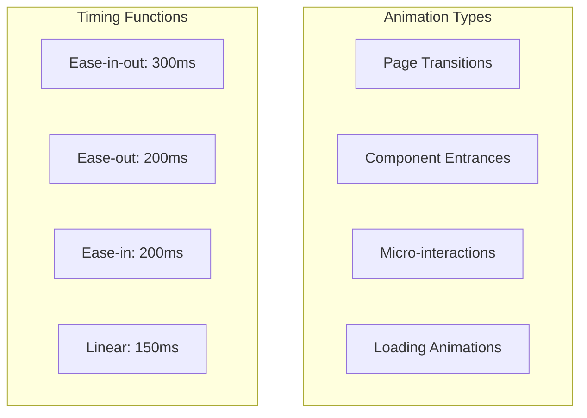
```mermaid
graph TD
    subgraph "Animation Types"
        A1[Page Transitions]
        A2[Component Entrances]
        A3[Micro-interactions]
        A4[Loading Animations]
    end

    subgraph "Timing Functions"
        T1[Ease-in-out: 300ms]
        T2[Ease-out: 200ms]
        T3[Ease-in: 200ms]
        T4[Linear: 150ms]
    end
```

### 8.2 Micro-interactions

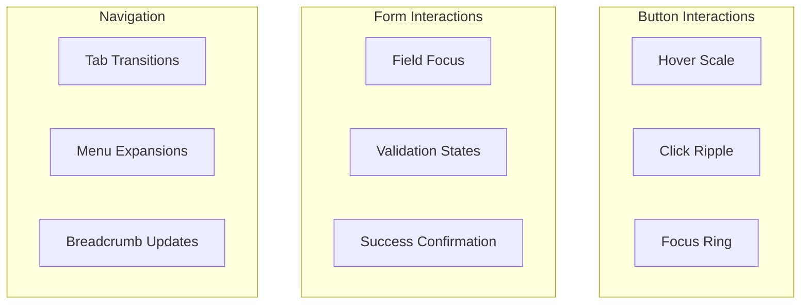
```mermaid
graph TD
    subgraph "Button Interactions"
        B1[Hover Scale]
        B2[Click Ripple]
        B3[Focus Ring]
    end

    subgraph "Form Interactions"
        F1[Field Focus]
        F2[Validation States]
        F3[Success Confirmation]
    end

    subgraph "Navigation"
        N1[Tab Transitions]
        N2[Menu Expansions]
        N3[Breadcrumb Updates]
    end
```

---

**Versi**: 1.1  
**Tanggal**: 26 Agustus 2025  
**Status**: Updated berdasarkan PDF Raujan Pool Syariah
