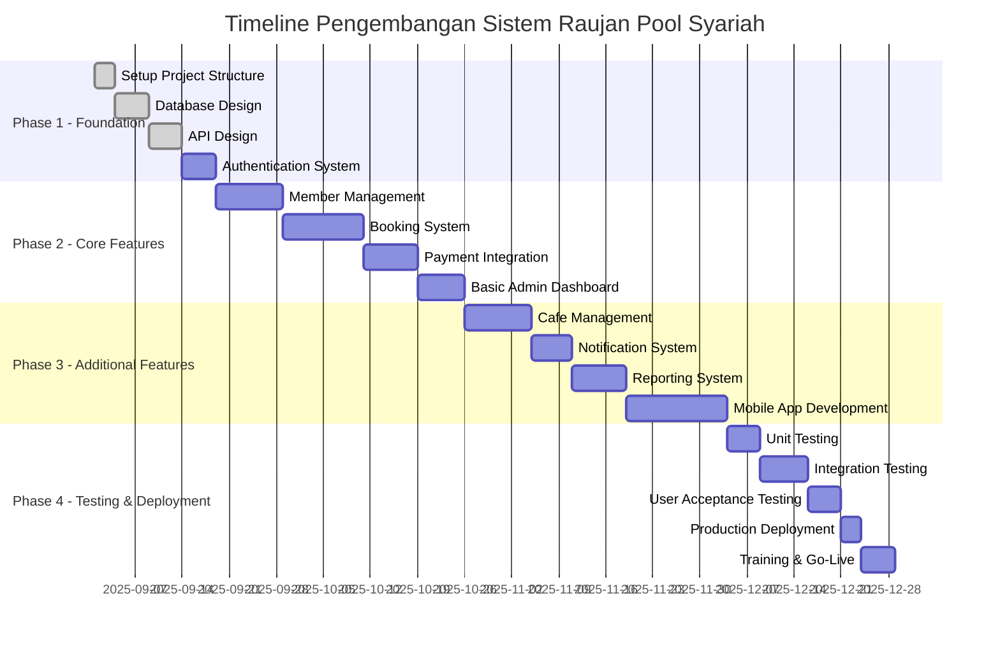
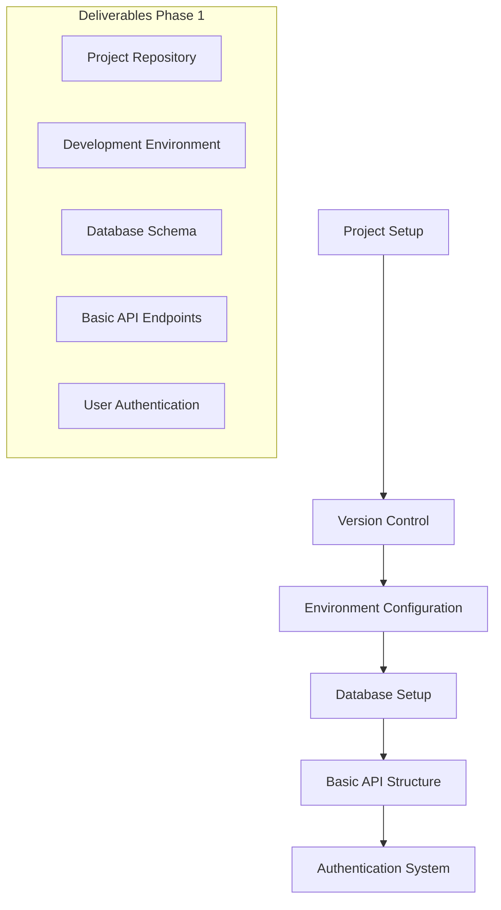
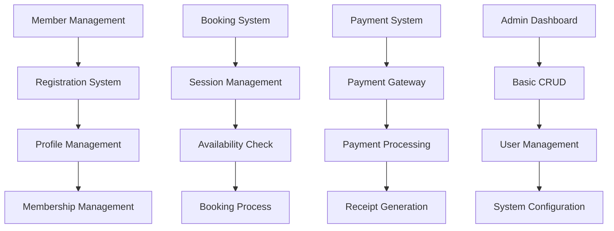
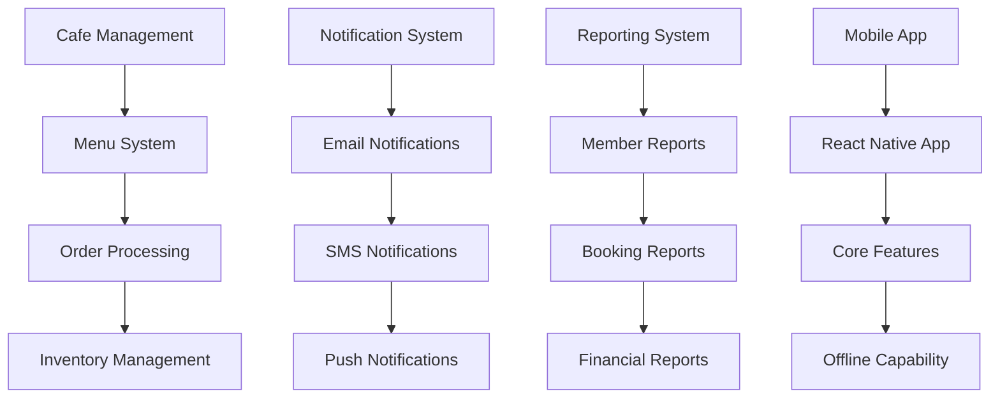
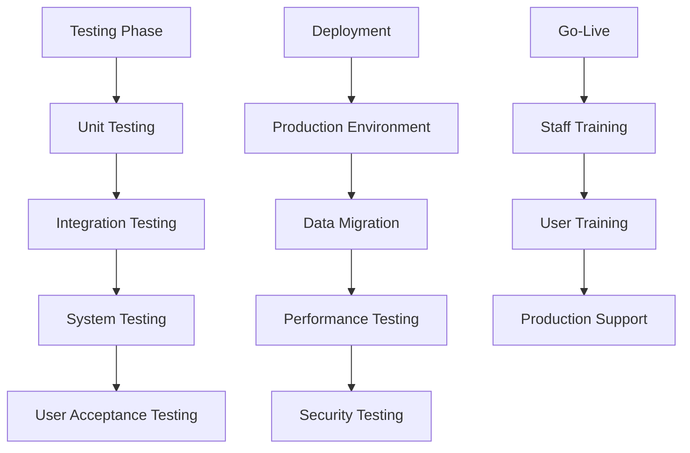
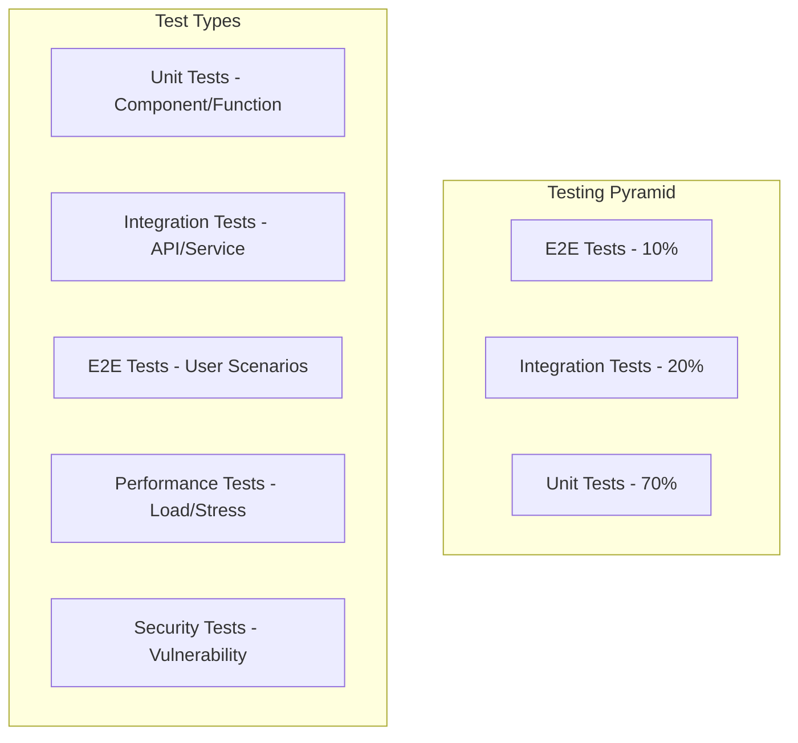
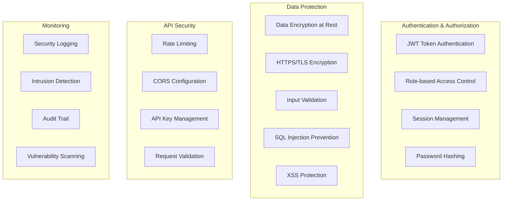
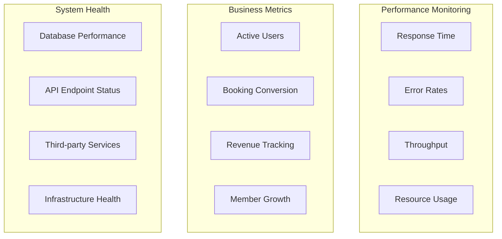
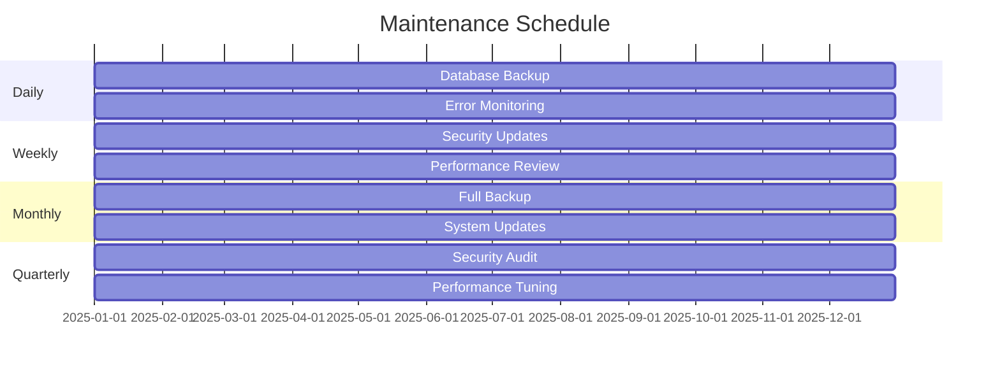

# Implementasi dan Testing - Sistem Kolam Renang Syariah

## 1. Rencana Implementasi

### 1.1 Timeline Pengembangan



### 1.2 Development Phases

#### Phase 1: Foundation (Weeks 1-2)



#### Phase 2: Core Features (Weeks 3-6)



#### Phase 3: Additional Features (Weeks 7-11)



#### Phase 4: Testing & Deployment (Weeks 12-13)



## 2. Technology Stack Implementation

### 2.1 Frontend Technologies

```json
{
  "web_app": {
    "framework": "React.js 18.x",
    "styling": "Tailwind CSS",
    "state_management": "Redux Toolkit",
    "routing": "React Router v6",
    "ui_library": "Headless UI",
    "icons": "Heroicons",
    "charts": "Chart.js"
  },
  "mobile_app": {
    "framework": "React Native 0.72",
    "navigation": "React Navigation 6",
    "state_management": "Redux Toolkit",
    "ui_components": "React Native Elements",
    "icons": "React Native Vector Icons"
  },
  "admin_dashboard": {
    "framework": "React.js 18.x",
    "admin_template": "React Admin",
    "data_visualization": "Recharts",
    "data_grid": "Material-UI DataGrid"
  }
}
```

### 2.2 Backend Technologies

```json
{
  "api_framework": "Node.js + Express.js",
  "database": {
    "primary": "MySQL 8.0",
    "cache": "Redis 7.0",
    "orm": "Sequelize 6.x"
  },
  "authentication": {
    "jwt": "jsonwebtoken",
    "bcrypt": "bcryptjs",
    "session": "express-session"
  },
  "file_upload": {
    "storage": "AWS S3",
    "processing": "Multer"
  },
  "payment": {
    "gateway": "Midtrans",
    "support": "Manual Payment Tracking"
  },
  "notifications": {
    "email": "Nodemailer + SendGrid",
    "sms": "Twilio"
  }
}
```

### 2.3 DevOps & Infrastructure

```json
{
  "hosting": "AWS EC2",
  "database_hosting": "AWS RDS",
  "file_storage": "AWS S3",
  "cdn": "AWS CloudFront",
  "load_balancer": "AWS ALB",
  "monitoring": {
    "logs": "AWS CloudWatch",
    "errors": "Sentry",
    "performance": "New Relic"
  },
  "ci_cd": {
    "version_control": "GitHub",
    "ci": "GitHub Actions",
    "deployment": "AWS CodeDeploy"
  }
}
```

## 3. Testing Strategy

### 3.1 Testing Pyramid



### 3.2 Unit Testing Framework

```javascript
// Example Unit Test - Member Service
describe("MemberService", () => {
  describe("createMember", () => {
    it("should create a new member with valid data", async () => {
      const memberData = {
        full_name: "Ahmad Rahman",
        phone: "081234567890",
        email: "ahmad@example.com",
        membership_type: "monthly",
      };

      const result = await memberService.createMember(memberData);

      expect(result).toHaveProperty("id");
      expect(result.full_name).toBe(memberData.full_name);
      expect(result.member_code).toMatch(/^M\d{3}$/);
    });

    it("should throw error for duplicate phone number", async () => {
      const existingMember = await createTestMember();
      const duplicateData = {
        full_name: "Test User",
        phone: existingMember.phone,
        email: "test@example.com",
      };

      await expect(memberService.createMember(duplicateData)).rejects.toThrow(
        "Phone number already exists"
      );
    });
  });
});
```

### 3.3 Integration Testing

```javascript
// Example Integration Test - Booking API
describe("POST /api/bookings", () => {
  it("should create a booking for valid member", async () => {
    const member = await createTestMember();
    const bookingData = {
      member_id: member.id,
      booking_date: "2025-09-30",
      session_time: "morning",
      adult_count: 2,
      child_count: 1,
    };

    const response = await request(app)
      .post("/api/bookings")
      .set("Authorization", `Bearer ${member.token}`)
      .send(bookingData);

    expect(response.status).toBe(201);
    expect(response.body).toHaveProperty("booking_id");
    expect(response.body.total_amount).toBe(65000); // 2 adults + 1 child
  });
});
```

### 3.4 E2E Testing Scenarios

```javascript
// Example E2E Test - Complete Booking Flow
describe("Booking Flow", () => {
  it("should complete booking process from login to confirmation", async () => {
    // 1. Login
    await page.goto("/login");
    await page.fill("#email", "member@example.com");
    await page.fill("#password", "password123");
    await page.click("#login-button");

    // 2. Navigate to booking
    await page.click('[data-testid="book-session"]');

    // 3. Select session
    await page.click("#date-2025-09-30");
    await page.click("#session-morning");
    await page.fill("#adult-count", "2");
    await page.fill("#child-count", "1");

    // 4. Confirm booking
    await page.click("#confirm-booking");

    // 5. Payment
    await page.click("#payment-method-transfer");
    await page.click("#process-payment");

    // 6. Verify confirmation
    await expect(page.locator(".booking-confirmation")).toBeVisible();
    await expect(page.locator('[data-testid="booking-id"]')).toContainText(
      "BK"
    );
  });
});
```

## 4. Quality Assurance

### 4.1 Code Quality Standards

```json
{
  "linting": {
    "javascript": "ESLint with Airbnb config",
    "css": "Stylelint",
    "typescript": "TypeScript ESLint"
  },
  "formatting": {
    "prettier": "Prettier config",
    "editor_config": ".editorconfig"
  },
  "git_hooks": {
    "husky": "Pre-commit hooks",
    "lint_staged": "Lint staged files"
  },
  "security": {
    "npm_audit": "Regular dependency checks",
    "snyk": "Vulnerability scanning",
    "owasp_zap": "Security testing"
  }
}
```

### 4.2 Performance Testing

```javascript
// Example Performance Test - Load Testing
describe("API Performance", () => {
  it("should handle 100 concurrent booking requests", async () => {
    const testData = generateTestBookings(100);

    const results = await Promise.all(
      testData.map((data) => request(app).post("/api/bookings").send(data))
    );

    const successCount = results.filter((r) => r.status === 201).length;
    const avgResponseTime = calculateAverageResponseTime(results);

    expect(successCount).toBeGreaterThan(95); // 95% success rate
    expect(avgResponseTime).toBeLessThan(2000); // < 2 seconds
  });
});
```

## 5. Security Implementation

### 5.1 Security Measures



### 5.2 Security Testing

```javascript
// Example Security Test
describe("Security Tests", () => {
  it("should prevent SQL injection", async () => {
    const maliciousInput = "'; DROP TABLE users; --";

    const response = await request(app)
      .post("/api/members/search")
      .send({ name: maliciousInput });

    // Should not crash and should handle input safely
    expect(response.status).not.toBe(500);
  });

  it("should validate JWT tokens", async () => {
    const invalidToken = "invalid.jwt.token";

    const response = await request(app)
      .get("/api/members/profile")
      .set("Authorization", `Bearer ${invalidToken}`);

    expect(response.status).toBe(401);
  });
});
```

## 6. Deployment Strategy

### 6.1 Environment Configuration

```yaml
# docker-compose.yml
version: "3.8"
services:
  web:
    build: ./frontend
    ports:
      - "3000:3000"
    environment:
      - NODE_ENV=production
      - REACT_APP_API_URL=https://api.raujanpool.com

  api:
    build: ./backend
    ports:
      - "8000:8000"
    environment:
      - NODE_ENV=production
      - DB_HOST=mysql
      - REDIS_HOST=redis
    depends_on:
      - mysql
      - redis

  mysql:
    image: mysql:8.0
    environment:
      - MYSQL_ROOT_PASSWORD=secure_password
      - MYSQL_DATABASE=raujan_pool
    volumes:
      - mysql_data:/var/lib/mysql

  redis:
    image: redis:7.0
    volumes:
      - redis_data:/data

volumes:
  mysql_data:
  redis_data:
```

### 6.2 CI/CD Pipeline

```yaml
# .github/workflows/deploy.yml
name: Deploy to Production

on:
  push:
    branches: [main]

jobs:
  test:
    runs-on: ubuntu-latest
    steps:
      - uses: actions/checkout@v3
      - name: Setup Node.js
        uses: actions/setup-node@v3
        with:
          node-version: "18"

      - name: Install dependencies
        run: npm ci

      - name: Run tests
        run: npm test

      - name: Run linting
        run: npm run lint

  deploy:
    needs: test
    runs-on: ubuntu-latest
    steps:
      - uses: actions/checkout@v3

      - name: Configure AWS credentials
        uses: aws-actions/configure-aws-credentials@v1
        with:
          aws-access-key-id: ${{ secrets.AWS_ACCESS_KEY_ID }}
          aws-secret-access-key: ${{ secrets.AWS_SECRET_ACCESS_KEY }}
          aws-region: ap-southeast-1

      - name: Deploy to EC2
        run: |
          aws codedeploy create-deployment \
            --application-name raujan-pool-app \
            --deployment-group-name raujan-pool-dg \
            --revision revisionType=GitHub,gitHubLocation={repository=owner/repo,commitId=${{ github.sha }}}
```

## 7. Monitoring & Maintenance

### 7.1 Application Monitoring



### 7.2 Maintenance Schedule



---

**Versi**: 1.1  
**Tanggal**: 26 Agustus 2025  
**Status**: Updated berdasarkan PDF Raujan Pool Syariah
