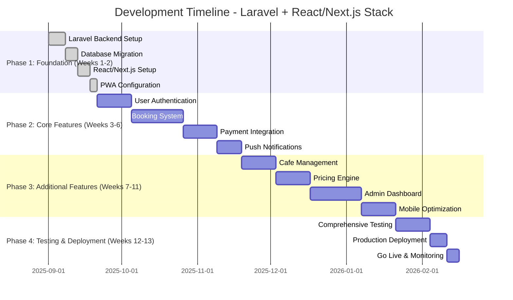

# Implementasi dan Testing Strategy - Sistem Kolam Renang Syariah

## 1. Rencana Implementasi

### 1.1 Development Timeline (Gantt Chart)



### 1.2 Development Phases Detail

#### Phase 1: Foundation (Weeks 1-2)

**Laravel Backend Setup**

- Install Laravel 11 dengan PHP 8.2+
- Configure MySQL database dan Redis cache
- Setup Laravel Sanctum untuk API authentication
- Configure Google OAuth integration
- Setup file storage dengan AWS S3

**React/Next.js Frontend Setup**

- Initialize Next.js project dengan TypeScript
- Configure Tailwind CSS untuk mobile-first design
- Setup PWA configuration (service worker, manifest)
- Configure API client (Axios/React Query)
- Setup authentication context dan state management

#### Phase 2: Core Features (Weeks 3-6)

**Calendar Interface Development**

- Laravel: Calendar API endpoints, availability management
  - Create CalendarController dengan endpoints untuk month data
  - Implement GetCalendarAvailability stored procedure
  - Build CheckSessionAvailability API
  - Setup real-time capacity tracking
- Frontend: Calendar component, date selection, session modal
  - Build responsive calendar grid component
  - Implement forward-only navigation (no past months)
  - Create session selection modal dengan capacity display
  - Add status indicators (available/partial/full/closed)
- Database: Calendar availability tables, capacity tracking
  - Setup calendar_availability table
  - Create daily_capacity tracking
  - Implement session_slots management
  - Setup capacity update triggers
- Real-time: WebSocket integration for live updates
  - Laravel WebSocket server setup
  - Frontend WebSocket client integration
  - Real-time availability updates
  - Concurrent booking prevention
- Testing: Calendar navigation, availability checking
  - Unit tests untuk calendar API
  - Integration tests untuk availability logic
  - E2E tests untuk complete calendar flow

**User Authentication System**

- Laravel: User management, roles, permissions
- Frontend: Login/register forms, Google SSO
- PWA: Service worker untuk offline auth
- Testing: Unit tests untuk auth flows

**Booking System**

- Laravel: Booking CRUD, validation, business logic
- Frontend: Session selection, registration forms
- Integration: Capacity management, overbooking prevention
- Testing: Complete booking flow testing
- PWA: Offline booking capability
- Testing: Integration tests untuk booking flows

#### Phase 3: Additional Features (Weeks 7-11)

**Mobile Optimization**

- Responsive design optimization
- Touch gesture implementation
- Performance optimization untuk mobile
- PWA enhancement (offline support, push notifications)

## 2. Technology Stack Implementation

### 2.1 Laravel Backend Technology Stack

```json
{
  "laravel_backend": {
    "framework": "Laravel 11.x",
    "php_version": "8.2+",
    "database": {
      "primary": "MySQL 8.0",
      "cache": "Redis 7.0",
      "migrations": "Laravel Migrations",
      "seeding": "Laravel Seeders"
    },
    "authentication": {
      "api": "Laravel Sanctum",
      "oauth": "Laravel Socialite (Google)",
      "jwt": "tymon/jwt-auth (optional)"
    },
    "api": {
      "versioning": "v1",
      "resources": "Laravel API Resources",
      "validation": "Laravel Form Requests",
      "documentation": "Laravel Scribe"
    },
    "queue": {
      "driver": "Redis",
      "jobs": "Laravel Queues",
      "failed_jobs": "Failed Job Handling"
    },
    "storage": {
      "local": "Laravel Storage",
      "cloud": "AWS S3",
      "cdn": "CloudFront"
    },
    "testing": {
      "framework": "Laravel Pest",
      "database": "SQLite for testing",
      "mocking": "Laravel Mocking"
    }
  }
}
```

### 2.2 React/Next.js Frontend Technology Stack

```json
{
  "react_frontend": {
    "framework": "Next.js 14+",
    "language": "TypeScript",
    "styling": {
      "css": "Tailwind CSS",
      "components": "Headless UI / Radix UI",
      "icons": "Heroicons / Lucide"
    },
    "state_management": {
      "global": "Zustand / Redux Toolkit",
      "server_state": "TanStack Query (React Query)",
      "form": "React Hook Form + Zod"
    },
    "routing": "Next.js App Router",
    "authentication": {
      "client": "NextAuth.js (optional)",
      "custom": "Custom auth with JWT"
    },
    "pwa": {
      "service_worker": "next-pwa",
      "manifest": "Web App Manifest",
      "offline": "Service Worker Caching"
    },
    "mobile_optimization": {
      "responsive": "Mobile-first Tailwind",
      "touch": "Touch gesture libraries",
      "performance": "Next.js Image optimization"
    }
  }
}
```

### 2.3 Push Notification Implementation

```json
{
  "push_notifications": {
    "backend": {
      "service": "Firebase Cloud Messaging (FCM)",
      "laravel_package": "kreait/laravel-firebase",
      "queue": "Laravel Queue for background sending"
    },
    "frontend": {
      "web_push": "Web Push API",
      "service_worker": "Firebase Messaging SW",
      "permission": "Notification permission handling"
    },
    "notification_types": {
      "booking_confirmation": "Booking confirmation push",
      "payment_reminder": "Payment reminder notifications",
      "session_reminder": "Session reminder notifications",
      "price_updates": "Dynamic pricing updates",
      "promotional": "Promotional offers"
    }
  }
}
```

## 3. Testing Strategy

### 3.1 Testing Pyramid

```mermaid
graph TB
    A[Testing Pyramid] --> B[E2E Tests (10%)]
    A --> C[Integration Tests (20%)]
    A --> D[Unit Tests (70%)]

    B --> E[Laravel Dusk / Playwright]
    C --> F[Laravel Feature Tests]
    D --> G[Laravel Unit Tests]
    D --> H[React Component Tests]

    subgraph "E2E Testing"
        E2E1[User Registration Flow]
        E2E2[Booking Process]
        E2E3[Payment Flow]
        E2E4[Mobile Responsiveness]
        E2E5[Push Notification Testing]
    end

    subgraph "Integration Testing"
        INT1[API Endpoint Testing]
        INT2[Database Integration]
        INT3[External Service Integration]
        INT4[Authentication Flow]
    end

    subgraph "Unit Testing"
        UNT1[Laravel Controllers]
        UNT2[Service Classes]
        UNT3[React Components]
        UNT4[Utility Functions]
    end
```

### 3.2 Laravel Testing Examples

#### Unit Test - Pricing Calculation

```php
<?php
// tests/Unit/Services/PricingServiceTest.php
use Tests\TestCase;
use App\Services\PricingService;

class PricingServiceTest extends TestCase
{
    public function test_calculate_booking_price_for_member()
    {
        $pricingService = new PricingService();

        $price = $pricingService->calculateBookingPrice([
            'member_id' => 1,
            'booking_type' => 'regular',
            'adult_count' => 2,
            'child_count' => 1,
            'booking_date' => '2025-09-26',
            'session_time' => 'morning'
        ]);

        $this->assertEquals(65000, $price['final_amount']);
        $this->assertEquals(5000, $price['discount_amount']);
    }
}
```

#### Feature Test - Booking API

```php
<?php
// tests/Feature/Api/BookingApiTest.php
use Tests\TestCase;
use App\Models\User;
use App\Models\Member;

class BookingApiTest extends TestCase
{
    public function test_member_can_create_booking()
    {
        $user = User::factory()->create();
        $member = Member::factory()->create(['user_id' => $user->id]);

        $response = $this->actingAs($user, 'sanctum')
            ->postJson('/api/v1/bookings', [
                'booking_type' => 'regular',
                'booking_date' => '2025-09-26',
                'session_time' => 'morning',
                'adult_count' => 2,
                'child_count' => 1
            ]);

        $response->assertStatus(201)
            ->assertJsonStructure([
                'data' => [
                    'id',
                    'booking_reference',
                    'final_amount',
                    'status'
                ]
            ]);
    }
}
```

### 3.3 React/Next.js Testing Examples

#### Component Test - Booking Form

```typescript
// __tests__/components/BookingForm.test.tsx
import { render, screen, fireEvent } from "@testing-library/react";
import { BookingForm } from "@/components/BookingForm";

describe("BookingForm", () => {
  it("should submit booking with correct data", async () => {
    const mockSubmit = jest.fn();

    render(<BookingForm onSubmit={mockSubmit} />);

    fireEvent.change(screen.getByLabelText(/tanggal/i), {
      target: { value: "2025-09-26" },
    });

    fireEvent.change(screen.getByLabelText(/sesi/i), {
      target: { value: "morning" },
    });

    fireEvent.change(screen.getByLabelText(/dewasa/i), {
      target: { value: "2" },
    });

    fireEvent.click(screen.getByText(/booking sekarang/i));

    expect(mockSubmit).toHaveBeenCalledWith({
      booking_date: "2025-09-26",
      session_time: "morning",
      adult_count: 2,
      child_count: 0,
    });
  });
});
```

#### E2E Test - Complete Booking Flow

```typescript
// e2e/booking-flow.spec.ts
import { test, expect } from "@playwright/test";

test("complete booking flow with Google SSO", async ({ page }) => {
  // Navigate to booking page
  await page.goto("/booking");

  // Click Google SSO button
  await page.click('[data-testid="google-sso-btn"]');

  // Mock Google OAuth response
  await page.route("**/auth/google/callback", (route) => {
    route.fulfill({
      status: 200,
      body: JSON.stringify({ token: "mock-token" }),
    });
  });

  // Fill booking form
  await page.fill('[data-testid="booking-date"]', "2025-09-26");
  await page.selectOption('[data-testid="session-time"]', "morning");
  await page.fill('[data-testid="adult-count"]', "2");

  // Submit booking
  await page.click('[data-testid="submit-booking"]');

  // Verify success message
  await expect(page.locator('[data-testid="success-message"]')).toBeVisible();

  // Verify push notification permission
  await expect(page.locator('[data-testid="push-permission"]')).toBeVisible();
});
```

## 4. Quality Assurance

### 4.1 Code Quality Standards

```json
{
  "code_quality": {
    "laravel": {
      "linting": "Laravel Pint (PSR-12)",
      "static_analysis": "PHPStan",
      "complexity": "PHP Mess Detector",
      "coverage": "Xdebug coverage reports"
    },
    "react": {
      "linting": "ESLint + Prettier",
      "type_checking": "TypeScript strict mode",
      "testing": "Jest + React Testing Library",
      "coverage": "Jest coverage reports"
    },
    "git_hooks": {
      "pre_commit": "Husky + lint-staged",
      "commit_message": "Conventional Commits",
      "branch_naming": "feature/booking-system"
    }
  }
}
```

### 4.2 Performance Testing

```json
{
  "performance_testing": {
    "frontend": {
      "lighthouse": "Core Web Vitals testing",
      "bundle_analysis": "Webpack bundle analyzer",
      "image_optimization": "Next.js Image optimization",
      "pwa_score": "Progressive Web App score"
    },
    "backend": {
      "api_performance": "Laravel Telescope",
      "database_queries": "Query performance analysis",
      "memory_usage": "Memory profiling",
      "load_testing": "Apache Bench / Artillery"
    },
    "mobile_performance": {
      "mobile_lighthouse": "Mobile performance testing",
      "touch_responsiveness": "Touch latency testing",
      "offline_performance": "Service worker caching tests"
    }
  }
}
```

## 5. Security Implementation

### 5.1 Laravel Security Measures

```php
// config/sanctum.php
return [
    'stateful' => explode(',', env('SANCTUM_STATEFUL_DOMAINS', sprintf(
        '%s%s',
        'localhost,localhost:3000,127.0.0.1,127.0.0.1:8000,::1',
        env('APP_URL') ? ','.parse_url(env('APP_URL'), PHP_URL_HOST) : ''
    ))),

    'guard' => ['web'],
    'expiration' => null,
    'middleware' => [
        'verify_csrf_token' => App\Http\Middleware\VerifyCsrfToken::class,
        'encrypt_cookies' => App\Http\Middleware\EncryptCookies::class,
    ],
];
```

### 5.2 React Security Measures

```typescript
// utils/security.ts
export const sanitizeInput = (input: string): string => {
  return DOMPurify.sanitize(input);
};

export const validateToken = (token: string): boolean => {
  try {
    const decoded = jwt.verify(token, process.env.JWT_SECRET!);
    return !!decoded;
  } catch {
    return false;
  }
};

// CSP Headers
export const securityHeaders = {
  "Content-Security-Policy":
    "default-src 'self'; script-src 'self' 'unsafe-eval' 'unsafe-inline' https://accounts.google.com; style-src 'self' 'unsafe-inline';",
};
```

## 6. Deployment Strategy

### 6.1 Laravel Deployment

```bash
# Production deployment script
#!/bin/bash

# Pull latest code
git pull origin main

# Install dependencies
composer install --no-dev --optimize-autoloader

# Clear and cache config
php artisan config:cache
php artisan route:cache
php artisan view:cache

# Run migrations
php artisan migrate --force

# Restart services
sudo systemctl restart php8.2-fpm
sudo systemctl restart nginx
sudo systemctl restart redis

# Clear queue workers
php artisan queue:restart
```

### 6.2 Next.js Deployment

```json
{
  "deployment": {
    "platform": "Vercel / Netlify",
    "build_command": "npm run build",
    "output_directory": ".next",
    "environment_variables": {
      "NEXT_PUBLIC_API_URL": "https://api.raujanpool.com",
      "NEXT_PUBLIC_FIREBASE_CONFIG": "firebase_config",
      "NEXTAUTH_SECRET": "auth_secret"
    },
    "pwa_deployment": {
      "service_worker": "public/sw.js",
      "manifest": "public/manifest.json",
      "icons": "public/icons/"
    }
  }
}
```

## 7. Monitoring and Maintenance

### 7.1 Laravel Monitoring

```php
// config/telescope.php
return [
    'enabled' => env('TELESCOPE_ENABLED', false),
    'storage' => [
        'database' => [
            'connection' => env('DB_CONNECTION', 'mysql'),
            'chunk' => 1000,
        ],
    ],
    'entries' => [
        'queries' => [
            'enabled' => env('TELESCOPE_QUERIES_ENABLED', true),
            'slow' => 100,
        ],
        'requests' => [
            'enabled' => env('TELESCOPE_REQUESTS_ENABLED', true),
        ],
        'jobs' => [
            'enabled' => env('TELESCOPE_JOBS_ENABLED', true),
        ],
    ],
];
```

### 7.2 Performance Monitoring

```json
{
  "monitoring": {
    "application": {
      "laravel": "Laravel Telescope + New Relic",
      "react": "Sentry + Vercel Analytics",
      "pwa": "Lighthouse CI + Web Vitals"
    },
    "infrastructure": {
      "server": "AWS CloudWatch",
      "database": "MySQL slow query log",
      "cache": "Redis monitoring",
      "cdn": "CloudFront analytics"
    },
    "user_experience": {
      "real_user_monitoring": "New Relic RUM",
      "error_tracking": "Sentry error tracking",
      "performance": "Core Web Vitals monitoring"
    }
  }
}
```

---

**Versi**: 1.2  
**Tanggal**: 26 Agustus 2025  
**Status**: Updated dengan Laravel + React/Next.js Implementation  
**Berdasarkan**: PDF Raujan Pool Syariah  
**Key Features**:

- 🧪 **Comprehensive Testing Strategy** dengan Pest dan Jest
- 🔒 **Security Implementation** untuk Laravel dan React
- 📱 **Mobile-First Development** dengan PWA features
- 🚀 **Performance Optimization** untuk production deployment
