# Analisa Risiko dan Mitigasi - Sistem Kolam Renang Syariah

## 1. Risiko Teknis

### 1.1 Risiko Pengembangan

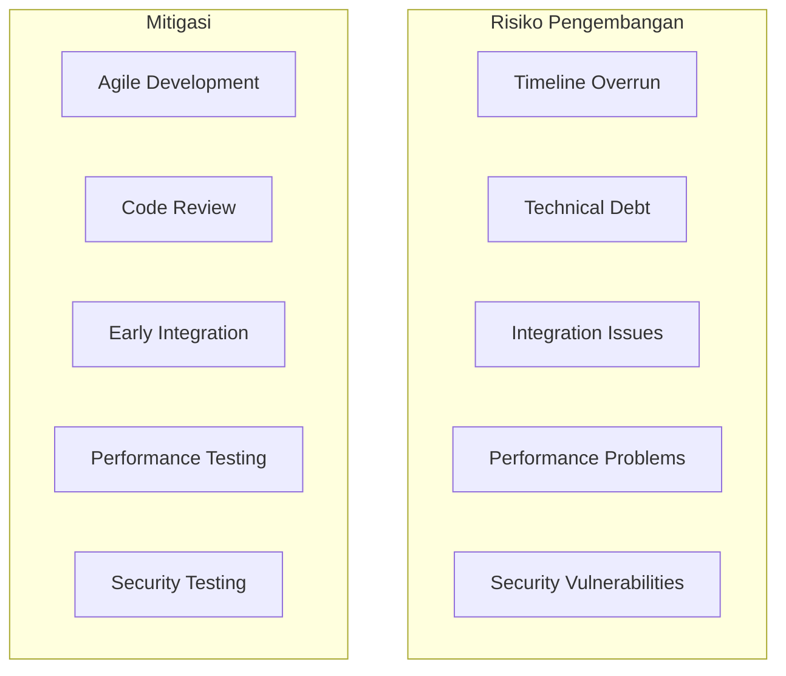

#### Detail Risiko dan Mitigasi

| Risiko                   | Probabilitas | Dampak | Mitigasi                                                                                                                     |
| ------------------------ | ------------ | ------ | ---------------------------------------------------------------------------------------------------------------------------- |
| Timeline Overrun         | Medium       | High   | - Agile development dengan sprint 2 minggu - Daily standups dan progress tracking - Buffer time 20% untuk setiap phase |
| Technical Debt           | Medium       | Medium | - Code review wajib untuk setiap PR - Automated testing (unit, integration) - Regular refactoring sessions             |
| Integration Issues       | Low          | High   | - Early integration testing - API-first development approach - Comprehensive documentation                             |
| Performance Problems     | Low          | Medium | - Load testing sejak awal - Performance monitoring - Database optimization                                             |
| Security Vulnerabilities | Low          | High   | - Regular security audits - Dependency scanning - Penetration testing                                                  |

### 1.2 Risiko Infrastruktur

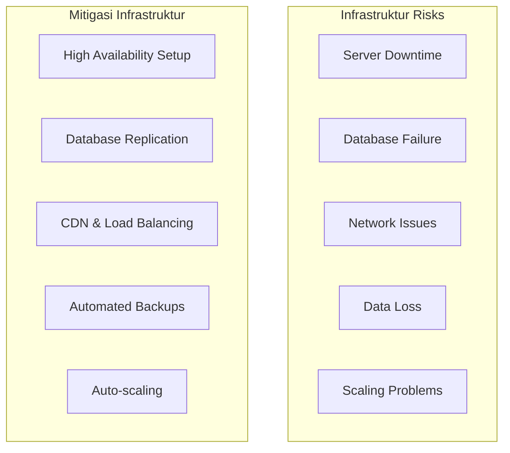

#### Mitigasi Infrastruktur

| Risiko           | Mitigasi                                                                                      | Timeline        |
| ---------------- | --------------------------------------------------------------------------------------------- | --------------- |
| Server Downtime  | - Multi-AZ deployment - Auto-scaling groups - Health checks dan auto-recovery           | Pre-deployment  |
| Database Failure | - Master-slave replication - Automated backups - Point-in-time recovery                 | Pre-deployment  |
| Network Issues   | - CDN untuk static assets - Load balancer dengan health checks - Multiple DNS providers | Pre-deployment  |
| Data Loss        | - Daily automated backups - Cross-region backup replication - Disaster recovery plan    | Ongoing         |
| Scaling Problems | - Auto-scaling berdasarkan metrics - Database read replicas - Caching strategy          | Post-deployment |

## 2. Risiko Bisnis

### 2.1 Risiko Operasional

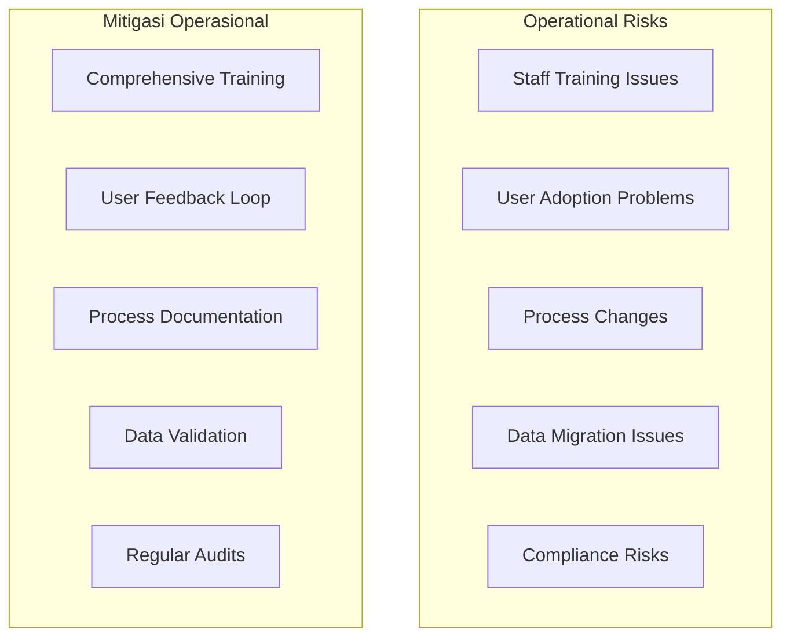

#### Detail Risiko Operasional

| Risiko          | Deskripsi                               | Mitigasi                                                                                                      |
| --------------- | --------------------------------------- | ------------------------------------------------------------------------------------------------------------- |
| Staff Training  | Staff tidak familiar dengan sistem baru | - Training program 2 minggu sebelum go-live - User manual dan video tutorial - Dedicated support person |
| User Adoption   | Member tidak menggunakan sistem         | - Beta testing dengan user feedback - Gamification elements - Incentive program                         |
| Process Changes | Resistance terhadap perubahan proses    | - Change management strategy - Communication plan - Pilot testing dengan staff                          |
| Data Migration  | Data lama tidak ter-migrate dengan baik | - Data validation tools - Parallel system running - Rollback plan                                       |
| Compliance      | Tidak sesuai regulasi syariah           | - Legal review sebelum implementasi - Regular compliance audits - Expert consultation                   |

### 2.2 Risiko Keuangan

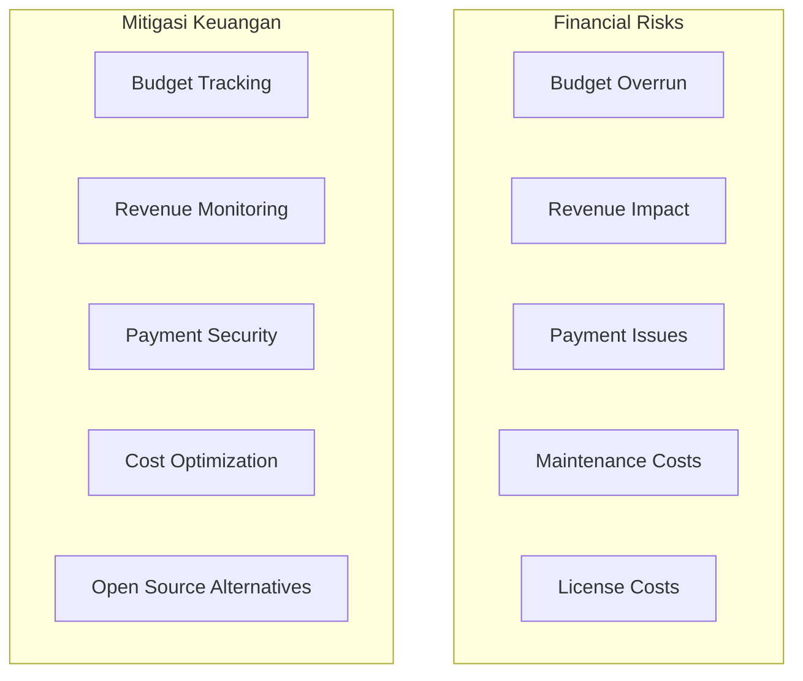

#### Mitigasi Risiko Keuangan

| Risiko            | Mitigasi                                                                                     | Monitoring |
| ----------------- | -------------------------------------------------------------------------------------------- | ---------- |
| Budget Overrun    | - Weekly budget reviews - Cost tracking tools - Alternative solutions                  | Monthly    |
| Revenue Impact    | - Revenue tracking dashboard - A/B testing untuk optimasi - Customer feedback analysis | Weekly     |
| Payment Issues    | - Multiple payment gateways - Payment monitoring tools - Fraud detection               | Daily      |
| Maintenance Costs | - Automated monitoring - Preventive maintenance - Cost optimization                    | Monthly    |
| License Costs     | - Open source alternatives - License usage optimization - Vendor negotiations          | Quarterly  |

## 3. Risiko Pasar

### 3.1 Risiko Kompetitif

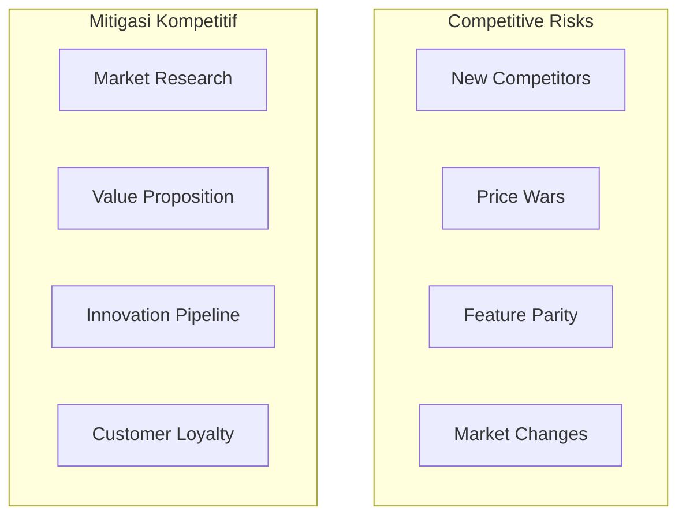

#### Strategi Kompetitif

| Risiko          | Strategi                                                                                       | Timeline  |
| --------------- | ---------------------------------------------------------------------------------------------- | --------- |
| New Competitors | - Unique value proposition (syariah) - Customer loyalty program - Market differentiation | Ongoing   |
| Price Wars      | - Value-based pricing - Premium service positioning - Cost leadership                    | Quarterly |
| Feature Parity  | - Innovation roadmap - Customer-driven features - Technology advantage                   | Monthly   |
| Market Changes  | - Market research - Flexible business model - Diversification strategy                   | Annually  |

### 3.2 Risiko Regulasi

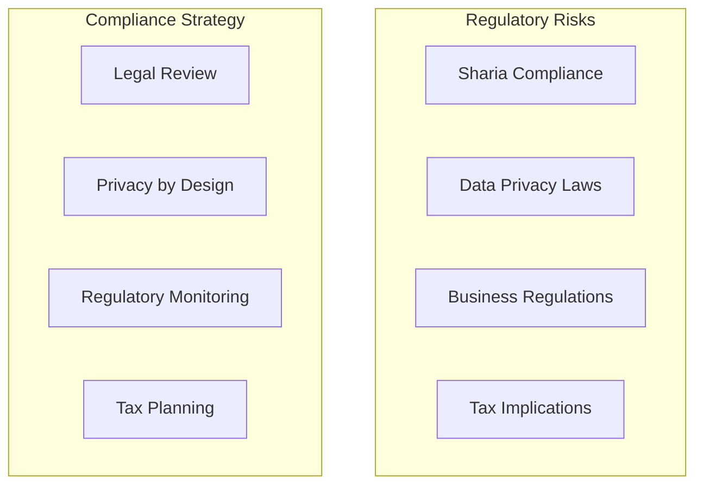

#### Compliance Framework

| Regulasi             | Requirement              | Compliance Strategy                                                            |
| -------------------- | ------------------------ | ------------------------------------------------------------------------------ |
| Sharia Compliance    | Halal business practices | - Sharia board review - Halal certification - Transparent pricing        |
| Data Privacy         | PDP Law compliance       | - Privacy by design - Data protection measures - User consent management |
| Business Regulations | Local business licenses  | - Legal consultation - License management - Regular compliance checks    |
| Tax Implications     | Proper tax reporting     | - Tax consultation - Automated reporting - Regular audits                |

## 4. Risiko Keamanan

### 4.1 Cybersecurity Risks

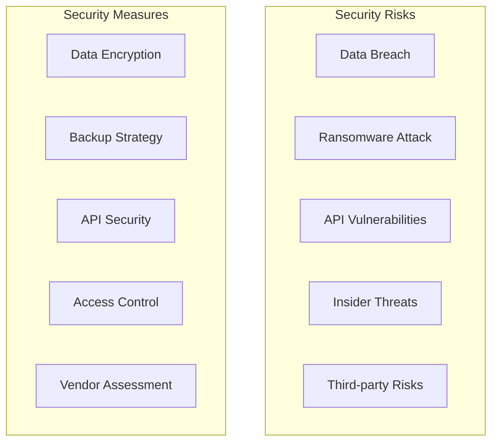

#### Security Framework

| Risiko              | Security Measures                                                                | Monitoring |
| ------------------- | -------------------------------------------------------------------------------- | ---------- |
| Data Breach         | - End-to-end encryption - Regular security audits - Incident response plan | 24/7       |
| Ransomware          | - Automated backups - Anti-malware protection - Employee training          | Daily      |
| API Vulnerabilities | - API security testing - Rate limiting - Input validation                  | Continuous |
| Insider Threats     | - Role-based access control - Audit logging - Background checks            | Regular    |
| Third-party Risks   | - Vendor security assessment - Contract security clauses - Regular reviews | Quarterly  |

### 4.2 Data Protection

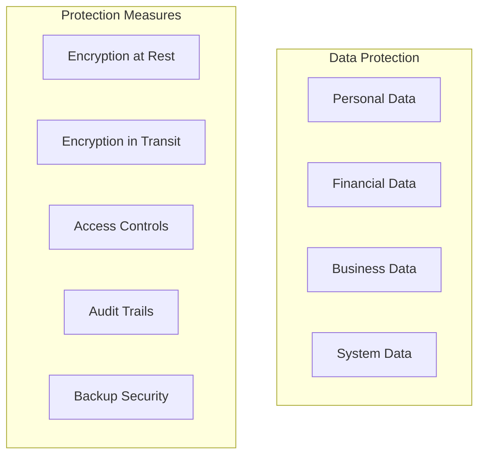

## 5. Risk Monitoring dan Response

### 5.1 Risk Monitoring Framework

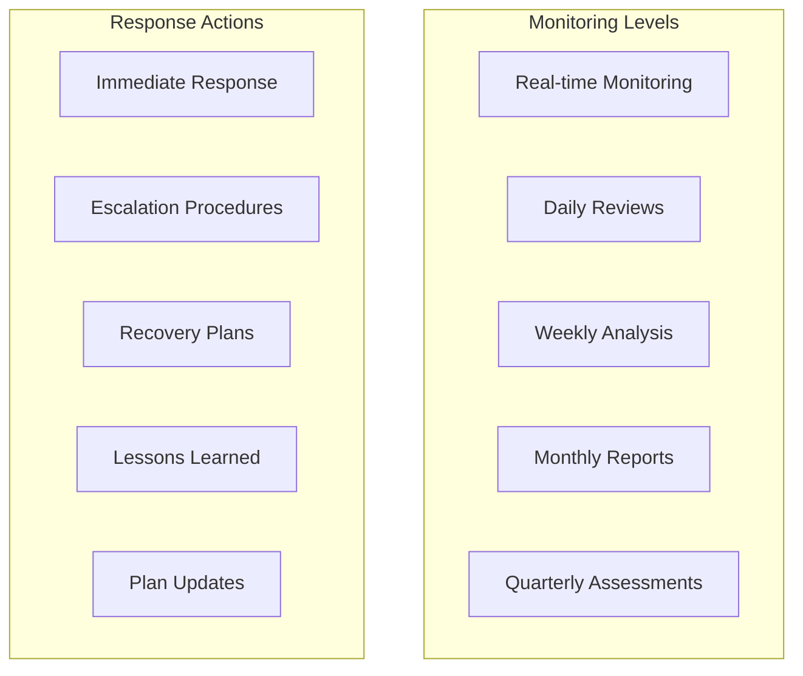

### 5.2 Risk Response Matrix

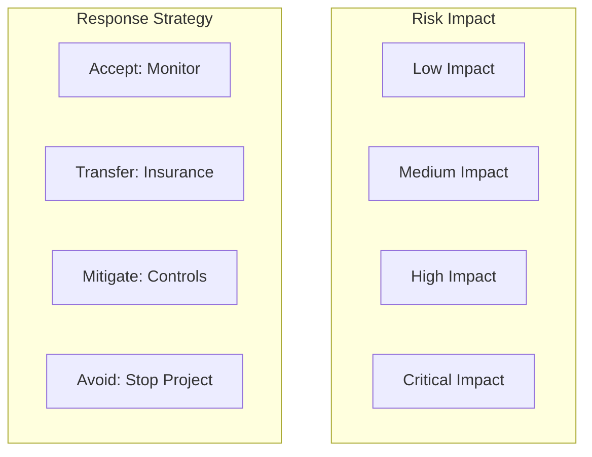

### 5.3 Escalation Procedures

| Risk Level | Response Time | Escalation Path     | Actions                                                                         |
| ---------- | ------------- | ------------------- | ------------------------------------------------------------------------------- |
| Low        | 24 hours      | Team Lead           | - Document issue - Implement mitigation - Monitor progress                |
| Medium     | 4 hours       | Project Manager     | - Immediate assessment - Resource allocation - Stakeholder notification   |
| High       | 1 hour        | Technical Lead + PM | - Emergency response team - Business continuity plan - Communication plan |
| Critical   | 15 minutes    | CTO + CEO           | - Crisis management - External support - Public communication             |

## 6. Business Continuity Plan

### 6.1 Disaster Recovery

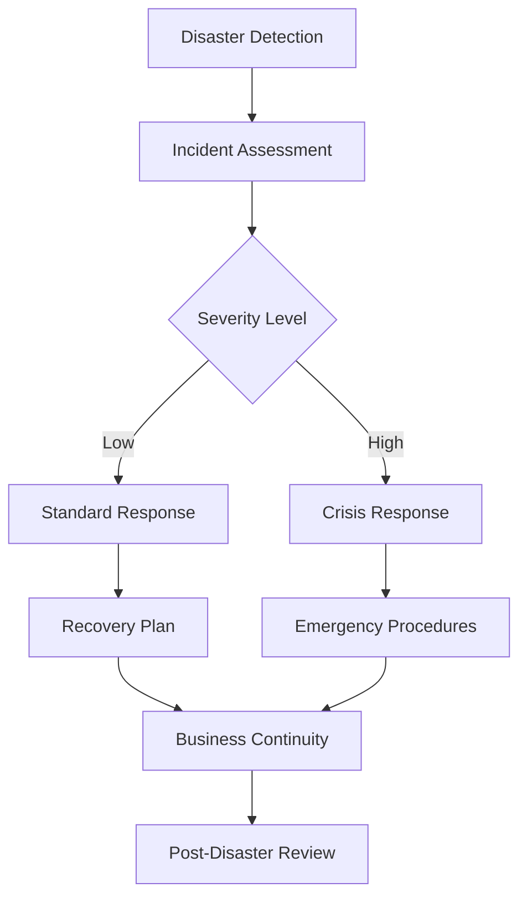

### 6.2 Recovery Time Objectives (RTO)

| System Component | RTO     | RPO     | Recovery Strategy                                                                    |
| ---------------- | ------- | ------- | ------------------------------------------------------------------------------------ |
| Database         | 4 hours | 1 hour  | - Automated backups - Point-in-time recovery - Standby database                |
| Application      | 2 hours | 0 hours | - Load balancer failover - Auto-scaling - Multi-region deployment              |
| Payment System   | 1 hour  | 0 hours | - Payment gateway redundancy - Manual payment processing - Offline backup      |
| Customer Support | 8 hours | N/A     | - Alternative communication channels - FAQ and self-service - External support |

## 7. Risk Register

### 7.1 Comprehensive Risk List

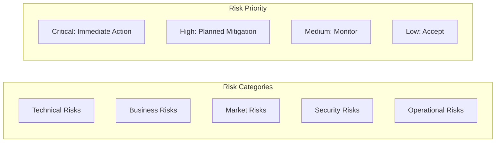

### 7.2 Risk Tracking Template

| Risk ID  | Risk Description  | Category  | Probability | Impact   | Risk Level | Owner            | Mitigation Strategy        | Status      |
| -------- | ----------------- | --------- | ----------- | -------- | ---------- | ---------------- | -------------------------- | ----------- |
| RISK-001 | System downtime   | Technical | Medium      | High     | High       | Tech Lead        | HA setup, monitoring       | In Progress |
| RISK-002 | Low user adoption | Business  | Medium      | High     | High       | Product Manager  | Training, incentives       | Planned     |
| RISK-003 | Data breach       | Security  | Low         | Critical | High       | Security Officer | Encryption, access control | Implemented |
| RISK-004 | Budget overrun    | Financial | Medium      | Medium   | Medium     | Project Manager  | Budget tracking            | Monitoring  |

---

**Versi**: 1.2  
**Tanggal**: 26 Agustus 2025  
**Status**: Complete dengan Dynamic Pricing, Guest Booking, Google SSO, Mobile-First Web App, Core Booking Flow, Manual Payment, Dynamic Member Quota & Member Daily Swimming Limit  
**Berdasarkan**: PDF Raujan Pool Syariah
