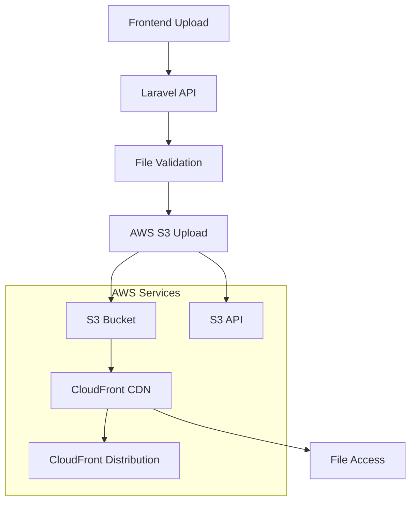
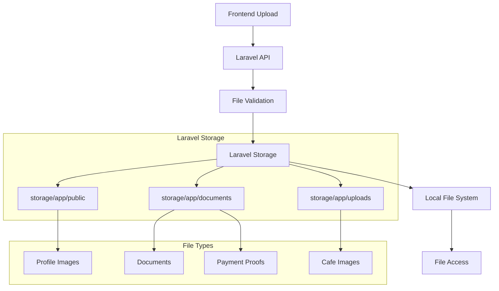
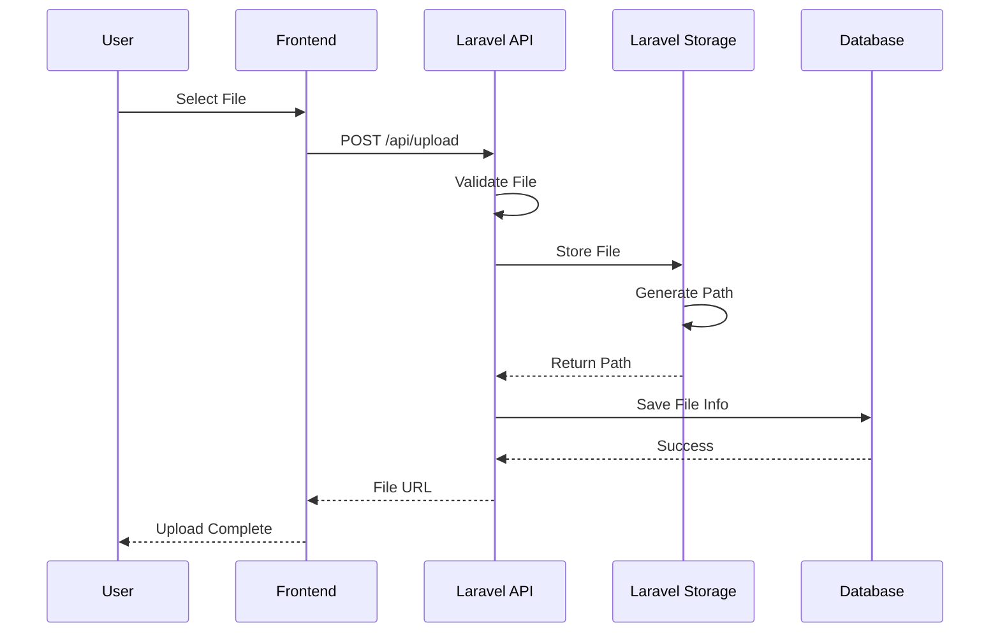
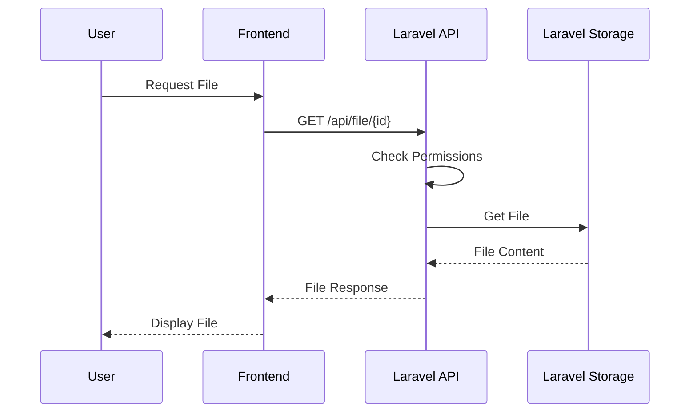
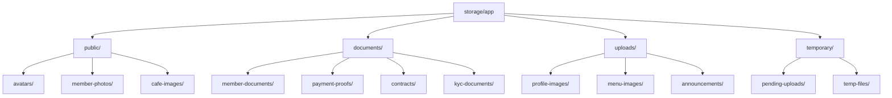
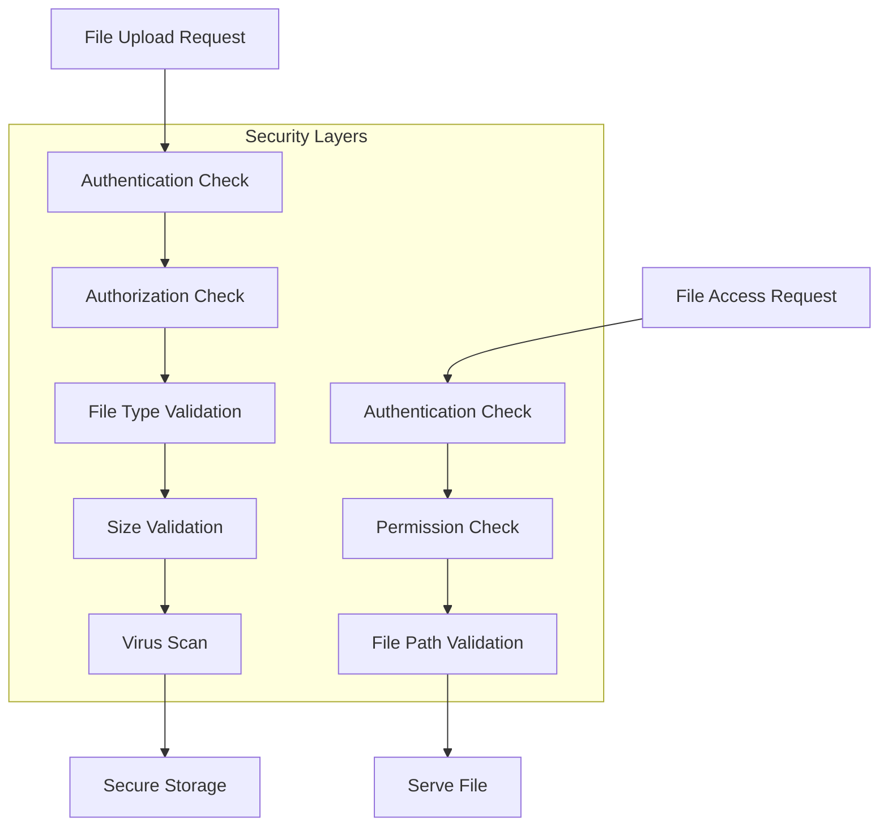
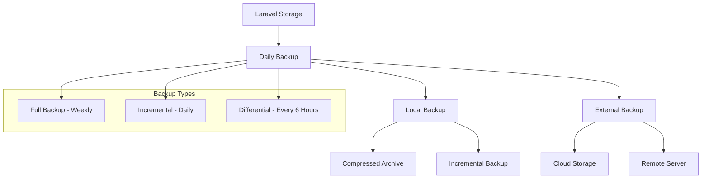
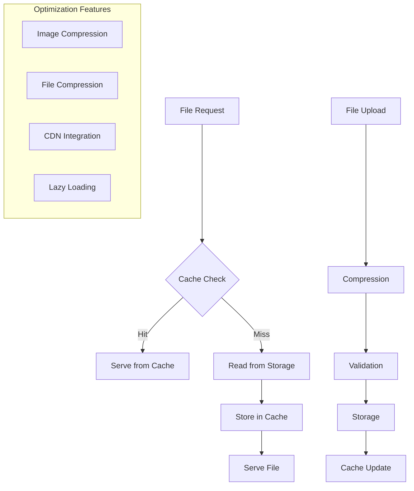
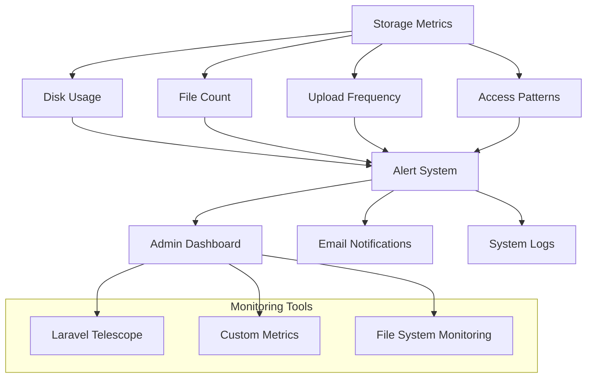

# File Storage Architecture Diagrams

## 📁 Laravel Storage Architecture

### **Before: AWS S3 Architecture**

### **After: Laravel Storage Architecture**

## 🔄 File Storage Flow

### **Upload Process**

### **File Access Process**

## 🗂️ Directory Structure

### **Laravel Storage Layout**

## 🔐 Security & Access Control

### **File Security Architecture**

## 📊 Backup Strategy

### **Backup Architecture**

## 🚀 Performance Optimization

### **File Storage Performance**

## 📈 Monitoring & Analytics

### **Storage Monitoring**

---

**Last Updated**: 26 Agustus 2025  
**Version**: 1.0  
**Status**: ✅ Implemented
