# Member Schema Revision - Diagrams

## 📊 Database Schema Diagram

### **New Database Structure**

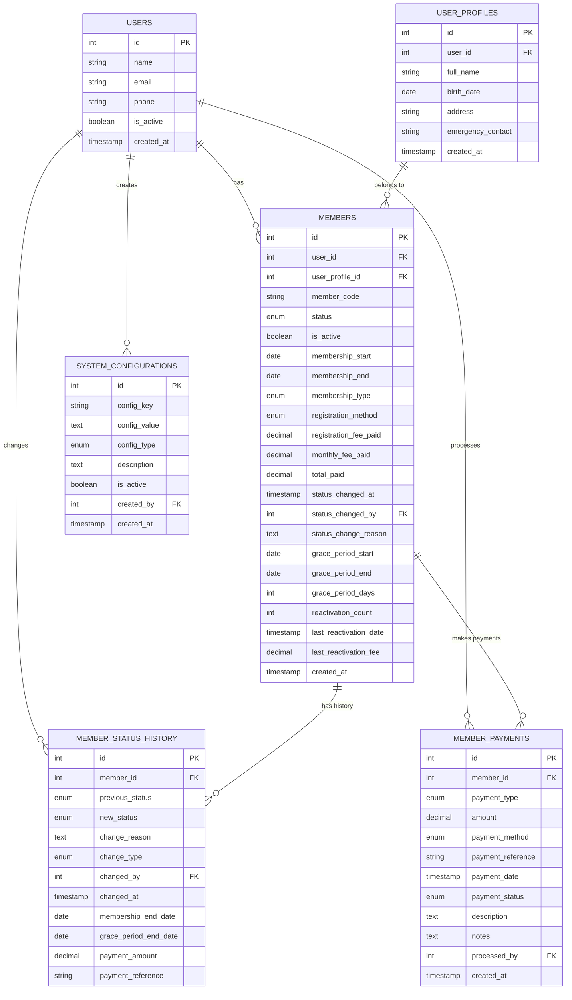

## 🔄 Member Lifecycle Flow

### **Member Status Lifecycle**

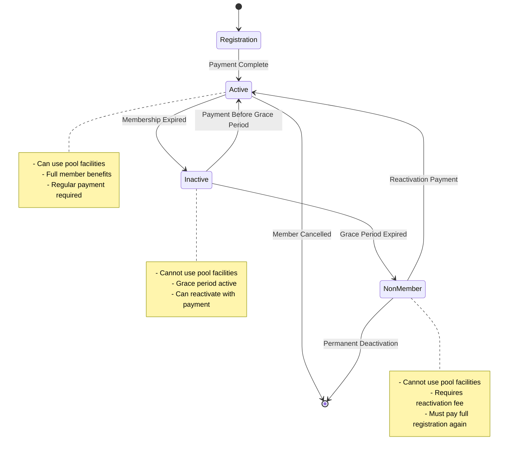

## 💰 Payment Flow Diagram

### **Registration Payment Flow**

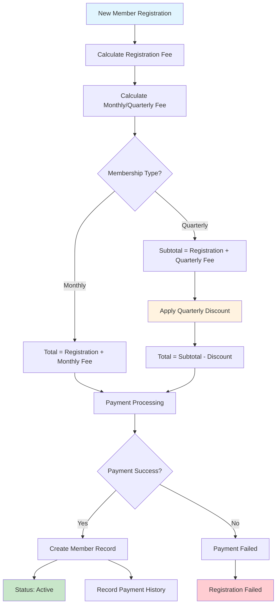

### **Reactivation Payment Flow**

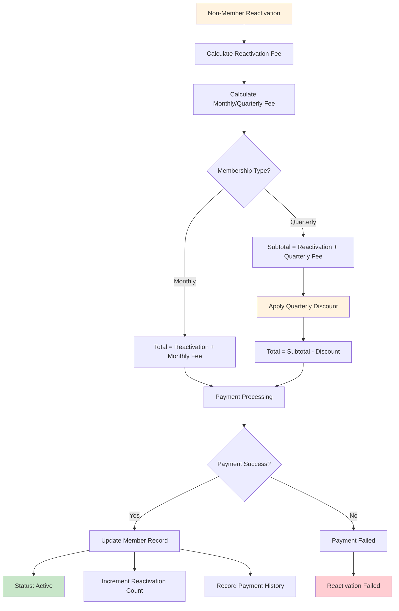

## ⚙️ System Configuration Flow

### **Configuration Management**

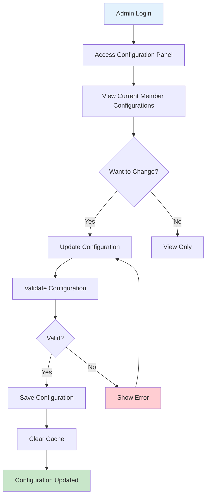

## 📊 Member Status Distribution

### **Status Change Timeline**

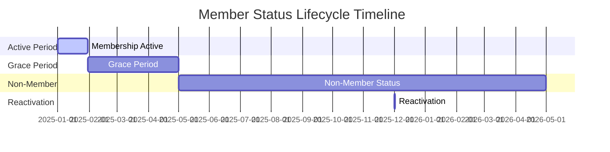

## 🔧 API Endpoint Flow

### **Member Registration API Flow**

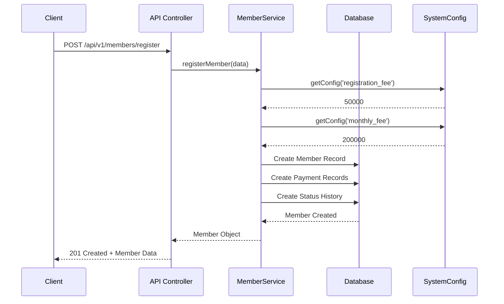

### **Member Reactivation API Flow**

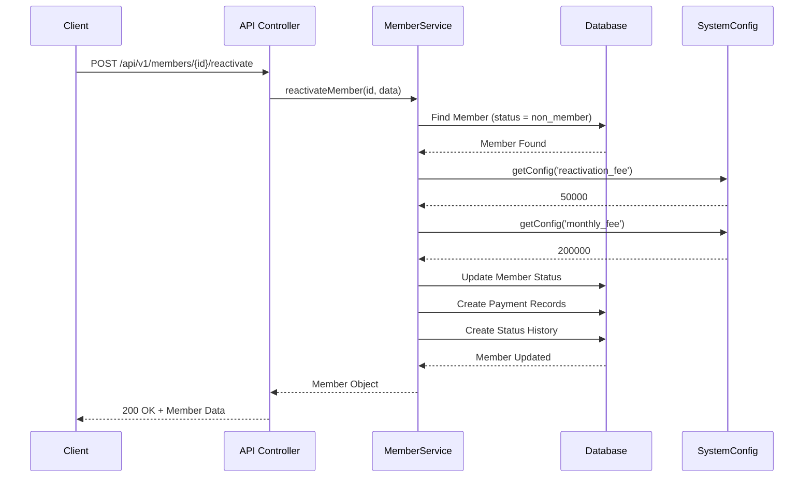

## 📈 Data Flow Diagram

### **Member Data Processing**

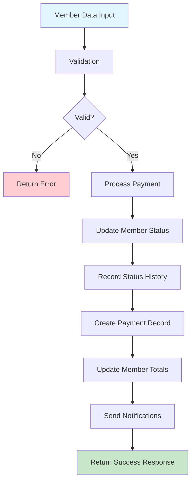

## 🎯 Business Rules Flow

### **Status Change Rules**

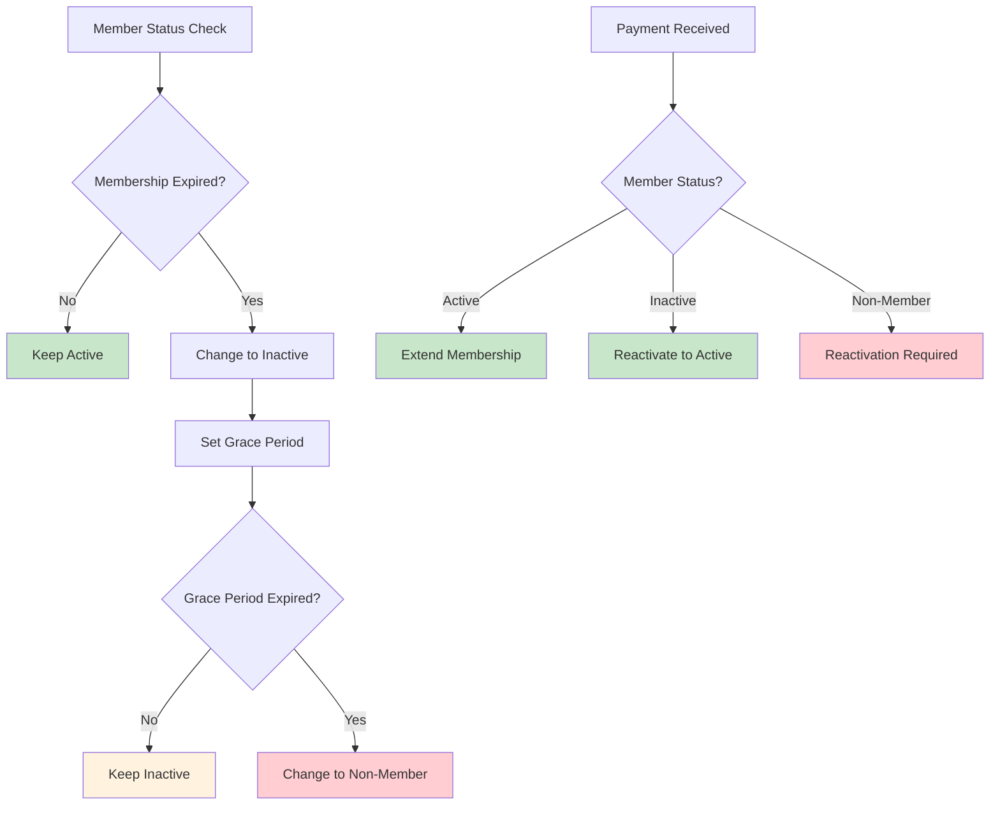

## 📊 Configuration Impact Diagram

### **Configuration Changes Impact**

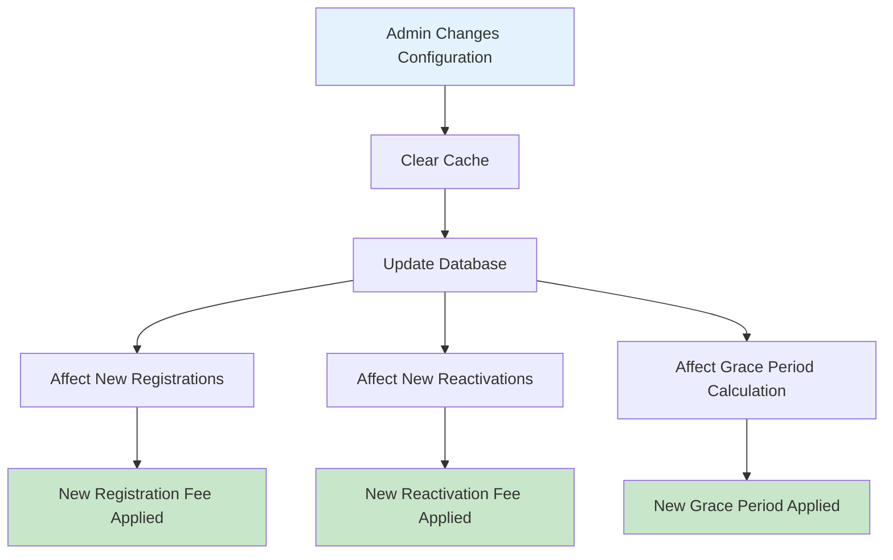

---

**Created**: January 15, 2025  
**Version**: 2.0  
**Status**: ✅ **COMPLETED**
