# Sistem Manajemen Kolam Renang Syariah - Index Analisa

## Overview

Dokumen ini berisi analisa komprehensif untuk pengembangan sistem manajemen kolam renang syariah yang mencakup manajemen member, reservasi, jadwal renang, dan mini cafe berdasarkan informasi dari Raujan Pool Syariah dengan **Dynamic Pricing System**, **Guest Booking System**, **Google SSO Integration**, **Rating & Review System**, **Check-in & Attendance System**, **Promotional Pricing System**, **Manual Payment System**, **Dynamic Member Quota Management**, **Member Daily Swimming Limit**, **Private Pool Rental System**, dan **Mobile-First Web Application** yang memungkinkan semua besaran biaya dapat dikonfigurasi secara fleksibel, mendukung booking untuk guest users tanpa registrasi, dan menyediakan sistem manajemen kolam renang yang lengkap.

## Daftar Dokumen Analisa

### 1. [Analisa Kebutuhan Sistem](./01-analisa-kebutuhan.md)

- Deskripsi umum sistem
- Stakeholder dan pengguna
- Kebutuhan fungsional dan non-fungsional
- Scope dan batasan sistem
- Prioritas pengembangan

### 2. [Analisa Domain dan Bisnis](./02-analisa-domain.md)

- Model bisnis kolam renang syariah
- **Dynamic Pricing System** dengan konfigurasi fleksibel
- Revenue streams dan pricing strategy
- Proses bisnis utama
- Aturan bisnis dan kendala
- Metrik kinerja
- Analisis kompetitif

### 3. [Analisa Fitur dan Modul](./03-analisa-fitur.md)

- Modul manajemen member dengan **dynamic package selection** dan **quota management**
- Modul reservasi dan booking dengan **real-time price calculation** dan **calendar interface**
- **Guest Booking System** dengan **multiple proof methods** dan **conversion path**
- **Google SSO Integration** untuk authentication dan **seamless conversion**
- **Rating & Review System** dengan **1-5 star rating** untuk semua pelayanan
- **Check-in & Attendance System** dengan **staff verification** dan **no-show detection**
- **Promotional Pricing System** dengan **flexible campaigns** dan **dynamic rules**
- **Manual Payment System** dengan **transfer bank** dan **admin verification**
- **Member Daily Swimming Limit** dengan **daily tracking** dan **admin override**
- **Private Pool Rental System** dengan **time-based rental** dan **new customer bonus**
- Modul mini cafe dengan **flexible menu pricing** dan **stock management**
- **Dynamic Pricing Management System** dengan **configurable rates**
- Modul laporan dan analytics dengan **comprehensive dashboards**
- Modul notifikasi dan compliance dengan **multi-channel notifications**

### 4. [Arsitektur Sistem](./04-arsitektur-sistem.md)

- Arsitektur **Mobile-First Web App** dengan **Progressive Web App (PWA)**
- **Laravel Backend** dengan API-first approach
- **React/Next.js Frontend** dengan TypeScript
- Database design dan API design
- Security architecture dengan **Google OAuth**
- **Push Notifications** via Firebase FCM
- Integration dan deployment strategy
- Performance dan scalability untuk mobile

### 5. [Desain Database (ERD)](./05-desain-database.md)

- Entity Relationship Diagram utama dengan **Dynamic Pricing Tables**
- **Guest User Management** dan **Booking Proof System**
- **Google SSO Integration** tables
- **Rating & Review System** tables
- **Check-in & Attendance System** tables
- **Promotional Pricing System** tables
- **Manual Payment System** tables
- **Dynamic Member Quota Management** tables
- **Member Daily Swimming Limit** tables
- **Private Pool Rental System** tables
- **Pricing Configuration** dan **Pricing Rules** system
- Detail struktur tabel database dengan konfigurasi fleksibel
- Index dan constraints
- Data seeding dan views
- Stored procedures dan triggers untuk semua sistem

### 6. [UML Diagrams](./06-uml-diagrams.md)

- Use Case Diagram (utama dan detail) dengan semua sistem terintegrasi
- Class Diagram dengan **Pricing Management Classes** dan semua business entities
- Sequence Diagram untuk semua sistem (registration, booking, cafe order, rating, check-in, payment)
- Activity Diagram (registration, booking, cafe order, member quota, daily limit, private pool)
- State Diagram (booking, cafe order, member status, payment status, attendance status)
- Component Diagram (system architecture) dengan semua services

### 7. [User Interface Design](./07-user-interface-design.md)

- **Mobile-First Design System** (color palette, typography, components)
- **Progressive Web App** design dengan offline capability
- **Calendar Interface Design** dengan forward-only navigation dan real-time status
- **Touch-Optimized** interface untuk mobile devices
- **Admin Dashboard** design untuk semua sistem management
- **Guest Booking Interface** dengan simple form dan multiple proof generation
- **Rating Interface** dengan interactive star rating
- **Check-in Interface** untuk staff dengan multiple verification methods
- Responsive design strategy untuk semua screen sizes
- Accessibility guidelines dan interactive elements

### 8. [Implementasi dan Testing](./08-implementasi-testing.md)

- Rencana implementasi dan timeline dengan **Laravel + React/Next.js**
- **Technology Stack Implementation** dengan TypeScript dan PWA
- **Calendar Interface Development** dengan real-time updates
- Testing strategy (unit, integration, E2E) dengan **Pest** dan **Jest**
- **Database Migration Strategy** untuk semua sistem
- Quality assurance dan security dengan comprehensive testing
- Deployment strategy dan CI/CD dengan GitHub Actions
- **Performance Optimization** untuk mobile dengan PWA features
- Monitoring dan maintenance dengan comprehensive logging

### 9. [Analisa Risiko dan Mitigasi](./09-risiko-dan-mitigasi.md)

- Risiko teknis dan infrastruktur untuk semua sistem
- Risiko bisnis dan operasional dengan comprehensive analysis
- Risiko pasar dan kompetitif dengan mitigation strategies
- Risiko keamanan dan compliance untuk data protection
- **Multi-system Risk Assessment** untuk integrated features
- Risk monitoring dan response dengan automated alerts
- Business continuity plan dengan disaster recovery

## Ringkasan Kunci

### Comprehensive Business Systems

- **Dynamic Pricing System**: Semua harga dapat dikonfigurasi melalui admin panel dengan real-time updates
- **Guest Booking System**: Booking tanpa registrasi dengan multiple proof methods (QR code, reference number, SMS, email)
- **Google SSO Integration**: Hybrid authentication dengan seamless guest-to-member conversion
- **Rating & Review System**: 1-5 star rating untuk semua pelayanan dengan analytics dashboard
- **Check-in & Attendance System**: Staff verification dengan attendance tracking dan no-show detection

### Advanced Member Management

- **Dynamic Member Quota**: Batas member dapat dikonfigurasi dengan sistem antrian otomatis
- **Member Daily Swimming Limit**: 1x gratis per hari, session tambahan berbayar dengan admin override
- **Expiry Management**: Notifikasi 3 hari sebelum expired, auto-deactivation setelah 3 hari
- **Queue System**: Sistem antrian dengan auto-promotion saat ada slot kosong

### Specialized Services

- **Private Pool Rental System**: Sewa kolam pribadi (1h 30min standard, 30min bonus untuk new customer)
- **Promotional Pricing System**: Flexible campaigns dengan berbagai tipe promosi
- **Manual Payment System**: Transfer bank dengan upload bukti dan admin verification
- **Mini Cafe Management**: Menu, stock management, dan order processing

### Technical Infrastructure

- **Mobile-First Web Application**: Progressive Web App dengan offline capability
- **Laravel + React/Next.js Stack**: Modern tech stack dengan TypeScript
- **Push Notifications**: Real-time notifications via Firebase FCM
- **Real-time Features**: Live availability updates dan booking status
- **Calendar Interface**: Forward-only navigation dengan real-time status indicators

### Technology Stack

- **Frontend**: React.js / Next.js, TypeScript, Tailwind CSS, Progressive Web App (PWA)
- **Backend**: Laravel 11, PHP 8.2+, MySQL 8.0, Redis 7.0
- **Authentication**: Laravel Sanctum, Google OAuth 2.0, Laravel Socialite
- **Infrastructure**: AWS (EC2, RDS, S3, CloudFront), CloudFlare
- **Payment**: Manual transfer system dengan admin verification
- **Notifications**: Firebase Cloud Messaging (FCM), Laravel Mail, Twilio SMS
- **Monitoring**: Laravel Telescope, New Relic, Sentry
- **Testing**: Laravel Pest, Jest, Laravel Dusk
- **Mobile-First**: Progressive Web App dengan responsive design dan offline support

### Timeline Pengembangan

- **Phase 1**: Foundation (Weeks 1-2) - Laravel + Next.js setup, Google SSO, Basic Auth
- **Phase 2**: Core Features (Weeks 3-6) - Member Management, Booking System, Calendar Interface
- **Phase 3**: Advanced Features (Weeks 7-10) - Guest Booking, Rating System, Check-in System
- **Phase 4**: Specialized Features (Weeks 11-13) - Private Pool Rental, Promotional Pricing, Daily Limits
- **Phase 5**: Integration & Testing (Weeks 14-15) - Manual Payment, Member Quota, PWA, Mobile optimization
- **Phase 6**: Deployment & Optimization (Weeks 16-17) - Performance optimization, monitoring, documentation

### Dynamic Pricing Benefits

- **Business Flexibility**: Mudah menyesuaikan harga sesuai kondisi pasar
- **Revenue Optimization**: Dapat mengoptimalkan pendapatan berdasarkan analisis data
- **Competitive Advantage**: Responsif terhadap perubahan kompetisi
- **Seasonal Management**: Mengelola fluktuasi musiman secara efektif
- **Promotional Agility**: Cepat meluncurkan promosi dan penawaran khusus

### Guest Booking Benefits

- **Lower Barrier to Entry**: Lebih mudah untuk customer baru
- **Higher Conversion Rate**: Lebih banyak booking karena low friction
- **Immediate Revenue**: Langsung dapat pendapatan tanpa registrasi
- **Guest to Member Conversion**: Natural path untuk member acquisition
- **Multiple Verification Methods**: Flexible proof system untuk guest users

### Google SSO Benefits

- **Quick Registration**: One-tap registration tanpa form panjang
- **Trust Factor**: User familiar dengan Google authentication
- **Mobile-First**: Sesuai dengan target mobile app
- **Conversion Rate**: Memudahkan guest to member conversion
- **Profile Sync**: Otomatis sync data dari Google

### Mobile-First Web App Benefits

- **Progressive Web App**: Install sebagai app di mobile device
- **Offline Capability**: Core functionality works offline
- **Push Notifications**: Real-time notifications via FCM
- **Touch-Optimized**: Mobile-friendly touch interface
- **Fast Loading**: Optimized untuk slow mobile connections
- **Responsive Design**: Works perfectly on all screen sizes

### Laravel + React/Next.js Benefits

- **Laravel Backend**: Robust PHP framework dengan built-in features
- **API-First**: Clean RESTful API dengan Laravel Sanctum
- **TypeScript Frontend**: Type-safe development dengan Next.js
- **Server-Side Rendering**: Better SEO dan performance
- **PWA Support**: Native app-like experience
- **Mobile Optimization**: Built for mobile-first approach

### Risk Management

- **Technical Risks**: Timeline overrun, technical debt, integration issues
- **Business Risks**: User adoption, staff training, compliance
- **Security Risks**: Data breach, API vulnerabilities, insider threats
- **Mitigation Strategy**: Comprehensive testing, training programs, security measures

## Status Dokumen

| Dokumen                   | Status     | Versi | Tanggal Update | Dynamic Pricing | Guest Booking | Google SSO | Laravel Stack | Calendar Flow | Rating System | Check-in System | Promo System | Manual Payment | Member Quota | Daily Limit | Private Pool |
| ------------------------- | ---------- | ----- | -------------- | --------------- | ------------- | ---------- | ------------- | ------------- | ------------- | --------------- | ------------ | -------------- | ------------ | ----------- | ------------ |
| 01 - Analisa Kebutuhan    | ✅ Selesai | 1.2   | 26/08/2025     | ✅              | ✅            | ✅         | ✅            | ✅            | ✅            | ✅              | ✅           | ✅             | ✅           | ✅          | ✅           |
| 02 - Analisa Domain       | ✅ Selesai | 1.3   | 26/08/2025     | ✅ Dynamic      | ✅            | ✅         | ✅            | ✅            | ✅            | ✅              | ✅           | ✅             | ✅           | ✅          | ✅           |
| 03 - Analisa Fitur        | ✅ Selesai | 1.6   | 26/08/2025     | ✅ Dynamic      | ✅ Guest      | ✅ SSO     | ✅            | ✅ Calendar   | ✅ Rating     | ✅ Check-in     | ✅ Promo     | ✅ Manual      | ✅ Quota     | ✅ Daily    | ✅ Private   |
| 04 - Arsitektur Sistem    | ✅ Selesai | 1.3   | 26/08/2025     | ✅              | ✅            | ✅         | ✅ Laravel    | ✅            | ✅            | ✅              | ✅           | ✅             | ✅           | ✅          | ✅           |
| 05 - Desain Database      | ✅ Selesai | 1.6   | 26/08/2025     | ✅ Pricing      | ✅ Guest      | ✅ SSO     | ✅            | ✅ Calendar   | ✅ Rating     | ✅ Check-in     | ✅ Promo     | ✅ Manual      | ✅ Quota     | ✅ Daily    | ✅ Private   |
| 06 - UML Diagrams         | ✅ Selesai | 1.3   | 26/08/2025     | ✅              | ✅            | ✅         | ✅            | ✅ Calendar   | ✅ Rating     | ✅ Check-in     | ✅ Promo     | ✅ Manual      | ✅ Quota     | ✅ Daily    | ✅ Private   |
| 07 - UI Design            | ✅ Selesai | 1.3   | 26/08/2025     | ✅              | ✅            | ✅         | ✅            | ✅ Calendar   | ✅ Rating     | ✅ Check-in     | ✅ Promo     | ✅ Manual      | ✅ Quota     | ✅ Daily    | ✅ Private   |
| 08 - Implementasi Testing | ✅ Selesai | 1.4   | 26/08/2025     | ✅              | ✅            | ✅         | ✅ Laravel    | ✅ Calendar   | ✅ Rating     | ✅ Check-in     | ✅ Promo     | ✅ Manual      | ✅ Quota     | ✅ Daily    | ✅ Private   |
| 09 - Risiko dan Mitigasi  | ✅ Selesai | 1.2   | 26/08/2025     | ✅              | ✅            | ✅         | ✅            | ✅            | ✅ Rating     | ✅ Check-in     | ✅ Promo     | ✅ Manual      | ✅ Quota     | ✅ Daily    | ✅ Private   |

## Komponen Diagram

```mermaid
graph TB
    subgraph "Dokumen Analisa"
        A1[Analisa Kebutuhan]
        A2[Analisa Domain]
        A3[Analisa Fitur]
    end

    subgraph "Dokumen Design"
        D1[Arsitektur Sistem]
        D2[Desain Database]
        D3[UML Diagrams]
        D4[UI Design]
    end

    subgraph "Dokumen Implementasi"
        I1[Implementasi Testing]
        I2[Timeline]
        I3[Technology Stack]
    end

    subgraph "Dokumen Risk Management"
        R1[Analisa Risiko]
        R2[Mitigasi Strategy]
        R3[Business Continuity]
    end

    subgraph "Dynamic Pricing System"
        P1[Pricing Configuration]
        P2[Rule Engine]
        P3[Price Calculation]
        P4[Admin Interface]
    end

    subgraph "Guest Booking System"
        G1[Guest Management]
        G2[Proof Generation]
        G3[Verification System]
        G4[Conversion Path]
    end

    subgraph "Rating & Review System"
        R1[Rating Management]
        R2[Review Processing]
        R3[Analytics Dashboard]
    end

    subgraph "Check-in & Attendance"
        C1[Staff Verification]
        C2[Attendance Tracking]
        C3[No-show Detection]
    end

    subgraph "Promotional System"
        PR1[Campaign Management]
        PR2[Promo Rules]
        PR3[Analytics]
    end

    subgraph "Manual Payment System"
        MP1[Payment Processing]
        MP2[Admin Verification]
        MP3[Proof Management]
    end

    subgraph "Member Management"
        MM1[Quota Management]
        MM2[Daily Limits]
        MM3[Queue System]
    end

    subgraph "Private Pool Rental"
        PP1[Booking System]
        PP2[Time Management]
        PP3[Pricing Rules]
    end

    subgraph "Google SSO Integration"
        S1[OAuth Flow]
        S2[Profile Sync]
        S3[Token Management]
        S4[Security]
    end

    subgraph "Mobile-First Web App"
        M1[Progressive Web App]
        M2[Push Notifications]
        M3[Offline Support]
        M4[Touch Interface]
    end

    A1 --> D1
    A2 --> D2
    A3 --> D3
    D1 --> I1
    D2 --> I2
    D3 --> I3
    D4 --> I1
    I1 --> R1
    I2 --> R2
    I3 --> R3

    A2 --> P1
    D2 --> P2
    I1 --> P3
    D4 --> P4

    A3 --> G1
    D2 --> G2
    I1 --> G3
    A3 --> G4

    A3 --> S1
    D2 --> S2
    I1 --> S3
    A3 --> S4

    A3 --> M1
    D1 --> M2
    I1 --> M3
    D4 --> M4

    A3 --> R1
    D2 --> R2
    I1 --> R3

    A3 --> C1
    D2 --> C2
    I1 --> C3

    A3 --> PR1
    D2 --> PR2
    I1 --> PR3

    A3 --> MP1
    D2 --> MP2
    I1 --> MP3

    A3 --> MM1
    D2 --> MM2
    I1 --> MM3

    A3 --> PP1
    D2 --> PP2
    I1 --> PP3
```

## Next Steps

Setelah dokumen analisa komprehensif ini selesai dengan semua sistem terintegrasi (**Dynamic Pricing**, **Guest Booking**, **Google SSO**, **Mobile-First Web App**, **Rating System**, **Check-in & Attendance**, **Promotional Pricing**, **Manual Payment**, **Dynamic Member Quota**, **Member Daily Swimming Limit**, dan **Private Pool Rental System**), langkah selanjutnya adalah:

1. **Review dan Approval**: Diskusikan dengan stakeholder untuk semua sistem
2. **Detailed Design**: Membuat wireframe dan mockup detail untuk semua interface
3. **Technical Specification**: Spesifikasi teknis detail untuk semua sistem
4. **Development Setup**: Setup Laravel + React/Next.js environment dan repository
5. **Sprint Planning**: Perencanaan sprint development dengan semua fitur
6. **Implementation**: Mulai implementasi sesuai timeline yang telah direncanakan
7. **Database Migration**: Setup database dengan semua tabel dan stored procedures
8. **Testing Strategy**: Implementasi testing untuk semua fitur (unit, integration, E2E)
9. **Deployment Preparation**: Setup CI/CD pipeline dan deployment strategy
10. **Documentation**: Dokumentasi lengkap untuk maintenance dan future development

## Dynamic Pricing Implementation Priority

### Phase 1: Core Pricing System

- Pricing configuration tables
- Basic admin interface
- Real-time price calculation
- Member discount system

### Phase 2: Advanced Pricing Features

- Rule engine implementation
- Seasonal pricing adjustments
- Promotional pricing system
- Pricing analytics

### Phase 3: Optimization Features

- Pricing optimization algorithms
- Competitive pricing analysis
- Revenue maximization tools
- Advanced reporting

## Guest Booking Implementation Priority

### Phase 1: Basic Guest System

- Guest user management tables
- Quick booking form
- Basic proof generation (reference number, SMS)
- Staff verification interface

### Phase 2: Enhanced Proof System

- QR code generation dan verification
- Email receipt system
- Digital receipt PDF
- Multiple verification methods

### Phase 3: Conversion System

- Guest to member conversion tracking
- Account creation prompts (traditional + Google SSO)
- Member upgrade incentives
- Conversion analytics

## Google SSO Implementation Priority

### Phase 1: Basic SSO Integration

- Google OAuth 2.0 setup
- User authentication flow
- Profile synchronization
- Token management

### Phase 2: Enhanced SSO Features

- Guest to member conversion via Google
- Profile merge functionality
- SSO analytics tracking
- Security enhancements

## Mobile-First Web App Implementation Priority

### Phase 1: PWA Foundation

- Service worker setup
- Web app manifest
- Basic offline functionality
- Mobile-responsive design

### Phase 2: Enhanced Mobile Features

- Push notifications
- Touch gesture optimization
- Performance optimization
- Advanced offline capabilities

## Member Daily Swimming Limit Implementation Priority

### Phase 1: Core Limit System

- Daily usage tracking database
- Limit checking logic
- Booking validation system
- Member session history tracking

### Phase 2: Payment Integration

- Additional session pricing
- Manual payment integration
- Revenue tracking
- Payment confirmation flow

### Phase 3: Admin Features

- Limit override system
- Usage analytics dashboard
- Reporting tools
- Admin notification system

### Phase 4: Advanced Features

- Automatic daily reset
- Usage pattern analysis
- Member behavior insights
- Revenue optimization tools

## Private Pool Rental System Implementation Priority

### Phase 1: Core Rental System

- Private pool booking database
- Customer classification system
- Time-based rental logic (1h 30min standard)
- Bonus time application (30min for new customers)

### Phase 2: Dynamic Pricing System

- Additional charge calculation
- Visit counter tracking
- Configurable pricing rules
- Customer history management

### Phase 3: Booking & Management

- Private pool availability calendar
- Conflict prevention system
- Timer management
- Payment integration

### Phase 4: Analytics & Optimization

- Usage analytics dashboard
- Customer behavior analysis
- Revenue optimization
- Performance monitoring

## Bukti Booking untuk Guest Users

### Multiple Proof Methods

1. **🎫 Booking Reference Number** - Format: RJS-YYYYMMDD-XXXX
2. **📱 SMS Confirmation** - Instant proof via phone
3. **📧 Email Receipt** - Detailed confirmation dengan QR code
4. **📱 QR Code** - Easy verification untuk staff
5. **📄 Digital Receipt** - Professional receipt format
6. **📞 Phone Verification** - Backup method untuk staff

### Verification Methods

- **Primary**: QR code scan dengan real-time verification
- **Secondary**: Reference number lookup dengan detailed booking info
- **Tertiary**: Phone number search dengan booking history
- **Quaternary**: Email verification dengan booking details
- **Staff Interface**: Dedicated staff verification dashboard

### Payment Confirmation

- **Manual Transfer**: Upload bukti transfer
- **Admin Verification**: Konfirmasi pembayaran oleh admin
- **Payment Status**: Real-time status updates
- **Receipt Generation**: Digital receipt dengan payment confirmation

## Comprehensive System Integration

### Integrated Business Flow

1. **Guest Booking Flow**: No registration → Quick booking → Multiple proofs → Check-in → Rating
2. **Member Management Flow**: Registration → Quota management → Daily limits → Expiry tracking → Queue system
3. **Payment Processing Flow**: Manual transfer → Proof upload → Admin verification → Confirmation → Receipt
4. **Private Pool Rental Flow**: Customer classification → Time calculation → Dynamic pricing → Booking → Timer management
5. **Promotional System Flow**: Campaign creation → Rule application → Price calculation → Usage tracking → Analytics

### Cross-System Features

- **Unified Authentication**: Traditional login + Google SSO untuk semua user types
- **Real-time Notifications**: Multi-channel notifications (SMS, Email, Push) untuk semua events
- **Comprehensive Analytics**: Integrated dashboard untuk semua business metrics
- **Mobile-First Design**: Consistent mobile experience untuk semua features
- **Dynamic Configuration**: Admin panel untuk mengatur semua sistem parameters

### Data Integration

- **Centralized User Management**: Single user system untuk guest, member, staff, admin
- **Unified Booking System**: Integrated calendar untuk regular dan private pool bookings
- **Comprehensive Payment Tracking**: All payment methods dalam single system
- **Integrated Reporting**: Unified reporting untuk semua business activities
- **Real-time Sync**: All systems synchronized dalam real-time

## Kontak dan Support

Untuk pertanyaan atau klarifikasi terkait dokumen analisa ini, khususnya tentang semua sistem terintegrasi (**Dynamic Pricing**, **Guest Booking**, **Google SSO**, **Rating System**, **Check-in & Attendance**, **Promotional Pricing**, **Manual Payment**, **Dynamic Member Quota**, **Member Daily Swimming Limit**, **Private Pool Rental System**, dan **Mobile-First Web App**), silakan menghubungi tim development atau stakeholder terkait.

---

**Versi**: 2.0  
**Tanggal**: 26 Agustus 2025  
**Status**: Complete dengan semua sistem terintegrasi: Dynamic Pricing, Guest Booking, Google SSO, Mobile-First Web App, Core Booking Flow, Rating System, Check-in & Attendance, Promotional Pricing, Manual Payment, Dynamic Member Quota, Member Daily Swimming Limit, Private Pool Rental System, dan Comprehensive System Integration  
**Berdasarkan**: PDF Raujan Pool Syariah  
**Key Features**:

- ✨ **Semua besaran biaya dapat dikonfigurasi secara dinamis**
- 🎫 **Sistem bukti booking lengkap untuk guest users**
- 📅 **Calendar interface dengan forward-only navigation**
- 🔄 **Real-time availability tracking dan capacity management**
- 🔐 **Google SSO integration untuk seamless authentication**
- 📱 **Mobile-first web app dengan PWA support**
- 🔔 **Push notifications via Firebase FCM**
- ⚡ **Laravel backend + React/Next.js frontend stack**
- ⭐ **Rating system bintang 1-5 untuk semua pelayanan**
- ✅ **Check-in & attendance system dengan staff verification**
- 🎁 **Promotional pricing system dengan flexible campaigns**
- 💳 **Manual payment system dengan transfer bank & admin verification**
- 👥 **Dynamic member quota management dengan sistem antrian**
- 🏊‍♂️ **Member daily swimming limit (1x/hari gratis, additional session berbayar)**
- 🏊‍♀️ **Private pool rental system (1h 30min standard, 30min bonus untuk new customer, dynamic additional charges)**

### Core Booking Flow System

- **Landing Page** → **Klik Tombol Reservasi** → **Calendar Interface**
- **Calendar Navigation**: Forward-only (tidak bisa ke bulan lalu)
- **Date Status**: Visual indicators untuk available/full/partial/closed
- **Session Selection**: Morning (06:00-12:00) & Afternoon (13:00-19:00)
- **Capacity Management**: 10 Adults + 10 Children per session
- **Real-time Availability**: Live updates untuk concurrent users
- **User Registration**: Guest form, Member login, atau Google SSO
- **Booking Confirmation**: QR code, reference number, multiple proofs
- **Payment Processing**: Manual transfer dengan admin verification
- **Check-in Process**: Staff verification dengan multiple methods
- **Rating System**: Post-visit rating untuk semua pelayanan

### Calendar Interface Features

- **Mobile-First Design**: Touch-optimized dengan minimum 44px targets
- **Forward-only Navigation**: Tidak bisa akses bulan yang sudah lewat
- **Status Indicators**: Visual coding untuk availability (hijau/orange/merah/abu-abu)
- **Real-time Updates**: WebSocket untuk live availability changes
- **Session Details**: Modal dengan capacity information dan booking counts
- **Private Pool Availability**: Separate calendar untuk private pool rental
- **Promotional Indicators**: Visual indicators untuk hari dengan promosi
- **Member Limit Status**: Status untuk member daily limits
- **Responsive Layout**: Optimized untuk mobile, tablet, dan desktop

### Session Management

- **Morning Session**: 06:00-12:00 (10 dewasa + 10 anak)
- **Afternoon Session**: 13:00-19:00 (10 dewasa + 10 anak)
- **Private Pool Rental**: 1h 30min standard, 30min bonus untuk new customer
- **Capacity Tracking**: Real-time slot availability
- **Overbooking Prevention**: Concurrent booking protection
- **Member Daily Limits**: 1x gratis per hari, additional session berbayar
- **Alternative Suggestions**: Jika session full, suggest tanggal lain
- **Promotional Sessions**: Special pricing untuk hari tertentu
