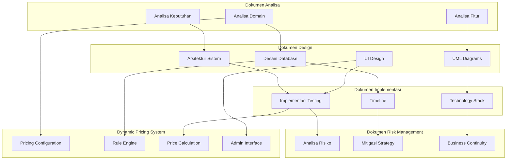

# Sistem Manajemen Kolam Renang Syariah - Index Analisa

## Overview

Dokumen ini berisi analisa komprehensif untuk pengembangan sistem manajemen kolam renang syariah yang mencakup manajemen member, reservasi, jadwal renang, dan mini cafe berdasarkan informasi dari Raujan Pool Syariah dengan **Dynamic Pricing System** yang memungkinkan semua besaran biaya dapat dikonfigurasi secara fleksibel.

## Daftar Dokumen Analisa

### 1. [Analisa Kebutuhan Sistem](./01-analisa-kebutuhan.md)

- Deskripsi umum sistem
- Stakeholder dan pengguna
- Kebutuhan fungsional dan non-fungsional
- Scope dan batasan sistem
- Prioritas pengembangan

### 2. [Analisa Domain dan Bisnis](./02-analisa-domain.md)

- Model bisnis kolam renang syariah
- **Dynamic Pricing System** dengan konfigurasi fleksibel
- Revenue streams dan pricing strategy
- Proses bisnis utama
- Aturan bisnis dan kendala
- Metrik kinerja
- Analisis kompetitif

### 3. [Analisa Fitur dan Modul](./03-analisa-fitur.md)

- Modul manajemen member dengan **dynamic package selection**
- Modul reservasi dan booking dengan **real-time price calculation**
- Modul mini cafe dengan **flexible menu pricing**
- **Dynamic Pricing Management System**
- Modul pembayaran dengan **configurable rates**
- Modul laporan dan analytics
- Modul notifikasi dan compliance

### 4. [Arsitektur Sistem](./04-arsitektur-sistem.md)

- Arsitektur 3-tier dan microservices
- Teknologi stack (frontend, backend, infrastructure)
- Database design dan API design
- Security architecture
- Integration dan deployment strategy
- Performance dan scalability

### 5. [Desain Database (ERD)](./05-desain-database.md)

- Entity Relationship Diagram utama dengan **Dynamic Pricing Tables**
- **Pricing Configuration** dan **Pricing Rules** system
- Detail struktur tabel database dengan konfigurasi fleksibel
- Index dan constraints
- Data seeding dan views
- Stored procedures dan triggers untuk **dynamic pricing calculation**

### 6. [UML Diagrams](./06-uml-diagrams.md)

- Use Case Diagram (utama dan detail)
- Class Diagram dengan **Pricing Management Classes**
- Sequence Diagram (registration, booking, cafe order)
- Activity Diagram (registration, booking, cafe order)
- State Diagram (booking, cafe order, member status)
- Component Diagram (system architecture)

### 7. [User Interface Design](./07-user-interface-design.md)

- Design system (color palette, typography, components)
- Mobile application design
- Web application design
- Responsive design strategy
- Accessibility guidelines
- Interactive elements dan animations

### 8. [Implementasi dan Testing](./08-implementasi-testing.md)

- Rencana implementasi dan timeline
- Technology stack implementation
- Testing strategy (unit, integration, E2E)
- Quality assurance dan security
- Deployment strategy dan CI/CD
- Monitoring dan maintenance

### 9. [Analisa Risiko dan Mitigasi](./09-risiko-dan-mitigasi.md)

- Risiko teknis dan infrastruktur
- Risiko bisnis dan operasional
- Risiko pasar dan kompetitif
- Risiko keamanan dan compliance
- Risk monitoring dan response
- Business continuity plan

## Ringkasan Kunci

### Dynamic Business Model

- **Flexible Pricing System**: Semua harga dapat dikonfigurasi melalui admin panel
- **Real-time Price Updates**: Perubahan harga langsung aktif tanpa restart sistem
- **Configurable Packages**: Paket keanggotaan dan sesi dapat disesuaikan
- **Seasonal Adjustments**: Harga dapat berubah berdasarkan musim/waktu
- **Promotional Pricing**: Sistem mendukung harga promosi yang fleksibel

### Default Pricing Configuration

- **Member**: Configurable base price (default: Rp 200.000/bulan atau Rp 500.000/3 bulan)
- **Reguler**: Configurable rates (default: Rp 25.000/dewasa weekday, Rp 30.000/dewasa weekend)
- **Private Silver**: Configurable package (default: Rp 200.000/sesi - 1,5 jam, 5 dewasa + 5 anak)
- **Private Gold**: Configurable package (default: Rp 400.000/sesi - 3 jam, 10 dewasa + 10 anak)
- **Cafe**: Dynamic menu pricing dengan cost-based calculation

### Kapasitas Operasional

- **Reguler**: Maksimal 20 orang/hari (10 per sesi) - **Configurable**
- **Member**: Kuota maksimal 100 member aktif - **Configurable**
- **Jadwal**: 2 sesi/hari (bergantian pagi/siang), libur Jumat - **Configurable**
- **Private**: Bergantian pagi/siang, libur Minggu - **Configurable**

### Fitur Utama dengan Dynamic Pricing

1. **Member Management**: Pendaftaran, profil, keanggotaan dengan **flexible pricing**
2. **Booking System**: Reservasi dengan **real-time price calculation**
3. **Dynamic Pricing Management**: **Admin panel** untuk mengatur semua harga
4. **Payment System**: Multi-payment gateway dengan **configurable rates**
5. **Cafe Management**: Menu, order, inventory dengan **dynamic pricing**
6. **Reporting**: Analytics dan laporan bisnis dengan **pricing insights**
7. **Mobile App**: Cross-platform application dengan **real-time pricing**

### Technology Stack

- **Frontend**: React.js, React Native, Tailwind CSS
- **Backend**: Node.js, Express.js, MySQL, Redis
- **Infrastructure**: AWS (EC2, RDS, S3, CloudFront)
- **Payment**: Midtrans integration
- **Monitoring**: CloudWatch, Sentry, New Relic

### Timeline Pengembangan

- **Phase 1**: Foundation (Weeks 1-2)
- **Phase 2**: Core Features (Weeks 3-6)
- **Phase 3**: Additional Features (Weeks 7-11)
- **Phase 4**: Testing & Deployment (Weeks 12-13)

### Dynamic Pricing Benefits

- **Business Flexibility**: Mudah menyesuaikan harga sesuai kondisi pasar
- **Revenue Optimization**: Dapat mengoptimalkan pendapatan berdasarkan analisis data
- **Competitive Advantage**: Responsif terhadap perubahan kompetisi
- **Seasonal Management**: Mengelola fluktuasi musiman secara efektif
- **Promotional Agility**: Cepat meluncurkan promosi dan penawaran khusus

### Risk Management

- **Technical Risks**: Timeline overrun, technical debt, integration issues
- **Business Risks**: User adoption, staff training, compliance
- **Security Risks**: Data breach, API vulnerabilities, insider threats
- **Mitigation Strategy**: Comprehensive testing, training programs, security measures

## Status Dokumen

| Dokumen                   | Status     | Versi | Tanggal Update | Dynamic Pricing Support |
| ------------------------- | ---------- | ----- | -------------- | ----------------------- |
| 01 - Analisa Kebutuhan    | ✅ Selesai | 1.1   | 26/08/2025     | ✅                      |
| 02 - Analisa Domain       | ✅ Selesai | 1.2   | 26/08/2025     | ✅ Dynamic Pricing      |
| 03 - Analisa Fitur        | ✅ Selesai | 1.2   | 26/08/2025     | ✅ Dynamic Features     |
| 04 - Arsitektur Sistem    | ✅ Selesai | 1.1   | 26/08/2025     | ✅                      |
| 05 - Desain Database      | ✅ Selesai | 1.2   | 26/08/2025     | ✅ Pricing Tables       |
| 06 - UML Diagrams         | ✅ Selesai | 1.1   | 26/08/2025     | ✅                      |
| 07 - UI Design            | ✅ Selesai | 1.1   | 26/08/2025     | ✅                      |
| 08 - Implementasi Testing | ✅ Selesai | 1.1   | 26/08/2025     | ✅                      |
| 09 - Risiko dan Mitigasi  | ✅ Selesai | 1.1   | 26/08/2025     | ✅                      |

## Komponen Diagram

## Next Steps

Setelah dokumen analisa komprehensif ini selesai dengan **Dynamic Pricing System**, langkah selanjutnya adalah:

1. **Review dan Approval**: Diskusikan dengan stakeholder
2. **Detailed Design**: Membuat wireframe dan mockup detail untuk **pricing admin interface**
3. **Technical Specification**: Spesifikasi teknis detail untuk **dynamic pricing engine**
4. **Development Setup**: Setup environment dan repository
5. **Sprint Planning**: Perencanaan sprint development dengan **pricing features**
6. **Implementation**: Mulai implementasi sesuai timeline

## Dynamic Pricing Implementation Priority

### Phase 1: Core Pricing System

- Pricing configuration tables
- Basic admin interface
- Real-time price calculation
- Member discount system

### Phase 2: Advanced Pricing Features

- Rule engine implementation
- Seasonal pricing adjustments
- Promotional pricing system
- Pricing analytics

### Phase 3: Optimization Features

- Pricing optimization algorithms
- Competitive pricing analysis
- Revenue maximization tools
- Advanced reporting

## Kontak dan Support

Untuk pertanyaan atau klarifikasi terkait dokumen analisa ini, khususnya tentang **Dynamic Pricing System**, silakan menghubungi tim development atau stakeholder terkait.

---

**Versi**: 1.2  
**Tanggal**: 26 Agustus 2025  
**Status**: Complete dengan Dynamic Pricing System  
**Berdasarkan**: PDF Raujan Pool Syariah  
**Key Feature**: ✨ **Semua besaran biaya dapat dikonfigurasi secara dinamis**
