# Sistem Manajemen Kolam Renang Syariah - Index Analisa

## Overview

Dokumen ini berisi analisa komprehensif untuk pengembangan sistem manajemen kolam renang syariah yang mencakup manajemen member, reservasi, jadwal renang, dan mini cafe berdasarkan informasi dari Raujan Pool Syariah dengan **Dynamic Pricing System**, **Guest Booking System**, **Google SSO Integration**, dan **Mobile-First Web Application** yang memungkinkan semua besaran biaya dapat dikonfigurasi secara fleksibel dan mendukung booking untuk guest users tanpa registrasi.

## Daftar Dokumen Analisa

### 1. [Analisa Kebutuhan Sistem](./01-analisa-kebutuhan.md)

- Deskripsi umum sistem
- Stakeholder dan pengguna
- Kebutuhan fungsional dan non-fungsional
- Scope dan batasan sistem
- Prioritas pengembangan

### 2. [Analisa Domain dan Bisnis](./02-analisa-domain.md)

- Model bisnis kolam renang syariah
- **Dynamic Pricing System** dengan konfigurasi fleksibel
- Revenue streams dan pricing strategy
- Proses bisnis utama
- Aturan bisnis dan kendala
- Metrik kinerja
- Analisis kompetitif

### 3. [Analisa Fitur dan Modul](./03-analisa-fitur.md)

- Modul manajemen member dengan **dynamic package selection**
- Modul reservasi dan booking dengan **real-time price calculation**
- **Guest Booking System** dengan **multiple proof methods**
- **Google SSO Integration** untuk authentication
- Modul mini cafe dengan **flexible menu pricing**
- **Dynamic Pricing Management System**
- Modul pembayaran dengan **configurable rates**
- Modul laporan dan analytics
- Modul notifikasi dan compliance

### 4. [Arsitektur Sistem](./04-arsitektur-sistem.md)

- Arsitektur **Mobile-First Web App** dengan **Progressive Web App (PWA)**
- **Laravel Backend** dengan API-first approach
- **React/Next.js Frontend** dengan TypeScript
- Database design dan API design
- Security architecture dengan **Google OAuth**
- **Push Notifications** via Firebase FCM
- Integration dan deployment strategy
- Performance dan scalability untuk mobile

### 5. [Desain Database (ERD)](./05-desain-database.md)

- Entity Relationship Diagram utama dengan **Dynamic Pricing Tables**
- **Guest User Management** dan **Booking Proof System**
- **Google SSO Integration** tables
- **Pricing Configuration** dan **Pricing Rules** system
- Detail struktur tabel database dengan konfigurasi fleksibel
- Index dan constraints
- Data seeding dan views
- Stored procedures dan triggers untuk **dynamic pricing calculation**

### 6. [UML Diagrams](./06-uml-diagrams.md)

- Use Case Diagram (utama dan detail)
- Class Diagram dengan **Pricing Management Classes**
- Sequence Diagram (registration, booking, cafe order)
- Activity Diagram (registration, booking, cafe order)
- State Diagram (booking, cafe order, member status)
- Component Diagram (system architecture)

### 7. [User Interface Design](./07-user-interface-design.md)

- **Mobile-First Design System** (color palette, typography, components)
- **Progressive Web App** design
- Responsive design strategy
- Accessibility guidelines
- Interactive elements dan animations
- **Touch-Optimized** interface

### 8. [Implementasi dan Testing](./08-implementasi-testing.md)

- Rencana implementasi dan timeline dengan **Laravel + React/Next.js**
- **Technology Stack Implementation**
- Testing strategy (unit, integration, E2E) dengan **Pest** dan **Jest**
- Quality assurance dan security
- Deployment strategy dan CI/CD
- **Performance Optimization** untuk mobile
- Monitoring dan maintenance

### 9. [Analisa Risiko dan Mitigasi](./09-risiko-dan-mitigasi.md)

- Risiko teknis dan infrastruktur
- Risiko bisnis dan operasional
- Risiko pasar dan kompetitif
- Risiko keamanan dan compliance
- Risk monitoring dan response
- Business continuity plan

## Ringkasan Kunci

### Dynamic Business Model

- **Flexible Pricing System**: Semua harga dapat dikonfigurasi melalui admin panel
- **Real-time Price Updates**: Perubahan harga langsung aktif tanpa restart sistem
- **Configurable Packages**: Paket keanggotaan dan sesi dapat disesuaikan
- **Seasonal Adjustments**: Harga dapat berubah berdasarkan musim/waktu
- **Promotional Pricing**: Sistem mendukung harga promosi yang fleksibel

### Guest Booking System

- **No Account Required**: Guest dapat booking tanpa registrasi
- **Quick Booking Form**: Form sederhana (nama, phone, email)
- **Multiple Proof Methods**: QR code, reference number, SMS, email receipt
- **Easy Check-in**: Multiple verification methods untuk staff
- **Conversion Path**: Prompt untuk create account (traditional atau Google SSO)

### Google SSO Integration

- **Hybrid Authentication**: Traditional login atau Google SSO
- **One-Tap Registration**: Quick registration dengan Google account
- **Profile Synchronization**: Auto-fill data dari Google profile
- **Seamless Conversion**: Guest to member via Google SSO
- **Token Management**: Secure OAuth token handling

### Mobile-First Web Application

- **Progressive Web App**: Install sebagai native app di mobile
- **Offline Capability**: Core functionality works offline
- **Push Notifications**: Real-time notifications via Firebase FCM
- **Touch-Optimized**: Mobile-friendly touch interface
- **Fast Loading**: Optimized untuk slow mobile connections
- **Responsive Design**: Works perfectly on all screen sizes

### Technology Stack

- **Frontend**: React.js / Next.js, Tailwind CSS, Progressive Web App (PWA)
- **Backend**: Laravel 11, PHP 8.2+, MySQL 8.0, Redis 7.0
- **Infrastructure**: AWS (EC2, RDS, S3, CloudFront), CloudFlare
- **Payment**: Midtrans integration
- **Monitoring**: Laravel Telescope, New Relic, Sentry
- **Push Notifications**: Firebase Cloud Messaging (FCM)
- **Mobile-First**: Progressive Web App dengan responsive design

### Timeline Pengembangan

- **Phase 1**: Foundation (Weeks 1-2) - Laravel + Next.js setup
- **Phase 2**: Core Features (Weeks 3-6) - Auth, Booking, Payment
- **Phase 3**: Additional Features (Weeks 7-11) - Cafe, Pricing, Admin
- **Phase 4**: Testing & Deployment (Weeks 12-13) - Mobile optimization, PWA

### Dynamic Pricing Benefits

- **Business Flexibility**: Mudah menyesuaikan harga sesuai kondisi pasar
- **Revenue Optimization**: Dapat mengoptimalkan pendapatan berdasarkan analisis data
- **Competitive Advantage**: Responsif terhadap perubahan kompetisi
- **Seasonal Management**: Mengelola fluktuasi musiman secara efektif
- **Promotional Agility**: Cepat meluncurkan promosi dan penawaran khusus

### Guest Booking Benefits

- **Lower Barrier to Entry**: Lebih mudah untuk customer baru
- **Higher Conversion Rate**: Lebih banyak booking karena low friction
- **Immediate Revenue**: Langsung dapat pendapatan tanpa registrasi
- **Guest to Member Conversion**: Natural path untuk member acquisition
- **Multiple Verification Methods**: Flexible proof system untuk guest users

### Google SSO Benefits

- **Quick Registration**: One-tap registration tanpa form panjang
- **Trust Factor**: User familiar dengan Google authentication
- **Mobile-First**: Sesuai dengan target mobile app
- **Conversion Rate**: Memudahkan guest to member conversion
- **Profile Sync**: Otomatis sync data dari Google

### Mobile-First Web App Benefits

- **Progressive Web App**: Install sebagai app di mobile device
- **Offline Capability**: Core functionality works offline
- **Push Notifications**: Real-time notifications via FCM
- **Touch-Optimized**: Mobile-friendly touch interface
- **Fast Loading**: Optimized untuk slow mobile connections
- **Responsive Design**: Works perfectly on all screen sizes

### Laravel + React/Next.js Benefits

- **Laravel Backend**: Robust PHP framework dengan built-in features
- **API-First**: Clean RESTful API dengan Laravel Sanctum
- **TypeScript Frontend**: Type-safe development dengan Next.js
- **Server-Side Rendering**: Better SEO dan performance
- **PWA Support**: Native app-like experience
- **Mobile Optimization**: Built for mobile-first approach

### Risk Management

- **Technical Risks**: Timeline overrun, technical debt, integration issues
- **Business Risks**: User adoption, staff training, compliance
- **Security Risks**: Data breach, API vulnerabilities, insider threats
- **Mitigation Strategy**: Comprehensive testing, training programs, security measures

## Status Dokumen

| Dokumen                   | Status     | Versi | Tanggal Update | Dynamic Pricing | Guest Booking | Google SSO | Laravel Stack |
| ------------------------- | ---------- | ----- | -------------- | --------------- | ------------- | ---------- | ------------- |
| 01 - Analisa Kebutuhan    | ✅ Selesai | 1.1   | 26/08/2025     | ✅              | ✅            | ✅         | ✅            |
| 02 - Analisa Domain       | ✅ Selesai | 1.2   | 26/08/2025     | ✅ Dynamic      | ✅            | ✅         | ✅            |
| 03 - Analisa Fitur        | ✅ Selesai | 1.4   | 26/08/2025     | ✅ Dynamic      | ✅ Guest      | ✅ SSO     | ✅            |
| 04 - Arsitektur Sistem    | ✅ Selesai | 1.2   | 26/08/2025     | ✅              | ✅            | ✅         | ✅ Laravel    |
| 05 - Desain Database      | ✅ Selesai | 1.4   | 26/08/2025     | ✅ Pricing      | ✅ Guest      | ✅ SSO     | ✅            |
| 06 - UML Diagrams         | ✅ Selesai | 1.1   | 26/08/2025     | ✅              | ✅            | ✅         | ✅            |
| 07 - UI Design            | ✅ Selesai | 1.1   | 26/08/2025     | ✅              | ✅            | ✅         | ✅            |
| 08 - Implementasi Testing | ✅ Selesai | 1.2   | 26/08/2025     | ✅              | ✅            | ✅         | ✅ Laravel    |
| 09 - Risiko dan Mitigasi  | ✅ Selesai | 1.1   | 26/08/2025     | ✅              | ✅            | ✅         | ✅            |

## Komponen Diagram

```mermaid
graph TB
    subgraph "Dokumen Analisa"
        A1[Analisa Kebutuhan]
        A2[Analisa Domain]
        A3[Analisa Fitur]
    end

    subgraph "Dokumen Design"
        D1[Arsitektur Sistem]
        D2[Desain Database]
        D3[UML Diagrams]
        D4[UI Design]
    end

    subgraph "Dokumen Implementasi"
        I1[Implementasi Testing]
        I2[Timeline]
        I3[Technology Stack]
    end

    subgraph "Dokumen Risk Management"
        R1[Analisa Risiko]
        R2[Mitigasi Strategy]
        R3[Business Continuity]
    end

    subgraph "Dynamic Pricing System"
        P1[Pricing Configuration]
        P2[Rule Engine]
        P3[Price Calculation]
        P4[Admin Interface]
    end

    subgraph "Guest Booking System"
        G1[Guest Management]
        G2[Proof Generation]
        G3[Verification System]
        G4[Conversion Path]
    end

    subgraph "Google SSO Integration"
        S1[OAuth Flow]
        S2[Profile Sync]
        S3[Token Management]
        S4[Security]
    end

    subgraph "Mobile-First Web App"
        M1[Progressive Web App]
        M2[Push Notifications]
        M3[Offline Support]
        M4[Touch Interface]
    end

    A1 --> D1
    A2 --> D2
    A3 --> D3
    D1 --> I1
    D2 --> I2
    D3 --> I3
    D4 --> I1
    I1 --> R1
    I2 --> R2
    I3 --> R3

    A2 --> P1
    D2 --> P2
    I1 --> P3
    D4 --> P4

    A3 --> G1
    D2 --> G2
    I1 --> G3
    A3 --> G4

    A3 --> S1
    D2 --> S2
    I1 --> S3
    A3 --> S4

    A3 --> M1
    D1 --> M2
    I1 --> M3
    D4 --> M4
```

## Next Steps

Setelah dokumen analisa komprehensif ini selesai dengan **Dynamic Pricing System**, **Guest Booking System**, **Google SSO Integration**, dan **Mobile-First Web App**, langkah selanjutnya adalah:

1. **Review dan Approval**: Diskusikan dengan stakeholder
2. **Detailed Design**: Membuat wireframe dan mockup detail untuk **pricing admin interface**, **guest booking flow**, dan **mobile-first UI**
3. **Technical Specification**: Spesifikasi teknis detail untuk **dynamic pricing engine**, **proof generation system**, dan **PWA implementation**
4. **Development Setup**: Setup Laravel + React/Next.js environment dan repository
5. **Sprint Planning**: Perencanaan sprint development dengan **pricing features**, **guest features**, dan **mobile optimization**
6. **Implementation**: Mulai implementasi sesuai timeline

## Dynamic Pricing Implementation Priority

### Phase 1: Core Pricing System

- Pricing configuration tables
- Basic admin interface
- Real-time price calculation
- Member discount system

### Phase 2: Advanced Pricing Features

- Rule engine implementation
- Seasonal pricing adjustments
- Promotional pricing system
- Pricing analytics

### Phase 3: Optimization Features

- Pricing optimization algorithms
- Competitive pricing analysis
- Revenue maximization tools
- Advanced reporting

## Guest Booking Implementation Priority

### Phase 1: Basic Guest System

- Guest user management tables
- Quick booking form
- Basic proof generation (reference number, SMS)
- Staff verification interface

### Phase 2: Enhanced Proof System

- QR code generation dan verification
- Email receipt system
- Digital receipt PDF
- Multiple verification methods

### Phase 3: Conversion System

- Guest to member conversion tracking
- Account creation prompts (traditional + Google SSO)
- Member upgrade incentives
- Conversion analytics

## Google SSO Implementation Priority

### Phase 1: Basic SSO Integration

- Google OAuth 2.0 setup
- User authentication flow
- Profile synchronization
- Token management

### Phase 2: Enhanced SSO Features

- Guest to member conversion via Google
- Profile merge functionality
- SSO analytics tracking
- Security enhancements

## Mobile-First Web App Implementation Priority

### Phase 1: PWA Foundation

- Service worker setup
- Web app manifest
- Basic offline functionality
- Mobile-responsive design

### Phase 2: Enhanced Mobile Features

- Push notifications
- Touch gesture optimization
- Performance optimization
- Advanced offline capabilities

## Bukti Booking untuk Guest Users

### Multiple Proof Methods

1. **🎫 Booking Reference Number** - Format: RJS-YYYYMMDD-XXXX
2. **📱 SMS Confirmation** - Instant proof via phone
3. **📧 Email Receipt** - Detailed confirmation dengan QR code
4. **📱 QR Code** - Easy verification untuk staff
5. **📄 Digital Receipt** - Professional receipt format
6. **📞 Phone Verification** - Backup method untuk staff

### Verification Methods

- **Primary**: QR code scan
- **Secondary**: Reference number lookup
- **Tertiary**: Phone number search
- **Quaternary**: Email verification

## Kontak dan Support

Untuk pertanyaan atau klarifikasi terkait dokumen analisa ini, khususnya tentang **Dynamic Pricing System**, **Guest Booking System**, **Google SSO Integration**, dan **Mobile-First Web App**, silakan menghubungi tim development atau stakeholder terkait.

---

**Versi**: 1.4  
**Tanggal**: 26 Agustus 2025  
**Status**: Complete dengan Dynamic Pricing, Guest Booking, Google SSO & Mobile-First Web App  
**Berdasarkan**: PDF Raujan Pool Syariah  
**Key Features**:

- ✨ **Semua besaran biaya dapat dikonfigurasi secara dinamis**
- 🎫 **Sistem bukti booking lengkap untuk guest users**
- 🔐 **Google SSO integration untuk seamless authentication**
- 📱 **Mobile-first web app dengan PWA support**
- 🔔 **Push notifications via Firebase FCM**
- ⚡ **Laravel backend + React/Next.js frontend stack**
