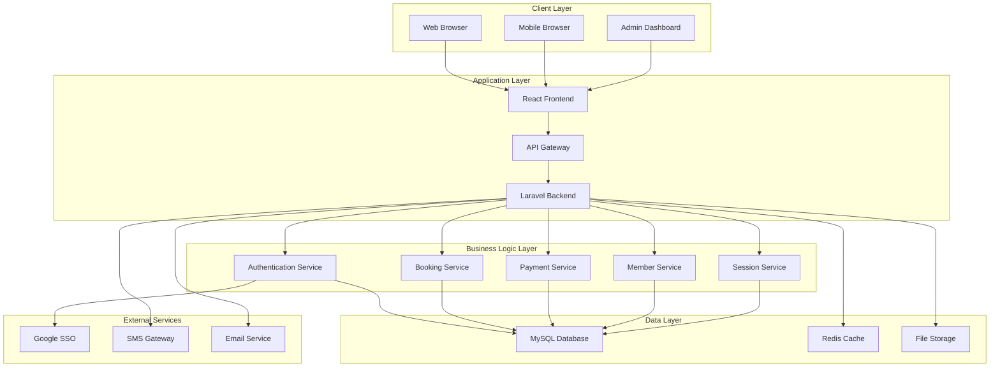
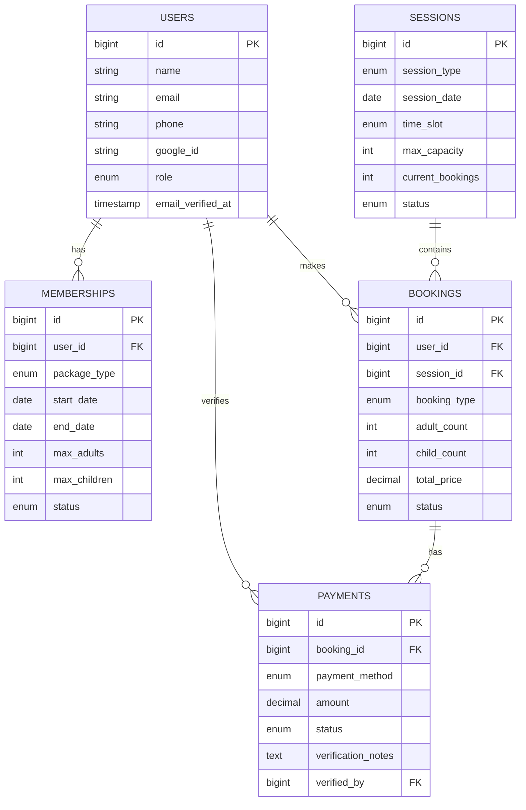

# LAMPIRAN

## A. Dokumen Pendukung

### A.1 Analisis Kebutuhan Sistem

- **Dokumen**: `01-analisa-kebutuhan.md`
- **Deskripsi**: Analisis mendalam kebutuhan sistem kolam renang syariah
- **Isi**: Stakeholder, kebutuhan fungsional/non-fungsional, kebutuhan khusus syariah

### A.2 Analisis Domain dan Bisnis

- **Dokumen**: `02-analisa-domain.md`
- **Deskripsi**: Analisis model bisnis dan dynamic pricing system
- **Isi**: Revenue streams, pricing configuration, business processes

### A.3 Analisis Fitur

- **Dokumen**: `03-analisa-fitur.md`
- **Deskripsi**: Detail fitur-fitur yang akan diimplementasikan
- **Isi**: User stories, use cases, fitur requirements

### A.4 Arsitektur Sistem

- **Dokumen**: `04-arsitektur-sistem.md`
- **Deskripsi**: Arsitektur teknis dan infrastruktur sistem
- **Isi**: System architecture, technology stack, deployment strategy

### A.5 Desain Database

- **Dokumen**: `05-desain-database.md`
- **Deskripsi**: Desain database dan relasi antar tabel
- **Isi**: Database schema, relationships, optimization

### A.6 UML Diagrams

- **Dokumen**: `06-uml-diagrams.md`
- **Deskripsi**: Diagram UML untuk visualisasi sistem
- **Isi**: Use case, class, sequence, activity diagrams

## B. Referensi Teknis

### B.1 Technology Stack Details

**Frontend Technologies:**

```json
{
  "framework": "React.js 18+",
  "language": "TypeScript",
  "ui_library": "Material-UI / Tailwind CSS",
  "state_management": "Redux Toolkit",
  "routing": "React Router v6",
  "http_client": "Axios",
  "testing": "Jest + React Testing Library",
  "bundler": "Webpack 5",
  "linter": "ESLint + Prettier"
}
```

**Backend Technologies:**

```json
{
  "framework": "Laravel 10+",
  "language": "PHP 8.2+",
  "database": "MySQL 8.0 / PostgreSQL 14+",
  "cache": "Redis",
  "queue": "Laravel Queue",
  "authentication": "Laravel Sanctum",
  "testing": "Pest PHP",
  "api": "RESTful API",
  "documentation": "Swagger/OpenAPI"
}
```

**Infrastructure:**

```json
{
  "web_server": "Nginx",
  "application_server": "PHP-FPM",
  "ssl": "Let's Encrypt",
  "cdn": "CloudFlare",
  "monitoring": "Laravel Telescope",
  "deployment": "Docker / Laravel Sail",
  "version_control": "Git",
  "ci_cd": "GitHub Actions"
}
```

### B.2 Database Schema Overview

**Core Tables:**

```sql
-- Users table
CREATE TABLE users (
    id BIGINT UNSIGNED AUTO_INCREMENT PRIMARY KEY,
    name VARCHAR(255) NOT NULL,
    email VARCHAR(255) UNIQUE NOT NULL,
    phone VARCHAR(20),
    google_id VARCHAR(255) UNIQUE,
    role ENUM('admin', 'staff', 'member', 'guest') DEFAULT 'guest',
    email_verified_at TIMESTAMP NULL,
    password VARCHAR(255),
    remember_token VARCHAR(100),
    created_at TIMESTAMP DEFAULT CURRENT_TIMESTAMP,
    updated_at TIMESTAMP DEFAULT CURRENT_TIMESTAMP ON UPDATE CURRENT_TIMESTAMP
);

-- Memberships table
CREATE TABLE memberships (
    id BIGINT UNSIGNED AUTO_INCREMENT PRIMARY KEY,
    user_id BIGINT UNSIGNED NOT NULL,
    package_type ENUM('monthly', 'quarterly') NOT NULL,
    start_date DATE NOT NULL,
    end_date DATE NOT NULL,
    max_adults INT DEFAULT 3,
    max_children INT DEFAULT 2,
    status ENUM('active', 'expired', 'suspended') DEFAULT 'active',
    created_at TIMESTAMP DEFAULT CURRENT_TIMESTAMP,
    updated_at TIMESTAMP DEFAULT CURRENT_TIMESTAMP ON UPDATE CURRENT_TIMESTAMP,
    FOREIGN KEY (user_id) REFERENCES users(id) ON DELETE CASCADE
);

-- Sessions table
CREATE TABLE sessions (
    id BIGINT UNSIGNED AUTO_INCREMENT PRIMARY KEY,
    session_type ENUM('regular', 'private_silver', 'private_gold') NOT NULL,
    session_date DATE NOT NULL,
    time_slot ENUM('morning', 'afternoon') NOT NULL,
    max_capacity INT NOT NULL,
    current_bookings INT DEFAULT 0,
    status ENUM('available', 'full', 'cancelled') DEFAULT 'available',
    created_at TIMESTAMP DEFAULT CURRENT_TIMESTAMP,
    updated_at TIMESTAMP DEFAULT CURRENT_TIMESTAMP ON UPDATE CURRENT_TIMESTAMP
);

-- Bookings table
CREATE TABLE bookings (
    id BIGINT UNSIGNED AUTO_INCREMENT PRIMARY KEY,
    user_id BIGINT UNSIGNED NOT NULL,
    session_id BIGINT UNSIGNED NOT NULL,
    booking_type ENUM('member', 'guest', 'private') NOT NULL,
    adult_count INT NOT NULL,
    child_count INT NOT NULL,
    total_price DECIMAL(10,2) NOT NULL,
    status ENUM('pending', 'confirmed', 'cancelled', 'completed') DEFAULT 'pending',
    booking_date TIMESTAMP DEFAULT CURRENT_TIMESTAMP,
    created_at TIMESTAMP DEFAULT CURRENT_TIMESTAMP,
    updated_at TIMESTAMP DEFAULT CURRENT_TIMESTAMP ON UPDATE CURRENT_TIMESTAMP,
    FOREIGN KEY (user_id) REFERENCES users(id) ON DELETE CASCADE,
    FOREIGN KEY (session_id) REFERENCES sessions(id) ON DELETE CASCADE
);

-- Payments table
CREATE TABLE payments (
    id BIGINT UNSIGNED AUTO_INCREMENT PRIMARY KEY,
    booking_id BIGINT UNSIGNED NOT NULL,
    payment_method ENUM('manual', 'bank_transfer', 'qr_code') NOT NULL,
    amount DECIMAL(10,2) NOT NULL,
    status ENUM('pending', 'verified', 'rejected', 'refunded') DEFAULT 'pending',
    verification_notes TEXT,
    verified_by BIGINT UNSIGNED NULL,
    verified_at TIMESTAMP NULL,
    created_at TIMESTAMP DEFAULT CURRENT_TIMESTAMP,
    updated_at TIMESTAMP DEFAULT CURRENT_TIMESTAMP ON UPDATE CURRENT_TIMESTAMP,
    FOREIGN KEY (booking_id) REFERENCES bookings(id) ON DELETE CASCADE,
    FOREIGN KEY (verified_by) REFERENCES users(id) ON DELETE SET NULL
);
```

### B.3 API Endpoints Overview

**Authentication Endpoints:**

```
POST /api/auth/login          # User login
POST /api/auth/logout         # User logout
POST /api/auth/register       # User registration
GET  /api/auth/user           # Get current user
POST /api/auth/google         # Google SSO login
```

**Member Management:**

```
GET    /api/members           # Get all members
POST   /api/members           # Create new member
GET    /api/members/{id}      # Get member details
PUT    /api/members/{id}      # Update member
DELETE /api/members/{id}      # Delete member
GET    /api/members/{id}/bookings # Get member bookings
```

**Session Management:**

```
GET    /api/sessions          # Get available sessions
POST   /api/sessions          # Create new session
GET    /api/sessions/{id}     # Get session details
PUT    /api/sessions/{id}     # Update session
DELETE /api/sessions/{id}     # Delete session
GET    /api/sessions/availability # Check availability
```

**Booking Management:**

```
GET    /api/bookings          # Get all bookings
POST   /api/bookings          # Create new booking
GET    /api/bookings/{id}     # Get booking details
PUT    /api/bookings/{id}     # Update booking
DELETE /api/bookings/{id}     # Cancel booking
GET    /api/bookings/user/{id} # Get user bookings
```

**Payment Management:**

```
GET    /api/payments          # Get all payments
POST   /api/payments          # Create payment
GET    /api/payments/{id}     # Get payment details
PUT    /api/payments/{id}/verify # Verify payment
POST   /api/payments/{id}/refund # Process refund
```

## C. Diagram Arsitektur

### C.1 System Architecture Diagram



### C.2 Database Relationship Diagram



## D. Testing Strategy

### D.1 Testing Pyramid

**Unit Testing (70%):**

- **Backend**: Pest PHP untuk Laravel testing
- **Frontend**: Jest untuk React component testing
- **Coverage Target**: 80% code coverage
- **Automated**: CI/CD pipeline integration

**Integration Testing (20%):**

- **API Testing**: Testing semua API endpoints
- **Database Testing**: Testing database operations
- **Third-party Integration**: Testing external services
- **End-to-end API**: Complete API flow testing

**E2E Testing (10%):**

- **User Flows**: Complete user journey testing
- **Cross-browser**: Testing di berbagai browser
- **Mobile Testing**: Testing di berbagai device
- **Performance Testing**: Load dan stress testing

### D.2 Test Cases Examples

**Authentication Test Cases:**

```php
// Example Pest PHP test
test('user can login with valid credentials', function () {
    $user = User::factory()->create();

    $response = $this->post('/api/auth/login', [
        'email' => $user->email,
        'password' => 'password'
    ]);

    $response->assertStatus(200)
             ->assertJsonStructure(['token', 'user']);
});

test('user cannot login with invalid credentials', function () {
    $response = $this->post('/api/auth/login', [
        'email' => 'invalid@example.com',
        'password' => 'wrongpassword'
    ]);

    $response->assertStatus(401);
});
```

**Booking Test Cases:**

```javascript
// Example Jest test
describe("Booking System", () => {
  test("should create booking successfully", async () => {
    const bookingData = {
      sessionId: 1,
      adultCount: 2,
      childCount: 1,
      bookingType: "member",
    };

    const response = await createBooking(bookingData);

    expect(response.status).toBe(201);
    expect(response.data.booking).toBeDefined();
  });

  test("should reject booking when session is full", async () => {
    // Mock session as full
    mockSessionFull();

    const bookingData = {
      sessionId: 1,
      adultCount: 1,
      childCount: 0,
      bookingType: "guest",
    };

    const response = await createBooking(bookingData);

    expect(response.status).toBe(400);
    expect(response.data.error).toContain("Session is full");
  });
});
```

## E. Security Considerations

### E.1 Security Checklist

**Authentication & Authorization:**

- [ ] Multi-factor authentication for admin
- [ ] Role-based access control
- [ ] Session management
- [ ] Password security
- [ ] OAuth integration (Google SSO)

**Data Protection:**

- [ ] Data encryption at rest
- [ ] Data encryption in transit
- [ ] Input validation
- [ ] Output encoding
- [ ] SQL injection prevention
- [ ] XSS protection
- [ ] CSRF protection

**Infrastructure Security:**

- [ ] HTTPS everywhere
- [ ] SSL certificate
- [ ] Firewall configuration
- [ ] Server hardening
- [ ] Regular security updates
- [ ] Backup encryption

**Monitoring & Logging:**

- [ ] Security event logging
- [ ] Failed login attempts tracking
- [ ] Suspicious activity monitoring
- [ ] Regular security audits
- [ ] Incident response plan

### E.2 Compliance Requirements

**GDPR Compliance:**

- Data minimization
- User consent management
- Right to be forgotten
- Data portability
- Privacy by design

**PCI DSS (if applicable):**

- Secure payment processing
- Data encryption
- Access control
- Regular security testing
- Incident response

## F. Performance Benchmarks

### F.1 Performance Targets

| **Metric**              | **Target**  | **Measurement**        |
| ----------------------- | ----------- | ---------------------- |
| **Page Load Time**      | < 3 seconds | First Contentful Paint |
| **API Response Time**   | < 1 second  | Average response time  |
| **Database Query Time** | < 500ms     | Average query time     |
| **Concurrent Users**    | 1000+       | Simultaneous users     |
| **Uptime**              | 99.5%+      | Monthly uptime         |
| **Error Rate**          | < 0.1%      | Error percentage       |

### F.2 Load Testing Scenarios

**Normal Load:**

- 100 concurrent users
- 1000 requests per minute
- 95% response time < 2 seconds

**Peak Load:**

- 500 concurrent users
- 5000 requests per minute
- 95% response time < 3 seconds

**Stress Test:**

- 1000 concurrent users
- 10000 requests per minute
- System should remain stable

## G. Deployment Guide

### G.1 Production Deployment Checklist

**Pre-deployment:**

- [ ] Code review completed
- [ ] All tests passing
- [ ] Security scan completed
- [ ] Performance testing done
- [ ] Backup strategy in place

**Deployment:**

- [ ] Database migration
- [ ] Application deployment
- [ ] SSL certificate setup
- [ ] Domain configuration
- [ ] Monitoring setup

**Post-deployment:**

- [ ] Smoke testing
- [ ] Performance monitoring
- [ ] Error monitoring
- [ ] User acceptance testing
- [ ] Documentation update

### G.2 Environment Configuration

**Development Environment:**

```env
APP_ENV=local
APP_DEBUG=true
DB_CONNECTION=mysql
DB_HOST=127.0.0.1
DB_PORT=3306
DB_DATABASE=raujan_pool_dev
```

**Production Environment:**

```env
APP_ENV=production
APP_DEBUG=false
DB_CONNECTION=mysql
DB_HOST=production-db-host
DB_PORT=3306
DB_DATABASE=raujan_pool_prod
```

---

**Dokumen**: LAMPIRAN  
**Versi**: 1.0  
**Tanggal**: 26 Agustus 2025  
**Proyek**: Sistem Manajemen Kolam Renang Syariah Raujan Pool
