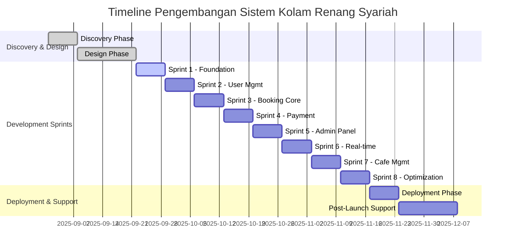
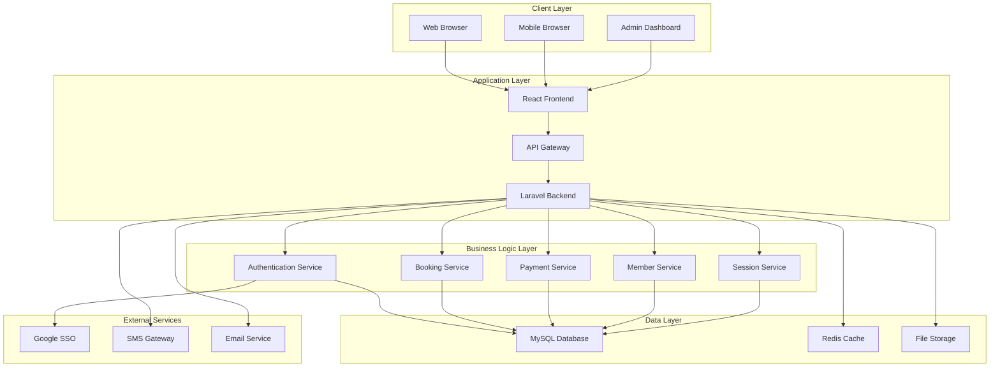
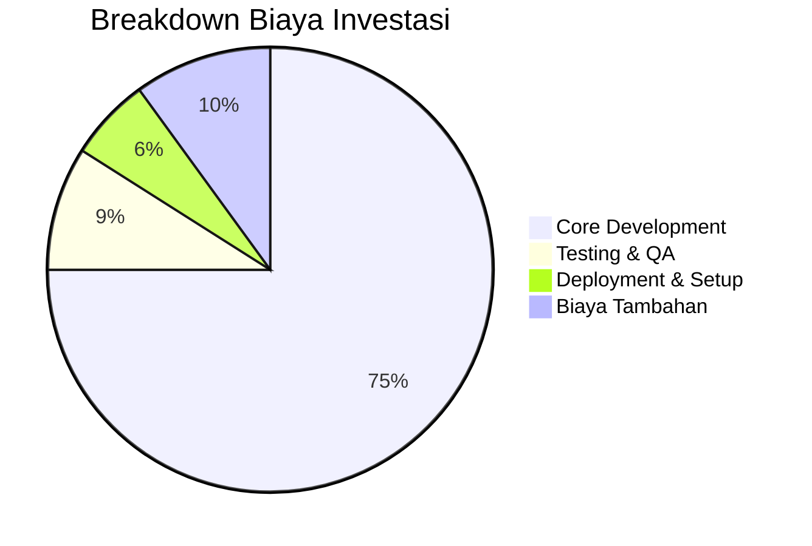
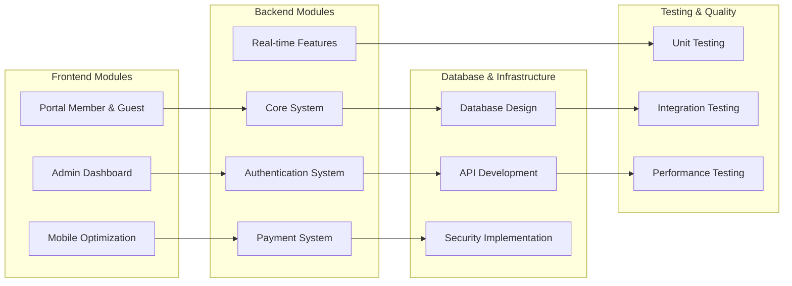
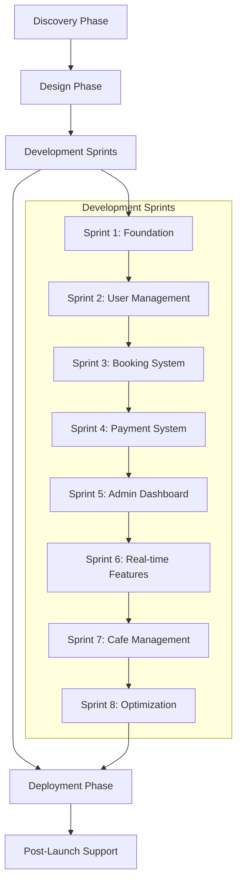

# Diagram Struktur Proposal

## Struktur Proposal Penawaran

```mermaid
graph TD
    A[Proposal Penawaran<br/>Sistem Kolam Renang Syariah] --> B[BAB I - PENDAHULUAN]
    A --> C[BAB II - SOLUSI YANG DITAWARKAN]
    A --> D[BAB III - RINCIAN BIAYA DAN TEKNOLOGI]
    A --> E[BAB IV - METODOLOGI DAN TIMELINE]
    A --> F[BAB V - DUKUNGAN DAN KEUNGGULAN]
    A --> G[LAMPIRAN]

    B --> B1[1.1 Profil Banjart Media]
    B --> B2[1.2 Pemahaman Kebutuhan]
    B --> B3[1.3 Visi dan Misi Proyek]
    B --> B4[1.4 Manfaat yang Akan Diperoleh]

    C --> C1[2.1 Pendekatan Implementasi Efisien]
    C --> C2[2.2 Modul-Modul yang Diimplementasikan]
    C --> C3[2.3 Arsitektur Sistem]
    C --> C4[2.4 Integrasi dan Konektivitas]
    C --> C5[2.5 Keunggulan Solusi]

    D --> D1[3.1 Rincian Biaya Investasi]
    D --> D2[3.2 Biaya Service]
    D --> D3[3.3 Teknologi yang Digunakan]
    D --> D4[3.4 Infrastructure & Deployment]
    D --> D5[3.5 Value Proposition]

    E --> E1[4.1 Metodologi Pengembangan]
    E --> E2[4.2 Timeline Pengembangan]
    E --> E3[4.3 Ketentuan Pembayaran]
    E --> E4[4.4 Quality Assurance & Testing]
    E --> E5[4.5 Risk Management]
    E --> E6[4.6 Communication & Reporting]

    F --> F1[5.1 Dukungan dan Pemeliharaan]
    F --> F2[5.2 Keunggulan Sistem Banjart Media]
    F --> F3[5.3 Syarat dan Ketentuan]
    F --> F4[5.4 Langkah Selanjutnya]
    F --> F5[5.5 Penutup]

    G --> G1[A. Dokumen Pendukung]
    G --> G2[B. Referensi Teknis]
    G --> G3[C. Diagram Arsitektur]
    G --> G4[D. Testing Strategy]
    G --> G5[E. Security Considerations]
    G --> G6[F. Performance Benchmarks]
    G --> G7[G. Deployment Guide]
```

## Timeline Implementasi

## Arsitektur Sistem

## Breakdown Biaya

## Modul Sistem

## Metodologi Pengembangan

---

**Dokumen**: Diagram Struktur Proposal  
**Versi**: 1.0  
**Tanggal**: 26 Agustus 2025  
**Proyek**: Sistem Manajemen Kolam Renang Syariah Raujan Pool
