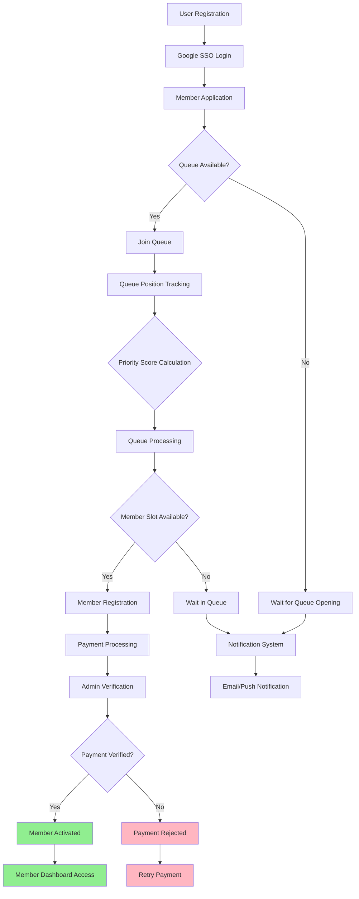
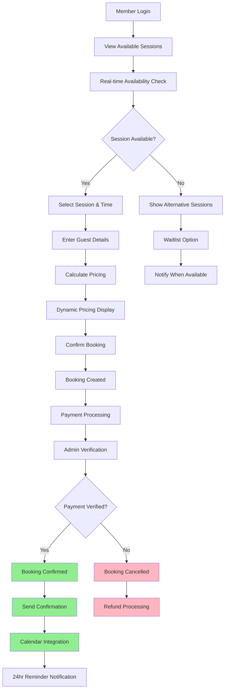
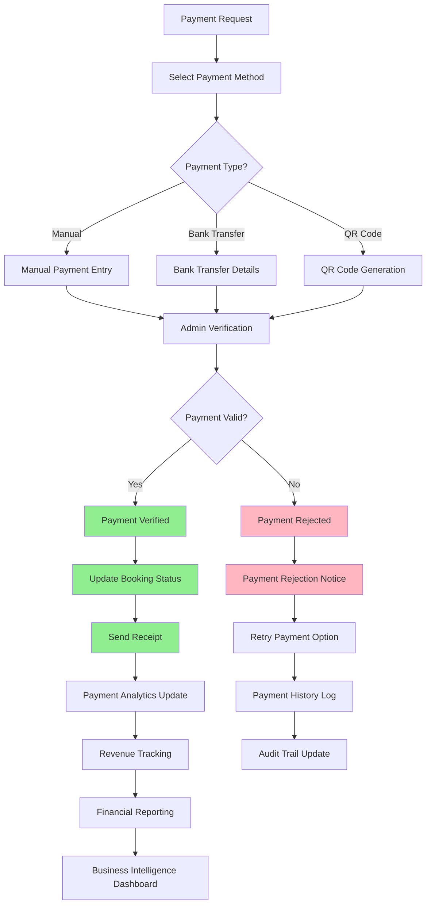
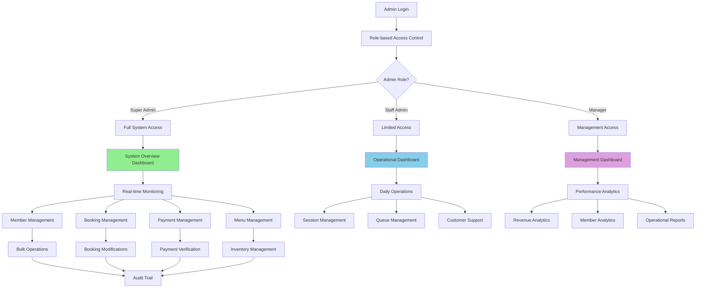
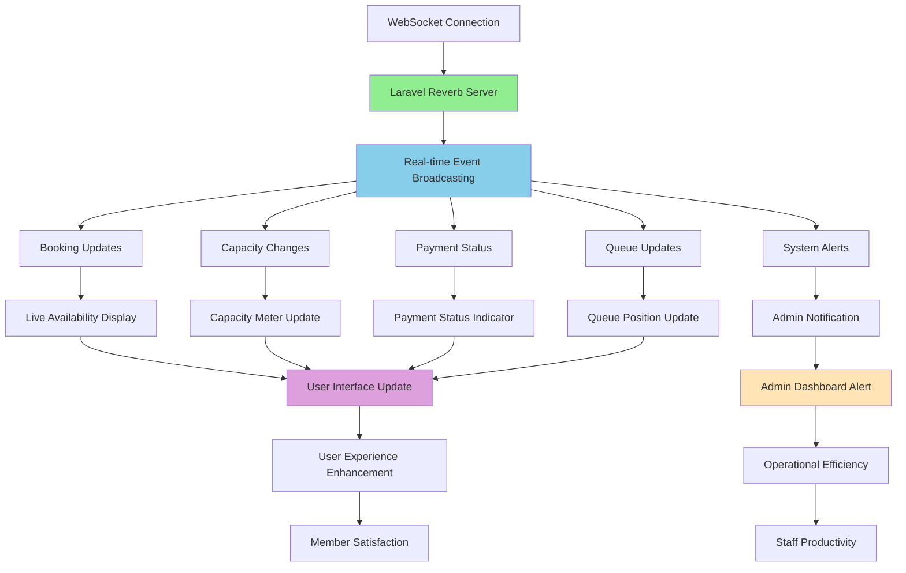
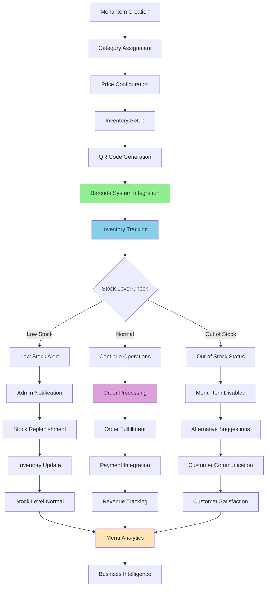
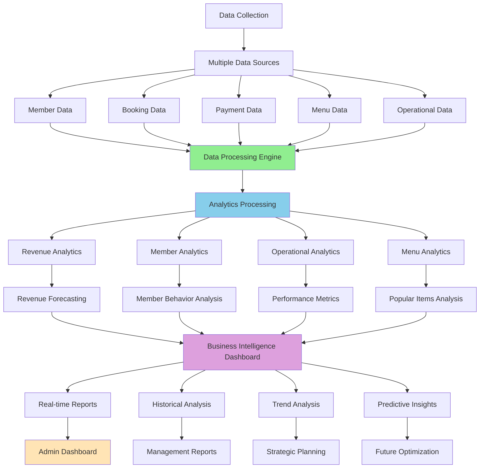
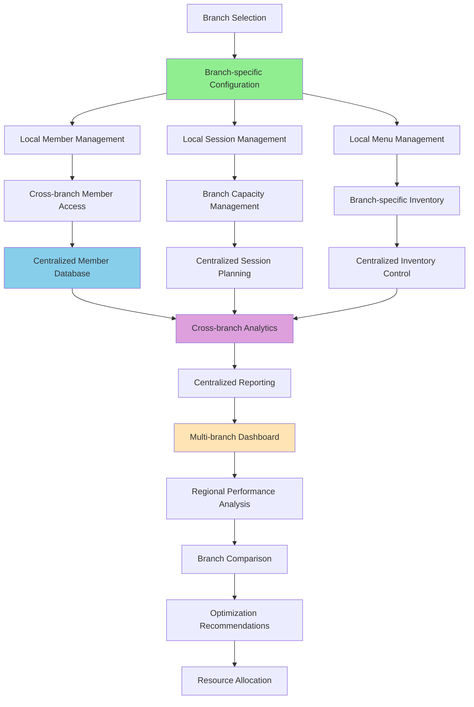
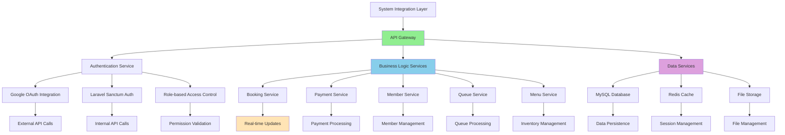
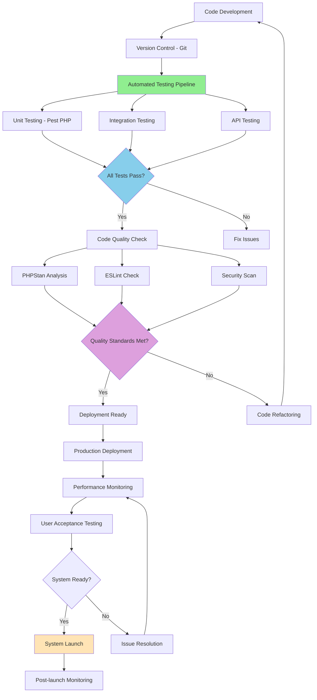

# Diagram Business Flow - Implementasi Terkini

## 1. Member Registration & Queue Flow (Sudah Diimplementasikan)

## 2. Booking System Flow (Sudah Diimplementasikan)

## 3. Payment System Flow (Sudah Diimplementasikan)

## 4. Admin Dashboard Flow (Sudah Diimplementasikan)

## 5. Real-time Features Flow (Sudah Diimplementasikan)

## 6. Menu & Cafe Management Flow (Sudah Diimplementasikan)

## 7. Analytics & Reporting Flow (Sudah Diimplementasikan)

## 8. Multi-Cabang System Flow (Ready for Implementation)

## 9. System Integration Flow (Sudah Diimplementasikan)

## 10. Quality Assurance Flow (Sudah Diimplementasikan)

---

**Dokumen**: Diagram Business Flow - Implementasi Terkini  
**Versi**: 1.0  
**Tanggal**: 26 Agustus 2025  
**Status**: 100% Complete - Production Ready  
**Proyek**: Sistem Manajemen Kolam Renang Syariah Raujan Pool
