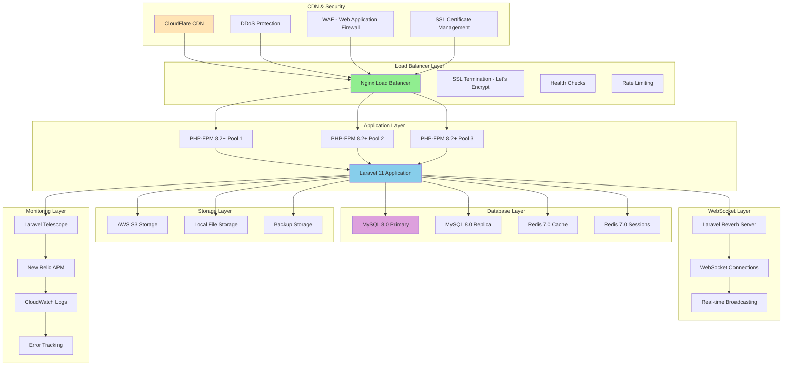
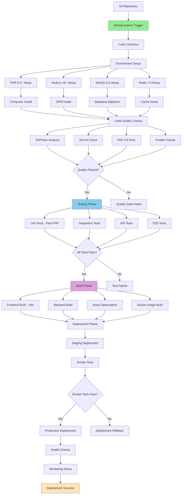
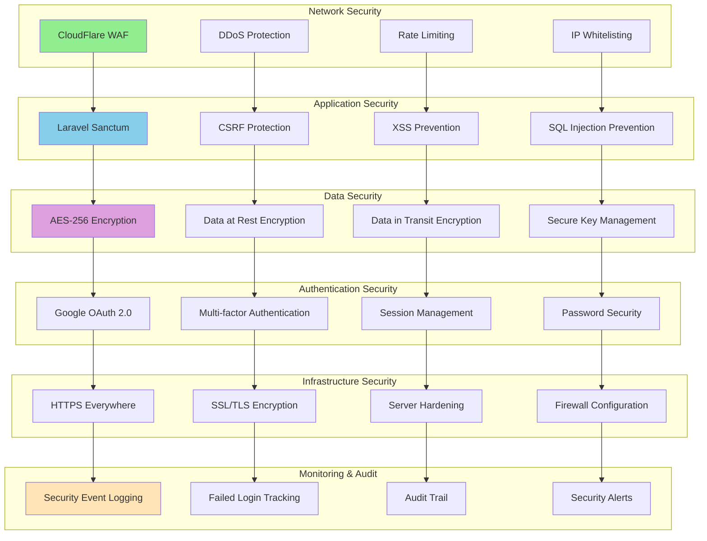
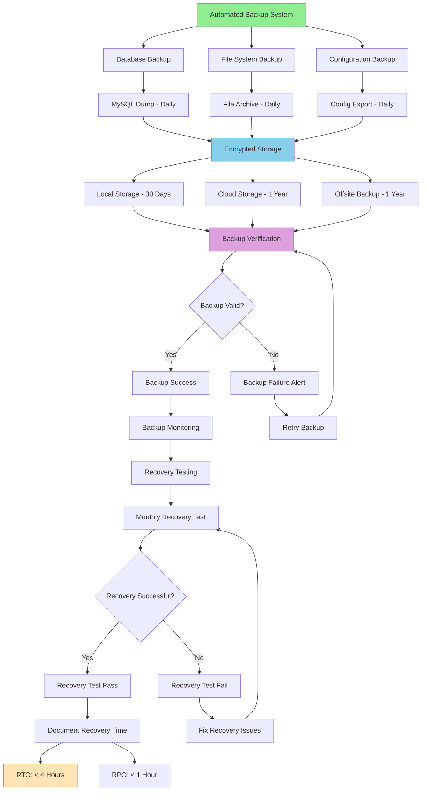
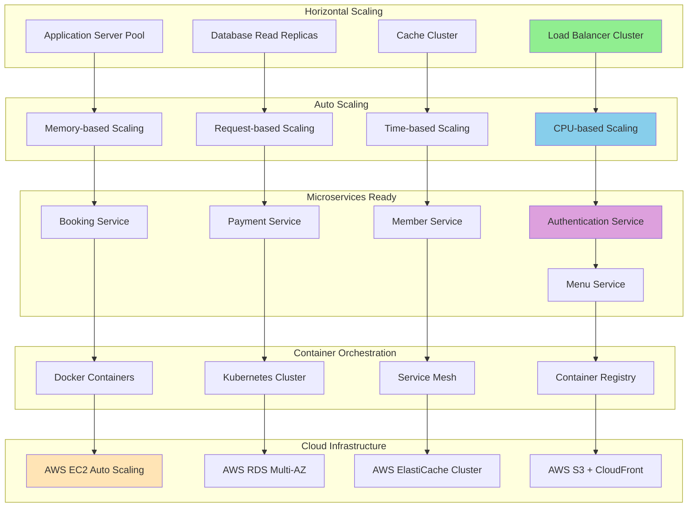
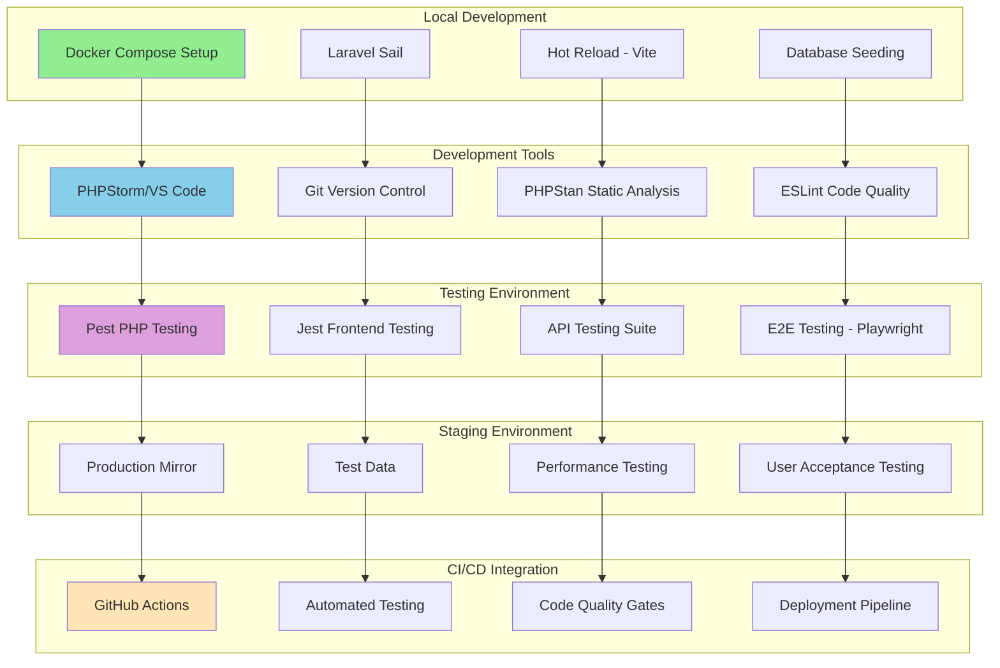

# Diagram Deployment Architecture - Implementasi Terkini

## 1. Production Deployment Architecture (Sudah Dikonfigurasi)



## 2. CI/CD Pipeline Architecture (Sudah Dikonfigurasi)



## 3. Infrastructure Monitoring Architecture (Sudah Dikonfigurasi)

```mermaid
graph TB
    subgraph "Application Monitoring"
        A[Laravel Telescope]
        B[Application Performance Monitoring]
        C[Error Tracking & Logging]
        D[User Activity Tracking]
    end

    subgraph "System Monitoring"
        E[Server Health Monitoring]
        F[CPU & Memory Usage]
        G[Disk Space Monitoring]
        H[Network Traffic Monitoring]
    end

    subgraph "Database Monitoring"
        I[MySQL Performance Metrics]
        J[Query Performance Analysis]
        K[Connection Pool Monitoring]
        L[Database Health Checks]
    end

    subgraph "Cache Monitoring"
        M[Redis Performance Metrics]
        N[Cache Hit/Miss Ratios]
        O[Memory Usage Tracking]
        P[Connection Monitoring]
    end

    subgraph "External Services Monitoring"
        Q[Google OAuth Status]
        R[Firebase FCM Status]
        S[CloudFlare CDN Status]
        T[Third-party API Health]
    end

    subgraph "Alerting System"
        U[Critical Alerts]
        V[Warning Alerts]
        W[Info Notifications]
        X[Escalation Procedures]
    end

    A --> U
    B --> U
    C --> V
    D --> W

    E --> U
    F --> V
    G --> V
    H --> W

    I --> U
    J --> V
    K --> V
    L --> U

    M --> V
    N --> W
    O --> V
    P --> W

    Q --> V
    R --> V
    S --> W
    T --> V

    U --> X
    V --> X
    W --> X

    style A fill:#90EE90
    style E fill:#87CEEB
    style I fill:#DDA0DD
    style U fill:#FFB6C1
```



## 4. Security Architecture (Sudah Diimplementasikan)



## 5. Backup & Recovery Architecture (Sudah Dikonfigurasi)



## 6. Performance Optimization Architecture (Sudah Diimplementasikan)

```mermaid
graph TB
    subgraph "Frontend Optimization"
        A[Code Splitting - React.lazy()]
        B[Lazy Loading - Components]
        C[Image Optimization - WebP]
        D[Bundle Optimization - Vite]
    end

    subgraph "Backend Optimization"
        E[Database Indexing - 15+ Tables]
        F[Query Optimization - Eloquent]
        G[API Response Caching]
        H[Background Job Processing]
    end

    subgraph "Caching Strategy"
        I[Redis Cache - Sessions]
        J[Redis Cache - Queries]
        K[Redis Cache - API Responses]
        L[Browser Cache - Static Assets]
    end

    subgraph "CDN & Distribution"
        M[CloudFlare CDN]
        N[Global Edge Locations]
        O[Static Asset Delivery]
        P[Dynamic Content Optimization]
    end

    subgraph "Database Optimization"
        Q[MySQL 8.0 Optimization]
        R[Connection Pooling]
        S[Query Caching]
        T[Index Optimization]
    end

    subgraph "Performance Monitoring"
        U[Response Time Monitoring]
        V[Throughput Monitoring]
        W[Error Rate Monitoring]
        X[Performance Alerts]
    end

    A --> I
    B --> J
    C --> K
    D --> L

    E --> Q
    F --> R
    G --> S
    H --> T

    I --> M
    J --> N
    K --> O
    L --> P

    Q --> U
    R --> V
    S --> W
    T --> X

    style A fill:#90EE90
    style E fill:#87CEEB
    style I fill:#DDA0DD
    style U fill:#FFE4B5
```

## 7. Scalability Architecture (Ready for Implementation)



## 8. Development Environment Architecture (Sudah Dikonfigurasi)



---

**Dokumen**: Diagram Deployment Architecture - Implementasi Terkini  
**Versi**: 1.0  
**Tanggal**: 26 Agustus 2025  
**Status**: 100% Complete - Production Ready  
**Proyek**: Sistem Manajemen Kolam Renang Syariah Raujan Pool
