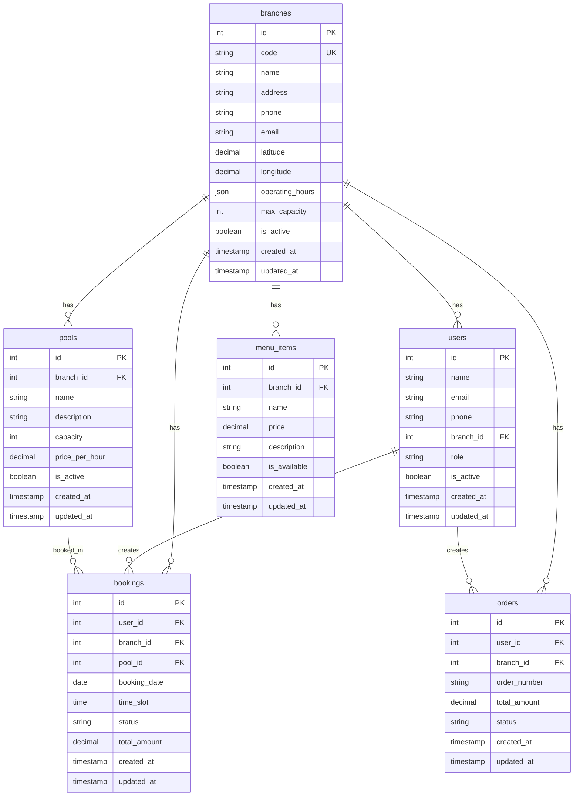

# Phase 7: Multicabang System - Sistem Kolam Renang Syariah

## 📋 Overview

Phase 7 menambahkan fitur multicabang ke sistem Raujan Pool Syariah yang sudah selesai. Fitur ini memungkinkan pengelolaan multiple lokasi kolam renang dengan sistem terpusat.

## 🎯 Objectives

- **Multi-location Management**: Pengelolaan multiple cabang kolam renang
- **Centralized Control**: Kontrol terpusat dari admin untuk semua cabang
- **Branch-specific Features**: Fitur khusus per cabang (harga, kapasitas, menu)
- **Cross-branch Analytics**: Analitik lintas cabang
- **Staff Management per Branch**: Manajemen staff per cabang
- **Inventory Management per Branch**: Manajemen inventori per cabang

## 🏗️ Architecture

### 7.1 Database Schema Extension



### 7.2 API Structure

```
/api/v1/
├── branches/                    # Branch management
│   ├── GET /                    # List all branches
│   ├── POST /                   # Create new branch
│   ├── GET /{id}                # Get branch details
│   ├── PUT /{id}                # Update branch
│   ├── DELETE /{id}             # Delete branch
│   ├── GET /{id}/pools          # Get branch pools
│   ├── GET /{id}/menu           # Get branch menu
│   ├── GET /{id}/staff          # Get branch staff
│   ├── GET /{id}/analytics      # Get branch analytics
│   └── POST /{id}/activate      # Activate branch
├── admin/
│   ├── branches/                # Admin branch management
│   │   ├── GET /                # List all branches (admin)
│   │   ├── POST /               # Create branch (admin)
│   │   ├── PUT /{id}            # Update branch (admin)
│   │   ├── DELETE /{id}         # Delete branch (admin)
│   │   ├── GET /{id}/staff      # Manage branch staff
│   │   ├── POST /{id}/staff     # Add staff to branch
│   │   ├── DELETE /{id}/staff/{user_id} # Remove staff from branch
│   │   └── GET /analytics       # Cross-branch analytics
│   └── cross-branch/
│       ├── GET /analytics       # Cross-branch analytics
│       ├── GET /reports         # Cross-branch reports
│       └── GET /comparison      # Branch comparison
└── staff/
    ├── branches/                # Staff branch operations
    │   ├── GET /{id}/dashboard  # Branch dashboard
    │   ├── GET /{id}/bookings   # Branch bookings
    │   ├── GET /{id}/orders     # Branch orders
    │   └── GET /{id}/inventory  # Branch inventory
    └── cross-branch/
        ├── GET /bookings        # Cross-branch bookings
        └── GET /orders          # Cross-branch orders
```

## 📁 File Structure

```
backend/phase-7/
├── 01-branch-management.md          # Branch CRUD operations
├── 02-branch-staff-management.md    # Staff management per branch
├── 03-branch-pool-management.md     # Pool management per branch
├── 04-branch-menu-management.md     # Menu management per branch
├── 05-branch-booking-management.md  # Booking management per branch
├── 06-branch-order-management.md    # Order management per branch
├── 07-branch-inventory-management.md # Inventory management per branch
├── 08-branch-analytics.md           # Branch-specific analytics
├── 09-cross-branch-analytics.md     # Cross-branch analytics
├── 10-branch-notifications.md       # Branch-specific notifications
└── README.md
```

## 🎯 Development Phases

### Phase 7.1: Branch Management (Week 13-14)

- Branch CRUD operations
- Branch staff management
- Branch configuration
- Branch activation/deactivation

### Phase 7.2: Branch-Specific Features (Week 15-16)

- Pool management per branch
- Menu management per branch
- Pricing per branch
- Operating hours per branch

### Phase 7.3: Cross-Branch Operations (Week 17-18)

- Cross-branch booking
- Cross-branch order management
- Cross-branch inventory
- Cross-branch analytics

### Phase 7.4: Advanced Features (Week 19-20)

- Branch notifications
- Branch reporting
- Branch comparison
- Branch performance metrics

## 🔧 Implementation Details

### 7.1 Database Migrations

```php
// Create branches table
Schema::create('branches', function (Blueprint $table) {
    $table->id();
    $table->string('code')->unique();
    $table->string('name');
    $table->text('address');
    $table->string('phone');
    $table->string('email');
    $table->decimal('latitude', 10, 8);
    $table->decimal('longitude', 11, 8);
    $table->json('operating_hours');
    $table->integer('max_capacity');
    $table->boolean('is_active')->default(true);
    $table->timestamps();
});

// Add branch_id to existing tables
Schema::table('users', function (Blueprint $table) {
    $table->foreignId('branch_id')->nullable()->constrained()->onDelete('set null');
});

Schema::table('pools', function (Blueprint $table) {
    $table->foreignId('branch_id')->constrained()->onDelete('cascade');
});

Schema::table('menu_items', function (Blueprint $table) {
    $table->foreignId('branch_id')->constrained()->onDelete('cascade');
});

Schema::table('bookings', function (Blueprint $table) {
    $table->foreignId('branch_id')->constrained()->onDelete('cascade');
});

Schema::table('orders', function (Blueprint $table) {
    $table->foreignId('branch_id')->constrained()->onDelete('cascade');
});
```

### 7.2 Model Relationships

```php
// Branch Model
class Branch extends Model
{
    protected $fillable = [
        'code', 'name', 'address', 'phone', 'email',
        'latitude', 'longitude', 'operating_hours',
        'max_capacity', 'is_active'
    ];

    protected $casts = [
        'operating_hours' => 'array',
        'is_active' => 'boolean'
    ];

    public function users()
    {
        return $this->hasMany(User::class);
    }

    public function pools()
    {
        return $this->hasMany(Pool::class);
    }

    public function menuItems()
    {
        return $this->hasMany(MenuItem::class);
    }

    public function bookings()
    {
        return $this->hasMany(Booking::class);
    }

    public function orders()
    {
        return $this->hasMany(Order::class);
    }
}

// Updated User Model
class User extends Model
{
    public function branch()
    {
        return $this->belongsTo(Branch::class);
    }
}

// Updated Pool Model
class Pool extends Model
{
    public function branch()
    {
        return $this->belongsTo(Branch::class);
    }
}
```

### 7.3 Service Layer

```php
// BranchService
class BranchService
{
    public function createBranch(array $data): Branch
    {
        // Create branch with validation
    }

    public function updateBranch(Branch $branch, array $data): Branch
    {
        // Update branch with validation
    }

    public function activateBranch(Branch $branch): bool
    {
        // Activate branch
    }

    public function deactivateBranch(Branch $branch): bool
    {
        // Deactivate branch
    }

    public function getBranchAnalytics(Branch $branch, array $filters = []): array
    {
        // Get branch-specific analytics
    }

    public function getCrossBranchAnalytics(array $filters = []): array
    {
        // Get cross-branch analytics
    }
}

// BranchStaffService
class BranchStaffService
{
    public function addStaffToBranch(Branch $branch, User $user): bool
    {
        // Add staff to branch
    }

    public function removeStaffFromBranch(Branch $branch, User $user): bool
    {
        // Remove staff from branch
    }

    public function getBranchStaff(Branch $branch): Collection
    {
        // Get branch staff
    }
}
```

### 7.4 API Controllers

```php
// BranchController
class BranchController extends Controller
{
    public function index(Request $request)
    {
        // List all branches with filters
    }

    public function store(StoreBranchRequest $request)
    {
        // Create new branch
    }

    public function show(Branch $branch)
    {
        // Show branch details
    }

    public function update(UpdateBranchRequest $request, Branch $branch)
    {
        // Update branch
    }

    public function destroy(Branch $branch)
    {
        // Delete branch
    }

    public function getPools(Branch $branch)
    {
        // Get branch pools
    }

    public function getMenu(Branch $branch)
    {
        // Get branch menu
    }

    public function getStaff(Branch $branch)
    {
        // Get branch staff
    }

    public function getAnalytics(Branch $branch, Request $request)
    {
        // Get branch analytics
    }
}

// AdminBranchController
class AdminBranchController extends Controller
{
    public function index(Request $request)
    {
        // Admin: List all branches
    }

    public function store(StoreBranchRequest $request)
    {
        // Admin: Create branch
    }

    public function update(UpdateBranchRequest $request, Branch $branch)
    {
        // Admin: Update branch
    }

    public function destroy(Branch $branch)
    {
        // Admin: Delete branch
    }

    public function getCrossBranchAnalytics(Request $request)
    {
        // Admin: Cross-branch analytics
    }

    public function getCrossBranchReports(Request $request)
    {
        // Admin: Cross-branch reports
    }
}
```

## 🧪 Testing Strategy

### 7.1 Unit Tests

```php
// BranchServiceTest
test('can create branch', function () {
    $branchData = [
        'code' => 'BR001',
        'name' => 'Branch 1',
        'address' => 'Jl. Example 1',
        'phone' => '081234567890',
        'email' => 'branch1@example.com',
        'latitude' => -6.2,
        'longitude' => 106.816666,
        'operating_hours' => [
            'monday' => '06:00-22:00',
            'tuesday' => '06:00-22:00'
        ],
        'max_capacity' => 100
    ];

    $branch = app(BranchService::class)->createBranch($branchData);

    expect($branch)->toBeInstanceOf(Branch::class);
    expect($branch->code)->toBe('BR001');
    expect($branch->name)->toBe('Branch 1');
});

test('can get branch analytics', function () {
    $branch = Branch::factory()->create();

    $analytics = app(BranchService::class)->getBranchAnalytics($branch);

    expect($analytics)->toBeArray();
    expect($analytics)->toHaveKeys(['total_bookings', 'total_revenue', 'total_orders']);
});
```

### 7.2 Feature Tests

```php
// BranchApiTest
test('can list branches', function () {
    Branch::factory()->count(3)->create();

    $response = $this->getJson('/api/v1/branches');

    $response->assertStatus(200)
        ->assertJsonStructure([
            'success',
            'data' => [
                '*' => [
                    'id',
                    'code',
                    'name',
                    'address',
                    'phone',
                    'email',
                    'latitude',
                    'longitude',
                    'operating_hours',
                    'max_capacity',
                    'is_active'
                ]
            ]
        ]);
});

test('can create branch as admin', function () {
    $admin = User::factory()->admin()->create();

    $branchData = [
        'code' => 'BR001',
        'name' => 'Branch 1',
        'address' => 'Jl. Example 1',
        'phone' => '081234567890',
        'email' => 'branch1@example.com',
        'latitude' => -6.2,
        'longitude' => 106.816666,
        'operating_hours' => [
            'monday' => '06:00-22:00',
            'tuesday' => '06:00-22:00'
        ],
        'max_capacity' => 100
    ];

    $response = $this->actingAs($admin)
        ->postJson('/api/v1/admin/branches', $branchData);

    $response->assertStatus(201)
        ->assertJsonStructure([
            'success',
            'message',
            'data' => [
                'id',
                'code',
                'name',
                'address',
                'phone',
                'email',
                'latitude',
                'longitude',
                'operating_hours',
                'max_capacity',
                'is_active'
            ]
        ]);
});
```

## 📊 Analytics & Reporting

### 7.1 Branch-Specific Analytics

- **Booking Analytics**: Jumlah booking per cabang
- **Revenue Analytics**: Pendapatan per cabang
- **User Analytics**: Pengguna per cabang
- **Staff Performance**: Performa staff per cabang
- **Inventory Analytics**: Inventori per cabang

### 7.2 Cross-Branch Analytics

- **Comparison Reports**: Perbandingan antar cabang
- **Performance Metrics**: Metrik performa lintas cabang
- **Trend Analysis**: Analisis tren lintas cabang
- **Consolidated Reports**: Laporan konsolidasi

## 🔔 Notifications

### 7.1 Branch-Specific Notifications

- **Branch Status**: Notifikasi status cabang
- **Staff Notifications**: Notifikasi untuk staff cabang
- **Booking Notifications**: Notifikasi booking per cabang
- **Inventory Alerts**: Alert inventori per cabang

### 7.2 Cross-Branch Notifications

- **Admin Notifications**: Notifikasi untuk admin
- **System Notifications**: Notifikasi sistem
- **Performance Alerts**: Alert performa cabang

## 🚀 Deployment

### 7.1 Database Migration

```bash
# Run branch migrations
php artisan migrate --path=database/migrations/phase-7

# Seed branch data
php artisan db:seed --class=BranchSeeder
```

### 7.2 Configuration

```env
# Branch configuration
DEFAULT_BRANCH_ID=1
BRANCH_ANALYTICS_CACHE_TTL=3600
CROSS_BRANCH_ANALYTICS_CACHE_TTL=7200
```

## 📚 Documentation

Each phase 7 file includes:

- API endpoints
- Database schemas
- Business logic implementation
- Testing procedures
- Success criteria
- Migration scripts
- Configuration examples

## 🎯 Success Criteria

- [ ] Branch CRUD operations working
- [ ] Staff management per branch working
- [ ] Pool management per branch working
- [ ] Menu management per branch working
- [ ] Booking management per branch working
- [ ] Order management per branch working
- [ ] Inventory management per branch working
- [ ] Branch analytics working
- [ ] Cross-branch analytics working
- [ ] Branch notifications working
- [ ] All tests passing
- [ ] Documentation complete
- [ ] Performance optimized
- [ ] Security implemented
- [ ] Error handling complete

## 🔗 Dependencies

- Phase 1: Project Setup & Core Infrastructure
- Phase 2: Authentication & User Management
- Phase 3: Booking System & Calendar
- Phase 4: Payment System & Manual Payment
- Phase 5: Member Management & Quota System
- Phase 6: Cafe System & Barcode Integration

## 📈 Performance Considerations

- **Database Indexing**: Index pada branch_id untuk performa query
- **Caching**: Cache untuk analytics dan data yang sering diakses
- **Pagination**: Pagination untuk list cabang dan data terkait
- **Query Optimization**: Optimasi query untuk cross-branch operations
- **Background Jobs**: Background jobs untuk analytics dan reporting

## 🔒 Security Considerations

- **Branch Access Control**: Kontrol akses per cabang
- **Staff Permissions**: Permission staff per cabang
- **Data Isolation**: Isolasi data antar cabang
- **Audit Logging**: Logging untuk operasi cabang
- **API Security**: Keamanan API untuk operasi cabang

---

**Versi**: 1.0  
**Tanggal**: 4 September 2025  
**Status**: Planning  
**Dependencies**: Phase 1-6 Complete  
**Key Features**:

- 🏢 **Multi-location Management** dengan sistem terpusat
- 👥 **Branch-specific Staff Management**
- 🏊‍♂️ **Branch-specific Pool Management**
- 🍽️ **Branch-specific Menu Management**
- 📊 **Cross-branch Analytics & Reporting**
- 🔔 **Branch-specific Notifications**
- 📈 **Performance Optimization** untuk multi-cabang
- 🔒 **Security & Access Control** per cabang
