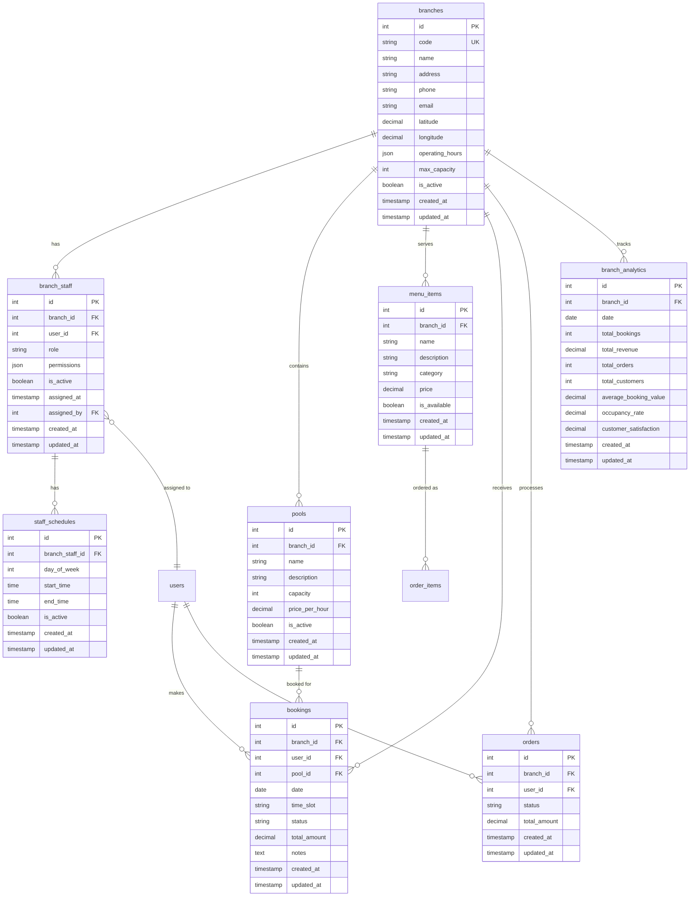
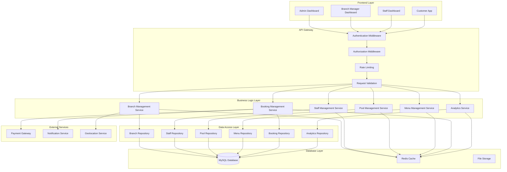
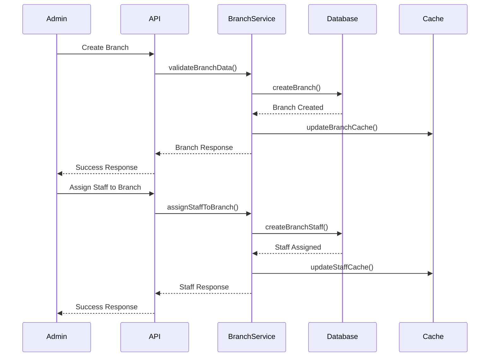
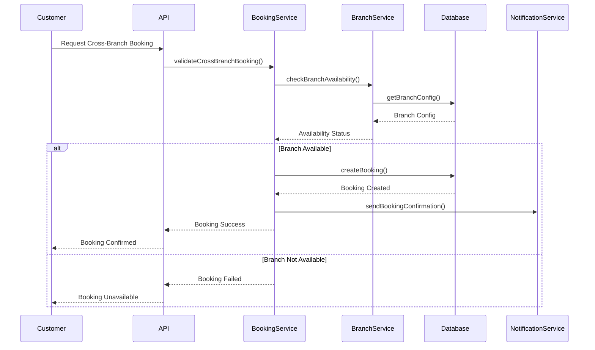
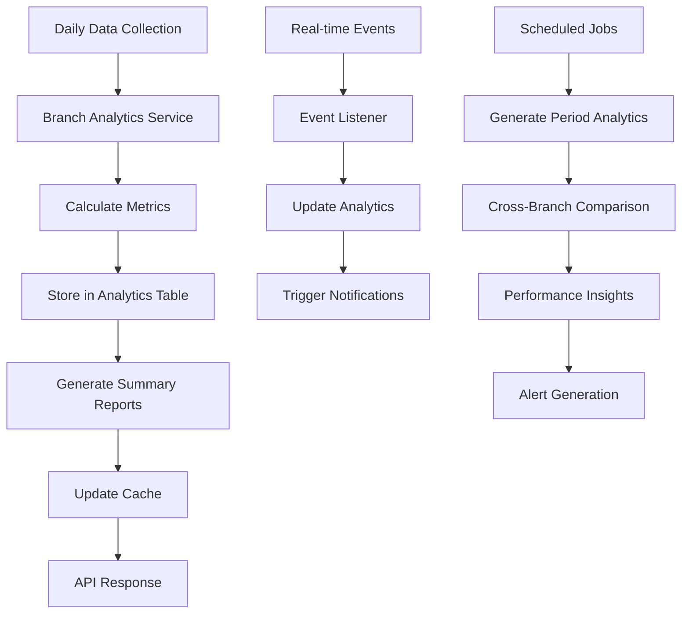
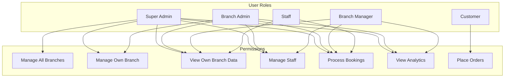
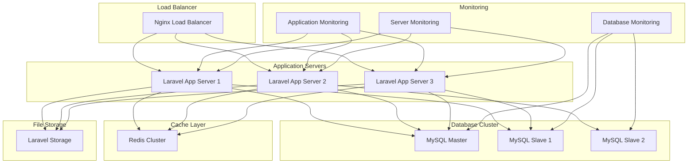

# Multicabang Architecture Diagram

## 🏗️ Arsitektur Sistem Multicabang Raujan Pool Syariah

### 1. Database Schema Overview

### 2. System Architecture Overview

### 3. Branch Management Flow

### 4. Cross-Branch Booking Flow

### 5. Analytics Data Flow

### 6. Security & Access Control

### 7. Deployment Architecture

## 📊 Key Features Summary

### ✅ Implemented Features

- **Branch Management**: CRUD operations untuk cabang
- **Staff Management**: Penugasan dan manajemen staff per cabang
- **Pool Management**: Manajemen kolam renang per cabang
- **Menu Management**: Manajemen menu cafe per cabang
- **Booking Management**: Sistem booking per cabang dan cross-branch
- **Analytics**: Analitik performa per cabang

### 🔧 Technical Features

- **Database Design**: Schema yang terstruktur dengan relasi yang jelas
- **API Design**: RESTful API dengan validasi dan error handling
- **Security**: Role-based access control dan permission management
- **Caching**: Redis cache untuk performa optimal
- **Testing**: Unit dan feature tests yang komprehensif
- **Documentation**: Dokumentasi API yang lengkap

### 📈 Scalability Features

- **Horizontal Scaling**: Load balancer dan multiple app servers
- **Database Scaling**: Master-slave replication
- **Cache Scaling**: Redis cluster untuk high availability
- **File Storage**: Scalable file storage solution
- **Monitoring**: Comprehensive monitoring dan alerting

---

**Versi**: 1.0  
**Tanggal**: 4 September 2025  
**Status**: Planning Complete  
**Dependencies**: Phase 1-6 Complete  
**Next Steps**: Implementation Phase 7.1-7.6
