# Diagram Aktivitas - Sistem Kolam Renang Syariah

## 1. Diagram Aktivitas Registrasi Member

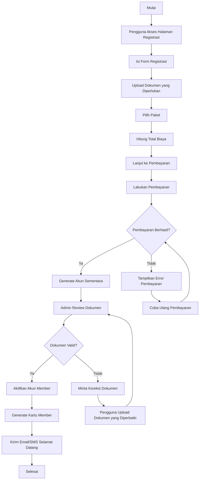

## 2. Diagram Aktivitas Proses Booking

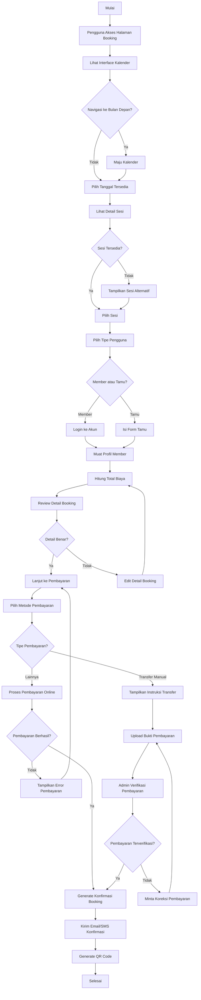

## 3. Diagram Aktivitas Proses Pesanan Kafe

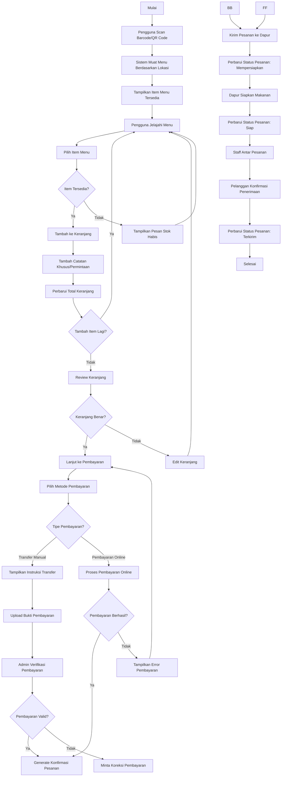

## 4. Diagram Aktivitas Sistem Rating

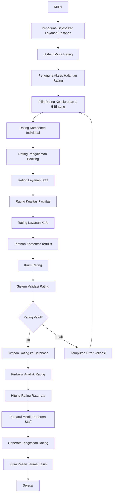

## 5. Diagram Aktivitas Proses Check-in

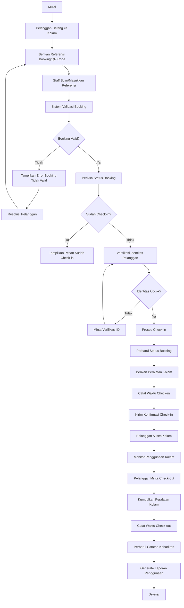

## 6. Diagram Aktivitas Harga Promosi

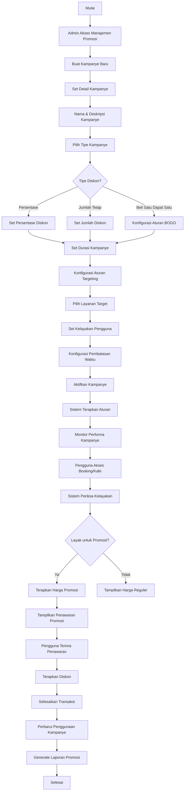

## 7. Diagram Aktivitas Pembayaran Manual

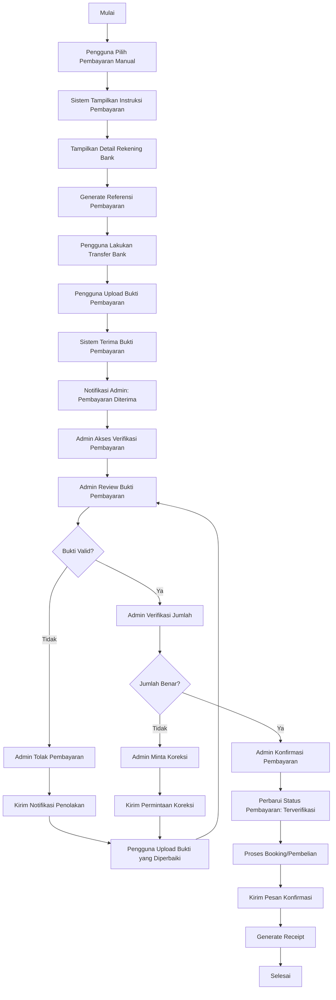

## 8. Diagram Aktivitas Kuota Member Dinamis

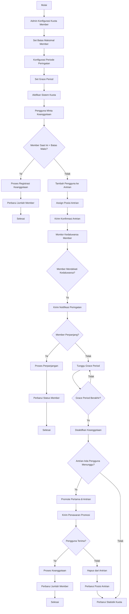

## 9. Diagram Aktivitas Batas Harian Berenang Member

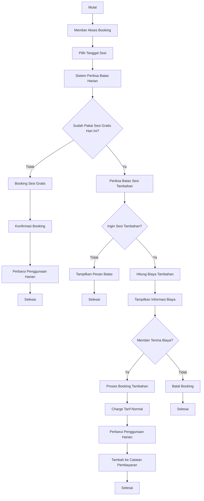

## 10. Diagram Aktivitas Sewa Kolam Privat

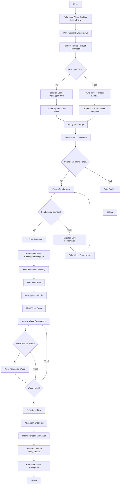

## 11. Diagram Aktivitas Sistem Kafe dengan Barcode

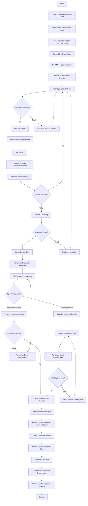

## 12. Diagram Aktivitas Manajemen Menu Dinamis

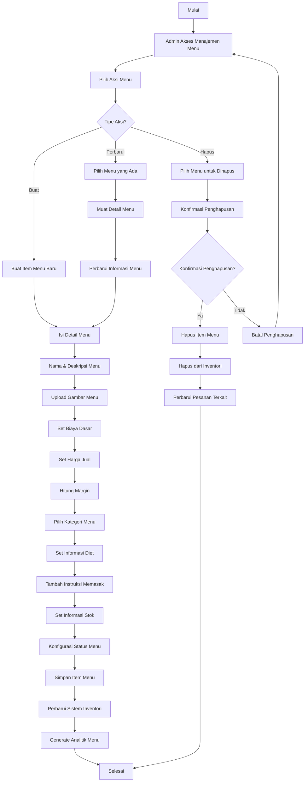

## 13. Diagram Aktivitas Generate & Download Barcode

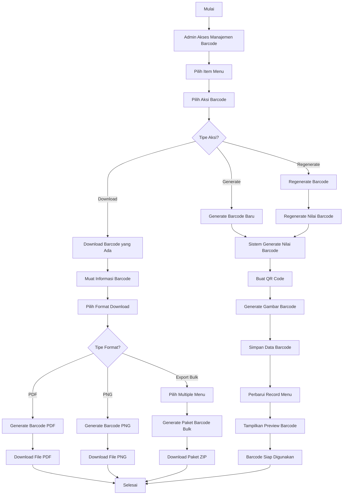

## 14. Diagram Aktivitas Pelaporan Komprehensif

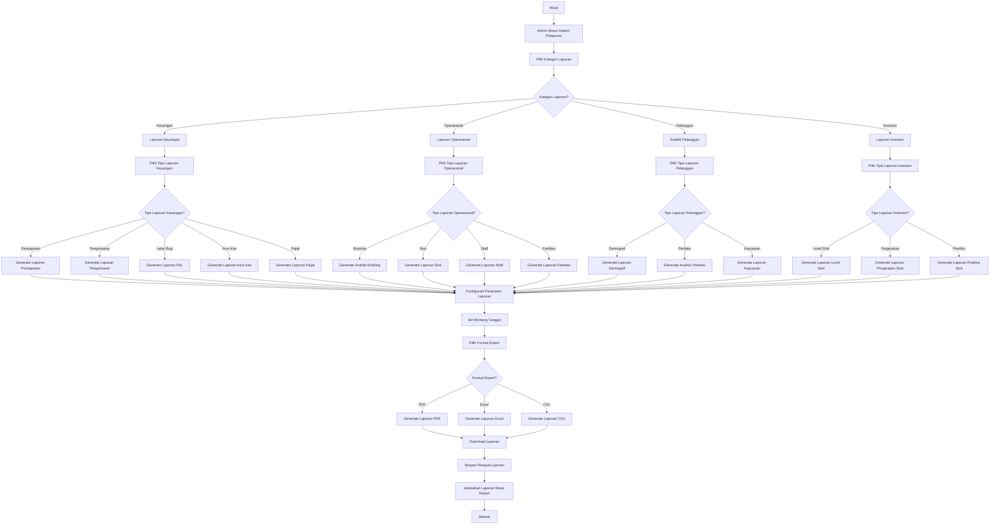
