# Diagram Class - Sistem Kolam Renang Syariah

## 1. Diagram Class Utama

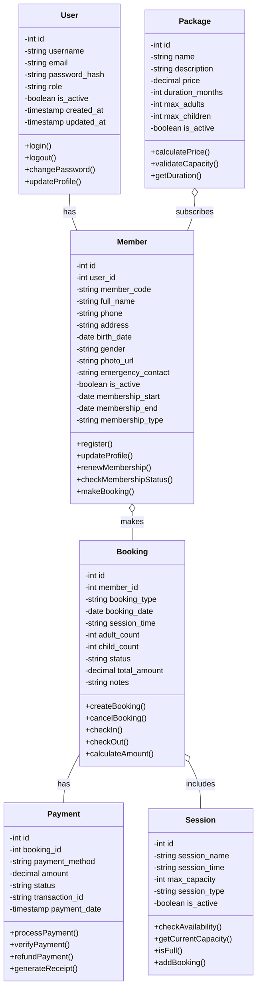

## 2. Diagram Class Sistem Kafe

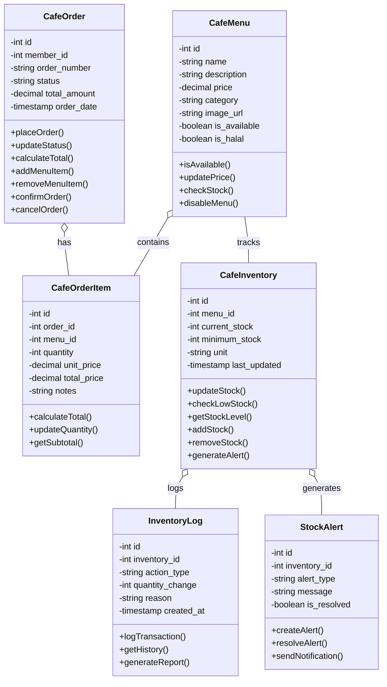

## 3. Diagram Class Sistem Rating & Review

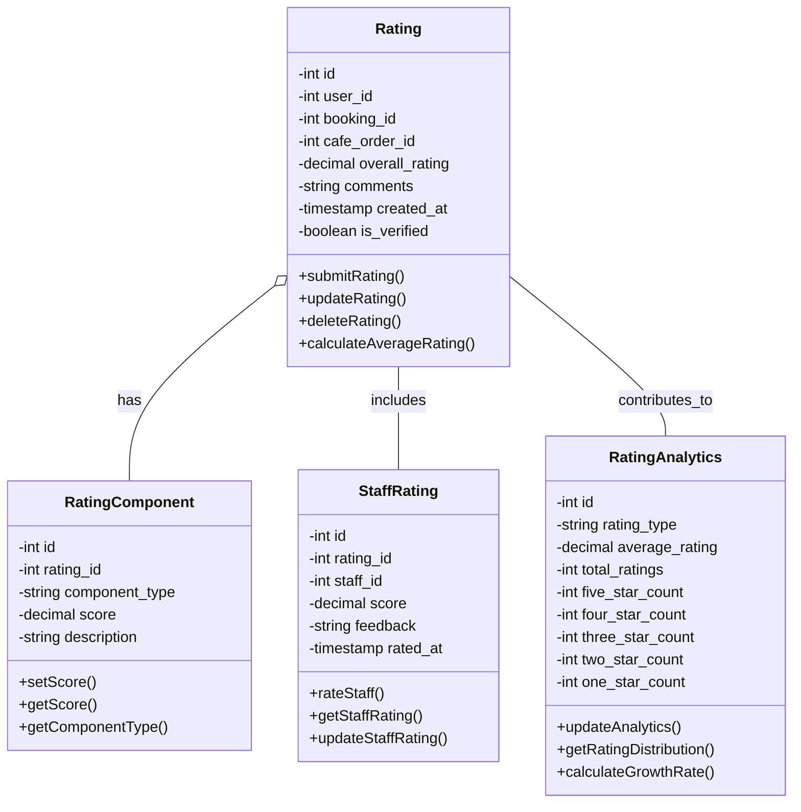

## 4. Diagram Class Sistem Promosi

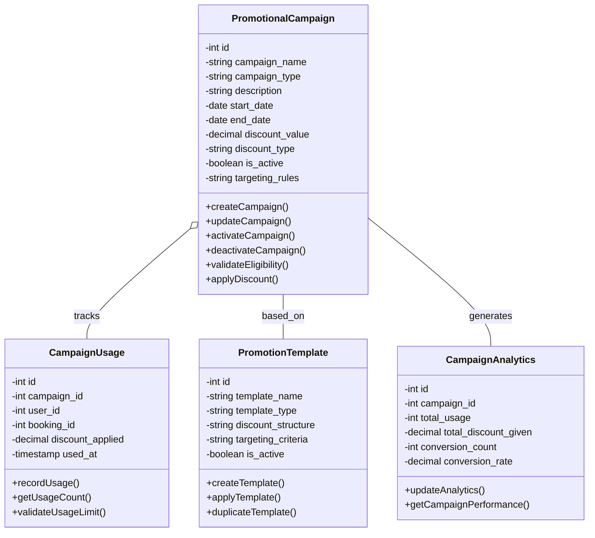

## 5. Diagram Class Sistem Pembayaran Manual

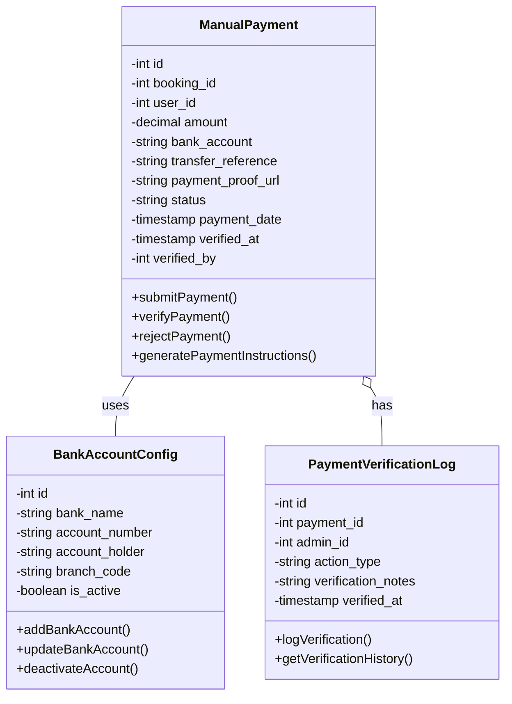

## 6. Diagram Class Manajemen Kuota Member Dinamis

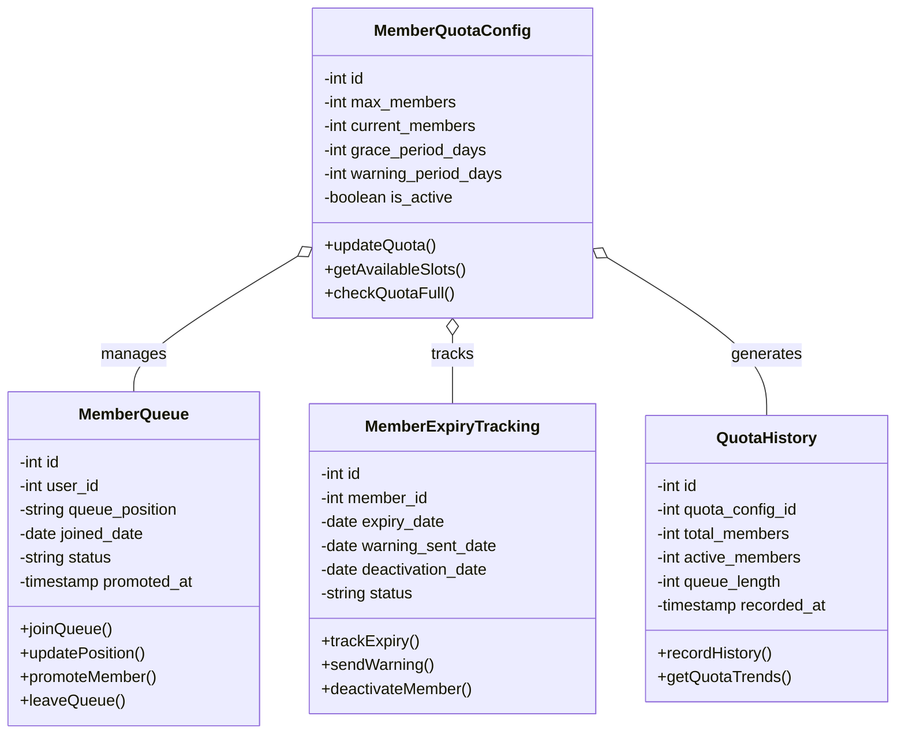

## 7. Diagram Class Batas Harian Berenang Member

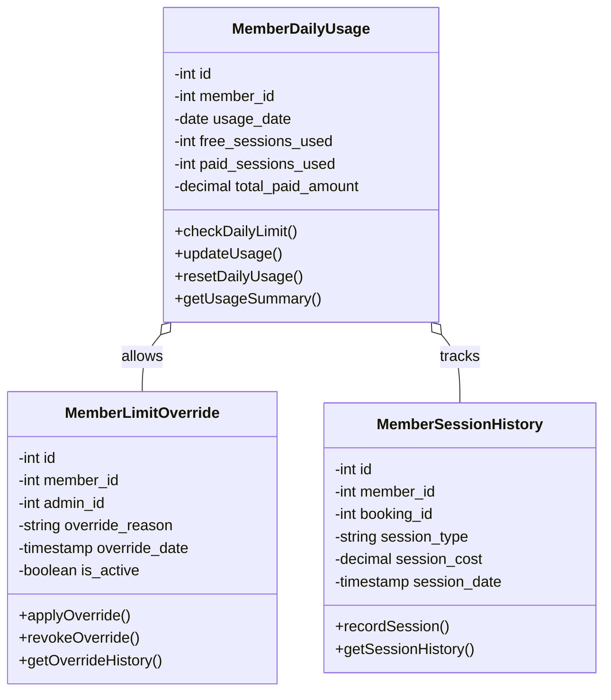

## 8. Diagram Class Sistem Sewa Kolam Privat

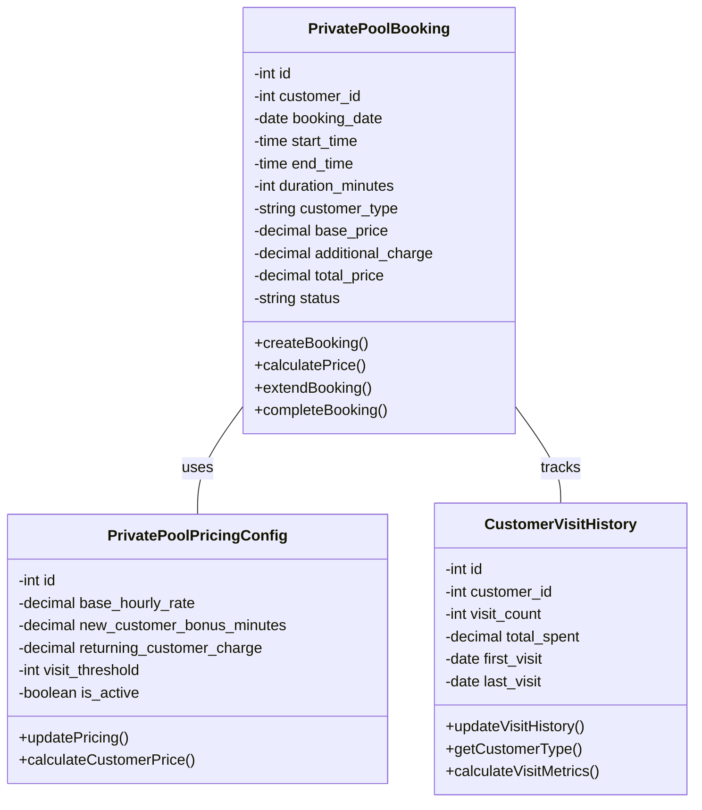

## 9. Diagram Class Sistem Barcode

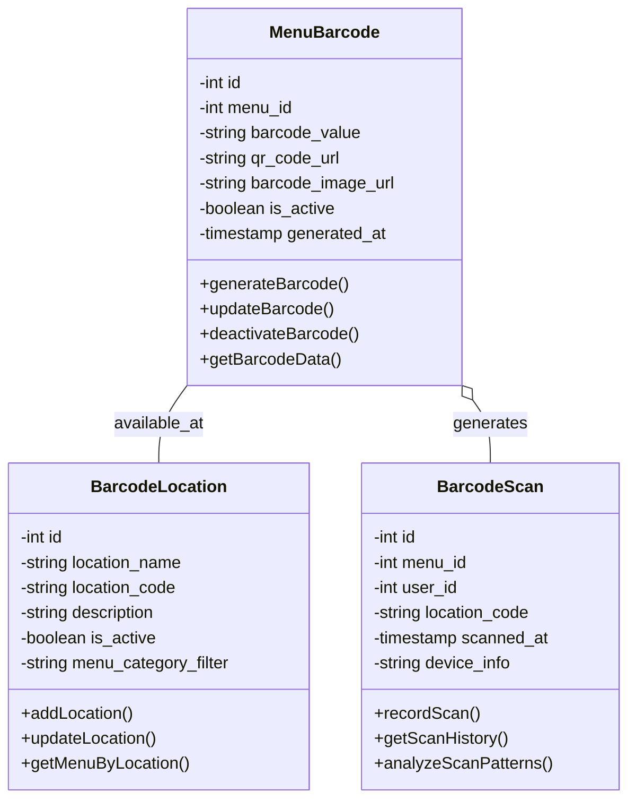

## 10. Diagram Class Sistem Pelaporan Komprehensif

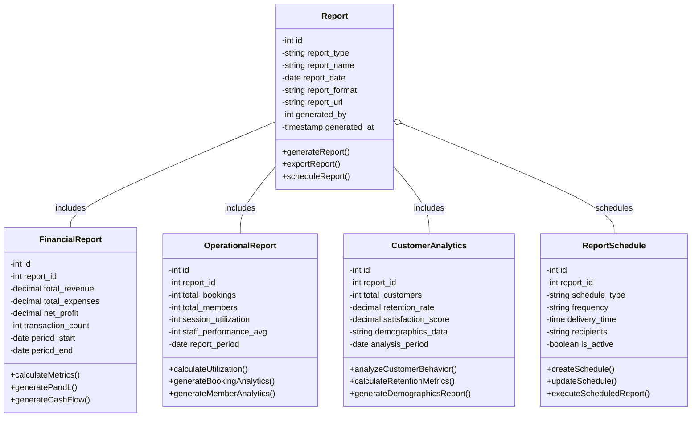

## 11. Diagram Class Integrasi Sistem

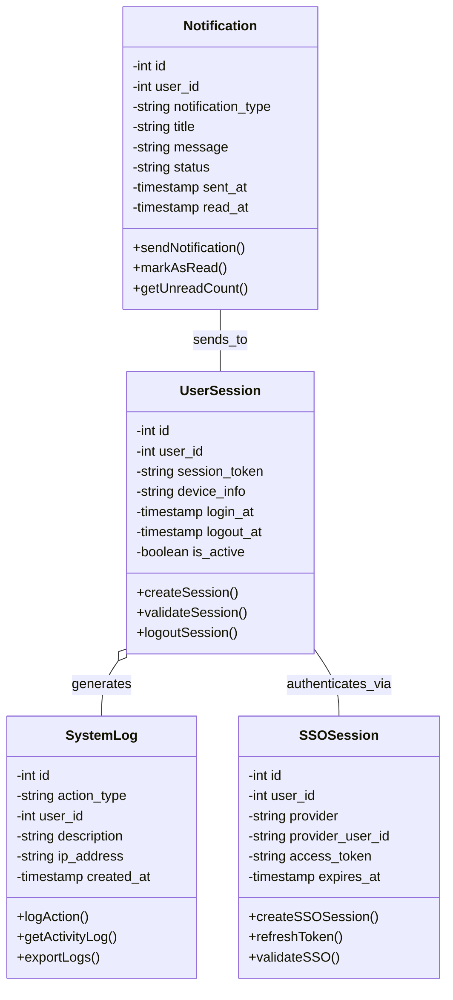
