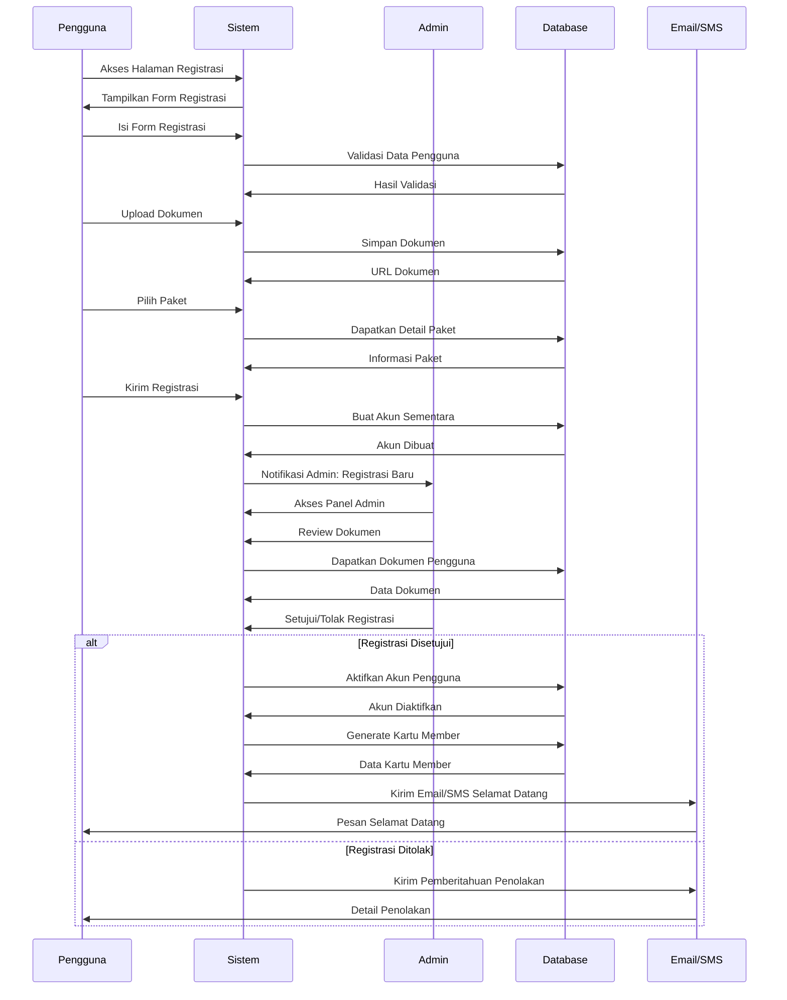
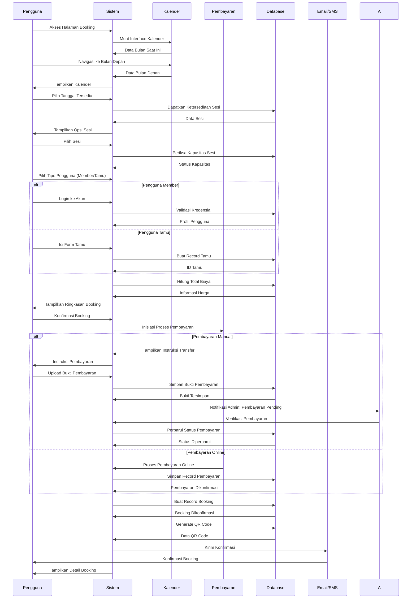
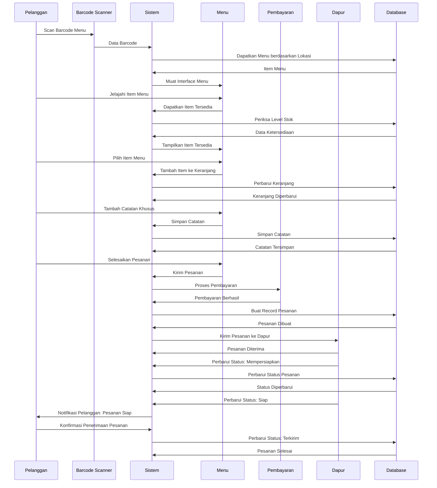
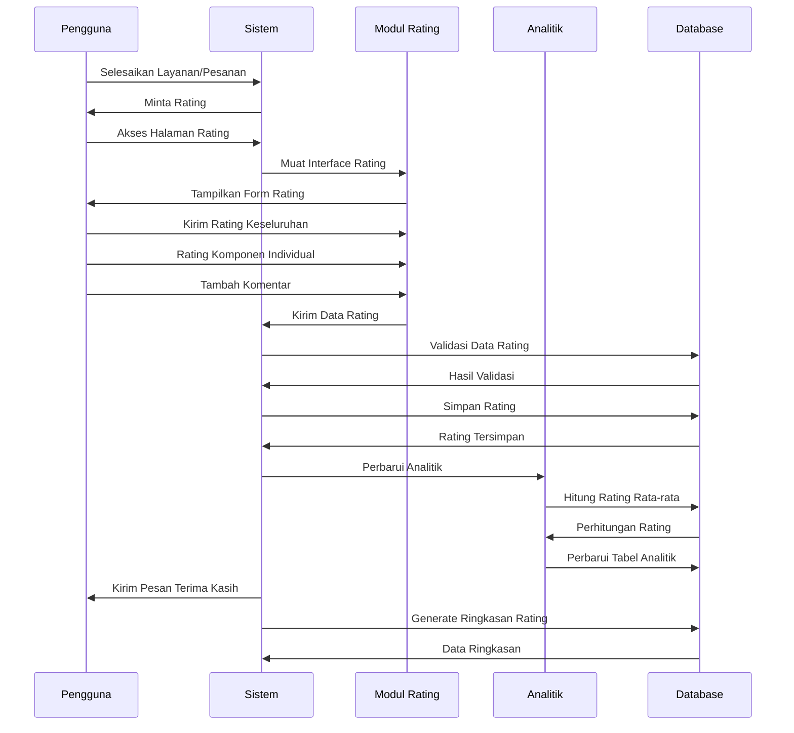
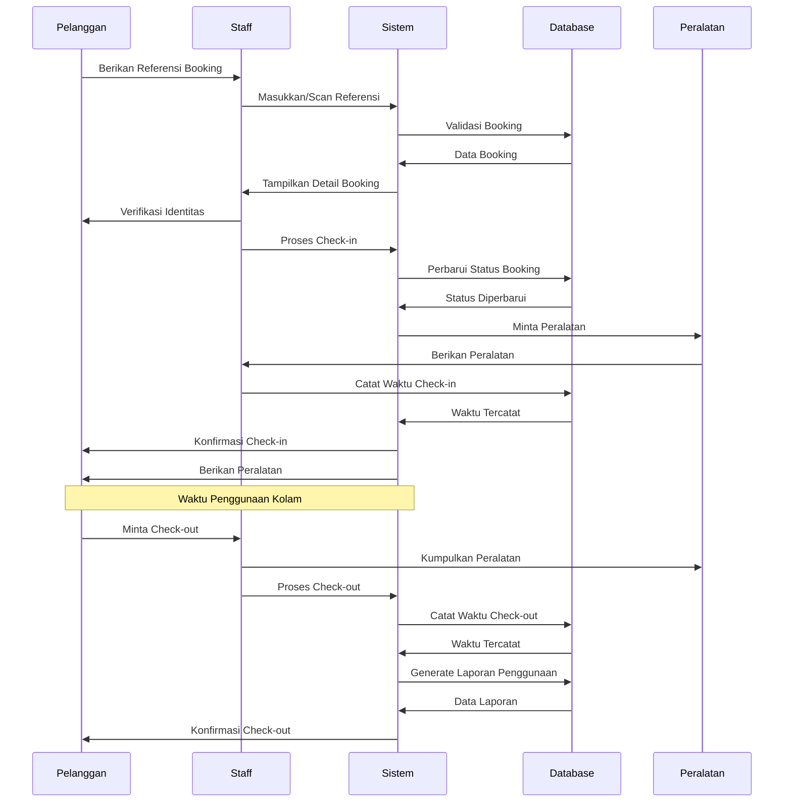
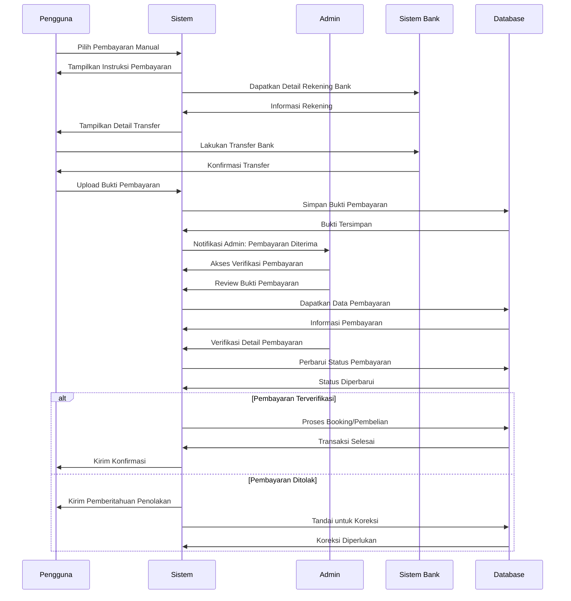
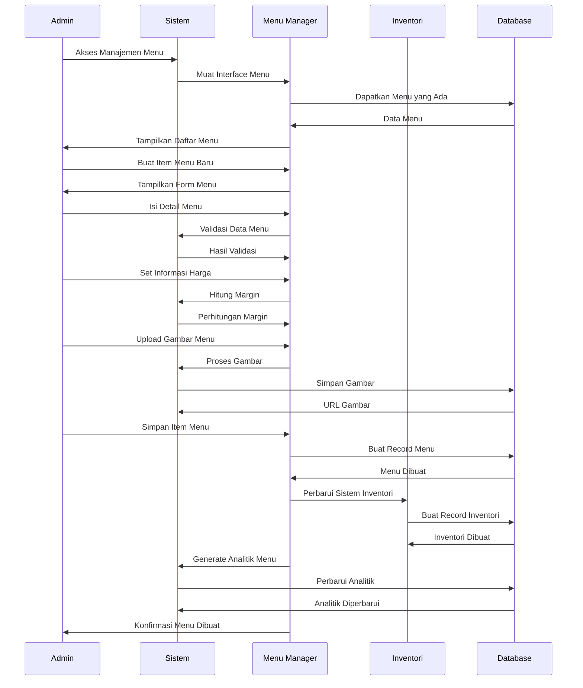
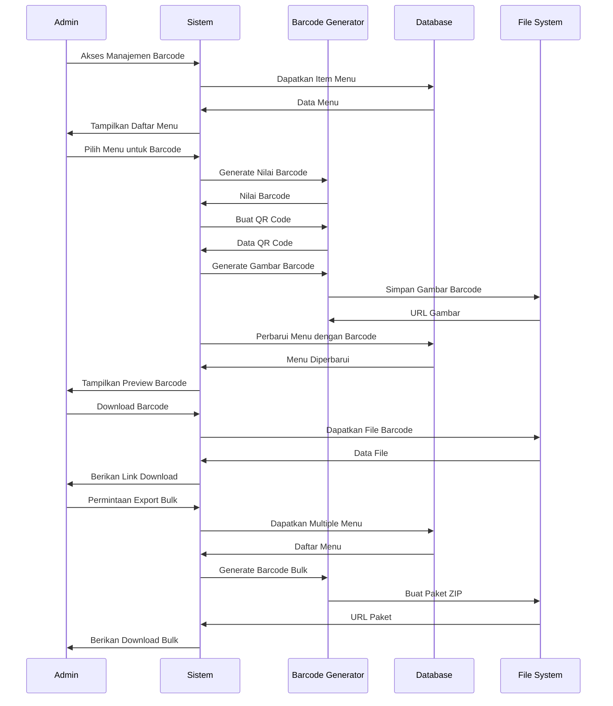
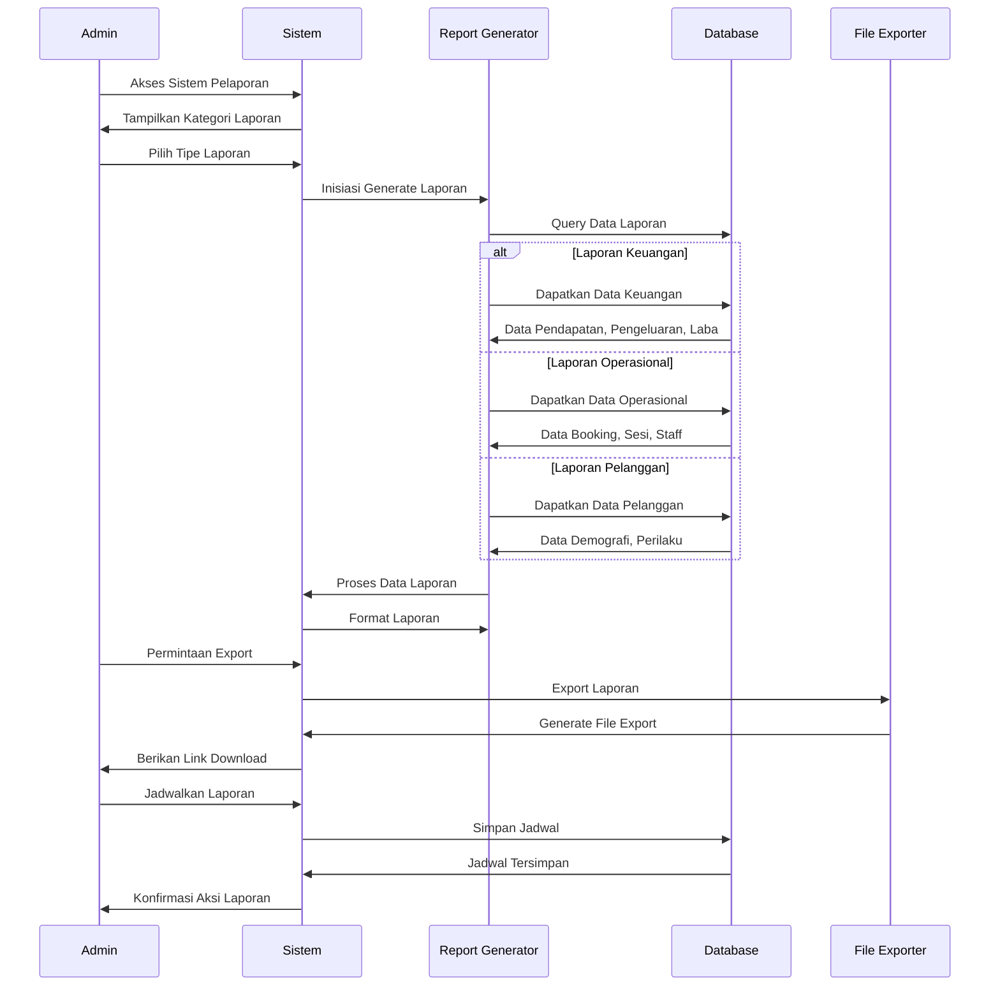

# Diagram Sequence - Sistem Kolam Renang Syariah

## 1. Diagram Sequence Registrasi Member

## 2. Diagram Sequence Proses Booking

## 3. Diagram Sequence Proses Pesanan Kafe

## 4. Diagram Sequence Sistem Rating

## 5. Diagram Sequence Proses Check-in

## 6. Diagram Sequence Sistem Pembayaran Manual

## 7. Diagram Sequence Manajemen Menu Dinamis

## 8. Diagram Sequence Generate & Download Barcode

## 9. Diagram Sequence Sistem Pelaporan Komprehensif

